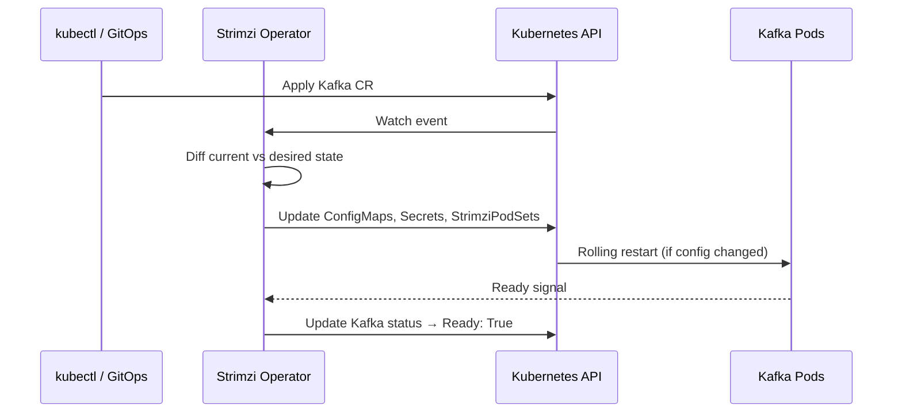
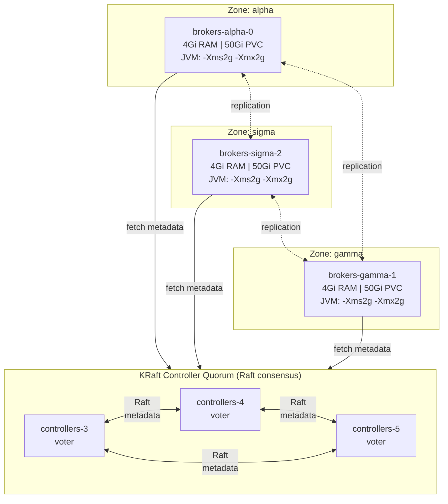
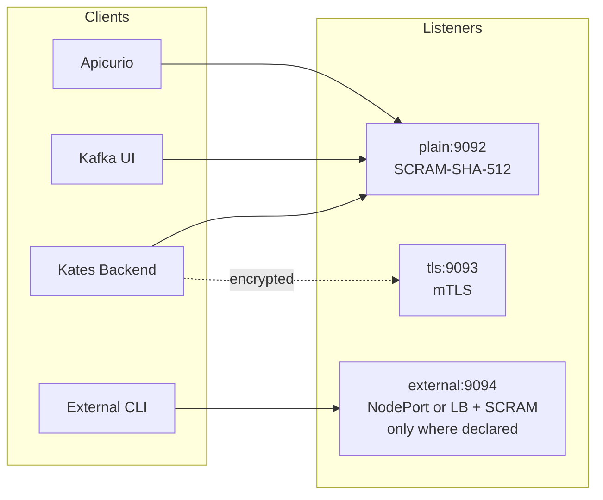
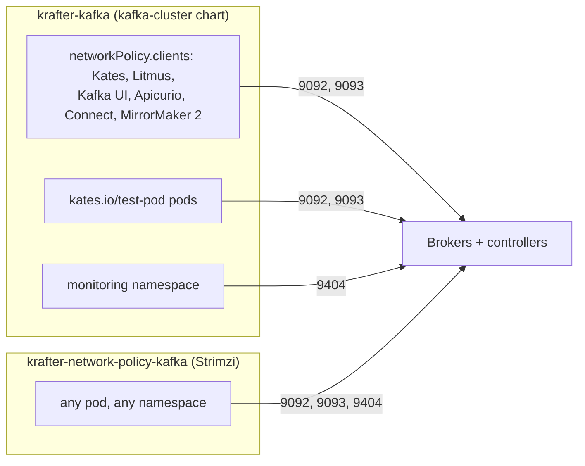
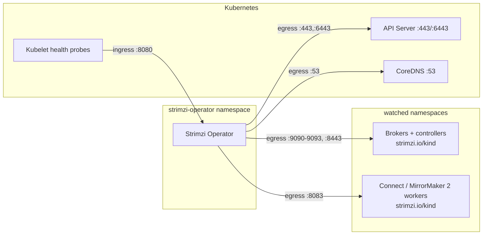
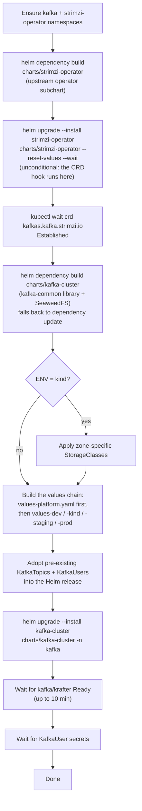

# Kafka Deployment Engineering

> **Scope**: this chapter owns the *why* — the production engineering behind the cluster: node pools, listeners design, certificates, Cruise Control, alerting, and backup. For the step-by-step install walkthrough, see [Installing Kafka with the kafka-cluster Helm Chart](20-installation-guide.md); for deploying the Kates stack, see [Deployment Guide](12-deployment.md).

This chapter is the operations manual for the **krafter** Kafka cluster — the Strimzi-managed, KRaft-mode deployment that underpins the entire Kates platform. It covers every layer from the operator to the broker JVM, with the reasoning behind each decision. It's written for the platform engineers who run `krafter` and for anyone who has to defend its design in review.

After this chapter, you can:

- Explain why the cluster separates KRaft controllers from brokers, and why three of each is the fault-tolerance floor
- Read a `KafkaNodePool` spec and justify its storage, JVM, and zone-affinity choices
- Trace how listeners, `KafkaUser` credentials, and NetworkPolicies compose the cluster's security posture, and which ports the shipped policies leave open
- Diagnose the common Strimzi failure modes, from empty-egress NetworkPolicies to missing user Secrets

## Strimzi Operator

Kafka on Kubernetes is managed by the **Strimzi Kafka Operator** (`1.2.0`), installed into a dedicated `strimzi-operator` namespace from this repository's wrapper chart, `charts/strimzi-operator` (chart `0.3.0`). This is what `scripts/deploy-kafka.sh` runs on every deploy, unconditionally:

```bash
helm dependency build charts/strimzi-operator
helm upgrade --install strimzi-operator charts/strimzi-operator \
  --namespace strimzi-operator \
  --reset-values \
  --timeout 10m --wait
```

The wrapper declares the upstream `strimzi-kafka-operator` chart as a subchart — which is why `helm dependency build` comes first — and adds what the operator needs to be a managed part of the platform rather than a one-off `--set` invocation: a CRD-upgrade hook that owns the Strimzi CRDs across upgrades, pinned defaults (`watchAnyNamespace`, replicas, resources, reconciliation timeouts) in place of drifting flags, a strict values schema that nests every operator setting under the `strimzi-kafka-operator:` key, the optional Drain Cleaner, and the operator's own PodMonitor, alerts and Grafana dashboards. The install is unconditional by design: the CRD hook is what keeps the CRDs current, so skipping the upgrade when the operator is already there would freeze them at whatever version installed them first. The full lifecycle — adoption, upgrade, rollback, namespace scope — is [Deploying the Strimzi Operator](deploying-strimzi-operator.md).

Strimzi watches for `Kafka`, `KafkaNodePool`, `KafkaTopic`, and `KafkaUser` custom resources and reconciles the desired state into StatefulSets, ConfigMaps, Secrets, and Services.

### Reconciliation Loop


```mermaid
sequenceDiagram
    participant User as kubectl / GitOps
    participant Operator as Strimzi Operator
    participant K8s as Kubernetes API
    participant Pods as Kafka Pods

    User->>K8s: Apply Kafka CR
    K8s->>Operator: Watch event
    Operator->>Operator: Diff current vs desired state
    Operator->>K8s: Update ConfigMaps, Secrets, StrimziPodSets
    K8s->>Pods: Rolling restart (if config changed)
    Pods-->>Operator: Ready signal
    Operator->>K8s: Update Kafka status → Ready: True
```

Key behaviors:
- **Config-only changes** (e.g., `num.io.threads`) trigger a rolling restart of affected pods
- **Storage changes** require manual intervention — Strimzi will not shrink PVCs
- **Version upgrades** are performed as a rolling update, one broker at a time
- **Reconciliation interval** is 120s by default — the operator re-checks cluster state periodically

## Cluster Architecture

The krafter cluster uses **dedicated roles** — controllers and brokers run in separate pods. This is the production-recommended topology for Kafka 4.x with KRaft.


```mermaid
graph TB
    subgraph Controllers["KRaft Controller Quorum (Raft consensus)"]
        C3["controllers-3<br/>voter"]
        C4["controllers-4<br/>voter"]
        C5["controllers-5<br/>voter"]
    end

    subgraph Alpha["Zone: alpha"]
        B0["brokers-alpha-0<br/>4Gi RAM | 50Gi PVC<br/>JVM: -Xms2g -Xmx2g"]
    end

    subgraph Sigma["Zone: sigma"]
        B2["brokers-sigma-2<br/>4Gi RAM | 50Gi PVC<br/>JVM: -Xms2g -Xmx2g"]
    end

    subgraph Gamma["Zone: gamma"]
        B1["brokers-gamma-1<br/>4Gi RAM | 50Gi PVC<br/>JVM: -Xms2g -Xmx2g"]
    end

    C3 <-->|"Raft<br/>metadata"| C4
    C4 <-->|"Raft<br/>metadata"| C5
    C5 <-->|"Raft<br/>metadata"| C3

    B0 -->|"fetch metadata"| Controllers
    B2 -->|"fetch metadata"| Controllers
    B1 -->|"fetch metadata"| Controllers

    B0 <-.->|"replication"| B2
    B2 <-.->|"replication"| B1
    B1 <-.->|"replication"| B0
```

### Why Dedicated Roles?

| Aspect | Combined (controller+broker) | Dedicated (separate pools) |
|--------|:---:|:---:|
| Metadata isolation | ❌ Heavy I/O can delay elections | ✅ Controllers have predictable latency |
| Independent scaling | ❌ Must scale together | ✅ Add brokers without touching quorum |
| Failure blast radius | ❌ One pod loss = quorum + data risk | ✅ Broker loss doesn't affect quorum |
| Resource tuning | ❌ Single memory/CPU profile | ✅ Controllers: 1Gi, Brokers: 4Gi |

### Why 3 Controllers?

KRaft uses **Raft consensus** requiring a majority quorum for metadata operations:

| Controllers | Quorum | Tolerated failures |
|:-----------:|:------:|:------------------:|
| 1 | 1 | 0 — single point of failure |
| 2 | 2 | 0 — both must agree (worse than 1) |
| **3** | **2** | **1** — survives one failure |
| 5 | 3 | 2 — more resilient but higher cost |

Three is the minimum for fault tolerance. Five gives diminishing returns for local/dev environments.

### Why 3 Brokers?

| Reason | Configuration |
|--------|--------------|
| Matches `default.replication.factor: 3` | Each partition has a replica on every broker |
| Satisfies `min.insync.replicas: 2` | Survives 1 broker failure while accepting writes |
| Enables rack awareness | Each broker pinned to a different zone (alpha, sigma, gamma) |
| Balanced partition leadership | 3 brokers = even leader distribution |

## KafkaNodePool Configuration

Each component type is modeled as a `KafkaNodePool` — the modern Strimzi way to manage heterogeneous node groups.

### Controller Pool

```yaml
apiVersion: kafka.strimzi.io/v1
kind: KafkaNodePool
metadata:
  name: controllers
spec:
  replicas: 3
  roles: [controller]
  storage:
    type: jbod
    volumes:
      - id: 0
        type: persistent-claim
        size: 5Gi
        deleteClaim: false
  resources:
    requests: { memory: 1Gi, cpu: 500m }
    limits:   { memory: 1Gi, cpu: 1000m }
```

Controllers need minimal storage (metadata only) and limited CPU. The 1Gi memory limit is sufficient since the Raft log is compact.

### Broker Pools (per-zone)

Each zone gets its own pool, pinned via `nodeAffinity`:

```yaml
apiVersion: kafka.strimzi.io/v1
kind: KafkaNodePool
metadata:
  name: brokers-alpha
spec:
  replicas: 1
  roles: [broker]
  jvmOptions:
    -Xms: 2048m
    -Xmx: 2048m
    gcLoggingEnabled: true
  storage:
    type: jbod
    volumes:
      - id: 0
        type: persistent-claim
        size: 50Gi
        class: local-storage-alpha
        deleteClaim: false
  resources:
    requests: { memory: 4Gi, cpu: 1000m }
    limits:   { memory: 4Gi, cpu: 2000m }
  template:
    pod:
      affinity:
        nodeAffinity:
          requiredDuringSchedulingIgnoredDuringExecution:
            nodeSelectorTerms:
              - matchExpressions:
                  - key: topology.kubernetes.io/zone
                    operator: In
                    values: [alpha]
```

**Design decisions:**

| Setting | Value | Rationale |
|---------|-------|-----------|
| `jvmOptions -Xms/-Xmx` | 2048m | Fixed heap prevents dynamic resizing under load |
| `gcLoggingEnabled` | true | GC logs for diagnosing latency spikes |
| Memory requests = limits | 4Gi | Guaranteed QoS — pod won't be evicted under memory pressure |
| `deleteClaim: false` | — | PVCs survive pod deletion — data preserved for recovery |
| StorageClass per zone | `local-storage-*` | Data locality — reads don't cross network boundaries |

## Kafka Broker Configuration

The Kafka CR's `spec.kafka.config` section controls broker behavior:

### Replication & Durability

```yaml
offsets.topic.replication.factor: 3
transaction.state.log.replication.factor: 3
transaction.state.log.min.isr: 2
default.replication.factor: 3
min.insync.replicas: 2
```

With RF=3 and ISR=2, every `acks=all` write requires at least one follower acknowledgment. This is the primary contributor to producer latency but guarantees zero data loss under single-broker failure.

### Retention & Storage

```yaml
log.retention.hours: 24        # Time-based retention
log.retention.bytes: 10737418240  # 10GB per partition
log.segment.bytes: 1073741824  # 1GB segments
log.cleanup.policy: delete     # No compaction by default
```

### Threading Model

```yaml
num.io.threads: 8          # Disk I/O threads
num.network.threads: 5     # Network handler threads
num.replica.fetchers: 3    # One fetcher per remote broker
```

### Quotas

```yaml
quota.producer.default: 52428800   # 50MB/s per producer
quota.consumer.default: 104857600  # 100MB/s per consumer
```

Default quotas prevent a single runaway producer or consumer from starving others. These are overridden per-user via `KafkaUser` quotas.

### Kafka 4.x Features

```yaml
group.share.enable: true  # KIP-932 Share Groups
```

Share Groups enable queue-style (competing consumer) semantics alongside traditional consumer groups — useful for job distribution workloads.

### KRaft Quorum Tuning

```yaml
controller.quorum.election.timeout.ms: 5000
controller.quorum.fetch.timeout.ms: 10000
controller.quorum.election.backoff.max.ms: 5000
```

These control how quickly the Raft quorum detects a failed controller and elects a new leader. The 5s election timeout balances fast failover against false-positive elections during GC pauses.

## Listeners & Authentication


```mermaid
graph LR
    subgraph Clients
        Kates[Kates Backend]
        KUI[Kafka UI]
        Apicurio[Apicurio]
        External[External CLI]
    end

    subgraph Listeners
        P["plain:9092<br/>SCRAM-SHA-512"]
        T["tls:9093<br/>mTLS"]
        E["external:9094<br/>NodePort or LB + SCRAM<br/>only where declared"]
    end

    Kates --> P
    KUI --> P
    Apicurio --> P
    External --> E
    Kates -.->|"encrypted"| T
```

| Listener | Port | Type | Auth | TLS | Use Case |
|----------|------|------|------|-----|----------|
| `plain` | 9092 | internal | SCRAM-SHA-512 | No | Service-to-service within the cluster |
| `tls` | 9093 | internal | mTLS | Yes | Encrypted internal traffic |
| `external` | 9094 | nodeport or loadbalancer | SCRAM-SHA-512 | Yes | Access from outside the cluster, where the values chain declares it |

The base values declare only `plain` and `tls`. `kafka.externalAccess.type` defaults to `none`, and of the chart's overlays only `values-prod.yaml` turns the preset on, as a NodePort. `kates deploy` and `scripts/deploy-kafka-generic.sh` declare `external` on every cluster but kind, in the generated `.build/values-detected.yaml`: a NodePort, or a LoadBalancer on EKS, GKE and AKS, whose broker load balancers usually get public addresses ([Security & Compliance](17-security.md#what-the-shipped-policies-block) explains). `kubectl get kafka krafter -n kafka -o jsonpath='{.spec.kafka.listeners[*].name}'` lists the listeners a running cluster has. `kafka.externalAccess.allowedCidrs` does not limit who can reach 9094; [Security & Compliance](17-security.md#closing-the-listeners) shows what does.

### Authorization

Simple ACL authorization with `kates-backend` as a superUser:

```yaml
authorization:
  type: simple
  superUsers:
    - kates-backend
```

## KafkaUser Management

Users are declared as `KafkaUser` CRDs — Strimzi creates a Kubernetes Secret with the auto-generated SCRAM password:

| User | Role | Quotas | ACLs |
|------|------|--------|------|
| `kates-backend` | superUser | None (unlimited) | Bypasses authorization |
| `kafka-ui` | Read-only monitor | 1MB/s produce, 50MB/s consume, 10% CPU | Describe+Read on all topics/groups |
| `apicurio-registry` | Schema registry | 10MB/s produce, 20MB/s consume, 15% CPU | CRUD on `__apicurio*` topics only |
| `litmus-chaos` | Chaos testing | None | Full CRUD on all topics |
| `kates-connect` | Kafka Connect workers | 50MB/s produce, 50MB/s consume, 25% CPU | Read/Write/Create on `kates-*` and `cdc*` topics, `connect-*` groups, transactional IDs |

**Secret flow:**

```text
KafkaUser CR → Strimzi User Operator → Kubernetes Secret (name = user name)
                                       → SCRAM credentials in Kafka
                                       → ACLs applied to authorization
```

Other services reference the secret by name (e.g., Kafka UI mounts `secret/kafka-ui`).

## Topic Provisioning

Topics are declared as `KafkaTopic` CRDs, managed by the Topic Operator:

| Topic | Partitions | Replicas | Retention | Compression | Purpose |
|-------|:----------:|:--------:|-----------|:-----------:|---------|
| `kates-events` | 6 | 3 | 48h | — | Test lifecycle events |
| `kates-results` | 12 | 3 | 7d | lz4 | Test results and metrics |
| `kates-metrics` | 6 | 3 | 24h | lz4 | Real-time broker metrics |
| `kates-audit` | 3 | 3 | 30d | — | Audit trail |
| `kates-dlq` | 3 | 3 | ∞ | — | Dead letter queue |
| `cdc-schema-history` | 1 | 3 | ∞, no size limit | — | Debezium schema history |
| `cdc-heartbeat` | 1 | 3 | 24h | — | Debezium heartbeat |
| `test-sink-topic` | 3 | 3 | 24h | — | Connect sink-connector validation |

**Partition rationale:** `kates-results` has 12 partitions (4× the broker count) for maximum consumer parallelism during high-throughput test runs. `kates-audit` has 3 (one per broker) since writes are infrequent.

**Cleanup policy:** every topic here is `cleanup.policy: delete` — none is compacted, and two of them would break if they were. Debezium writes its schema history without record keys, which a compacted topic refuses, and replays the whole history on restart, so `cdc-schema-history` keeps `retention.ms: -1` and `retention.bytes: -1` (the second overrides the brokers' 10 GiB `log.retention.bytes`). `kates-dlq` is a delete topic because compaction keeps only the latest failure per key and refuses records without one. It has no time limit because it keeps the retention it had as a compacted topic, so an upgrade from that topic deletes nothing by age; only the brokers' `log.retention.bytes` bounds it until you set a `retention.ms` to age failures out.

## Certificate Management

Strimzi auto-generates and rotates two CA hierarchies:

| CA | Validity | Renewal | Policy | Protects |
|----|----------|---------|--------|----------|
| Cluster CA | 5 years | 180 days before expiry | `replace-key` | Inter-broker TLS, controller mesh |
| Clients CA | 5 years | 180 days before expiry | `replace-key` | Client mTLS certificates |

The `replace-key` policy generates a new key pair during renewal — stronger than `renew-certificate` which reuses the existing key.

## Network Policies

With `networkPolicy.enabled` on — the chart default, which `values-staging.yaml` and `values-prod.yaml` keep and `values-kind.yaml` and `values-dev.yaml` turn off — the chart renders a deny-all policy for the cluster's pods and one allow policy per component. The Strimzi Cluster Operator adds a policy of its own for the brokers, and the two sets add up:


```mermaid
graph LR
    subgraph Chart["krafter-kafka (kafka-cluster chart)"]
        clients["networkPolicy.clients: Kates, Litmus,<br/>Kafka UI, Apicurio, Connect, MirrorMaker 2"]
        tests["kates.io/test-pod pods"]
        monitoring["monitoring namespace"]
    end
    subgraph Strimzi["krafter-network-policy-kafka (Strimzi)"]
        anyone["any pod, any namespace"]
    end
    clients -->|"9092, 9093"| Brokers["Brokers + controllers"]
    tests -->|"9092, 9093"| Brokers
    monitoring -->|"9404"| Brokers
    anyone -->|"9092, 9093, 9404"| Brokers
```

Every policy kafka-cluster 1.0 renders is named `<cluster>-…`, so two clusters can share a namespace without fighting over one object:

| Policy | What It Allows |
|--------|---------------|
| `krafter-default-deny` | Nothing, for every pod labelled `app.kubernetes.io/part-of: strimzi-krafter`: those pods get only what another policy allows |
| `krafter-allow-dns` | UDP/TCP port 53 for those same pods |
| `krafter-kafka` | Brokers and controllers: inter-cluster traffic on 9090–9093, the Cluster Operator on 9090/9091/8443/9092/9093, Prometheus on 9404, and each entry in `networkPolicy.clients` on the listener ports it names |
| `krafter-cruise-control` | Operator and Prometheus access to Cruise Control |
| `krafter-entity-operator` | Entity Operator metrics ingress and egress to the brokers |
| `krafter-kafka-exporter` | Exporter metrics ingress and egress to the brokers |
| `krafter-test-egress` | The Helm test pods' egress to the Kafka ports, DNS and the API server |

::: {.callout-important}
NetworkPolicies add up: a connection that **any** policy allows gets through. The Strimzi Cluster Operator generates `krafter-network-policy-kafka` for the brokers, and in it a listener without `networkPolicyPeers` admits every pod in every namespace, as does the metrics port 9404. No listener in the chart's values has peers, so ports 9092 and 9093 are open to the whole cluster whatever `networkPolicy.clients` says. The internal ports 9090, 9091 and 8443 are closed in every profile, by that same Strimzi policy, which admits only the cluster's own pods and the Cluster Operator to them; what the chart's policies add, where they render, is the limit on the brokers' egress and a deny-all for the cluster's other pods. [Security & Compliance](17-security.md#closing-the-listeners) shows how to close the listeners and how to test the result.
:::

::: {.callout-note}
kafka-cluster 1.0 dropped the policies that selected **other releases'** pods — the Cluster Operator's, the drain cleaner's, kafka-ui's, MirrorMaker 2's and Connect's. The operator's and drain cleaner's belong to `charts/strimzi-operator`; kafka-ui, connect-cluster and mirror-maker2 each render their own. Which workloads the chart's own `krafter-kafka` policy admits to which listener is one list, `networkPolicy.clients`, with the ports derived from `kafka.listeners`. It becomes the real allow list only once the listeners carry `networkPolicyPeers`.
:::

### Hardened Strimzi Operator NetworkPolicy (Isolated Topology)

When deploying with `kates deploy --topology isolated` (the kates CLI's default topology), the Strimzi Operator runs in a dedicated `strimzi-operator` namespace, separate from the Kafka application namespace. That needs a precisely scoped NetworkPolicy, and since strimzi-operator 0.3 the wrapper chart renders it: `operatorPolicy.enabled`, on by default, produces one policy named after the release (`strimzi-operator`) in the operator's own namespace. kafka-cluster 0.4 used to write a fixed-name policy *into* the operator's namespace, so two Kafka releases naming the same operator fought over one object; kafka-cluster 1.0 no longer renders it at all.


```mermaid
graph LR
    subgraph "strimzi-operator namespace"
        OP["Strimzi Operator"]
    end

    subgraph "watched namespaces"
        Brokers["Brokers + controllers<br/>strimzi.io/kind"]
        Workers["Connect / MirrorMaker 2 workers<br/>strimzi.io/kind"]
    end

    subgraph Kubernetes
        API["API Server :443/:6443"]
        DNS["CoreDNS :53"]
        Kubelet["Kubelet health probes"]
    end

    Kubelet -->|"ingress :8080"| OP
    OP -->|"egress :53"| DNS
    OP -->|"egress :443,:6443"| API
    OP -->|"egress :9090-9093, :8443"| Brokers
    OP -->|"egress :8083"| Workers
```

| Direction | Target | Ports | Purpose |
|-----------|--------|-------|---------|
| Ingress | All sources | `8080` TCP | Kubelet health probes + Prometheus metrics scraping |
| Egress | CoreDNS | `53` UDP/TCP | DNS resolution for service discovery |
| Egress | API Server | `443`, `6443` TCP | Kubernetes API communication (watch, patch, create) |
| Egress | Pods labelled `strimzi.io/kind` in every watched namespace | `9090`–`9093`, `8443` TCP | Broker and controller control plane, replication, clients, and the Kafka agent the operator asks for broker state during a roll |
| Egress | The same pods | `8083` TCP | Connect and MirrorMaker 2 worker REST, through which connectors are created and polled |
| Egress | Own namespace's operator pods | All | Leader-election peers |

The watch scope decides which namespaces that egress reaches: every namespace under `watchAnyNamespace`, otherwise `watchNamespaces` plus the release namespace. The policy records the answer in its `kates.io/watch-scope` annotation, which is the quickest way to confirm what the running operator is actually allowed to reach.

::: {.callout-important}
The operator ingress on port `8080` is intentionally open to **all sources** (not scoped to a specific namespace). This is required because Kubelet health probes originate from the node's host network — not from a pod with namespace labels. Restricting ingress to a namespace selector would silently block liveness and readiness checks, causing the operator pod to be restarted by the Kubelet.
:::

::: {.callout-caution}
**Two upstream keys are easy to confuse, and only one of them can produce an empty-egress operator policy.**

`strimzi-kafka-operator.operatorNetworkPolicy.enabled` (upstream default `false`) renders `strimzi-cluster-operator-network-policy` from the `ingress` and `egress` lists beside it. Upstream's defaults are the metrics ingress and an unrestricted `egress: [{}]`. Enabled as shipped, it never blocks the operator, but it undoes the egress scoping in the table above: it selects the same pod as the wrapper's `strimzi-operator` policy, policies add up, and `egress: [{}]` allows every destination. `charts/strimzi-operator/values-prod.yaml` enables it, so an operator installed with that overlay has unrestricted egress; add `--set strimzi-kafka-operator.operatorNetworkPolicy.enabled=false` after the overlay to leave the scoped policy in charge. Replace that `egress` with an empty list while `operatorPolicy` is off, though, and nothing grants the operator any egress: it cannot reach the controllers' admin API on 9090 and the Kafka CR stays `NotReady` indefinitely.

`strimzi-kafka-operator.generateNetworkPolicy` (upstream default `true`) is a different thing entirely. It sets `STRIMZI_NETWORK_POLICY_GENERATION` and controls whether the operator generates NetworkPolicies for its **operands**, including the `krafter-network-policy-kafka` that opens the listeners (see [Network Policies](#network-policies)) — it never creates a policy for the operator pod. Turning it off does not fix a deny-all operator policy.

Both live under the `strimzi-kafka-operator:` key in the wrapper chart, whose schema rejects them at the top level rather than silently ignoring them.
:::

## Operational Components

### Cruise Control

Cruise Control provides automated partition rebalancing based on broker resource utilization:

```yaml
cruiseControl:
  brokerCapacity:
    cpu: "2000m"
    inboundNetwork: 50MiB/s
    outboundNetwork: 50MiB/s
    disk: 50Gi
```

The `brokerCapacity` config tells CC the physical limits of each broker, enabling accurate rebalance proposals. Without it, CC can't distinguish between "broker is 80% utilized" and "broker has headroom."

**Rebalance workflow:**

```bash
# Generate a rebalance proposal
kubectl apply -f config/kafka/kafka-rebalance.yaml

# Check the proposal
kubectl get kafkarebalance full-rebalance -n kafka -o jsonpath='{.status}'

# Approve it
kubectl annotate kafkarebalance full-rebalance \
  strimzi.io/rebalance=approve -n kafka
```

### Kafka Exporter

The Kafka Exporter sidecar exposes consumer lag metrics that the JMX exporter doesn't cover:

| Metric | What It Tracks |
|--------|---------------|
| `kafka_consumergroup_lag` | Per-partition consumer lag |
| `kafka_consumergroup_current_offset` | Current committed offset |
| `kafka_topic_partitions` | Partition count per topic |
| `kafka_topic_partition_current_offset` | Latest offset per partition |

These metrics power the consumer lag alerts in `kafka-alerts.yaml`.

### Strimzi Drain Cleaner

The Drain Cleaner intercepts Kubernetes node drain events and gracefully rolls Kafka pods instead of abruptly killing them:

```text
kubectl drain node → Drain Cleaner webhook intercepts →
  Annotates pod with strimzi.io/delete-pod-and-pvc →
  Strimzi operator performs controlled rolling restart →
  Pod migrates to another node with data intact
```

Without the Drain Cleaner, `kubectl drain` can evict broker pods simultaneously, violating ISR constraints and potentially causing data loss.

### Entity Operator

The Entity Operator runs two sub-operators in a single pod:

| Sub-Operator | Manages | Reconciliation |
|-------------|---------|---------------|
| Topic Operator | `KafkaTopic` CRs → Kafka topics | Every 60s |
| User Operator | `KafkaUser` CRs → SCRAM credentials + ACLs | On change |

## Prometheus Alerts

The alerting rules in `kafka-alerts.yaml` cover six categories:

### Cluster Health

| Alert | Condition | Severity |
|-------|-----------|----------|
| `KafkaOfflinePartitions` | Any partition has no leader for 2min | critical |
| `KafkaUnderReplicatedPartitions` | Any partition's ISR < RF for 5min | warning |
| `KafkaActiveControllerCount` | Not exactly 1 active controller for 3min | critical |
| `KafkaBrokerDiskUsageHigh` | Disk > 80% for 10min | warning |
| `KafkaBrokerDiskUsageCritical` | Disk > 90% for 5min | critical |

### Consumer Health

| Alert | Condition | Severity |
|-------|-----------|----------|
| `KafkaConsumerGroupLag` | Lag > 1M messages for 15min | warning |
| `KafkaConsumerGroupLagCritical` | Lag > 10M messages for 5min | critical |

### KRaft Quorum

| Alert | Condition | Severity |
|-------|-----------|----------|
| `KafkaRaftLeaderElectionRate` | > 0.5 elections/s for 5min | warning |
| `KafkaRaftUncommittedRecords` | > 1000 uncommitted records for 5min | warning |

### Performance

| Alert | Condition | Severity |
|-------|-----------|----------|
| `KafkaRequestLatencyHigh` | P99 > 1s for 10min | warning |
| `KafkaLogFlushLatencyHigh` | P99 > 500ms for 10min | warning |
| `KafkaRequestHandlerSaturated` | Handler idle < 30% for 10min | warning |
| `KafkaISRShrinkRate` | ISR shrinking for 5min | warning |

### Operator & Cruise Control

| Alert | Condition | Severity |
|-------|-----------|----------|
| `StrimziOperatorDown` | Operator unreachable for 5min | critical |
| `CruiseControlAnomalyDetected` | Any anomaly in 10min window | warning |

### Certificates

| Alert | Condition | Severity |
|-------|-----------|----------|
| `KafkaCertificateExpiringSoon` | Certificate expires in < 30 days (for 1h) | warning |
| `KafkaCertificateExpiryCritical` | Certificate expires in < 7 days (for 30min) | critical |

## Backup & Recovery

Daily backups are managed by Velero:

```yaml
# Scheduled daily at 02:00 UTC, 7-day retention
schedule: "0 2 * * *"
includedNamespaces: [kafka]
includedResources:
  - persistentvolumeclaims
  - persistentvolumes
  - configmaps
  - secrets
```

Pre-upgrade backups capture the full Strimzi CRD state:

```bash
kubectl apply -f config/kafka/kafka-backup.yaml
```

## Deploy Script Flow

`deploy-kafka.sh` is Helm-chart-driven and reconciles two releases in order: the operator wrapper (`charts/strimzi-operator`), then the cluster (`charts/kafka-cluster`, which templates the Kafka CR, node pools, users, topics, alerts and network policies). Each chart gets its own `helm dependency build` — the wrapper's fetches the upstream operator subchart, the cluster's fetches the `kafka-common` library and SeaweedFS — and the cluster's values chain is always the platform profile followed by the environment overlay:


```mermaid
graph TD
    A["Ensure kafka + strimzi-operator namespaces"] --> B["helm dependency build<br/>charts/strimzi-operator<br/>(upstream operator subchart)"]
    B --> C["helm upgrade --install strimzi-operator<br/>charts/strimzi-operator --reset-values --wait<br/>(unconditional: the CRD hook runs here)"]
    C --> D["kubectl wait crd kafkas.kafka.strimzi.io<br/>Established"]
    D --> E["helm dependency build charts/kafka-cluster<br/>(kafka-common library + SeaweedFS)<br/>falls back to dependency update"]
    E --> F{"ENV = kind?"}
    F -->|"yes"| G["Apply zone-specific StorageClasses"]
    F -->|"no"| H["Build the values chain:<br/>values-platform.yaml first,<br/>then values-dev / -kind / -staging / -prod"]
    G --> H
    H --> I["Adopt pre-existing KafkaTopics + KafkaUsers<br/>into the Helm release"]
    I --> J["helm upgrade --install kafka-cluster<br/>charts/kafka-cluster -n kafka"]
    J --> K["Wait for kafka/krafter Ready<br/>(up to 10 min)"]
    K --> L["Wait for KafkaUser secrets"]
    L --> M["Done"]
```

`deploy-kafka-generic.sh` runs the same shape on a cluster whose topology is not known ahead of time. It starts with `kates detect --generate-values`, prepends that generated file to the values chain (`values-detected` → `values-platform` → the provider overlay → any `-f` you passed), injects the detected DNS domain into the operator with `--set strimzi-kafka-operator.kubernetesServiceDnsDomain=…` and `--set global.clusterDomain=…` into the cluster, and finishes with `helm test`. Its only opt-out from installing the operator is an explicit `strimziOperator.enabled: false` in the detected values, which means a pipeline manages the operator itself.

**Order matters, three times over:**

- **Operator before cluster.** Its CRDs are a hard dependency, which is why it is a separate Helm release. kafka-cluster 1.0 no longer applies the CRDs at all — the wrapper's `crdUpgrade` hook owns them.
- **Dependency build before either `helm upgrade`.** Neither chart renders with its `charts/` directory empty, and both scripts build unconditionally rather than testing for it.
- **Profile before overlay.** `values-platform.yaml` carries the platform's topics, users and client grants; the environment overlay comes after so it can change any of them.

User secrets only appear after the cluster is Ready (the User Operator needs a running cluster), so downstream scripts like `deploy-kafka-ui.sh` wait for the `kafka-ui` secret before deploying.

::: {.callout-tip}
**Try it**

With the deploy script finished, confirm the quorum is healthy and the brokers actually spread across zones:

```bash
kubectl get kafka krafter -n kafka
kubectl get kafkanodepools -n kafka
kubectl get pods -n kafka -l strimzi.io/controller-role=true -o wide
kubectl get pods -n kafka -l strimzi.io/cluster=krafter -o wide -L zone
```

Expect the Kafka CR to report Ready, every node pool at its desired replica count, three controller pods on distinct nodes, and each broker pod carrying a different `zone` label (alpha, sigma, gamma) — the rack awareness from the architecture diagrams made visible. If anything is off, the symptoms below are the place to start.
:::

## Troubleshooting

### Strimzi Operator CrashLoopBackOff

**Symptom:** Operator pod crashes with `UnsupportedVersionException`

**Cause:** The Helm chart's Kafka image map includes versions not supported by the operator binary

**Fix:** Reconcile the wrapper chart, whose vendored subchart is the OCI chart published beside the operator binary and therefore always in sync with it. `helm dependency build` resolves it from `Chart.lock`, so the pinned Strimzi version cannot drift. `--reset-values` rebuilds the release from the chart's defaults and drops every value it was installed with, so the command passes back what the operator runs with. `helm get values` prints what the release carries now:

```bash
helm get values strimzi-operator -n strimzi-operator

helm dependency build charts/strimzi-operator
helm upgrade --install strimzi-operator charts/strimzi-operator \
  --namespace strimzi-operator --reset-values \
  -f charts/strimzi-operator/values-<overlay>.yaml \
  --set strimzi-kafka-operator.kubernetesServiceDnsDomain=<domain> \
  --wait
```

- `<overlay>` is the overlay the operator was installed with: `prod` for a production operator, and for a `kates deploy` install `kind` on a kind cluster and `generic` elsewhere. `values-generic.yaml` sets no keys, so it also stands for `scripts/deploy-kafka.sh` and `scripts/deploy-kafka-generic.sh`, which pass no overlay.
- `<domain>` is the cluster's DNS domain: the `kubernetesServiceDnsDomain` that `helm get values` shows, or `cluster.local` when it shows none.
- An operator installed with `kates deploy --operator-scope namespace` also needs `--set strimzi-kafka-operator.watchAnyNamespace=false --set 'strimzi-kafka-operator.watchNamespaces={<namespace>,<namespace>}'`. Without them it comes back watching every namespace.
- Every other key that `helm get values` shows goes back as a `--set` after the overlay, unless the overlay or the flags above already set it, and except `strimziVersion`, which the next paragraph covers. Examples are `strimzi-kafka-operator.operatorNetworkPolicy.enabled=false`, and `strimzi-kafka-operator.defaultImageRegistry` and `crdUpgrade.url` on a restricted-egress cluster. Without its `crdUpgrade.url`, the upgrade hook fetches the public CRD bundle; where it cannot reach it, the upgrade aborts and leaves the release in `pending-upgrade`.

If `helm get values` shows a `strimziVersion`, `kates deploy` installed the operator from the chart of a version other than the repository's pin, and this command moves it to the pin. That is an operator version change, which rolls every Kafka cluster the operator manages: make it with the procedure in [Deploying the Strimzi Operator](deploying-strimzi-operator.md#upgrading-the-operator) instead.

`scripts/check-versions.sh` is the guard against this drifting again: it asserts that the chart `appVersion`, the dependency version, `strimziVersion` and `versions.env` all name the same Strimzi release, and that the default `kafkaVersion` is the newest entry in that operator's image map.

### Brokers Crash with ConfigException

**Symptom:** `Invalid value -1 for configuration local.retention.bytes`

**Cause:** Kafka 4.1.1 tightened validation — `local.retention.bytes` cannot be `-1` when `retention.bytes` is explicitly set

**Fix:** Remove `log.local.retention.bytes: -1` from `kafka.yaml`

### Brokers Crash with RemoteLogManager

**Symptom:** Broker exits immediately after startup with `remote.log.storage.system.enable=true`

**Cause:** Tiered storage requires a remote storage manager plugin JAR that isn't bundled in the default Strimzi image

**Fix:** Either disable tiered storage or build a custom image with the S3 plugin

### Kafka UI CreateContainerConfigError

**Symptom:** `secret "kafka-ui" not found`

**Cause:** The `kafka-ui` Secret is created by the Strimzi Entity Operator (User Operator sub-component) when it reconciles the `KafkaUser` CR. The dependency chain is:

```text
Kafka CR Ready → Entity Operator deploys → User Operator reconciles KafkaUser → Secret created
```

If the Kafka CR hasn't reached `Ready` (e.g., due to a NetworkPolicy blocking the operator), the Entity Operator never starts and no user secrets are created.

**Fix:**
1. Ensure the Kafka CR reaches `Ready` before deploying Kafka UI
2. The `deploy-kafka-ui.sh` script includes a wait loop for the `kafka-ui` Secret (up to 180s) to handle this race condition
3. If the secret never appears, check Kafka CR status and operator logs:

```bash
kubectl get kafka krafter -n kafka -o jsonpath='{.status.conditions}'
kubectl get pods -n kafka -l strimzi.io/name=krafter-entity-operator
```

### Strimzi Operator Cannot Determine Active Controller

**Symptom:** Kafka CR stuck on `NotReady` with `UnforceableProblem: An error while trying to determine the active controller`

**Cause:** The Strimzi operator's `describeMetadataQuorum` admin API call to port 9090 times out. Most commonly caused by:
- An operator NetworkPolicy with empty egress — `strimzi-kafka-operator.operatorNetworkPolicy.enabled: true` with upstream's unrestricted `egress: [{}]` replaced by an empty list
- A watch scope that does not cover the Kafka namespace, which leaves the wrapper's own `strimzi-operator` policy with no egress rule for those pods (its `kates.io/watch-scope` annotation is the fastest way to see what it admits)
- Resource pressure on the active controller pod causing admin API timeouts

**Diagnosis:**

```bash
# The two policies that can select the operator pod
kubectl describe networkpolicy strimzi-operator -n strimzi-operator
kubectl get networkpolicy strimzi-cluster-operator-network-policy -n strimzi-operator -o yaml
# Look for: "Allowing egress traffic: <none>"

# What the wrapper's policy believes the watch scope is
kubectl get networkpolicy strimzi-operator -n strimzi-operator \
  -o jsonpath='{.metadata.annotations.kates\.io/watch-scope}'

# Check operator logs
kubectl logs deployment/strimzi-cluster-operator -n strimzi-operator --tail=20
# Look for: "Error getting controller config: TimeoutException"
```

**Fix:** correct the values and reconcile the release — the policy is chart-managed, so deleting the object by hand only lasts until the next upgrade. Pass back the values the operator runs with, as in [Strimzi Operator CrashLoopBackOff](#strimzi-operator-crashloopbackoff), and its caveat holds here too: an operator whose values carry `strimziVersion` goes through the operator upgrade procedure instead, because reconciling it from the repository's chart moves it to the pin and rolls every Kafka cluster.

Where upstream's policy is the cause, turn it off after those values. `values-prod.yaml` is the only overlay that turns it on, so for a production operator:

```bash
helm get values strimzi-operator -n strimzi-operator

helm dependency build charts/strimzi-operator
helm upgrade strimzi-operator charts/strimzi-operator \
  -n strimzi-operator --reset-values \
  -f charts/strimzi-operator/values-prod.yaml \
  --set strimzi-kafka-operator.kubernetesServiceDnsDomain=<domain> \
  --set strimzi-kafka-operator.operatorNetworkPolicy.enabled=false

# Restart the operator to clear stale backoff state
kubectl rollout restart deployment/strimzi-cluster-operator -n strimzi-operator
```

Add the scope flags for an operator that watches only some namespaces.

Where the watch scope is the cause, run the command from [Strimzi Operator CrashLoopBackOff](#strimzi-operator-crashloopbackoff) with the operator's own overlay and the scope flags, and list the Kafka namespace in `watchNamespaces`. `operatorNetworkPolicy.enabled=false` matters only with `values-prod.yaml`. The production command above is not for an operator that `kates deploy` installed: it would move that operator onto `values-prod.yaml`, with its drain cleaner, PodDisruptionBudget and `productionMode`.

::: {.callout-note}
`--reset-values` rather than `--reuse-values`: it takes `strimziVersion`, and with it the CRD bundle the upgrade hook applies, from the chart you install rather than from the release, and a release carried over from the old `oci://` install stores flat upstream keys the wrapper's schema rejects. It also drops every value the release was installed with, which is why the command passes them back.
:::

### Cruise Control Goal Mismatch

**Symptom:** `ConfigException: unsupported goals in default.goals`

**Cause:** The `goals` list in the Kafka CR doesn't include all goals that Strimzi adds to `default.goals`

**Fix:** Expand the `goals` list to include all distribution goals:

```yaml
goals: >-
  ...RackAwareGoal,
  ...RackAwareDistributionGoal,
  ...MinTopicLeadersPerBrokerGoal,
  ...ReplicaCapacityGoal,
  ...DiskCapacityGoal,
  ...NetworkInboundCapacityGoal,
  ...NetworkOutboundCapacityGoal,
  ...CpuCapacityGoal,
  ...ReplicaDistributionGoal,
  ...DiskUsageDistributionGoal,
  ...CpuUsageDistributionGoal,
  ...TopicReplicaDistributionGoal,
  ...LeaderReplicaDistributionGoal,
  ...PreferredLeaderElectionGoal
```

For the symptom-by-symptom index across the whole book, see the [Troubleshooting Index](appendix-b-troubleshooting.md).

## Versions

Component versions for the whole platform are tracked centrally in the [Version & Compatibility Matrix](appendix-d-versions.md), generated from `versions.env`. Two notes specific to this chapter: Cruise Control is bundled with the Strimzi Kafka image (no separate pin), and the Strimzi CRD API is `v1` (migrated from the deprecated `v1beta2`).

## Summary

- `krafter` runs dedicated KRaft roles: a three-controller Raft quorum survives one failure, while zone-pinned brokers satisfy `default.replication.factor: 3` with `min.insync.replicas: 2` — writes keep flowing through a single broker loss.
- Every `KafkaNodePool` setting is a deliberate trade-off: fixed 2048m heaps prevent resize stalls, memory requests equal to limits buy Guaranteed QoS, and `deleteClaim: false` keeps PVCs alive for recovery.
- Listeners split traffic by trust level — SCRAM-SHA-512 on 9092 for in-cluster services, mTLS on 9093 — all gated by simple ACLs with `kates-backend` as the sole superUser. An external listener on 9094 exists only where the values chain declares one: `values-prod.yaml` through `kafka.externalAccess`, and `kates deploy` on every cluster but kind.
- Where kafka-cluster renders its NetworkPolicies (not in the kind and dev overlays), they confine the brokers' egress, each scoped to one cluster, while Strimzi's generated policy closes the internal ports in every profile. The client listeners stay open to every pod until they carry `networkPolicyPeers`, because that policy admits all sources to them and policies add up. The operator's own policy belongs to `charts/strimzi-operator` (`operatorPolicy`), and upstream's `strimzi-kafka-operator.operatorNetworkPolicy`, which the operator chart's `values-prod.yaml` enables, lifts its egress scoping.
- Cruise Control rebalances against declared broker capacities, the Kafka Exporter feeds consumer-lag alerts, and the Drain Cleaner turns node drains into controlled rolling restarts — with `kafka-alerts.yaml` watching all of it.

With the engineering rationale behind the cluster settled, [Deployment Guide](12-deployment.md) turns to the stack that uses it — choosing a topology, sizing resources, and deploying the Kates backend, monitoring, and chaos tooling.
