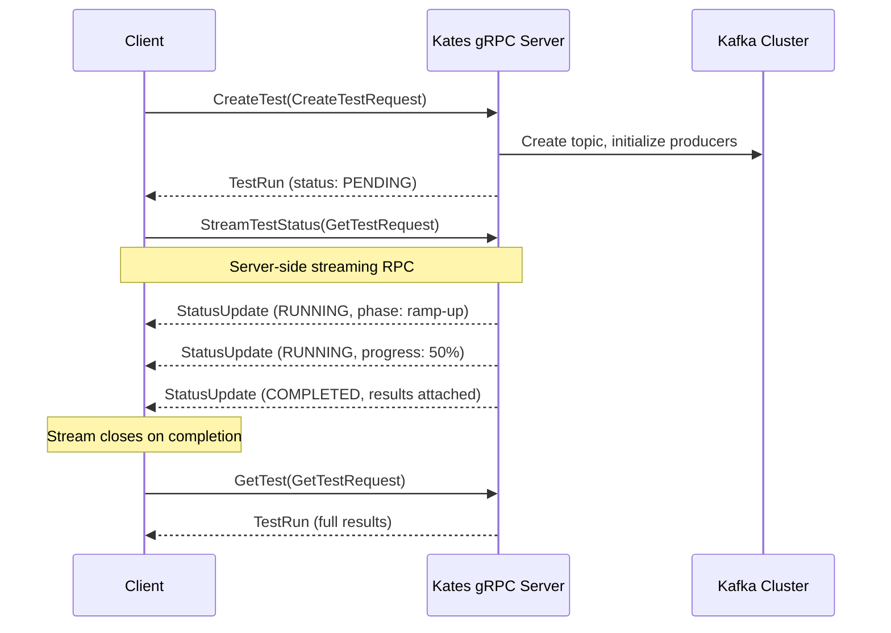

# Chapter 16: gRPC API Reference

## Introduction

Kates exposes a gRPC API alongside the REST API for high-throughput programmatic access from CI pipelines, other services, and language-native clients. Both APIs share the same backend service layer — identical behavior, different wire format.

**When should you use gRPC over REST?** Choose gRPC when you need type-safe, high-performance integration from Go, Java, Python, or Rust services. The protobuf contract gives you compile-time type checking, automatic client code generation, and efficient binary serialization — ideal for CI/CD pipelines where reliability and speed matter more than human readability. gRPC's HTTP/2 foundation also provides connection multiplexing and server-side streaming for real-time test status updates without polling.

Use the REST API instead when you need quick automation with `curl`, are integrating with HTTP/1.1-only tools (webhooks, dashboards), or want human-readable responses during debugging. See [Chapter 11: REST API Reference](11-api-reference.md) for REST details.

---

## gRPC vs REST

| Criterion | gRPC | REST |
|-----------|------|------|
| CI/CD pipelines | ✅ Strongly typed, fast | ⚠️ Requires JSON parsing |
| Browser access | ❌ Requires proxy | ✅ Native |
| Service mesh | ✅ HTTP/2 multiplexing | ✅ Standard |
| Code generation | ✅ Automatic from `.proto` | ❌ Manual |
| Debugging | ⚠️ Binary format | ✅ Human-readable |
| Streaming | ✅ Server-side streaming | ❌ Polling required |
| Type safety | ✅ Compile-time via protobuf | ❌ Runtime JSON validation |
| Payload size | ✅ ~30% smaller (binary) | Larger (JSON text) |
| Tooling | `grpcurl`, generated stubs | `curl`, Postman, browsers |

---

## Streaming Test Execution Flow



---

## Connection

The gRPC server runs on port **9000** (default Quarkus gRPC port):

```bash
kubectl port-forward deployment/kates -n kates 9000:9000
grpcurl -plaintext localhost:9000 list
# Output: kates.ClusterService, kates.HealthService, kates.TestService
```

---

## Service Definitions

The protobuf contract is defined in [`kates.proto`](../../kates/src/main/proto/kates.proto).

### TestService

| RPC | Request | Response | Description |
|-----|---------|----------|-------------|
| `CreateTest` | `CreateTestRequest` | `TestRun` | Start a new test execution |
| `GetTest` | `GetTestRequest` | `TestRun` | Retrieve a test by ID |
| `ListTests` | `ListTestsRequest` | `ListTestsResponse` | Paginated test listing |
| `StreamTestStatus` | `GetTestRequest` | `stream StatusUpdate` | Real-time status streaming |
| `CancelTest` | `CancelTestRequest` | `TestRun` | Cancel a running test |
| `DeleteTest` | `DeleteTestRequest` | `Empty` | Delete a test and its results |

#### CreateTest

```bash
grpcurl -plaintext -d '{
  "type": "LOAD", "num_records": 100000, "record_size": 1024,
  "num_producers": 4, "num_consumers": 2, "acks": "all",
  "partitions": 3, "replication_factor": 3,
  "labels": {"env": "staging"}
}' localhost:9000 kates.TestService/CreateTest
```

**Response:**

```json
{
  "id": "a1b2c3d4-e5f6-7890-abcd-ef1234567890",
  "type": "LOAD", "status": "PENDING",
  "spec": { "numRecords": "100000", "recordSize": 1024, "numProducers": 4, "numConsumers": 2, "acks": "all", "partitions": 3, "replicationFactor": 3 },
  "labels": { "env": "staging" },
  "createdAt": "2026-02-15T20:00:00Z"
}
```

#### GetTest

```bash
grpcurl -plaintext -d '{"id": "a1b2c3d4-e5f6-7890-abcd-ef1234567890"}' \
  localhost:9000 kates.TestService/GetTest
```

**Response:**

```json
{
  "id": "a1b2c3d4-e5f6-7890-abcd-ef1234567890",
  "type": "LOAD", "status": "COMPLETED",
  "results": [
    { "phaseName": "ramp-up", "recordsSent": "10000", "throughputRecordsPerSec": 5234.1, "avgLatencyMs": 4.8, "p99LatencyMs": 18.4 },
    { "phaseName": "steady-state", "recordsSent": "90000", "throughputRecordsPerSec": 8412.7, "avgLatencyMs": 2.4, "p99LatencyMs": 12.3 }
  ],
  "createdAt": "2026-02-15T20:00:00Z",
  "completedAt": "2026-02-15T20:02:05Z"
}
```

#### ListTests

```bash
grpcurl -plaintext -d '{"type": "LOAD", "page": 0, "size": 10}' \
  localhost:9000 kates.TestService/ListTests
```

**Response:**

```json
{
  "items": [
    { "id": "a1b2c3d4-...", "type": "LOAD", "status": "COMPLETED", "createdAt": "2026-02-15T20:00:00Z" },
    { "id": "b2c3d4e5-...", "type": "LOAD", "status": "RUNNING", "createdAt": "2026-02-15T20:05:00Z" }
  ],
  "page": 0, "size": 10, "total": 45
}
```

#### StreamTestStatus

```bash
grpcurl -plaintext -d '{"id": "a1b2c3d4-e5f6-7890-abcd-ef1234567890"}' \
  localhost:9000 kates.TestService/StreamTestStatus
```

**Streaming output** (one JSON object per update):

```json
{ "testId": "a1b2c3d4-...", "status": "RUNNING", "phase": "ramp-up", "progressPercent": 0, "timestamp": "2026-02-15T20:00:01Z" }
{ "testId": "a1b2c3d4-...", "status": "RUNNING", "phase": "steady-state", "progressPercent": 50, "currentThroughput": 8356.9, "timestamp": "2026-02-15T20:01:00Z" }
{ "testId": "a1b2c3d4-...", "status": "COMPLETED", "progressPercent": 100, "finalResults": { "recordsSent": "100000", "throughputRecordsPerSec": 8412.7, "p99LatencyMs": 12.3 }, "timestamp": "2026-02-15T20:02:05Z" }
```

> **Note:** The stream closes automatically on completion/failure. If the test is already completed, a single final-status message is emitted.

#### CancelTest / DeleteTest

```bash
# Cancel
grpcurl -plaintext -d '{"id": "a1b2c3d4-..."}' localhost:9000 kates.TestService/CancelTest
# Response: TestRun with status "CANCELLED"

# Delete
grpcurl -plaintext -d '{"id": "a1b2c3d4-..."}' localhost:9000 kates.TestService/DeleteTest
# Response: {} (empty)
```

---

### ClusterService

| RPC | Request | Response | Description |
|-----|---------|----------|-------------|
| `GetClusterInfo` | `Empty` | `ClusterInfo` | Cluster ID, controller, broker list |
| `ListTopics` | `ListTopicsRequest` | `ListTopicsResponse` | Paginated topic listing |
| `GetTopicDetail` | `GetTopicRequest` | `TopicDetail` | Topic config, partitions, RF |
| `ListConsumerGroups` | `ListGroupsRequest` | `ListGroupsResponse` | Consumer groups with state |

#### GetClusterInfo

```bash
grpcurl -plaintext localhost:9000 kates.ClusterService/GetClusterInfo
```

```json
{
  "clusterId": "abc123",
  "controller": { "id": 0, "host": "krafter-kafka-0.kafka.svc", "port": 9092 },
  "brokers": [
    { "id": 0, "host": "krafter-kafka-0.kafka.svc", "port": 9092, "rack": "zone-a" },
    { "id": 1, "host": "krafter-kafka-1.kafka.svc", "port": 9092, "rack": "zone-b" },
    { "id": 2, "host": "krafter-kafka-2.kafka.svc", "port": 9092, "rack": "zone-c" }
  ],
  "topicCount": 12, "totalPartitions": 36
}
```

#### GetTopicDetail

```bash
grpcurl -plaintext -d '{"name": "kates-results"}' localhost:9000 kates.ClusterService/GetTopicDetail
```

```json
{
  "name": "kates-results",
  "partitions": [
    { "id": 0, "leader": 0, "replicas": [0, 1, 2], "isr": [0, 1, 2] },
    { "id": 1, "leader": 1, "replicas": [1, 2, 0], "isr": [1, 2, 0] }
  ],
  "config": { "retention.ms": "604800000", "min.insync.replicas": "2" },
  "replicationFactor": 3
}
```

---

### HealthService

| RPC | Request | Response | Description |
|-----|---------|----------|-------------|
| `Check` | `Empty` | `HealthResponse` | Engine status + Kafka connectivity |

```bash
grpcurl -plaintext localhost:9000 kates.HealthService/Check
```

```json
{
  "status": "UP",
  "engine": { "activeBackend": "native", "availableBackends": ["native"], "activeTests": 2 },
  "kafka": { "status": "UP", "bootstrapServers": "krafter-kafka-bootstrap.kafka:9092", "brokerCount": 3, "message": "Kafka cluster is reachable" }
}
```

---

## Message Types

### Test Types

```protobuf
enum TestType {
  TEST_TYPE_UNSPECIFIED = 0;
  LOAD = 1;       STRESS = 2;      SPIKE = 3;
  ENDURANCE = 4;  VOLUME = 5;      CAPACITY = 6;
  ROUND_TRIP = 7; INTEGRITY = 8;
  TUNE_REPLICATION = 9;  TUNE_ACKS = 10;
  TUNE_BATCHING = 11;    TUNE_COMPRESSION = 12;
  TUNE_PARTITIONS = 13;
}
```

### TestSpec

| Field | Type | Default | Description |
|-------|------|---------|-------------|
| `num_records` | int64 | — | Total messages to produce |
| `record_size` | int32 | 1024 | Message size in bytes |
| `throughput` | int64 | -1 | Target records/s (-1 = unlimited) |
| `acks` | string | "all" | Producer acknowledgment mode |
| `batch_size` | int32 | 16384 | Producer batch size bytes |
| `linger_ms` | int32 | 5 | Producer linger delay |
| `compression_type` | string | "none" | none, lz4, snappy, zstd, gzip |
| `num_producers` | int32 | 1 | Parallel producer threads |
| `num_consumers` | int32 | 0 | Parallel consumer threads |
| `duration_ms` | int64 | 0 | Duration-based test (0 = record-based) |
| `replication_factor` | int32 | 3 | Topic replication factor |
| `partitions` | int32 | 6 | Topic partition count |
| `min_insync_replicas` | int32 | 2 | Topic ISR constraint |

### TestResult

| Field | Type | Description |
|-------|------|-------------|
| `records_sent` | int64 | Total records produced |
| `throughput_records_per_sec` | double | Achieved throughput |
| `throughput_mb_per_sec` | double | Achieved MB/s |
| `avg_latency_ms` | double | Mean latency |
| `p50_latency_ms` / `p95` / `p99` / `max` | double | Latency percentiles |
| `phase_name` | string | Phase identifier |

### Pagination

All list RPCs use `page` (zero-based) and `size` (default 50, max 200) request fields, returning `items`, `page`, `size`, and `total`.

---

## Error Handling

### gRPC Status Codes

| gRPC Status | HTTP Equiv. | When | Example |
|-------------|:---:|------|---------|
| `INVALID_ARGUMENT` | 400 | Missing/invalid fields | `Invalid test type: 'BENCHMARK'` |
| `NOT_FOUND` | 404 | Resource doesn't exist | `Test not found: abc-123` |
| `ALREADY_EXISTS` | 409 | Name collision | `Schedule 'Nightly Load' already exists` |
| `FAILED_PRECONDITION` | 409 | State conflict | `Test already running on topic 'perf-test'` |
| `UNAVAILABLE` | 503 | Backend unreachable | `Kafka cluster unreachable` |
| `INTERNAL` | 500 | Server failure | `Thread pool exhausted` |

**Error output format:**

```
ERROR:
  Code: NotFound
  Message: Test not found: abc-123
```

---

## REST vs gRPC Equivalence

| REST Endpoint | gRPC RPC |
|--------------|----------|
| `POST /api/tests` | `TestService/CreateTest` |
| `GET /api/tests/{id}` | `TestService/GetTest` |
| `GET /api/tests` | `TestService/ListTests` |
| *(polling)* | `TestService/StreamTestStatus` |
| `POST /api/tests/{id}/cancel` | `TestService/CancelTest` |
| `DELETE /api/tests/{id}` | `TestService/DeleteTest` |
| `GET /api/cluster` | `ClusterService/GetClusterInfo` |
| `GET /api/cluster/topics` | `ClusterService/ListTopics` |
| `GET /api/cluster/topics/{name}` | `ClusterService/GetTopicDetail` |
| `GET /api/cluster/groups` | `ClusterService/ListConsumerGroups` |
| `GET /api/health` | `HealthService/Check` |

---

## Client Code Generation

Generate typed clients from `kates.proto`:

```bash
# Go
protoc --go_out=. --go-grpc_out=. kates.proto

# Java
protoc --java_out=. --grpc-java_out=. kates.proto

# Python
python -m grpc_tools.protoc -I. --python_out=. --grpc_python_out=. kates.proto
```

The proto file is bundled at `kates/src/main/proto/kates.proto`.

---

## See Also

- [Chapter 10: CLI Reference](10-cli-reference.md) — Interactive CLI that wraps both REST and gRPC APIs
- [Chapter 11: REST API Reference](11-api-reference.md) — JSON/HTTP alternative for curl-based scripting and browser access
