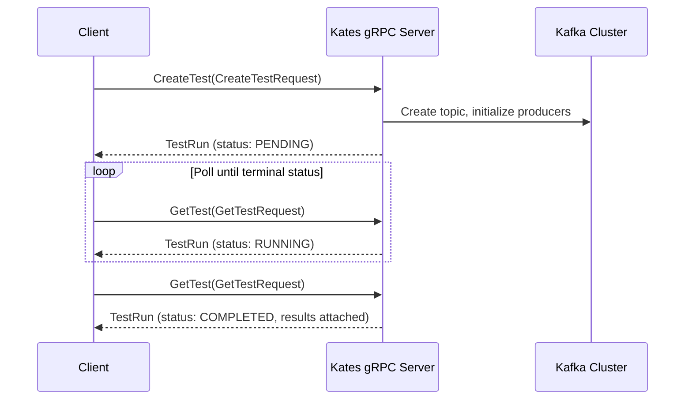

# gRPC API Reference

## Introduction

Kates exposes a gRPC API alongside the REST API for high-throughput programmatic access from CI pipelines, other services, and language-native clients. Both APIs share the same backend service layer, so a test run behaves the same whichever API starts it. The gRPC API covers fewer operations, and this chapter notes each place where it differs from REST: fields it never populates, a filter and a request map it ignores, and a health check that needs the API key.

**When should you use gRPC over REST?** Choose gRPC when you need type-safe, high-performance integration from Go, Java, Python, or Rust services. The protobuf contract gives you compile-time type checking, automatic client code generation, and efficient binary serialization — ideal for CI/CD pipelines where reliability and speed matter more than human readability. gRPC's HTTP/2 foundation also provides connection multiplexing.

Use the REST API instead when you need quick automation with `curl`, are integrating with HTTP/1.1-only tools (webhooks, dashboards), or want human-readable responses during debugging. See [REST API Reference](11-api-reference.md) for REST details.

After this chapter, you can:

- Connect `grpcurl` to the unified Quarkus server on port 8080 with the API key, and discover the `TestService`, `ClusterService`, and `HealthService` RPCs from `kates.proto` — or through server reflection in the dev profile
- Drive a full test lifecycle over gRPC — `CreateTest`, poll `GetTest` until a terminal status, then `CancelTest` or `DeleteTest`
- Read proto3 JSON output correctly, knowing that zero-valued fields are omitted and unset request fields fall back to per-test-type defaults
- Generate typed Go, Java, or Python clients from `kates.proto`

---

## gRPC vs REST

| Criterion | gRPC | REST |
|-----------|------|------|
| CI/CD pipelines | ✅ Strongly typed, fast | ⚠️ Requires JSON parsing |
| Browser access | ❌ Requires proxy | ✅ Native |
| Service mesh | ✅ HTTP/2 multiplexing | ✅ Standard |
| Code generation | ✅ Automatic from `.proto` | ❌ Manual |
| Debugging | ⚠️ Binary format | ✅ Human-readable |
| Type safety | ✅ Compile-time via protobuf | ❌ Runtime JSON validation |
| Payload size | ✅ ~30% smaller (binary) | Larger (JSON text) |
| Tooling | `grpcurl`, generated stubs | `curl`, Postman, browsers |

---

## Test Execution Flow



---

## Connection

Kates serves gRPC through the unified Quarkus HTTP server: `quarkus.grpc.server.use-separate-server=false` in `application.properties` routes gRPC (HTTP/2) traffic over the same port as REST — **8080**. The separate-server port setting (`quarkus.grpc.server.port=9000`) is ignored in this mode. So the port-forward that carries the REST API carries gRPC too: with `make ports` running, both answer in plaintext on `localhost:30083`.

::: {.callout-warning}
The Helm chart still declares a `grpc` container and Service port 9000 (`charts/kates/values.yaml`), but nothing listens there. `kates ports` forwards it to `localhost:9000` all the same, and the chart's gRPC Ingress (`ingress.grpc.enabled`) routes to it, so calls through either never reach the server. Connect to the HTTP port instead: `localhost:30083` with `make ports`, `localhost:8080` with `kates ports`.
:::

### Authentication

The API key guards gRPC as it guards REST. `GrpcApiKeyInterceptor`, a global interceptor, reads the same `kates.api.security-enabled` and `kates.api.key` settings and fails any call without a valid key with `UNAUTHENTICATED`. It makes no exception for `HealthService/Check`, unlike the public REST `/api/health`. Send the key as call metadata, as `authorization: Bearer <key>` or `x-api-key: <key>`:

```bash
export KATES_API_KEY="$(kubectl get secret kates-api-key -n kates -o jsonpath='{.data.api-key}' | base64 -d)"
```

### Schema From `kates.proto` or Reflection

Server reflection is enabled only in the dev profile (`%dev.quarkus.grpc.server.enable-reflection-service=true`). The prod profile, which the chart's backend runs, keeps `quarkus.grpc.server.enable-reflection-service=false`, so `grpcurl` cannot ask a deployed backend for the schema. Give `grpcurl` the proto file from the repository instead. From the repository root, collect the flags every call in this chapter uses into one array:

```bash
GRPC=(-plaintext -import-path kates/src/main/proto -proto kates.proto -H "x-api-key: $KATES_API_KEY")

grpcurl "${GRPC[@]}" localhost:30083 list
```

Output:

```text
kates.ClusterService
kates.HealthService
kates.TestService
```

With `-proto`, `list` and `describe` read the file rather than the server; the RPCs themselves go to `localhost:30083`. The `google/protobuf/empty.proto` import resolves from `grpcurl`'s built-in copy of the well-known types.

In the dev profile (`./mvnw quarkus:dev` in `kates/`), reflection is on and API security is off (`%dev.kates.api.security-enabled=false`), so `grpcurl -plaintext localhost:8080 list` discovers the same three services, plus the reflection and health services Quarkus registers, with neither the proto file nor a key.

---

## Service Definitions

The protobuf contract is defined in [`kates.proto`](https://github.com/bmscomp/kates/blob/main/kates/src/main/proto/kates.proto).

### TestService

| RPC | Request | Response | Description |
|-----|---------|----------|-------------|
| `CreateTest` | `CreateTestRequest` | `TestRun` | Start a new test execution |
| `GetTest` | `GetTestRequest` | `TestRun` | Retrieve a test by ID |
| `ListTests` | `ListTestsRequest` | `ListTestsResponse` | Paginated test listing |
| `CancelTest` | `CancelTestRequest` | `TestRun` | Cancel a running test |
| `DeleteTest` | `DeleteTestRequest` | `Empty` | Delete a test and its results |

#### CreateTest

`CreateTestRequest` exposes only a subset of `TestSpec` — `type`, `num_records`, `record_size`, `partitions`, `replication_factor`, and `compression_type`; every other spec field (acks, batching, producer/consumer counts, ...) falls back to the per-test-type defaults described under [TestSpec](#testspec). The request message also declares a `labels` map, but the current server implementation ignores it — set labels through the REST API if you need them.

```bash
grpcurl "${GRPC[@]}" -d '{
  "type": "LOAD", "num_records": 100000, "record_size": 1024,
  "partitions": 3, "replication_factor": 3,
  "compression_type": "lz4"
}' localhost:30083 kates.TestService/CreateTest
```

**Response:**

```json
{
  "id": "a1b2c3d4",
  "testType": "LOAD", "status": "PENDING",
  "spec": {
    "numRecords": "100000", "recordSize": 1024, "throughput": "-1",
    "acks": "all", "batchSize": 65536, "lingerMs": 5,
    "compressionType": "lz4", "numProducers": 1, "numConsumers": 1,
    "durationMs": "600000", "replicationFactor": 3, "partitions": 3,
    "minInsyncReplicas": 2
  },
  "createdAt": "2026-02-15T20:00:00.412587Z",
  "backend": "native"
}
```

A test run ID is eight hex characters — the first block of a random UUID — so pass it exactly as returned; the same IDs appear in `kates test list` and the REST API. The response comes back as soon as the run is registered, before it starts, so `status` is always `PENDING` and `results` is empty.

#### GetTest

```bash
grpcurl "${GRPC[@]}" -d '{"id": "a1b2c3d4"}' \
  localhost:30083 kates.TestService/GetTest
```

**Response** (`spec` left out; it matches the CreateTest response):

```json
{
  "id": "a1b2c3d4",
  "testType": "LOAD", "status": "COMPLETED",
  "results": [
    { "taskId": "a1b2c3d4-produce-0", "testType": "LOAD", "status": "COMPLETED",
      "recordsSent": "100000", "throughputRecordsPerSec": 8412.7, "throughputMbPerSec": 8.2,
      "avgLatencyMs": 2.4, "p50LatencyMs": 1.9, "p95LatencyMs": 6.8, "p99LatencyMs": 12.3, "maxLatencyMs": 41.6,
      "startTime": "2026-02-15T20:00:01.108342Z", "endTime": "2026-02-15T20:00:13.527115Z",
      "phaseName": "produce" },
    { "taskId": "a1b2c3d4-consume-0", "testType": "LOAD", "status": "COMPLETED",
      "recordsSent": "100000", "throughputRecordsPerSec": 8391.2, "throughputMbPerSec": 8.2,
      "startTime": "2026-02-15T20:00:01.109020Z", "endTime": "2026-02-15T20:00:13.640388Z",
      "phaseName": "consume" }
  ],
  "createdAt": "2026-02-15T20:00:00.412587Z",
  "backend": "native"
}
```

A LOAD run has two tasks, a producer and a consumer, each with its own `TestResult`; `task_id` is the run ID plus the task's name, and on the consumer `records_sent` counts the records it consumed. The consumer reports records and throughput only: it measures no latency, so its five latency fields are always zero and `grpcurl` leaves them out, and the run's latency lives on the produce task. Timing lives on each `TestResult` (`start_time` / `end_time`) — `TestRun` itself carries only `created_at`.

#### ListTests

```bash
grpcurl "${GRPC[@]}" -d '{"type": "LOAD", "page": 0, "size": 10}' \
  localhost:30083 kates.TestService/ListTests
```

**Response** (each item is a full `TestRun`, cut down here to four fields):

```json
{
  "items": [
    { "id": "a1b2c3d4", "testType": "LOAD", "status": "COMPLETED", "createdAt": "2026-02-15T20:00:00.412587Z" },
    { "id": "b2c3d4e5", "testType": "LOAD", "status": "RUNNING", "createdAt": "2026-02-15T20:05:00.097316Z" }
  ],
  "size": 10, "total": "45"
}
```

(`page` is absent here for the same proto3 reason explained under [GetClusterInfo](#getclusterinfo): zero-valued fields are omitted from grpcurl's JSON output.) The request's `status` field is ignored: `ListTests` filters by `type` only.

#### CancelTest / DeleteTest

```bash
# Cancel
grpcurl "${GRPC[@]}" -d '{"id": "a1b2c3d4"}' localhost:30083 kates.TestService/CancelTest
# Response: TestRun with status "CANCELLED"

# Delete
grpcurl "${GRPC[@]}" -d '{"id": "a1b2c3d4"}' localhost:30083 kates.TestService/DeleteTest
# Response: {} (empty)
```

---

### ClusterService

| RPC | Request | Response | Description |
|-----|---------|----------|-------------|
| `GetClusterInfo` | `Empty` | `ClusterInfo` | Cluster ID and broker list |
| `GetClusterTopology` | `Empty` | `ClusterTopology` | KRaft topology: node pools and nodes |
| `ListTopics` | `ListTopicsRequest` | `ListTopicsResponse` | Paginated topic names |
| `GetTopicDetail` | `GetTopicRequest` | `TopicDetail` | Topic config, partitions, RF |
| `ListConsumerGroups` | `ListGroupsRequest` | `ListGroupsResponse` | Consumer groups with state |

::: {.callout-important}
Several fields that `kates.proto` declares are never populated by the server, so a client always reads them as zero, empty, or `false`: `ClusterInfo.controller_id`; `ClusterTopology.cluster_name`, `kafka_version`, `kraft_mode`, and `controller_quorum_leader`; and `TopicInfo.partitions`, `replication_factor`, and `internal` in `ListTopics` items. The service layer returns those facts under different keys than the gRPC mapping reads. The REST endpoints (`/api/cluster/info`, `/api/cluster/topology`, `/api/cluster/topics/{name}`) carry them, and `GetTopicDetail` fills in the per-topic fields. The controller that REST reports, as `controller` and as `controllerQuorumLeader`, is not the KRaft quorum leader, though: both come from Kafka's `DescribeCluster`, which a KRaft broker answers with an arbitrary live broker. `GET /api/cluster/check` reports the quorum leader as `kraftQuorum.leaderId`.
:::

#### GetClusterInfo

```bash
grpcurl "${GRPC[@]}" localhost:30083 kates.ClusterService/GetClusterInfo
```

```json
{
  "clusterId": "4L6g3nShT-eMCtK--X86sw",
  "brokers": [
    { "host": "krafter-brokers-alpha-0.krafter-kafka-brokers.kafka.svc", "port": 9092, "rack": "alpha" },
    { "id": 1, "host": "krafter-brokers-gamma-1.krafter-kafka-brokers.kafka.svc", "port": 9092, "rack": "gamma" },
    { "id": 2, "host": "krafter-brokers-sigma-2.krafter-kafka-brokers.kafka.svc", "port": 9092, "rack": "sigma" }
  ]
}
```

`ClusterInfo` carries the cluster ID and the broker list — the topic count comes from `ListTopics` (its `total` field) and per-topic partition counts from `GetTopicDetail`. There is no `controllerId` in the output because `controller_id` is never set. Note that proto3 JSON output omits zero-valued fields, which is why broker 0's `id` is absent above. (Hosts and racks are what the brokers advertise: the example shows the `krafter` cluster that `kates deploy` creates on the Kind cluster, one broker pool per zone, each broker advertising its pod's DNS name under the `krafter-kafka-brokers` Service.)

#### GetClusterTopology

```bash
grpcurl "${GRPC[@]}" localhost:30083 kates.ClusterService/GetClusterTopology
```

Only `nodePools` and `nodes` carry data: each pool's name, role, replica count, and storage, and each node's ID, host, port, rack, role, pool, readiness, and `is_quorum_leader`. That flag marks the node whose ID matches the controller `DescribeCluster` names, so it lands on an arbitrary broker, not on the KRaft quorum leader. The RPC reads Strimzi's `KafkaNodePool` resources and the broker pods through the Kubernetes API, so it fails when the backend runs outside Kubernetes.

#### ListTopics

```bash
grpcurl "${GRPC[@]}" -d '{"size": 100}' localhost:30083 kates.ClusterService/ListTopics
```

Each item carries only a topic `name`, sorted by name; call `GetTopicDetail` for a topic's partitions, replication factor, and configuration.

#### GetTopicDetail

```bash
grpcurl "${GRPC[@]}" -d '{"name": "kates-results"}' localhost:30083 kates.ClusterService/GetTopicDetail
```

```json
{
  "name": "kates-results",
  "partitions": 12,
  "replicationFactor": 3,
  "configs": {
    "cleanup.policy": "delete",
    "compression.type": "lz4",
    "message.timestamp.type": "CreateTime",
    "min.insync.replicas": "2",
    "retention.ms": "604800000",
    "segment.bytes": "1073741824"
  }
}
```

`partitions` is a count, not a per-partition breakdown — the proto `TopicDetail` message has no leader/replica/ISR detail. `configs` holds at most eight keys — `cleanup.policy`, `retention.ms`, `retention.bytes`, `min.insync.replicas`, `compression.type`, `segment.bytes`, `max.message.bytes`, and `message.timestamp.type` — and only when the value is set on the topic or left at Kafka's default; a value the topic inherits from broker configuration is left out, which is why `retention.bytes` and `max.message.bytes` are absent above: the `krafter` cluster sets both at broker level (`log.retention.bytes`, `message.max.bytes`).

---

### HealthService

| RPC | Request | Response | Description |
|-----|---------|----------|-------------|
| `Check` | `Empty` | `HealthResponse` | Engine status + Kafka connectivity |

```bash
grpcurl "${GRPC[@]}" localhost:30083 kates.HealthService/Check
```

```json
{
  "status": "UP",
  "engine": { "activeBackend": "native", "availableBackends": ["native", "trogdor"] },
  "kafka": { "status": "UP", "bootstrapServers": "krafter-kafka-bootstrap.kafka.svc.cluster.local:9092", "message": "Kafka cluster is reachable" }
}
```

Unlike the REST `/api/health`, this RPC requires the API key.

When Kafka is unreachable, `status` becomes `DEGRADED`, `kafka.status` becomes `DOWN`, and the message reads `Cannot connect to Kafka cluster`.

---

## Message Types

### Test Types

```protobuf
enum TestType {
  TEST_TYPE_UNSPECIFIED = 0;
  LOAD = 1;       STRESS = 2;      SPIKE = 3;
  ENDURANCE = 4;  VOLUME = 5;      CAPACITY = 6;
  ROUND_TRIP = 7; INTEGRITY = 8;
  TUNE_REPLICATION = 9;  TUNE_ACKS = 10;
  TUNE_BATCHING = 11;    TUNE_COMPRESSION = 12;
  TUNE_PARTITIONS = 13;  INTEGRATION_CDC = 14;
}
```

### TestSpec

Proto3 fields carry no wire-level defaults — when a field is unset, the backend applies **per-test-type defaults** (`TestOrchestrator` calls `applyTypeDefaults`, backed by `config/TestTypeDefaults.java` and overridable via `kates.tests.<type>.*` config properties). The values below are the LOAD-type defaults; other test types differ (STRESS uses more producers, ENDURANCE a longer duration, and so on).

| Field | Type | LOAD default | Description |
|-------|------|---------|-------------|
| `num_records` | int64 | 1000000 | Total messages to produce |
| `record_size` | int32 | 1024 | Message size in bytes |
| `throughput` | int64 | -1 | Target records/s (-1 = unlimited) |
| `acks` | string | "all" | Producer acknowledgment mode |
| `batch_size` | int32 | 65536 | Producer batch size bytes |
| `linger_ms` | int32 | 5 | Producer linger delay |
| `compression_type` | string | "lz4" | none, lz4, snappy, zstd, gzip |
| `num_producers` | int32 | 1 | Producer count for STRESS and CAPACITY; every other type runs one producer |
| `num_consumers` | int32 | 1 | Read by no test type; LOAD and ENDURANCE run one consumer |
| `duration_ms` | int64 | 600000 | Duration for duration-based tests |
| `replication_factor` | int32 | 3 | Topic replication factor |
| `partitions` | int32 | 3 | Topic partition count |
| `min_insync_replicas` | int32 | 2 | Topic ISR constraint |

### TestResult

| Field | Type | Description |
|-------|------|-------------|
| `records_sent` | int64 | Total records produced |
| `throughput_records_per_sec` | double | Achieved throughput |
| `throughput_mb_per_sec` | double | Achieved MB/s |
| `avg_latency_ms` | double | Mean latency |
| `p50_latency_ms` / `p95` / `p99` / `max` | double | Latency percentiles |
| `phase_name` | string | Phase identifier |

### Pagination

All list RPCs use `page` (zero-based) and `size` (default 50, max 200) request fields, returning `items`, `page`, `size`, and `total`.

---

## Error Handling

### gRPC Status Codes

| gRPC Status | HTTP Equiv. | When | Example |
|-------------|:---:|------|---------|
| `UNAUTHENTICATED` | 401/403 | Missing or wrong API key | `Missing or invalid API key. Provide it via 'authorization: Bearer <key>' or 'x-api-key: <key>' metadata.` |
| `INVALID_ARGUMENT` | 400 | Missing/invalid fields | `Test type is required`, `Invalid test type: BENCHMARK` |
| `NOT_FOUND` | 404 | Resource doesn't exist | `Test not found: 0badc0de` |
| `INTERNAL` | 500 or 429 | `CreateTest` could not start the run | Surfaces the underlying exception message verbatim — including `Concurrency limit reached: 3 tests already running`, which REST reports as `429` |

Any other exception inside an RPC — Kafka unreachable during `GetClusterInfo`, no Kubernetes API for `GetClusterTopology` — reaches the client as `UNKNOWN`, with the Java exception class and message as the description. Transport-level codes such as `UNAVAILABLE` come from the gRPC runtime itself (e.g. when the server cannot be reached), not from Kates.

**Error output format:**

```text
ERROR:
  Code: NotFound
  Message: Test not found: 0badc0de
```

---

## REST vs gRPC Equivalence

| REST Endpoint | gRPC RPC |
|--------------|----------|
| `POST /api/tests` | `TestService/CreateTest` |
| `GET /api/tests/{id}` | `TestService/GetTest` |
| `GET /api/tests` | `TestService/ListTests` |
| `POST /api/tests/{id}/cancel` | `TestService/CancelTest` |
| `DELETE /api/tests/{id}` | `TestService/DeleteTest` |
| `GET /api/cluster/info` | `ClusterService/GetClusterInfo` |
| `GET /api/cluster/topology` | `ClusterService/GetClusterTopology` |
| `GET /api/cluster/topics` | `ClusterService/ListTopics` |
| `GET /api/cluster/topics/{name}` | `ClusterService/GetTopicDetail` |
| `GET /api/cluster/groups` | `ClusterService/ListConsumerGroups` |
| `GET /api/health` | `HealthService/Check` |

---

## Client Code Generation

Generate typed clients from `kates.proto`, which lives at `kates/src/main/proto/kates.proto`. Run these from the repository root; each writes its output to the current directory.

```bash
# Go — kates.proto declares no go_package, so map it to an import path in your module
protoc -I kates/src/main/proto \
  --go_out=. --go_opt=paths=source_relative \
  --go_opt=Mkates.proto=example.com/yourmodule/katespb \
  --go-grpc_out=. --go-grpc_opt=paths=source_relative \
  --go-grpc_opt=Mkates.proto=example.com/yourmodule/katespb \
  kates.proto

# Java (needs the protoc-gen-grpc-java plugin on PATH)
protoc -I kates/src/main/proto --java_out=. --grpc-java_out=. kates.proto

# Python
python -m grpc_tools.protoc -I kates/src/main/proto --python_out=. --grpc_python_out=. kates.proto
```

Without the `M` mapping, `protoc-gen-go` and `protoc-gen-go-grpc` stop with `unable to determine Go import path for "kates.proto"`: the file sets only `java_package`, `java_multiple_files`, and `java_outer_classname`. Replace `example.com/yourmodule/katespb` with a package path inside your own Go module; the last element becomes the Go package name. `protoc` resolves the `google/protobuf/empty.proto` import from the include directory that ships with it.

Generated clients carry no credentials of their own: attach the API key as `x-api-key` metadata on every call, the way `grpcurl -H` does above — in Go, for example, with `metadata.AppendToOutgoingContext(ctx, "x-api-key", key)`.

---

## See Also

- [CLI Reference](10-cli-reference.md) — Interactive CLI that wraps the REST API
- [REST API Reference](11-api-reference.md) — JSON/HTTP alternative for curl-based scripting and browser access

---

## Summary

- gRPC and REST share the same backend service layer, but gRPC covers fewer operations and some of its responses carry less, as the points below list — gRPC is served over the unified Quarkus HTTP port 8080, which `make ports` forwards to `localhost:30083`, not the separate port 9000 the Helm chart still declares
- Every RPC, `HealthService/Check` included, needs the API key as `authorization: Bearer <key>` or `x-api-key: <key>` metadata
- Server reflection is enabled only in the dev profile; against a deployed backend, pass `-import-path kates/src/main/proto -proto kates.proto` to `grpcurl`
- `CreateTestRequest` exposes only a subset of `TestSpec`; unset fields fall back to per-test-type defaults, and the request's `labels` map is ignored by the current server
- proto3 JSON output omits zero-valued fields — a missing `id` or `page` in a response means zero, not an error — and some declared fields (`controller_id`, most of `ClusterTopology`, the counts on `ListTopics` items) are never populated at all
- Kates raises four application status codes — `UNAUTHENTICATED`, `INVALID_ARGUMENT`, `NOT_FOUND`, and `INTERNAL`; any other exception surfaces as `UNKNOWN`, and transport-level codes like `UNAVAILABLE` come from the gRPC runtime itself
- Typed clients for Go, Java, and Python are generated with `protoc` from the bundled `kates/src/main/proto/kates.proto`; Go needs an `M` mapping because the file declares no `go_package`

This closes the book's reference part — for ready-made workflows that put these APIs to work, return to [Recipes & Patterns](14-recipes.md), and turn to the appendices for the glossary, troubleshooting guide, CI/CD templates, and version matrix.
