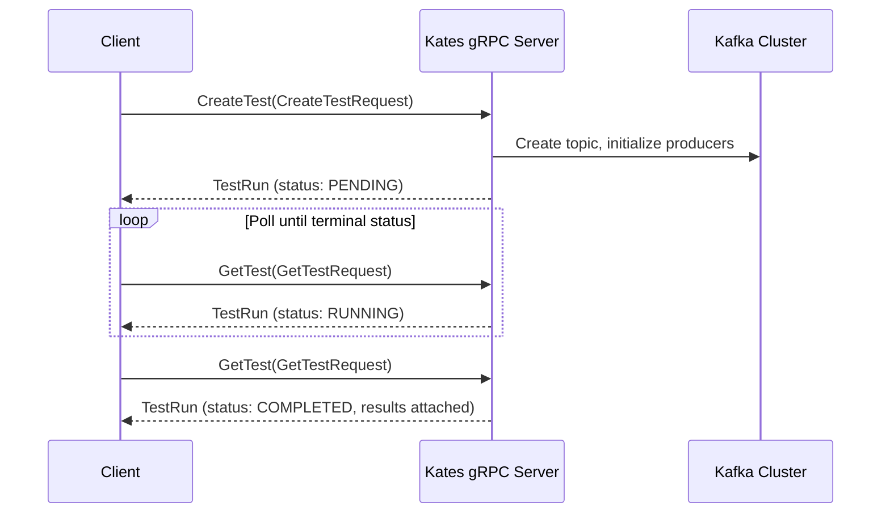

# gRPC API Reference

## Introduction

Kates exposes a gRPC API alongside the REST API for high-throughput programmatic access from CI pipelines, other services, and language-native clients. Both APIs share the same backend service layer — identical behavior, different wire format.

**When should you use gRPC over REST?** Choose gRPC when you need type-safe, high-performance integration from Go, Java, Python, or Rust services. The protobuf contract gives you compile-time type checking, automatic client code generation, and efficient binary serialization — ideal for CI/CD pipelines where reliability and speed matter more than human readability. gRPC's HTTP/2 foundation also provides connection multiplexing.

Use the REST API instead when you need quick automation with `curl`, are integrating with HTTP/1.1-only tools (webhooks, dashboards), or want human-readable responses during debugging. See [REST API Reference](11-api-reference.md) for REST details.

---

## gRPC vs REST

| Criterion | gRPC | REST |
|-----------|------|------|
| CI/CD pipelines | ✅ Strongly typed, fast | ⚠️ Requires JSON parsing |
| Browser access | ❌ Requires proxy | ✅ Native |
| Service mesh | ✅ HTTP/2 multiplexing | ✅ Standard |
| Code generation | ✅ Automatic from `.proto` | ❌ Manual |
| Debugging | ⚠️ Binary format | ✅ Human-readable |
| Type safety | ✅ Compile-time via protobuf | ❌ Runtime JSON validation |
| Payload size | ✅ ~30% smaller (binary) | Larger (JSON text) |
| Tooling | `grpcurl`, generated stubs | `curl`, Postman, browsers |

---

## Test Execution Flow



---

## Connection

Kates serves gRPC through the unified Quarkus HTTP server: `quarkus.grpc.server.use-separate-server=false` in `application.properties` routes gRPC (HTTP/2) traffic over the same port as REST — **8080**. The separate-server port setting (`quarkus.grpc.server.port=9000`) is ignored in this mode.

```bash
kubectl port-forward deployment/kates -n kates 8080:8080
grpcurl -plaintext localhost:8080 list
# kates.ClusterService
# kates.HealthService
# kates.TestService
# (plus the reflection and health services Quarkus registers)
```

`grpcurl list` works because server reflection is enabled (`quarkus.grpc.server.enable-reflection-service=true`). Note that the Helm chart still declares a separate `grpc` service port 9000 (`charts/kates/values.yaml`); with the unified-server configuration nothing listens there — connect to the HTTP port instead.

---

## Service Definitions

The protobuf contract is defined in [`kates.proto`](https://github.com/bmscomp/kates/blob/main/kates/src/main/proto/kates.proto).

### TestService

| RPC | Request | Response | Description |
|-----|---------|----------|-------------|
| `CreateTest` | `CreateTestRequest` | `TestRun` | Start a new test execution |
| `GetTest` | `GetTestRequest` | `TestRun` | Retrieve a test by ID |
| `ListTests` | `ListTestsRequest` | `ListTestsResponse` | Paginated test listing |
| `CancelTest` | `CancelTestRequest` | `TestRun` | Cancel a running test |
| `DeleteTest` | `DeleteTestRequest` | `Empty` | Delete a test and its results |

#### CreateTest

`CreateTestRequest` exposes only a subset of `TestSpec` — `type`, `num_records`, `record_size`, `partitions`, `replication_factor`, and `compression_type`; every other spec field (acks, batching, producer/consumer counts, ...) falls back to the per-test-type defaults described under [TestSpec](#testspec). The request message also declares a `labels` map, but the current server implementation ignores it — set labels through the REST API if you need them.

```bash
grpcurl -plaintext -d '{
  "type": "LOAD", "num_records": 100000, "record_size": 1024,
  "partitions": 3, "replication_factor": 3,
  "compression_type": "lz4"
}' localhost:8080 kates.TestService/CreateTest
```

**Response:**

```json
{
  "id": "a1b2c3d4-e5f6-7890-abcd-ef1234567890",
  "testType": "LOAD", "status": "PENDING",
  "spec": {
    "numRecords": "100000", "recordSize": 1024, "throughput": "-1",
    "acks": "all", "batchSize": 65536, "lingerMs": 5,
    "compressionType": "lz4", "numProducers": 1, "numConsumers": 1,
    "durationMs": "600000", "replicationFactor": 3, "partitions": 3,
    "minInsyncReplicas": 2
  },
  "createdAt": "2026-02-15T20:00:00Z",
  "backend": "native"
}
```

#### GetTest

```bash
grpcurl -plaintext -d '{"id": "a1b2c3d4-e5f6-7890-abcd-ef1234567890"}' \
  localhost:8080 kates.TestService/GetTest
```

**Response:**

```json
{
  "id": "a1b2c3d4-e5f6-7890-abcd-ef1234567890",
  "testType": "LOAD", "status": "COMPLETED",
  "results": [
    { "taskId": "a1b2c3d4-...", "testType": "LOAD", "status": "COMPLETED",
      "recordsSent": "100000", "throughputRecordsPerSec": 8412.7,
      "avgLatencyMs": 2.4, "p99LatencyMs": 12.3,
      "startTime": "2026-02-15T20:00:01Z", "endTime": "2026-02-15T20:02:05Z" }
  ],
  "createdAt": "2026-02-15T20:00:00Z",
  "backend": "native"
}
```

Timing lives on each `TestResult` (`start_time` / `end_time`) — `TestRun` itself carries only `created_at`.

#### ListTests

```bash
grpcurl -plaintext -d '{"type": "LOAD", "page": 0, "size": 10}' \
  localhost:8080 kates.TestService/ListTests
```

**Response:**

```json
{
  "items": [
    { "id": "a1b2c3d4-...", "testType": "LOAD", "status": "COMPLETED", "createdAt": "2026-02-15T20:00:00Z" },
    { "id": "b2c3d4e5-...", "testType": "LOAD", "status": "RUNNING", "createdAt": "2026-02-15T20:05:00Z" }
  ],
  "size": 10, "total": "45"
}
```

(`page` is absent here for the same proto3 reason explained under [GetClusterInfo](#getclusterinfo): zero-valued fields are omitted from grpcurl's JSON output.)

#### CancelTest / DeleteTest

```bash
# Cancel
grpcurl -plaintext -d '{"id": "a1b2c3d4-..."}' localhost:8080 kates.TestService/CancelTest
# Response: TestRun with status "CANCELLED"

# Delete
grpcurl -plaintext -d '{"id": "a1b2c3d4-..."}' localhost:8080 kates.TestService/DeleteTest
# Response: {} (empty)
```

---

### ClusterService

| RPC | Request | Response | Description |
|-----|---------|----------|-------------|
| `GetClusterInfo` | `Empty` | `ClusterInfo` | Cluster ID, controller ID, broker list |
| `GetClusterTopology` | `Empty` | `ClusterTopology` | KRaft topology: node pools, nodes, quorum leader |
| `ListTopics` | `ListTopicsRequest` | `ListTopicsResponse` | Paginated topic listing |
| `GetTopicDetail` | `GetTopicRequest` | `TopicDetail` | Topic config, partitions, RF |
| `ListConsumerGroups` | `ListGroupsRequest` | `ListGroupsResponse` | Consumer groups with state |

#### GetClusterInfo

```bash
grpcurl -plaintext localhost:8080 kates.ClusterService/GetClusterInfo
```

```json
{
  "clusterId": "abc123",
  "controllerId": 3,
  "brokers": [
    { "host": "krafter-kafka-0.kafka.svc", "port": 9092 },
    { "id": 1, "host": "krafter-kafka-1.kafka.svc", "port": 9092 },
    { "id": 2, "host": "krafter-kafka-2.kafka.svc", "port": 9092 }
  ]
}
```

`ClusterInfo` carries only the cluster ID, the controller's node ID (`controller_id`), and the broker list — the topic count comes from `ListTopics` (its `total` field) and per-topic partition counts from `GetTopicDetail`. Note that proto3 JSON output omits zero-valued fields, which is why broker 0's `id` is absent above. (Broker hostnames follow whatever your Kafka deployment advertises; the example shows the `krafter` cluster from this repo's `kafka-cluster` chart.)

#### GetTopicDetail

```bash
grpcurl -plaintext -d '{"name": "kates-results"}' localhost:8080 kates.ClusterService/GetTopicDetail
```

```json
{
  "name": "kates-results",
  "partitions": 12,
  "replicationFactor": 3,
  "configs": { "retention.ms": "604800000", "min.insync.replicas": "2", "compression.type": "lz4" }
}
```

`partitions` is a count, not a per-partition breakdown — the proto `TopicDetail` message has no leader/replica/ISR detail.

---

### HealthService

| RPC | Request | Response | Description |
|-----|---------|----------|-------------|
| `Check` | `Empty` | `HealthResponse` | Engine status + Kafka connectivity |

```bash
grpcurl -plaintext localhost:8080 kates.HealthService/Check
```

```json
{
  "status": "UP",
  "engine": { "activeBackend": "native", "availableBackends": ["native", "trogdor"] },
  "kafka": { "status": "UP", "bootstrapServers": "krafter-kafka-bootstrap.kafka.svc:9092", "message": "Kafka cluster is reachable" }
}
```

When Kafka is unreachable, `status` becomes `DEGRADED`, `kafka.status` becomes `DOWN`, and the message reads `Cannot connect to Kafka cluster`.

---

## Message Types

### Test Types

```protobuf
enum TestType {
  TEST_TYPE_UNSPECIFIED = 0;
  LOAD = 1;       STRESS = 2;      SPIKE = 3;
  ENDURANCE = 4;  VOLUME = 5;      CAPACITY = 6;
  ROUND_TRIP = 7; INTEGRITY = 8;
  TUNE_REPLICATION = 9;  TUNE_ACKS = 10;
  TUNE_BATCHING = 11;    TUNE_COMPRESSION = 12;
  TUNE_PARTITIONS = 13;  INTEGRATION_CDC = 14;
}
```

### TestSpec

Proto3 fields carry no wire-level defaults — when a field is unset, the backend applies **per-test-type defaults** (`TestOrchestrator` calls `applyTypeDefaults`, backed by `config/TestTypeDefaults.java` and overridable via `kates.tests.<type>.*` config properties). The values below are the LOAD-type defaults; other test types differ (STRESS uses more producers, ENDURANCE a longer duration, and so on).

| Field | Type | LOAD default | Description |
|-------|------|---------|-------------|
| `num_records` | int64 | 1000000 | Total messages to produce |
| `record_size` | int32 | 1024 | Message size in bytes |
| `throughput` | int64 | -1 | Target records/s (-1 = unlimited) |
| `acks` | string | "all" | Producer acknowledgment mode |
| `batch_size` | int32 | 65536 | Producer batch size bytes |
| `linger_ms` | int32 | 5 | Producer linger delay |
| `compression_type` | string | "lz4" | none, lz4, snappy, zstd, gzip |
| `num_producers` | int32 | 1 | Parallel producer threads |
| `num_consumers` | int32 | 1 | Parallel consumer threads |
| `duration_ms` | int64 | 600000 | Duration for duration-based tests |
| `replication_factor` | int32 | 3 | Topic replication factor |
| `partitions` | int32 | 3 | Topic partition count |
| `min_insync_replicas` | int32 | 2 | Topic ISR constraint |

### TestResult

| Field | Type | Description |
|-------|------|-------------|
| `records_sent` | int64 | Total records produced |
| `throughput_records_per_sec` | double | Achieved throughput |
| `throughput_mb_per_sec` | double | Achieved MB/s |
| `avg_latency_ms` | double | Mean latency |
| `p50_latency_ms` / `p95` / `p99` / `max` | double | Latency percentiles |
| `phase_name` | string | Phase identifier |

### Pagination

All list RPCs use `page` (zero-based) and `size` (default 50, max 200) request fields, returning `items`, `page`, `size`, and `total`.

---

## Error Handling

### gRPC Status Codes

| gRPC Status | HTTP Equiv. | When | Example |
|-------------|:---:|------|---------|
| `INVALID_ARGUMENT` | 400 | Missing/invalid fields | `Test type is required`, `Invalid test type: BENCHMARK` |
| `NOT_FOUND` | 404 | Resource doesn't exist | `Test not found: abc-123` |
| `INTERNAL` | 500 | Test execution failure | Surfaces the underlying exception message verbatim |

Transport-level codes such as `UNAVAILABLE` come from the gRPC runtime itself (e.g. when the server cannot be reached), not from Kates.

**Error output format:**

```text
ERROR:
  Code: NotFound
  Message: Test not found: abc-123
```

---

## REST vs gRPC Equivalence

| REST Endpoint | gRPC RPC |
|--------------|----------|
| `POST /api/tests` | `TestService/CreateTest` |
| `GET /api/tests/{id}` | `TestService/GetTest` |
| `GET /api/tests` | `TestService/ListTests` |
| `POST /api/tests/{id}/cancel` | `TestService/CancelTest` |
| `DELETE /api/tests/{id}` | `TestService/DeleteTest` |
| `GET /api/cluster/info` | `ClusterService/GetClusterInfo` |
| `GET /api/cluster/topology` | `ClusterService/GetClusterTopology` |
| `GET /api/cluster/topics` | `ClusterService/ListTopics` |
| `GET /api/cluster/topics/{name}` | `ClusterService/GetTopicDetail` |
| `GET /api/cluster/groups` | `ClusterService/ListConsumerGroups` |
| `GET /api/health` | `HealthService/Check` |

---

## Client Code Generation

Generate typed clients from `kates.proto`:

```bash
# Go
protoc --go_out=. --go-grpc_out=. kates.proto

# Java
protoc --java_out=. --grpc-java_out=. kates.proto

# Python
python -m grpc_tools.protoc -I. --python_out=. --grpc_python_out=. kates.proto
```

The proto file is bundled at `kates/src/main/proto/kates.proto`.

---

## See Also

- [CLI Reference](10-cli-reference.md) — Interactive CLI that wraps the REST API
- [REST API Reference](11-api-reference.md) — JSON/HTTP alternative for curl-based scripting and browser access
