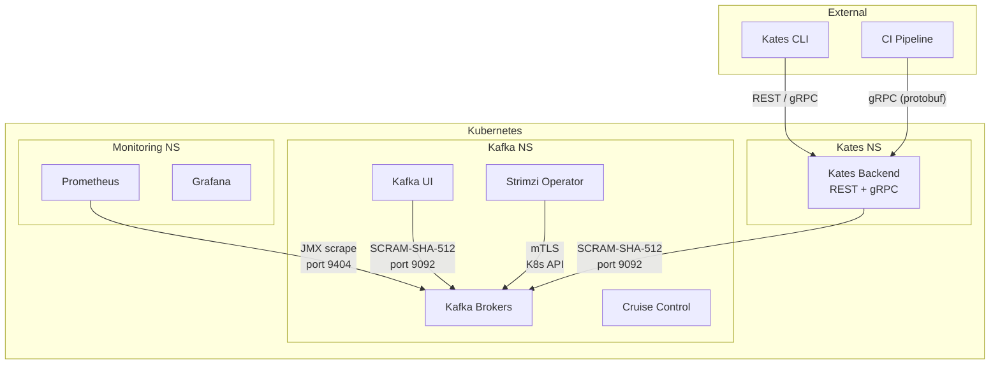
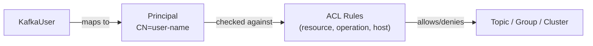
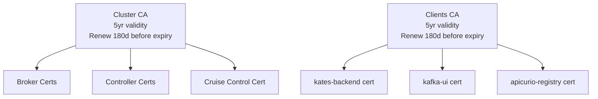
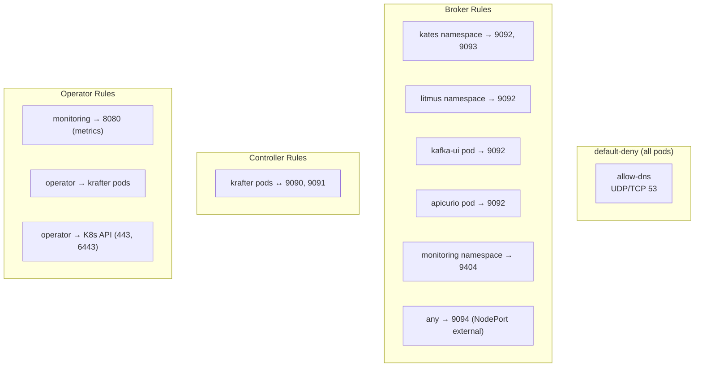

# Chapter 17: Security & Compliance

This chapter covers every security layer in the Kates platform — from Kafka authentication to Kubernetes NetworkPolicies. Use it as a reference when auditing your deployment or onboarding new services.

## Security Architecture Overview



## Authentication

### Kafka Listeners

Each listener enforces a specific authentication mechanism:

| Listener | Port | Auth | Protocol | Clients |
|----------|------|------|----------|---------|
| `plain` | 9092 | SCRAM-SHA-512 | SASL_PLAINTEXT | Kates, Kafka UI, Apicurio |
| `tls` | 9093 | mTLS (certificate) | SASL_SSL | Encrypted internal |
| `external` | 9094 | SCRAM-SHA-512 | SASL_SSL | External tools, CI |

### SCRAM-SHA-512

Strimzi generates SCRAM credentials automatically when you create a `KafkaUser` resource. The password is stored in a Kubernetes Secret with the same name as the user:

```bash
# View generated password
kubectl get secret kafka-ui -n kafka -o jsonpath='{.data.password}' | base64 -d
```

### mTLS (Mutual TLS)

The TLS listener requires both server and client certificates. Strimzi issues client certificates via the Clients CA when a `KafkaUser` uses `authentication.type: tls`.

## Authorization

### ACL Model

Kafka uses **simple ACL authorization** with principal-based access control:



### User Permissions Matrix

| User | Principal | Access Level | Resources | Quotas |
|------|-----------|-------------|-----------|--------|
| `kates-backend` | CN=kates-backend | **superUser** | All (bypasses ACLs) | None |
| `kafka-ui` | CN=kafka-ui | Read-only | All topics, all groups, cluster describe | 1MB/s produce, 50MB/s consume |
| `apicurio-registry` | CN=apicurio-registry | Scoped R/W | `__apicurio*` topics, `apicurio*` groups | 10MB/s produce, 20MB/s consume |
| `litmus-chaos` | CN=litmus-chaos | Full CRUD | All topics, `litmus*` groups, cluster describe | None |

### Adding a New Service

To onboard a new service, create a `KafkaUser` CR:

```yaml
apiVersion: kafka.strimzi.io/v1
kind: KafkaUser
metadata:
  name: my-service
  namespace: kafka
  labels:
    strimzi.io/cluster: krafter
spec:
  authentication:
    type: scram-sha-512
  quotas:
    producerByteRate: 10485760     # 10MB/s
    consumerByteRate: 20971520     # 20MB/s
    requestPercentage: 15          # max 15% of broker CPU
  authorization:
    type: simple
    acls:
      - resource:
          type: topic
          name: "my-service"
          patternType: prefix
        operations: ["Read", "Write", "Create", "Describe"]
        host: "*"
      - resource:
          type: group
          name: "my-service"
          patternType: prefix
        operations: ["Read", "Describe"]
        host: "*"
```

## Certificate Management

Strimzi manages two independent CA hierarchies:



| Property | Value | Purpose |
|----------|-------|---------|
| Validity | 1825 days (5 years) | Long-lived for stability |
| Renewal window | 180 days before expiry | Ample time for rollout |
| Renewal policy | `replace-key` | New key pair on renewal (stronger than key reuse) |

### Rotation Monitoring

Strimzi sets the `NotAfter` date on each certificate. Monitor with:

```bash
kubectl get secret krafter-cluster-ca-cert -n kafka \
  -o jsonpath='{.data.ca\.crt}' | base64 -d | openssl x509 -noout -dates
```

Set up a Prometheus alert for certificates expiring within 30 days.

## Network Policies

The `kafka` namespace enforces **default-deny** for both ingress and egress:



### Policy Summary

| Policy | Target | Ingress From | Ports |
|--------|--------|-------------|-------|
| `default-deny` | All pods | None | None |
| `allow-dns` | All pods | — (egress only) | 53 UDP/TCP |
| `kafka-brokers` | Broker pods | kates, litmus, kafka-ui, apicurio, monitoring | 9091–9094, 9404 |
| `kafka-controllers` | Controller pods | krafter cluster pods | 9090, 9091 |
| `strimzi-operator` | Operator pod | monitoring | 8080 |
| `kafka-ui` | Kafka UI pod | Any | 8080 |
| `cruise-control` | CC pod | Operator, monitoring | 9090, 9404 |
| `strimzi-drain-cleaner` | Drain Cleaner | Any (webhook) | 8443 |

### Testing Network Policies

```bash
# Verify a pod CAN reach brokers (should succeed from kates namespace)
kubectl exec deployment/kates -n kates -- \
  nc -zv krafter-kafka-bootstrap.kafka 9092

# Verify a pod CANNOT reach brokers (should fail from default namespace)
kubectl run test --rm -it --image=busybox -- \
  nc -zv krafter-kafka-bootstrap.kafka 9092
```

## Container Security

### Security Contexts

Kafka containers run with hardened security contexts:

```yaml
template:
  kafkaContainer:
    securityContext:
      allowPrivilegeEscalation: false
      readOnlyRootFilesystem: true
      capabilities:
        drop: ["ALL"]
  pod:
    securityContext:
      runAsNonRoot: true
      fsGroup: 1001
```

| Setting | Value | Purpose |
|---------|-------|---------|
| `runAsNonRoot` | true | Prevents running as UID 0 |
| `readOnlyRootFilesystem` | true | No writes outside mounted volumes |
| `allowPrivilegeEscalation` | false | Blocks `setuid` / `setgid` binaries |
| `drop: ALL` | — | Removes all Linux capabilities |

### Quotas as Security

Per-user quotas prevent denial-of-service from misbehaving clients:

| User | Produce Rate | Consume Rate | CPU Share |
|------|:------------:|:------------:|:---------:|
| `kafka-ui` | 1 MB/s | 50 MB/s | 10% |
| `apicurio-registry` | 10 MB/s | 20 MB/s | 15% |
| `litmus-chaos` | Unlimited | Unlimited | Unlimited |

## Security Checklist

Use this checklist when auditing your deployment:

- [ ] All listeners require authentication (no anonymous access)
- [ ] `superUsers` list contains only the Kates backend principal
- [ ] Each service has its own `KafkaUser` with minimum required ACLs
- [ ] Network policies enforce default-deny in the `kafka` namespace
- [ ] Containers run as non-root with read-only root filesystem
- [ ] Certificate renewal alerts are configured
- [ ] Per-user quotas limit blast radius from runaway clients
- [ ] `deleteClaim: false` on all PVCs (data survives pod deletion)
- [ ] Secrets are not committed to source control (Strimzi auto-generates)

For deployment-level security details (Drain Cleaner, backup encryption), see [Chapter 15: Kafka Deployment Engineering](15-kafka-deployment.md).
