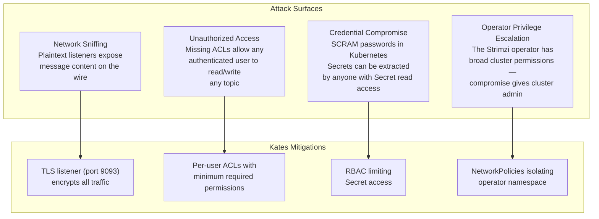
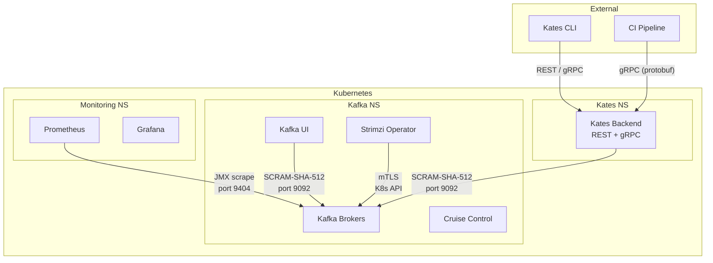
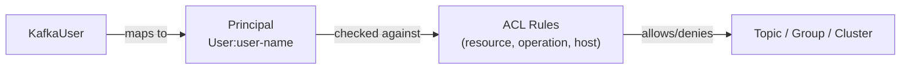
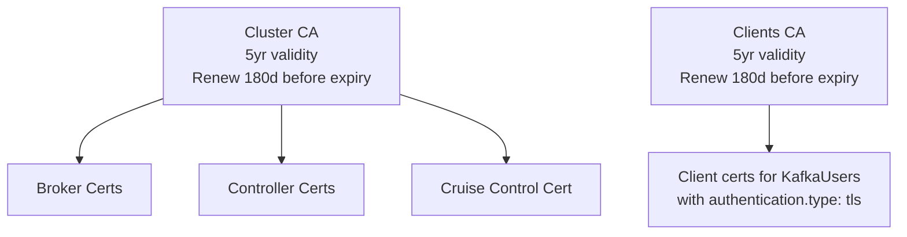
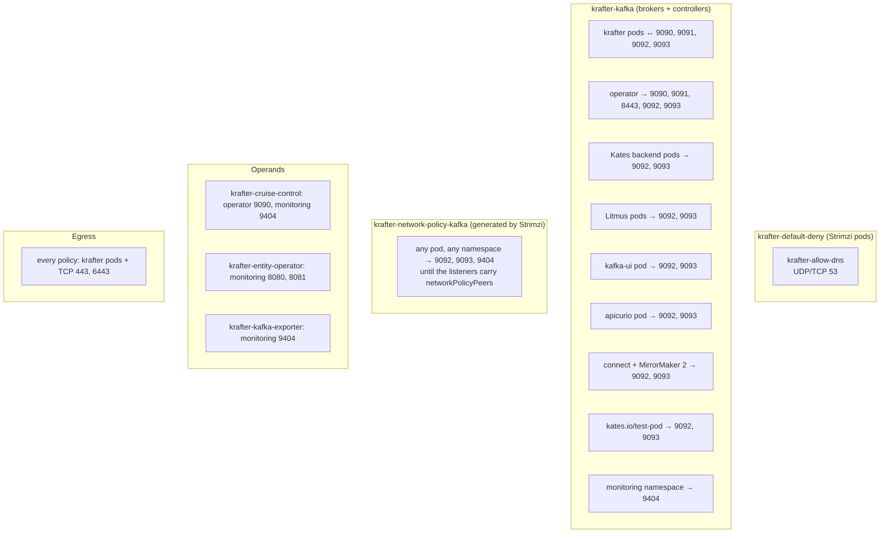
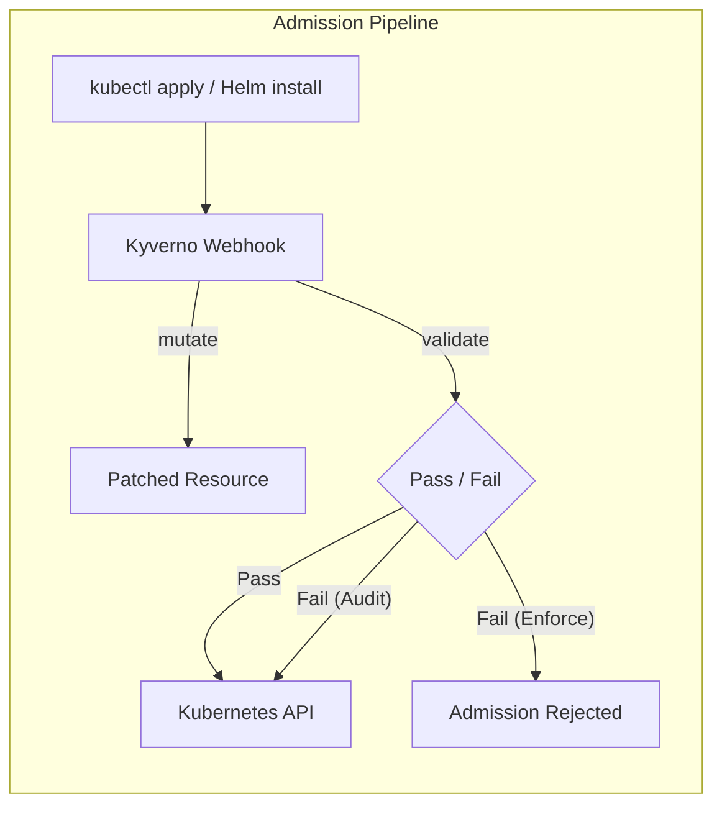

# Security & Compliance

A Kafka cluster is a high-value target. It carries your business data, your audit trails, and your event streams. A misconfigured listener, an overly-permissive ACL, or a missing network policy can expose all of it. This chapter covers every security layer in the Kates platform — not just *what* is configured, but *why* each layer exists and what would happen without it.

Use this chapter as a reference when auditing your deployment, onboarding new services, or designing your own security posture for production. After this chapter, you can:

- Explain which listener each client authenticates on, and why the performance listener deliberately skips TLS
- Onboard a new service with a least-privilege `KafkaUser` — scoped ACLs, prefix patterns, and quotas
- Test what the shipped NetworkPolicies block and what they leave open, and close the listener ports to pods you have not granted
- Rotate the Kates backend's SCRAM password without leaving Kates on the old one
- Grade your cluster's posture with `kates security audit` and act on the findings

## Threat Model

Before diving into configurations, it helps to understand what you're defending against. A Kafka cluster on Kubernetes has four primary attack surfaces:


```mermaid
graph TD
    subgraph Threats["Attack Surfaces"]
        T1["Network Sniffing<br/>Plaintext listeners expose<br/>message content on the wire"]
        T2["Unauthorized Access<br/>Missing ACLs allow any<br/>authenticated user to read/write<br/>any topic"]
        T3["Credential Compromise<br/>SCRAM passwords in Kubernetes<br/>Secrets can be extracted<br/>by anyone with Secret read access"]
        T4["Operator Privilege Escalation<br/>The Strimzi operator has<br/>broad cluster permissions —<br/>compromise gives cluster admin"]
    end

    subgraph Mitigations["Kates Mitigations"]
        M1["TLS listener (port 9093)<br/>encrypts all traffic"]
        M2["Per-user ACLs with<br/>minimum required permissions"]
        M3["RBAC limiting<br/>Secret access"]
        M4["NetworkPolicies isolating<br/>operator namespace"]
    end

    T1 --> M1
    T2 --> M2
    T3 --> M3
    T4 --> M4
```

::: {.callout-important}
The default performance test listener (`plain`, port 9092) uses SCRAM authentication but **no TLS encryption**. This is intentional — TLS adds measurable CPU overhead, and performance baselines should isolate Kafka throughput from encryption cost. For production deployments, always use the `tls` listener (port 9093) or the `external` listener (port 9094, which enables TLS by default).
:::

## Security Architecture Overview


```mermaid
graph TB
    subgraph External
        CLI[Kates CLI]
        CI[CI Pipeline]
    end

    subgraph Kubernetes
        subgraph Kates NS
            API[Kates Backend<br/>REST + gRPC]
        end

        subgraph Kafka NS
            Brokers[Kafka Brokers]
            UI[Kafka UI]
            CC[Cruise Control]
            Operator[Strimzi Operator]
        end

        subgraph Monitoring NS
            Prom[Prometheus]
            Graf[Grafana]
        end
    end

    CLI -->|"REST / gRPC"| API
    CI -->|"gRPC (protobuf)"| API
    API -->|"SCRAM-SHA-512<br/>port 9092"| Brokers
    UI -->|"SCRAM-SHA-512<br/>port 9092"| Brokers
    Prom -->|"JMX scrape<br/>port 9404"| Brokers
    Operator -->|"mTLS<br/>K8s API"| Brokers
```

## Authentication

Authentication answers the question: *"Who are you?"* Every connection to Kafka must prove its identity before it can do anything.

### Kafka Listeners

Each listener enforces a specific authentication mechanism. The choice of listener determines both the security properties and the performance characteristics of the connection:

| Listener | Port | Auth | Protocol | Clients | When to Use |
|----------|------|------|----------|---------|-------------|
| `plain` | 9092 | SCRAM-SHA-512 | SASL_PLAINTEXT | Kates, Kafka UI, Apicurio | Performance testing baselines (no TLS overhead) |
| `tls` | 9093 | mTLS (certificate) | SSL | Encrypted internal | When you need wire encryption between services |
| `external` | 9094 | SCRAM-SHA-512 | SASL_SSL | External tools, CI | Access from outside the Kubernetes cluster, where the values chain declares it |

The chart's base values declare only `plain` and `tls`. `values-prod.yaml` and, outside kind, `kates deploy` add `external`, as [What the Shipped Policies Block](#what-the-shipped-policies-block) explains.

### SCRAM-SHA-512

SCRAM (Salted Challenge Response Authentication Mechanism) is a password-based authentication protocol that never sends the password over the wire. Instead, the client and server exchange salted hashes in a challenge-response sequence. SHA-512 provides strong hashing — brute-forcing a SCRAM-SHA-512 password is computationally expensive.

Strimzi generates SCRAM credentials automatically when you create a `KafkaUser` resource. The password is stored in a Kubernetes Secret with the same name as the user:

```bash
# View generated password
kubectl get secret kafka-ui -n kafka -o jsonpath='{.data.password}' | base64 -d
```

::: {.callout-warning}
Kubernetes Secrets are base64-encoded, **not encrypted**. Anyone with RBAC permission to read Secrets in the `kafka` namespace can extract every SCRAM password, and the copy of the `kates-backend` password in the `kates` namespace is just as exposed. RBAC on Secrets in both namespaces is the wall around these credentials. A NetworkPolicy does not help here: Secrets are read from the Kubernetes API, not from the brokers.
:::

### Cross-Namespace Credential Synchronization

Strimzi writes a `KafkaUser`'s Secret only into the Kafka cluster's namespace (`kafka`). Kates runs in `kates`, so it needs a copy of the `kates-backend` Secret there. `kates deploy` makes that copy each time it installs or reconciles the backend, and so do `make kates-secret` and `scripts/deploy-kates.sh`. Nothing keeps the copy in step between those runs: no controller or policy that ships with Kates watches the source Secret.

A synchronized copy would not be enough on its own anyway. The Kates pod reads the password once, at startup, into the `KATES_KAFKA_SASL_PASSWORD` environment variable, and never reads the Secret again. Whatever keeps the copy current — the steps below, or a Kyverno clone rule or External Secrets that you add yourself — Kates uses a new password only after a restart.

With `kates deploy --topology single`, Kates and Kafka share one namespace, `kates-stack` unless you passed `--namespace`, and Kates reads the Strimzi Secret itself. There is no copy to refresh, but the restart is still needed: in the procedure below, skip step 3, run the `kubectl` commands of the other steps against that namespace, and pass it to `kates ports` with `--app-ns`.

### Password Rotation

Strimzi does not rotate SCRAM passwords on its own. You rotate one by deleting the user's Secret: the User Operator generates a new password, sets it on the brokers and writes a new Secret. From then on the old password no longer authenticates.

For `kates-backend`, that is a short outage of Kates, which lasts until Kates restarts with the new password. Run the steps back to back:

```bash
# 1. Delete the Secret; the User Operator generates a new password
kubectl delete secret kates-backend -n kafka

# 2. Wait for the new Secret. The KafkaUser is already Ready, so waiting on
#    its Ready condition returns at once and proves nothing.
for _ in $(seq 60); do
  kubectl get secret kates-backend -n kafka >/dev/null 2>&1 && break
  sleep 5
done

# 3. Copy the new password into the Kates namespace
PASSWORD=$(kubectl get secret kates-backend -n kafka -o jsonpath='{.data.password}' | base64 -d)
test -n "$PASSWORD" && kubectl create secret generic kates-backend -n kates \
  --from-literal=password="$PASSWORD" --dry-run=client -o yaml | kubectl apply -f -

# 4. Restart Kates so it reads the new password
kubectl rollout restart deployment/kates -n kates
kubectl rollout status deployment/kates -n kates --timeout=300s

# 5. The restart ended any port-forward to the old pod: start the forwards again
kates ports

# 6. Check that Kates can authenticate to Kafka again
kates health
```

A port-forward to a Service is bound to the one pod it picked when it started, and neither `kates ports` nor `make ports` reconnects it when that pod goes away, so step 5 is what makes the API reachable again. `kates ports` also points the `ports` CLI context at the forward it starts and makes it the current context. Skip it if you reach the API through an Ingress or a NodePort.

A finished rollout does not prove the rotation worked. The readiness probe does not depend on Kafka (`kates.health.readiness.require-kafka` is `false`), so the new pod turns Ready even with a wrong password. `kates health` has the backend describe the cluster over its own SASL connection, and its **Kafka Cluster** block must show `UP` and "Kafka cluster is reachable". The command needs only the API URL of your CLI context, because `/api/health` is served without the API key.

::: {.callout-caution}
From step 1 until the restarted pod is Ready, Kates cannot open a new connection to Kafka. Connections it already holds keep working, because Kafka does not re-authenticate them, but every new one fails SASL authentication: the producers and consumers of a new test, or a reconnect after a broker restarts. Rotate when no test or chaos experiment is running.
:::

### mTLS (Mutual TLS)

The TLS listener requires both server and client certificates. Strimzi issues client certificates via the Clients CA when a `KafkaUser` uses `authentication.type: tls`. This provides the strongest authentication — both sides cryptographically verify each other's identity, and the connection is encrypted end-to-end.

## Authorization

Authentication tells Kafka who you are. Authorization tells Kafka what you're allowed to do. Without authorization, an authenticated user can read any topic, join any consumer group, and modify any configuration — a single compromised credential becomes a full breach.

### ACL Model

Kafka uses **simple ACL authorization** with principal-based access control:


```mermaid
graph LR
    User[KafkaUser] -->|"maps to"| Principal["Principal<br/>User:user-name"]
    Principal -->|"checked against"| ACL["ACL Rules<br/>(resource, operation, host)"]
    ACL -->|"allows/denies"| Resource["Topic / Group / Cluster"]
```

A `KafkaUser` authenticating with SCRAM-SHA-512 maps to the principal `User:<username>`. Only users with `authentication.type: tls` get certificate-based principals, whose name is the certificate's Distinguished Name (e.g., `User:CN=my-service`).

Every Kafka operation (produce, consume, describe, create, delete) is checked against the ACL list. If no matching rule is found, the operation is denied by default. This is a **deny-by-default** model — you must explicitly grant every permission.

### User Permissions Matrix

| User | Principal | Access Level | Resources | Quotas |
|------|-----------|-------------|-----------|--------|
| `kates-backend` | User:kates-backend | **superUser** | All (bypasses ACLs) | None |
| `kafka-ui` | User:kafka-ui | Read-only | All topics, all groups, cluster describe | 1MB/s produce, 50MB/s consume |
| `apicurio-registry` | User:apicurio-registry | Scoped R/W | `__apicurio*`, `kafkasql-*`, `registry-*` topics, `apicurio*` groups | 10MB/s produce, 20MB/s consume |
| `litmus-chaos` | User:litmus-chaos | Full CRUD | All topics, `litmus*` groups, cluster describe | None |
| `kates-connect` | User:kates-connect | Scoped R/W | `kates-*`, `cdc*` topics, `kates-connect*`, `connect-*` groups | 50MB/s produce, 50MB/s consume |

::: {.callout-note}
The `kates-backend` user has superUser status because it needs to create test topics, manage consumer groups, and read cluster metadata during benchmark runs. In a production deployment, you would scope this down to only the specific topics and operations Kates requires.
:::

### Adding a New Service

When you onboard a new service to your Kafka cluster, follow the principle of least privilege — grant only the permissions the service actually needs. Here's a template:

```yaml
apiVersion: kafka.strimzi.io/v1
kind: KafkaUser
metadata:
  name: my-service
  namespace: kafka
  labels:
    strimzi.io/cluster: krafter
spec:
  authentication:
    type: scram-sha-512
  quotas:
    producerByteRate: 10485760     # 10MB/s
    consumerByteRate: 20971520     # 20MB/s
    requestPercentage: 15          # max 15% of broker CPU
  authorization:
    type: simple
    acls:
      - resource:
          type: topic
          name: "my-service"
          patternType: prefix
        operations: ["Read", "Write", "Create", "Describe"]
        host: "*"
      - resource:
          type: group
          name: "my-service"
          patternType: prefix
        operations: ["Read", "Describe"]
        host: "*"
```

The `patternType: prefix` is key — it means the service can access any topic or group starting with `my-service` (e.g., `my-service-events`, `my-service-results`). This is more maintainable than listing individual topics, especially as your service evolves.

An ACL is only half the grant. The other half is `networkPolicy.clients`, which turns a pod selector into an ingress rule on the listener ports of the chart's `krafter-kafka` policy:

```yaml
networkPolicy:
  clients:
    - name: my-service
      namespace: apps
      podSelector: { app.kubernetes.io/name: my-service }
      listeners: [plain, tls]
```

`listeners` holds listener *names* from `kafka.listeners`, not ports — the chart derives the ports. An empty `namespace` means the release namespace.

That rule is what lets the service in once the listeners are closed to everyone else. As the charts ship, they are not: Strimzi's own policy admits every pod to them, so the grant starts to matter only after you give the listeners `networkPolicyPeers`, as [Network Policies](#network-policies) shows.

::: {.callout-note}
There is no namespace-level shortcut. `networkPolicies.allowedClientNamespaces` was the 0.4 spelling, it never generated a rule, and `kafka-cluster` 1.0 emits a deprecation notice for it instead of honouring it. Grant per client.
:::

A user the chart should own goes in `users.items` alongside the grant, so one `helm upgrade` carries both; a user for a service outside this release can stay a hand-applied `KafkaUser` as above.

### Granting Full Cluster Rights (Super-User)

A person administering the cluster sometimes needs **full rights** across it. You grant them explicitly, with `All` operations on the `cluster`, `topic`, and `group` resources. Do not use this for an automated tool: give a tool its own `KafkaUser` with scoped ACLs, as in [Adding a New Service](#adding-a-new-service).

Create a file named `kafka-admin-user.yaml` with the following content:

```yaml
apiVersion: kafka.strimzi.io/v1
kind: KafkaUser
metadata:
  name: admin-user
  namespace: kafka
  labels:
    strimzi.io/cluster: krafter
spec:
  authentication:
    type: scram-sha-512
  authorization:
    type: simple
    acls:
      - resource:
          type: cluster
        operations: ["All"]
      - resource:
          type: topic
          name: "*"
          patternType: literal
        operations: ["All"]
      - resource:
          type: group
          name: "*"
          patternType: literal
        operations: ["All"]
```

Apply this file to your cluster:
```bash
kubectl apply -f kafka-admin-user.yaml
```

Once the Strimzi Operator processes the resource, it generates a Kubernetes Secret in the `kafka` namespace with the credentials. You can retrieve the generated SCRAM password using:
```bash
kubectl get secret admin-user -n kafka -o jsonpath="{.data.password}" | base64 -d
```

::: {.callout-warning}
`All` on the `cluster` resource includes `Alter`, which manages ACLs, so this user can grant itself or anyone else any permission, and `All` on every topic lets it delete them. Its password sits in a Secret in the `kafka` namespace like any other. Create the user for the task at hand and delete it afterwards: `kubectl delete kafkauser admin-user -n kafka` removes its credentials and ACLs from the cluster.
:::

## Certificate Management

Strimzi manages two independent CA hierarchies — one for cluster-internal communication and one for client authentication:


```mermaid
graph TD
    ClusterCA["Cluster CA<br/>5yr validity<br/>Renew 180d before expiry"] --> BrokerCert["Broker Certs"]
    ClusterCA --> ControllerCert["Controller Certs"]
    ClusterCA --> CCCert["Cruise Control Cert"]

    ClientsCA["Clients CA<br/>5yr validity<br/>Renew 180d before expiry"] --> UserCert["Client certs for KafkaUsers<br/>with authentication.type: tls"]
```

The Clients CA issues certificates only for `KafkaUser` resources with `authentication.type: tls`. The default managed users all authenticate with SCRAM-SHA-512, so they receive password Secrets rather than client certificates.

| Property | Value | Purpose |
|----------|-------|---------|
| Validity | 1825 days (5 years) | Long-lived for stability |
| Renewal window | 180 days before expiry | Ample time for rollout |
| Renewal policy | `replace-key` | New key pair on renewal (stronger than key reuse) |

The `replace-key` renewal policy means that on each renewal, Strimzi generates an entirely new private key rather than reusing the existing one. This is more secure — if the old key was compromised, the new certificate uses a fresh key pair.

### Rotation Monitoring

Strimzi sets the `NotAfter` date on each certificate. Read it directly with:

```bash
kubectl get secret krafter-cluster-ca-cert -n kafka \
  -o jsonpath='{.data.ca\.crt}' | base64 -d | openssl x509 -noout -dates
```

For alerting, use the rules the `strimzi-operator` chart ships instead of writing your own. The Cluster Operator publishes `strimzi_certificate_expiration_timestamp_ms` for the cluster and clients CA certificates of every Kafka cluster it manages, and the chart's PrometheusRule, `strimzi-operator-operator-alerts` in the `strimzi-operator` namespace, alerts on it:

| Alert | Fires When the Certificate Expires In | Severity |
|-------|---------------------------------------|----------|
| `KafkaCertificateExpiringSoon` | Under 30 days, for 1h | warning |
| `KafkaCertificateExpiryCritical` | Under 7 days, for 30m | critical |

The thresholds are the chart's `alerts.thresholds.certificateWarningDays` and `alerts.thresholds.certificateCriticalDays`. Strimzi renews a CA 180 days before it expires, so either alert means a renewal did not happen: look at the operator's logs and at the cluster's `maintenanceTimeWindows`, outside which Strimzi does not renew.

::: {.callout-important}
The chart renders the rule, and the PodMonitor that scrapes the operator, only if the `monitoring.coreos.com` API exists when the release is installed or upgraded. `kates deploy` installs the operator before the monitoring stack, so after the first deploy on a fresh cluster neither object exists. Check:

```bash
kubectl get prometheusrule,podmonitor -n strimzi-operator
```

If nothing is listed, run `kates deploy` again with the flags you first used. It upgrades the operator release on every run, and this time the API is there. Each of those upgrades passes `--reset-values` and the kind or generic overlay, so on an operator you manage with Helm yourself it drops `values-prod.yaml` and every value you set. For that operator, upgrade the release yourself with its own values, as [Kafka Deployment Engineering](15-kafka-deployment.md#strimzi-operator-crashloopbackoff) shows, which renders both objects now that the API exists, and pass `--with-strimzi=false` whenever you run `kates deploy`.
:::

## Audit Logging

Kafka's authorizer can log every authorization decision — who accessed what, and when. The authorizer itself is already configured on the krafter cluster: Strimzi derives it from `spec.kafka.authorization` (`type: simple`), and it does not allow `authorizer.class.name` to be set directly in the `config` section — unsupported keys placed there are filtered out. What you control is the log level of `kafka.authorizer.logger`, which lives under `spec.kafka.logging` in the Kafka CR:

```yaml
spec:
  kafka:
    logging:
      type: inline
      loggers:
        rootLogger.level: INFO
        # Kafka 4.x brokers use Log4j2: declare the logger by name, then set its level
        logger.authorizer.name: kafka.authorizer.logger
        logger.authorizer.level: DEBUG
```

At the default `INFO` level the authorizer logs denied operations only. At `DEBUG`, every produce, consume, and admin operation generates an audit entry that includes the principal, the resource, the operation, and the decision (ALLOWED or DENIED). These logs are invaluable during security incident investigations.

::: {.callout-warning}
Turn `DEBUG` on for an investigation, then set the logger back to `INFO`. The authorizer checks every request, so at `DEBUG` each broker writes a line for every authorized produce and fetch request, including those of `kates-backend`: super-user status skips the ACLs but not the log. Under a Kates load test that can be thousands of lines a second per broker, which costs broker CPU and log storage and skews the baseline you are measuring.
:::

::: {.callout-tip}
For lighter-weight auditing, Kates records every mutating operation issued through the backend — test creates and deletes, topic changes, disruption runs — in its audit log. Inspect the trail with `kates audit`, filtering with `--type` and `--since`.
:::

## Network Policies

Network policies decide which pods can open a socket to the brokers at all, so that a compromised pod elsewhere in the cluster cannot even try a stolen password. Know what the shipped ones do before you rely on them: as the charts ship, the client listeners are open to every pod in the cluster.

### What the Shipped Policies Block

Whether `kafka-cluster` renders any policy depends on the values chain. `kates deploy` starts its chain with `.build/values-detected.yaml`, which it writes from what it detects on the cluster, layers `values-platform.yaml` over it, and adds `values-kind.yaml` on a kind cluster:

| Values Chain | kafka-cluster NetworkPolicies |
|--------------|-------------------------------|
| `values-kind.yaml`, `values-dev.yaml` | None: both set `networkPolicy.enabled: false` |
| `kates deploy` on a cluster whose CNI it cannot identify, EKS, GKE and AKS excepted | None: `values-detected.yaml` turns them off |
| `kates deploy` on any other cluster, the base values, `values-staging.yaml`, `values-prod.yaml` | The six in [Policy Summary](#policy-summary), plus `krafter-test-egress` |

Where the chart's policies render, they add two things:

- **Egress** from the brokers, controllers, Cruise Control, the Entity Operator and the Kafka Exporter is limited to the cluster's own pods, DNS, and TCP 443 and 6443 to any address. Set `networkPolicy.apiServer.ipBlock` to pin those two ports to the Kubernetes API server.
- **A deny-all**, `krafter-default-deny`, for every pod of the cluster, so that Cruise Control, the Entity Operator and the Kafka Exporter accept only what a policy allows them.

The internal ports are closed to other workloads in every profile, and not by the chart. The Strimzi Cluster Operator generates a policy of its own for every Kafka cluster, `krafter-network-policy-kafka`, unless its `STRIMZI_NETWORK_POLICY_GENERATION` is off (it is on by default). That policy admits only the cluster's brokers and controllers and the Cluster Operator to 9090 (controller quorum and control plane), those and the cluster's other operands to 9091 (replication), and only the operator to 8443 (the Kafka agent). It recognizes the operator by the label `strimzi.io/kind: cluster-operator` in any namespace, unless the operator knows the labels of its own namespace: set `strimzi-kafka-operator.image.operatorNamespaceLabels` on the `strimzi-operator` release, for example to `kubernetes.io/metadata.name=strimzi-operator`, to hold those rules to that namespace.

Neither policy restricts the client listeners. NetworkPolicies are additive: a connection is allowed when **any** policy that selects the pod allows it. In Strimzi's policy, a listener without `networkPolicyPeers` admits every pod in every namespace, and no listener in the chart's values or in `values-detected.yaml` has them. Whatever the values chain, this is who can connect:

| Port | Who Can Connect |
|------|-----------------|
| 9092 (`plain`), 9093 (`tls`) | Every pod in the cluster |
| 9404 (metrics) | Every pod in the cluster: Strimzi opens the metrics port to all while `metrics.enabled` is on, as it is by default |
| 9094 (`external`), wherever the chain declares it | Every source. `kafka.externalAccess.allowedCidrs` narrows only the chart's rule |

Two things declare 9094: `kafka.externalAccess`, which `values-prod.yaml` sets to a NodePort, and `values-detected.yaml`, which adds an `external` listener on every cluster but kind, a NodePort or, on EKS, GKE and AKS, a LoadBalancer. `kates deploy` therefore exposes 9094 outside kind although the base values leave `kafka.externalAccess` off. On EKS, GKE and AKS the detected listener annotates the bootstrap Service only, so every broker's load balancer gets the provider's default, usually a public address, and on EKS and GKE the bootstrap's is public too; only the AKS bootstrap is internal. A default `kates deploy` on those clouds can therefore put 9094 on the internet, with TLS and SCRAM-SHA-512 as its only guard. [Deployment Guide](12-deployment.md#cloud-deployment) replaces that listener with internal load balancers that admit only the ranges you list.

So neither `krafter-default-deny` nor the client list in `networkPolicy.clients` keeps anyone off the listeners on its own. Until you close them, SCRAM authentication and ACLs are what stand between an arbitrary pod and your data.

### Closing the Listeners

Give every listener in `kafka.listeners` a `networkPolicyPeers` list. Strimzi's policy then admits only those peers, and because the two policies add up, the pods that can connect are the ones the chart already admits (every `networkPolicy.clients` entry, the `kates.io/test-pod` pods, the cluster's own pods and the operator) plus the peers you name. One narrow peer is therefore enough, and `networkPolicy.clients` stays the one place where you grant access.

Helm replaces lists instead of merging them, so restate every listener the release has, not only the base values' two. List them first:

```bash
kubectl get kafka krafter -n kafka -o jsonpath='{.spec.kafka.listeners[*].name}'
```

On kind that prints `plain tls`, which the file below restates. If it also prints `external`, keep that listener too, in the form shown for port 9094 further down.

The file also grants Kafka UI, which the platform profile misses on the default install: `kates deploy` puts Kafka UI in the `kafka` namespace (`--ui-ns` defaults to `kafka`), and the profile grants `app: kafka-ui` only in `kates` and `kafka-ui`. Kafka UI reaches the brokers today through Strimzi's open rule and loses them once the peers land, unless the file grants it:

```yaml
# closed-listeners.yaml
kafka:
  listeners:
    - name: plain
      port: 9092
      type: internal
      tls: false
      authentication:
        type: scram-sha-512
      networkPolicyPeers:
        - podSelector:
            matchLabels:
              kates.io/test-pod: "true"
    - name: tls
      port: 9093
      type: internal
      tls: true
      authentication:
        type: tls
      networkPolicyPeers:
        - podSelector:
            matchLabels:
              kates.io/test-pod: "true"
networkPolicy:
  # The allow list the peers rely on; values-kind.yaml and values-dev.yaml turn it off
  enabled: true
  clients:
    # kates deploy sets this entry: keep it, with the namespace you gave --connect-ns
    - name: connect
      namespace: connect
    # Kafka UI where kates deploy installs it
    - name: kafka-ui-in-kafka
      namespace: kafka
      podSelector: { app: kafka-ui }
      listeners: [plain, tls]
```

A peer with only a `podSelector` selects pods in the Kafka namespace, which here are the Helm test pods the chart admits anyway. The chart passes the list to the `Kafka` resource unchanged, and Strimzi rewrites its policy on the next reconciliation.

The peers rely on the chart's policies: without them, Strimzi's policy is the only one, and the peers you name are the only pods that can connect. That is why the file sets `networkPolicy.enabled: true`. Where `kates deploy` could not identify the CNI, that is not enough: `values-detected.yaml` turned the policies off with the older key `networkPolicies.enabled: false`, which the chart applies over a `networkPolicy.enabled` left at its default of `true`, so add `networkPolicies: {enabled: true}` to the file as well.

Apply the file over the values the release already has:

```bash
helm repo add seaweedfs https://seaweedfs.github.io/seaweedfs/helm
helm dependency build charts/kafka-cluster

helm upgrade krafter charts/kafka-cluster -n kafka --reuse-values -f closed-listeners.yaml
kubectl get networkpolicy krafter-kafka -n kafka
```

The chart does not render until `helm dependency build` has filled its gitignored `charts/` directory, and once `Chart.lock` exists the build fetches the SeaweedFS subchart only from a repository Helm has configured, hence the `helm repo add`, once per machine. `--reuse-values` keeps everything the release was installed with — for a `kates deploy` release, `values-detected.yaml`, the platform profile, the kind overlay, its `--set` flags and the version pins — and lays the file over it. Do not upgrade with the file alone: the release would lose the platform profile, and with it every `networkPolicy.clients` grant and the `kates-backend` super user, while the peers admit only test pods, so Kates, Kafka UI and Connect would lose the brokers. `kates deploy` has no flag for a values file of yours, and a later run leaves the release alone, because it skips a Kafka cluster that is already installed. The `kubectl get` must find `krafter-kafka`. If it does not, the chart's policies are off and only the peers can connect: add the key from the previous paragraph and upgrade again.

::: {.callout-warning}
Anything that reaches the brokers today without a `networkPolicy.clients` entry loses access when the peers land: an ad-hoc debug pod, a client nobody declared. Compare the client list with what actually connects before you roll this out, and run the probe in [Testing Network Policies](#testing-network-policies) afterwards.
:::

::: {.callout-important}
`kafka.externalAccess.allowedCidrs` does not close port 9094. It narrows the chart's rule for the listener, but Strimzi's policy still admits every source to a listener without `networkPolicyPeers`, and the `externalAccess` preset cannot carry them.
:::

To restrict 9094, declare the listener yourself in `kafka.listeners`, named `external`, with `ipBlock` peers, and set `kafka.externalAccess.type` to `none` so that the preset does not replace it. `allowedCidrs` still narrows the chart's rule for a listener of that name. Add the listener to `closed-listeners.yaml` as a third entry of `kafka.listeners`, after `plain` and `tls`, with the type and `configuration` it has in `kubectl get kafka krafter -n kafka -o yaml` (on EKS, GKE and AKS, `kates deploy` declares a LoadBalancer with provider annotations):

```yaml
kafka:
  externalAccess:
    type: none
    allowedCidrs: ["203.0.113.0/24"]
  listeners:
    # plain and tls come first, as above
    - name: external
      port: 9094
      type: nodeport
      tls: true
      authentication:
        type: scram-sha-512
      configuration:
        externalTrafficPolicy: Local
      networkPolicyPeers:
        - ipBlock:
            cidr: 203.0.113.0/24
```

`externalTrafficPolicy: Local` keeps the client's address, where the infrastructure supports it, so the brokers see it. With the default, `Cluster`, a connection can arrive from a node's address instead, which your `ipBlock` does not cover.

Port 9404 serves read-only metrics, and no listener setting closes it. Two settings do, each at a price. `metrics.enabled: false`, with `alerts.enabled: false`, which the chart requires with it, stops Strimzi opening the port, and the brokers stop exporting the metrics Prometheus scrapes there. The operator's `strimzi-kafka-operator.generateNetworkPolicy: false` stops Strimzi generating policies at all, for every cluster that operator manages; the chart's policies are then the only ones on the brokers, which also makes `networkPolicy.clients` the allow list for the listeners. Turn generation off only where the chart's policies render: under `values-kind.yaml` or `values-dev.yaml`, the brokers would have no policy at all, internal ports included.

### Policy Summary

Every policy is named for its cluster, so two clusters can share a namespace. These are what `kafka-cluster` renders with the platform profile and the base listeners, beside the one Strimzi generates:


```mermaid
graph TD
    subgraph Default["krafter-default-deny (Strimzi pods)"]
        DNS["krafter-allow-dns<br/>UDP/TCP 53"]
    end

    subgraph Kafka["krafter-kafka (brokers + controllers)"]
        B0["krafter pods ↔ 9090, 9091, 9092, 9093"]
        B1["operator → 9090, 9091, 8443, 9092, 9093"]
        B2["Kates backend pods → 9092, 9093"]
        B3["Litmus pods → 9092, 9093"]
        B4["kafka-ui pod → 9092, 9093"]
        B5["apicurio pod → 9092, 9093"]
        B6["connect + MirrorMaker 2 → 9092, 9093"]
        B7["kates.io/test-pod → 9092, 9093"]
        B8["monitoring namespace → 9404"]
    end

    subgraph Generated["krafter-network-policy-kafka (generated by Strimzi)"]
        G1["any pod, any namespace → 9092, 9093, 9404<br/>until the listeners carry networkPolicyPeers"]
    end

    subgraph Operands
        O1["krafter-cruise-control: operator 9090, monitoring 9404"]
        O2["krafter-entity-operator: monitoring 8080, 8081"]
        O3["krafter-kafka-exporter: monitoring 9404"]
    end

    subgraph Egress
        E1["every policy: krafter pods + TCP 443, 6443"]
    end
```

| Policy | Target | Ingress From | Ports |
|--------|--------|-------------|-------|
| `krafter-default-deny` | Strimzi cluster pods (`app.kubernetes.io/part-of: strimzi-krafter`) | None | None |
| `krafter-allow-dns` | Strimzi cluster pods | — (egress only) | 53 UDP/TCP |
| `krafter-kafka` | Broker **and** controller pods | krafter pods, operator, and every `networkPolicy.clients` entry; monitoring for metrics | 9090, 9091, 8443, 9092, 9093, 9404 |
| `krafter-cruise-control` | Cruise Control pod | Operator, monitoring | 9090, 9404 |
| `krafter-entity-operator` | Entity Operator pod | monitoring | 8080, 8081 |
| `krafter-kafka-exporter` | Kafka Exporter pod | monitoring | 9404 |

`krafter-default-deny` allows nothing, so for the pods it selects, whatever no other policy allows is dropped. It does not outvote an allow: the ingress rules of `krafter-kafka` and of Strimzi's `krafter-network-policy-kafka` add up.

A seventh, `krafter-test-egress`, gives pods labelled `kates.io/test-pod=true` egress to the listeners, the Kafka agent, DNS and the API server. It carries `helm.sh/resource-policy: keep` so a `helm test` against a reinstalled release still works.

Client ports come from the listeners, so an external listener, from the `kafka.externalAccess` preset or from `kafka.listeners`, adds its port (9094 by default) to the rules that need it, and `externalAccess.allowedCidrs` restricts the chart's rule for the one named `external`. The chart renders no policy that selects another release's pods — the operator's own policy belongs to the `strimzi-operator` release (`operatorPolicy`, on by default), and Kafka UI, Connect and MirrorMaker 2 each carry their own.

Re-derive the list rather than trusting this table, since it follows the values chain you deploy with:

```bash
helm repo add seaweedfs https://seaweedfs.github.io/seaweedfs/helm
helm dependency build charts/kafka-cluster

helm template krafter charts/kafka-cluster -n kafka \
  -f charts/kafka-cluster/values-platform.yaml \
  | grep -A2 'kind: NetworkPolicy' | grep 'name:'
```

On a running cluster, `kubectl get networkpolicy -n kafka` lists Strimzi's generated policies beside these.

### Testing Network Policies

Don't trust that your network policies work — test them, with a test that can fail. A probe such as `nc -z` from a throwaway pod fails for many reasons that have nothing to do with policy: the image does not pull, admission rejects the pod, the name does not resolve, the broker is down. Reading every failure as "blocked" proves nothing. A failed probe is evidence of a policy drop only when:

- the same probe, run from a pod the policies admit, connects, so the brokers, DNS and the probe itself work;
- the probing pod resolved the bootstrap name and its connection **timed out**. A policy drops packets, whereas a refusal means something answered;
- the probing pod's own namespace has no NetworkPolicy that could have dropped its egress.

`make kafka-verify-policies` runs that test (see [Validating Policy Compliance](#validating-policy-compliance)). To run it by hand from the repository root, use the `kates-tester` image that the chart's Helm tests run:

```bash
IMAGE=$(awk '$1 == "kubectl:" {gsub(/"/, "", $2); print $2; exit}' charts/kafka-cluster/values.yaml)
PROBE='getent hosts krafter-kafka-bootstrap.kafka.svc >/dev/null || { echo "no DNS"; exit; }
timeout 5 bash -c "exec 3<>/dev/tcp/krafter-kafka-bootstrap.kafka.svc/9092"; echo "exit $?"'

# Control: a pod the chart always admits. It must print "exit 0".
kubectl run np-control -n kafka --rm -i --restart=Never --image="$IMAGE" \
  --labels=kates.io/test-pod=true -- bash -c "$PROBE"

# The probe: a namespace with no grant, and no NetworkPolicy of its own
kubectl get networkpolicy -n default
kubectl run np-probe -n default --rm -i --restart=Never --image="$IMAGE" -- bash -c "$PROBE"
```

`exit 0` from the probe means it reached the broker. `exit 124` is a timeout, and counts as blocked only if the control printed `exit 0` and `default` has no NetworkPolicy. Any other result proves nothing either way. On the charts as shipped, expect `exit 0` from both pods until you [close the listeners](#closing-the-listeners). If admission rejects the pods, use `make kafka-verify-policies`, whose probe pods carry a restricted security context and resource limits.

## Container Security

### Security Contexts

Every container in the Kates platform runs with a hardened security context. These settings follow the Kubernetes Pod Security Standards (PSS) at the **restricted** level:

```yaml
template:
  kafkaContainer:
    securityContext:
      allowPrivilegeEscalation: false
      readOnlyRootFilesystem: true
      capabilities:
        drop: ["ALL"]
  pod:
    securityContext:
      runAsNonRoot: true
      fsGroup: 1001
```

| Setting | Value | Purpose |
|---------|-------|---------|
| `runAsNonRoot` | true | Prevents running as UID 0 — even if the container image specifies `USER root` |
| `readOnlyRootFilesystem` | true | No writes outside mounted volumes — prevents attackers from dropping malware |
| `allowPrivilegeEscalation` | false | Blocks `setuid` / `setgid` binaries — prevents privilege escalation within the container |
| `drop: ALL` | — | Removes all Linux capabilities — no raw sockets, no network admin, no filesystem mounts |

### Quotas as Security

Per-user quotas prevent denial-of-service from misbehaving clients. Without quotas, a single runaway producer can saturate broker network bandwidth, disk I/O, and CPU — degrading performance for every other client on the cluster.

| User | Produce Rate | Consume Rate | CPU Share |
|------|:------------:|:------------:|:---------:|
| `kafka-ui` | 1 MB/s | 50 MB/s | 10% |
| `apicurio-registry` | 10 MB/s | 20 MB/s | 15% |
| `kates-connect` | 50 MB/s | 50 MB/s | 25% |
| `litmus-chaos` | Unlimited | Unlimited | Unlimited |

::: {.callout-note}
The `litmus-chaos` user intentionally has no quotas. Chaos experiments sometimes need to generate burst traffic to test broker behavior under pressure. Limiting the chaos agent would defeat the purpose.
:::

## Kyverno Policy Integration & Admission Control

The Kates platform integrates **Kyverno** as a Kubernetes-native policy engine for enforcing security standards via admission control. Think of Kyverno as a security guard at the door of your cluster — it inspects every resource creation and modification request and either fixes it, approves it, or rejects it.


```mermaid
graph LR
    subgraph Admission Pipeline
        Req["kubectl apply / Helm install"] --> Webhook["Kyverno Webhook"]
        Webhook -->|"mutate"| Mutated["Patched Resource"]
        Webhook -->|"validate"| Decision{"Pass / Fail"}
        Decision -->|"Pass"| API["Kubernetes API"]
        Decision -->|"Fail (Enforce)"| Reject["Admission Rejected"]
        Decision -->|"Fail (Audit)"| API
    end
```

### Cluster Policies

The kates chart ships four `ClusterPolicy` resources. It renders them only when `kyvernoPolicy.enabled=true` in the Helm values and the Kyverno API exists, and the last two need a switch of their own besides (the kafka-cluster and kates-chaos charts ship additional policies of their own):

| Policy | Category | Severity | Description |
|--------|----------|----------|-------------|
| `kates-pod-security-standards` | Pod Security | High | Mutates and validates restricted PSS: non-root, drop ALL capabilities, seccomp, read-only rootfs, no privilege escalation |
| `kates-workload-standards` | Best Practices | Medium | Requires standard labels, health probes, and pinned image tags on workloads |
| `kates-image-verification` | Supply Chain | Critical | Verifies Cosign image signatures from trusted registries. Off by default: needs `kyvernoPolicy.cosign.enabled` and a `publicKey` |
| `kates-generate-network-policies` | Network Security | Medium | Generates default-deny NetworkPolicies in namespaces created after it. Off by default: needs `kyvernoPolicy.networkPolicyGeneration.enabled`, which `kates kyverno apply --with-netpol` sets |

### Pod Security Standards (Mutate + Validate)

The `kates-pod-security-standards` policy combines **mutation** (auto-patching) with **validation** (enforcement). This two-phase approach is deliberate: mutation silently fixes common mistakes so developers don't have to remember every security setting, while validation catches anything mutation couldn't fix.

**Mutation rules** (applied first):

| Rule | What It Patches |
|------|-----------------|
| `mutate-run-as-non-root` | Sets `runAsNonRoot: true`, `runAsUser: 1000`, `fsGroup: 1000` |
| `mutate-drop-capabilities` | Adds `capabilities.drop: ["ALL"]` to every container |
| `mutate-seccomp-profile` | Sets `seccompProfile.type: RuntimeDefault` |
| `mutate-disable-privilege-escalation` | Sets `allowPrivilegeEscalation: false` |
| `mutate-readonly-rootfs` | Sets `readOnlyRootFilesystem: true` |

**Validation rules** (enforced after mutation):

| Rule | Enforcement |
|------|-------------|
| `validate-non-root` | Rejects pods without `runAsNonRoot: true` |
| `validate-drop-capabilities` | Rejects containers that don't drop ALL capabilities |
| `validate-seccomp-profile` | Requires `RuntimeDefault` or `Localhost` seccomp profile |
| `validate-no-privilege-escalation` | Rejects `allowPrivilegeEscalation: true` |
| `validate-readonly-rootfs` | Rejects writable root filesystems |
| `require-resource-limits` | Requires `memory` limits and `cpu` requests |

::: {.callout-note}
Mutation uses the `+(key)` conditional anchor syntax — values are injected only if the field is not already set. This prevents Kyverno from overwriting explicitly declared security contexts. If a developer explicitly sets `runAsUser: 5000`, Kyverno respects that choice.
:::

### Cosign Image Verification

The `kates-image-verification` policy enforces **supply chain security** by verifying container image signatures before admission. This protects against tampered images — even if an attacker pushes a malicious image to your registry, it won't be admitted unless it carries a valid Cosign signature from your trusted key.

```yaml
kyvernoPolicy:
  cosign:
    enabled: true
    publicKey: |
      -----BEGIN PUBLIC KEY-----
      MFkwEwYHKoZIzj0CAQYIKoZIzj0DAQcDQgAE...
      -----END PUBLIC KEY-----
    imagePatterns:
      - "ghcr.io/bmscomp/*"
```

When enabled, unsigned or tampered images from the specified registries are rejected at admission time. The policy also mutates image references to use digests (`mutateDigest: true`) for immutable deployments.

### Automatic NetworkPolicy Generation

The `kates-generate-network-policies` policy is off by default: it renders only when both `kyvernoPolicy.enabled` and `kyvernoPolicy.networkPolicyGeneration.enabled` are true, which `kates kyverno apply --with-netpol` sets. Once it is on, Kyverno generates three NetworkPolicies in every namespace created afterwards:

1. **`default-deny-ingress`** — blocks all inbound traffic
2. **`default-deny-egress`** — blocks all outbound traffic
3. **`allow-dns-egress`** — allows DNS egress on port 53 (UDP and TCP) to any namespace

These policies are synchronized (`synchronize: true`) — Kyverno continuously reconciles them if they are manually deleted. This means even if someone accidentally (or maliciously) deletes the default-deny policies, they're automatically recreated.

### Namespace Exclusions

Certain system and infrastructure namespaces are excluded from automatic NetworkPolicy generation to prevent breaking core platform services:

| Excluded Namespace | Reason |
|--------------------|--------|
| `kube-system` | Core Kubernetes components |
| `kube-public` | Public cluster metadata |
| `kube-node-lease` | Node heartbeat Lease objects |
| `kyverno` | Kyverno's own namespace |
| `strimzi-operator` | Strimzi Operator requires API server and Kafka namespace egress |
| `monitoring` | Prometheus must scrape metrics across all namespaces |
| `kafka` | Managed by dedicated kafka-cluster chart NetworkPolicies |
| `cert-manager` | Requires webhook ingress and ACME provider egress |
| `litmus` | Chaos runner pods need cross-namespace API access |
| `kates-detect-*` | Temporary CLI prober namespaces for latency and storage benchmarks |

### Policy Exceptions

For development environments where strict enforcement would impede workflows, Kates supports `PolicyException` CRDs (Kyverno `v2` API). These temporarily relax specific validation rules for designated namespaces without disabling the entire policy:

```yaml
apiVersion: kyverno.io/v2
kind: PolicyException
metadata:
  name: litmus-kates-pod-security-standards-exception
  namespace: litmus
spec:
  exceptions:
    - policyName: kates-pod-security-standards
      ruleNames:
        - validate-readonly-rootfs
        - validate-drop-capabilities
  match:
    any:
      - resources:
          namespaces: [litmus]
          kinds: [Pod, Deployment, StatefulSet, ReplicaSet]
```

Exceptions are configured via Helm values under `kyvernoPolicy.policyExceptions` and deployed only when `policyExceptions.enabled=true`.

### Enforce vs Audit Modes

All Kyverno policies support two operational modes, controlled by the `kyvernoPolicy.action` Helm value:

| Mode | Behavior | Use Case |
|------|----------|----------|
| `Audit` (default) | Violations are logged in `PolicyReport` CRDs but pods are **not blocked** | Initial rollout, observability, compliance auditing |
| `Enforce` | Non-compliant pods are **rejected** at admission | Production hardening, strict compliance |

::: {.callout-tip}
Start with `Audit` mode. Review the `PolicyReport` violations with `kates kyverno violations` to see what would break, then switch to `Enforce` once you've resolved all legitimate violations. Jumping straight to `Enforce` on a running cluster is a recipe for cascading failures.
:::

Switch modes at runtime using the Kates CLI (see below) or by patching the Helm values.

### Kates CLI: `kyverno` Subcommands

The Kates CLI provides native Kyverno management through the `kates kyverno` command group:

```bash
# Show all ClusterPolicies with mode, readiness, and rule counts
kates kyverno status

# Show policy violations grouped by namespace and pod
kates kyverno violations
kates kyverno violations --namespace kafka

# Switch a policy to Enforce mode (blocks non-compliant pods)
kates kyverno enforce kates-pod-security-standards

# Switch a policy back to Audit mode (log-only)
kates kyverno audit kates-pod-security-standards
```

| Command | Aliases | Description |
|---------|---------|-------------|
| `kates kyverno status` | `st`, `list` | Lists all ClusterPolicies with mode, ready state, validate/mutate rule counts, and violation summary |
| `kates kyverno violations` | `viol`, `fails` | Pretty-prints `PolicyReport` violations grouped by namespace and pod, with `--namespace` filter |
| `kates kyverno enforce <policy>` | — | Patches a ClusterPolicy's `validationFailureAction` to `Enforce` |
| `kates kyverno audit <policy>` | — | Patches a ClusterPolicy's `validationFailureAction` to `Audit` |

::: {.callout-tip}
**Cross-references:**
- For Kyverno installation instructions, see [Installing Kafka with the kafka-cluster Helm Chart](20-installation-guide.md#15-kyverno-optional).
- For Kyverno upgrade procedures, see [Upgrade Playbook](18-upgrade-playbook.md).
- For a full index of Kyverno-related troubleshooting, see [Troubleshooting Index](appendix-b-troubleshooting.md#deployment-issues).
:::

## Security Checklist

Use this checklist when auditing your deployment. Each item links to the section that explains how to verify it:

- [ ] All listeners require authentication (no anonymous access) — see [Authentication](#authentication)
- [ ] `superUsers` list contains only the Kates backend principal — see [User Permissions Matrix](#user-permissions-matrix)
- [ ] Each service has its own `KafkaUser` with minimum required ACLs — see [Adding a New Service](#adding-a-new-service)
- [ ] Every listener carries `networkPolicyPeers` (an external one declared in `kafka.listeners`, since the `externalAccess` preset cannot carry them), and a pod with no grant times out on the listener ports — see [Closing the Listeners](#closing-the-listeners)
- [ ] Containers run as non-root with read-only root filesystem — see [Container Security](#container-security)
- [ ] The operator's certificate-expiry alerts are loaded (`kubectl get prometheusrule -n strimzi-operator`) — see [Rotation Monitoring](#rotation-monitoring)
- [ ] Per-user quotas limit blast radius from runaway clients — see [Quotas as Security](#quotas-as-security)
- [ ] `deleteClaim: false` on all PVCs (data survives pod deletion) — see [Kafka Deployment Engineering](15-kafka-deployment.md)
- [ ] Secrets are not committed to source control (Strimzi auto-generates) — see [SCRAM-SHA-512](#scram-sha-512)
- [ ] Denied operations reach your log pipeline (the authorizer logs them at `INFO`), and `DEBUG` stays off outside investigations — see [Audit Logging](#audit-logging)

### Validating Policy Compliance

To automate the verification of Kyverno policies, Strimzi operator health, and NetworkPolicy connectivity, use the built-in `make` target:

```bash
make kafka-verify-policies
```

The target runs `scripts/verify-kafka-policies.sh`, which exits 0 when every check passes, 1 when one fails, and 2 when none failed but the network probe reached no verdict. `make` prints the script's status as `Error 1` or `Error 2`, and itself exits 2 for either. The script takes these steps, of which the first reports Kyverno rejections without counting them as a failure:

1. Scan the `kafka` namespace events for any Kyverno rejections.
2. Find the Strimzi Cluster Operator in whichever namespaces it runs, and verify that each of them has an operator pod that is `Running` and Ready. An Evicted pod not yet garbage-collected, or a new pod still `Pending` during a rollout, does not fail the check.
3. Check the Kafka cluster CR status to ensure it successfully reached the `Ready` state.
4. Run the probe from [Testing Network Policies](#testing-network-policies) against the `plain` listener: first a control pod labelled `kates.io/test-pod=true` in the `kafka` namespace, then a pod with no grant in `default`. It reports **blocked** only for a timeout after a successful lookup, with the control connected and no NetworkPolicy in `default`. A connection is a failure; any other result is inconclusive.

Set `PROBE_NAMESPACE` to probe from another namespace, for example `make kafka-verify-policies PROBE_NAMESPACE=apps`; `KAFKA_NAMESPACE` and `KAFKA_CLUSTER` select another cluster. On the charts as shipped, step 4 fails, because the listeners are open to every pod until you [close them](#closing-the-listeners).

For deployment-level security details (Drain Cleaner, backup encryption), see [Kafka Deployment Engineering](15-kafka-deployment.md).

::: {.callout-tip}
**Try it**

Instead of walking the checklist by hand, let the platform grade itself:

```bash
# Grade the cluster's security posture with CIS-mapped checks
kates security audit

# See which Kyverno policies are active, and whether they Audit or Enforce
kates kyverno status

# List any workloads currently violating policy
kates kyverno violations --namespace kafka
```

Expect a graded report organized by category — authentication, transport security, policy engine — with a remediation section for every check that isn't a PASS; on a fresh deployment the Policy Enforcement check warns until you switch policies from `Audit` to `Enforce`.
:::

## Summary

- Every listener authenticates, but only some encrypt: `plain` (9092) uses SCRAM-SHA-512 without TLS so performance baselines isolate Kafka throughput from encryption cost — production traffic belongs on `tls` (9093) or `external` (9094).
- Authorization is deny-by-default: each service gets its own `KafkaUser` with `patternType: prefix` ACLs and quotas, and only the Kates backend holds superUser status.
- SCRAM passwords live in base64-encoded — not encrypted — Kubernetes Secrets, so RBAC on Secrets in the `kafka` and `kates` namespaces is the wall around your credentials. Kates reads its copy of the `kates-backend` password once, at startup, and nothing keeps that copy in step, so a rotation is rotate, re-copy, restart.
- Kyverno enforces restricted Pod Security Standards in two phases — mutation silently patches missing settings, validation rejects what mutation can't fix — and starts in `Audit` mode so you can review violations before switching to `Enforce`.
- As shipped, Strimzi's generated policy confines the brokers' internal ports and, where they render, the chart's policies confine their egress, but every pod can reach the client listeners, and every source can reach 9094 wherever a listener declares it: Strimzi's policy admits all sources to a listener without `networkPolicyPeers`. Set them, over the values the release already has, to make `networkPolicy.clients` the real allow list.
- `kates security audit` grades the whole posture A–F against CIS-mapped checks, while `make kafka-verify-policies` checks Kyverno, the Strimzi operator and the Kafka CR, and probes whether a pod with no grant can reach the brokers.

With the security layers in place for a single team, [Multi-Tenancy](19-multi-tenancy.md) shows how to share the same cluster across many services and teams without interference.
