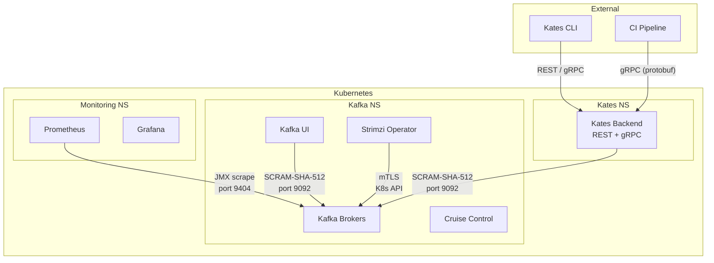
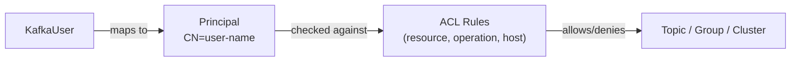
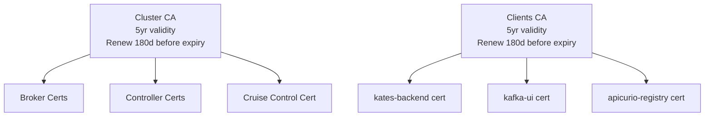
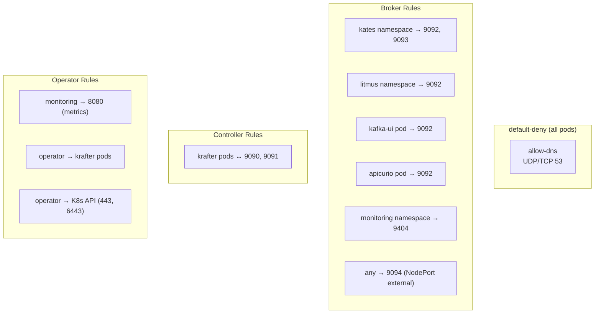
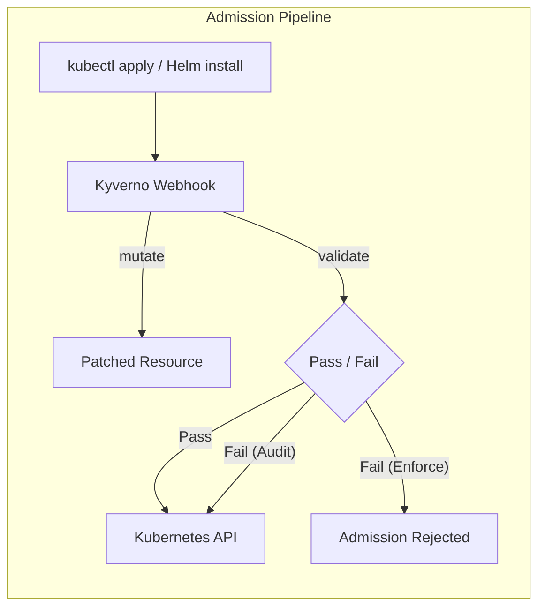

# Chapter 17: Security & Compliance

This chapter covers every security layer in the Kates platform — from Kafka authentication to Kubernetes NetworkPolicies. Use it as a reference when auditing your deployment or onboarding new services.

## Security Architecture Overview


```mermaid
graph TB
    subgraph External
        CLI[Kates CLI]
        CI[CI Pipeline]
    end

    subgraph Kubernetes
        subgraph Kates NS
            API[Kates Backend<br/>REST + gRPC]
        end

        subgraph Kafka NS
            Brokers[Kafka Brokers]
            UI[Kafka UI]
            CC[Cruise Control]
            Operator[Strimzi Operator]
        end

        subgraph Monitoring NS
            Prom[Prometheus]
            Graf[Grafana]
        end
    end

    CLI -->|"REST / gRPC"| API
    CI -->|"gRPC (protobuf)"| API
    API -->|"SCRAM-SHA-512<br/>port 9092"| Brokers
    UI -->|"SCRAM-SHA-512<br/>port 9092"| Brokers
    Prom -->|"JMX scrape<br/>port 9404"| Brokers
    Operator -->|"mTLS<br/>K8s API"| Brokers
```

## Authentication

### Kafka Listeners

Each listener enforces a specific authentication mechanism:

| Listener | Port | Auth | Protocol | Clients |
|----------|------|------|----------|---------|
| `plain` | 9092 | SCRAM-SHA-512 | SASL_PLAINTEXT | Kates, Kafka UI, Apicurio |
| `tls` | 9093 | mTLS (certificate) | SASL_SSL | Encrypted internal |
| `external` | 9094 | SCRAM-SHA-512 | SASL_SSL | External tools, CI |

### SCRAM-SHA-512

Strimzi generates SCRAM credentials automatically when you create a `KafkaUser` resource. The password is stored in a Kubernetes Secret with the same name as the user:

```bash
# View generated password
kubectl get secret kafka-ui -n kafka -o jsonpath='{.data.password}' | base64 -d
```

### Cross-Namespace Credential Synchronization

When a `KafkaUser` is created, Strimzi generates the credential Secret only in the namespace where the Strimzi operator and Kafka cluster reside (usually `kafka`). 

If your application runs in a different namespace (e.g., `kates`), you must securely synchronize this Secret. **Do not copy it manually**, as Strimzi may rotate the password. Instead, use a Kyverno `ClusterPolicy` to automatically clone and synchronize the Secret:

```yaml
apiVersion: kyverno.io/v1
kind: ClusterPolicy
metadata:
  name: sync-kates-backend-secret
  annotations:
    policies.kyverno.io/title: Sync Kafka Credentials
    policies.kyverno.io/category: Secrets Management
spec:
  generateExisting: true
  rules:
  - name: clone-kafka-secret
    match:
      any:
      - resources:
          kinds:
          - Namespace
          names:
          - kates
    generate:
      apiVersion: v1
      kind: Secret
      name: kates-backend
      namespace: "{{request.object.metadata.name}}"
      synchronize: true # Keeps the cloned secret updated if Strimzi rotates the original
      clone:
        namespace: kafka
        name: kates-backend
```

### mTLS (Mutual TLS)

The TLS listener requires both server and client certificates. Strimzi issues client certificates via the Clients CA when a `KafkaUser` uses `authentication.type: tls`.

## Authorization

### ACL Model

Kafka uses **simple ACL authorization** with principal-based access control:


```mermaid
graph LR
    User[KafkaUser] -->|"maps to"| Principal["Principal<br/>CN=user-name"]
    Principal -->|"checked against"| ACL["ACL Rules<br/>(resource, operation, host)"]
    ACL -->|"allows/denies"| Resource["Topic / Group / Cluster"]
```

### User Permissions Matrix

| User | Principal | Access Level | Resources | Quotas |
|------|-----------|-------------|-----------|--------|
| `kates-backend` | CN=kates-backend | **superUser** | All (bypasses ACLs) | None |
| `kafka-ui` | CN=kafka-ui | Read-only | All topics, all groups, cluster describe | 1MB/s produce, 50MB/s consume |
| `apicurio-registry` | CN=apicurio-registry | Scoped R/W | `__apicurio*` topics, `apicurio*` groups | 10MB/s produce, 20MB/s consume |
| `litmus-chaos` | CN=litmus-chaos | Full CRUD | All topics, `litmus*` groups, cluster describe | None |

### Adding a New Service

To onboard a new service, create a `KafkaUser` CR:

```yaml
apiVersion: kafka.strimzi.io/v1
kind: KafkaUser
metadata:
  name: my-service
  namespace: kafka
  labels:
    strimzi.io/cluster: krafter
spec:
  authentication:
    type: scram-sha-512
  quotas:
    producerByteRate: 10485760     # 10MB/s
    consumerByteRate: 20971520     # 20MB/s
    requestPercentage: 15          # max 15% of broker CPU
  authorization:
    type: simple
    acls:
      - resource:
          type: topic
          name: "my-service"
          patternType: prefix
        operations: ["Read", "Write", "Create", "Describe"]
        host: "*"
      - resource:
          type: group
          name: "my-service"
          patternType: prefix
        operations: ["Read", "Describe"]
        host: "*"
```

### Granting Full Cluster Rights (Super-User)

If you need to create a service account (like an administrator or automated testing tool) that has **full rights** across the entire Kafka cluster, you must explicitly grant it `All` operations on the `cluster`, `topic`, and `group` resources. 

Create a file named `kafka-admin-user.yaml` with the following content:

```yaml
apiVersion: kafka.strimzi.io/v1
kind: KafkaUser
metadata:
  name: admin-user
  namespace: kafka
  labels:
    strimzi.io/cluster: krafter
spec:
  authentication:
    type: scram-sha-512
  authorization:
    type: simple
    acls:
      - resource:
          type: cluster
        operations: ["All"]
      - resource:
          type: topic
          name: "*"
          patternType: literal
        operations: ["All"]
      - resource:
          type: group
          name: "*"
          patternType: literal
        operations: ["All"]
```

Apply this file to your cluster:
```bash
kubectl apply -f kafka-admin-user.yaml
```

Once the Strimzi Operator processes the resource, it will automatically generate a Kubernetes Secret in the `kafka` namespace with the credentials. You can retrieve the generated SCRAM password using:
```bash
kubectl get secret admin-user -n kafka -o jsonpath="{.data.password}" | base64 -d
```

## Certificate Management

Strimzi manages two independent CA hierarchies:


```mermaid
graph TD
    ClusterCA["Cluster CA<br/>5yr validity<br/>Renew 180d before expiry"] --> BrokerCert["Broker Certs"]
    ClusterCA --> ControllerCert["Controller Certs"]
    ClusterCA --> CCCert["Cruise Control Cert"]

    ClientsCA["Clients CA<br/>5yr validity<br/>Renew 180d before expiry"] --> UserCert1["kates-backend cert"]
    ClientsCA --> UserCert2["kafka-ui cert"]
    ClientsCA --> UserCert3["apicurio-registry cert"]
```

| Property | Value | Purpose |
|----------|-------|---------|
| Validity | 1825 days (5 years) | Long-lived for stability |
| Renewal window | 180 days before expiry | Ample time for rollout |
| Renewal policy | `replace-key` | New key pair on renewal (stronger than key reuse) |

### Rotation Monitoring

Strimzi sets the `NotAfter` date on each certificate. Monitor with:

```bash
kubectl get secret krafter-cluster-ca-cert -n kafka \
  -o jsonpath='{.data.ca\.crt}' | base64 -d | openssl x509 -noout -dates
```

Set up a Prometheus alert for certificates expiring within 30 days.

## Network Policies

The `kafka` namespace enforces **default-deny** for both ingress and egress:


```mermaid
graph TD
    subgraph Default["default-deny (all pods)"]
        DNS["allow-dns<br/>UDP/TCP 53"]
    end

    subgraph Broker Rules
        B1["kates namespace → 9092, 9093"]
        B2["litmus namespace → 9092"]
        B3["kafka-ui pod → 9092"]
        B4["apicurio pod → 9092"]
        B5["monitoring namespace → 9404"]
        B6["any → 9094 (NodePort external)"]
    end

    subgraph Controller Rules
        C1["krafter pods ↔ 9090, 9091"]
    end

    subgraph Operator Rules
        O1["monitoring → 8080 (metrics)"]
        O2["operator → krafter pods"]
        O3["operator → K8s API (443, 6443)"]
    end
```

### Policy Summary

| Policy | Target | Ingress From | Ports |
|--------|--------|-------------|-------|
| `default-deny` | All pods | None | None |
| `allow-dns` | All pods | — (egress only) | 53 UDP/TCP |
| `kafka-brokers` | Broker pods | kates, litmus, kafka-ui, apicurio, monitoring | 9091–9094, 9404 |
| `kafka-controllers` | Controller pods | krafter cluster pods | 9090, 9091 |
| `strimzi-operator` | Operator pod | monitoring | 8080 |
| `kafka-ui` | Kafka UI pod | Any | 8080 |
| `cruise-control` | CC pod | Operator, monitoring | 9090, 9404 |
| `strimzi-drain-cleaner` | Drain Cleaner | Any (webhook) | 8443 |

### Testing Network Policies

```bash
# Verify a pod CAN reach brokers (should succeed from kates namespace)
kubectl exec deployment/kates -n kates -- \
  nc -zv krafter-kafka-bootstrap.kafka 9092

# Verify a pod CANNOT reach brokers (should fail from default namespace)
kubectl run test --rm -it --image=busybox -- \
  nc -zv krafter-kafka-bootstrap.kafka 9092
```

## Container Security

### Security Contexts

Kafka containers run with hardened security contexts:

```yaml
template:
  kafkaContainer:
    securityContext:
      allowPrivilegeEscalation: false
      readOnlyRootFilesystem: true
      capabilities:
        drop: ["ALL"]
  pod:
    securityContext:
      runAsNonRoot: true
      fsGroup: 1001
```

| Setting | Value | Purpose |
|---------|-------|---------|
| `runAsNonRoot` | true | Prevents running as UID 0 |
| `readOnlyRootFilesystem` | true | No writes outside mounted volumes |
| `allowPrivilegeEscalation` | false | Blocks `setuid` / `setgid` binaries |
| `drop: ALL` | — | Removes all Linux capabilities |

### Quotas as Security

Per-user quotas prevent denial-of-service from misbehaving clients:

| User | Produce Rate | Consume Rate | CPU Share |
|------|:------------:|:------------:|:---------:|
| `kafka-ui` | 1 MB/s | 50 MB/s | 10% |
| `apicurio-registry` | 10 MB/s | 20 MB/s | 15% |
| `litmus-chaos` | Unlimited | Unlimited | Unlimited |

## Kyverno Policy Integration & Admission Control

The Kates platform integrates **Kyverno** as a Kubernetes-native policy engine for enforcing security standards via admission control. Kyverno policies operate as dynamic admission webhooks — intercepting every resource creation and modification request before it reaches the API server.


```mermaid
graph LR
    subgraph Admission Pipeline
        Req["kubectl apply / Helm install"] --> Webhook["Kyverno Webhook"]
        Webhook -->|"mutate"| Mutated["Patched Resource"]
        Webhook -->|"validate"| Decision{"Pass / Fail"}
        Decision -->|"Pass"| API["Kubernetes API"]
        Decision -->|"Fail (Enforce)"| Reject["Admission Rejected"]
        Decision -->|"Fail (Audit)"| API
    end
```

### Cluster Policies

Kates ships four `ClusterPolicy` resources, deployed conditionally when `kyvernoPolicy.enabled=true` in the Helm values:

| Policy | Category | Severity | Description |
|--------|----------|----------|-------------|
| `kates-pod-security-standards` | Pod Security | High | Mutates and validates restricted PSS: non-root, drop ALL capabilities, seccomp, read-only rootfs, no privilege escalation |
| `kates-workload-standards` | Best Practices | Medium | Requires standard labels, health probes, and pinned image tags on workloads |
| `kates-image-verification` | Supply Chain | Critical | Verifies Cosign image signatures from trusted registries |
| `kates-generate-network-policies` | Network Security | Medium | Auto-generates default-deny NetworkPolicies in new namespaces |

### Pod Security Standards (Mutate + Validate)

The `kates-pod-security-standards` policy combines **mutation** (auto-patching) with **validation** (enforcement). This two-phase approach means pods are first automatically patched to comply, then validated to ensure compliance:

**Mutation rules** (applied first):

| Rule | What It Patches |
|------|-----------------|
| `mutate-run-as-non-root` | Sets `runAsNonRoot: true`, `runAsUser: 1000`, `fsGroup: 1000` |
| `mutate-drop-capabilities` | Adds `capabilities.drop: ["ALL"]` to every container |
| `mutate-seccomp-profile` | Sets `seccompProfile.type: RuntimeDefault` |
| `mutate-disable-privilege-escalation` | Sets `allowPrivilegeEscalation: false` |
| `mutate-readonly-rootfs` | Sets `readOnlyRootFilesystem: true` |

**Validation rules** (enforced after mutation):

| Rule | Enforcement |
|------|-------------|
| `validate-non-root` | Rejects pods without `runAsNonRoot: true` |
| `validate-drop-capabilities` | Rejects containers that don't drop ALL capabilities |
| `validate-seccomp-profile` | Requires `RuntimeDefault` or `Localhost` seccomp profile |
| `validate-no-privilege-escalation` | Rejects `allowPrivilegeEscalation: true` |
| `validate-readonly-rootfs` | Rejects writable root filesystems |
| `require-resource-limits` | Requires `memory` limits and `cpu` requests |

> [!NOTE]
> Mutation uses the `+(key)` conditional anchor syntax — values are injected only if the field is not already set. This prevents Kyverno from overwriting explicitly declared security contexts.

### Cosign Image Verification

The `kates-image-verification` policy enforces **supply chain security** by verifying container image signatures before admission:

```yaml
kyvernoPolicy:
  cosign:
    enabled: true
    publicKey: |
      -----BEGIN PUBLIC KEY-----
      MFkwEwYHKoZIzj0CAQYIKoZIzj0DAQcDQgAE...
      -----END PUBLIC KEY-----
    imagePatterns:
      - "ghcr.io/bmscomp/kates-*"
      - "ghcr.io/bmscomp/kates-tester*"
```

When enabled, unsigned or tampered images from the specified registries are rejected at admission time. The policy also mutates image references to use digests (`mutateDigest: true`) for immutable deployments.

### Automatic NetworkPolicy Generation

The `kates-generate-network-policies` policy implements **zero-trust networking** by automatically generating three NetworkPolicies in every newly created namespace:

1. **`default-deny-ingress`** — blocks all inbound traffic
2. **`default-deny-egress`** — blocks all outbound traffic
3. **`allow-dns-egress`** — allows DNS resolution to `kube-system` on port 53

These policies are synchronized (`synchronize: true`) — Kyverno continuously reconciles them if they are manually deleted.

### Namespace Exclusions

Certain system and infrastructure namespaces are excluded from automatic NetworkPolicy generation to prevent breaking core platform services:

| Excluded Namespace | Reason |
|--------------------|--------|
| `kube-system` | Core Kubernetes components |
| `kube-public` | Public cluster metadata |
| `kyverno` | Kyverno's own namespace |
| `strimzi-operator` | Strimzi Operator requires API server and Kafka namespace egress |
| `monitoring` | Prometheus must scrape metrics across all namespaces |
| `kafka` | Managed by dedicated kafka-cluster chart NetworkPolicies |
| `cert-manager` | Requires webhook ingress and ACME provider egress |
| `litmus` | Chaos runner pods need cross-namespace API access |
| `kates-detect-*` | Temporary CLI prober namespaces for latency and storage benchmarks |

### Policy Exceptions

For development environments where strict enforcement would impede workflows, Kates supports `PolicyException` CRDs (Kyverno `v2` API). These temporarily relax specific validation rules for designated namespaces without disabling the entire policy:

```yaml
apiVersion: kyverno.io/v2
kind: PolicyException
metadata:
  name: litmus-kates-pod-security-standards-exception
  namespace: litmus
spec:
  exceptions:
    - policyName: kates-pod-security-standards
      ruleNames:
        - validate-readonly-rootfs
        - validate-drop-capabilities
  match:
    any:
      - resources:
          namespaces: [litmus]
          kinds: [Pod, Deployment, StatefulSet, ReplicaSet]
```

Exceptions are configured via Helm values under `kyvernoPolicy.policyExceptions` and deployed only when `policyExceptions.enabled=true`.

### Enforce vs Audit Modes

All Kyverno policies support two operational modes, controlled by the `kyvernoPolicy.action` Helm value:

| Mode | Behavior | Use Case |
|------|----------|----------|
| `Audit` (default) | Violations are logged in `PolicyReport` CRDs but pods are **not blocked** | Initial rollout, observability, compliance auditing |
| `Enforce` | Non-compliant pods are **rejected** at admission | Production hardening, strict compliance |

Switch modes at runtime using the Kates CLI (see below) or by patching the Helm values.

### Kates CLI: `kyverno` Subcommands

The Kates CLI provides native Kyverno management through the `kates kyverno` command group:

```bash
# Show all ClusterPolicies with mode, readiness, and rule counts
kates kyverno status

# Show policy violations grouped by namespace and pod
kates kyverno violations
kates kyverno violations --namespace kafka

# Switch a policy to Enforce mode (blocks non-compliant pods)
kates kyverno enforce kates-pod-security-standards

# Switch a policy back to Audit mode (log-only)
kates kyverno audit kates-pod-security-standards
```

| Command | Aliases | Description |
|---------|---------|-------------|
| `kates kyverno status` | `st`, `list` | Lists all ClusterPolicies with mode, ready state, validate/mutate rule counts, and violation summary |
| `kates kyverno violations` | `viol`, `fails` | Pretty-prints `PolicyReport` violations grouped by namespace and pod, with `--namespace` filter |
| `kates kyverno enforce <policy>` | — | Patches a ClusterPolicy's `validationFailureAction` to `Enforce` |
| `kates kyverno audit <policy>` | — | Patches a ClusterPolicy's `validationFailureAction` to `Audit` |

> [!TIP]
> **Cross-references:**
> - For Kyverno installation instructions, see [Chapter 20: Installation Guide](20-installation-guide.md#kyverno-optional).
> - For Kyverno upgrade procedures, see [Chapter 18: Upgrade Playbook](18-upgrade-playbook.md).
> - For a full index of Kyverno-related troubleshooting, see [Appendix B: Troubleshooting](appendix-b-troubleshooting.md#deployment-issues).

## Security Checklist

Use this checklist when auditing your deployment:

- [ ] All listeners require authentication (no anonymous access)
- [ ] `superUsers` list contains only the Kates backend principal
- [ ] Each service has its own `KafkaUser` with minimum required ACLs
- [ ] Network policies enforce default-deny in the `kafka` namespace
- [ ] Containers run as non-root with read-only root filesystem
- [ ] Certificate renewal alerts are configured
- [ ] Per-user quotas limit blast radius from runaway clients
- [ ] `deleteClaim: false` on all PVCs (data survives pod deletion)
- [ ] Secrets are not committed to source control (Strimzi auto-generates)

### Validating Policy Compliance

To automate the verification of Kyverno policies, Strimzi operator health, and NetworkPolicy connectivity, you can use the built-in `make` target. This script will ensure your generic cluster is not blocking the Kafka deployment:

```bash
make kafka-verify-policies
```

This script will:
1. Scan the `kafka` namespace events for any Kyverno rejections.
2. Verify the Strimzi Operator is `Running`.
3. Check the Kafka cluster CR status to ensure it successfully reached the `Ready` state.
4. Spawn temporary pods in both the `default` and `kates` namespaces to verify NetworkPolicies (default-deny enforcement and explicitly allowed traffic).

For deployment-level security details (Drain Cleaner, backup encryption), see [Chapter 15: Kafka Deployment Engineering](15-kafka-deployment.md).
