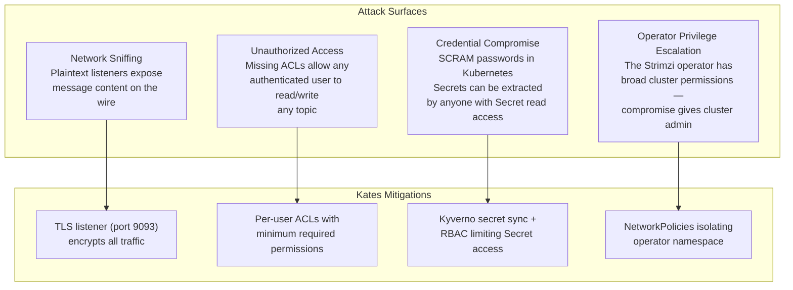
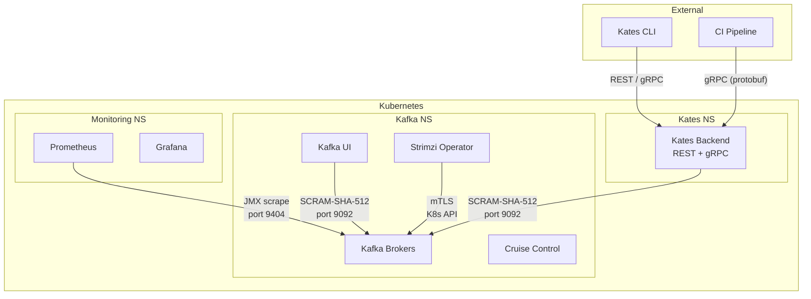
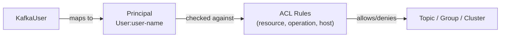
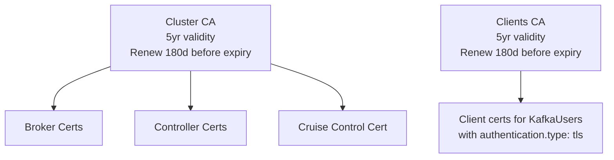
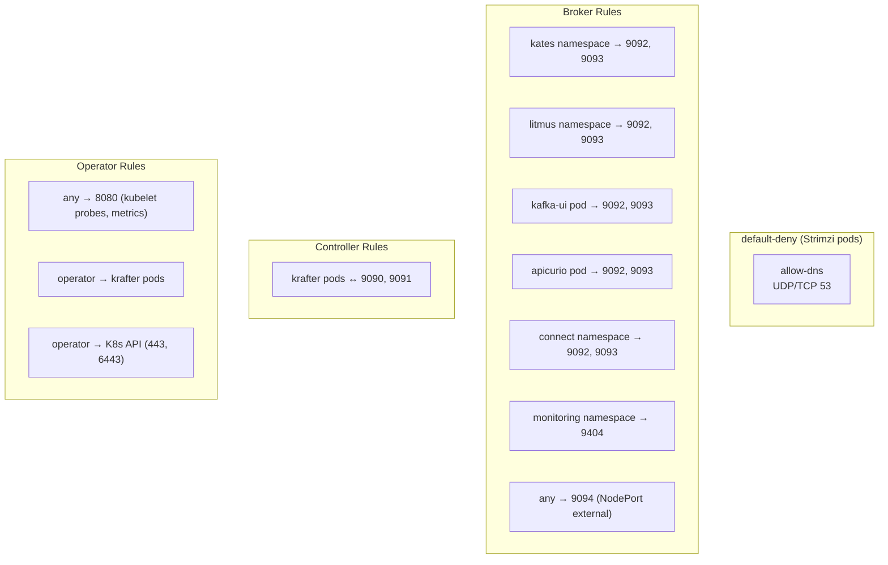
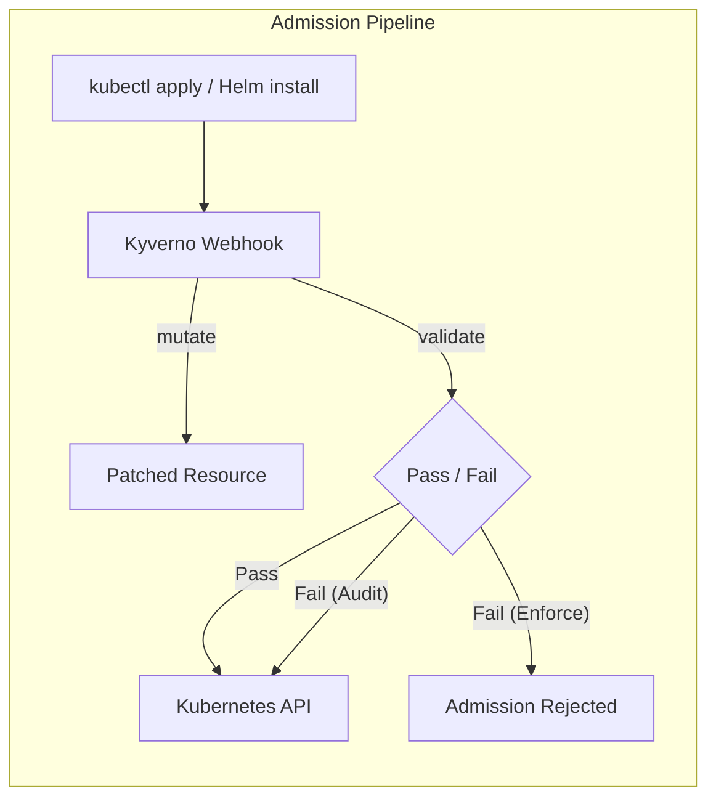

# Security & Compliance

A Kafka cluster is a high-value target. It carries your business data, your audit trails, and your event streams. A misconfigured listener, an overly-permissive ACL, or a missing network policy can expose all of it. This chapter covers every security layer in the Kates platform — not just *what* is configured, but *why* each layer exists and what would happen without it.

Use this chapter as a reference when auditing your deployment, onboarding new services, or designing your own security posture for production. After this chapter, you can:

- Explain which listener each client authenticates on, and why the performance listener deliberately skips TLS
- Onboard a new service with a least-privilege `KafkaUser` — scoped ACLs, prefix patterns, and quotas
- Verify that default-deny NetworkPolicies and Kyverno admission policies actually block what they claim to block
- Grade your cluster's posture with `kates security audit` and act on the findings

## Threat Model

Before diving into configurations, it helps to understand what you're defending against. A Kafka cluster on Kubernetes has four primary attack surfaces:


```mermaid
graph TD
    subgraph Threats["Attack Surfaces"]
        T1["Network Sniffing<br/>Plaintext listeners expose<br/>message content on the wire"]
        T2["Unauthorized Access<br/>Missing ACLs allow any<br/>authenticated user to read/write<br/>any topic"]
        T3["Credential Compromise<br/>SCRAM passwords in Kubernetes<br/>Secrets can be extracted<br/>by anyone with Secret read access"]
        T4["Operator Privilege Escalation<br/>The Strimzi operator has<br/>broad cluster permissions —<br/>compromise gives cluster admin"]
    end

    subgraph Mitigations["Kates Mitigations"]
        M1["TLS listener (port 9093)<br/>encrypts all traffic"]
        M2["Per-user ACLs with<br/>minimum required permissions"]
        M3["Kyverno secret sync +<br/>RBAC limiting Secret access"]
        M4["NetworkPolicies isolating<br/>operator namespace"]
    end

    T1 --> M1
    T2 --> M2
    T3 --> M3
    T4 --> M4
```

::: {.callout-important}
The default performance test listener (`plain`, port 9092) uses SCRAM authentication but **no TLS encryption**. This is intentional — TLS adds measurable CPU overhead, and performance baselines should isolate Kafka throughput from encryption cost. For production deployments, always use the `tls` listener (port 9093) or the `external` listener (port 9094, which enables TLS by default).
:::

## Security Architecture Overview


```mermaid
graph TB
    subgraph External
        CLI[Kates CLI]
        CI[CI Pipeline]
    end

    subgraph Kubernetes
        subgraph Kates NS
            API[Kates Backend<br/>REST + gRPC]
        end

        subgraph Kafka NS
            Brokers[Kafka Brokers]
            UI[Kafka UI]
            CC[Cruise Control]
            Operator[Strimzi Operator]
        end

        subgraph Monitoring NS
            Prom[Prometheus]
            Graf[Grafana]
        end
    end

    CLI -->|"REST / gRPC"| API
    CI -->|"gRPC (protobuf)"| API
    API -->|"SCRAM-SHA-512<br/>port 9092"| Brokers
    UI -->|"SCRAM-SHA-512<br/>port 9092"| Brokers
    Prom -->|"JMX scrape<br/>port 9404"| Brokers
    Operator -->|"mTLS<br/>K8s API"| Brokers
```

## Authentication

Authentication answers the question: *"Who are you?"* Every connection to Kafka must prove its identity before it can do anything.

### Kafka Listeners

Each listener enforces a specific authentication mechanism. The choice of listener determines both the security properties and the performance characteristics of the connection:

| Listener | Port | Auth | Protocol | Clients | When to Use |
|----------|------|------|----------|---------|-------------|
| `plain` | 9092 | SCRAM-SHA-512 | SASL_PLAINTEXT | Kates, Kafka UI, Apicurio | Performance testing baselines (no TLS overhead) |
| `tls` | 9093 | mTLS (certificate) | SSL | Encrypted internal | When you need wire encryption between services |
| `external` | 9094 | SCRAM-SHA-512 | SASL_SSL | External tools, CI | Access from outside the Kubernetes cluster |

### SCRAM-SHA-512

SCRAM (Salted Challenge Response Authentication Mechanism) is a password-based authentication protocol that never sends the password over the wire. Instead, the client and server exchange salted hashes in a challenge-response sequence. SHA-512 provides strong hashing — brute-forcing a SCRAM-SHA-512 password is computationally expensive.

Strimzi generates SCRAM credentials automatically when you create a `KafkaUser` resource. The password is stored in a Kubernetes Secret with the same name as the user:

```bash
# View generated password
kubectl get secret kafka-ui -n kafka -o jsonpath='{.data.password}' | base64 -d
```

::: {.callout-warning}
Kubernetes Secrets are base64-encoded, **not encrypted**. Anyone with RBAC permission to read Secrets in the `kafka` namespace can extract every SCRAM password. This is why namespace-level RBAC and NetworkPolicies are not optional — they're the outer wall protecting your credentials.
:::

### Password Rotation

Strimzi does not automatically rotate SCRAM passwords, but you can trigger a rotation without downtime:

```bash
# Step 1: Delete the existing Secret (Strimzi will regenerate it)
kubectl delete secret kates-backend -n kafka

# Step 2: Wait for the Entity Operator to reconcile (typically < 30 seconds)
kubectl wait --for=condition=Ready kafkauser/kates-backend -n kafka --timeout=60s

# Step 3: Verify the new password was generated
kubectl get secret kates-backend -n kafka -o jsonpath='{.data.password}' | base64 -d
```

If your application runs in a different namespace and uses a Kyverno-synced copy of the secret, the sync policy propagates the new password automatically, and the application picks up the new credentials on its next reconnection cycle.

::: {.callout-caution}
During the brief window between deleting the old Secret and the Entity Operator creating the new one, any application that restarts will fail to authenticate. Time your rotations during low-traffic periods, and ensure your application has retry logic for authentication failures.
:::

### Cross-Namespace Credential Synchronization

When a `KafkaUser` is created, Strimzi generates the credential Secret only in the namespace where the Strimzi operator and Kafka cluster reside (usually `kafka`).

If your application runs in a different namespace (e.g., `kates`), you must securely synchronize this Secret. **Do not copy it manually**, as Strimzi may rotate the password. Instead, use a Kyverno `ClusterPolicy` to automatically clone and synchronize the Secret:

```yaml
apiVersion: kyverno.io/v1
kind: ClusterPolicy
metadata:
  name: sync-kates-backend-secret
  annotations:
    policies.kyverno.io/title: Sync Kafka Credentials
    policies.kyverno.io/category: Secrets Management
spec:
  generateExisting: true
  rules:
  - name: clone-kafka-secret
    match:
      any:
      - resources:
          kinds:
          - Namespace
          names:
          - kates
    generate:
      apiVersion: v1
      kind: Secret
      name: kates-backend
      namespace: "{{request.object.metadata.name}}"
      synchronize: true # Keeps the cloned secret updated if Strimzi rotates the original
      clone:
        namespace: kafka
        name: kates-backend
```

### mTLS (Mutual TLS)

The TLS listener requires both server and client certificates. Strimzi issues client certificates via the Clients CA when a `KafkaUser` uses `authentication.type: tls`. This provides the strongest authentication — both sides cryptographically verify each other's identity, and the connection is encrypted end-to-end.

## Authorization

Authentication tells Kafka who you are. Authorization tells Kafka what you're allowed to do. Without authorization, an authenticated user can read any topic, join any consumer group, and modify any configuration — a single compromised credential becomes a full breach.

### ACL Model

Kafka uses **simple ACL authorization** with principal-based access control:


```mermaid
graph LR
    User[KafkaUser] -->|"maps to"| Principal["Principal<br/>User:user-name"]
    Principal -->|"checked against"| ACL["ACL Rules<br/>(resource, operation, host)"]
    ACL -->|"allows/denies"| Resource["Topic / Group / Cluster"]
```

A `KafkaUser` authenticating with SCRAM-SHA-512 maps to the principal `User:<username>`. Only users with `authentication.type: tls` get certificate-based principals, whose name is the certificate's Distinguished Name (e.g., `User:CN=my-service`).

Every Kafka operation (produce, consume, describe, create, delete) is checked against the ACL list. If no matching rule is found, the operation is denied by default. This is a **deny-by-default** model — you must explicitly grant every permission.

### User Permissions Matrix

| User | Principal | Access Level | Resources | Quotas |
|------|-----------|-------------|-----------|--------|
| `kates-backend` | User:kates-backend | **superUser** | All (bypasses ACLs) | None |
| `kafka-ui` | User:kafka-ui | Read-only | All topics, all groups, cluster describe | 1MB/s produce, 50MB/s consume |
| `apicurio-registry` | User:apicurio-registry | Scoped R/W | `__apicurio*`, `kafkasql-*`, `registry-*` topics, `apicurio*` groups | 10MB/s produce, 20MB/s consume |
| `litmus-chaos` | User:litmus-chaos | Full CRUD | All topics, `litmus*` groups, cluster describe | None |
| `kates-connect` | User:kates-connect | Scoped R/W | `kates-*`, `cdc*` topics, `kates-connect*`, `connect-*` groups | 50MB/s produce, 50MB/s consume |

::: {.callout-note}
The `kates-backend` user has superUser status because it needs to create test topics, manage consumer groups, and read cluster metadata during benchmark runs. In a production deployment, you would scope this down to only the specific topics and operations Kates requires.
:::

### Adding a New Service

When you onboard a new service to your Kafka cluster, follow the principle of least privilege — grant only the permissions the service actually needs. Here's a template:

```yaml
apiVersion: kafka.strimzi.io/v1
kind: KafkaUser
metadata:
  name: my-service
  namespace: kafka
  labels:
    strimzi.io/cluster: krafter
spec:
  authentication:
    type: scram-sha-512
  quotas:
    producerByteRate: 10485760     # 10MB/s
    consumerByteRate: 20971520     # 20MB/s
    requestPercentage: 15          # max 15% of broker CPU
  authorization:
    type: simple
    acls:
      - resource:
          type: topic
          name: "my-service"
          patternType: prefix
        operations: ["Read", "Write", "Create", "Describe"]
        host: "*"
      - resource:
          type: group
          name: "my-service"
          patternType: prefix
        operations: ["Read", "Describe"]
        host: "*"
```

The `patternType: prefix` is key — it means the service can access any topic or group starting with `my-service` (e.g., `my-service-events`, `my-service-results`). This is more maintainable than listing individual topics, especially as your service evolves.

### Granting Full Cluster Rights (Super-User)

If you need to create a service account (like an administrator or automated testing tool) that has **full rights** across the entire Kafka cluster, you must explicitly grant it `All` operations on the `cluster`, `topic`, and `group` resources.

Create a file named `kafka-admin-user.yaml` with the following content:

```yaml
apiVersion: kafka.strimzi.io/v1
kind: KafkaUser
metadata:
  name: admin-user
  namespace: kafka
  labels:
    strimzi.io/cluster: krafter
spec:
  authentication:
    type: scram-sha-512
  authorization:
    type: simple
    acls:
      - resource:
          type: cluster
        operations: ["All"]
      - resource:
          type: topic
          name: "*"
          patternType: literal
        operations: ["All"]
      - resource:
          type: group
          name: "*"
          patternType: literal
        operations: ["All"]
```

Apply this file to your cluster:
```bash
kubectl apply -f kafka-admin-user.yaml
```

Once the Strimzi Operator processes the resource, it generates a Kubernetes Secret in the `kafka` namespace with the credentials. You can retrieve the generated SCRAM password using:
```bash
kubectl get secret admin-user -n kafka -o jsonpath="{.data.password}" | base64 -d
```

## Certificate Management

Strimzi manages two independent CA hierarchies — one for cluster-internal communication and one for client authentication:


```mermaid
graph TD
    ClusterCA["Cluster CA<br/>5yr validity<br/>Renew 180d before expiry"] --> BrokerCert["Broker Certs"]
    ClusterCA --> ControllerCert["Controller Certs"]
    ClusterCA --> CCCert["Cruise Control Cert"]

    ClientsCA["Clients CA<br/>5yr validity<br/>Renew 180d before expiry"] --> UserCert["Client certs for KafkaUsers<br/>with authentication.type: tls"]
```

The Clients CA issues certificates only for `KafkaUser` resources with `authentication.type: tls`. The default managed users all authenticate with SCRAM-SHA-512, so they receive password Secrets rather than client certificates.

| Property | Value | Purpose |
|----------|-------|---------|
| Validity | 1825 days (5 years) | Long-lived for stability |
| Renewal window | 180 days before expiry | Ample time for rollout |
| Renewal policy | `replace-key` | New key pair on renewal (stronger than key reuse) |

The `replace-key` renewal policy means that on each renewal, Strimzi generates an entirely new private key rather than reusing the existing one. This is more secure — if the old key was compromised, the new certificate uses a fresh key pair.

### Rotation Monitoring

Strimzi sets the `NotAfter` date on each certificate. Monitor with:

```bash
kubectl get secret krafter-cluster-ca-cert -n kafka \
  -o jsonpath='{.data.ca\.crt}' | base64 -d | openssl x509 -noout -dates
```

Set up a Prometheus alert for certificates expiring within 30 days:

```yaml
- alert: KafkaCertificateExpiringSoon
  expr: |
    (kube_secret_created{namespace="kafka", secret=~".*-ca-cert"} + 157680000)
    - time() < 2592000
  for: 1h
  labels:
    severity: warning
  annotations:
    summary: "Kafka CA certificate expires within 30 days"
    description: "Secret {{ $labels.secret }} in namespace {{ $labels.namespace }} will expire soon. Trigger a certificate renewal."
```

::: {.callout-caution}
This alert is an approximation, not a measurement of the certificate itself. `kube_secret_created` reports when the Secret was **first created** — not the certificate's `NotAfter` date — and the hardcoded `157680000` seconds mirrors the chart's 1825-day CA validity (`clusterCa.validityDays`). Strimzi renews certificates by updating the Secret in place, so the metric never resets: after the first in-place renewal the alert fires permanently, and it drifts silently if you change the validity period. Treat the `openssl x509 -noout -dates` check above as the source of truth.
:::

## Audit Logging

Kafka's authorizer can log every authorization decision — who accessed what, and when. The authorizer itself is already configured on the krafter cluster: Strimzi derives it from `spec.kafka.authorization` (`type: simple`), and it does not allow `authorizer.class.name` to be set directly in the `config` section — unsupported keys placed there are filtered out. What you control is the log level of `kafka.authorizer.logger`, which lives under `spec.kafka.logging` in the Kafka CR:

```yaml
spec:
  kafka:
    logging:
      type: inline
      loggers:
        rootLogger.level: INFO
        # Kafka 4.x brokers use Log4j2: declare the logger by name, then set its level
        logger.authorizer.name: kafka.authorizer.logger
        logger.authorizer.level: DEBUG
```

At the default `INFO` level the authorizer logs denied operations only. At `DEBUG`, every produce, consume, and admin operation generates an audit entry that includes the principal, the resource, the operation, and the decision (ALLOWED or DENIED). These logs are invaluable during security incident investigations.

::: {.callout-tip}
For lighter-weight auditing, Kates records every mutating operation issued through the backend — test creates and deletes, topic changes, disruption runs — in its audit log. Inspect the trail with `kates audit`, filtering with `--type` and `--since`.
:::

## Network Policies

Network policies are your last line of defense. Even if an attacker compromises a pod in your cluster, network policies prevent that pod from reaching the Kafka brokers unless it's explicitly allowed. The `kafka` namespace enforces **default-deny** ingress and egress on all Strimzi cluster pods (the policy selects the `app.kubernetes.io/part-of: strimzi-krafter` label rather than using an empty pod selector):


```mermaid
graph TD
    subgraph Default["default-deny (Strimzi pods)"]
        DNS["allow-dns<br/>UDP/TCP 53"]
    end

    subgraph Broker Rules
        B1["kates namespace → 9092, 9093"]
        B2["litmus namespace → 9092, 9093"]
        B3["kafka-ui pod → 9092, 9093"]
        B4["apicurio pod → 9092, 9093"]
        B5["connect namespace → 9092, 9093"]
        B6["monitoring namespace → 9404"]
        B7["any → 9094 (NodePort external)"]
    end

    subgraph Controller Rules
        C1["krafter pods ↔ 9090, 9091"]
    end

    subgraph Operator Rules
        O1["any → 8080 (kubelet probes, metrics)"]
        O2["operator → krafter pods"]
        O3["operator → K8s API (443, 6443)"]
    end
```

### Policy Summary

| Policy | Target | Ingress From | Ports |
|--------|--------|-------------|-------|
| `default-deny` | Strimzi cluster pods | None | None |
| `allow-dns` | Strimzi cluster pods | — (egress only) | 53 UDP/TCP |
| `kafka-brokers` | Broker pods | kates, litmus, kafka-ui, apicurio, connect, monitoring, operator | 9091–9094, 9404 |
| `kafka-controllers` | Controller pods | krafter cluster pods, operator | 9090, 9091 |
| `strimzi-operator` | Operator pod | Any (kubelet probes, metrics) | 8080 |
| `kafka-ui` | Kafka UI pod | Any | 8080 |
| `cruise-control` | CC pod | Operator, monitoring | 9090, 9404 |
| `strimzi-drain-cleaner` | Drain Cleaner | Any (webhook) | 8443 |
| `kafka-connect` | Connect pods | monitoring, kates | 8083, 9404 |
| `kafka-mirror-maker` | MirrorMaker 2 pods | monitoring | 9404 |
| `entity-operator` | Entity Operator pod | monitoring | 8080, 8081 |
| `kafka-exporter` | Kafka Exporter pod | monitoring | 9404 |

### Testing Network Policies

Don't trust that your network policies work — verify them. These two commands test both the positive and negative cases:

```bash
# Verify a pod CAN reach brokers (should succeed from kates namespace)
kubectl exec deployment/kates -n kates -- \
  nc -zv krafter-kafka-bootstrap.kafka 9092

# Verify a pod CANNOT reach brokers (should fail from default namespace)
kubectl run test --rm -it --image=busybox -- \
  nc -zv krafter-kafka-bootstrap.kafka 9092
```

The first command should succeed (the Kates backend is explicitly allowed). The second should time out (the default namespace has no ingress rule to the brokers). If both succeed, your network policies are not enforcing correctly.

## Container Security

### Security Contexts

Every container in the Kates platform runs with a hardened security context. These settings follow the Kubernetes Pod Security Standards (PSS) at the **restricted** level:

```yaml
template:
  kafkaContainer:
    securityContext:
      allowPrivilegeEscalation: false
      readOnlyRootFilesystem: true
      capabilities:
        drop: ["ALL"]
  pod:
    securityContext:
      runAsNonRoot: true
      fsGroup: 1001
```

| Setting | Value | Purpose |
|---------|-------|---------|
| `runAsNonRoot` | true | Prevents running as UID 0 — even if the container image specifies `USER root` |
| `readOnlyRootFilesystem` | true | No writes outside mounted volumes — prevents attackers from dropping malware |
| `allowPrivilegeEscalation` | false | Blocks `setuid` / `setgid` binaries — prevents privilege escalation within the container |
| `drop: ALL` | — | Removes all Linux capabilities — no raw sockets, no network admin, no filesystem mounts |

### Quotas as Security

Per-user quotas prevent denial-of-service from misbehaving clients. Without quotas, a single runaway producer can saturate broker network bandwidth, disk I/O, and CPU — degrading performance for every other client on the cluster.

| User | Produce Rate | Consume Rate | CPU Share |
|------|:------------:|:------------:|:---------:|
| `kafka-ui` | 1 MB/s | 50 MB/s | 10% |
| `apicurio-registry` | 10 MB/s | 20 MB/s | 15% |
| `kates-connect` | 50 MB/s | 50 MB/s | 25% |
| `litmus-chaos` | Unlimited | Unlimited | Unlimited |

::: {.callout-note}
The `litmus-chaos` user intentionally has no quotas. Chaos experiments sometimes need to generate burst traffic to test broker behavior under pressure. Limiting the chaos agent would defeat the purpose.
:::

## Kyverno Policy Integration & Admission Control

The Kates platform integrates **Kyverno** as a Kubernetes-native policy engine for enforcing security standards via admission control. Think of Kyverno as a security guard at the door of your cluster — it inspects every resource creation and modification request and either fixes it, approves it, or rejects it.


```mermaid
graph LR
    subgraph Admission Pipeline
        Req["kubectl apply / Helm install"] --> Webhook["Kyverno Webhook"]
        Webhook -->|"mutate"| Mutated["Patched Resource"]
        Webhook -->|"validate"| Decision{"Pass / Fail"}
        Decision -->|"Pass"| API["Kubernetes API"]
        Decision -->|"Fail (Enforce)"| Reject["Admission Rejected"]
        Decision -->|"Fail (Audit)"| API
    end
```

### Cluster Policies

The kates chart ships four `ClusterPolicy` resources, deployed conditionally when `kyvernoPolicy.enabled=true` in the Helm values (the kafka-cluster and kates-chaos charts ship additional policies of their own):

| Policy | Category | Severity | Description |
|--------|----------|----------|-------------|
| `kates-pod-security-standards` | Pod Security | High | Mutates and validates restricted PSS: non-root, drop ALL capabilities, seccomp, read-only rootfs, no privilege escalation |
| `kates-workload-standards` | Best Practices | Medium | Requires standard labels, health probes, and pinned image tags on workloads |
| `kates-image-verification` | Supply Chain | Critical | Verifies Cosign image signatures from trusted registries |
| `kates-generate-network-policies` | Network Security | Medium | Auto-generates default-deny NetworkPolicies in new namespaces |

### Pod Security Standards (Mutate + Validate)

The `kates-pod-security-standards` policy combines **mutation** (auto-patching) with **validation** (enforcement). This two-phase approach is deliberate: mutation silently fixes common mistakes so developers don't have to remember every security setting, while validation catches anything mutation couldn't fix.

**Mutation rules** (applied first):

| Rule | What It Patches |
|------|-----------------|
| `mutate-run-as-non-root` | Sets `runAsNonRoot: true`, `runAsUser: 1000`, `fsGroup: 1000` |
| `mutate-drop-capabilities` | Adds `capabilities.drop: ["ALL"]` to every container |
| `mutate-seccomp-profile` | Sets `seccompProfile.type: RuntimeDefault` |
| `mutate-disable-privilege-escalation` | Sets `allowPrivilegeEscalation: false` |
| `mutate-readonly-rootfs` | Sets `readOnlyRootFilesystem: true` |

**Validation rules** (enforced after mutation):

| Rule | Enforcement |
|------|-------------|
| `validate-non-root` | Rejects pods without `runAsNonRoot: true` |
| `validate-drop-capabilities` | Rejects containers that don't drop ALL capabilities |
| `validate-seccomp-profile` | Requires `RuntimeDefault` or `Localhost` seccomp profile |
| `validate-no-privilege-escalation` | Rejects `allowPrivilegeEscalation: true` |
| `validate-readonly-rootfs` | Rejects writable root filesystems |
| `require-resource-limits` | Requires `memory` limits and `cpu` requests |

::: {.callout-note}
Mutation uses the `+(key)` conditional anchor syntax — values are injected only if the field is not already set. This prevents Kyverno from overwriting explicitly declared security contexts. If a developer explicitly sets `runAsUser: 5000`, Kyverno respects that choice.
:::

### Cosign Image Verification

The `kates-image-verification` policy enforces **supply chain security** by verifying container image signatures before admission. This protects against tampered images — even if an attacker pushes a malicious image to your registry, it won't be admitted unless it carries a valid Cosign signature from your trusted key.

```yaml
kyvernoPolicy:
  cosign:
    enabled: true
    publicKey: |
      -----BEGIN PUBLIC KEY-----
      MFkwEwYHKoZIzj0CAQYIKoZIzj0DAQcDQgAE...
      -----END PUBLIC KEY-----
    imagePatterns:
      - "ghcr.io/bmscomp/*"
```

When enabled, unsigned or tampered images from the specified registries are rejected at admission time. The policy also mutates image references to use digests (`mutateDigest: true`) for immutable deployments.

### Automatic NetworkPolicy Generation

The `kates-generate-network-policies` policy implements **zero-trust networking** by automatically generating three NetworkPolicies in every newly created namespace:

1. **`default-deny-ingress`** — blocks all inbound traffic
2. **`default-deny-egress`** — blocks all outbound traffic
3. **`allow-dns-egress`** — allows DNS egress on port 53 (UDP and TCP) to any namespace

These policies are synchronized (`synchronize: true`) — Kyverno continuously reconciles them if they are manually deleted. This means even if someone accidentally (or maliciously) deletes the default-deny policies, they're automatically recreated.

### Namespace Exclusions

Certain system and infrastructure namespaces are excluded from automatic NetworkPolicy generation to prevent breaking core platform services:

| Excluded Namespace | Reason |
|--------------------|--------|
| `kube-system` | Core Kubernetes components |
| `kube-public` | Public cluster metadata |
| `kube-node-lease` | Node heartbeat Lease objects |
| `kyverno` | Kyverno's own namespace |
| `strimzi-operator` | Strimzi Operator requires API server and Kafka namespace egress |
| `monitoring` | Prometheus must scrape metrics across all namespaces |
| `kafka` | Managed by dedicated kafka-cluster chart NetworkPolicies |
| `cert-manager` | Requires webhook ingress and ACME provider egress |
| `litmus` | Chaos runner pods need cross-namespace API access |
| `kates-detect-*` | Temporary CLI prober namespaces for latency and storage benchmarks |

### Policy Exceptions

For development environments where strict enforcement would impede workflows, Kates supports `PolicyException` CRDs (Kyverno `v2` API). These temporarily relax specific validation rules for designated namespaces without disabling the entire policy:

```yaml
apiVersion: kyverno.io/v2
kind: PolicyException
metadata:
  name: litmus-kates-pod-security-standards-exception
  namespace: litmus
spec:
  exceptions:
    - policyName: kates-pod-security-standards
      ruleNames:
        - validate-readonly-rootfs
        - validate-drop-capabilities
  match:
    any:
      - resources:
          namespaces: [litmus]
          kinds: [Pod, Deployment, StatefulSet, ReplicaSet]
```

Exceptions are configured via Helm values under `kyvernoPolicy.policyExceptions` and deployed only when `policyExceptions.enabled=true`.

### Enforce vs Audit Modes

All Kyverno policies support two operational modes, controlled by the `kyvernoPolicy.action` Helm value:

| Mode | Behavior | Use Case |
|------|----------|----------|
| `Audit` (default) | Violations are logged in `PolicyReport` CRDs but pods are **not blocked** | Initial rollout, observability, compliance auditing |
| `Enforce` | Non-compliant pods are **rejected** at admission | Production hardening, strict compliance |

::: {.callout-tip}
Start with `Audit` mode. Review the `PolicyReport` violations with `kates kyverno violations` to see what would break, then switch to `Enforce` once you've resolved all legitimate violations. Jumping straight to `Enforce` on a running cluster is a recipe for cascading failures.
:::

Switch modes at runtime using the Kates CLI (see below) or by patching the Helm values.

### Kates CLI: `kyverno` Subcommands

The Kates CLI provides native Kyverno management through the `kates kyverno` command group:

```bash
# Show all ClusterPolicies with mode, readiness, and rule counts
kates kyverno status

# Show policy violations grouped by namespace and pod
kates kyverno violations
kates kyverno violations --namespace kafka

# Switch a policy to Enforce mode (blocks non-compliant pods)
kates kyverno enforce kates-pod-security-standards

# Switch a policy back to Audit mode (log-only)
kates kyverno audit kates-pod-security-standards
```

| Command | Aliases | Description |
|---------|---------|-------------|
| `kates kyverno status` | `st`, `list` | Lists all ClusterPolicies with mode, ready state, validate/mutate rule counts, and violation summary |
| `kates kyverno violations` | `viol`, `fails` | Pretty-prints `PolicyReport` violations grouped by namespace and pod, with `--namespace` filter |
| `kates kyverno enforce <policy>` | — | Patches a ClusterPolicy's `validationFailureAction` to `Enforce` |
| `kates kyverno audit <policy>` | — | Patches a ClusterPolicy's `validationFailureAction` to `Audit` |

::: {.callout-tip}
**Cross-references:**
- For Kyverno installation instructions, see [Installing Kafka with the kafka-cluster Helm Chart](20-installation-guide.md#15-kyverno-optional).
- For Kyverno upgrade procedures, see [Upgrade Playbook](18-upgrade-playbook.md).
- For a full index of Kyverno-related troubleshooting, see [Troubleshooting Index](appendix-b-troubleshooting.md#deployment-issues).
:::

## Security Checklist

Use this checklist when auditing your deployment. Each item links to the section that explains how to verify it:

- [ ] All listeners require authentication (no anonymous access) — see [Authentication](#authentication)
- [ ] `superUsers` list contains only the Kates backend principal — see [User Permissions Matrix](#user-permissions-matrix)
- [ ] Each service has its own `KafkaUser` with minimum required ACLs — see [Adding a New Service](#adding-a-new-service)
- [ ] Network policies enforce default-deny in the `kafka` namespace — see [Network Policies](#network-policies)
- [ ] Containers run as non-root with read-only root filesystem — see [Container Security](#container-security)
- [ ] Certificate renewal alerts are configured — see [Rotation Monitoring](#rotation-monitoring)
- [ ] Per-user quotas limit blast radius from runaway clients — see [Quotas as Security](#quotas-as-security)
- [ ] `deleteClaim: false` on all PVCs (data survives pod deletion) — see [Kafka Deployment Engineering](15-kafka-deployment.md)
- [ ] Secrets are not committed to source control (Strimzi auto-generates) — see [SCRAM-SHA-512](#scram-sha-512)
- [ ] Audit logging is enabled for authorization decisions — see [Audit Logging](#audit-logging)

### Validating Policy Compliance

To automate the verification of Kyverno policies, Strimzi operator health, and NetworkPolicy connectivity, you can use the built-in `make` target. The target verifies that your generic cluster is not blocking the Kafka deployment:

```bash
make kafka-verify-policies
```

The target performs these checks:
1. Scan the `kafka` namespace events for any Kyverno rejections.
2. Verify the Strimzi Operator is `Running`.
3. Check the Kafka cluster CR status to ensure it successfully reached the `Ready` state.
4. Spawn temporary pods in both the `default` and `kates` namespaces to verify NetworkPolicies (default-deny enforcement and explicitly allowed traffic).

For deployment-level security details (Drain Cleaner, backup encryption), see [Kafka Deployment Engineering](15-kafka-deployment.md).

::: {.callout-tip}
**Try it**

Instead of walking the checklist by hand, let the platform grade itself:

```bash
# Grade the cluster's security posture with CIS-mapped checks
kates security audit

# See which Kyverno policies are active, and whether they Audit or Enforce
kates kyverno status

# List any workloads currently violating policy
kates kyverno violations --namespace kafka
```

Expect a graded report organized by category — authentication, transport security, policy engine — with a remediation section for every check that isn't a PASS; on a fresh deployment the Policy Enforcement check warns until you switch policies from `Audit` to `Enforce`.
:::

## Summary

- Every listener authenticates, but only some encrypt: `plain` (9092) uses SCRAM-SHA-512 without TLS so performance baselines isolate Kafka throughput from encryption cost — production traffic belongs on `tls` (9093) or `external` (9094).
- Authorization is deny-by-default: each service gets its own `KafkaUser` with `patternType: prefix` ACLs and quotas, and only the Kates backend holds superUser status.
- SCRAM passwords live in base64-encoded — not encrypted — Kubernetes Secrets, so namespace RBAC, Kyverno secret synchronization, and default-deny NetworkPolicies form the outer wall around your credentials.
- Kyverno enforces restricted Pod Security Standards in two phases — mutation silently patches missing settings, validation rejects what mutation can't fix — and starts in `Audit` mode so you can review violations before switching to `Enforce`.
- `kates security audit` grades the whole posture A–F against CIS-mapped checks, while `make kafka-verify-policies` verifies that Kyverno, the Strimzi operator, and the NetworkPolicies enforce as intended.

With the security layers in place for a single team, [Multi-Tenancy](19-multi-tenancy.md) shows how to share the same cluster across many services and teams without interference.
