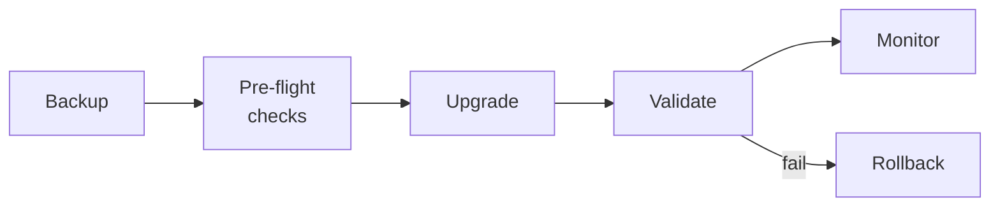

# Chapter 18: Upgrade Playbook

This chapter provides step-by-step procedures for upgrading every component in the Kates stack. Each procedure includes pre-flight checks, rollback plans, and validation steps.

## Upgrade Strategy



**Golden rule:** Always upgrade the operator before upgrading Kafka. Always run `make gameday` after any upgrade.

## Kafka Version Upgrade

### Version Compatibility Matrix

| Strimzi | Kafka (min) | Kafka (max) | KRaft |
|:-------:|:-----------:|:-----------:|:-----:|
| 0.49.0 | 3.7.0 | 3.9.0 | ✅ |
| 0.50.0 | 3.8.0 | 4.0.0 | ✅ |
| 0.51.0 | 3.9.0 | 4.1.1 | ✅ |

### Procedure

**Step 1 — Backup:**

```bash
# Create pre-upgrade backup
kubectl apply -f config/kafka/kafka-backup.yaml

# Wait for backup completion
kubectl get backup kafka-pre-upgrade -n velero -o jsonpath='{.status.phase}'
```

**Step 2 — Pre-flight validation:**

```bash
# Run baseline performance test
kates test create --type LOAD --records 100000 --acks all --wait \
  --label upgrade=pre --label version=$(kubectl get kafka krafter -n kafka \
  -o jsonpath='{.spec.kafka.version}')

# Run integrity test
kates test create --type INTEGRITY --records 50000 --wait --label upgrade=pre

# Record the test IDs for post-upgrade comparison
```

**Step 3 — Upgrade:**

```yaml
# In config/kafka/kafka.yaml — change the version
spec:
  kafka:
    version: 4.1.1  # → new version
```

```bash
kubectl apply -f config/kafka/kafka.yaml
```

Strimzi will perform a rolling restart, one broker at a time, with PDB constraints honored.

**Step 4 — Monitor the rolling restart:**

```bash
# Watch pods
kubectl get pods -n kafka -w

# Watch Kafka status
watch kubectl get kafka krafter -n kafka -o jsonpath='{.status.conditions[0].type}={.status.conditions[0].status}'

# Check Strimzi operator logs
kubectl logs deployment/strimzi-cluster-operator -n kafka -f
```

**Step 5 — Post-upgrade validation:**

```bash
# Re-run baseline tests
kates test create --type LOAD --records 100000 --acks all --wait \
  --label upgrade=post --label version=4.1.1

# Compare pre vs post
kates report diff <pre-id> <post-id>

# Run full GameDay
make gameday
```

### Rollback

```bash
# Revert the version in kafka.yaml
spec:
  kafka:
    version: <previous-version>

kubectl apply -f config/kafka/kafka.yaml
```

Strimzi will roll back one broker at a time.

## Strimzi Operator Upgrade

### Procedure

**Step 1 — Check release notes** for breaking changes at [Strimzi releases](https://github.com/strimzi/strimzi-kafka-operator/releases).

**Step 2 — Upgrade via Helm:**

```bash
helm repo update strimzi

helm upgrade strimzi-kafka-operator strimzi/strimzi-kafka-operator \
  --version <new-version> \
  --namespace kafka \
  --reuse-values
```

**Step 3 — Verify:**

```bash
kubectl get pods -n kafka | grep strimzi-cluster-operator
kubectl logs deployment/strimzi-cluster-operator -n kafka --tail=20
```

### Post-Upgrade — API Migration

Strimzi periodically deprecates API versions. When upgrading to a version that drops `v1beta2`:

```bash
# Update all CRDs to v1
sed -i '' 's|kafka.strimzi.io/v1beta2|kafka.strimzi.io/v1|g' \
  config/kafka/kafka.yaml \
  config/kafka/kafka-users.yaml \
  config/kafka/kafka-topics.yaml \
  config/kafka/kafka-rebalance.yaml

kubectl apply -f config/kafka/
```

## Drain Cleaner Upgrade

```bash
helm upgrade strimzi-drain-cleaner strimzi/strimzi-drain-cleaner \
  --version <new-version> \
  --namespace kafka \
  --set certManager.create=false \
  --set image.imagePullPolicy=IfNotPresent
```

## Kates Application Upgrade

### JVM Mode

```bash
# Build new image
make kates-build

# Rolling restart
make kates-redeploy
```

### Native Image Mode

```bash
# Build native image (3–8 minutes)
make kates-native

# Verify startup
kubectl logs deployment/kates -n kates | head -1
# Expected: started in 0.0XXs
```

## Monitoring Stack Upgrade

```bash
helm dependency update charts/monitoring

helm upgrade monitoring charts/monitoring \
  --namespace monitoring \
  --reuse-values
```

## Pre-Upgrade Checklist

Run through this before any upgrade:

- [ ] Velero backup completed successfully
- [ ] Baseline performance test recorded (with `--label upgrade=pre`)
- [ ] Integrity test passed (zero data loss)
- [ ] All brokers in Running state
- [ ] Kafka CR status is `Ready: True`
- [ ] No under-replicated partitions
- [ ] Strimzi release notes reviewed for breaking changes
- [ ] Rollback plan documented and tested

## Post-Upgrade Validation

- [ ] All pods Running and ready
- [ ] Kafka CR `Ready: True`
- [ ] No under-replicated partitions
- [ ] Performance test within 10% of baseline
- [ ] Integrity test passes (zero data loss)
- [ ] Consumer lag alerts not firing
- [ ] `make gameday` passes all phases

## Common Upgrade Issues

| Issue | Cause | Fix |
|-------|-------|-----|
| `UnsupportedVersionException` | Local Strimzi chart has mismatched Kafka images | Use the remote Helm chart |
| `ConfigException: Invalid value` | Kafka tightened config validation | Check release notes for deprecated configs |
| Brokers stuck in CrashLoop | Config incompatible with new version | Check `kubectl logs`, fix config, re-apply |
| Topics not reconciling | Topic Operator API version mismatch | Migrate CRDs to `v1` |
| PDB blocks rollout | Only 1 broker at a time, slow progress | Wait — this is intentional safety behavior |
