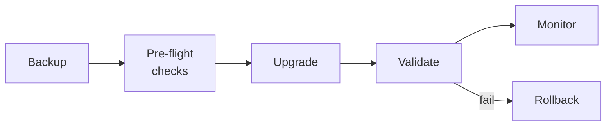

# Upgrade Playbook

This chapter provides step-by-step procedures for upgrading every component in the Kates stack. Each procedure includes pre-flight checks, rollback plans, and validation steps. It's written for the engineer who owns the upgrade window — the one who must answer "can we still roll back?" before anything moves. After this chapter, you can:

- Upgrade Kafka, the Strimzi operator, Kyverno, and the Kates application in the correct order, with a Velero backup and a recorded baseline taken first
- Validate an upgrade quantitatively by comparing post-upgrade runs against the pre-upgrade baseline with `kates report compare`
- Pick the right rollback path per component — and recognize the KRaft `metadataVersion` point of no return before crossing it
- Run the pre- and post-upgrade checklists as a repeatable drill rather than a one-off scramble

## Upgrade Strategy


```mermaid
graph LR
    B[Backup] --> P[Pre-flight<br/>checks] --> U[Upgrade] --> V[Validate] --> M[Monitor]
    V -->|"fail"| R[Rollback]
```

**Golden rule:** Always upgrade the operator before upgrading Kafka. Always run `make gameday` after any upgrade.

## Kafka Version Upgrade

### Version Compatibility Matrix

Each Strimzi release supports only a narrow window of Kafka versions, and that window moves with every release — always check the [Strimzi supported versions](https://strimzi.io/downloads/) page before planning an upgrade. This repository pins its versions centrally:

| Component | Pinned version | Source |
|-----------|----------------|--------|
| Strimzi operator | 1.2.0 | `STRIMZI_VERSION` in `versions.env` |
| Kafka image | `quay.io/strimzi/kafka:1.2.0-kafka-4.3.1` | `STRIMZI_KAFKA_VERSION` in `versions.env` |
| Chart default (`kafkaVersion`) | 4.3.1 | `charts/kafka-cluster/values.yaml` |

The generated [Version & Compatibility Matrix](appendix-d-versions.md) is the authority when this table and it disagree.

### Procedure

**Step 1 — Backup:**

The `kafka-cluster` chart owns the backup objects. Setting `backup.enabled=true` renders a daily Velero `Schedule` named `<cluster>-daily-backup` and, with `backup.preUpgrade` (on by default), a one-shot `Backup` named `<cluster>-pre-upgrade-r<revision>` as a `pre-upgrade` Helm hook — so a chart-driven upgrade snapshots itself.

```bash
# Confirm the schedule exists (it comes from backup.enabled in the values)
kubectl get schedule krafter-daily-backup -n velero

# Take an ad-hoc pre-upgrade backup as well
velero backup create kafka-pre-upgrade --include-namespaces kafka --wait

# Confirm completion
kubectl get backup kafka-pre-upgrade -n velero -o jsonpath='{.status.phase}'
```

**Step 2 — Pre-flight validation:**

```bash
# Record the current Kafka version for the post-upgrade comparison
kubectl get kafka krafter -n kafka -o jsonpath='{.spec.kafka.version}'

# Run baseline performance test
kates test create --type LOAD --records 100000 --acks all --wait

# Run integrity test
kates test create --type INTEGRITY --records 50000 --wait

# Record the test IDs for post-upgrade comparison
```

**Step 3 — Upgrade:**

The Kafka version is a chart value, not a hand-edited CR: `kafkaVersion` renders `spec.kafka.version`, and `kafka.metadataVersion` renders `spec.kafka.metadataVersion`. Start from the values the release runs with, change the version, and pin the metadata version the cluster runs now. The release is `krafter` when `kates deploy` installed it and `kafka-cluster` when `make kafka` did — `helm list -n kafka` shows which — while the Kafka cluster is `krafter` either way:

```bash
# Once per machine: the build downloads the SeaweedFS subchart, and once
# Chart.lock exists it accepts only a repository Helm has configured
helm repo add seaweedfs https://seaweedfs.github.io/seaweedfs/helm
helm dependency build charts/kafka-cluster

# The Helm release: krafter from kates deploy, kafka-cluster from make kafka
RELEASE=krafter

# Every value the release was installed with — its files and its --set flags
helm get values "${RELEASE}" -n kafka -o yaml > krafter-current.yaml

# The metadata version the cluster runs now
kubectl get kafka krafter -n kafka -o jsonpath='{.status.kafkaMetadataVersion}{"\n"}'

# The running operator's Kafka window, which must contain <new-version>
kates versions

helm upgrade "${RELEASE}" charts/kafka-cluster -n kafka \
  -f krafter-current.yaml \
  --set-string kafkaVersion=<new-version> \
  --set-string kafka.metadataVersion=<current-metadata-version>
```

`kafka.metadataVersion` stays at the version the cluster runs, which is what keeps a rollback possible (see [Kafka Version Rollback](#kafka-version-rollback)). `krafter-current.yaml` carries it only when the install set it — `kates deploy` and the Kind overlay do. Otherwise the default of the chart checkout you upgrade from applies, and that can raise it in the same step.

::: {.callout-caution}
Do not rebuild the values chain from the repository's files. `kates deploy` and `scripts/deploy-kafka-generic.sh` install the release with `.build/values-detected.yaml` first — the node pools, their zones and storage classes come from it — and `kates deploy` adds `--set` flags no file records, the metadata version among them. A chain without them renders other pool names: a pool's name is its identity, so each renamed pool is a new pool with new, empty volumes, while the old pools drop out of the release but keep running with the data (the chart marks them `helm.sh/resource-policy: keep`). It also takes `kafka.metadataVersion` from the files, which can raise it in the same step. If you do keep the values in files, re-run the exact chain the install used, generated file included, and set the new version last.
:::

::: {.callout-important}
`kates deploy --kafka-version` does not upgrade a running cluster. `kates deploy` installs the Kafka release only when it is not deployed yet; otherwise it prints `Kafka Cluster already deployed. Skipping.` and changes nothing, whatever version you pass. The version, and the `kafka.metadataVersion` the CLI derives from it (the newest minor line below it that the operator supports, or its own line when there is none), apply at first install only.
:::

Strimzi performs a rolling restart, one broker at a time, with PDB constraints honored.

**Step 4 — Monitor the rolling restart:**

```bash
# Watch pods
kubectl get pods -n kafka -w

# Watch Kafka status
watch kubectl get kafka krafter -n kafka -o jsonpath='{.status.conditions[0].type}={.status.conditions[0].status}'

# Check Strimzi operator logs (the operator runs in its own namespace)
kubectl logs deployment/strimzi-cluster-operator -n strimzi-operator -f
```

**Step 5 — Post-upgrade validation:**

```bash
# Re-run baseline tests
kates test create --type LOAD --records 100000 --acks all --wait

# Compare pre vs post
kates report compare <pre-id>,<post-id>

# Run the full Game Day pipeline
make gameday
```

### Rollback

Run the same `helm upgrade` with the previous `kafkaVersion` — Strimzi rolls the brokers back one at a time. See [Kafka Version Rollback](#kafka-version-rollback) under Rollback Procedures for the full procedure and the KRaft metadata caveat.

## Strimzi Operator Upgrade

### Procedure

**Step 1 — Check release notes** for breaking changes at [Strimzi releases](https://github.com/strimzi/strimzi-kafka-operator/releases).

**Step 2 — Upgrade the operator.** The operator is the `strimzi-operator` release of the wrapper chart (`charts/strimzi-operator`) in its own `strimzi-operator` namespace. Upgrade a production operator with the pause-and-verify procedure in [Deploying the Strimzi Operator](deploying-strimzi-operator.md#upgrading-the-operator), not with the CLI:

::: {.callout-warning}
The CLI checks the version window but pauses nothing: once you confirm, the new operator reconciles everything it watches as soon as it starts, so every Kafka cluster rolls at once, and so does every Kafka Connect and MirrorMaker 2 cluster on the operator's default image. And every `kates deploy` run, with `--strimzi-version` or without it, upgrades the operator release with `--reset-values` and the Kind or generic overlay, so an operator installed with `values-prod.yaml` loses the drain cleaner, upstream's operator NetworkPolicy and both PodDisruptionBudgets. On a production cluster, run `kates deploy --with-strimzi=false`, which leaves the operator release alone.
:::

On a development or test cluster, the CLI drives the upgrade so the wrapper's values, schema and CRD hook apply, and so the checks run first:

```bash
kates deploy --strimzi-version <new-version> --dry-run   # what would change, and whether it is allowed
kates deploy --strimzi-version <new-version>             # fetches and reads the chart, then upgrades
```

Before anything is installed the CLI refuses a downgrade, refuses a version whose Kafka window does not contain every cluster the operator runs (it names the cluster and suggests an operator whose window has both), refuses to cross Strimzi 1.0 while any CRD still stores `v1beta2`, and otherwise asks once, listing the clusters that will roll. `kates versions strimzi` lists the versions that exist (`--resolve` pulls each chart to show its Kafka window), and `kates versions kafka --strimzi-version <v>` prints one version's window. Upgrading around the CLI with a raw `helm upgrade` of the upstream chart bypasses the wrapper and its CRD hook — the CRDs then freeze at the version first installed.

**Step 3 — Verify:**

```bash
kubectl get pods -n strimzi-operator
kubectl logs deployment/strimzi-cluster-operator -n strimzi-operator --tail=20
```

### Post-Upgrade — API Migration

Strimzi periodically deprecates API versions. Everything in this repository already uses `kafka.strimzi.io/v1` — the `kafka-cluster` chart templates render it, and the raw manifests under `config/kafka/` carry it too. When a future Strimzi release drops an API version your own manifests still use, migrate them in bulk — this is the pattern used for the `v1beta2` → `v1` migration:

```bash
# GNU sed; on macOS use `sed -i ''` instead of `sed -i`
sed -i 's|kafka.strimzi.io/v1beta2|kafka.strimzi.io/v1|g' \
  config/kafka/kafka.yaml \
  config/kafka/kafka-users.yaml \
  config/kafka/kafka-topics.yaml \
  config/kafka/kafka-rebalance.yaml

kubectl apply -f config/kafka/
```

## Drain Cleaner Upgrade

Drain Cleaner is part of the `strimzi-operator` release (`charts/strimzi-operator/templates/drain-cleaner.yaml`) when `drainCleaner.enabled` is true (its prod values enable it), with the image pinned by the `drainCleaner.image` value (default `quay.io/strimzi/drain-cleaner:1.6.1`). kafka-cluster 0.4 used to deploy it; see `docs/kafka-cluster-1.0-upgrade.md` for the move. To upgrade it, bump the image tag and re-deploy the operator chart from the values the release runs with — they carry the overlay it was installed with and the DNS domain the deploy scripts inject:

```bash
helm dependency build charts/strimzi-operator

helm get values strimzi-operator -n strimzi-operator -o yaml > operator-current.yaml

helm upgrade strimzi-operator charts/strimzi-operator -n strimzi-operator \
  -f operator-current.yaml \
  --set drainCleaner.image=quay.io/strimzi/drain-cleaner:<version>

# Verify
kubectl get pods -n strimzi-operator -l app=strimzi-drain-cleaner
```

If `operator-current.yaml` sets `strimziVersion`, the release runs an operator other than the repository's pin, and upgrading it from `charts/strimzi-operator` would change the operator as well — stop and upgrade the operator first.

## Kates Application Upgrade

The chart pins the backend image: `values.yaml` sets `image.tag` to the release's version (the chart's `appVersion`), and the generic, corporate and production overlays pin a tag of their own. Building or pulling a newer image changes nothing the Deployment runs, and `kubectl rollout restart` only restarts the pinned tag. An upgrade is a `helm upgrade` of the `kates` release that sets the new tag, from the values the release runs with and from a checkout of the version you are moving to, so the chart's templates and the image agree:

```bash
# Every value the release was installed with — its files and its --set flags
helm get values kates -n kates -o yaml > kates-current.yaml

helm upgrade kates charts/kates -n kates \
  -f kates-current.yaml \
  --set-string image.tag=<new-version> \
  --timeout 8m --wait
```

The native image is published as `<new-version>-native`, the tag `values-native.yaml` pins; set that instead on a release that runs it.

This procedure, and the Helm rollback below, apply to a backend that `kates deploy` or the chart installed. `make kates-deploy` applies the raw manifests in `kates/k8s/` and creates no release, so `helm get values kates` fails with `release: not found`. There, set the new image in `kates/k8s/deployment.yaml`, apply it again with `kubectl apply -f kates/k8s/deployment.yaml`, and verify as below.

Verify that the new pods rolled out, run the new image, and answer. No `kates` command reports the backend's version — `kates version` reports the CLI's — so the Deployment's image is the evidence:

```bash
kubectl rollout status deployment/kates -n kates --timeout=300s
kubectl get deployment kates -n kates -o jsonpath='{.spec.template.spec.containers[0].image}'
kates health
```

On a Kind cluster, `kates deploy` runs a local native image pinned with `pullPolicy: Never` instead of a published tag: `kates:native-local`, built from your working tree, or else the `kates:native` that `make kates-native` pulled from the registry or built. Neither tag changes from one build to the next. There, check out the new version, build `kates:native-local` from it, and roll the Deployment onto that tag — a release that ran `kates:native` moves to it — with an annotation that carries the image ID. Without the annotation the rendered Deployment is identical and nothing restarts:

```bash
make kates-image-native-local

helm upgrade kates charts/kates -n kates \
  -f kates-current.yaml \
  --set-string image.tag=native-local \
  --set-string podAnnotations.kates-image-id="$(docker image inspect --format '{{.Id}}' kates:native-local)" \
  --timeout 8m --wait
```

`make kates-image-native-local` builds the image and loads it onto the Kind node but deploys nothing; the `helm upgrade` rolls it out. The Deployment's image reads `kates:native-local` whichever build it runs, so the image ID is the evidence here: once the rollout finishes, the annotation on the Deployment's pod template matches the image you built.

```bash
kubectl rollout status deployment/kates -n kates --timeout=300s

# The two IDs match
kubectl get deployment kates -n kates -o jsonpath='{.spec.template.metadata.annotations.kates-image-id}{"\n"}'
docker image inspect --format '{{.Id}}' kates:native-local

kates health
```

## Monitoring Stack Upgrade

The `monitoring` release lives in the `kafka` namespace when `make monitoring` installed it, and in `monitoring` (the `--monitoring-ns` default) when `kates deploy` did. Upgrade it from the values it runs with, rather than with `--reuse-values`, which applies the release's values over the *old* chart's defaults and so ignores every default the new chart changes:

```bash
MON_NS=kafka   # or monitoring, for a release kates deploy installed

# Once per machine, for the kube-prometheus-stack subchart
helm repo add prometheus-community https://prometheus-community.github.io/helm-charts
helm dependency build charts/monitoring

helm get values monitoring -n "${MON_NS}" -o yaml > monitoring-current.yaml

helm upgrade monitoring charts/monitoring \
  --namespace "${MON_NS}" \
  -f monitoring-current.yaml
```

## Kyverno Upgrade

Kyverno upgrades require special attention because admission webhooks are in the critical path of the Kubernetes API server.

### Procedure

**Step 1 — Review the release notes** at [Kyverno releases](https://github.com/kyverno/kyverno/releases) for breaking changes, especially CRD schema changes and policy API deprecations.

**Step 2 — Upgrade the Kyverno CRDs first:**

```bash
# Pin to the release tag you are upgrading to — never `main`
KYVERNO_TAG=<release-tag>   # e.g. from https://github.com/kyverno/kyverno/releases

kubectl apply -f https://raw.githubusercontent.com/kyverno/kyverno/${KYVERNO_TAG}/config/crds/kyverno/kyverno.io_clusterpolicies.yaml
kubectl apply -f https://raw.githubusercontent.com/kyverno/kyverno/${KYVERNO_TAG}/config/crds/kyverno/kyverno.io_policyexceptions.yaml
kubectl apply -f https://raw.githubusercontent.com/kyverno/kyverno/${KYVERNO_TAG}/config/crds/policyreport/wgpolicyk8s.io_clusterpolicyreports.yaml
kubectl apply -f https://raw.githubusercontent.com/kyverno/kyverno/${KYVERNO_TAG}/config/crds/policyreport/wgpolicyk8s.io_policyreports.yaml
```

::: {.callout-warning}
Always upgrade CRDs before the controller. If the new controller version expects CRD fields that don't exist yet, the admission webhook may fail open or reject all requests.
:::

**Step 3 — Upgrade the Kyverno controller via Helm:**

```bash
helm repo update kyverno

# The release's own values, applied over the new chart's defaults
helm get values kyverno -n kyverno -o yaml > kyverno-current.yaml

helm upgrade kyverno kyverno/kyverno \
  -n kyverno \
  --version <chart-version> \
  -f kyverno-current.yaml
```

Pin `--version` to the chart release that ships `${KYVERNO_TAG}`, the tag whose CRDs you applied in Step 2; without it Helm takes the newest chart in the repository.

**Step 4 — Verify the upgrade:**

```bash
# Check controller pods are running
kubectl get pods -n kyverno

# Verify all ClusterPolicies are ready
kates kyverno status

# Check for any new violations
kates kyverno violations
```

### Switching Between Enforce and Audit Modes

When switching a policy from `Audit` to `Enforce` (or vice versa) during an upgrade:

1. **Audit first** — always deploy policy changes in `Audit` mode before enforcing
2. **Check PolicyReports** — review existing violations with `kates kyverno violations` to ensure no critical workloads would be blocked
3. **Switch per-policy** — use `kates kyverno enforce <policy-name>` to switch individual policies rather than all at once

```bash
# Check current violations before switching to Enforce
kates kyverno violations --namespace kafka

# Switch to Enforce only when clean
kates kyverno enforce kates-pod-security-standards
```

### PolicyException Compatibility

After upgrading Kyverno, verify that existing `PolicyException` resources are still compatible:

```bash
# List all PolicyExceptions
kubectl get policyexceptions -A

# Check which API version each exception is stored as
kubectl get policyexceptions -A -o jsonpath='{range .items[*]}{.metadata.namespace}/{.metadata.name}: {.apiVersion}{"\n"}{end}'
```

::: {.callout-important}
The `PolicyException` API was introduced in Kyverno 1.9 and has moved through several API versions since (`kyverno.io/v2alpha1` → `v2beta1` → `v2`). After upgrading Kyverno, make sure your exceptions use an API version the new release still serves — alpha and beta versions are dropped over time. Check the [Kyverno release notes](https://github.com/kyverno/kyverno/releases) for API deprecations before upgrading.
:::

## Pre-Upgrade Checklist

Run through this before any upgrade:

- [ ] Velero backup completed successfully
- [ ] Baseline performance test recorded (note the test ID for the post-upgrade comparison)
- [ ] Integrity test passed (zero data loss)
- [ ] All brokers in Running state
- [ ] Kafka CR status is `Ready: True`
- [ ] No under-replicated partitions
- [ ] Strimzi release notes reviewed for breaking changes
- [ ] Rollback plan documented and tested

::: {.callout-tip}
**Try it**

Dry-run the checklist without touching a version number — take the snapshot and record the baselines, then stop:

```bash
# Record the current Kafka version
kubectl get kafka krafter -n kafka -o jsonpath='{.spec.kafka.version}'

# Take the snapshot and confirm it completed
velero backup create upgrade-drill --include-namespaces kafka --wait
kubectl get backup upgrade-drill -n velero -o jsonpath='{.status.phase}'

# Record the performance and integrity baselines
kates test create --type LOAD --records 100000 --acks all --wait
kates test create --type INTEGRITY --records 50000 --wait
```

The backup phase reads `Completed` and both tests pass; note the LOAD test ID — it's the `<pre-id>` that `kates report compare` needs after a real upgrade.
:::

## Post-Upgrade Validation

- [ ] All pods Running and ready
- [ ] Kafka CR `Ready: True`
- [ ] No under-replicated partitions
- [ ] Performance test within 10% of baseline
- [ ] Integrity test passes (zero data loss)
- [ ] Consumer lag alerts not firing
- [ ] `make gameday` passes all phases

## Common Upgrade Issues

| Issue | Cause | Fix |
|-------|-------|-----|
| `UnsupportedVersionException` | The requested Kafka version is outside the running operator's window | Upgrade the operator first, as in [Strimzi Operator Upgrade](#strimzi-operator-upgrade) — by hand in production; `kates versions` prints the running operator's window |
| `ConfigException: Invalid value` | Kafka tightened config validation | Check release notes for deprecated configs |
| Brokers stuck in CrashLoop | Config incompatible with new version | Check `kubectl logs`, fix config, re-apply |
| Topics not reconciling | Topic Operator API version mismatch | Migrate CRDs to `v1` |
| PDB blocks rollout | Only 1 broker at a time, slow progress | Wait — this is intentional safety behavior |

## Rollback Procedures

Rollback is a critical part of any upgrade plan. Each component has different rollback characteristics.

### Kafka Version Rollback

**Step 1 — Revert the Kafka version, keeping every other value:**

```bash
helm repo add seaweedfs https://seaweedfs.github.io/seaweedfs/helm
helm dependency build charts/kafka-cluster

# The Helm release: krafter from kates deploy, kafka-cluster from make kafka
RELEASE=krafter

helm get values "${RELEASE}" -n kafka -o yaml > krafter-current.yaml

helm upgrade "${RELEASE}" charts/kafka-cluster -n kafka \
  -f krafter-current.yaml \
  --set-string kafkaVersion=<previous-version>
```

The previous version must still be inside the running operator's Kafka window — `kates versions` prints it — and must support the `kafka.metadataVersion` in `krafter-current.yaml`, which the upgrade pinned.

**Step 2 — Monitor the rolling restart:**

```bash
kubectl get pods -n kafka -w
watch kubectl get kafka krafter -n kafka -o jsonpath='{.status.conditions[0].type}={.status.conditions[0].status}'
```

**Step 3 — Post-rollback validation:**

```bash
# The Kafka version and metadata version the cluster runs, as Strimzi reports them
kubectl get kafka krafter -n kafka \
  -o jsonpath='{.status.kafkaVersion} {.status.kafkaMetadataVersion}{"\n"}'

# Run integrity test
kates test create --type INTEGRITY --records 50000 --wait

# Verify no data loss
kates test get <id>
```

::: {.callout-warning}
Kafka version rollback is **NOT possible** once the KRaft metadata version has been raised. Strimzi controls this through `spec.kafka.metadataVersion` in the Kafka CR (exposed as `kafka.metadataVersion` in the `kafka-cluster` chart values): upgrade the broker `version` first while leaving `metadataVersion` at the previous level — in that state a rollback is still possible. Once you raise `metadataVersion`, the brokers can no longer read the older metadata format and downgrade is irreversible. Only bump `metadataVersion` after the new version has passed validation.
:::

### Strimzi Operator Rollback

**Step 1 — Rollback via Helm:**

```bash
# List Helm history
helm history strimzi-operator -n strimzi-operator

# Rollback to previous revision
helm rollback strimzi-operator <previous-revision> -n strimzi-operator
```

**Step 2 — Verify the operator is running:**

```bash
kubectl get pods -n strimzi-operator
kubectl logs deployment/strimzi-cluster-operator -n strimzi-operator --tail=20
```

**Step 3 — Post-rollback validation:**

```bash
# Check all Kafka CRs are reconciled
kubectl get kafka,kafkatopic,kafkauser -n kafka

# Run a quick smoke test
kates test create --type LOAD --records 10000 --wait
```

::: {.callout-warning}
If the new Strimzi version migrated CRDs to a new API version (e.g., `v1beta2` → `v1`), rolling back the operator will **not** revert the CRDs. You must manually restore the CRDs from backup or re-apply the old CRD definitions.
:::

### Kates Application Rollback

**Step 1 — Roll the release back:**

The upgrade was a Helm revision, so the rollback is one too. `kubectl rollout undo` would revert the pods while the release still records the new tag, and the next `helm upgrade` from `helm get values` would bring it straight back.

```bash
helm history kates -n kates
helm rollback kates <previous-revision> -n kates --wait
```

**Step 2 — Verify the rollback:**

```bash
# Check pod status
kubectl get pods -n kates

# Verify the version
kubectl get deployment kates -n kates -o jsonpath='{.spec.template.spec.containers[0].image}'

# Run a health check
kates health
```

**Step 3 — Post-rollback validation:**

```bash
# Ensure scheduled tests still trigger
kates schedule list

# Run a baseline test
kates test create --type LOAD --records 50000 --wait
```

### Rollback Decision Matrix

| Component | Rollback Method | Time Estimate | Risk Level |
|-----------|----------------|:-------------:|:----------:|
| Kafka version | `kafkaVersion` revert with `helm upgrade` + rolling restart | 10–30 min | Medium |
| KRaft metadata format | **Not reversible** | N/A | ⛔ Critical |
| Strimzi operator | Helm rollback | 2–5 min | Low |
| Strimzi CRD migration | Manual CRD restore from backup | 5–15 min | High |
| Kates application | Helm rollback | 1–2 min | Low |
| Monitoring stack | Helm rollback | 2–5 min | Low |
| Kyverno | Helm rollback + CRD restore | 5–10 min | Medium |

## Summary

- Always upgrade the Strimzi operator before Kafka, take a Velero backup and record LOAD and INTEGRITY baselines before either, and run `make gameday` after any upgrade.
- A Kafka version bump is a `helm upgrade` that starts from the release's current values (`helm get values`), sets `kafkaVersion` and pins `kafka.metadataVersion` to what the cluster runs; a chain rebuilt from the repository's files without `.build/values-detected.yaml` renames the node pools. `kates deploy --kafka-version` does not upgrade a running cluster. Strimzi rolls the brokers one at a time with PDB constraints honored.
- Upgrade a production Strimzi operator with the pause-and-verify procedure in [Deploying the Strimzi Operator](deploying-strimzi-operator.md#upgrading-the-operator): the CLI pauses nothing, and every `kates deploy` re-applies the operator release with the Kind or generic overlay, dropping what `values-prod.yaml` added.
- The Kates backend upgrades through Helm too: the chart pins the image, so set the new `image.tag` on the `kates` release — a rebuild and a `kubectl rollout restart` run the old tag again.
- Hold `spec.kafka.metadataVersion` at the previous level until the new brokers pass validation — raising it makes downgrade irreversible.
- Kyverno upgrades go CRDs first, controller second; afterwards verify with `kates kyverno status` and confirm `PolicyException` resources still use a served API version.
- A Helm rollback of the Strimzi operator does not revert migrated CRDs — those need a manual restore from backup.
- Post-upgrade validation is quantitative: performance within 10% of the recorded baseline, an integrity test with zero data loss, and a green Game Day run.

With every component upgrade rehearsed and reversible, the remaining moving piece is the integration layer itself: [Kafka Connect & CDC Pipelines](21-kafka-connect.md) covers deploying and operating Kafka Connect with Debezium CDC.
