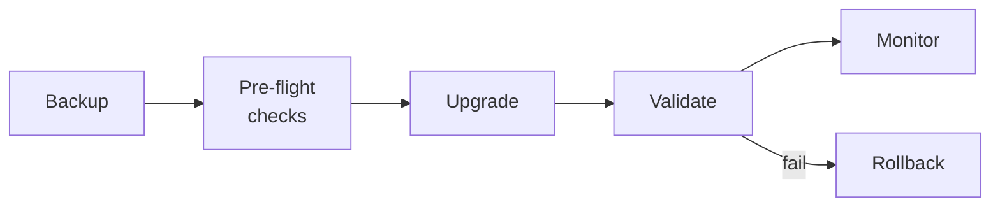

# Chapter 18: Upgrade Playbook

This chapter provides step-by-step procedures for upgrading every component in the Kates stack. Each procedure includes pre-flight checks, rollback plans, and validation steps.

## Upgrade Strategy


```mermaid
graph LR
    B[Backup] --> P[Pre-flight<br/>checks] --> U[Upgrade] --> V[Validate] --> M[Monitor]
    V -->|"fail"| R[Rollback]
```

**Golden rule:** Always upgrade the operator before upgrading Kafka. Always run `make gameday` after any upgrade.

## Kafka Version Upgrade

### Version Compatibility Matrix

Each Strimzi release supports only a narrow window of Kafka versions, and that window moves with every release — always check the [Strimzi supported versions](https://strimzi.io/downloads/) page before planning an upgrade. This repository pins its versions centrally:

| Component | Pinned version | Source |
|-----------|----------------|--------|
| Strimzi operator | 1.0.0 | `STRIMZI_VERSION` in `versions.env` |
| Kafka image | `quay.io/strimzi/kafka:1.0.0-kafka-4.2.0` | `STRIMZI_KAFKA_VERSION` in `versions.env` |
| Chart default (`kafkaVersion`) | 4.2.0 | `charts/kafka-cluster/values.yaml` |

### Procedure

**Step 1 — Backup:**

```bash
# Ensure the Velero backup schedule exists
# (config/kafka/kafka-backup.yaml defines the kafka-daily-backup Schedule)
kubectl apply -f config/kafka/kafka-backup.yaml

# Take an ad-hoc pre-upgrade backup
velero backup create kafka-pre-upgrade --include-namespaces kafka --wait

# Confirm completion
kubectl get backup kafka-pre-upgrade -n velero -o jsonpath='{.status.phase}'
```

**Step 2 — Pre-flight validation:**

```bash
# Record the current Kafka version for the post-upgrade comparison
kubectl get kafka krafter -n kafka -o jsonpath='{.spec.kafka.version}'

# Run baseline performance test
kates test create --type LOAD --records 100000 --acks all --wait

# Run integrity test
kates test create --type INTEGRITY --records 50000 --wait

# Record the test IDs for post-upgrade comparison
```

**Step 3 — Upgrade:**

```yaml
# In config/kafka/kafka.yaml — change the version
spec:
  kafka:
    version: 4.1.1  # → new version
```

```bash
kubectl apply -f config/kafka/kafka.yaml
```

Strimzi will perform a rolling restart, one broker at a time, with PDB constraints honored.

**Step 4 — Monitor the rolling restart:**

```bash
# Watch pods
kubectl get pods -n kafka -w

# Watch Kafka status
watch kubectl get kafka krafter -n kafka -o jsonpath='{.status.conditions[0].type}={.status.conditions[0].status}'

# Check Strimzi operator logs (the operator runs in its own namespace)
kubectl logs deployment/strimzi-cluster-operator -n strimzi-operator -f
```

**Step 5 — Post-upgrade validation:**

```bash
# Re-run baseline tests
kates test create --type LOAD --records 100000 --acks all --wait

# Compare pre vs post
kates report compare <pre-id>,<post-id>

# Run full GameDay
make gameday
```

### Rollback

Revert `spec.kafka.version` in `config/kafka/kafka.yaml` and re-apply — Strimzi rolls the brokers back one at a time. See [Kafka Version Rollback](#kafka-version-rollback) under Rollback Procedures for the full procedure and the KRaft metadata caveat.

## Strimzi Operator Upgrade

### Procedure

**Step 1 — Check release notes** for breaking changes at [Strimzi releases](https://github.com/strimzi/strimzi-kafka-operator/releases).

**Step 2 — Upgrade via Helm.** The operator is installed from the OCI chart as the `strimzi-operator` release in its own `strimzi-operator` namespace (see `scripts/deploy-kafka.sh`):

```bash
helm upgrade strimzi-operator oci://quay.io/strimzi-helm/strimzi-kafka-operator \
  --version <new-version> \
  --namespace strimzi-operator \
  --reuse-values
```

**Step 3 — Verify:**

```bash
kubectl get pods -n strimzi-operator
kubectl logs deployment/strimzi-cluster-operator -n strimzi-operator --tail=20
```

### Post-Upgrade — API Migration

Strimzi periodically deprecates API versions. The manifests in this repository already use `kafka.strimzi.io/v1` (see `config/kafka/kafka.yaml`). When a future Strimzi release drops an API version your manifests still use, migrate them in bulk — this is the pattern used for the `v1beta2` → `v1` migration:

```bash
# GNU sed; on macOS use `sed -i ''` instead of `sed -i`
sed -i 's|kafka.strimzi.io/v1beta2|kafka.strimzi.io/v1|g' \
  config/kafka/kafka.yaml \
  config/kafka/kafka-users.yaml \
  config/kafka/kafka-topics.yaml \
  config/kafka/kafka-rebalance.yaml

kubectl apply -f config/kafka/
```

## Drain Cleaner Upgrade

Drain Cleaner is not a standalone Helm release in this repository — it is deployed by the `kafka-cluster` chart (`charts/kafka-cluster/templates/drain-cleaner.yaml`) when `drainCleaner.enabled` is true (the prod values enable it), with the image pinned by the `drainCleaner.image` value (default `quay.io/strimzi/drain-cleaner:1.0.0`). To upgrade it, bump the image tag and re-deploy the chart:

```bash
# Update drainCleaner.image in charts/kafka-cluster/values.yaml, then:
make kafka-upgrade

# Verify
kubectl get pods -n kafka -l app=strimzi-drain-cleaner
```

## Kates Application Upgrade

### JVM Mode

```bash
# Build new image
make kates-build

# Rolling restart
kubectl rollout restart deployment/kates -n kates
kubectl rollout status deployment/kates -n kates --timeout=300s
```

### Native Image Mode

```bash
# Build native image (3–8 minutes)
make kates-native

# Verify startup
kubectl logs deployment/kates -n kates | head -1
# Expected: started in 0.0XXs
```

## Monitoring Stack Upgrade

The `monitoring` release is installed into the `kafka` namespace (see the `monitoring` target in the Makefile):

```bash
helm dependency build charts/monitoring

helm upgrade monitoring charts/monitoring \
  --namespace kafka \
  --reuse-values
```

## Kyverno Upgrade

Kyverno upgrades require special attention because admission webhooks are in the critical path of the Kubernetes API server.

### Procedure

**Step 1 — Review the release notes** at [Kyverno releases](https://github.com/kyverno/kyverno/releases) for breaking changes, especially CRD schema changes and policy API deprecations.

**Step 2 — Upgrade the Kyverno CRDs first:**

```bash
# Pin to the release tag you are upgrading to — never `main`
KYVERNO_TAG=<release-tag>   # e.g. from https://github.com/kyverno/kyverno/releases

kubectl apply -f https://raw.githubusercontent.com/kyverno/kyverno/${KYVERNO_TAG}/config/crds/kyverno/kyverno.io_clusterpolicies.yaml
kubectl apply -f https://raw.githubusercontent.com/kyverno/kyverno/${KYVERNO_TAG}/config/crds/kyverno/kyverno.io_policyexceptions.yaml
kubectl apply -f https://raw.githubusercontent.com/kyverno/kyverno/${KYVERNO_TAG}/config/crds/policyreport/wgpolicyk8s.io_clusterpolicyreports.yaml
kubectl apply -f https://raw.githubusercontent.com/kyverno/kyverno/${KYVERNO_TAG}/config/crds/policyreport/wgpolicyk8s.io_policyreports.yaml
```

::: {.callout-warning}
Always upgrade CRDs before the controller. If the new controller version expects CRD fields that don't exist yet, the admission webhook may fail open or reject all requests.
:::


**Step 3 — Upgrade the Kyverno controller via Helm:**

```bash
helm repo update kyverno
helm upgrade kyverno kyverno/kyverno \
  -n kyverno \
  --reuse-values
```

**Step 4 — Verify the upgrade:**

```bash
# Check controller pods are running
kubectl get pods -n kyverno

# Verify all ClusterPolicies are ready
kates kyverno status

# Check for any new violations
kates kyverno violations
```

### Switching Between Enforce and Audit Modes

When switching a policy from `Audit` to `Enforce` (or vice versa) during an upgrade:

1. **Audit first** — always deploy policy changes in `Audit` mode before enforcing
2. **Check PolicyReports** — review existing violations with `kates kyverno violations` to ensure no critical workloads would be blocked
3. **Switch per-policy** — use `kates kyverno enforce <policy-name>` to switch individual policies rather than all at once

```bash
# Check current violations before switching to Enforce
kates kyverno violations --namespace kafka

# Switch to Enforce only when clean
kates kyverno enforce kates-pod-security-standards
```

### PolicyException Compatibility

After upgrading Kyverno, verify that existing `PolicyException` resources are still compatible:

```bash
# List all PolicyExceptions
kubectl get policyexceptions -A

# Check which API version each exception is stored as
kubectl get policyexceptions -A -o jsonpath='{range .items[*]}{.metadata.namespace}/{.metadata.name}: {.apiVersion}{"\n"}{end}'
```

::: {.callout-important}
The `PolicyException` API was introduced in Kyverno 1.9 and has moved through several API versions since (`kyverno.io/v2alpha1` → `v2beta1` → `v2`). After upgrading Kyverno, make sure your exceptions use an API version the new release still serves — alpha and beta versions are dropped over time. Check the [Kyverno release notes](https://github.com/kyverno/kyverno/releases) for API deprecations before upgrading.
:::


## Pre-Upgrade Checklist

Run through this before any upgrade:

- [ ] Velero backup completed successfully
- [ ] Baseline performance test recorded (note the test ID for the post-upgrade comparison)
- [ ] Integrity test passed (zero data loss)
- [ ] All brokers in Running state
- [ ] Kafka CR status is `Ready: True`
- [ ] No under-replicated partitions
- [ ] Strimzi release notes reviewed for breaking changes
- [ ] Rollback plan documented and tested

## Post-Upgrade Validation

- [ ] All pods Running and ready
- [ ] Kafka CR `Ready: True`
- [ ] No under-replicated partitions
- [ ] Performance test within 10% of baseline
- [ ] Integrity test passes (zero data loss)
- [ ] Consumer lag alerts not firing
- [ ] `make gameday` passes all phases

## Common Upgrade Issues

| Issue | Cause | Fix |
|-------|-------|-----|
| `UnsupportedVersionException` | Local Strimzi chart has mismatched Kafka images | Use the remote Helm chart |
| `ConfigException: Invalid value` | Kafka tightened config validation | Check release notes for deprecated configs |
| Brokers stuck in CrashLoop | Config incompatible with new version | Check `kubectl logs`, fix config, re-apply |
| Topics not reconciling | Topic Operator API version mismatch | Migrate CRDs to `v1` |
| PDB blocks rollout | Only 1 broker at a time, slow progress | Wait — this is intentional safety behavior |

## Rollback Procedures

Rollback is a critical part of any upgrade plan. Each component has different rollback characteristics.

### Kafka Version Rollback

**Step 1 — Revert the Kafka version in the CR:**

```yaml
# Revert kafka.yaml to the previous version
spec:
  kafka:
    version: <previous-version>  # e.g., 3.9.0
```

```bash
kubectl apply -f config/kafka/kafka.yaml
```

**Step 2 — Monitor the rolling restart:**

```bash
kubectl get pods -n kafka -w
watch kubectl get kafka krafter -n kafka -o jsonpath='{.status.conditions[0].type}={.status.conditions[0].status}'
```

**Step 3 — Post-rollback validation:**

```bash
# Verify broker version
kubectl exec krafter-brokers-alpha-0 -n kafka -- /opt/kafka/bin/kafka-broker-api-versions.sh \
  --bootstrap-server localhost:9092 | head -1

# Run integrity test
kates test create --type INTEGRITY --records 50000 --wait

# Verify no data loss
kates test get <id>
```

::: {.callout-warning}
Kafka version rollback is **NOT possible** once the KRaft metadata version has been raised. Strimzi controls this through `spec.kafka.metadataVersion` in the Kafka CR (exposed as `kafka.metadataVersion` in the `kafka-cluster` chart values): upgrade the broker `version` first while leaving `metadataVersion` at the previous level — in that state a rollback is still possible. Once you raise `metadataVersion`, the brokers can no longer read the older metadata format and downgrade is irreversible. Only bump `metadataVersion` after the new version has passed validation.
:::


### Strimzi Operator Rollback

**Step 1 — Rollback via Helm:**

```bash
# List Helm history
helm history strimzi-operator -n strimzi-operator

# Rollback to previous revision
helm rollback strimzi-operator <previous-revision> -n strimzi-operator
```

**Step 2 — Verify the operator is running:**

```bash
kubectl get pods -n strimzi-operator
kubectl logs deployment/strimzi-cluster-operator -n strimzi-operator --tail=20
```

**Step 3 — Post-rollback validation:**

```bash
# Check all Kafka CRs are reconciled
kubectl get kafka,kafkatopic,kafkauser -n kafka

# Run a quick smoke test
kates test create --type LOAD --records 10000 --wait
```

::: {.callout-warning}
If the new Strimzi version migrated CRDs to a new API version (e.g., `v1beta2` → `v1`), rolling back the operator will **not** revert the CRDs. You must manually restore the CRDs from backup or re-apply the old CRD definitions.
:::


### Kates Application Rollback

**Step 1 — Rollback the deployment:**

```bash
# Use Kubernetes rollout undo
kubectl rollout undo deployment/kates -n kates

# Or rollback to a specific revision
kubectl rollout undo deployment/kates -n kates --to-revision=<N>
```

**Step 2 — Verify the rollback:**

```bash
# Check pod status
kubectl get pods -n kates

# Verify the version
kubectl get deployment kates -n kates -o jsonpath='{.spec.template.spec.containers[0].image}'

# Run a health check
kates cluster check
```

**Step 3 — Post-rollback validation:**

```bash
# Ensure scheduled tests still trigger
kates schedule list

# Run a baseline test
kates test create --type LOAD --records 50000 --wait
```

### Rollback Decision Matrix

| Component | Rollback Method | Time Estimate | Risk Level |
|-----------|----------------|:-------------:|:----------:|
| Kafka version | CR version revert + rolling restart | 10–30 min | Medium |
| KRaft metadata format | **Not reversible** | N/A | ⛔ Critical |
| Strimzi operator | Helm rollback | 2–5 min | Low |
| Strimzi CRD migration | Manual CRD restore from backup | 5–15 min | High |
| Kates application | `kubectl rollout undo` | 1–2 min | Low |
| Monitoring stack | Helm rollback | 2–5 min | Low |
| Kyverno | Helm rollback + CRD restore | 5–10 min | Medium |
