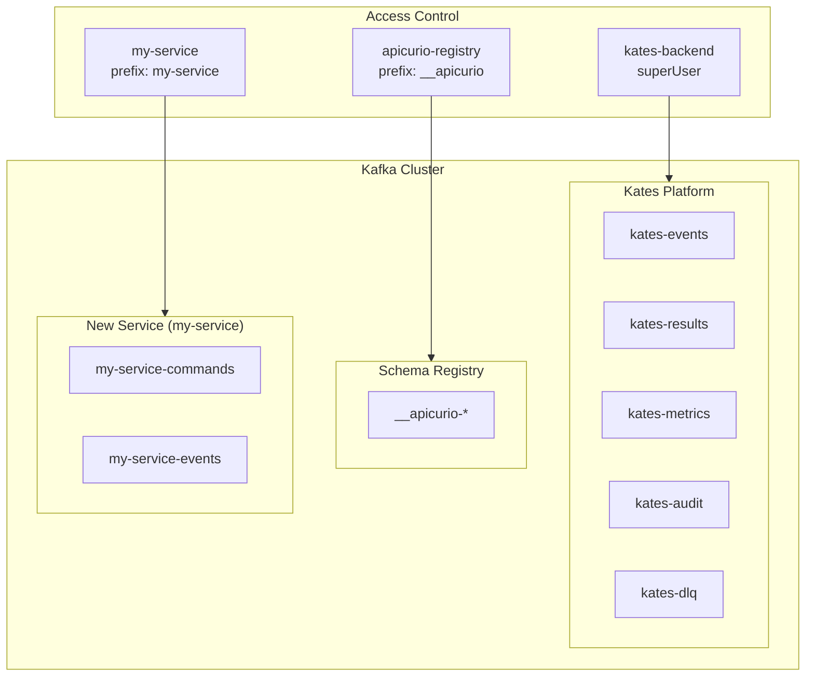
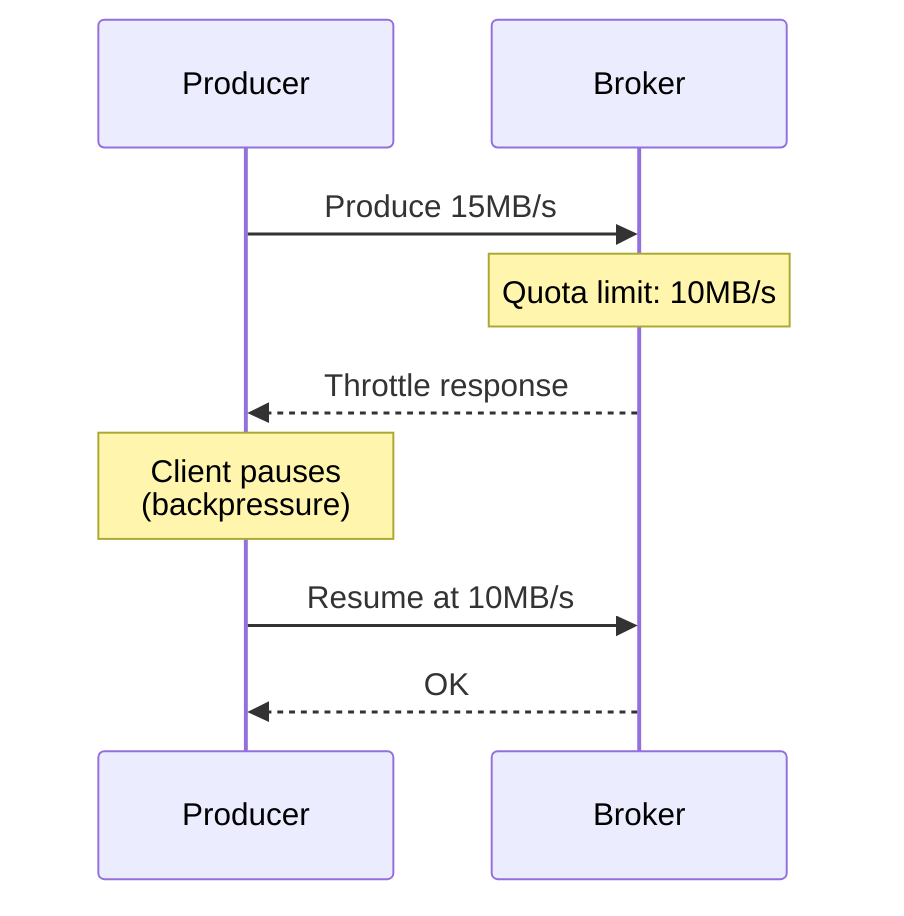

# Chapter 19: Multi-Tenancy

This chapter covers strategies for running multiple services, teams, or environments on the shared krafter Kafka cluster without interference — from topic naming to quota enforcement.

## Multi-Tenancy Model

The krafter cluster uses **namespace-level isolation** within a single Kafka cluster:



Each tenant gets:
- **Prefix-scoped topics** — all topics start with the service name
- **Dedicated KafkaUser** — own credentials, own ACLs
- **Resource quotas** — produce/consume rate limits + CPU share
- **NetworkPolicy entries** — explicit ingress to broker ports

## Topic Naming Convention

```
<service-name>-<domain>[-<qualifier>]
```

| Pattern | Example | Purpose |
|---------|---------|---------|
| `<svc>-events` | `payments-events` | Domain event stream |
| `<svc>-commands` | `orders-commands` | Command/request queue |
| `<svc>-dlq` | `orders-dlq` | Dead letter queue |
| `<svc>-internal-<x>` | `cache-internal-sync` | Internal coordination |
| `__<svc>-<x>` | `__apicurio-global-id` | Framework-internal topics |

**Rules:**
- Lowercase, hyphen-separated
- Always prefix with the service name
- Use `__` prefix for framework/infrastructure topics
- Dead letter queues use `-dlq` suffix with `compact` cleanup

## Onboarding a New Service

### Step 1 — Define Topics

```yaml
apiVersion: kafka.strimzi.io/v1
kind: KafkaTopic
metadata:
  name: my-service-events
  namespace: kafka
  labels:
    strimzi.io/cluster: krafter
    app.kubernetes.io/part-of: my-service
spec:
  partitions: 6
  replicas: 3
  config:
    retention.ms: "604800000"       # 7 days
    min.insync.replicas: "2"
    cleanup.policy: delete
    compression.type: lz4
---
apiVersion: kafka.strimzi.io/v1
kind: KafkaTopic
metadata:
  name: my-service-dlq
  namespace: kafka
  labels:
    strimzi.io/cluster: krafter
    app.kubernetes.io/part-of: my-service
spec:
  partitions: 3
  replicas: 3
  config:
    retention.ms: "-1"
    min.insync.replicas: "2"
    cleanup.policy: compact
```

### Step 2 — Create User with Scoped ACLs

```yaml
apiVersion: kafka.strimzi.io/v1
kind: KafkaUser
metadata:
  name: my-service
  namespace: kafka
  labels:
    strimzi.io/cluster: krafter
spec:
  authentication:
    type: scram-sha-512
  quotas:
    producerByteRate: 10485760      # 10MB/s
    consumerByteRate: 20971520      # 20MB/s
    requestPercentage: 15           # max 15% of broker request handler
  authorization:
    type: simple
    acls:
      - resource:
          type: topic
          name: "my-service"
          patternType: prefix
        operations: ["Read", "Write", "Create", "Describe"]
        host: "*"
      - resource:
          type: group
          name: "my-service"
          patternType: prefix
        operations: ["Read", "Describe"]
        host: "*"
```

### Step 3 — Allow Network Access

Add the service's namespace to the broker NetworkPolicy:

```yaml
# In kafka-networkpolicies.yaml, under kafka-brokers ingress
- from:
    - namespaceSelector:
        matchLabels:
          kubernetes.io/metadata.name: my-service-namespace
  ports:
    - port: 9092
      protocol: TCP
```

### Step 4 — Configure the Service

Mount the auto-generated secret in the service's deployment:

```yaml
env:
  - name: KAFKA_BOOTSTRAP_SERVERS
    value: krafter-kafka-bootstrap.kafka:9092
  - name: KAFKA_SASL_USERNAME
    value: my-service
  - name: KAFKA_SASL_PASSWORD
    valueFrom:
      secretKeyRef:
        name: my-service       # Strimzi-generated secret
        key: password
  - name: KAFKA_SASL_MECHANISM
    value: SCRAM-SHA-512
```

### Step 5 — Verify

```bash
# Check user was created
kubectl get kafkauser my-service -n kafka

# Check secret was generated
kubectl get secret my-service -n kafka

# Check topics exist
kubectl get kafkatopic -n kafka -l app.kubernetes.io/part-of=my-service
```

## Quota Strategy

### Sizing Guidelines

| Service Profile | Produce | Consume | CPU | Use Case |
|----------------|:-------:|:-------:|:---:|----------|
| Low-volume | 1 MB/s | 5 MB/s | 5% | Audit logging, config sync |
| Standard | 10 MB/s | 20 MB/s | 15% | Business events, commands |
| High-throughput | 50 MB/s | 100 MB/s | 30% | Data pipelines, analytics |
| Infrastructure | Unlimited | Unlimited | — | Kates, chaos testing |

### Quota Enforcement

Quotas are enforced by Kafka at the broker level:



When a client exceeds its quota, the broker delays its response by a calculated time. The client SDK handles this transparently — no errors, just increased latency.

## Partition Planning

### How Many Partitions?

| Factor | Guidance |
|--------|----------|
| Consumer parallelism | Partitions ≥ max expected consumers |
| Throughput | More partitions = more parallel I/O |
| Broker count | At least = broker count for even spread |
| Overhead | Each partition costs ~10KB of metadata and file handles |

**Recommended sizing:**

| Throughput | Partitions |
|:----------:|:----------:|
| < 1 MB/s | 3 |
| 1–10 MB/s | 6 |
| 10–50 MB/s | 12 |
| > 50 MB/s | 24+ |

## Tenant Isolation Matrix

| Dimension | Mechanism | Enforcement |
|-----------|-----------|-------------|
| **Data** | Prefix-scoped ACLs | Kafka ACL evaluator |
| **Bandwidth** | Per-user produce/consume quotas | Broker throttling |
| **CPU** | `requestPercentage` quota | Broker request handler pool |
| **Network** | Kubernetes NetworkPolicies | CNI plugin |
| **Storage** | Topic-level retention policies | Log cleaner |
| **Credentials** | Per-user SCRAM secrets | Strimzi User Operator |

## Monitoring Per-Tenant

Use the Kafka Exporter metrics to monitor per-consumer-group lag:

```promql
# Consumer lag by group (tenant)
kafka_consumergroup_lag{consumergroup=~"my-service.*"}

# Produce rate by topic (tenant)
rate(kafka_server_brokertopicmetrics_bytesin_total{topic=~"my-service.*"}[5m])
```

Consider adding per-tenant Grafana dashboards using the `app.kubernetes.io/part-of` label.

## Decommissioning a Tenant

```bash
# 1. Delete the user (revokes credentials + ACLs)
kubectl delete kafkauser my-service -n kafka

# 2. Delete the topics (data loss — ensure retention has passed)
kubectl delete kafkatopic -n kafka -l app.kubernetes.io/part-of=my-service

# 3. Remove NetworkPolicy entry for the namespace
# Edit kafka-networkpolicies.yaml and re-apply

# 4. Verify cleanup
kubectl get kafkauser,kafkatopic -n kafka | grep my-service
```

For security configuration details, see [Chapter 17: Security & Compliance](17-security.md). For Kafka deployment internals, see [Chapter 15: Kafka Deployment Engineering](15-kafka-deployment.md).
