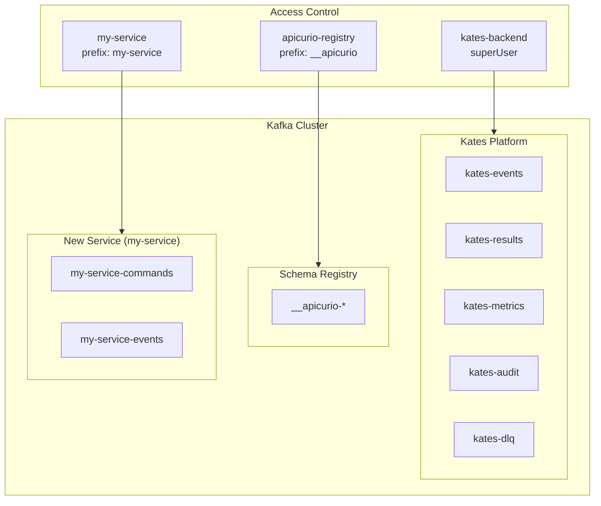
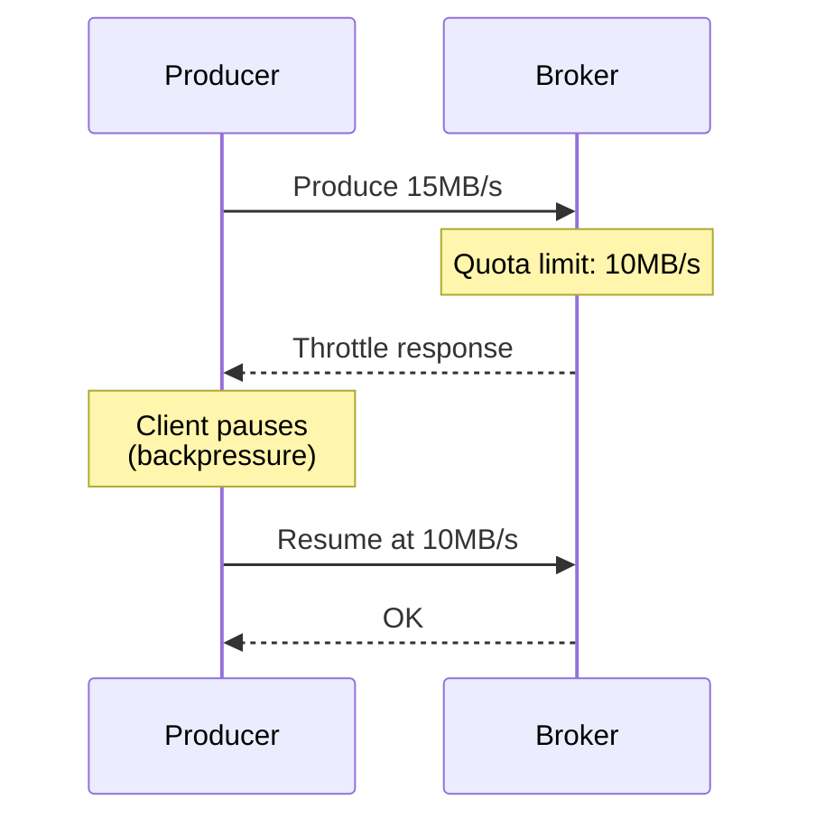
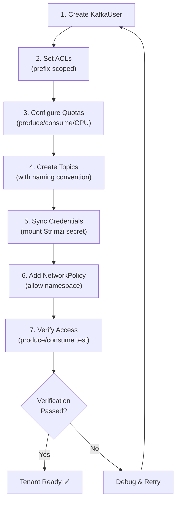

# Multi-Tenancy

This chapter covers strategies for running multiple services, teams, or environments on the shared krafter Kafka cluster without interference — from topic naming to quota enforcement.

After this chapter, you can:

- Onboard a tenant declaratively — prefix-scoped topics, a dedicated `KafkaUser` with scoped ACLs, and a NetworkPolicy entry
- Size per-user quotas and partition counts against a tenant's throughput profile
- Track per-tenant bandwidth and consumer lag with topic-prefix PromQL queries
- Decommission a tenant cleanly without touching its neighbors

## Multi-Tenancy Model

The krafter cluster uses **namespace-level isolation** within a single Kafka cluster:


```mermaid
graph TB
    subgraph Kafka Cluster
        subgraph Kates["Kates Platform"]
            T1["kates-events"]
            T2["kates-results"]
            T3["kates-metrics"]
            T4["kates-audit"]
            T5["kates-dlq"]
        end

        subgraph Apicurio["Schema Registry"]
            A1["__apicurio-*"]
        end

        subgraph Tenant["New Service (my-service)"]
            S1["my-service-commands"]
            S2["my-service-events"]
        end
    end

    subgraph Access Control
        ACL1["kates-backend<br/>superUser"] --> Kates
        ACL2["apicurio-registry<br/>prefix: __apicurio"] --> Apicurio
        ACL3["my-service<br/>prefix: my-service"] --> Tenant
    end
```

Each tenant gets:
- **Prefix-scoped topics** — all topics start with the service name
- **Dedicated KafkaUser** — own credentials, own ACLs
- **Resource quotas** — produce/consume rate limits + CPU share
- **NetworkPolicy entries** — explicit ingress to broker ports

## Topic Naming Convention

```text
<service-name>-<domain>[-<qualifier>]
```

| Pattern | Example | Purpose |
|---------|---------|---------|
| `<svc>-events` | `payments-events` | Domain event stream |
| `<svc>-commands` | `orders-commands` | Command/request queue |
| `<svc>-dlq` | `orders-dlq` | Dead letter queue |
| `<svc>-internal-<x>` | `cache-internal-sync` | Internal coordination |
| `__<svc>-<x>` | `__apicurio-global-id` | Framework-internal topics |

**Rules:**
- Lowercase, hyphen-separated
- Always prefix with the service name
- Use `__` prefix for framework/infrastructure topics
- Dead letter queues use the `-dlq` suffix, `delete` cleanup and a bounded retention — never `compact`, which keeps only the latest failure per key and refuses records without one

## Onboarding a New Service

Topics, users and network access are all `kafka-cluster` chart values, so one tenant is one block of values and one `helm upgrade`. The examples below go in a `tenants.yaml` that holds every tenant, layered after the values the release already runs with.

### Step 1 — Define Topics

`topics.items` is keyed by topic name, and `topics.defaults` fills in what you leave out — `replicas` defaults to the rendered broker count capped at 3, and `min.insync.replicas` to `replicas - 1` bounded to 1–2, so neither needs restating per topic:

```yaml
topics:
  items:
    my-service-events:
      partitions: 6
      config:
        retention.ms: "604800000"       # 7 days
        cleanup.policy: delete
        compression.type: lz4
    my-service-dlq:
      partitions: 3
      config:
        retention.ms: "604800000"       # 7 days to inspect and replay
        cleanup.policy: delete
```

### Step 2 — Create User with Scoped ACLs

`users.items` is keyed by principal name; each entry is the `KafkaUser` spec:

```yaml
users:
  items:
    my-service:
      authentication:
        type: scram-sha-512
      quotas:
        producerByteRate: 10485760      # 10MB/s
        consumerByteRate: 20971520      # 20MB/s
        requestPercentage: 15           # max 15% of broker request handler
      authorization:
        type: simple
        acls:
          - resource:
              type: topic
              name: "my-service"
              patternType: prefix
            operations: ["Read", "Write", "Create", "Describe"]
            host: "*"
          - resource:
              type: group
              name: "my-service"
              patternType: prefix
            operations: ["Read", "Describe"]
            host: "*"
```

### Step 3 — Allow Network Access

`networkPolicy.clients` grants the tenant's pods ingress to the brokers in the chart's `krafter-kafka` policy, which `values-kind.yaml` and `values-dev.yaml` do not render. On its own it keeps no other pod out: NetworkPolicies add up, and the policy the Strimzi operator generates admits every pod in the cluster to a listener without `networkPolicyPeers`, which no listener in the chart's values has. The list becomes the allow list once the listeners carry peers, as [Security & Compliance](17-security.md#network-policies) shows. Name the listeners the tenant may reach and the chart derives their ports from `kafka.listeners`.

`clients` is a list, and a list in a later values file replaces the earlier one rather than merging with it. `tenants.yaml` therefore carries every entry the release already has — `helm get values krafter -n kafka` lists them (`kafka-cluster` in place of `krafter` for a release `make kafka` installed); a `kates deploy` install has at least the `connect` entry — with the tenant's added. An entry left out is dropped at the next upgrade:

```yaml
networkPolicy:
  clients:
    # ...every entry the release already lists, unchanged
    - name: my-service
      namespace: my-service-namespace
      podSelector: { app.kubernetes.io/name: my-service }
      listeners: [plain]
```

::: {.callout-important}
A pod selector is required — there is no namespace-wide grant. `networkPolicies.allowedClientNamespaces`, the 0.4 spelling, never generated a rule and is now answered with a deprecation notice, so a tenant carried over from a 0.4 values file has no network access until it appears here.
:::

### Step 4 — Configure the Service

Mount the auto-generated secret in the service's deployment:

```yaml
env:
  - name: KAFKA_BOOTSTRAP_SERVERS
    value: krafter-kafka-bootstrap.kafka:9092
  - name: KAFKA_SASL_USERNAME
    value: my-service
  - name: KAFKA_SASL_PASSWORD
    valueFrom:
      secretKeyRef:
        name: my-service       # Strimzi-generated secret
        key: password
  - name: KAFKA_SASL_MECHANISM
    value: SCRAM-SHA-512
```

### Step 5 — Apply and Verify

Start from the values the release runs with — every file and `--set` flag it was installed with — then render to see exactly what the tenant block adds, and upgrade. The release is `krafter` when `kates deploy` installed it and `kafka-cluster` when `make kafka` did — `helm list -n kafka` shows which — while the Kafka cluster is `krafter` either way:

```bash
# Once per machine: the build downloads the SeaweedFS subchart, and once
# Chart.lock exists it accepts only a repository Helm has configured
helm repo add seaweedfs https://seaweedfs.github.io/seaweedfs/helm
helm dependency build charts/kafka-cluster

# The Helm release: krafter from kates deploy, kafka-cluster from make kafka
RELEASE=krafter

helm get values "${RELEASE}" -n kafka -o yaml > krafter-current.yaml

helm template "${RELEASE}" charts/kafka-cluster -n kafka \
  -f krafter-current.yaml \
  -f tenants.yaml | grep -E 'kind: (KafkaTopic|KafkaUser|NetworkPolicy)' -A2 | grep 'name:'

helm upgrade "${RELEASE}" charts/kafka-cluster -n kafka \
  -f krafter-current.yaml \
  -f tenants.yaml
```

::: {.callout-caution}
Do not rebuild the chain from the repository's files (`values-platform.yaml`, then an environment overlay). A release that `kates deploy` or `scripts/deploy-kafka-generic.sh` installed takes its node pools from `.build/values-detected.yaml`, which such a chain leaves out, so the pools it renders carry other names. A pool's name is its identity: each renamed pool is a new pool with new, empty volumes, and the old pools drop out of the release but keep running with the data.
:::

```bash
# Check user was created
kubectl get kafkauser my-service -n kafka

# Check secret was generated
kubectl get secret my-service -n kafka

# Check topics exist — the chart labels every topic for the cluster, not the
# tenant, so select by the cluster and read the name prefix
kubectl get kafkatopic -n kafka -l strimzi.io/cluster=krafter
```

## Quota Strategy

### Sizing Guidelines

| Service Profile | Produce | Consume | CPU | Use Case |
|----------------|:-------:|:-------:|:---:|----------|
| Low-volume | 1 MB/s | 5 MB/s | 5% | Audit logging, config sync |
| Standard | 10 MB/s | 20 MB/s | 15% | Business events, commands |
| High-throughput | 50 MB/s | 100 MB/s | 30% | Data pipelines, analytics |
| Infrastructure | Unlimited | Unlimited | — | Kates, chaos testing |

### Quota Enforcement

Quotas are enforced by Kafka at the broker level:


```mermaid
sequenceDiagram
    participant Producer
    participant Broker

    Producer->>Broker: Produce 15MB/s
    Note over Broker: Quota limit: 10MB/s
    Broker-->>Producer: Throttle response
    Note over Producer: Client pauses<br/>(backpressure)
    Producer->>Broker: Resume at 10MB/s
    Broker-->>Producer: OK
```

When a client exceeds its quota, the broker delays its response by a calculated time. The client SDK handles this transparently — no errors, just increased latency.

## Partition Planning

### How Many Partitions?

| Factor | Guidance |
|--------|----------|
| Consumer parallelism | Partitions ≥ max expected consumers |
| Throughput | More partitions = more parallel I/O |
| Broker count | At least = broker count for even spread |
| Overhead | Each partition adds controller metadata and open file handles on every replica |

**Recommended sizing:**

| Throughput | Partitions |
|:----------:|:----------:|
| < 1 MB/s | 3 |
| 1–10 MB/s | 6 |
| 10–50 MB/s | 12 |
| > 50 MB/s | 24+ |

## Tenant Isolation Matrix

| Dimension | Mechanism | Enforcement |
|-----------|-----------|-------------|
| **Data** | Prefix-scoped ACLs | Kafka ACL evaluator |
| **Bandwidth** | Per-user produce/consume quotas | Broker throttling |
| **CPU** | `requestPercentage` quota | Broker request handler pool |
| **Network** | Kubernetes NetworkPolicies, once the listeners carry `networkPolicyPeers` | CNI plugin |
| **Storage** | Topic-level retention policies | Log cleaner |
| **Credentials** | Per-user SCRAM secrets | Strimzi User Operator |

## Monitoring Per-Tenant

Use the Kafka Exporter metrics to monitor per-consumer-group lag:

```promql
# Consumer lag by group (tenant)
kafka_consumergroup_lag{consumergroup=~"my-service.*"}

# Produce rate by topic (tenant)
rate(kafka_server_brokertopicmetrics_bytesin_total{topic=~"my-service.*"}[5m])
```

Consider adding per-tenant Grafana dashboards using the `app.kubernetes.io/part-of` label.

## Tenant Onboarding Workflow

The following flowchart shows the end-to-end tenant onboarding process:


```mermaid
flowchart TD
    A["1. Create KafkaUser"] --> B["2. Set ACLs\n(prefix-scoped)"]
    B --> C["3. Configure Quotas\n(produce/consume/CPU)"]
    C --> D["4. Create Topics\n(with naming convention)"]
    D --> E["5. Sync Credentials\n(mount Strimzi secret)"]
    E --> F["6. Add NetworkPolicy\n(allow namespace)"]
    F --> G["7. Verify Access\n(produce/consume test)"]
    G --> H{"Verification\nPassed?"}
    H -->|Yes| I["Tenant Ready ✅"]
    H -->|No| J["Debug & Retry"]
    J --> A
```

### Quick-Start Script

There is no dedicated CLI command for tenant onboarding — the workflow is declarative, and all three pieces are chart values. Add the tenant's `topics.items`, `users.items` and `networkPolicy.clients` entries to `tenants.yaml`, then upgrade the release from its current values and verify:

```bash
helm repo add seaweedfs https://seaweedfs.github.io/seaweedfs/helm
helm dependency build charts/kafka-cluster

# The Helm release: krafter from kates deploy, kafka-cluster from make kafka
RELEASE=krafter

helm get values "${RELEASE}" -n kafka -o yaml > krafter-current.yaml

helm upgrade "${RELEASE}" charts/kafka-cluster -n kafka \
  -f krafter-current.yaml \
  -f tenants.yaml

# Wait for the User Operator to reconcile the credentials
kubectl wait kafkauser/my-service --for=condition=Ready -n kafka --timeout=60s

# Confirm the generated secret and topics
kubectl get secret my-service -n kafka
kubectl get kafkatopic -n kafka -l strimzi.io/cluster=krafter
```

## Quota Monitoring

Kafka's per-user quota and throttle-time MBeans are not mapped by the JMX exporter rules the chart vendors (`charts/kafka-cluster/files/metrics/kafka-metrics.yaml`, Strimzi's own rule set), so there are no per-user Prometheus metrics in this setup. Tenant usage is tracked indirectly — by topic prefix and consumer group.

### Per-Tenant Bandwidth Monitoring

```promql
# Produce bandwidth per tenant topic (bytes/sec)
sum by (topic) (
  rate(kafka_server_brokertopicmetrics_bytesin_total{topic=~"my-service.*"}[5m])
)

# Fraction of the tenant's 10MB/s produce quota in use
sum(rate(kafka_server_brokertopicmetrics_bytesin_total{topic=~"my-service.*"}[5m]))
  / (10 * 1024 * 1024)
```

### Request Handler Saturation

The `requestPercentage` quota is enforced per user inside the broker, but only the pool-wide utilization is exported:

The vendored rules expose the meter's count of idle nanoseconds rather than a ready-made percentage, which is why the chart's own alert divides by `1e9`:

```promql
# Broker request handler idle fraction (shared across all tenants)
avg by (namespace, strimzi_io_cluster, kubernetes_pod_name) (
  rate(kafka_server_kafkarequesthandlerpool_requesthandleravgidlepercent_count_total{
    namespace="kafka", strimzi_io_cluster="krafter", strimzi_io_name="krafter-kafka"
  }[5m])
) / 1e9
```

### Throttling Detection

Broker-side throttle-time metrics are not exported by the current JMX rules. Quota throttling surfaces client-side instead: the broker delays responses, so a throttled tenant sees increased produce/fetch latency without errors (see the quota enforcement diagram above).

### Alert Rules

The `kafka-cluster` chart renders the cluster's alerts as a `PrometheusRule` named `<cluster>-alerts`, scoped to that cluster by namespace and `strimzi_io_cluster` so two clusters in one namespace never alert on each other's series. Two of them catch tenant-level problems, as they render for `krafter`:

```yaml
- alert: KafkaConsumerGroupLag
  expr: sum by (namespace, strimzi_io_cluster, consumergroup) (kafka_consumergroup_lag{namespace="kafka", strimzi_io_cluster="krafter"}) > 1000000
  for: 15m
  labels:
    severity: warning
  annotations:
    summary: "A consumer group on Kafka krafter is behind"
    description: "{{ $labels.consumergroup }} is {{ $value }} messages behind."
    runbook_url: "https://github.com/bmscomp/kates/blob/main/docs/kafka-cluster-runbook.md#kafkaconsumergrouplag"

- alert: KafkaRequestHandlerSaturated
  expr: avg by (namespace, strimzi_io_cluster, kubernetes_pod_name) (rate(kafka_server_kafkarequesthandlerpool_requesthandleravgidlepercent_count_total{namespace="kafka", strimzi_io_cluster="krafter", strimzi_io_name="krafter-kafka"}[5m])) / 1e9 < 0.3
  for: 10m
  labels:
    severity: warning
  annotations:
    summary: "Kafka krafter request handlers are saturated"
    description: "{{ $labels.kubernetes_pod_name }} handlers are idle {{ $value | humanizePercentage }} of the time."
    runbook_url: "https://github.com/bmscomp/kates/blob/main/docs/kafka-cluster-runbook.md#kafkarequesthandlersaturated"
```

`KafkaConsumerGroupLagCritical` fires on the same series at ten times the threshold after five minutes. `kates cluster alerts --group kafka-cluster.krafter.consumers` lists what the live cluster actually carries.

## Decommissioning a Tenant

Decommissioning is two moves, not one. Turning the tenant's entries off and upgrading stops the chart managing those objects, but `keepOnDelete` is on by default and the chart annotates every `KafkaTopic` and `KafkaUser` with `helm.sh/resource-policy: keep` — so Helm leaves them behind on purpose, and the credentials stay valid until you delete them yourself.

Deleting the tenant's block from `tenants.yaml` is not enough: `krafter-current.yaml` still carries it from the upgrade that added it, and Helm merges the two. Set `enabled: false` on each entry instead:

```yaml
topics:
  items:
    my-service-events: { enabled: false }
    my-service-dlq: { enabled: false }
users:
  items:
    my-service: { enabled: false }
networkPolicy:
  clients:
    # ...every other client, unchanged
    - name: my-service
      enabled: false
```

```bash
# 1. Upgrade from the current values with the tenant turned off
# (the Helm release: krafter from kates deploy, kafka-cluster from make kafka)
RELEASE=krafter
helm get values "${RELEASE}" -n kafka -o yaml > krafter-current.yaml

helm upgrade "${RELEASE}" charts/kafka-cluster -n kafka \
  -f krafter-current.yaml \
  -f tenants.yaml

# 2. Delete the user (revokes credentials + ACLs)
kubectl delete kafkauser my-service -n kafka

# 3. Delete the topics (data loss — ensure retention has passed)
kubectl delete kafkatopic my-service-events my-service-dlq -n kafka

# 4. Verify cleanup
kubectl get kafkauser,kafkatopic -n kafka | grep my-service
```

For security configuration details, see [Security & Compliance](17-security.md). For Kafka deployment internals, see [Kafka Deployment Engineering](15-kafka-deployment.md).

::: {.callout-tip}
**Try it**

Onboard a toy tenant end to end — one prefix-scoped topic and one user, then verify and tear down:

```bash
kubectl apply -n kafka -f - <<'EOF'
apiVersion: kafka.strimzi.io/v1
kind: KafkaTopic
metadata: {name: toy-events, labels: {strimzi.io/cluster: krafter}}
spec: {partitions: 3, replicas: 3}
---
apiVersion: kafka.strimzi.io/v1
kind: KafkaUser
metadata: {name: toy, labels: {strimzi.io/cluster: krafter}}
spec:
  authentication: {type: scram-sha-512}
  authorization:
    type: simple
    acls:
      - resource: {type: topic, name: toy, patternType: prefix}
        operations: [Read, Write, Describe]
        host: "*"
EOF

kubectl wait kafkauser/toy --for=condition=Ready -n kafka --timeout=60s
kubectl get secret toy -n kafka
kates security acl-map
kubectl delete kafkatopic/toy-events kafkauser/toy -n kafka
```

Within the wait window the User Operator flips the user Ready and generates the `toy` Secret; the ACL map shows `toy-events` covered by the `toy` user before the last command removes both resources.
:::

## Summary

- Tenancy on the krafter cluster is namespace-level within one Kafka cluster: prefix-scoped topics, a dedicated `KafkaUser` per service, per-user quotas, and NetworkPolicy entries.
- Onboarding is declarative and lives in the `kafka-cluster` chart's values — `topics.items`, `users.items` and `networkPolicy.clients` — so one `helm upgrade` carries the whole tenant and the User Operator reconciles credentials and ACLs.
- Quotas throttle at the broker: an over-quota client sees delayed responses, not errors, so watch tenant latency rather than error rates.
- Per-user quota metrics aren't exported by the JMX rules, so tenant usage is tracked indirectly — by topic prefix and consumer group in PromQL.
- Decommissioning takes two moves: turn the tenant's entries off (`enabled: false`) and upgrade from the current values, then delete the `KafkaUser` and its topics by hand — `keepOnDelete` and `helm.sh/resource-policy: keep` mean Helm will not remove them for you.

With tenants isolated from each other, the remaining risk is change itself — [Upgrade Playbook](18-upgrade-playbook.md) gives you step-by-step procedures for upgrading every component of the stack without breaking them.
