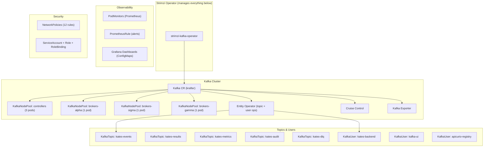

# Chapter 20: Installing Kafka with the kafka-cluster Helm Chart

This chapter walks you through deploying a production-grade Apache Kafka cluster on Kubernetes using the **kafka-cluster** Helm chart. It is written for someone who may be new to Kafka, Kubernetes, or Helm — every step is explained with the *why* before the *how*.

By the end of this chapter you will have:

- A 3-broker, 3-controller KRaft Kafka cluster
- SCRAM-SHA-512 authentication and simple ACL authorization
- Prometheus metrics, Grafana dashboards, and alerting rules
- Managed topics and users, all declared as code

---

## 1. Prerequisites

Before you begin, make sure you have the following tools and infrastructure ready.

### 1.1 Tools

| Tool | Minimum Version | Why You Need It |
|------|:---------------:|-----------------|
| **kubectl** | 1.28+ | Communicates with your Kubernetes cluster. Every command in this guide uses `kubectl` to inspect or modify cluster state. |
| **Helm** | 3.14+ | The Kubernetes package manager. The kafka-cluster chart is a Helm chart — Helm renders YAML templates from `values.yaml` and applies them to your cluster. |
| **Docker** | 24+ | Required only if using a local Kind/k3d cluster. Docker runs the Kubernetes nodes as containers on your machine. |
| **Kind** *(optional)* | 0.22+ | A lightweight tool to run Kubernetes *in Docker*. Perfect for local development. Not needed if deploying to EKS, GKE, AKS, or an existing cluster. |

**Install check — run all four:**

```bash
kubectl version --client -o yaml | grep gitVersion
helm version --short
docker version --format '{{.Server.Version}}'
kind version  # only if using Kind
```

If any command fails, install the missing tool before continuing.

### 1.2 Kubernetes Cluster

You need a running Kubernetes cluster with:

| Requirement | Minimum | Recommended | Why |
|-------------|:-------:|:-----------:|-----|
| **Nodes** | 1 | 3+ (one per zone) | Kafka spreads brokers across failure domains. With 3 nodes, each broker runs on a different node, so a single node failure only loses 1 broker. |
| **CPU** | 6 cores total | 12+ cores | The 3 brokers need 1 CPU each, 3 controllers need 0.5 CPU each, plus operator, exporter, and Cruise Control. |
| **Memory** | 16 GB total | 24+ GB | Brokers need 4 GB each for heap + page cache. Controllers need 1 GB. |
| **Storage** | 150 GB | 300+ GB | Each broker stores 50 GB of log data by default. Use SSDs if possible — Kafka is I/O-heavy. |
| **StorageClass** | 1 | 1 per zone | PersistentVolumeClaims (PVCs) need a StorageClass to provision disks. For zone-aware deployments, each zone gets its own class. |

> [!IMPORTANT]
> If you are using a **managed Kubernetes service** (EKS, GKE, AKS), the StorageClasses are usually pre-configured (e.g., `gp3` on AWS, `standard-rw` on GKE). For local Kind clusters, you must create them manually — see section 3.1.

### 1.3 Namespaces

The chart deploys everything into a single namespace (default: `kafka`). Create it before installing:

```bash
kubectl create namespace kafka --dry-run=client -o yaml | kubectl apply -f -
```

Why `--dry-run=client | apply`? This is an idempotent pattern — it creates the namespace if it doesn't exist and does nothing if it already does. Safe to run multiple times.

### 1.4 Prometheus Stack (Optional but Recommended)

If you want metrics, dashboards, and alerts, install the `kube-prometheus-stack` first:

```bash
helm repo add prometheus-community https://prometheus-community.github.io/helm-charts
helm upgrade --install monitoring prometheus-community/kube-prometheus-stack \
  --namespace monitoring --create-namespace
```

The kafka-cluster chart will automatically create `PodMonitor` and `PrometheusRule` resources that the Prometheus operator discovers.

---

## 2. Understanding the Chart

Before running `helm install`, it helps to understand what the chart creates.

### 2.1 What Gets Deployed

When you install the kafka-cluster chart, Helm creates these Kubernetes resources:



### 2.2 How Strimzi Works

The chart doesn't create Kafka pods directly. Instead, it creates **Custom Resources** (CRs) — YAML objects that describe your *desired state*. The **Strimzi Operator** watches these CRs and does the heavy lifting:

1. You apply a `Kafka` CR that says "I want 3 brokers with TLS"
2. The Strimzi Operator sees the CR and creates pods, configmaps, secrets, services
3. If you change the CR (e.g., increase replicas), the operator detects the change and performs a rolling update

This means **you never edit pods directly** — you always edit the Helm values, run `helm upgrade`, and the operator reconciles.

### 2.3 KRaft Mode (No ZooKeeper)

This chart deploys Kafka in **KRaft mode** — the modern architecture where Kafka manages its own metadata using a built-in Raft consensus protocol. There is no ZooKeeper dependency.

Why this matters to you:
- **Fewer moving parts**: No separate ZooKeeper ensemble to manage
- **Faster failover**: Controller election happens in seconds, not minutes
- **Simpler operations**: One fewer StatefulSet, one fewer monitoring target

---

## 3. Installation

### 3.1 Step 1 — Storage Classes (Local/Kind Only)

If you're deploying to Kind or a local cluster without dynamic provisioning, create a StorageClass. Cloud clusters (EKS/GKE/AKS) can skip this step.

```bash
for ZONE in alpha sigma gamma; do
  kubectl apply -f - <<EOF
apiVersion: storage.k8s.io/v1
kind: StorageClass
metadata:
  name: local-storage-${ZONE}
provisioner: rancher.io/local-path
reclaimPolicy: Retain
volumeBindingMode: WaitForFirstConsumer
EOF
done
```

**What this does:** Creates three StorageClasses, one per availability zone. The `WaitForFirstConsumer` binding mode ensures PVCs are bound only after a pod is scheduled, respecting node affinity.

### 3.2 Step 2 — Add the Strimzi Helm Repository

The kafka-cluster chart has a **dependency** on the Strimzi operator chart. Helm needs to know where to find it:

```bash
helm repo add strimzi https://strimzi.io/charts/
helm repo update
```

Then download the dependency:

```bash
cd charts/kafka-cluster
helm dependency update
```

This creates a `charts/strimzi-kafka-operator-0.51.0.tgz` file inside the chart directory. Helm will install the operator automatically when you install the chart.

### 3.3 Step 3 — Review and Customize Values

The chart ships with sensible defaults in `values.yaml`, but you should review key settings before installing.

**Cluster identity:**

```yaml
clusterName: krafter       # Name of the Kafka cluster
kafkaVersion: "4.1.1"      # Apache Kafka version
strimziVersion: "0.51.0"   # Strimzi operator version
```

**Broker pools — define one pool per availability zone:**

```yaml
brokerPools:
  - name: brokers-alpha
    zone: alpha              # Node label: topology.kubernetes.io/zone=alpha
    replicas: 1
    storageSize: 50Gi
    storageClass: local-storage-alpha
  - name: brokers-sigma
    zone: sigma
    replicas: 1
    storageSize: 50Gi
    storageClass: local-storage-sigma
  - name: brokers-gamma
    zone: gamma
    replicas: 1
    storageSize: 50Gi
    storageClass: local-storage-gamma
```

**Why one broker per pool?** Each pool is pinned to a zone via `nodeAffinity`. This guarantees that when a zone goes down, only one broker is lost — the cluster continues to serve reads and writes because `min.insync.replicas: 2` is satisfied by the remaining two brokers.

**For a single-node test cluster**, simplify to one pool:

```yaml
brokerPools:
  - name: brokers
    zone: ""                 # No zone affinity
    replicas: 3
    storageSize: 10Gi
    storageClass: standard   # Your cluster's default StorageClass
```

### 3.4 Step 4 — Install the Chart

There are two installation modes, depending on whether the Strimzi operator is already installed.

**Mode A — Install everything (operator + cluster) in one shot:**

```bash
helm upgrade --install kafka-cluster charts/kafka-cluster \
  --namespace kafka \
  --create-namespace \
  --timeout 600s \
  --wait
```

This installs the Strimzi operator as a subchart and then creates all Kafka resources. The `--wait` flag tells Helm to block until all deployments are ready.

**Mode B — Operator already installed (e.g., shared cluster):**

```bash
helm upgrade --install kafka-cluster charts/kafka-cluster \
  --namespace kafka \
  --set strimziOperator.enabled=false \
  --set crdUpgrade.enabled=false \
  --timeout 600s \
  --wait
```

Setting `strimziOperator.enabled=false` skips the operator subchart. This is the correct mode when:
- A cluster admin already installed Strimzi at the cluster level
- You're upgrading only the Kafka cluster resources

### 3.5 Step 5 — Watch the Deployment

After `helm install` or `helm upgrade` starts, open a second terminal and watch the pods come up:

```bash
kubectl get pods -n kafka -w
```

You should see pods appear in this order:

| Order | Pod | What It Does |
|:-----:|-----|-------------|
| 1 | `strimzi-cluster-operator-*` | The Strimzi operator — must be running before anything else |
| 2 | `krafter-controllers-3/4/5` | KRaft controller quorum — elected leader manages metadata |
| 3 | `krafter-brokers-alpha-0` | First broker — starts accepting connections |
| 4 | `krafter-brokers-sigma-2` | Second broker |
| 5 | `krafter-brokers-gamma-1` | Third broker |
| 6 | `krafter-entity-operator-*` | Topic Operator + User Operator in one pod |
| 7 | `krafter-cruise-control-*` | Partition rebalancer |
| 8 | `krafter-kafka-exporter-*` | Prometheus metrics exporter |

> [!NOTE]
> The initial deployment takes **3–8 minutes**. The operator generates TLS certificates, configures the KRaft quorum, and waits for each broker to join the cluster sequentially. This is normal.

---

## 4. Verification

Once all pods show `Running` and `1/1 Ready`, verify the cluster health.

### 4.1 Check Kafka CR Status

```bash
kubectl get kafka krafter -n kafka -o jsonpath='{.status.conditions[?(@.type=="Ready")]}'
```

Expected output:

```json
{"lastTransitionTime":"...","status":"True","type":"Ready"}
```

If `status` is `True`, the cluster is fully operational.

### 4.2 Verify All Node Pools

```bash
kubectl get kafkanodepools -n kafka \
  -l strimzi.io/cluster=krafter \
  -o custom-columns='NAME:.metadata.name,REPLICAS:.spec.replicas,ROLES:.spec.roles[*],READY:.status.conditions[?(@.type=="Ready")].status'
```

Expected:

```
NAME              REPLICAS   ROLES        READY
brokers-alpha     1          broker       True
brokers-gamma     1          broker       True
brokers-sigma     1          broker       True
controllers       3          controller   True
```

### 4.3 Verify Topics

```bash
kubectl get kafkatopics -n kafka \
  -l strimzi.io/cluster=krafter \
  -o custom-columns='TOPIC:.metadata.name,PARTITIONS:.spec.partitions,REPLICAS:.spec.replicas,READY:.status.conditions[?(@.type=="Ready")].status'
```

### 4.4 Verify Users and Secrets

```bash
kubectl get kafkausers -n kafka -l strimzi.io/cluster=krafter
kubectl get secrets -n kafka | grep -E 'kates-backend|kafka-ui|apicurio'
```

Each `KafkaUser` should have a corresponding Kubernetes Secret containing the auto-generated SCRAM password.

### 4.5 Run Helm Tests

The chart includes built-in tests that verify connectivity, authentication, and authorization:

```bash
helm test kafka-cluster -n kafka --timeout 120s
```

The test suite includes:
- **Tier 1 (Connectivity):** Bootstrap TCP check, Kafka CR readiness, broker pod health
- **Tier 2 (Infrastructure):** Produce/consume round-trip with SCRAM authentication
- **Tier 3 (Authorization):** KafkaUser secret exists, ACL type is `simple`

---

## 5. Connecting to Your Cluster

### 5.1 From Inside the Cluster

Any pod in an allowed namespace can connect using the internal bootstrap address:

```
krafter-kafka-bootstrap.kafka.svc:9092  (plain + SCRAM)
krafter-kafka-bootstrap.kafka.svc:9093  (TLS + mTLS)
```

Example — connect from a debug pod:

```bash
kubectl run kafka-debug -it --rm --image=quay.io/strimzi/kafka:latest-kafka-4.1.1 \
  -n kafka -- /bin/bash

# Inside the pod:
bin/kafka-topics.sh --bootstrap-server krafter-kafka-bootstrap:9092 --list \
  --command-config /tmp/client.properties
```

### 5.2 From Outside the Cluster (NodePort)

The `external` listener exposes Kafka on NodePort `32100`:

```bash
# Get the node IP
NODE_IP=$(kubectl get nodes -o jsonpath='{.items[0].status.addresses[?(@.type=="InternalIP")].address}')

# Get the SCRAM password
PASSWORD=$(kubectl get secret kates-backend -n kafka -o jsonpath='{.data.password}' | base64 -d)

# Connect with kafkacat/kcat
kcat -b ${NODE_IP}:32100 -X security.protocol=SASL_SSL \
  -X sasl.mechanism=SCRAM-SHA-512 \
  -X sasl.username=kates-backend \
  -X sasl.password=${PASSWORD} \
  -X ssl.ca.location=/tmp/ca.crt \
  -L
```

---

## 6. Environment Overlays

The chart ships with pre-configured overlays for different environments. Use the `-f` flag to layer them on top of the base values:

### 6.1 Development

```bash
helm upgrade --install kafka-cluster charts/kafka-cluster \
  -f charts/kafka-cluster/values-dev.yaml \
  --namespace kafka
```

**What it changes:** Smaller resource requests (512Mi brokers), no network policies, relaxed security, single-zone storage.

### 6.2 Staging

```bash
helm upgrade --install kafka-cluster charts/kafka-cluster \
  -f charts/kafka-cluster/values-staging.yaml \
  --namespace kafka
```

**What it changes:** Production-like resources but with a smaller storage footprint. Monitoring enabled, network policies active.

### 6.3 Production

```bash
helm upgrade --install kafka-cluster charts/kafka-cluster \
  -f charts/kafka-cluster/values-prod.yaml \
  --namespace kafka
```

**What it changes:** Full resource allocation (4Gi broker memory, 2 CPUs), all security features enabled (network policies, RBAC, pod security policies), backup persistence enabled.

---

## 7. Common Customizations

### 7.1 Change the Cluster Name

```yaml
clusterName: my-kafka-cluster
```

This changes the name of the `Kafka` CR, all pod prefixes, and service names. Every resource becomes `my-kafka-cluster-kafka-bootstrap`, etc.

### 7.2 Add a New Topic

Add an entry to the `topics` array:

```yaml
topics:
  - name: my-new-topic
    partitions: 12
    replicas: 3
    config:
      retention.ms: "604800000"   # 7 days
      min.insync.replicas: "2"
      cleanup.policy: delete
```

Then run `helm upgrade` — the Topic Operator will create the topic automatically.

### 7.3 Add a New User with ACLs

```yaml
users:
  - name: my-service
    authentication:
      type: scram-sha-512
    quotas:
      producerByteRate: 10485760    # 10 MB/s
      consumerByteRate: 20971520    # 20 MB/s
    authorization:
      type: simple
      acls:
        - resource:
            type: topic
            name: "my-new-topic"
            patternType: literal
          operations: ["Read", "Write", "Describe"]
          host: "*"
        - resource:
            type: group
            name: "my-service-"
            patternType: prefix
          operations: ["Read", "Describe"]
          host: "*"
```

After `helm upgrade`, Strimzi creates a Kubernetes Secret named `my-service` containing the auto-generated password.

### 7.4 Scale Brokers

To add a fourth broker in a new zone:

```yaml
brokerPools:
  # ... existing pools ...
  - name: brokers-delta
    zone: delta
    replicas: 1
    storageSize: 50Gi
    storageClass: local-storage-delta
```

After upgrading, the new broker joins automatically. Use Cruise Control's `KafkaRebalance` to redistribute partitions:

```bash
kubectl annotate kafkarebalance full-rebalance strimzi.io/rebalance=approve -n kafka
```

### 7.5 Disable Optional Components

```yaml
cruiseControl:
  enabled: false

kafkaExporter:
  enabled: false

networkPolicies:
  enabled: false

alerts:
  enabled: false
```

---

## 8. Upgrading

### 8.1 Upgrading Chart Values

When changing configuration (topics, users, resources):

```bash
helm upgrade kafka-cluster charts/kafka-cluster \
  --namespace kafka \
  --set strimziOperator.enabled=false \
  --set crdUpgrade.enabled=false \
  --timeout 600s
```

The operator performs a **rolling restart** — one broker at a time, maintaining availability throughout.

### 8.2 Upgrading Kafka Version

1. Update `values.yaml`:
   ```yaml
   kafkaVersion: "4.2.0"
   ```
2. Run `helm upgrade`
3. Monitor the rolling update:
   ```bash
   kubectl get pods -n kafka -w
   ```

The operator upgrades brokers one at a time, waiting for ISR to heal before proceeding to the next broker.

> [!WARNING]
> Always test Kafka version upgrades in a staging environment first. Some versions change log format or protocol versions, which can affect client compatibility.

---

## 9. Uninstalling

### 9.1 Remove the Helm Release

```bash
helm uninstall kafka-cluster -n kafka
```

> [!CAUTION]
> By default, the chart sets `helm.sh/resource-policy: keep` on the `Kafka` CR, `KafkaNodePool` CRs, `KafkaTopic` CRs, and `KafkaUser` CRs. This means `helm uninstall` **will not delete your data** or Kafka resources. This is intentional — it prevents accidental data loss.

### 9.2 Full Removal (Including Data)

To completely remove everything including PVCs:

```bash
# Remove the Helm release (skips protected resources)
helm uninstall kafka-cluster -n kafka

# Delete the Kafka CR → operator tears down all pods
kubectl delete kafka krafter -n kafka

# Delete node pools
kubectl delete kafkanodepools --all -n kafka

# Delete PVCs (THIS DELETES ALL DATA)
kubectl delete pvc -l strimzi.io/cluster=krafter -n kafka

# Delete the namespace
kubectl delete namespace kafka
```

---

## 10. Troubleshooting

### Pods stuck in `Pending`

**Cause:** No nodes match the `nodeAffinity` rules, or no StorageClass can provision PVCs.

```bash
kubectl describe pod <pod-name> -n kafka | grep -A5 Events
```

Look for `FailedScheduling` — it will tell you exactly which constraint failed.

**Fix:** Ensure your nodes have the label `topology.kubernetes.io/zone` set to `alpha`, `sigma`, or `gamma` (or change `brokerPools[].zone` in values.yaml to match your actual zone labels).

### Kafka CR stuck on `NotReady`

```bash
kubectl get kafka krafter -n kafka -o jsonpath='{.status.conditions}' | python3 -m json.tool
```

Common causes:
- Operator cannot reach controller admin API (port 9090) — check NetworkPolicies
- Strimzi CRDs not installed — run `kubectl get crd kafkas.kafka.strimzi.io`
- Insufficient resources — check pod events with `kubectl describe pod`

### Helm upgrade fails with "another operation in progress"

A previous upgrade or install was interrupted. Roll back first:

```bash
helm rollback kafka-cluster -n kafka
# Then retry your upgrade
```

### User secrets not appearing

Secrets are created by the User Operator, which is part of the Entity Operator. The Entity Operator only starts after the Kafka CR reaches `Ready`. If the cluster isn't ready, no secrets will be created.

```bash
# Check if the entity operator is running
kubectl get pods -n kafka -l strimzi.io/name=krafter-entity-operator

# Check entity operator logs
kubectl logs -n kafka -l strimzi.io/name=krafter-entity-operator -c user-operator --tail=20
```

---

## 11. Quick Reference

### Commands You'll Use Every Day

```bash
# Cluster status
kubectl get kafka krafter -n kafka

# All Kafka pods
kubectl get pods -n kafka -l strimzi.io/cluster=krafter

# Broker logs (last 50 lines)
kubectl logs krafter-brokers-alpha-0 -n kafka --tail=50

# Topic list
kubectl get kafkatopics -n kafka

# User list and secrets
kubectl get kafkausers -n kafka
kubectl get secrets -n kafka -l strimzi.io/kind=KafkaUser

# Trigger a partition rebalance
kubectl annotate kafkarebalance full-rebalance strimzi.io/rebalance=approve -n kafka

# Run chart tests
helm test kafka-cluster -n kafka
```

### Helm Values Reference

| Value | Default | Description |
|-------|---------|-------------|
| `clusterName` | `krafter` | Name of the Kafka cluster |
| `kafkaVersion` | `4.1.1` | Apache Kafka version |
| `strimziOperator.enabled` | `true` | Install Strimzi operator as subchart |
| `controllers.replicas` | `3` | Number of KRaft controllers |
| `brokerPools` | 3 zone pools | List of broker pool definitions |
| `brokerDefaults.resources.requests.memory` | `4Gi` | Broker memory request |
| `kafka.config` | *see values.yaml* | Kafka broker configuration |
| `topics` | 5 topics | List of managed topics |
| `users` | 5 users | List of managed users |
| `networkPolicies.enabled` | `true` | Create default-deny + allow rules |
| `alerts.enabled` | `true` | Create PrometheusRule alerts |
| `dashboards.enabled` | `true` | Create Grafana dashboard ConfigMaps |
| `cruiseControl.enabled` | `true` | Deploy Cruise Control |
| `kafkaExporter.enabled` | `true` | Deploy Kafka Exporter |
| `tieredStorage.enabled` | `false` | Enable S3 tiered storage |
| `externalSecrets.enabled` | `false` | Enable External Secrets Operator integration |
