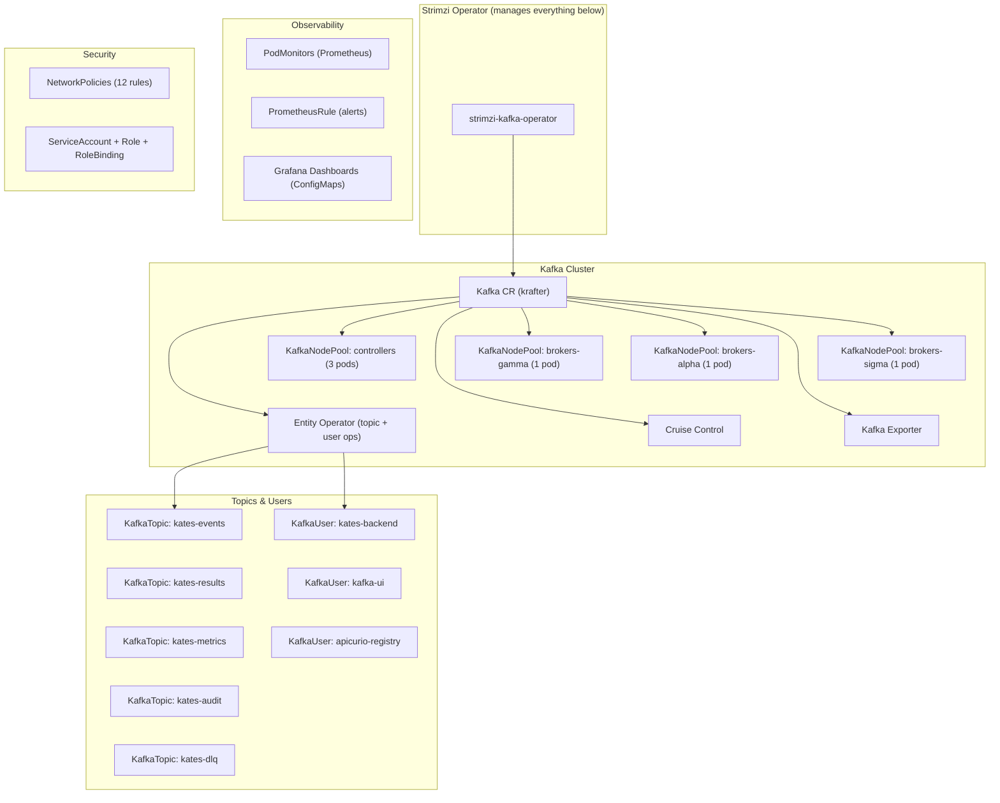
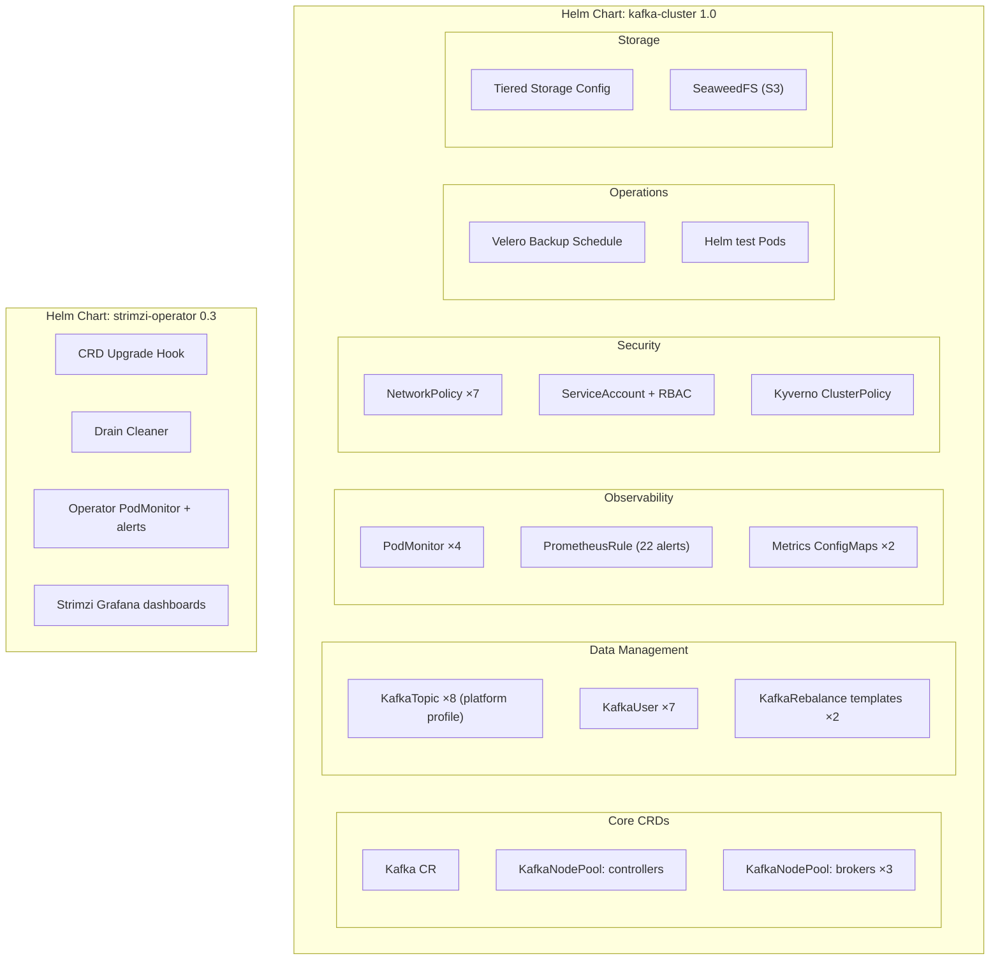
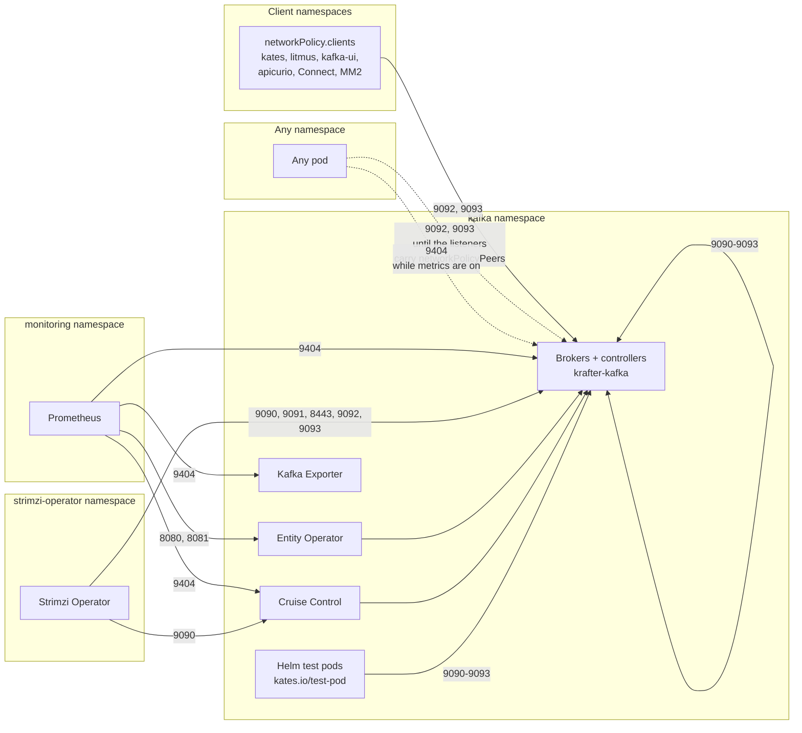
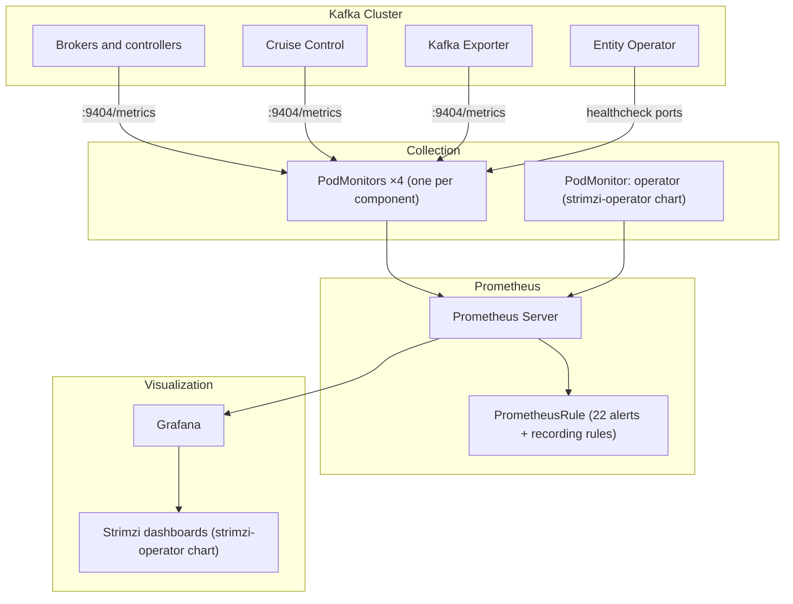
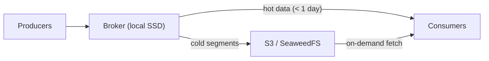

# Installing Kafka with the kafka-cluster Helm Chart

> **Scope**: this chapter owns the happy-path install — deploying and verifying a Kafka cluster with the `kafka-cluster` chart, step by step. The engineering rationale behind the topology (node pools, certificates, Cruise Control, alerting, backup) lives in [Kafka Deployment Engineering](15-kafka-deployment.md), and deploying the Kates stack itself is covered in [Deployment Guide](12-deployment.md).

This chapter walks you through deploying a production-grade Apache Kafka cluster on Kubernetes using the **kafka-cluster** Helm chart. It is written for someone who may be new to Kafka, Kubernetes, or Helm — every step is explained with the *why* before the *how*.

By the end of this chapter you will have:

- A 3-broker, 3-controller KRaft Kafka cluster
- SCRAM-SHA-512 authentication and simple ACL authorization
- Prometheus metrics, Grafana dashboards, and alerting rules
- Managed topics and users, all declared as code

After this chapter, you can:

- Deploy the cluster with `kates deploy` or direct Helm commands, layering the right environment overlay
- Verify health from the `Kafka` CR, node pools, topics, and user Secrets
- Connect clients from inside the cluster and through the external listener
- Customize topics, users, listeners, and broker pools in `values.yaml`

---

## 1. Prerequisites

Before you begin, make sure you have the following tools and infrastructure ready.

### 1.1 Tools

| Tool | Minimum Version | Why You Need It |
|------|:---------------:|--------------------|
| **kubectl** | 1.33+ | Communicates with your Kubernetes cluster. Every command in this guide uses `kubectl` to inspect or modify cluster state. Stay within one minor of your cluster: the local topology runs Kubernetes 1.34. |
| **Helm** | 3.14+ | The Kubernetes package manager. The kafka-cluster chart is a Helm chart — Helm renders YAML templates from `values.yaml` and applies them to your cluster. |
| **Docker** | 24+ | Required only if using a local Kind/k3d cluster. Docker runs the Kubernetes nodes as containers on your machine. |
| **Kind** *(optional)* | 0.33+ | A lightweight tool to run Kubernetes *in Docker*. Perfect for local development. Not needed if deploying to EKS, GKE, AKS, or an existing cluster. Older kind releases do not publish the node image `config/cluster.yaml` asks for. |

**Install check — run all four:**

```bash
kubectl version --client -o yaml | grep gitVersion
helm version --short
docker version --format '{{.Server.Version}}'
kind version  # only if using Kind
```

If any command fails, install the missing tool before continuing.

### 1.2 Kubernetes Cluster

You need a running Kubernetes cluster with:

| Requirement | Minimum | Recommended | Why |
|-------------|:-------:|:-----------:|-----|
| **Nodes** | 1 | 3+ (one per zone) | Kafka spreads brokers across failure domains. With 3 nodes, each broker runs on a different node, so a single node failure only loses 1 broker. |
| **CPU** | 6 cores total | 12+ cores | The 3 brokers need 1 CPU each, 3 controllers need 0.5 CPU each, plus operator, exporter, and Cruise Control. |
| **Memory** | 16 GB total | 24+ GB | Brokers need 4 GB each for heap + page cache. Controllers need 1 GB. |
| **Storage** | 150 GB | 300+ GB | Each broker stores 50 GB of log data by default. Use SSDs if possible — Kafka is I/O-heavy. |
| **StorageClass** | 1 | 1 per zone | PersistentVolumeClaims (PVCs) need a StorageClass to provision disks. For zone-aware deployments, each zone gets its own class. |

::: {.callout-important}
If you are using a **managed Kubernetes service** (EKS, GKE, AKS), the StorageClasses are usually pre-configured (e.g., `gp3` on AWS, `standard-rw` on GKE). For local Kind clusters, you must create them manually — see section 3.1.
:::

### 1.3 Namespaces

The chart deploys everything into a single namespace (default: `kafka`). Create it before installing:

```bash
kubectl create namespace kafka --dry-run=client -o yaml | kubectl apply -f -
```

Why `--dry-run=client | apply`? This is an idempotent pattern — it creates the namespace if it doesn't exist and does nothing if it already does. Safe to run multiple times.

### 1.4 Monitoring Stack (Optional but Recommended)

If you want metrics, dashboards, and alerts, install the local monitoring wrapper chart first. It is `kates-monitoring` (versions in the [Version & Compatibility Matrix](appendix-d-versions.md)), and it wraps kube-prometheus-stack with the Kates dashboards and scrape configuration:

```bash
helm repo add prometheus-community https://prometheus-community.github.io/helm-charts
helm dependency build charts/monitoring
helm upgrade --install monitoring charts/monitoring \
  -f charts/monitoring/values-generic.yaml \
  --namespace monitoring --create-namespace
```

The kafka-cluster chart then creates the `PodMonitor` and `PrometheusRule` resources the Prometheus operator discovers.

::: {.callout-important}
**Whatever namespace you choose, tell kafka-cluster about it.** The chart's NetworkPolicies admit Prometheus from `networkPolicy.monitoring.namespace`, which defaults to `monitoring` — so the command above works out of the box. The repository's own path does not use it: `make monitoring` and `scripts/deploy-monitoring.sh` install the release into `kafka`, alongside the brokers, and [Observability & Monitoring](09-observability.md) documents that form. If you follow them, add `--set networkPolicy.monitoring.namespace=kafka` to the kafka-cluster install. Otherwise, wherever the chart's policies render (not under `values-dev.yaml` or `values-kind.yaml`, which is why the mismatch is invisible locally), the Kafka Exporter and Entity Operator scrapes are dropped: those pods sit under the chart's deny-all, and only the chart's policies admit Prometheus to them. The brokers' metrics port stays open to every pod through the policy Strimzi generates (section 11.1).
:::

**Nothing to decide about boards.** Chart 1.3.0 deleted the nine hand-written Kafka and Strimzi boards, along with the `legacyKafkaDashboards.enabled` key that used to gate them; setting that key now does nothing and the chart's NOTES say so on upgrade. They read series names that kafka-cluster 1.0's exporter rules (Strimzi's own) do not produce, so they rendered empty panels.

What `charts/monitoring` ships instead is two Kafka boards — **Kafka — KRaft Operations** and **Kafka — Performance & Load Testing** — plus four Kates boards, all generated from `dashboards/` and all checked against the exporter rules on every build. Broker health, quorum identity, Cruise Control and consumer lag come from the Strimzi operator's own dashboards (`charts/strimzi-operator`, section 3.2), and connect-cluster, mirror-maker2 and kates each ship the board for the workload they own. [Observability & Monitoring](09-observability.md) is the tour.

### 1.5 Kyverno (Optional)

If you want admission-control policy enforcement — Pod Security Standards (PSS), automatic NetworkPolicy generation, and optional container image signature verification — install [Kyverno](https://kyverno.io/) before deploying the kafka-cluster chart:

```bash
helm repo add kyverno https://kyverno.github.io/kyverno/
helm repo update
helm install kyverno kyverno/kyverno -n kyverno --create-namespace
```

**Verify Kyverno is running:**

```bash
kubectl get pods -n kyverno
```

You should see the Kyverno admission controller, background controller, cleanup controller, and reports controller pods in `Running` state.

**How Kyverno integrates with Kates:**

When `kyvernoPolicy.enabled=true` is set in the kafka-cluster Helm chart values, the chart deploys a `kafka-pod-security-<namespace>-<cluster>` `ClusterPolicy`, which mutates and validates workloads to enforce restricted Pod Security Standards — non-root, drop ALL capabilities, seccomp `RuntimeDefault`, no privilege escalation, no host namespaces.

The Kates backend chart (`charts/kates`) ships additional `ClusterPolicy` resources, enabled via its own `kyvernoPolicy.*` values:

| Policy | What It Does |
|--------|-------------|
| `kates-pod-security-standards` | Mutates and validates workloads to enforce restricted PSS — non-root, drop ALL capabilities, seccomp, read-only rootfs |
| `kates-workload-standards` | Requires standard labels, health probes, and pinned image tags |
| `kates-image-verification` | Verifies Cosign container image signatures from trusted registries |
| `kates-generate-network-policies` | Automatically generates default-deny NetworkPolicies in new namespaces |

::: {.callout-tip}
Start with `kyvernoPolicy.action: Audit` (the default) to observe policy violations without blocking deployments. Switch to `Enforce` once you're confident all workloads comply. See [Security & Compliance](17-security.md) for details on each policy.
:::

### 1.6 Production Prerequisites

`values-prod.yaml`, the overlay of the production install in sections 3.5 and 6.3, asks for more than the Strimzi operator. Put these in place first — without them the install fails, or succeeds with backups that never run:

| Prerequisite | What asks for it | Without it |
|---|---|---|
| Velero with its CRDs, running in the `velero` namespace | `backup.enabled` renders a `velero.io/v1` `Schedule` in `backup.veleroNamespace` (`velero`), and a pre-upgrade `Backup` hook | `helm upgrade --install` fails with `no matches for kind "Schedule" in version "velero.io/v1"` — the chart does not check for the API first |
| A `BackupStorageLocation` named `seaweedfs` in `velero`, whose bucket exists and whose credentials the store accepts | `backup.storageLocation: seaweedfs` | the install succeeds and every backup ends `FailedValidation` |
| Velero's node agent | `backup.volumes: fs-backup` | the backups keep the objects but not the broker and controller volume data |
| A Secret `kafka-seaweedfs-credentials` in `kafka`, with keys `AWS_ACCESS_KEY_ID` and `AWS_SECRET_ACCESS_KEY` | `seaweedfs.s3.existingSecret`, so the chart renders no credentials Secret of its own | nothing reads it while tiered storage is off; with tiered storage on, the brokers cannot start |
| amd64 nodes, or the subchart's pin to them cleared | the SeaweedFS subchart, which gives its master, volume and filer pods `nodeSelector: kubernetes.io/arch: amd64` | on a cluster with no amd64 nodes the SeaweedFS pods stay `Pending` and the `--wait` of section 3.5 times out. The SeaweedFS image is multi-arch, so setting `seaweedfs.master.nodeSelector`, `seaweedfs.volume.nodeSelector` and `seaweedfs.filer.nodeSelector` to `""` lets them run on arm64 too |
| Kyverno (section 1.5) | `kyvernoPolicy.enabled` with `action: Enforce` | no error: the chart renders its `ClusterPolicy` only where the `kyverno.io/v1` API exists, and the release notes report it `not rendered`. With Kyverno present, read the warning below first |
| The Prometheus operator's CRDs (section 1.4) | the PodMonitors and the `PrometheusRule` | the same: both are skipped, and the release notes say so |
| cert-manager | the strimzi-operator chart's `values-prod.yaml` (section 3.2), whose drain cleaner takes its certificate from cert-manager — kafka-cluster itself does not use it | that operator install fails on the kinds `Issuer` and `Certificate`; `make cert-manager` installs it |

Nothing in the repository creates the storage location for you, and `make velero` does not match what the overlay expects: it installs Velero into the `kafka` namespace, with a MinIO-backed location called `default` and no node agent. The SeaweedFS the overlay deploys creates no bucket, keeps its data in `hostPath` directories on whichever nodes its pods land on, and, with authentication on, does not accept the keys in `kafka-seaweedfs-credentials` — section 13.4 explains all three before you point a storage location at it.

`helm dependency build` downloads the SeaweedFS subchart, so the machine that installs needs the `helm repo add seaweedfs` of section 3.3 and a route to `https://seaweedfs.github.io/seaweedfs/helm`.

::: {.callout-warning}
With Kyverno installed, the `Enforce` policy of `values-prod.yaml` — and of `values-staging.yaml` — refuses pods that the same release depends on. Its checks are patterns on the Pod spec, and only pods labelled `strimzi.io/kind` are exempt from some of them:

- The SeaweedFS pods `values-prod.yaml` enables — master, volume and filer, and the bucket hook of section 13.4 — set no security context at all, so they fail the non-root, capabilities, seccomp and privilege-escalation checks. Their StatefulSets never get a pod, and the `--wait` of section 3.5 times out.
- `require-seccomp` exempts no pod and wants a pod-level `seccompProfile`. Of the Strimzi pods, the chart gives one to the node pools only, so the Entity Operator, Cruise Control and Kafka Exporter pods are refused — and without the Entity Operator no topic or user is ever created.
- Two `helm test` pods, `krafter-test-produce-consume` and `krafter-test-performance`, drop no capabilities and fail `restrict-capabilities`.

Until the chart's own workloads satisfy the policy, layer a file with `kyvernoPolicy.action: Audit` after the overlay, and read `kubectl get policyreport -n kafka` for what `Enforce` would refuse.
:::

---

## 2. Understanding the Chart

Before running `helm install`, it helps to understand what the chart creates.

### 2.1 What Gets Deployed

When you install the kafka-cluster chart, Helm creates these Kubernetes resources:


```mermaid
graph TD
    subgraph "Strimzi Operator (manages everything below)"
        OP["strimzi-kafka-operator"]
    end

    subgraph "Kafka Cluster"
        KC["Kafka CR (krafter)"]
        CP["KafkaNodePool: controllers (3 pods)"]
        BP1["KafkaNodePool: brokers-alpha (1 pod)"]
        BP2["KafkaNodePool: brokers-sigma (1 pod)"]
        BP3["KafkaNodePool: brokers-gamma (1 pod)"]
        EO["Entity Operator (topic + user ops)"]
        CC["Cruise Control"]
        KE["Kafka Exporter"]
    end

    subgraph "Topics & Users"
        T1["KafkaTopic: kates-events"]
        T2["KafkaTopic: kates-results"]
        T3["KafkaTopic: kates-metrics"]
        T4["KafkaTopic: kates-audit"]
        T5["KafkaTopic: kates-dlq"]
        U1["KafkaUser: kates-backend"]
        U2["KafkaUser: kafka-ui"]
        U3["KafkaUser: apicurio-registry"]
    end

    subgraph "Observability"
        PM["PodMonitors (Prometheus)"]
        AR["PrometheusRule (alerts)"]
        GD["Grafana Dashboards (ConfigMaps)"]
    end

    subgraph "Security"
        NP["NetworkPolicies (12 rules)"]
        RBAC["ServiceAccount + Role + RoleBinding"]
    end

    OP --> KC
    KC --> CP
    KC --> BP1
    KC --> BP2
    KC --> BP3
    KC --> EO
    KC --> CC
    KC --> KE
    EO --> T1
    EO --> U1

    CP ~~~ EO
    BP1 ~~~ CC
    BP2 ~~~ KE
    T1 ~~~ T2 ~~~ T3 ~~~ T4 ~~~ T5
    U1 ~~~ U2 ~~~ U3
```

### 2.2 How Strimzi Works

The chart doesn't create Kafka pods directly. Instead, it creates **Custom Resources** (CRs) — YAML objects that describe your *desired state*. The **Strimzi Operator** watches these CRs and does the heavy lifting:

1. You apply a `Kafka` CR that says "I want 3 brokers with TLS"
2. The Strimzi Operator sees the CR and creates pods, configmaps, secrets, services
3. If you change the CR (e.g., increase replicas), the operator detects the change and performs a rolling update

This means **you never edit pods directly** — you always edit the Helm values, run `helm upgrade`, and the operator reconciles.

### 2.3 KRaft Mode (No ZooKeeper)

This chart deploys Kafka in **KRaft mode** — the modern architecture where Kafka manages its own metadata using a built-in Raft consensus protocol. There is no ZooKeeper dependency.

Why this matters to you:
- **Fewer moving parts**: No separate ZooKeeper ensemble to manage
- **Faster failover**: Controller election happens in seconds, not minutes
- **Simpler operations**: One fewer StatefulSet, one fewer monitoring target

---

## 3. Installation

### 3.0 Choosing the operator scope and versions

The CLI decides three things before it installs anything, and each has a flag:

| Choice | Flag | Default | Where the answer comes from |
|:---|:---|:---|:---|
| Operator scope | `--operator-scope cluster\|namespace` | `cluster` — one Strimzi operator watching every namespace | `kates operators list` shows what is installed |
| Operator version | `--strimzi-version` | the repository pin (`charts/strimzi-operator` `appVersion`); `latest` for the newest published | `kates versions strimzi` — the Strimzi Helm index |
| Kafka version | `--kafka-version` | the newest the selected operator supports | `kates versions kafka --strimzi-version …` — read from that operator's chart |

Under cluster scope, only the Kafka versions in the one operator's window can run under Strimzi; asking for another is refused with the window and the ways out (the `legacy-kafka` provider through `kates migrate`, or namespace scope). Under namespace scope, the primary's operator watches only the primary's namespaces, and an older Kafka line can later run beside it under an operator of its own. `kates deploy --dry-run` prints the whole resolution — operator, window, Kafka version, metadata version, what the installed operator allows — and installs nothing. The Kafka and metadata versions apply when the Kafka release is first installed: a later run skips a release that is already deployed, and section 14.2 upgrades it.

```bash
kates versions                                            # what this cluster can run today
kates deploy --strimzi-version 1.0.1 --kafka-version 4.2.0
kates deploy --operator-scope namespace
```

### 3.1 Step 1 — Storage Classes (Local/Kind Only)

If you're deploying to Kind or a local cluster without dynamic provisioning, create a StorageClass. Cloud clusters (EKS/GKE/AKS) can skip this step.

```bash
for ZONE in alpha sigma gamma; do
  kubectl apply -f - <<EOF
apiVersion: storage.k8s.io/v1
kind: StorageClass
metadata:
  name: local-storage-${ZONE}
provisioner: rancher.io/local-path
reclaimPolicy: Retain
volumeBindingMode: WaitForFirstConsumer
EOF
done
```

**What this does:** Creates three StorageClasses, one per availability zone. The `WaitForFirstConsumer` binding mode ensures PVCs are bound only after a pod is scheduled, respecting node affinity.

### 3.2 Step 2 — Install the Strimzi Operator

The kafka-cluster chart creates Strimzi custom resources, but it does **not** bundle the Strimzi operator — the operator must already be running in the cluster. If you deploy with `kates deploy` (section 3.5), the CLI installs the operator for you. To install it manually, use the repository's wrapper chart, `charts/strimzi-operator` (its chart and Strimzi versions are in the [Version & Compatibility Matrix](appendix-d-versions.md)):

```bash
helm dependency build charts/strimzi-operator
helm upgrade --install strimzi-operator charts/strimzi-operator \
  --namespace strimzi-operator --create-namespace \
  --reset-values \
  --timeout 10m --wait
kubectl wait --for=condition=Established crd kafkas.kafka.strimzi.io --timeout=60s
```

That is what `scripts/deploy-kafka.sh` runs (it creates the namespace with `kubectl` beforehand rather than with `--create-namespace`, which is the only difference). `scripts/deploy-kafka-generic.sh` runs the same thing and adds `--set strimzi-kafka-operator.kubernetesServiceDnsDomain="${CLUSTER_DOMAIN}"` from its own detection, because the upstream chart emits `KUBERNETES_SERVICE_DNS_DOMAIN` only when the domain differs from `cluster.local` — omit it on a cluster with a custom domain and the operator silently fails to resolve its operands.

**Why a wrapper and not the `oci://` chart directly.** The upstream chart is still in there, declared as a subchart and vendored as `charts/strimzi-operator/charts/strimzi-kafka-operator-1.2.0.tgz`. What the wrapper adds is everything the upstream chart leaves to the caller:

| The wrapper adds | Why it matters |
|---|---|
| A CRD-upgrade hook (`crdUpgrade`) that owns the Strimzi CRDs | Upstream ships its CRDs in `crds/`, so Helm creates them on install and **never** touches them on upgrade. Without the hook your CRDs freeze at whatever version installed them first. The hook runs pre-install and pre-upgrade, so the CRDs are current before the operator Deployment is patched |
| Pinned kates defaults | `watchAnyNamespace`, the operator's replicas, resources and reconciliation timeouts used to live in `--set` flags that drifted across three call sites. They are values now |
| A strict values schema | Every operator setting must be nested under the `strimzi-kafka-operator:` key. A top-level `watchAnyNamespace: true` is ignored by Helm; the schema rejects it loudly instead |
| The optional Strimzi Drain Cleaner (`drainCleaner.*`) | One webhook per Kubernetes cluster, so it belongs to the operator release rather than to each Kafka cluster |
| The operator's PodMonitor, alerts and Grafana dashboards | `StrimziOperatorDown`, `StrimziReconciliationsFailing` and the certificate-expiry alerts can only be raised where the operator runs |
| A kates-owned operator NetworkPolicy (`operatorPolicy`, on by default) | One policy per operator, with egress to every namespace it watches |

::: {.callout-important}
`--reset-values` is needed exactly once, when migrating a release that was installed straight from the `oci://` chart. That release stored flat upstream keys (`watchAnyNamespace`, `replicas`, …) which now live under the subchart key; a bare `helm upgrade` reuses them and the strict schema rejects them. Leaving it in is harmless — the chart's own defaults supply the watch scope.
:::

**The overlay chain.** The base values render the primary, cluster-wide operator. Layer at most one environment overlay on top:

```bash
helm dependency build charts/strimzi-operator
helm upgrade --install strimzi-operator charts/strimzi-operator \
  --namespace strimzi-operator --create-namespace \
  --reset-values \
  -f charts/strimzi-operator/values-prod.yaml \
  --timeout 10m --wait
```

| Overlay | What it is for |
|---|---|
| `values-dev.yaml` | `DEBUG` reconciliation logs, a smaller memory request |
| `values-kind.yaml` | 384Mi limits and requests for a laptop-sized node |
| `values-generic.yaml` | EKS/GKE/AKS and on-prem; documents the DNS-domain and registry-redirection rules the caller has to get right |
| `values-prod.yaml` | An uplift, not the status quo: `productionMode`, the drain cleaner on two replicas with cert-manager, a PodDisruptionBudget, upstream's operator NetworkPolicy, a tighter reconciliation loop, and a read-only root filesystem |
| `values-namespace-scope.yaml` | An *additional*, co-located operator watching one namespace. It turns the CRD hook off, because the CRDs belong to the newest operator on the cluster |

Installing, adopting an existing `oci://` release, upgrading and rolling back the operator are covered end to end in [Deploying the Strimzi Operator](deploying-strimzi-operator.md), including the two operations that would delete every Kafka custom resource on the cluster.

### 3.3 Step 3 — Build the Chart Dependencies

kafka-cluster 1.0 has two Helm dependencies, and Helm refuses to render the chart until both archives sit in `charts/` — even the conditional one:

| Dependency | Repository | Condition |
|---|---|---|
| `kafka-common` 0.1.0 | `file://../kafka-common` | always — it is the library chart holding the shared names, rails, Kafka client authentication, `KafkaUser`, NetworkPolicy and monitoring fragments |
| `seaweedfs` 3.68.0 | `https://seaweedfs.github.io/seaweedfs/helm` | `seaweedfs.enabled` |

So every install, upgrade or `helm template` of this chart is preceded by `helm dependency build`. Both deploy scripts run it unconditionally rather than testing for it — it is idempotent and cheap, and an empty or stale `charts/` directory fails the render outright. Add the SeaweedFS repository once per machine first:

```bash
helm repo add seaweedfs https://seaweedfs.github.io/seaweedfs/helm
helm dependency build charts/kafka-cluster
```

The `helm repo add` matters from the second build on. The first `build` finds no `Chart.lock`, falls back to `update` and fetches the chart straight from its URL; once the lock exists, `build` accepts only a repository Helm has configured and stops with `no repository definition for https://seaweedfs.github.io/seaweedfs/helm`.

::: {.callout-note}
`build` resolves from `Chart.lock`, which is what keeps the pinned SeaweedFS version from drifting. If you are coming from a kafka-cluster 0.4 checkout, that lock file predates the `kafka-common` dependency and `build` refuses it — run `helm dependency update charts/kafka-cluster` once to regenerate the lock, then go back to `build`. Both deploy scripts do exactly this: `helm dependency build … || helm dependency update …`.
:::

connect-cluster and mirror-maker2 depend on the same library chart, so each needs its own `helm dependency build` too — section 3.7 does it for Connect.

### 3.4 Step 4 — Review and Customize Values

The chart ships with sensible defaults in `values.yaml`, but you should review key settings before installing.

**Cluster identity:**

```yaml
clusterName: krafter        # Kafka CR name, strimzi.io/cluster label, prefix of every resource
kafkaVersion: "4.3.1"       # Apache Kafka version the brokers and controllers run
strimziVersion: "1.2.0"     # the Strimzi line this chart is aligned with
```

Three things about those keys are easy to get wrong:

- `clusterName` is the identity of every namespaced resource the chart creates, which is what lets two Kafka clusters share a namespace. Changing it does not rename a running cluster — it creates a second one.
- `kafkaVersion` defaults to the newest version in the vendored operator's window, and it must stay at or above the chart's `kates.io/kafka-floor` annotation (`4.2.0`, because the default `kafka.config` turns on share groups). `scripts/check-versions.sh` asserts both.
- `strimziVersion` does **not** install or select an operator. It is the Strimzi line the chart is aligned with, used for the Helm-test client image tag and by `scripts/check-versions.sh`. The operator version is the `strimzi-operator` chart's `appVersion` (section 3.2), and the authoritative table for both is the [Version & Compatibility Matrix](appendix-d-versions.md).

**Node pools — one per availability zone:**

The shipped `values.yaml` renders one controller pool and one broker pool of three each, spread across zones and hosts. `kates detect --generate-values` writes zone-pinned pools for your cluster; to define them yourself:

```yaml
nodePools:
  pools:
    - name: controllers
      roles: [controller]
    - name: brokers-alpha
      roles: [broker]
      zone: alpha              # Node label: topology.kubernetes.io/zone=alpha
      replicas: 1
      storage:
        volumes: [{ id: 0, size: 50Gi, class: local-storage-alpha }]
    - name: brokers-sigma
      roles: [broker]
      zone: sigma
      replicas: 1
      storage:
        volumes: [{ id: 0, size: 50Gi, class: local-storage-sigma }]
    - name: brokers-gamma
      roles: [broker]
      zone: gamma
      replicas: 1
      storage:
        volumes: [{ id: 0, size: 50Gi, class: local-storage-gamma }]
```

**Why one broker per pool?** Each pool is pinned to a zone via `nodeAffinity`. This guarantees that when a zone goes down, only one broker is lost — the cluster continues to serve reads and writes because `min.insync.replicas: 2` is satisfied by the remaining two brokers.

**For a single-node test cluster**, `values-dev.yaml` runs one controller and one broker with replication factor 1. A pool's name is its identity: renaming it replaces the pool and its brokers.

**The platform's topics and users** are the chart's `platform` profile (`profiles/platform.yaml`): the kates topics, users, super user and client NetworkPolicy grants. `values-platform.yaml` selects it, and it belongs on every install and upgrade of the cluster that hosts kates — `kates deploy` and both deploy scripts add it. A cluster that does not host kates omits it and gets a generic Kafka cluster.

::: {.callout-important}
`values-platform.yaml` is a **profile**, not an environment overlay, and the two occupy different positions in the `-f` chain: the profile first, the environment overlay second. Helm merges later `-f` files over earlier ones, so that order is what lets `values-prod.yaml` (or a file of your own) change anything the profile brought — a topic's partition count, a user's quota — instead of the profile silently winning.
:::

### 3.5 Step 5 — Install the Chart

**Preferred — Install via the Kates CLI:**

The `kates deploy` command handles Strimzi operator installation, values file detection, environment overlay selection, and readiness waiting automatically:

```bash
# Detect your cluster topology and deploy
kates deploy --topology isolated

# High availability (multi-AZ) is enabled by default; disable it for small clusters
kates deploy --topology isolated --ha=false

# Deploy Kafka + Kafka Connect in one shot
kates deploy --topology isolated --with-kafka-connect
```

The CLI automatically:
- Detects your cluster zones (via `kates detect`)
- Selects the Kind overlay when running on Kind clusters
- Installs the Strimzi operator with readiness wait
- Provisions Kafka users and topics after the cluster is Ready
- Shows a Bubble Tea progress UI with per-component status

::: {.callout-tip}
Use `kates deploy` for interactive development. Use direct Helm commands (below) in CI pipelines where you need fine-grained control.
:::

**Alternative — Direct Helm installation:**

With the Strimzi operator already installed (section 3.2) and the production prerequisites in place (section 1.6), build the dependencies and install the chart with the full values chain — the platform profile first, one environment overlay second:

```bash
helm dependency build charts/kafka-cluster
helm upgrade --install kafka-cluster charts/kafka-cluster \
  --namespace kafka --create-namespace \
  -f charts/kafka-cluster/values-platform.yaml \
  -f charts/kafka-cluster/values-prod.yaml \
  --timeout 600s \
  --wait
```

Three parts of that command earn their place:

- `helm dependency build` is not optional. The chart depends on the `kafka-common` library and will not render without it (section 3.3).
- `-f charts/kafka-cluster/values-platform.yaml` selects the platform profile. Drop it only for a Kafka cluster that does not host kates.
- The environment overlay comes **after** the profile. Swap `values-prod.yaml` for `values-staging.yaml`, `values-dev.yaml`, or `values-dev.yaml` followed by `values-kind.yaml` on Kind — which is the exact chain `ENV=kind scripts/deploy-kafka.sh` passes.

The `--wait` flag tells Helm to block until all deployments are ready. Note that Helm returning is not the same as Kafka being ready: the operator still has to form the KRaft quorum, which is what section 4.1 checks.

The Strimzi CRDs are the `strimzi-operator` chart's (its `crdUpgrade` hook); kafka-cluster 1.0 no longer applies them.

### 3.6 Step 6 — Watch the Deployment

After `helm install` or `helm upgrade` starts, open a second terminal and watch the pods come up:

```bash
kubectl get pods -n kafka -w
```

If you deployed with `kates deploy`, the CLI already shows per-component deployment progress in its own UI.

You should see pods appear in this order:

| Order | Pod | What It Does |
|:-----:|-----|-------------|
| 1 | `strimzi-cluster-operator-*` | The Strimzi operator — must be running before anything else |
| 2 | `krafter-controllers-3/4/5` | KRaft controller quorum — elected leader manages metadata |
| 3 | `krafter-brokers-alpha-0` | First broker — starts accepting connections |
| 4 | `krafter-brokers-sigma-2` | Second broker |
| 5 | `krafter-brokers-gamma-1` | Third broker |
| 6 | `krafter-entity-operator-*` | Topic Operator + User Operator in one pod |
| 7 | `krafter-cruise-control-*` | Partition rebalancer |
| 8 | `krafter-kafka-exporter-*` | Prometheus metrics exporter |

::: {.callout-note}
The initial deployment takes **3–8 minutes**. The operator generates TLS certificates, configures the KRaft quorum, and waits for each broker to join the cluster sequentially. This is normal.
:::

### 3.7 Step 7 — Install Kafka Connect (Optional)

Kafka Connect is a separate Helm release from a separate chart, `charts/connect-cluster` (versions in the [Version & Compatibility Matrix](appendix-d-versions.md)). Keeping it separate is deliberate: Connect upgrades never roll the brokers, and several Connect groups can share one Kafka cluster. It needs the same Strimzi operator (section 3.2) and a Kafka cluster that is already `Ready` (section 4.1).

Build its dependency — connect-cluster 2.0 is built on the same `kafka-common` library chart as kafka-cluster — then install it with one environment overlay. There is no profile layer here; that concept belongs to kafka-cluster:

```bash
helm dependency build charts/connect-cluster
helm upgrade --install connect-cluster charts/connect-cluster \
  --namespace connect --create-namespace \
  -f charts/connect-cluster/values-prod.yaml \
  --timeout 600s
kubectl wait kafkaconnect/connect-cluster -n connect --for=condition=Ready --timeout=300s
helm test connect-cluster -n connect
```

| Overlay | What it is for |
|---|---|
| `values-dev.yaml` | one small worker, replication factor 1, no zone spreading |
| `values-kind.yaml` | `kates deploy` on Kind: monitoring off, the platform's database and Schema Registry |
| `values-generic.yaml` | `kates deploy` on every other cluster |
| `values-prod.yaml` | `productionMode`, the TLS listener with a chart-managed certificate user, zone spreading, a PriorityClass, the SLO alert |

::: {.callout-important}
`kafka.namespace` defaults to **this release's own namespace**, not `kafka`. A Connect release outside the Kafka namespace has to name it — `--set kafka.namespace=kafka`, which is what `values-prod.yaml` already does. (mirror-maker2 has no `kafka` block at all — its equivalent is `target.namespace`, which defaults to `kafka`; the two charts differ here on purpose.)
:::

**What the release creates.** Beyond the `KafkaConnect` CR itself:

| Resource | Rendered when |
|---|---|
| `KafkaConnect` | always — the worker group the operator reconciles into pods |
| `KafkaConnector` per entry | `connectors` is non-empty |
| `KafkaTopic` per dead letter queue | a connector sets `deadLetterQueue.enabled` with `createTopic` |
| `KafkaUser` (in the Kafka namespace) plus a secret-sync `Job`, and a `CronJob` under `secretSync.watch` | `kafkaUser.create: true` |
| `NetworkPolicy` — a default-deny for the workers, one policy carrying every explicit allow, one for the Helm-test pods, and one *ingress* policy in each database's own namespace for each entry in `networkPolicy.egress.databases` | `networkPolicy.enabled` (the default) |
| `PodMonitor` and `PrometheusRule` | `monitoring.podMonitor.enabled` / `alerts.enabled`, **and** the `monitoring.coreos.com/v1` API exists on the cluster |
| A pre-flight `Job` | `preflight.enabled` — a pre-install/upgrade check that dials Kafka with the workers' own client and reports `PROTOCOL`, `DNS`, `TLS`, `AUTH`, `LISTENER` or `NETWORK` before the `KafkaConnect` exists |
| `Role` / `RoleBinding` scoped to the referenced Secrets, `ServiceAccount`, REST-API `Service` | always |

**The 2.0 values names.** Chart 2.0 renamed most of the surface. The 1.x keys still render with a `DEPRECATED` line in the release notes, but write new values against these:

```yaml
kafka:
  clusterName: krafter           # the Strimzi Kafka cluster
  namespace: kafka               # defaults to THIS release's namespace
  bootstrapServers: ""           # wins over the computed address
  brokerCount: 9                 # when known: refuses a higher replication factor
  tls:
    enabled: true
  authentication:
    type: tls                    # or scram-sha-512 | scram-sha-256 | plain | custom | ""

exactlyOnce:
  enabled: true                  # replaces exactly.once.source.support in extraConfig

internalTopics:
  prefix: ""                     # empty = groupId; names the offsets/configs/status topics

connectors:                      # a MAP keyed by name in 2.0, not a list
  orders-cdc:
    class: io.debezium.connector.postgresql.PostgresConnector
    tasksMax: 1
    state: running
    config:
      database.hostname: postgresql.database.svc
      database.dbname: orders
      topic.prefix: cdc          # the chart refuses a Debezium source without these three
      database.password: "${secrets:database/pg-credentials:password}"

monitoring:
  podMonitor:
    enabled: true                # was podMonitors

networkPolicy:
  egress:
    databases:                   # was databaseEgress
      - namespace: database
        port: 5432
        podSelector:
          app.kubernetes.io/name: postgresql

alerts:
  thresholds:
    heapUsagePercent: 85
    sinkLagRecords: 100000

autoscaling:
  enabled: false                 # capped at the declared connectors' total tasksMax

preflight:
  enabled: true                  # default false
```

Connector configs are validated at render time — the name, the class, the state, `tasksMax`, the required keys of known connector classes, `topics` on every sink, and a namespace in every `${secrets:…}` reference — so a typo fails `helm upgrade` instead of leaving a connector FAILED in the cluster. Secret access follows those `${secrets:…}` references: the chart grants `get` on exactly the Secrets the connectors name, and nothing else.

**The test suite.** `helm test connect-cluster -n connect` runs in three stages: the Connect tier (credentials Secret, the CR's `Ready` condition, the workers, the REST API called from inside a worker, the expected plugins, and each declared connector's state and tasks), then the `testTopics` and `testConnectors`, then a check that every test connector reaches RUNNING with all its tasks running. The test connectors expect the platform's demo PostgreSQL, which is why `values-prod.yaml` turns them off.

Upgrading a release from chart 1.x is a key-by-key job; the map is in [the 2.0 upgrade guide](../connect-cluster-2.0-upgrade.md). Every alert the chart raises carries a `runbook_url` into [the Connect runbook](../connect-cluster-runbook.md), which says how to confirm and act on each one. For the pipeline design behind all of this, see [Kafka Connect & CDC Pipelines](21-kafka-connect.md), and for day-2 operations, [Operating Kafka Connect](operating-kafka-connect.md).

---

## 4. Verification

Once all pods show `Running` and `1/1 Ready`, verify the cluster health.

### 4.1 Check Kafka CR Status

```bash
kubectl get kafka krafter -n kafka -o jsonpath='{.status.conditions[?(@.type=="Ready")]}'
```

Expected output:

```json
{"lastTransitionTime":"...","status":"True","type":"Ready"}
```

If `status` is `True`, the cluster is fully operational.

### 4.2 Verify All Node Pools

```bash
kubectl get kafkanodepools -n kafka \
  -l strimzi.io/cluster=krafter \
  -o custom-columns='NAME:.metadata.name,REPLICAS:.spec.replicas,ROLES:.spec.roles[*],READY:.status.conditions[?(@.type=="Ready")].status'
```

Expected:

```text
NAME              REPLICAS   ROLES        READY
brokers-alpha     1          broker       True
brokers-gamma     1          broker       True
brokers-sigma     1          broker       True
controllers       3          controller   True
```

### 4.3 Verify Topics

```bash
kubectl get kafkatopics -n kafka \
  -l strimzi.io/cluster=krafter \
  -o custom-columns='TOPIC:.metadata.name,PARTITIONS:.spec.partitions,REPLICAS:.spec.replicas,READY:.status.conditions[?(@.type=="Ready")].status'
```

### 4.4 Verify Users and Secrets

```bash
kubectl get kafkausers -n kafka -l strimzi.io/cluster=krafter
kubectl get secrets -n kafka | grep -E 'kates-backend|kafka-ui|apicurio'
```

Each `KafkaUser` should have a corresponding Kubernetes Secret containing the auto-generated SCRAM password.

### 4.5 Run Helm Tests

The chart includes built-in tests that verify connectivity, authentication, and authorization:

```bash
kates test helm
```

Or use the direct Helm command (useful in CI pipelines):

```bash
helm test kafka-cluster -n kafka --timeout 5m
```

That is the timeout `scripts/deploy-kafka-generic.sh` uses. The suite runs a profiler and then eleven tiers in hook-weight order, from connectivity through to tiered storage. The first four are the ones that tell you whether the install worked at all:

- **Tier 0 (Cluster Setup Profiler):** prints the node pools, pod placement, PVCs and configured listeners — no assertions, just the context you want in the log when a later tier fails
- **Tier 1 (Connectivity):** Kafka CR `Ready`, every broker pod running, bootstrap DNS resolution, and a TCP probe of each listener in the CR status
- **Tier 2 (Produce/Consume Round-Trip):** discovers a listener, builds a client config (with a truststore for TLS), creates an ephemeral `KafkaTopic` and produces and consumes through it with SCRAM-SHA-512
- **Tier 3 (Authorization Verification):** every `KafkaUser` `Ready`, its SCRAM credential Secret present, and the authorization type reported

Section 13.10 has the full tier table. Raise the timeout to `--timeout 15m` when tiered storage is enabled: tier 11 waits for a local-retention sweep, which runs every `log.retention.check.interval.ms` — five minutes by default.

---

## 5. Connecting to Your Cluster

### 5.1 From Inside the Cluster

Pods inside the cluster connect through the internal bootstrap address. As the charts ship, every pod can reach it (section 11.1):

```text
krafter-kafka-bootstrap.kafka.svc:9092  (plain + SCRAM)
krafter-kafka-bootstrap.kafka.svc:9093  (TLS + mTLS)
```

Example — connect from a debug pod:

```bash
# Get the SCRAM password first (you'll paste it into the client config below):
kubectl get secret kates-backend -n kafka -o jsonpath='{.data.password}' | base64 -d

kubectl run kafka-debug -it --rm --image=quay.io/strimzi/kafka:latest-kafka-4.3.1 \
  -n kafka -- /bin/bash

# Inside the pod — create the client config with the SCRAM credentials:
cat > /tmp/client.properties <<'EOF'
security.protocol=SASL_PLAINTEXT
sasl.mechanism=SCRAM-SHA-512
sasl.jaas.config=org.apache.kafka.common.security.scram.ScramLoginModule required username="kates-backend" password="<password>";
EOF

bin/kafka-topics.sh --bootstrap-server krafter-kafka-bootstrap:9092 --list \
  --command-config /tmp/client.properties
```

### 5.2 From Outside the Cluster

External clients use the `external` listener on port 9094, where the values chain declares one. Two things declare it. The `kafka.externalAccess` preset is off in the base values and the dev, staging and Kind overlays, and `values-prod.yaml` turns it on as a TLS NodePort. `kates deploy` and `scripts/deploy-kafka-generic.sh` start their chain with the `.build/values-detected.yaml` they generate, which declares `external` on every cluster but kind: a NodePort, or a LoadBalancer on EKS, GKE and AKS, with the exposure section 9.3 describes. List the listeners a running cluster has:

```bash
kubectl get kafka krafter -n kafka -o jsonpath='{.spec.kafka.listeners[*].name}'
```

If `external` is among them, the cluster's status carries the address to bootstrap from — node addresses and the port Kubernetes assigned for a NodePort, the load balancer's address for a LoadBalancer:

```bash
# The external listener's bootstrap address
BOOTSTRAP=$(kubectl get kafka krafter -n kafka \
  -o jsonpath='{.status.listeners[?(@.name=="external")].bootstrapServers}')

# Extract the cluster CA certificate
kubectl get secret krafter-cluster-ca-cert -n kafka \
  -o jsonpath='{.data.ca\.crt}' | base64 -d > /tmp/ca.crt

# Get the SCRAM password
PASSWORD=$(kubectl get secret kates-backend -n kafka -o jsonpath='{.data.password}' | base64 -d)

# Connect with kafkacat/kcat
kcat -b ${BOOTSTRAP} -X security.protocol=SASL_SSL \
  -X sasl.mechanism=SCRAM-SHA-512 \
  -X sasl.username=kates-backend \
  -X sasl.password=${PASSWORD} \
  -X ssl.ca.location=/tmp/ca.crt \
  -L
```

---

## 6. Environment Overlays

The chart ships with pre-configured overlays for different environments. Use the `-f` flag to layer them on top of the base values, after the platform profile (section 3.4):

### 6.1 Development

```bash
helm dependency build charts/kafka-cluster
helm upgrade --install kafka-cluster charts/kafka-cluster \
  -f charts/kafka-cluster/values-platform.yaml \
  -f charts/kafka-cluster/values-dev.yaml \
  --namespace kafka
```

**What it changes:** One controller and one broker (`controllers-dev`, `brokers-dev`) at 512Mi and 1Gi of memory respectively, replication factor 1 throughout, no zone spreading or anti-affinity, and Cruise Control, the Kafka Exporter, network policies, alerts, PodMonitors, tiered storage and backup all off. There is no durability here — it is a laptop cluster.

On Kind, add `values-kind.yaml` after it, which is the chain `ENV=kind scripts/deploy-kafka.sh` passes:

```bash
helm upgrade --install kafka-cluster charts/kafka-cluster \
  -f charts/kafka-cluster/values-platform.yaml \
  -f charts/kafka-cluster/values-dev.yaml \
  -f charts/kafka-cluster/values-kind.yaml \
  --namespace kafka
```

### 6.2 Staging

The staging overlay turns the Velero backup on too, so it needs Velero with its CRDs and node agent in the `velero` namespace and a `BackupStorageLocation` named `default` there (the Velero rows of section 1.6), and its Kyverno policy is in `Enforce` (the warning in section 1.6).

```bash
helm dependency build charts/kafka-cluster
helm upgrade --install kafka-cluster charts/kafka-cluster \
  -f charts/kafka-cluster/values-platform.yaml \
  -f charts/kafka-cluster/values-staging.yaml \
  --namespace kafka
```

**What it changes:** Three controllers and three broker pools of one broker each (`kates detect` supplies the zone pins; the overlay itself only spreads by topology), 4Gi brokers on 100Gi volumes, network policies and alerts on, Kyverno in `Enforce`, and a daily Velero backup with a 7-day TTL to the storage location `default`. It also renders a 50Gi PVC, `krafter-backup-storage`, which nothing mounts: Velero writes to the storage location, not to it.

### 6.3 Production

The production overlay needs Velero, a storage location and the other prerequisites in section 1.6 before it installs.

```bash
helm dependency build charts/kafka-cluster
helm upgrade --install kafka-cluster charts/kafka-cluster \
  -f charts/kafka-cluster/values-platform.yaml \
  -f charts/kafka-cluster/values-prod.yaml \
  --namespace kafka
```

**What it changes:** `productionMode: true` (the rails refuse unsafe settings), three controllers and three broker pools of three brokers each — nine brokers at 8Gi on 200Gi volumes — a TLS NodePort external listener, Strimzi quotas that stop producers before a volume fills, network policies on, Kyverno in `Enforce`, SeaweedFS as the object store, and a daily Velero backup with a 14-day TTL. Tiered storage stays off until an image with a remote storage manager plugin exists, which is why the backup still covers broker volumes.

---

## 7. Common Customizations

### 7.1 Change the Cluster Name

```yaml
clusterName: my-kafka-cluster
```

This changes the name of the `Kafka` CR, all pod prefixes, and service names. Every resource becomes `my-kafka-cluster-kafka-bootstrap`, etc.

### 7.2 Add a New Topic

Topics live under `topics.items`, a map keyed by topic name:

```yaml
topics:
  items:
    my-new-topic:
      partitions: 12
      replicas: 3
      config:
        retention.ms: "604800000"   # 7 days
        min.insync.replicas: "2"
        cleanup.policy: delete
```

Because it is a map, your entries merge by name with the platform profile's topics and with those of any earlier values file, so you list only the topics you add or change. Save it in a file of your own — `my-values.yaml` in section 14.1 — and pass that file last in the upgrade; the Topic Operator then creates the topic. `kates deploy` takes no values file, so it cannot apply this change.

### 7.3 Add a New User with ACLs

Users live under `users.items`, keyed by the principal name:

```yaml
users:
  items:
    my-service:
      authentication:
        type: scram-sha-512
      quotas:
        producerByteRate: 10485760    # 10 MB/s
        consumerByteRate: 20971520    # 20 MB/s
      authorization:
        type: simple
        acls:
          - resource:
              type: topic
              name: "my-new-topic"
              patternType: literal
            operations: ["Read", "Write", "Describe"]
            host: "*"
          - resource:
              type: group
              name: "my-service-"
              patternType: prefix
            operations: ["Read", "Describe"]
            host: "*"
```

Put it in the same file of your own and upgrade as in section 14.1. Strimzi then creates a Kubernetes Secret named `my-service` containing the auto-generated password.

::: {.callout-important}
`topics` and `users` are maps, not lists. A values file that writes `topics:` or `users:` as a list of `- name:` entries fails the chart's schema check, and Helm applies nothing. The 0.4 form — a list one level down, under `topics.items` or `users.items` — still renders in 1.x and is named in the release notes' `DEPRECATED` list; write new values as maps.
:::

### 7.4 Scale Brokers

This example is for a release built on section 3.4's pools; a release that `kates deploy` or `make kafka` installed carries the 0.4 `controllerPools` and `brokerPools` from `values-detected.yaml`, which the chart refuses beside `nodePools.pools`, so scale that one as [The Cluster Under Test](03-cluster.md#testing-with-more-brokers) describes.

`nodePools.pools` is a list, and Helm replaces a list instead of merging it. The file that adds a pool therefore repeats every pool the cluster already runs, under the same names — `kubectl get kafkanodepools -n kafka -l strimzi.io/cluster=krafter` lists them. With the zone pools from section 3.4, a fourth broker in a new zone is:

```yaml
nodePools:
  pools:
    - name: controllers
      roles: [controller]
    - name: brokers-alpha
      roles: [broker]
      zone: alpha
      replicas: 1
      storage:
        volumes: [{ id: 0, size: 50Gi, class: local-storage-alpha }]
    - name: brokers-sigma
      roles: [broker]
      zone: sigma
      replicas: 1
      storage:
        volumes: [{ id: 0, size: 50Gi, class: local-storage-sigma }]
    - name: brokers-gamma
      roles: [broker]
      zone: gamma
      replicas: 1
      storage:
        volumes: [{ id: 0, size: 50Gi, class: local-storage-gamma }]
    - name: brokers-delta
      roles: [broker]
      zone: delta
      replicas: 1
      storage:
        volumes: [{ id: 0, size: 50Gi, class: local-storage-delta }]
```

::: {.callout-warning}
A pool left out of the list is not deleted — every `KafkaNodePool` carries `helm.sh/resource-policy: keep` — but the release stops managing it, and the chart's checks (replication factors against the broker count, the controller quorum) see only the pools it renders. Render the chain with `helm template` and compare the `KafkaNodePool` names with the running ones before you upgrade.
:::

After upgrading, the new broker joins, and Cruise Control's auto-rebalance moves partitions onto it using the chart's `krafter-add-brokers-template`. For a full rebalance, set `rebalance.full.enabled: true` and approve the proposal:

```bash
kubectl annotate kafkarebalance krafter-full-rebalance strimzi.io/rebalance=approve -n kafka
```

### 7.5 Disable Optional Components

```yaml
cruiseControl:
  enabled: false

kafkaExporter:
  enabled: false

networkPolicy:
  enabled: false

alerts:
  enabled: false
```

`productionMode` — on in `values-prod.yaml` — refuses `networkPolicy.enabled: false`, so drop that block when the file is layered over the production overlay.

---

## 8. Chart Architecture Deep Dive

This section provides a comprehensive view of *every* resource the kafka-cluster Helm chart creates. Understanding the full resource graph helps you debug issues, plan capacity, and reason about security boundaries.

### 8.1 Resource Graph

The chart renders 27 template files into the following resource categories — 14 at the top level of `templates/` and 13 under `templates/tests/`:


```mermaid
graph TD
    subgraph "Helm Chart: kafka-cluster 1.0"
        subgraph "Core CRDs"
            KC["Kafka CR"]
            CNP["KafkaNodePool: controllers"]
            BNP["KafkaNodePool: brokers ×3"]
        end
        subgraph "Data Management"
            T["KafkaTopic ×8 (platform profile)"]
            U["KafkaUser ×7"]
            RB["KafkaRebalance templates ×2"]
        end
        subgraph "Observability"
            PM["PodMonitor ×4"]
            PR["PrometheusRule (22 alerts)"]
            MC["Metrics ConfigMaps ×2"]
        end
        subgraph "Security"
            NP["NetworkPolicy ×7"]
            SA["ServiceAccount + RBAC"]
            KP["Kyverno ClusterPolicy"]
        end
        subgraph "Operations"
            BK["Velero Backup Schedule"]
            RBAC2["Helm test Pods"]
        end
        subgraph "Storage"
            TS["Tiered Storage Config"]
            SW["SeaweedFS (S3)"]
        end
    end
    subgraph "Helm Chart: strimzi-operator 0.3"
        CRD["CRD Upgrade Hook"]
        DC["Drain Cleaner"]
        OPM["Operator PodMonitor + alerts"]
        GD2["Strimzi Grafana dashboards"]
    end
```

The right-hand box is the point of the diagram: the CRD hook, the drain cleaner, the operator's scrape and alerts, and the Kafka dashboards are all one release per Kubernetes cluster, so kafka-cluster 1.0 stopped rendering them.

### 8.2 Template File Reference

Every template file in the chart and what it produces:

| Template File | Resources Created | Controlled By |
|---------------|-------------------|---------------|
| `kafka.yaml` | `Kafka` CR (listeners, config, quotas, tiered storage, CA, entity operator, Cruise Control, exporter) | Always |
| `nodepools.yaml` | One `KafkaNodePool` per pool | `nodePools.pools[]` (or the 0.4 `controllerPools`/`brokerPools`) |
| `topics.yaml` | `KafkaTopic` per item | `topics.items`, the `platform` profile |
| `users.yaml` | `KafkaUser` per item, plus `<cluster>-helm-test` | `users.items`, the `platform` profile, `tests.user.create` |
| `rebalance.yaml` | `KafkaRebalance` templates for add/remove-brokers, optional full rebalance | `rebalance.*` (with Cruise Control) |
| `networkpolicies.yaml` | `NetworkPolicy` × 6 at the full feature set (default-deny, DNS, brokers/controllers, Cruise Control, entity operator, exporter); the Cruise Control and exporter policies follow their components. The seventh policy a release carries, `<cluster>-test-egress`, comes from `tests/` below — see section 11.3 | `networkPolicy.*` |
| `prometheusrule.yaml` | `PrometheusRule`: 22 alerts (24 with tiered storage and the SLO) and recording rules | `alerts.*` |
| `podmonitors.yaml` | `PodMonitor` × 4 (brokers/controllers, Cruise Control, exporter, entity operator) | `monitoring.podMonitor.enabled` |
| `metrics-configmap.yaml` | `ConfigMap` × 2 (Strimzi's exporter rules for Kafka and for Cruise Control) | `metrics.*` |
| `rbac.yaml` | `ServiceAccount`, `Role`, `RoleBinding` | `rbac.create` |
| `seaweedfs.yaml` | credentials `Secret`, `<cluster>-object-store` `ConfigMap` (plus the SeaweedFS subchart) | `seaweedfs.enabled` |
| `backup.yaml` | Velero `Schedule`, pre-upgrade `Backup`, optional `PVC` | `backup.enabled` |
| `external-secrets.yaml` | `SecretStore`, `PushSecret`, `ExternalSecret` | `externalSecrets.enabled` |
| `kyverno-policy.yaml` | Kyverno `ClusterPolicy` (restricted PSS), optional `PolicyException`s | `kyvernoPolicy.enabled` |
| `tests/test-*.yaml` | Up to 12 test `Pod`s — the profiler plus tiers 1–11 — and the test pods' `NetworkPolicy`. Nine is the floor: tiers 5, 8 and 11 need topics, Cruise Control and tiered storage respectively | The pods are `helm.sh/hook: test` at weights 0–11; the `NetworkPolicy` is an ordinary resource so it exists before the first hook runs (section 13.10) |
| `_helpers.tpl`, `_resolve.tpl`, `_rails.tpl` | Helpers, the resolved values (profile, 0.4 translation) and the rails | N/A |
| `NOTES.txt` | Post-install summary and `DEPRECATED` list | N/A |

::: {.callout-note}
The CRD hook, the drain cleaner and the Kafka dashboards are the `strimzi-operator` chart's since kafka-cluster 1.0. Many resources are opt-in via boolean flags in `values.yaml`. A minimal installation with only core CRDs creates ~15 resources. A full production deployment with all features enabled creates 50+ resources.
:::

---

## 9. Kafka Listeners & Authentication

Kafka *listeners* define how clients connect to the cluster. Each listener has its own port, protocol, and authentication method. Understanding listeners is critical because **misconfigured listeners are the #1 cause of "I can't connect" issues**.

### 9.1 Default Listener Configuration

The base values configure two internal listeners. A third, `external`, comes from one of two places: the `kafka.externalAccess` preset, off in the base values and a TLS NodePort in `values-prod.yaml`, or the `.build/values-detected.yaml` that `kates deploy` and `scripts/deploy-kafka-generic.sh` generate, which declares it on every cluster but kind — a NodePort, or a LoadBalancer on EKS, GKE and AKS. `kubectl get kafka krafter -n kafka -o jsonpath='{.spec.kafka.listeners[*].name}'` lists the listeners a running cluster has.

| Listener | Port | Protocol | Authentication | TLS | Use Case |
|----------|:----:|----------|---------------|:---:|----------|
| `plain` | 9092 | Plaintext | SCRAM-SHA-512 | ✗ | Internal services within the cluster (fast, no TLS overhead) |
| `tls` | 9093 | TLS | mTLS (certificate) | ✓ | Secure internal communication (mutual TLS — both client and server present certificates) |
| `external` | 9094 | TLS + NodePort or LoadBalancer | SCRAM-SHA-512 | ✓ | External clients outside the Kubernetes cluster — where the preset or the generated values declare it |

**Why three listeners?** Different clients have different security requirements:
- **Internal microservices** use `plain:9092` — SCRAM authentication without TLS encryption. Keep it to a network you trust: as the charts ship, every pod in the cluster can reach this port, because Strimzi's generated NetworkPolicy admits all sources to a listener without `networkPolicyPeers` (section 11.1).
- **Security-sensitive services** use `tls:9093` — full mTLS ensures both authentication and encryption.
- **External tools** (monitoring dashboards, development laptops) use `external:9094` — TLS, so traffic is encrypted on networks you do not control. Every source that reaches the port can try to connect (section 11.1), so keep it off the internet unless you mean it to be there (section 9.3).

### 9.2 Listener Configuration in values.yaml

```yaml
kafka:
  listeners:
    - name: plain
      port: 9092
      type: internal          # ClusterIP service, internal only
      tls: false
      authentication:
        type: scram-sha-512   # Username/password via SCRAM
    - name: tls
      port: 9093
      type: internal
      tls: true               # TLS termination at the broker
      authentication:
        type: tls             # Client certificate (mTLS)

  # The external listener preset, appended to `listeners`
  externalAccess:
    type: none                # none | nodeport | loadbalancer | ingress
    name: external
    port: 9094
    tls: true
    authentication:
      type: scram-sha-512
    configuration: {}         # passed to the listener's `configuration`
    allowedCidrs: []          # narrows the chart's NetworkPolicy rule only (section 11.1)
```

`values-prod.yaml` sets `externalAccess.type: nodeport`. The chart appends the listener, replacing any listener in `kafka.listeners` with the same name or port, such as the `external` one the generated values declare; it gives the listener an ingress rule in the broker NetworkPolicy, and under `productionMode` refuses a NodePort without TLS.

### 9.3 Customizing Listeners

**Expose the cluster through a LoadBalancer** (cloud clusters) by changing the preset's type rather than the listener list. Keep the load balancers internal, reachable only from inside the VPC, and admit only the ranges your clients run in. On EKS, with the AWS Load Balancer Controller installed:

```yaml
# my-values.yaml
kafka:
  externalAccess:
    type: loadbalancer        # replaces the external listener values-prod.yaml or kates deploy declares
    tls: true
    configuration:
      # Who may connect, on the bootstrap and every broker
      loadBalancerSourceRanges:
        - 10.0.0.0/16
      bootstrap:
        annotations:
          service.beta.kubernetes.io/aws-load-balancer-type: "external"
          service.beta.kubernetes.io/aws-load-balancer-nlb-target-type: "ip"
          service.beta.kubernetes.io/aws-load-balancer-scheme: "internal"
      # Every per-broker Service, whatever its node ID
      perBrokerAnnotationsTemplate:
        service.beta.kubernetes.io/aws-load-balancer-type: "external"
        service.beta.kubernetes.io/aws-load-balancer-nlb-target-type: "ip"
        service.beta.kubernetes.io/aws-load-balancer-scheme: "internal"
```

The chart passes `configuration` to the Strimzi listener unchanged. Strimzi creates one LoadBalancer Service for the bootstrap and one per broker, and each needs the provider's annotations: `bootstrap.annotations` covers the first, `perBrokerAnnotationsTemplate` every broker, and `loadBalancerSourceRanges` applies to all of them. `aws-load-balancer-type: external` hands each Service to the AWS Load Balancer Controller (without it the Services stay pending), `nlb-target-type: ip` sends traffic straight to the pod, and `scheme: internal` keeps the NLB inside the VPC. `10.0.0.0/16` stands for your VPC range; add the peered or on-premises ranges your clients run in. `perBrokerAnnotationsTemplate` needs Strimzi 1.1.0 or newer; on 1.0.x, annotate the brokers one by one under `configuration.brokers`, a `broker` node ID and its `annotations` per entry. GKE and AKS take their own internal annotation, on the bootstrap and in `perBrokerAnnotationsTemplate` alike: `networking.gke.io/load-balancer-type: "Internal"` on GKE, and on AKS `service.beta.kubernetes.io/azure-load-balancer-internal: "true"` together with `service.beta.kubernetes.io/azure-deny-all-except-load-balancer-source-ranges: "true"`, without which the Network Security Group still admits the whole VNet. The Kafka overlays of [Deployment Guide](12-deployment.md#cloud-deployment) show each in full. A LoadBalancer Service without provider annotations usually gets a public address.

::: {.callout-important}
Open the load balancers to the internet only on purpose: set `aws-load-balancer-scheme: internet-facing` and list the public ranges of the clients that need it in `loadBalancerSourceRanges`, since on a public load balancer empty ranges mean `0.0.0.0/0`. `kafka.externalAccess.allowedCidrs` does not replace them. It narrows the chart's NetworkPolicy rule for the listener, but Strimzi's generated policy admits port 9094 from anywhere, because the preset sets no `networkPolicyPeers` (section 11.1), and behind a load balancer the address a NetworkPolicy sees is often a node or the load balancer rather than the client.
:::

Writing the external listener into `kafka.listeners` instead replaces the whole list — Helm does not merge lists — so `plain` and `tls` disappear, and with the platform profile the render stops at its first client rule: `networkPolicy.clients "kates" names listener "plain", which kafka.listeners does not have`.

::: {.callout-important}
**`kates deploy` publishes port 9094 on EKS, GKE and AKS.** There, `.build/values-detected.yaml` declares `external` as a LoadBalancer with one annotation, on the bootstrap Service only — `aws-load-balancer-type: nlb` on EKS, `cloud.google.com/l4-rbs: enabled` on GKE, `azure-load-balancer-internal: "true"` on AKS — and with no `loadBalancerSourceRanges`. Every broker's load balancer gets the provider's default, usually a public address, and on EKS and GKE so does the bootstrap's. TLS and SCRAM-SHA-512 still guard the port, but anyone who reaches it can probe the TLS stack and try passwords. `scripts/deploy-kafka-generic.sh` generates the same listener, unless an overlay in its chain sets `kafka.externalAccess`.
:::

`my-values.yaml`, with your provider's annotations, fixes that on such a release too: the preset replaces a listener of the same name, so an upgrade over the values the release runs with, as in section 14.1, makes `external` internal. It replaces the listener, though, not its load balancers: Strimzi changes the annotations of the Services that exist. On EKS the in-tree provider then leaves those Services to the AWS Load Balancer Controller and keeps the public load balancers it created, still forwarding to the brokers, while the controller creates internal ones beside them; on GKE and AKS the upgrade would switch live load balancers from public to internal in place. So take the listener away first, and add the file's once its load balancers are gone. Build the chart's dependencies as in section 14.1, then:

```bash
# Every value the release was installed with — its files and its --set flags
helm get values krafter -n kafka -o yaml > krafter-current.yaml
```

In `krafter-current.yaml`, delete the entry of `kafka.listeners` whose `name` is `external`. It is the last entry, and Helm writes each entry's keys in alphabetical order, so it runs from its `- authentication:` line to its `type: loadbalancer` line; leave `plain` and `tls` as they are. Upgrade from the edited file alone and list the cluster's Services:

```bash
helm upgrade krafter charts/kafka-cluster -n kafka -f krafter-current.yaml

kubectl get svc -n kafka -l strimzi.io/cluster=krafter
```

The brokers roll to drop the listener, and Strimzi deletes its Services. Wait until the list shows no Service of type `LoadBalancer`, and check in the provider's console or CLI that their load balancers are gone too. Then upgrade with your file last:

```bash
helm upgrade krafter charts/kafka-cluster -n kafka \
  -f krafter-current.yaml \
  -f my-values.yaml

kubectl get kafka krafter -n kafka \
  -o jsonpath='{.status.listeners[?(@.name=="external")].bootstrapServers}'
```

The brokers roll again, and Strimzi creates the listener's Services afresh, with your annotations from the start. External clients get a new bootstrap address, which the `kubectl get kafka` prints once the brokers are ready. For a release `scripts/deploy-kafka-generic.sh` installed, write `kafka-cluster` for `krafter` in the `helm` commands.

**Add an internal listener** by writing the whole list, `plain` and `tls` included. This one adds SCRAM over TLS on 9095:

```yaml
kafka:
  listeners:
    - name: plain
      port: 9092
      type: internal
      tls: false
      authentication:
        type: scram-sha-512
    - name: tls
      port: 9093
      type: internal
      tls: true
      authentication:
        type: tls
    - name: scramtls
      port: 9095
      type: internal
      tls: true
      authentication:
        type: scram-sha-512
```

The chart's policy admits a client to a new listener once a `networkPolicy.clients` entry names it (section 11.4); Strimzi's generated policy admits every pod to it until the listener carries `networkPolicyPeers` (section 11.1). Listener names are at most 11 lowercase letters and digits, and ports start at 9092, except 9404 and 9999, which Strimzi keeps for metrics and JMX.

**Authentication types.** The Strimzi `v1` API accepts three listener authentication types: `tls`, `scram-sha-512` and `custom`. It has no `oauth` type, and the API server rejects a `Kafka` resource that names one. OAuth 2.0, like any other SASL mechanism, goes through `type: custom` with `sasl: true` and the mechanism's broker settings under `listenerConfig`, as Strimzi's documentation for your operator version describes.

::: {.callout-warning}
When adding or removing listeners, the Strimzi operator performs a **rolling restart** of all brokers. Plan listener changes during a maintenance window.
:::

### 9.4 Bootstrap Addresses

Each listener gets its own bootstrap service. Use these addresses in your client configurations:

| Listener | Internal Bootstrap Address | External Access |
|----------|---------------------------|-----------------|
| `plain` | `krafter-kafka-bootstrap.kafka.svc:9092` | N/A |
| `tls` | `krafter-kafka-bootstrap.kafka.svc:9093` | N/A |
| `external` | N/A | `<node-ip>:<nodeport>` for a NodePort listener, the load balancer's address for a LoadBalancer one (section 5.2 reads it from the cluster's status) |

---

## 10. Topics & Users Reference

This section documents every default topic and user the chart creates. You rarely need to create these manually — the Strimzi **Entity Operator** (Topic Operator + User Operator) watches for `KafkaTopic` and `KafkaUser` CRs and reconciles them automatically.

### 10.1 Default Topics

The chart creates 8 topics, each designed for a specific data pipeline:

| Topic | Partitions | Replicas | Retention | Compression | Cleanup | Purpose |
|-------|:----------:|:--------:|:---------:|:-----------:|:-------:|---------|
| `kates-events` | 6 | 3 | 2 days | — | delete | Test lifecycle events (suite start/end, test pass/fail) |
| `kates-results` | 12 | 3 | 7 days | lz4 | delete | Detailed test results with payloads (high throughput) |
| `kates-metrics` | 6 | 3 | 1 day | lz4 | delete | Real-time metrics pipeline (latency, throughput, resource usage) |
| `kates-audit` | 3 | 3 | 30 days | — | delete | Audit trail for compliance (who ran what, when) |
| `kates-dlq` | 3 | 3 | unlimited | — | delete | Dead letter queue for failed messages |
| `cdc-schema-history` | 1 | 3 | forever, no size limit | — | delete | Debezium schema history for CDC connectors |
| `cdc-heartbeat` | 1 | 3 | 1 day | — | delete | CDC liveness heartbeats (detects stalled connectors) |
| `test-sink-topic` | 3 | 3 | 1 day | — | delete | Sink target for Kafka Connect sink connector validation |

**Why these specific configurations?**

- **Partitions** scale with expected throughput — `kates-results` has 12 partitions because it handles the highest message volume.
- **Replicas: 3** ensures data survives the loss of any single broker (`min.insync.replicas: 2` across all topics).
- **Delete cleanup everywhere, compaction nowhere.** Debezium writes its schema history without record keys, which a compacted topic refuses, and replays all of it on restart — so `cdc-schema-history` keeps `retention.ms: -1` and `retention.bytes: -1`, the settings Debezium checks for. `kates-dlq` is a delete topic because compaction keeps only the latest failure per key and refuses records without one. It has no time limit because it keeps the retention it had as a compacted topic, so an upgrade from that topic deletes nothing by age; only the brokers' 10 GiB `log.retention.bytes` bounds each partition. Set a `retention.ms` under `topics.items.kates-dlq.config` to age failures out.
- **lz4 compression** on high-volume topics reduces storage and network I/O with minimal CPU overhead.

::: {.callout-caution}
An existing `kates-dlq` that was created compacted takes `cleanup.policy: delete` on the next upgrade and keeps its records: `retention.ms` stays unlimited, so nothing is deleted by age. Under delete, the brokers' `log.retention.bytes` — 10 GiB per partition in the chart's values — applies to it as well, so only a partition already over that size loses its oldest segments.
:::

To list all topics using the kates CLI:

```bash
kates kafka topics
```

### 10.2 Default Users

The chart creates 5 users with different permission levels:

| User | Auth Type | Quotas | ACL Summary | Purpose |
|------|:---------:|--------|-------------|---------|
| `kates-backend` | SCRAM-SHA-512 | None (superUser) | Full access (superUser bypass) | Primary application service account |
| `kafka-ui` | SCRAM-SHA-512 | 1 MB/s produce, 50 MB/s consume, 10% request | Read-only: all topics, all groups, cluster Describe | Kafka UI dashboard (read-only monitoring) |
| `apicurio-registry` | SCRAM-SHA-512 | 10 MB/s produce, 20 MB/s consume, 15% request | Read/Write/Create: `__apicurio*` topics; Read: `apicurio*` groups | Apicurio Schema Registry |
| `litmus-chaos` | SCRAM-SHA-512 | None | Full topic CRUD: all topics; Read: `litmus*` groups; Describe cluster | Chaos engineering test agent |
| `kates-connect` | SCRAM-SHA-512 | 50 MB/s produce, 50 MB/s consume, 25% request | Read/Write/Create: `kates-connect-*`, `kates-*`, `cdc*` topics; transactional IDs; Read: `kates-connect*`, `connect-*` groups | Kafka Connect worker identity |

**Understanding quotas:**

Quotas prevent a single user from monopolizing cluster resources. For example, `kafka-ui` is limited to 1 MB/s produce because a monitoring dashboard should never produce significant data. The `requestPercentage` quota limits the percentage of broker request handler threads the user can consume.

To list all users:

```bash
kubectl get kafkausers -n kafka -l strimzi.io/cluster=krafter
```

### 10.3 User Secrets

Each `KafkaUser` CR produces a Kubernetes `Secret` with the same name. The secret contains:

| Key | Content |
|-----|---------|
| `password` | Auto-generated SCRAM password (base64-encoded) |
| `sasl.jaas.config` | Complete JAAS configuration string, ready to use |

**Retrieve a password:**

```bash
kubectl get secret kates-backend -n kafka -o jsonpath='{.data.password}' | base64 -d
```

::: {.callout-important}
Secrets are only created after the Kafka cluster reaches `Ready` state. If secrets are missing, check that the Entity Operator pod is running (see [Section 16: Troubleshooting](#16-troubleshooting)).
:::

---

## 11. Network Policies

Network policies decide which pods can reach the brokers at all, a layer below SCRAM and ACLs. As the charts ship, they close the brokers' internal ports but leave the client listeners open to every pod in the cluster; section 11.1 shows why, and where to go to close them.

### 11.1 Why Network Policies Matter

In a shared Kubernetes cluster, Kafka is a high-value target:
- It stores sensitive business data
- It has administrative APIs (port 9090) that can modify cluster state
- Unauthorized produce/consume can corrupt data pipelines

Two sets of policies select the brokers: the chart's, and one the Strimzi Cluster Operator generates for every Kafka cluster, `krafter-network-policy-kafka`, unless its `STRIMZI_NETWORK_POLICY_GENERATION` is off (it is on by default). NetworkPolicies are additive: a connection is allowed when **any** policy that selects the pod allows it. In Strimzi's policy, a listener without `networkPolicyPeers` admits every pod in every namespace, and no listener in the chart's values or in the values `kates deploy` generates has them. As the charts ship, whatever the values chain, this is who can connect:

| Port | Who Can Connect |
|------|-----------------|
| 9090, 9091, 8443 | Only the cluster's own pods and pods labelled as the Cluster Operator: Strimzi's policy closes them in every profile |
| 9092 (`plain`), 9093 (`tls`) | Every pod in the cluster |
| 9404 (metrics) | Every pod in the cluster, while `metrics.enabled` is on, as it is by default |
| 9094 (`external`), wherever a listener declares it | Every source. `kafka.externalAccess.allowedCidrs` narrows only the chart's rule |

Port 9094 is declared by `values-prod.yaml` and, on every cluster but kind, by the values `kates deploy` generates (section 9.1).

Strimzi's policy recognizes the Cluster Operator by the label `strimzi.io/kind: cluster-operator`, in any namespace, unless the operator knows the labels of its own namespace: set `strimzi-kafka-operator.image.operatorNamespaceLabels` on the `strimzi-operator` release, for example to `kubernetes.io/metadata.name=strimzi-operator`, to hold those rules to that namespace.

What the chart's policies add, where they render, is a limit on the egress of the brokers, controllers, Cruise Control, the Entity Operator and the Kafka Exporter, and a deny-all, `krafter-default-deny`, under which Cruise Control, the Entity Operator and the Kafka Exporter accept only what a policy allows them. They do not render under `values-dev.yaml` or `values-kind.yaml`, nor where `kates deploy` could not identify the cluster's CNI, except on EKS, GKE and AKS. So neither `krafter-default-deny` nor `networkPolicy.clients` keeps anyone off the listeners on its own: until you close them, SCRAM authentication and ACLs are what stand between an arbitrary pod and your data. Giving every listener `networkPolicyPeers` closes them and makes `networkPolicy.clients` the allow list; [Security & Compliance](17-security.md#network-policies) shows how, over the values the release already has, and how to test the result.

### 11.2 Traffic Flow Diagram

The solid edges are the chart's rules; the dashed ones are Strimzi's generated policy, which admits every pod whatever the chart's rules say.


```mermaid
graph LR
    subgraph "kafka namespace"
        B["Brokers + controllers<br/>krafter-kafka"]
        EO[Entity Operator]
        CC[Cruise Control]
        KE[Kafka Exporter]
        TP["Helm test pods<br/>kates.io/test-pod"]
    end
    subgraph "monitoring namespace"
        P[Prometheus]
    end
    subgraph "strimzi-operator namespace"
        SO[Strimzi Operator]
    end
    subgraph "Client namespaces"
        CL["networkPolicy.clients<br/>kates, litmus, kafka-ui,<br/>apicurio, Connect, MM2"]
    end
    subgraph "Any namespace"
        ANY["Any pod"]
    end

    CL -->|"9092, 9093"| B
    ANY -.->|"9092, 9093<br/>until the listeners<br/>carry networkPolicyPeers"| B
    ANY -.->|"9404<br/>while metrics are on"| B
    P -->|"9404"| B
    P -->|"9404"| CC
    P -->|"9404"| KE
    P -->|"8080, 8081"| EO
    SO -->|"9090, 9091, 8443, 9092, 9093"| B
    SO -->|"9090"| CC
    B <-->|"9090-9093"| B
    EO --> B
    CC --> B
    TP -->|"9090-9093"| B
```

### 11.3 The Policies the Chart Renders

Every policy is named `<clusterName>-…`, which is what lets two Kafka clusters share a namespace without fighting over one object. With `clusterName: krafter` and `networkPolicy.enabled: true`:

| Policy | Target Pods | Allows | Rendered when |
|--------|-------------|--------|---------------|
| `krafter-default-deny` | `app.kubernetes.io/part-of: strimzi-krafter` | Nothing — the baseline deny-all for ingress and egress | `networkPolicy.defaultDeny.enabled` |
| `krafter-allow-dns` | the same selector | DNS egress (53 UDP/TCP) to any namespace | `networkPolicy.dns.enabled` |
| `krafter-kafka` | `strimzi.io/name: krafter-kafka` — brokers **and** controllers, which share this label in KRaft | Ingress: the cluster's own pods on 9090–9093; the Cluster Operator on 9090, 9091, 8443, 9092, 9093; each `networkPolicy.clients` entry on the ports of the listeners it names; Helm test pods on the listener ports; Prometheus on 9404; and any source on the external listener's port where one is configured (9094 under `values-prod.yaml` or in a `kates deploy` release outside kind, which the first two rules pick up as well). Egress: the cluster's own pods on any port, plus the API server | always |
| `krafter-cruise-control` | `strimzi.io/name: krafter-cruise-control` | Ingress: the Cluster Operator on 9090, Prometheus on 9404. Egress: the cluster's pods, plus the API server | `cruiseControl.enabled` |
| `krafter-entity-operator` | `strimzi.io/name: krafter-entity-operator` | Ingress: Prometheus on 8080 and 8081. Egress: the cluster's pods, plus the API server | always |
| `krafter-kafka-exporter` | `strimzi.io/name: krafter-kafka-exporter` | Ingress: Prometheus on 9404. Egress: the cluster's pods, plus the API server | `kafkaExporter.enabled` |
| `krafter-test-egress` | `kates.io/test-pod: true` | Egress to the cluster's pods on 9090–9093 — and on every configured listener port, so 9090–9094 wherever an `external` listener is declared — plus DNS and the API server, because the Helm tests run `kubectl` | `networkPolicy.enabled`; carries `helm.sh/resource-policy: keep` so a later `helm test` of a reinstalled release still works |

There is no separate controller policy: in KRaft every node-pool pod carries `strimzi.io/name: <cluster>-kafka`, so `krafter-kafka` covers both roles.

Strimzi's `krafter-network-policy-kafka` sits beside these in every profile, including those where the chart renders none. `krafter-default-deny` allows nothing, so for the pods it selects, whatever no other policy allows is dropped; it does not outvote an allow, so the ingress rules of `krafter-kafka` and of Strimzi's policy add up.

::: {.callout-note}
kafka-cluster 1.0 stopped rendering the policies that selected **other releases'** pods — the Cluster Operator's, the drain cleaner's, kafka-ui's, MirrorMaker 2's and Connect's. The operator's and the drain cleaner's belong to `charts/strimzi-operator` (section 3.2); kafka-ui, connect-cluster and mirror-maker2 each render their own. The chart's rule for those releases' traffic to the brokers is a `networkPolicy.clients` entry below rather than a policy this chart writes into their namespace.
:::

### 11.4 Granting Clients Access

Which workloads the chart's own `krafter-kafka` policy admits to which listener is one list, `networkPolicy.clients`. Each entry names the listeners it needs by **name**, and the chart derives the ports from `kafka.listeners` — so a listener that moves ports does not leave a stale number behind. The list becomes the allow list for the listeners only once they carry `networkPolicyPeers` (section 11.1); until then Strimzi's policy admits every pod to them, entry or none:

```yaml
networkPolicy:
  clients:
    - name: my-app
      namespace: apps              # empty means the release namespace
      podSelector:
        app.kubernetes.io/name: my-app
      listeners: [tls]             # renders ingress on 9093
```

The platform profile already grants `kates`, `litmus`, `kafka-ui` (in both the `kates` and `kafka-ui` namespaces), `apicurio-registry`, Connect and MirrorMaker 2, each on `[plain, tls]`. The chart merges your entries with the profile's **by name**: an entry named like one of those changes that grant in place, keeping the fields you leave out, and any other name is appended. Keep `plain` in the grant of a client that authenticates with SCRAM, as every user the profile creates does, `kates-backend` included. The `tls` listener accepts only client certificates, so such a client narrowed to `[tls]` loses the brokers once the listeners are closed.

Between values files, though, `networkPolicy.clients` is a list, and Helm replaces a list rather than merging it: your file's list replaces the one the release has, so restate the entries `helm get values` shows under it — a `kates deploy` release has one, `connect` — and add yours. To grant `my-app` on a release that is already installed, put this in your own file and upgrade as in section 14.1:

```yaml
# my-values.yaml
networkPolicy:
  clients:
    # kates deploy sets this entry: keep it, with the namespace you gave --connect-ns
    - name: connect
      namespace: connect
    - name: my-app
      namespace: apps
      podSelector:
        app.kubernetes.io/name: my-app
      listeners: [tls]
```

The chart appends a rule for `my-app` on 9093, and every grant the profile brought is untouched. On the `tls` listener, `my-app` authenticates with the certificate of a `KafkaUser` whose `authentication.type` is `tls`.

The chart's policy always admits pods labelled `kates.io/test-pod: true` in the release namespace — that is how the Helm tests and the CLI's client pods keep the brokers without an entry of their own once the listeners are closed.

::: {.callout-caution}
A client entry needs a `podSelector`: the chart refuses to render without one, because an empty selector would admit every pod of that namespace. Name the workload you mean.

```text
Error: execution error at (kafka-cluster/templates/...): kafka-cluster:
networkPolicy.clients "my-app" needs a podSelector (an empty one would
admit every pod of namespace apps).
```
:::

### 11.5 Disabling Network Policies

For development or Kind clusters where NetworkPolicy enforcement isn't needed:

```yaml
networkPolicy:
  enabled: false
```

Both `values-dev.yaml` and `values-kind.yaml` already set this, which is why a dev or Kind install renders none of the chart's policies. Strimzi's generated policy stays, so the internal ports remain closed to other workloads, and the listeners are open to every pod, as in every other profile.

::: {.callout-warning}
Never disable network policies in production. They are a critical layer of defense-in-depth, and `productionMode` refuses to render without them.
:::

### 11.6 The 0.4 Key Names

kafka-cluster 0.4 spelled this block `networkPolicies` (plural) and listed consumers as individual namespace keys. Those still translate in 1.x and appear as `DEPRECATED` lines in the release notes — "these 0.4 settings still work in 1.x; move them before 2.0" — but write new values against the 1.0 names:

| 0.4 | 1.0 |
|---|---|
| `networkPolicies.enabled` | `networkPolicy.enabled` |
| `networkPolicies.defaultDeny` (a boolean) | `networkPolicy.defaultDeny.enabled` |
| `networkPolicies.defaultDenySelector` | `networkPolicy.defaultDeny.selector` |
| `networkPolicies.allowDNS` | `networkPolicy.dns.enabled` |
| `networkPolicies.allowDNSSelector` | `networkPolicy.dns.selector` |
| `networkPolicies.monitoringNamespace` | `networkPolicy.monitoring.namespace` |
| `networkPolicies.operatorNamespace` | `networkPolicy.operatorNamespace` |
| `networkPolicies.connectNamespace`, `.mirrorMaker2Namespace`, `.kafkaUINamespace`, `.apicurioNamespace` | the `namespace` of the matching `networkPolicy.clients` entry |

Three 0.4 keys have no replacement, and the chart says so by name:

- `networkPolicies.operatorPolicy` does nothing — the Cluster Operator's NetworkPolicy is the `strimzi-operator` chart's (`operatorPolicy.enabled` there).
- `networkPolicies.kafkaUI` does nothing — the kafka-ui chart renders its own.
- `networkPolicies.allowedClientNamespaces` **never did anything**, in 0.4 either. If you are carrying it in a values file, the namespaces in it are not granted and never were; list the workloads in `networkPolicy.clients` instead.

---

## 12. Observability Stack

The chart deploys a comprehensive monitoring pipeline that integrates with the Prometheus + Grafana stack. This section explains *what* is monitored, *why* each alert fires, and *how* the dashboards are structured.

### 12.1 Architecture


```mermaid
graph TB
    subgraph "Kafka Cluster"
        B["Brokers and controllers"]
        CC["Cruise Control"]
        KE["Kafka Exporter"]
        EO["Entity Operator"]
    end
    subgraph "Collection"
        PM["PodMonitors ×4 (one per component)"]
        PO["PodMonitor: operator (strimzi-operator chart)"]
    end
    subgraph "Prometheus"
        P["Prometheus Server"]
        PR["PrometheusRule (22 alerts + recording rules)"]
    end
    subgraph "Visualization"
        G["Grafana"]
        D["Strimzi dashboards (strimzi-operator chart)"]
    end

    B -->|":9404/metrics"| PM
    CC -->|":9404/metrics"| PM
    KE -->|":9404/metrics"| PM
    EO -->|"healthcheck ports"| PM
    PM --> P
    PO --> P
    P --> PR
    P --> G
    G --> D
```

### 12.2 PrometheusRule Alerts

The chart creates one `PrometheusRule`, `<cluster>-alerts`, rendered where the `monitoring.coreos.com/v1` API exists. Every expression is scoped to the cluster (`namespace`, `strimzi_io_cluster`), every series it reads is one the vendored exporter rules produce (`scripts/metric-contract/kafka-cluster.yaml`), and every rule links its section of `docs/kafka-cluster-runbook.md`. Thresholds are in `alerts.thresholds`.

| Group | Alert | Severity | Fires when |
|-------|-------|:--------:|------------|
| **availability** | `KafkaOfflinePartitions` | critical | partitions have no leader for 2m |
| | `KafkaActiveControllerCount` | critical | the quorum does not have exactly one active controller for 3m |
| | `KafkaUnderMinIsrPartitions` | critical | partitions refuse `acks=all` writes for 2m |
| | `KafkaOfflineLogDirectory` | critical | a broker lost a log directory |
| | `KafkaUncleanLeaderElection` | critical | an out-of-sync replica became leader |
| | `KafkaNodesMissing` | warning | fewer nodes scraped than the pools declare, for 10m |
| | `KafkaFencedBrokers` | warning | brokers fenced for 5m |
| **replication** | `KafkaUnderReplicatedPartitions` | warning | followers out of sync for 5m |
| | `KafkaISRShrinkRate` | warning | ISRs keep shrinking for 10m |
| **kraft** | `KafkaRaftLeaderElections` | warning | more than 3 quorum elections in 15m |
| | `KafkaRaftUnknownVoters` | warning | a node cannot reach every voter for 10m |
| | `KafkaBrokerMetadataLag` | warning | a broker applies metadata more than 60 s late |
| **performance** | `KafkaRequestLatencyHigh` | warning | p99 produce/fetch above 1000 ms for 10m |
| | `KafkaRequestHandlerSaturated` | warning | handlers idle under 30% for 10m |
| | `KafkaRequestQueueSaturated` | warning | more than 100 requests queued for 10m |
| | `KafkaLogFlushLatencyHigh` | warning | p99 flush above 500 ms for 10m |
| **storage** | `KafkaBrokerDiskUsageHigh` | warning | a volume under 20% free for 10m |
| | `KafkaBrokerDiskUsageCritical` | critical | a volume under 10% free for 5m |
| | `KafkaTieredStorageCopyErrors` | warning | segments fail to offload (tiered storage only) |
| **consumers** | `KafkaConsumerGroupLag` | warning | a group 1 M messages behind for 15m |
| | `KafkaConsumerGroupLagCritical` | critical | a group 10 M messages behind for 5m |
| **cruise-control** | `CruiseControlAnomalyDetected` | warning | goal violations or disk failures |
| | `CruiseControlNoLoadModel` | warning | no valid metric window for 1h |
| **slo** | `KafkaAvailabilitySLOBurning` | critical | with `alerts.slo.enabled`: server-side request errors burn the budget |

`StrimziOperatorDown`, `StrimziReconciliationsFailing` and the certificate-expiry alerts come from the `strimzi-operator` chart, which scrapes the operator where it runs.

### 12.3 Grafana Dashboards

kafka-cluster 1.0 ships no dashboards. The operator's own — Kafka, KRaft, Cruise Control, Kafka Exporter, Connect, MirrorMaker 2 and the operators — are ConfigMaps rendered by the `strimzi-operator` chart (`strimzi-kafka-operator.dashboards.enabled`, on by default) with the `grafana_dashboard: "1"` label. They read exactly the series this chart's exporter rules produce, which the metric contract checks.

### 12.4 PodMonitors

| PodMonitor | Selects | Endpoint |
|------------|---------|----------|
| `<cluster>-kafka` | `strimzi.io/cluster`, `strimzi.io/name: <cluster>-kafka` | `tcp-prometheus` |
| `<cluster>-cruise-control` | `strimzi.io/name: <cluster>-cruise-control` | `tcp-prometheus` |
| `<cluster>-kafka-exporter` | `strimzi.io/name: <cluster>-kafka-exporter` | `tcp-prometheus` |
| `<cluster>-entity-operator` | `strimzi.io/name: <cluster>-entity-operator` | `healthcheck-to`, `healthcheck-uo` |

Each carries Strimzi's relabelings (`strimzi_io_*` pod labels, `namespace`, `kubernetes_pod_name`, `node_name`, `node_ip`), which the dashboards and alerts select on.

### 12.5 JMX Metrics ConfigMaps

`<cluster>-kafka-metrics` holds Strimzi's own JMX exporter rules for the brokers and controllers, vendored unchanged in `files/metrics/` (`scripts/check-strimzi-metrics.sh` compares them with upstream), and `<cluster>-cruise-control-metrics` holds Cruise Control's. `metrics.type: strimziMetricsReporter` replaces the exporter for the brokers.

---

## 13. Advanced Features

This section covers the chart's optional features that go beyond the basic Kafka deployment. Each feature is independently toggleable via `values.yaml`.

### 13.1 CRD Upgrade Hook and Drain Cleaner

Both are the [`strimzi-operator`](deploying-strimzi-operator.md) chart's since kafka-cluster 1.0: the CRDs belong to the newest operator on the cluster, and one drain-cleaner webhook serves every Kafka cluster. The operator chart's `crdUpgrade` hook keeps the CRDs current; its `drainCleaner.*` values deploy the Strimzi Drain Cleaner, a ValidatingWebhookConfiguration that turns node-drain evictions of Kafka pods into rolling restarts the operator controls (leadership moved first, in-sync replicas kept):

```yaml
# charts/strimzi-operator values
drainCleaner:
  enabled: true
  replicas: 2              # one replica leaves drains unprotected while it restarts
  tls:
    certManager:
      enabled: true        # the API server must trust the webhook
```

kafka-cluster 1.0 refuses `drainCleaner.enabled=true` with a pointer to the operator chart.

::: {.callout-tip}
Enable Drain Cleaner in any environment where nodes are regularly drained — EKS managed node groups, GKE node auto-upgrades, or spot/preemptible instances.
:::

### 13.2 Profiles

The platform's topics, users, super user and client NetworkPolicy grants are the chart's `platform` profile (`profiles/platform.yaml`), selected with `values-platform.yaml`. A cluster that does not host kates omits it and gets a generic cluster. Items you set by name are merged over the profile's.

### 13.3 Tiered Storage

**Why it exists:** Kafka's local disk storage is expensive and finite. Tiered storage (Kafka 3.6+ KIP-405) moves cold log segments to cheap object storage while keeping hot data on local SSDs for low-latency reads.

**How it works:**


```mermaid
graph LR
    P[Producers] --> B["Broker (local SSD)"]
    B -->|"hot data (< 1 day)"| C[Consumers]
    B -->|"cold segments"| S3["S3 / SeaweedFS"]
    S3 -->|"on-demand fetch"| C
```

- **Local retention**: 1 day (`tieredStorage.localRetentionMs`, rendered as `log.local.retention.ms`)
- **Remote retention**: Follows the topic's `retention.ms` setting
- **Backend**: Any S3-compatible store — SeaweedFS (built-in), AWS S3, MinIO

Layered over `values-prod.yaml`, which already runs SeaweedFS, the chart's side of turning it on is the file below. The store's side has to be ready first, and section 13.4 covers both parts of it: the `kafka-tiered-storage` bucket, which nothing creates for you, and an S3 gateway that accepts the keys in `kafka-seaweedfs-credentials` — with the authentication `values-prod.yaml` turns on, it accepts only keys it generated itself. Without them no segment leaves local disk, and tier 11 of `helm test` fails.

```yaml
tieredStorage:
  enabled: true
  image: registry.example.com/kafka-tiered:1.2.0-kafka-4.3.1   # a Kafka image that carries the plugin
  remoteStorageManager:
    className: io.aiven.kafka.tieredstorage.RemoteStorageManager
    classPath: /opt/kafka/plugins/tiered-storage/*
    config:                      # prefixed with rsm.config. by Strimzi
      storage.backend.class: io.aiven.kafka.tieredstorage.storage.s3.S3Storage
      chunk.size: "4194304"
  credentials:
    existingSecret: ""           # empty with seaweedfs.enabled: the SeaweedFS credentials Secret
  localRetentionMs: 86400000     # 1 day on local disk
  topicDefault: true             # remote.storage.enable=true on every chart-managed topic
```

The chart renders `spec.kafka.tieredStorage` (`type: custom`) with that class, path and config, sets `spec.kafka.image`, and hands the credentials to the brokers as `AWS_ACCESS_KEY_ID` and `AWS_SECRET_ACCESS_KEY`. With `seaweedfs.enabled` it fills in `storage.s3.endpoint.url`, the bucket, the region and path-style access; anything you set under `config` wins. `helm test` then adds tier 11, which proves segments leave local disk and are read back (section 13.10).

::: {.callout-important}
Strimzi's Kafka image carries no remote storage manager plugin, and this repository does not build one, which is why `values-prod.yaml` keeps tiered storage off. The chart refuses `tieredStorage.enabled` without `image`, with the stock `quay.io/strimzi/kafka` image, without `className` and `classPath`, or without credentials. The 0.4 keys `tieredStorage.s3.*` and `tieredStorage.retention.*` still translate, with a `DEPRECATED` line in the release notes.
:::

### 13.4 SeaweedFS

**Why it exists:** Not every environment has AWS S3 or a cloud object store. SeaweedFS provides a lightweight, self-hosted S3-compatible backend deployed as a Helm subchart.

**Two roles in the Kates stack:**
1. **Tiered Storage backend** — Kafka's Remote Log Storage Manager writes cold segments here
2. **Velero backup target** — a `BackupStorageLocation` can point Velero here (section 13.5)

```yaml
seaweedfs:
  enabled: false                    # values-prod.yaml turns it on
  s3:
    existingSecret: ""              # Secret with AWS_ACCESS_KEY_ID and AWS_SECRET_ACCESS_KEY (recommended)
    accessKeyId: "kates-kafka"      # rendered into a Secret only without existingSecret
    secretAccessKey: "change-me-in-prod"   # placeholder: refused with enableAuth or productionMode
    region: "us-east-1"
  buckets:
    tieredStorage: "kafka-tiered-storage"
    velero: "velero-backups"
  master:
    replicas: 1                     # 3 in values-prod.yaml
  volume:
    replicas: 1                     # 3 in values-prod.yaml
    storage: 100Gi                  # read by neither chart (see the caution below)
  filer:
    replicas: 1                     # 2 in values-prod.yaml
    s3:
      enabled: true
      port: 8333
      enableAuth: false             # true in values-prod.yaml
```

The chart publishes the S3 endpoint, the region, both bucket names and the credentials Secret's name in the `krafter-object-store` ConfigMap. It creates neither bucket; the SeaweedFS subchart does that only for the buckets listed in its own `seaweedfs.filer.s3.createBuckets`, from a post-install hook — so on the release's first install only. Together with the identities of the warning below, the file layered over `values-prod.yaml` looks like this:

```yaml
seaweedfs:
  filer:
    s3:
      createBuckets:                                 # created by the post-install hook
        - name: kafka-tiered-storage
        - name: velero-backups
      existingConfigSecret: seaweedfs-s3-identities  # identities that include the brokers' keys
```

::: {.callout-warning}
With `filer.s3.enableAuth: true`, as in `values-prod.yaml`, the SeaweedFS S3 gateway accepts only the identities in the subchart's `seaweedfs-s3-secret`, whose keys it generates at random on install — not the keys in `seaweedfs.s3.existingSecret`, which is what the brokers and the object-store ConfigMap use. The chart does not connect the two. Give the gateway identities that include those keys with `seaweedfs.filer.s3.existingConfigSecret` (a Secret whose `seaweedfs_s3_config` key holds SeaweedFS's identities JSON), or hand the keys from `seaweedfs-s3-secret` to whatever writes to the store.
:::

::: {.callout-caution}
The SeaweedFS subchart keeps its data in `hostPath` directories — under `/ssd` for the master and volume servers, `/storage` for the filer — on whichever node each pod runs, and nothing reads `seaweedfs.volume.storage`. A pod rescheduled onto another node starts empty there, and a lost node takes its share of the offloaded segments and backups with it. For data you intend to keep, put the data directories on PersistentVolumeClaims:

```yaml
seaweedfs:
  master:
    data:
      type: persistentVolumeClaim
      size: 10Gi
  volume:
    dataDirs:
      - name: data1
        type: persistentVolumeClaim
        size: 500Gi
        maxVolumes: 0
  filer:
    data:
      type: persistentVolumeClaim
      size: 20Gi
```

Kubernetes does not let an existing StatefulSet gain a claim template, so choose before the first install.
:::

### 13.5 Velero Backup

**Why it exists:** Even with replicated data, you need to back up the *cluster topology* — the CRDs, Secrets, and ConfigMaps that define your Kafka cluster. Without them, you'd have to recreate every topic, user, and ACL from scratch after a disaster.

**What gets backed up:** the daily `Schedule`, `krafter-daily-backup` in the Velero namespace, covers:
- This cluster's Strimzi CRs (`Kafka`, `KafkaNodePool`, `KafkaTopic`, `KafkaUser`, `KafkaRebalance`)
- The Secrets, ConfigMaps, PVCs and PVs labelled `strimzi.io/cluster=krafter` (SCRAM passwords, CA certificates)
- Volume data, as `backup.volumes` says: `fs-backup` (the default) copies every volume — controllers and brokers — file by file with Velero's node agent; `snapshot` takes CSI snapshots; `none` keeps the objects only

While tiered storage is active, broker-only pools drop out of the volume backup, because their closed segments are already in object storage; controller volumes, which hold the KRaft metadata log, are always in. `productionMode` refuses `volumes: none` without tiered storage, since nothing but replication would then protect broker data.

```yaml
backup:
  enabled: true
  schedule: "0 2 * * *"         # daily at 02:00
  ttl: 336h0m0s                 # 14 days, as in values-prod.yaml
  veleroNamespace: velero       # the Schedule and Backups are created here
  storageLocation: seaweedfs    # a BackupStorageLocation that must exist (section 1.6)
  volumes: fs-backup            # fs-backup | snapshot | none
  preUpgrade: true              # a Backup before every helm upgrade, kept 30 days
```

::: {.callout-caution}
`volumes: snapshot` takes crash-consistent CSI snapshots of broker volumes: a segment captured mid-write can be truncated on restore, and the restored broker then re-fetches it from its replicas. See the section "Why NetBackup is Incompatible with Kafka" in the chart's README (`charts/kafka-cluster/README.md`) for the full rationale. The 0.4 keys `snapshotVolumes` and `defaultVolumesToFsBackup` are read as `volumes` and named in the release notes' `DEPRECATED` list.
:::

### 13.6 External Secrets Operator

**Why it exists:** Strimzi generates SCRAM passwords as Kubernetes Secrets, but your application might need those passwords in AWS Secrets Manager, HashiCorp Vault, or another namespace. The External Secrets Operator (ESO) bridges this gap.

**Three modes:**

| Mode | Direction | Use Case |
|------|-----------|----------|
| **Push** | K8s → External vault | Push Strimzi user passwords to AWS Secrets Manager or Vault |
| **Pull** | External vault → K8s | Pull S3 credentials from Vault into the kafka namespace |
| **Sync** | K8s → K8s (cross-namespace) | Replicate a user secret from `kafka` to your app's namespace |

```yaml
externalSecrets:
  enabled: true
  secretStore:
    create: true
    provider:
      vault:
        server: "https://vault.example.com"
        path: "secret"
        auth:
          kubernetes:
            mountPath: "kubernetes"
            role: "kafka"
  push:
    - sourceSecret: kates-backend
      refreshInterval: 1h
      data:
        - secretKey: password
          remoteKey: kafka/kates-backend
          property: password
```

### 13.7 Kyverno Pod Security Policies

**Why they exist:** Kubernetes deprecated PodSecurityPolicies (PSP) in v1.25. The chart uses [Kyverno](https://kyverno.io/) ClusterPolicies as a modern replacement, enforcing Pod Security Standards (PSS) at the `restricted` level.

**The ClusterPolicy:**

| Policy | Validates / Mutates | Key Rules |
|--------|:-------------------:|-----------|
| `kafka-pod-security-<namespace>-<cluster>` | Both | Non-root, drop ALL capabilities, seccomp RuntimeDefault, no privilege escalation, no host namespaces |

The `kates-workload-standards`, `kates-image-verification`, and `kates-generate-network-policies` policies listed in section 1.5 ship with the Kates backend chart (`charts/kates`), not with kafka-cluster.

```yaml
kyvernoPolicy:
  enabled: false          # Enable when Kyverno is installed
  action: Audit           # Start with Audit, switch to Enforce after testing
  mutate: false           # Auto-inject security contexts
  excludeStrimziPods: true  # Don't mutate Strimzi-managed pods (operator handles them)
```

`values-staging.yaml` and `values-prod.yaml` set `action: Enforce`, which some of the chart's own pods do not pass; section 1.6 names them.

::: {.callout-tip}
Always start with `action: Audit`. Run `kubectl get policyreport -A` to see which pods would be blocked, then fix them before switching to `Enforce`.
:::

### 13.8 Cruise Control & Rebalance

**Why it exists:** When you add or remove brokers, partitions don't automatically redistribute. Cruise Control continuously monitors broker load and generates optimal partition assignment plans.

**The KafkaRebalance resources:**

| Name | Mode | Trigger |
|------|------|---------|
| `krafter-add-brokers-template` | template (no mode) | Automatic — when brokers are added, the operator runs an `add-brokers` rebalance with these settings (`cruiseControl.autoRebalance`) |
| `krafter-remove-brokers-template` | template (no mode) | Automatic — before brokers are removed, the same for `remove-brokers` |
| `krafter-full-rebalance` | `full` | Manual — rendered only with `rebalance.full.enabled`; Cruise Control computes a proposal you approve |

**8 optimization goals** (in priority order):

1. `RackAwareGoal` — Spread replicas across failure domains
2. `ReplicaCapacityGoal` — Don't exceed broker replica limits
3. `DiskCapacityGoal` — Keep disk usage balanced
4. `NetworkInboundCapacityGoal` — Balance inbound network load
5. `NetworkOutboundCapacityGoal` — Balance outbound network load
6. `CpuCapacityGoal` — Balance CPU utilization
7. `TopicReplicaDistributionGoal` — Spread topic replicas evenly
8. `LeaderBytesInDistributionGoal` — Balance leader write load

**Trigger a manual rebalance** (with `rebalance.full.enabled: true`):

```bash
# Check the proposal status — wait for ProposalReady
kubectl get kafkarebalance krafter-full-rebalance -n kafka -o jsonpath='{.status.conditions}'

# Approve the proposal: Cruise Control starts moving partitions
kubectl annotate kafkarebalance krafter-full-rebalance strimzi.io/rebalance=approve -n kafka

# Ask for a fresh proposal later
kubectl annotate kafkarebalance krafter-full-rebalance strimzi.io/rebalance=refresh -n kafka --overwrite
```

### 13.9 Certificate Authority

**Why it exists:** Kafka uses TLS for inter-broker communication and client connections. The chart configures Strimzi to auto-generate and manage both the cluster CA and clients CA.

**Two CAs:**

| CA | Purpose | Validity | Renewal Window |
|----|---------|:--------:|:--------------:|
| **Cluster CA** | Signs broker and controller certificates | 5 years (1825 days) | 180 days before expiry |
| **Clients CA** | Signs client certificates (mTLS users) | 5 years (1825 days) | 180 days before expiry |

```yaml
kafka:
  clusterCa:
    generateCertificateAuthority: true
    validityDays: 1825
    renewalDays: 180
    certificateExpirationPolicy: replace-key

  clientsCa:
    generateCertificateAuthority: true
    validityDays: 1825
    renewalDays: 180
    certificateExpirationPolicy: replace-key
```

**`replace-key`** means Strimzi generates a new CA key pair on renewal. This is more secure than `renew-certificate` (which reuses the existing key) but causes a rolling restart as all pods receive new certificates.

::: {.callout-note}
The `KafkaCertificateExpiringSoon` alert (see [Section 12.2](#122-prometheusrule-alerts)) fires 30 days before expiry. With a 180-day renewal window, you should never see this alert under normal operations — if you do, Strimzi's automatic renewal may be stuck.
:::

### 13.10 Helm Test Suite (Profiler Plus 11 Tiers)

The chart's test suite runs via `kates test helm` (or `helm test kafka-cluster -n kafka`). It is a profiler at hook weight 0 followed by eleven tiers at weights 1 through 11, executed in that order — from basic connectivity to tiered storage. Tiers 5, 8 and 11 render only when the feature they cover is configured, so a given release runs between nine and twelve test pods:

| Tier | Hook Weight | Pod Name | Validates | Rendered when |
|:----:|:-----------:|----------|-----------|---------------|
| 0 | 0 | `*-test-profiler` | No assertions — prints the node pools, broker and controller pod placement, PVCs with their StorageClasses, and the configured listeners, so a failing tier below has context beside it in the log | always |
| 1 | 1 | `*-test-connectivity` | Kafka CR `Ready=True`, every broker pod running, bootstrap DNS resolution (FQDN and short name), and a TCP probe of each listener in the CR status | always |
| 2 | 2 | `*-test-produce-consume` | Discovers a listener (plain, then TLS), builds `client.properties` with a JKS truststore where TLS is in play, creates an ephemeral `KafkaTopic` at the cluster's own replication factor, and produces and consumes through it with SCRAM-SHA-512 | always |
| 3 | 3 | `*-test-authorization` | Every `KafkaUser` CR `Ready`, its SCRAM credential Secret present, and the reported `spec.kafka.authorization.type` | always |
| 4 | 4 | `*-test-kraft-quorum` | Controller `KafkaNodePool` `status.replicas` matches `spec.replicas`, all controller pods running, and `status.kafkaMetadataState` is `KRaft` | always |
| 5 | 5 | `*-test-topics` | All `KafkaTopic` CRs `Ready`, and the first topic's partition and replica counts match the declared values | topics are declared (`topics.items` or the `platform` profile) |
| 6 | 6 | `*-test-listeners` | Every configured listener has `bootstrapServers` in the CR status, the `<cluster>-cluster-ca-cert` Secret exists with its expiry reported, and the active listener count matches the configured one | always |
| 7 | 7 | `*-test-nodepools` | Broker pool `status.replicas` matches spec, total broker pods meet the expected count, and how many distinct nodes they landed on | always |
| 8 | 8 | `*-test-cruise-control` | Cruise Control pod running, `KafkaRebalance` CRD registered, and `spec.cruiseControl` present in the Kafka CR | `cruiseControl.enabled` |
| 9 | 9 | `*-test-metrics` | The `<cluster>-kafka-metrics` ConfigMap exists, the Kafka Exporter pod is running, and PodMonitors are present. Each of those three checks is gated on its own value (`metrics.enabled` with the exporter rules, `kafkaExporter.enabled`, `monitoring.podMonitor.enabled`), so the pod skips what the release does not deploy rather than failing | always |
| 10 | 10 | `*-test-performance` | Produces 50,000 one-KiB records to a temporary topic and reports the measured throughput as a baseline | always |
| 11 | 11 | `*-test-tiered-storage` | Produces a few MiB with one-MiB segments and one-second local retention, waits for the broker's earliest **local** offset to move past 0 (segments copied to object storage and dropped from disk), then reads offset 0 back — which only object storage can serve | `tieredStorage.enabled` |

A `NetworkPolicy`, `<cluster>-test-egress`, sits beside the tiers. It is not a test hook: it is an ordinary resource carrying `helm.sh/resource-policy: keep`, so the test pods have egress to the brokers, DNS and the API server before the first hook runs, and still do after a reinstall.

**Run the full suite:**

```bash
kates test helm
```

Or with direct Helm (useful in CI):

```bash
helm test kafka-cluster -n kafka --timeout 5m
```

::: {.callout-warning}
Tier 11 waits for a local-retention sweep, which the broker performs every `log.retention.check.interval.ms` — five minutes by default. With `tieredStorage.enabled`, run `helm test kafka-cluster -n kafka --timeout 15m` or the suite times out on a healthy cluster.
:::

**Run a specific tier** by filtering test pods:

```bash
# Run only tier 2 (produce/consume)
helm test kafka-cluster -n kafka --filter name=krafter-test-produce-consume
```

::: {.callout-tip}
If tier 2 (produce/consume) fails but tier 1 passes, the issue is usually authentication — check that the user secret exists and the SCRAM password is populated. Run `kubectl get kafkausers -n kafka` to verify user status.
:::

---

## 14. Upgrading

### 14.1 Upgrading Chart Values

When changing configuration (topics, users, resources), upgrade the release starting from the values it runs with, and put your own file last:

```bash
helm repo add seaweedfs https://seaweedfs.github.io/seaweedfs/helm
helm dependency build charts/kafka-cluster

# Every value the release was installed with — its files and its --set flags
helm get values kafka-cluster -n kafka -o yaml > kafka-cluster-current.yaml

helm upgrade kafka-cluster charts/kafka-cluster \
  --namespace kafka \
  -f kafka-cluster-current.yaml \
  -f my-values.yaml \
  --timeout 600s
```

`kafka-cluster` is the release that the Helm install of sections 3.5 and 6 and both deploy scripts create. `kates deploy` names its release after the cluster: for a cluster it installed, write `krafter` for `kafka-cluster` in the `helm get values` and the `helm upgrade`. `kates deploy` itself is not an upgrade path for the Kafka cluster. Once the release is deployed, a later run prints `Kafka Cluster already deployed. Skipping.` and leaves it as it is, whatever flags you pass, and it takes no values file of yours. The `helm repo add` is the one of section 3.3: once a `Chart.lock` exists, and `kates deploy` writes one, `helm dependency build` stops at the SeaweedFS repository until Helm has it configured.

Helm merges `-f` files left to right within one command, but an upgrade that supplies any values at all *replaces* the previous release's set rather than adding to it. `helm get values` hands that set back — the platform profile, the environment overlay, your earlier files and every `--set` flag — so none of it disappears on an upgrade that sets one unrelated value.

::: {.callout-caution}
Do not rebuild the values chain from the repository's files. `kates deploy` and `scripts/deploy-kafka-generic.sh` install the release with `.build/values-detected.yaml` first — the node pools, their zones and storage classes come from it — and `kates deploy` adds `--set` flags no file records, the Kafka and metadata versions among them. A chain without them renders other pool names: a pool's name is its identity, so each renamed pool is a new pool with new, empty volumes, while the old pools drop out of the release but keep running with the data (the chart marks them `helm.sh/resource-policy: keep`). If you do keep the values in files, re-run the exact chain the install used, generated file included, with your file last.
:::

A release installed from the repository's files alone, as in sections 3.5 and 6, records no `kafkaVersion`, and only `values-kind.yaml` sets a `kafka.metadataVersion`. The chart you upgrade with supplies what is missing, so from a newer checkout a configuration change can upgrade Kafka as well. Unless you mean it to, put the versions the cluster runs in your file as `kafkaVersion` and `kafka.metadataVersion`; this prints them:

```bash
kubectl get kafka krafter -n kafka \
  -o jsonpath='{.spec.kafka.version} {.status.kafkaMetadataVersion}{"\n"}'
```

The operator performs a **rolling restart** — one broker at a time, maintaining availability throughout.

### 14.2 Upgrading Kafka Version

The Kafka version is a chart value, not a hand-edited CR: `kafkaVersion` renders `spec.kafka.version`, and `kafka.metadataVersion` renders `spec.kafka.metadataVersion`. Start from the values the release runs with, as in section 14.1, set the new version, and pin the metadata version the cluster runs now:

```bash
helm repo add seaweedfs https://seaweedfs.github.io/seaweedfs/helm
helm dependency build charts/kafka-cluster

# Every value the release was installed with — its files and its --set flags
helm get values kafka-cluster -n kafka -o yaml > kafka-cluster-current.yaml

# The metadata version the cluster runs now
kubectl get kafka krafter -n kafka -o jsonpath='{.status.kafkaMetadataVersion}{"\n"}'

# The running operator's Kafka window, which must contain <new-version>
kates versions

helm upgrade kafka-cluster charts/kafka-cluster \
  --namespace kafka \
  -f kafka-cluster-current.yaml \
  --set-string kafkaVersion=<new-version> \
  --set-string kafka.metadataVersion=<current-metadata-version> \
  --timeout 600s
```

For a cluster `kates deploy` installed, write `krafter` for `kafka-cluster`, as in section 14.1. `kafka.metadataVersion` stays at the version the cluster runs, which is what keeps a rollback possible; [Upgrade Playbook](18-upgrade-playbook.md#kafka-version-rollback) has the rollback and its KRaft metadata caveat. `kates deploy --kafka-version` does not upgrade a running cluster: it skips a Kafka release that is already deployed, whatever version you pass.

Monitor the rolling update:

```bash
kubectl get pods -n kafka -w
```

The operator upgrades brokers one at a time, waiting for ISR to heal before proceeding to the next broker.

::: {.callout-warning}
Always test Kafka version upgrades in a staging environment first. Some versions change log format or protocol versions, which can affect client compatibility.
:::

---

## 15. Uninstalling

### 15.1 Remove the Helm Release

```bash
helm uninstall kafka-cluster -n kafka
```

::: {.callout-caution}
By default, the chart sets `helm.sh/resource-policy: keep` on the `Kafka` CR, `KafkaNodePool` CRs, `KafkaTopic` CRs, and `KafkaUser` CRs. This means `helm uninstall` **will not delete your data** or Kafka resources. This is intentional — it prevents accidental data loss.
:::

### 15.2 Full Removal (Including Data)

To completely remove everything including PVCs:

```bash
# Remove the Helm release (skips protected resources)
helm uninstall kafka-cluster -n kafka

# Delete the Kafka CR → operator tears down all pods
kubectl delete kafka krafter -n kafka

# Delete node pools
kubectl delete kafkanodepools --all -n kafka

# Delete PVCs (THIS DELETES ALL DATA)
kubectl delete pvc -l strimzi.io/cluster=krafter -n kafka

# Delete the namespace
kubectl delete namespace kafka
```

---

## 16. Troubleshooting

### Pods stuck in `Pending`

**Cause:** No nodes match the `nodeAffinity` rules, or no StorageClass can provision PVCs.

```bash
kubectl describe pod <pod-name> -n kafka | grep -A5 Events
```

Look for `FailedScheduling` — it will tell you exactly which constraint failed.

**Fix:** Ensure your nodes have the label `topology.kubernetes.io/zone` set to `alpha`, `sigma`, or `gamma` (or change `nodePools.pools[].zone` to match your actual zone labels).

### Kafka CR stuck on `NotReady`

```bash
kubectl get kafka krafter -n kafka -o jsonpath='{.status.conditions}' | python3 -m json.tool
```

Common causes:
- Operator cannot reach controller admin API (port 9090) — check NetworkPolicies; [Kafka Deployment Engineering](15-kafka-deployment.md#strimzi-operator-cannot-determine-active-controller) diagnoses this case step by step
- Strimzi CRDs not installed — run `kubectl get crd kafkas.kafka.strimzi.io`
- Insufficient resources — check pod events with `kubectl describe pod`

### Helm upgrade fails with "another operation in progress"

A previous upgrade or install was interrupted. Roll back first:

```bash
helm rollback kafka-cluster -n kafka
# Then retry your upgrade
```

### User secrets not appearing

Secrets are created by the User Operator, which is part of the Entity Operator. The Entity Operator only starts after the Kafka CR reaches `Ready`. If the cluster isn't ready, no secrets will be created.

```bash
# Check if the entity operator is running
kubectl get pods -n kafka -l strimzi.io/name=krafter-entity-operator

# Check entity operator logs
kubectl logs -n kafka -l strimzi.io/name=krafter-entity-operator -c user-operator --tail=20
```

The same dependency chain — and the race it creates for consumers of those secrets — is diagnosed in [Kafka Deployment Engineering](15-kafka-deployment.md#kafka-ui-createcontainerconfigerror).

For the symptom-by-symptom index across the whole book, see the [Troubleshooting Index](appendix-b-troubleshooting.md).

---

## 17. Quick Reference

### Commands You'll Use Every Day

```bash
# ── Kates CLI (preferred) ────────────────────────────────────────
# List all topics with partition, replication, and ISR health
kates kafka topics

# List brokers with ID, host, port, rack, and controller status
kates kafka brokers

# Run the 9-tier Helm test suite
kates test helm

# Deploy the stack (a Kafka release that already exists is skipped; section 14.1 upgrades it)
kates deploy --topology isolated

# ── kubectl / helm (for CI or debugging) ─────────────────────────
# Raw Kafka CR status
kubectl get kafka krafter -n kafka

# All Kafka pods
kubectl get pods -n kafka -l strimzi.io/cluster=krafter

# Broker logs (last 50 lines)
kubectl logs krafter-brokers-alpha-0 -n kafka --tail=50

# Topic list via kubectl
kubectl get kafkatopics -n kafka

# User list and secrets via kubectl
kubectl get kafkausers -n kafka
kubectl get secrets -n kafka -l strimzi.io/kind=KafkaUser

# Trigger a partition rebalance
kubectl annotate kafkarebalance krafter-full-rebalance strimzi.io/rebalance=approve -n kafka   # with rebalance.full.enabled

# Run chart tests via Helm
helm test kafka-cluster -n kafka
```

### Helm Values Reference

| Value | Default | Description |
|-------|---------|-------------|
| `clusterName` | `krafter` | Name of the Kafka cluster and prefix of its resources |
| `kafkaVersion` | `4.3.1` | Apache Kafka version |
| `profile` | `""` | `platform` adds the kates topics, users and client grants (`values-platform.yaml`) |
| `nodePools.pools` | one controller pool, one broker pool | Node pools (`kates detect --generate-values` writes them) |
| `nodePools.roleDefaults.broker.resources.requests.memory` | `4Gi` | Broker memory request |
| `kafka.config` | *see values.yaml* | Kafka broker configuration |
| `kafka.externalAccess.type` | `none` | `nodeport`, `loadbalancer` or `ingress` |
| `topics.items`, `users.items` | none (8 and 6 with the profile) | Managed topics and users, by name |
| `networkPolicy.enabled` | `true` | The chart's policies: a deny-all for the cluster's pods, egress limits, and `networkPolicy.clients`, which admits clients to the listeners but keeps no one off them until the listeners carry `networkPolicyPeers` (section 11.1) |
| `alerts.enabled` | `true` | PrometheusRule alerts (where the API exists) |
| `monitoring.podMonitor.enabled` | `true` | PodMonitors (where the API exists) |
| `cruiseControl.enabled` | `true` | Deploy Cruise Control |
| `kafkaExporter.enabled` | `true` | Deploy Kafka Exporter |
| `tieredStorage.enabled` | `false` | Tiered storage (needs an image with a storage plugin) |
| `seaweedfs.enabled` | `false` | Deploy SeaweedFS S3-compatible store |
| `backup.enabled` | `false` | Velero backup schedule (`backup.volumes`: fs-backup, snapshot, none) |
| `externalSecrets.enabled` | `false` | External Secrets Operator integration |
| `kyvernoPolicy.enabled` | `false` | Kyverno pod security policy |
| `rebalance.enabled` | `true` | Rebalance templates for Cruise Control's auto-rebalance |
| `productionMode` | `false` | Refuse unsafe production settings |

---

::: {.callout-tip}
**Try it**

With the chart installed, confirm the cluster is healthy end to end:

```bash
kubectl get kafka krafter -n kafka
kubectl get kafkanodepools -n kafka -l strimzi.io/cluster=krafter
kubectl get kafkatopics -n kafka -l strimzi.io/cluster=krafter
kubectl get kafkausers -n kafka -l strimzi.io/cluster=krafter
kates test helm kafka
```

Each resource shows `Ready` as `True`, and the Helm test suite passes tier by tier — from connectivity through produce/consume to metrics.
:::

## Summary

- The chart creates declarative Strimzi CRs — the operator, not Helm, creates the pods. You put your changes in a values file of your own, run `helm upgrade` over the release's current values (`helm get values`), and the operator reconciles with rolling restarts. `kates deploy` installs the cluster but skips it once it exists.
- `kates deploy --topology isolated` handles Strimzi operator install, zone detection, overlay selection, and readiness waiting; direct `helm upgrade --install` gives CI pipelines fine-grained control.
- One broker pool per zone with `min.insync.replicas: 2` keeps the cluster serving reads and writes through the loss of a full zone.
- Verification is layered: the `Kafka` CR `Ready` condition, node pool and topic status, user Secrets, then `kates test helm` for produce/consume and authorization round-trips.
- `helm uninstall` keeps the `Kafka`, `KafkaNodePool`, `KafkaTopic`, and `KafkaUser` CRs by design — deleting data requires the explicit teardown in section 15.2.

With the cluster installed and verified, [Kafka Deployment Engineering](15-kafka-deployment.md) explains the engineering rationale behind this topology — node pools, certificates, Cruise Control, alerting, and backup.
