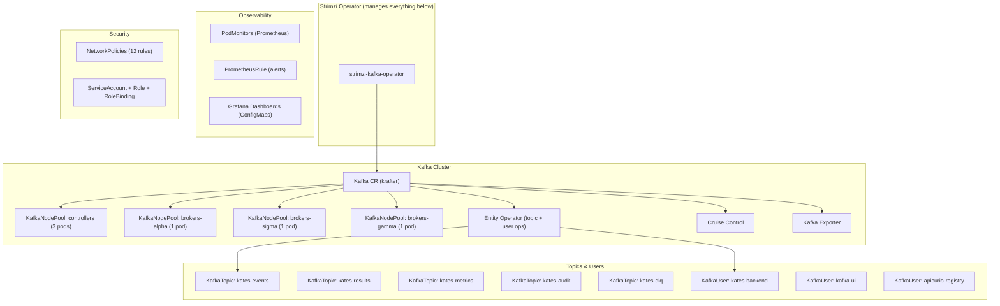
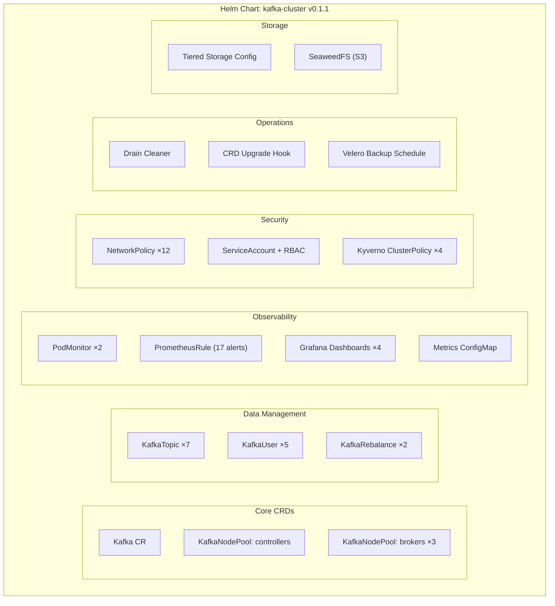
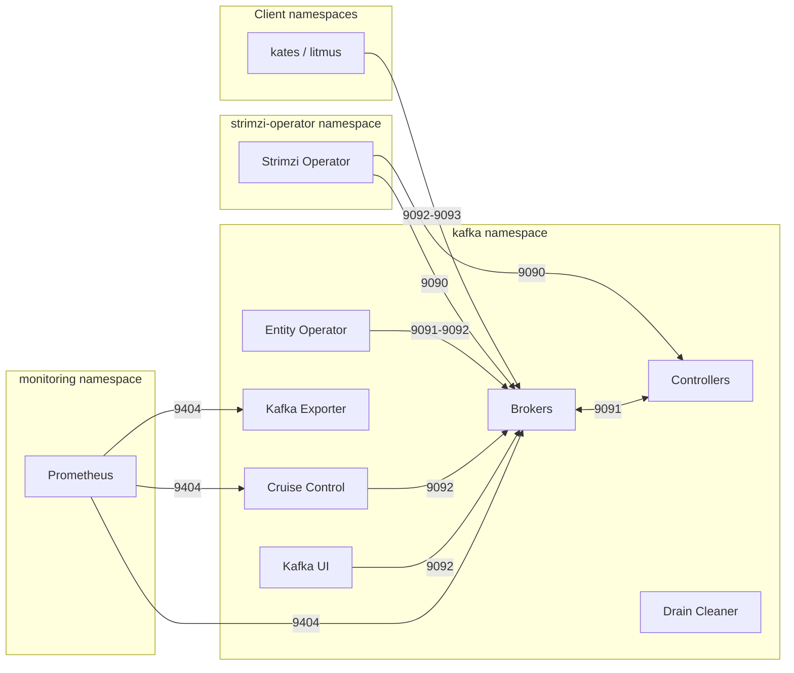
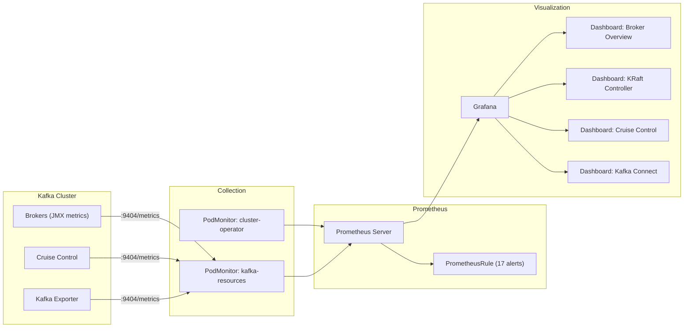
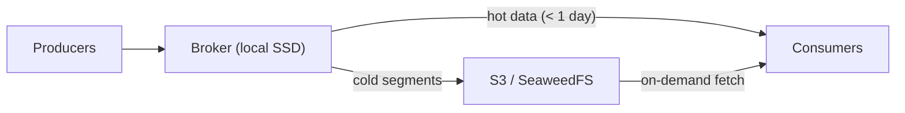

# Chapter 20: Installing Kafka with the kafka-cluster Helm Chart

This chapter walks you through deploying a production-grade Apache Kafka cluster on Kubernetes using the **kafka-cluster** Helm chart. It is written for someone who may be new to Kafka, Kubernetes, or Helm — every step is explained with the *why* before the *how*.

By the end of this chapter you will have:

- A 3-broker, 3-controller KRaft Kafka cluster
- SCRAM-SHA-512 authentication and simple ACL authorization
- Prometheus metrics, Grafana dashboards, and alerting rules
- Managed topics and users, all declared as code

---

## 1. Prerequisites

Before you begin, make sure you have the following tools and infrastructure ready.

### 1.1 Tools

| Tool | Minimum Version | Why You Need It |
|------|:---------------:|--------------------|
| **kubectl** | 1.28+ | Communicates with your Kubernetes cluster. Every command in this guide uses `kubectl` to inspect or modify cluster state. |
| **Helm** | 3.14+ | The Kubernetes package manager. The kafka-cluster chart is a Helm chart — Helm renders YAML templates from `values.yaml` and applies them to your cluster. |
| **Docker** | 24+ | Required only if using a local Kind/k3d cluster. Docker runs the Kubernetes nodes as containers on your machine. |
| **Kind** *(optional)* | 0.22+ | A lightweight tool to run Kubernetes *in Docker*. Perfect for local development. Not needed if deploying to EKS, GKE, AKS, or an existing cluster. |

**Install check — run all four:**

```bash
kubectl version --client -o yaml | grep gitVersion
helm version --short
docker version --format '{{.Server.Version}}'
kind version  # only if using Kind
```

If any command fails, install the missing tool before continuing.

### 1.2 Kubernetes Cluster

You need a running Kubernetes cluster with:

| Requirement | Minimum | Recommended | Why |
|-------------|:-------:|:-----------:|-----|
| **Nodes** | 1 | 3+ (one per zone) | Kafka spreads brokers across failure domains. With 3 nodes, each broker runs on a different node, so a single node failure only loses 1 broker. |
| **CPU** | 6 cores total | 12+ cores | The 3 brokers need 1 CPU each, 3 controllers need 0.5 CPU each, plus operator, exporter, and Cruise Control. |
| **Memory** | 16 GB total | 24+ GB | Brokers need 4 GB each for heap + page cache. Controllers need 1 GB. |
| **Storage** | 150 GB | 300+ GB | Each broker stores 50 GB of log data by default. Use SSDs if possible — Kafka is I/O-heavy. |
| **StorageClass** | 1 | 1 per zone | PersistentVolumeClaims (PVCs) need a StorageClass to provision disks. For zone-aware deployments, each zone gets its own class. |

::: {.callout-important}
If you are using a **managed Kubernetes service** (EKS, GKE, AKS), the StorageClasses are usually pre-configured (e.g., `gp3` on AWS, `standard-rw` on GKE). For local Kind clusters, you must create them manually — see section 3.1.
:::


### 1.3 Namespaces

The chart deploys everything into a single namespace (default: `kafka`). Create it before installing:

```bash
kubectl create namespace kafka --dry-run=client -o yaml | kubectl apply -f -
```

Why `--dry-run=client | apply`? This is an idempotent pattern — it creates the namespace if it doesn't exist and does nothing if it already does. Safe to run multiple times.

### 1.4 Monitoring Stack (Optional but Recommended)

If you want metrics, dashboards, and alerts, install the local monitoring wrapper chart first:

```bash
helm dependency update charts/monitoring
helm upgrade --install monitoring charts/monitoring \
  -f charts/monitoring/values-generic.yaml \
  --namespace monitoring --create-namespace
```

The kafka-cluster chart will automatically create `PodMonitor` and `PrometheusRule` resources that the Prometheus operator discovers.

### 1.5 Kyverno (Optional)

If you want admission-control policy enforcement — Pod Security Standards (PSS), automatic NetworkPolicy generation, and optional container image signature verification — install [Kyverno](https://kyverno.io/) before deploying the kafka-cluster chart:

```bash
helm repo add kyverno https://kyverno.github.io/kyverno/
helm repo update
helm install kyverno kyverno/kyverno -n kyverno --create-namespace
```

**Verify Kyverno is running:**

```bash
kubectl get pods -n kyverno
```

You should see the Kyverno admission controller, background controller, cleanup controller, and reports controller pods in `Running` state.

**How Kyverno integrates with Kates:**

When `kyvernoPolicy.enabled=true` is set in the kafka-cluster Helm chart values, the chart deploys four `ClusterPolicy` resources that leverage Kyverno's admission webhooks:

| Policy | What It Does |
|--------|-------------|
| `kates-pod-security-standards` | Mutates and validates workloads to enforce restricted PSS — non-root, drop ALL capabilities, seccomp, read-only rootfs |
| `kates-workload-standards` | Requires standard labels, health probes, and pinned image tags |
| `kates-image-verification` | Verifies Cosign container image signatures from trusted registries |
| `kates-generate-network-policies` | Automatically generates default-deny NetworkPolicies in new namespaces |

::: {.callout-tip}
Start with `kyvernoPolicy.action: Audit` (the default) to observe policy violations without blocking deployments. Switch to `Enforce` once you're confident all workloads comply. See [Chapter 17: Security & Compliance](17-security.md) for details on each policy.
:::


---

## 2. Understanding the Chart

Before running `helm install`, it helps to understand what the chart creates.

### 2.1 What Gets Deployed

When you install the kafka-cluster chart, Helm creates these Kubernetes resources:


```mermaid
graph TD
    subgraph "Strimzi Operator (manages everything below)"
        OP["strimzi-kafka-operator"]
    end

    subgraph "Kafka Cluster"
        KC["Kafka CR (krafter)"]
        CP["KafkaNodePool: controllers (3 pods)"]
        BP1["KafkaNodePool: brokers-alpha (1 pod)"]
        BP2["KafkaNodePool: brokers-sigma (1 pod)"]
        BP3["KafkaNodePool: brokers-gamma (1 pod)"]
        EO["Entity Operator (topic + user ops)"]
        CC["Cruise Control"]
        KE["Kafka Exporter"]
    end

    subgraph "Topics & Users"
        T1["KafkaTopic: kates-events"]
        T2["KafkaTopic: kates-results"]
        T3["KafkaTopic: kates-metrics"]
        T4["KafkaTopic: kates-audit"]
        T5["KafkaTopic: kates-dlq"]
        U1["KafkaUser: kates-backend"]
        U2["KafkaUser: kafka-ui"]
        U3["KafkaUser: apicurio-registry"]
    end

    subgraph "Observability"
        PM["PodMonitors (Prometheus)"]
        AR["PrometheusRule (alerts)"]
        GD["Grafana Dashboards (ConfigMaps)"]
    end

    subgraph "Security"
        NP["NetworkPolicies (12 rules)"]
        RBAC["ServiceAccount + Role + RoleBinding"]
    end

    OP --> KC
    KC --> CP
    KC --> BP1
    KC --> BP2
    KC --> BP3
    KC --> EO
    KC --> CC
    KC --> KE
    EO --> T1
    EO --> U1
```

### 2.2 How Strimzi Works

The chart doesn't create Kafka pods directly. Instead, it creates **Custom Resources** (CRs) — YAML objects that describe your *desired state*. The **Strimzi Operator** watches these CRs and does the heavy lifting:

1. You apply a `Kafka` CR that says "I want 3 brokers with TLS"
2. The Strimzi Operator sees the CR and creates pods, configmaps, secrets, services
3. If you change the CR (e.g., increase replicas), the operator detects the change and performs a rolling update

This means **you never edit pods directly** — you always edit the Helm values, run `helm upgrade`, and the operator reconciles.

### 2.3 KRaft Mode (No ZooKeeper)

This chart deploys Kafka in **KRaft mode** — the modern architecture where Kafka manages its own metadata using a built-in Raft consensus protocol. There is no ZooKeeper dependency.

Why this matters to you:
- **Fewer moving parts**: No separate ZooKeeper ensemble to manage
- **Faster failover**: Controller election happens in seconds, not minutes
- **Simpler operations**: One fewer StatefulSet, one fewer monitoring target

---

## 3. Installation

### 3.1 Step 1 — Storage Classes (Local/Kind Only)

If you're deploying to Kind or a local cluster without dynamic provisioning, create a StorageClass. Cloud clusters (EKS/GKE/AKS) can skip this step.

```bash
for ZONE in alpha sigma gamma; do
  kubectl apply -f - <<EOF
apiVersion: storage.k8s.io/v1
kind: StorageClass
metadata:
  name: local-storage-${ZONE}
provisioner: rancher.io/local-path
reclaimPolicy: Retain
volumeBindingMode: WaitForFirstConsumer
EOF
done
```

**What this does:** Creates three StorageClasses, one per availability zone. The `WaitForFirstConsumer` binding mode ensures PVCs are bound only after a pod is scheduled, respecting node affinity.

### 3.2 Step 2 — Add the Strimzi Helm Repository

The kafka-cluster chart has a **dependency** on the Strimzi operator chart. Helm needs to know where to find it:

```bash
helm repo add strimzi https://strimzi.io/charts/
helm repo update
```

Then download the dependency:

```bash
cd charts/kafka-cluster
helm dependency update
```

This creates a `charts/strimzi-kafka-operator-1.0.0.tgz` file inside the chart directory. Helm will install the operator automatically when you install the chart.

### 3.3 Step 3 — Review and Customize Values

The chart ships with sensible defaults in `values.yaml`, but you should review key settings before installing.

**Cluster identity:**

```yaml
clusterName: krafter       # Name of the Kafka cluster
kafkaVersion: "4.1.1"      # Apache Kafka version
strimziVersion: "1.0.0"   # Strimzi operator version
```

**Broker pools — define one pool per availability zone:**

```yaml
brokerPools:
  - name: brokers-alpha
    zone: alpha              # Node label: topology.kubernetes.io/zone=alpha
    replicas: 1
    storageSize: 50Gi
    storageClass: local-storage-alpha
  - name: brokers-sigma
    zone: sigma
    replicas: 1
    storageSize: 50Gi
    storageClass: local-storage-sigma
  - name: brokers-gamma
    zone: gamma
    replicas: 1
    storageSize: 50Gi
    storageClass: local-storage-gamma
```

**Why one broker per pool?** Each pool is pinned to a zone via `nodeAffinity`. This guarantees that when a zone goes down, only one broker is lost — the cluster continues to serve reads and writes because `min.insync.replicas: 2` is satisfied by the remaining two brokers.

**For a single-node test cluster**, simplify to one pool:

```yaml
brokerPools:
  - name: brokers
    zone: ""                 # No zone affinity
    replicas: 3
    storageSize: 10Gi
    storageClass: standard   # Your cluster's default StorageClass
```

### 3.4 Step 4 — Install the Chart

**Preferred — Install via the Kates CLI:**

The `kates deploy` command handles Strimzi operator installation, values file detection, environment overlay selection, and readiness waiting automatically:

```bash
# Detect your cluster topology and deploy
kates deploy --topology isolated

# With high availability (3 broker replicas per pool)
kates deploy --topology isolated --ha

# Deploy Kafka + Kafka Connect in one shot
kates deploy --topology isolated --with-kafka-connect
```

The CLI automatically:
- Detects your cluster zones (via `kates detect`)
- Selects the Kind overlay when running on Kind clusters
- Installs the Strimzi operator with readiness wait
- Provisions Kafka users and topics after the cluster is Ready
- Shows a Bubble Tea progress UI with per-component status

::: {.callout-tip}
Use `kates deploy` for interactive development. Use direct Helm commands (below) in CI pipelines where you need fine-grained control.
:::


**Alternative — Direct Helm installation:**

There are two installation modes, depending on whether the Strimzi operator is already installed.

**Mode A — Install everything (operator + cluster) in one shot:**

```bash
helm upgrade --install kafka-cluster charts/kafka-cluster \
  --namespace kafka \
  --create-namespace \
  --timeout 600s \
  --wait
```

This installs the Strimzi operator as a subchart and then creates all Kafka resources. The `--wait` flag tells Helm to block until all deployments are ready.

**Mode B — Operator already installed (e.g., shared cluster):**

```bash
helm upgrade --install kafka-cluster charts/kafka-cluster \
  --namespace kafka \
  --set strimziOperator.enabled=false \
  --set crdUpgrade.enabled=false \
  --timeout 600s \
  --wait
```

Setting `strimziOperator.enabled=false` skips the operator subchart. This is the correct mode when:
- A cluster admin already installed Strimzi at the cluster level
- You're upgrading only the Kafka cluster resources

### 3.5 Step 5 — Watch the Deployment

After `helm install` or `helm upgrade` starts, open a second terminal and watch the pods come up:

```bash
kubectl get pods -n kafka -w
```

Or use the kates CLI which shows deployment progress automatically:

```bash
kates kafka status
```

You should see pods appear in this order:

| Order | Pod | What It Does |
|:-----:|-----|-------------|
| 1 | `strimzi-cluster-operator-*` | The Strimzi operator — must be running before anything else |
| 2 | `krafter-controllers-3/4/5` | KRaft controller quorum — elected leader manages metadata |
| 3 | `krafter-brokers-alpha-0` | First broker — starts accepting connections |
| 4 | `krafter-brokers-sigma-2` | Second broker |
| 5 | `krafter-brokers-gamma-1` | Third broker |
| 6 | `krafter-entity-operator-*` | Topic Operator + User Operator in one pod |
| 7 | `krafter-cruise-control-*` | Partition rebalancer |
| 8 | `krafter-kafka-exporter-*` | Prometheus metrics exporter |

::: {.callout-note}
The initial deployment takes **3–8 minutes**. The operator generates TLS certificates, configures the KRaft quorum, and waits for each broker to join the cluster sequentially. This is normal.
:::


---

## 4. Verification

Once all pods show `Running` and `1/1 Ready`, verify the cluster health.

### 4.1 Check Kafka CR Status

```bash
kubectl get kafka krafter -n kafka -o jsonpath='{.status.conditions[?(@.type=="Ready")]}'
```

Expected output:

```json
{"lastTransitionTime":"...","status":"True","type":"Ready"}
```

If `status` is `True`, the cluster is fully operational.

### 4.2 Verify All Node Pools

```bash
kubectl get kafkanodepools -n kafka \
  -l strimzi.io/cluster=krafter \
  -o custom-columns='NAME:.metadata.name,REPLICAS:.spec.replicas,ROLES:.spec.roles[*],READY:.status.conditions[?(@.type=="Ready")].status'
```

Expected:

```
NAME              REPLICAS   ROLES        READY
brokers-alpha     1          broker       True
brokers-gamma     1          broker       True
brokers-sigma     1          broker       True
controllers       3          controller   True
```

### 4.3 Verify Topics

```bash
kubectl get kafkatopics -n kafka \
  -l strimzi.io/cluster=krafter \
  -o custom-columns='TOPIC:.metadata.name,PARTITIONS:.spec.partitions,REPLICAS:.spec.replicas,READY:.status.conditions[?(@.type=="Ready")].status'
```

### 4.4 Verify Users and Secrets

```bash
kubectl get kafkausers -n kafka -l strimzi.io/cluster=krafter
kubectl get secrets -n kafka | grep -E 'kates-backend|kafka-ui|apicurio'
```

Each `KafkaUser` should have a corresponding Kubernetes Secret containing the auto-generated SCRAM password.

### 4.5 Run Helm Tests

The chart includes built-in tests that verify connectivity, authentication, and authorization:

```bash
kates test helm
```

Or use the direct Helm command (useful in CI pipelines):

```bash
helm test kafka-cluster -n kafka --timeout 120s
```

The test suite includes:
- **Tier 1 (Connectivity):** Bootstrap TCP check, Kafka CR readiness, broker pod health
- **Tier 2 (Infrastructure):** Produce/consume round-trip with SCRAM authentication
- **Tier 3 (Authorization):** KafkaUser secret exists, ACL type is `simple`

---

## 5. Connecting to Your Cluster

### 5.1 From Inside the Cluster

Any pod in an allowed namespace can connect using the internal bootstrap address:

```
krafter-kafka-bootstrap.kafka.svc:9092  (plain + SCRAM)
krafter-kafka-bootstrap.kafka.svc:9093  (TLS + mTLS)
```

Example — connect from a debug pod:

```bash
kubectl run kafka-debug -it --rm --image=quay.io/strimzi/kafka:latest-kafka-4.1.1 \
  -n kafka -- /bin/bash

# Inside the pod:
bin/kafka-topics.sh --bootstrap-server krafter-kafka-bootstrap:9092 --list \
  --command-config /tmp/client.properties
```

### 5.2 From Outside the Cluster (NodePort)

The `external` listener exposes Kafka on NodePort `32100`:

```bash
# Get the node IP
NODE_IP=$(kubectl get nodes -o jsonpath='{.items[0].status.addresses[?(@.type=="InternalIP")].address}')

# Get the SCRAM password
PASSWORD=$(kubectl get secret kates-backend -n kafka -o jsonpath='{.data.password}' | base64 -d)

# Connect with kafkacat/kcat
kcat -b ${NODE_IP}:32100 -X security.protocol=SASL_SSL \
  -X sasl.mechanism=SCRAM-SHA-512 \
  -X sasl.username=kates-backend \
  -X sasl.password=${PASSWORD} \
  -X ssl.ca.location=/tmp/ca.crt \
  -L
```

---

## 6. Environment Overlays

The chart ships with pre-configured overlays for different environments. Use the `-f` flag to layer them on top of the base values:

### 6.1 Development

```bash
helm upgrade --install kafka-cluster charts/kafka-cluster \
  -f charts/kafka-cluster/values-dev.yaml \
  --namespace kafka
```

**What it changes:** Smaller resource requests (512Mi brokers), no network policies, relaxed security, single-zone storage.

### 6.2 Staging

```bash
helm upgrade --install kafka-cluster charts/kafka-cluster \
  -f charts/kafka-cluster/values-staging.yaml \
  --namespace kafka
```

**What it changes:** Production-like resources but with a smaller storage footprint. Monitoring enabled, network policies active.

### 6.3 Production

```bash
helm upgrade --install kafka-cluster charts/kafka-cluster \
  -f charts/kafka-cluster/values-prod.yaml \
  --namespace kafka
```

**What it changes:** Full resource allocation (4Gi broker memory, 2 CPUs), all security features enabled (network policies, RBAC, pod security policies), backup persistence enabled.

---

## 7. Common Customizations

### 7.1 Change the Cluster Name

```yaml
clusterName: my-kafka-cluster
```

This changes the name of the `Kafka` CR, all pod prefixes, and service names. Every resource becomes `my-kafka-cluster-kafka-bootstrap`, etc.

### 7.2 Add a New Topic

Add an entry to the `topics` array:

```yaml
topics:
  - name: my-new-topic
    partitions: 12
    replicas: 3
    config:
      retention.ms: "604800000"   # 7 days
      min.insync.replicas: "2"
      cleanup.policy: delete
```

Then run `helm upgrade` — the Topic Operator will create the topic automatically.

### 7.3 Add a New User with ACLs

```yaml
users:
  - name: my-service
    authentication:
      type: scram-sha-512
    quotas:
      producerByteRate: 10485760    # 10 MB/s
      consumerByteRate: 20971520    # 20 MB/s
    authorization:
      type: simple
      acls:
        - resource:
            type: topic
            name: "my-new-topic"
            patternType: literal
          operations: ["Read", "Write", "Describe"]
          host: "*"
        - resource:
            type: group
            name: "my-service-"
            patternType: prefix
          operations: ["Read", "Describe"]
          host: "*"
```

After `helm upgrade`, Strimzi creates a Kubernetes Secret named `my-service` containing the auto-generated password.

### 7.4 Scale Brokers

To add a fourth broker in a new zone:

```yaml
brokerPools:
  # ... existing pools ...
  - name: brokers-delta
    zone: delta
    replicas: 1
    storageSize: 50Gi
    storageClass: local-storage-delta
```

After upgrading, the new broker joins automatically. Use Cruise Control's `KafkaRebalance` to redistribute partitions:

```bash
kubectl annotate kafkarebalance full-rebalance strimzi.io/rebalance=approve -n kafka
```

### 7.5 Disable Optional Components

```yaml
cruiseControl:
  enabled: false

kafkaExporter:
  enabled: false

networkPolicies:
  enabled: false

alerts:
  enabled: false
```

---

## 8. Chart Architecture Deep Dive

This section provides a comprehensive view of *every* resource the kafka-cluster Helm chart creates. Understanding the full resource graph helps you debug issues, plan capacity, and reason about security boundaries.

### 8.1 Resource Graph

The chart renders 26 template files into the following resource categories:


```mermaid
graph TD
    subgraph "Helm Chart: kafka-cluster v0.1.1"
        subgraph "Core CRDs"
            KC["Kafka CR"]
            CNP["KafkaNodePool: controllers"]
            BNP["KafkaNodePool: brokers ×3"]
        end
        subgraph "Data Management"
            T["KafkaTopic ×7"]
            U["KafkaUser ×5"]
            RB["KafkaRebalance ×2"]
        end
        subgraph "Observability"
            PM["PodMonitor ×2"]
            PR["PrometheusRule (17 alerts)"]
            GD["Grafana Dashboards ×4"]
            MC["Metrics ConfigMap"]
        end
        subgraph "Security"
            NP["NetworkPolicy ×12"]
            SA["ServiceAccount + RBAC"]
            KP["Kyverno ClusterPolicy ×4"]
        end
        subgraph "Operations"
            DC["Drain Cleaner"]
            CRD["CRD Upgrade Hook"]
            BK["Velero Backup Schedule"]
        end
        subgraph "Storage"
            TS["Tiered Storage Config"]
            SW["SeaweedFS (S3)"]
        end
    end
```

### 8.2 Template File Reference

Every template file in the chart and what it produces:

| Template File | Resources Created | Controlled By |
|---------------|-------------------|---------------|
| `kafka.yaml` | `Kafka` CR (cluster spec, listeners, CA, entity operator, Cruise Control, exporter) | Always |
| `nodepool-controllers.yaml` | `KafkaNodePool` for controller pods (one per zone) | `controllerPools[]` |
| `nodepool-brokers.yaml` | `KafkaNodePool` for broker pods (one per zone) | `brokerPools[]` |
| `topics.yaml` | `KafkaTopic` × 7 (managed topic declarations) | `topics.enabled` |
| `users.yaml` | `KafkaUser` × 5 (SCRAM users with ACLs and quotas) | `users.enabled` |
| `rebalance.yaml` | `KafkaRebalance` × 2 (`full-rebalance` + `add-broker-rebalance`) | `rebalance.enabled` |
| `networkpolicies.yaml` | `NetworkPolicy` × 12 (default-deny, DNS, broker, controller, operator, etc.) | `networkPolicies.enabled` |
| `prometheusrule.yaml` | `PrometheusRule` with 17 alert rules across 9 groups | `alerts.enabled` |
| `podmonitors.yaml` | `PodMonitor` × 2 (cluster-operator-metrics, kafka-resources-metrics) | `podMonitors.enabled` |
| `grafana-dashboards.yaml` | `ConfigMap` × 2 (broker overview, KRaft controller) | `dashboards.enabled` |
| `grafana-dashboards-advanced.yaml` | `ConfigMap` × 1 (Cruise Control dashboard) | `dashboards.cruiseControlDashboard` |
| `grafana-dashboards-connect.yaml` | `ConfigMap` × 1 (Kafka Connect dashboard) | `dashboards.connectDashboard` |
| `metrics-configmap.yaml` | `ConfigMap` (JMX Prometheus Exporter rules) | Always |
| `rbac.yaml` | `ServiceAccount`, `Role`, `RoleBinding` | `rbac.create` |
| `crd-upgrade.yaml` | `Job` + RBAC (pre-install/pre-upgrade hook) | `crdUpgrade.enabled` |
| `drain-cleaner.yaml` | `Deployment`, `Service`, `ValidatingWebhookConfiguration` + RBAC | `drainCleaner.enabled` |
| `tiered-storage.yaml` | `Secret` (S3 credentials), `ConfigMap` (RSM properties) | `tieredStorage.enabled` |
| `seaweedfs.yaml` | SeaweedFS subchart resources (master, volume, filer) | `seaweedfs.enabled` |
| `backup.yaml` | Velero `Schedule`, `Backup`, optional `PVC` | `backup.enabled` |
| `external-secrets.yaml` | `SecretStore`, `PushSecret`, `ExternalSecret` | `externalSecrets.enabled` |
| `pod-security-policy.yaml` | Kyverno `ClusterPolicy` × 4 (PSS, workload, image, network) | `podSecurityPolicy.enabled` |
| `tests/test-connection.yaml` | 9 test `Pod` specs (Helm test hooks, tiers 1–9) | Always (test hooks) |
| `tests/test-performance.yaml` | Performance benchmark test pod | Always (test hooks) |
| `tests/test-profiler.yaml` | JFR profiler test pod | Always (test hooks) |
| `_helpers.tpl` | Template helper functions (labels, names, images) | N/A |
| `NOTES.txt` | Post-install usage instructions | N/A |

::: {.callout-note}
Many resources are opt-in via boolean flags in `values.yaml`. A minimal installation with only core CRDs creates ~15 resources. A full production deployment with all features enabled creates 50+ resources.
:::


---

## 9. Kafka Listeners & Authentication

Kafka *listeners* define how clients connect to the cluster. Each listener has its own port, protocol, and authentication method. Understanding listeners is critical because **misconfigured listeners are the #1 cause of "I can't connect" issues**.

### 9.1 Default Listener Configuration

The chart configures three listeners out of the box:

| Listener | Port | Protocol | Authentication | TLS | Use Case |
|----------|:----:|----------|---------------|:---:|----------|
| `plain` | 9092 | Plaintext | SCRAM-SHA-512 | ✗ | Internal services within the cluster (fast, no TLS overhead) |
| `tls` | 9093 | TLS | mTLS (certificate) | ✓ | Secure internal communication (mutual TLS — both client and server present certificates) |
| `external` | 9094 | TLS + NodePort | SCRAM-SHA-512 | ✓ | External clients outside the Kubernetes cluster |

**Why three listeners?** Different clients have different security requirements:
- **Internal microservices** use `plain:9092` — SCRAM authentication without TLS encryption. This is acceptable within a trusted network because Kubernetes NetworkPolicies restrict which pods can reach this port.
- **Security-sensitive services** use `tls:9093` — full mTLS ensures both authentication and encryption.
- **External tools** (monitoring dashboards, development laptops) use `external:9094` — NodePort with TLS so traffic is encrypted over the public network.

### 9.2 Listener Configuration in values.yaml

```yaml
kafka:
  listeners:
    - name: plain
      port: 9092
      type: internal          # ClusterIP service, internal only
      tls: false
      authentication:
        type: scram-sha-512   # Username/password via SCRAM

    - name: tls
      port: 9093
      type: internal
      tls: true               # TLS termination at the broker
      authentication:
        type: tls             # Client certificate (mTLS)

    - name: external
      port: 9094
      type: nodeport          # Exposed via NodePort on each node
      tls: true
      authentication:
        type: scram-sha-512
      configuration: {}       # NodePort settings (overrides per node)
```

### 9.3 Customizing Listeners

**Add an OAuth 2.0 listener** for services using token-based authentication:

```yaml
kafka:
  listeners:
    # ... existing listeners ...
    - name: oauth
      port: 9095
      type: internal
      tls: true
      authentication:
        type: oauth
        validIssuerUri: https://keycloak.example.com/realms/kafka
        jwksEndpointUri: https://keycloak.example.com/realms/kafka/protocol/openid-connect/certs
        userNameClaim: preferred_username
```

**Change the external listener to LoadBalancer** (cloud clusters):

```yaml
kafka:
  listeners:
    - name: external
      port: 9094
      type: loadbalancer      # Cloud LB instead of NodePort
      tls: true
      authentication:
        type: scram-sha-512
      configuration:
        bootstrap:
          annotations:
            service.beta.kubernetes.io/aws-load-balancer-type: nlb
```

::: {.callout-warning}
When adding or removing listeners, the Strimzi operator performs a **rolling restart** of all brokers. Plan listener changes during a maintenance window.
:::


### 9.4 Bootstrap Addresses

Each listener gets its own bootstrap service. Use these addresses in your client configurations:

| Listener | Internal Bootstrap Address | External Access |
|----------|---------------------------|-----------------|
| `plain` | `krafter-kafka-bootstrap.kafka.svc:9092` | N/A |
| `tls` | `krafter-kafka-bootstrap.kafka.svc:9093` | N/A |
| `external` | N/A | `<node-ip>:<nodeport>` |

---

## 10. Topics & Users Reference

This section documents every default topic and user the chart creates. You rarely need to create these manually — the Strimzi **Entity Operator** (Topic Operator + User Operator) watches for `KafkaTopic` and `KafkaUser` CRs and reconciles them automatically.

### 10.1 Default Topics

The chart creates 7 topics, each designed for a specific data pipeline:

| Topic | Partitions | Replicas | Retention | Compression | Cleanup | Purpose |
|-------|:----------:|:--------:|:---------:|:-----------:|:-------:|---------|
| `kates-events` | 6 | 3 | 2 days | — | delete | Test lifecycle events (suite start/end, test pass/fail) |
| `kates-results` | 12 | 3 | 7 days | lz4 | delete | Detailed test results with payloads (high throughput) |
| `kates-metrics` | 6 | 3 | 1 day | lz4 | delete | Real-time metrics pipeline (latency, throughput, resource usage) |
| `kates-audit` | 3 | 3 | 30 days | — | delete | Audit trail for compliance (who ran what, when) |
| `kates-dlq` | 3 | 3 | forever | — | compact | Dead letter queue for failed messages (compacted to keep latest per key) |
| `cdc-schema-history` | 1 | 3 | forever | — | compact | Debezium schema history for CDC connectors |
| `cdc-heartbeat` | 1 | 3 | 1 day | — | delete | CDC liveness heartbeats (detects stalled connectors) |

**Why these specific configurations?**

- **Partitions** scale with expected throughput — `kates-results` has 12 partitions because it handles the highest message volume.
- **Replicas: 3** ensures data survives the loss of any single broker (`min.insync.replicas: 2` across all topics).
- **Compact cleanup** on `kates-dlq` and `cdc-schema-history` means Kafka keeps only the latest value per key, acting as a key-value store.
- **lz4 compression** on high-volume topics reduces storage and network I/O with minimal CPU overhead.

To list all topics using the kates CLI:

```bash
kates kafka topics
```

### 10.2 Default Users

The chart creates 5 users with different permission levels:

| User | Auth Type | Quotas | ACL Summary | Purpose |
|------|:---------:|--------|-------------|---------|
| `kates-backend` | SCRAM-SHA-512 | None (superUser) | Full access (superUser bypass) | Primary application service account |
| `kafka-ui` | SCRAM-SHA-512 | 1 MB/s produce, 50 MB/s consume, 10% request | Read-only: all topics, all groups, cluster Describe | Kafka UI dashboard (read-only monitoring) |
| `apicurio-registry` | SCRAM-SHA-512 | 10 MB/s produce, 20 MB/s consume, 15% request | Read/Write/Create: `__apicurio*` topics; Read: `apicurio*` groups | Apicurio Schema Registry |
| `litmus-chaos` | SCRAM-SHA-512 | None | Full topic CRUD: all topics; Read: `litmus*` groups; Describe cluster | Chaos engineering test agent |
| `kates-connect` | SCRAM-SHA-512 | 50 MB/s produce, 50 MB/s consume, 25% request | Read/Write/Create: `kates-connect-*`, `kates-*`, `cdc*` topics; transactional IDs; Read: `kates-connect*`, `connect-*` groups | Kafka Connect worker identity |

**Understanding quotas:**

Quotas prevent a single user from monopolizing cluster resources. For example, `kafka-ui` is limited to 1 MB/s produce because a monitoring dashboard should never produce significant data. The `requestPercentage` quota limits the percentage of broker request handler threads the user can consume.

To list all users using the kates CLI:

```bash
kates kafka users
```

### 10.3 User Secrets

Each `KafkaUser` CR produces a Kubernetes `Secret` with the same name. The secret contains:

| Key | Content |
|-----|---------|
| `password` | Auto-generated SCRAM password (base64-encoded) |
| `sasl.jaas.config` | Complete JAAS configuration string, ready to use |

**Retrieve a password:**

```bash
kubectl get secret kates-backend -n kafka -o jsonpath='{.data.password}' | base64 -d
```

::: {.callout-important}
Secrets are only created after the Kafka cluster reaches `Ready` state. If secrets are missing, check that the Entity Operator pod is running (see [Section 16: Troubleshooting](#16-troubleshooting)).
:::


---

## 11. Network Policies

Network policies enforce the principle of **least privilege** at the network layer. Without them, any pod in the cluster can connect to Kafka — with them, only explicitly allowed namespaces and pods can reach specific ports.

### 11.1 Why Network Policies Matter

In a shared Kubernetes cluster, Kafka is a high-value target:
- It stores sensitive business data
- It has administrative APIs (port 9090) that can modify cluster state
- Unauthorized produce/consume can corrupt data pipelines

The chart's default-deny + explicit-allow approach means you must **opt in** to connectivity — nothing is open by default.

### 11.2 Traffic Flow Diagram


```mermaid
graph LR
    subgraph "kafka namespace"
        B[Brokers]
        C[Controllers]
        EO[Entity Operator]
        CC[Cruise Control]
        KE[Kafka Exporter]
        DC[Drain Cleaner]
        UI[Kafka UI]
    end
    subgraph "monitoring namespace"
        P[Prometheus]
    end
    subgraph "strimzi-operator namespace"
        SO[Strimzi Operator]
    end
    subgraph "Client namespaces"
        CL["kates / litmus"]
    end

    CL -->|"9092-9093"| B
    P -->|"9404"| B
    P -->|"9404"| CC
    P -->|"9404"| KE
    SO -->|"9090"| B
    SO -->|"9090"| C
    B <-->|"9091"| C
    EO -->|"9091-9092"| B
    CC -->|"9092"| B
    UI -->|"9092"| B
```

### 11.3 All 12 Network Policies

| # | Policy Name | Target Pods | Allows | Ports |
|:-:|-------------|-------------|--------|:-----:|
| 1 | `default-deny` | All pods with `app.kubernetes.io/part-of: strimzi-krafter` | Nothing (baseline deny-all ingress + egress) | — |
| 2 | `allow-dns` | All pods with `app.kubernetes.io/part-of: strimzi-krafter` | DNS egress to any destination | 53/UDP, 53/TCP |
| 3 | `kafka-brokers` | Broker pods (`strimzi.io/kind: Kafka`) | Inter-broker, client namespaces, monitoring, external, operator | 9090–9094, 9404 |
| 4 | `kafka-controllers` | Controller pods (`strimzi.io/controller-role: true`) | Inter-cluster pods (admin API + replication) | 9090, 9091 |
| 5 | `strimzi-operator` | Operator pods (in operator namespace) | Health probes ingress; egress to DNS, API server, kafka namespace | 8080, 53, 443, 6443 |
| 6 | `kafka-ui` | Pods with `app: kafka-ui` | Ingress from any (UI port); egress to brokers | 8080, 9092 |
| 7 | `cruise-control` | Cruise Control pods | Operator admin API, monitoring metrics | 9090, 9404 |
| 8 | `strimzi-drain-cleaner` | Drain Cleaner pods | Webhook ingress; egress to API server | 8443, 443, 6443 |
| 9 | `kafka-mirror-maker` | MirrorMaker2 pods | Monitoring metrics ingress; egress to brokers | 9404, 9092 |
| 10 | `entity-operator` | Entity Operator pods | Monitoring metrics ingress; egress to brokers | 8080, 8081, 9091, 9092 |
| 11 | `kafka-exporter` | Kafka Exporter pods | Monitoring metrics ingress; egress to brokers | 9404, 9092 |
| 12 | `test-egress` | Test pods (`kates.io/test-pod: true`) | Egress to all Kafka ports + DNS (for Helm tests) | 9090–9094, 53 |

### 11.4 Allowed Client Namespaces

The `kafka-brokers` policy allows ingress from pods in the `kates` and `litmus` namespaces:

```yaml
networkPolicies:
  allowedClientNamespaces:
    - kates
    - litmus
```

**To add a new namespace** (e.g., your application namespace):

```yaml
networkPolicies:
  allowedClientNamespaces:
    - kates
    - litmus
    - my-app-namespace    # Add your namespace here
```

After `helm upgrade`, the broker NetworkPolicy is regenerated with the new ingress rule.

::: {.callout-caution}
The `allowedClientNamespaces` setting uses `namespaceSelector` with broad pod selectors. Only add namespaces you trust, as **all pods** in the namespace will be able to reach Kafka brokers.
:::


### 11.5 Disabling Network Policies

For development or Kind clusters where NetworkPolicy enforcement isn't needed:

```yaml
networkPolicies:
  enabled: false
```

::: {.callout-warning}
Never disable network policies in production. They are a critical layer of defense-in-depth.
:::


---

## 12. Observability Stack

The chart deploys a comprehensive monitoring pipeline that integrates with the Prometheus + Grafana stack. This section explains *what* is monitored, *why* each alert fires, and *how* the dashboards are structured.

### 12.1 Architecture


```mermaid
graph LR
    subgraph "Kafka Cluster"
        B["Brokers (JMX metrics)"]
        CC["Cruise Control"]
        KE["Kafka Exporter"]
    end
    subgraph "Collection"
        PM1["PodMonitor: cluster-operator"]
        PM2["PodMonitor: kafka-resources"]
    end
    subgraph "Prometheus"
        P["Prometheus Server"]
        PR["PrometheusRule (17 alerts)"]
    end
    subgraph "Visualization"
        G["Grafana"]
        D1["Dashboard: Broker Overview"]
        D2["Dashboard: KRaft Controller"]
        D3["Dashboard: Cruise Control"]
        D4["Dashboard: Kafka Connect"]
    end

    B -->|":9404/metrics"| PM2
    CC -->|":9404/metrics"| PM2
    KE -->|":9404/metrics"| PM2
    PM1 --> P
    PM2 --> P
    P --> PR
    P --> G
    G --> D1
    G --> D2
    G --> D3
    G --> D4
```

### 12.2 PrometheusRule Alerts (17 Alerts)

The chart creates a single `PrometheusRule` resource with 17 alerts organized into 9 groups. Each alert is tuned to avoid false positives while catching real issues:

| Group | Alert | Severity | Threshold | For | What It Means |
|-------|-------|:--------:|-----------|:---:|---------------|
| **kafka.cluster** | `KafkaOfflinePartitions` | critical | > 0 offline partitions | 2m | Data is unavailable — some partitions have no leader |
| | `KafkaUnderReplicatedPartitions` | warning | > 0 under-replicated | 5m | Replicas are falling behind — potential data loss risk |
| | `KafkaActiveControllerCount` | critical | ≠ 1 active controller | 3m | Split-brain or no controller — cluster cannot make metadata changes |
| | `KafkaBrokerDiskUsageHigh` | warning | > 80% disk used | 10m | Broker running low on disk — increase storage or retention |
| | `KafkaBrokerDiskUsageCritical` | critical | > 90% disk used | 5m | Broker nearly out of disk — immediate action needed |
| **kafka.consumer** | `KafkaConsumerGroupLag` | warning | > 1M messages lag | 15m | Consumer is falling behind — check consumer health |
| | `KafkaConsumerGroupLagCritical` | critical | > 10M messages lag | 5m | Consumer severely behind — likely stuck or dead |
| **kafka.kraft** | `KafkaRaftLeaderElectionRate` | warning | > 0.5 elections/s | 5m | Frequent leader elections indicate controller instability |
| | `KafkaRaftUncommittedRecords` | warning | > 1000 uncommitted | 5m | Metadata backlog — controllers may be overloaded |
| **kafka.network** | `KafkaRequestLatencyHigh` | warning | p99 > 1000ms | 10m | Slow requests — disk I/O, network, or overloaded brokers |
| **strimzi.operator** | `StrimziOperatorDown` | critical | operator unreachable | 5m | Operator down — no reconciliation of Kafka CRs |
| **kafka.replication** | `KafkaISRShrinkRate` | warning | ISR shrink > 0/s | 5m | Replicas falling out of sync — network or disk problems |
| **kafka.performance** | `KafkaLogFlushLatencyHigh` | warning | p99 > 500ms | 10m | Slow disk writes — check I/O scheduler and disk health |
| | `KafkaRequestHandlerSaturated` | warning | idle < 30% | 10m | Request handlers over 70% busy — add threads or brokers |
| **kafka.cruisecontrol** | `CruiseControlAnomalyDetected` | warning | > 0 anomalies/10m | 5m | Cruise Control detected cluster imbalance or failures |
| **kafka.certificates** | `KafkaCertificateExpiringSoon` | warning | < 30 days to expiry | 1h | Certificate renewal needed — auto-renewal should handle this |
| | `KafkaCertificateExpiryCritical` | critical | < 7 days to expiry | 30m | Certificate about to expire — manual intervention may be needed |

### 12.3 Grafana Dashboards

The chart creates 4 Grafana dashboards as ConfigMaps with the `grafana_dashboard: "1"` label. The Grafana sidecar auto-discovers and loads them:

| Dashboard | ConfigMap | Key Panels | Controlled By |
|-----------|-----------|------------|---------------|
| **Broker Overview** | `kafka-broker-dashboard` | Messages in/out rate, bytes in/out, request latency p99, ISR metrics, disk usage | `dashboards.brokerDashboard` |
| **KRaft Controller** | `kafka-kraft-dashboard` | Leader election rate, uncommitted records, metadata log size, quorum health | `dashboards.kraftDashboard` |
| **Cruise Control** | `kafka-cruise-control-dashboard` | Anomaly count, rebalance status, optimization goals, broker capacity | `dashboards.cruiseControlDashboard` |
| **Kafka Connect** | `kafka-connect-dashboard` | Connector status, task failures, source/sink throughput, offset commit rate | `dashboards.connectDashboard` |

### 12.4 PodMonitors

Two PodMonitors tell Prometheus which pods to scrape:

| PodMonitor | Matches | Endpoint | Relabelings |
|------------|---------|----------|-------------|
| `cluster-operator-metrics` | `strimzi.io/kind: cluster-operator` | `/metrics` on port `http` | None |
| `kafka-resources-metrics` | `strimzi.io/kind` ∈ {Kafka, KafkaConnect, KafkaMirrorMaker, KafkaMirrorMaker2} | `/metrics` on port `tcp-prometheus` | Pod name, namespace, node name |

### 12.5 JMX Metrics ConfigMap

The `kafka-metrics` ConfigMap contains the JMX Prometheus Exporter configuration that controls which MBeans are exported as Prometheus metrics. The Kafka CR and Cruise Control both reference this ConfigMap via `metricsConfig.valueFrom.configMapKeyRef`.

Key metric categories exported:
- **Broker**: messages in/out, bytes in/out, request latency, ISR state
- **Controller**: active controller count, election rate, metadata log
- **Network**: request handler idle percent, connection count
- **Log**: flush rate and time, segment count, log end offset
- **Replication**: ISR shrink/expand rate, under-replicated partitions

---

## 13. Advanced Features

This section covers the chart's optional features that go beyond the basic Kafka deployment. Each feature is independently toggleable via `values.yaml`.

### 13.1 CRD Upgrade Hook

**Why it exists:** Strimzi CRDs are cluster-scoped resources that Helm [cannot manage cleanly](https://helm.sh/docs/chart_best_practices/custom_resource_definitions/) — Helm won't upgrade CRDs after initial install. Without this hook, upgrading Strimzi versions leaves stale CRDs that block new features.

**How it works:** The chart includes a `pre-install`/`pre-upgrade` Helm hook Job that:

1. Downloads the Strimzi CRDs YAML from the GitHub release matching `strimziVersion`
2. Applies them with `kubectl apply --server-side --force-conflicts`
3. Verifies all required CRDs (`kafkas`, `kafkatopics`, `kafkausers`, `kafkanodepools`) exist

```yaml
crdUpgrade:
  enabled: true                    # Set to false if CRDs are managed externally
  image: "bitnami/kubectl:latest"  # Image with kubectl binary
```

::: {.callout-note}
The Job runs with a dedicated `ServiceAccount` and `ClusterRole` scoped only to CRD read/write. It cleans itself up after success (`hook-delete-policy: before-hook-creation,hook-succeeded`).
:::


### 13.2 Drain Cleaner

**Why it exists:** When a Kubernetes node is drained (e.g., during upgrades), the kubelet evicts pods immediately. For Kafka, this can cause data loss if a broker is killed without transferring partition leadership first.

**How it works:** The Strimzi Drain Cleaner is a ValidatingWebhookConfiguration that intercepts pod eviction requests. When it sees a Kafka pod being evicted:

1. It annotates the pod's `StrimziPodSet` to trigger a controlled restart
2. The Strimzi operator performs a graceful shutdown — transferring leadership, waiting for ISR to heal
3. Only then is the pod terminated

```yaml
drainCleaner:
  enabled: false     # Enable for production clusters with node upgrade cycles
  image: quay.io/strimzi/drain-cleaner:1.0.0
  resources:
    requests:
      memory: 64Mi
      cpu: 50m
    limits:
      memory: 128Mi
      cpu: 100m
```

::: {.callout-tip}
Enable Drain Cleaner in any environment where nodes are regularly drained — EKS managed node groups, GKE node auto-upgrades, or spot/preemptible instances.
:::


### 13.3 Tiered Storage

**Why it exists:** Kafka's local disk storage is expensive and finite. Tiered storage (Kafka 3.6+ KIP-405) moves cold log segments to cheap object storage while keeping hot data on local SSDs for low-latency reads.

**How it works:**


```mermaid
graph LR
    P[Producers] --> B["Broker (local SSD)"]
    B -->|"hot data (< 1 day)"| C[Consumers]
    B -->|"cold segments"| S3["S3 / SeaweedFS"]
    S3 -->|"on-demand fetch"| C
```

- **Local retention**: 1 day (`log.local.retention.ms: 86400000`)
- **Remote retention**: Follows the topic's `retention.ms` setting
- **Backend**: Any S3-compatible store — SeaweedFS (built-in), AWS S3, MinIO

```yaml
tieredStorage:
  enabled: true
  s3:
    bucketName: kafka-tiered-storage
    region: us-east-1
    endpointUrl: ""              # Auto-resolves to SeaweedFS when seaweedfs.enabled=true
    pathStyleAccessEnabled: true
  retention:
    localRetentionMs: 86400000   # 1 day on local disk
```

::: {.callout-warning}
Tiered storage requires Kafka 3.6+. Enabling it on older versions will cause broker startup failures.
:::


### 13.4 SeaweedFS

**Why it exists:** Not every environment has AWS S3 or a cloud object store. SeaweedFS provides a lightweight, self-hosted S3-compatible backend deployed as a Helm subchart.

**Two roles in the Kates stack:**
1. **Tiered Storage backend** — Kafka's Remote Log Storage Manager writes cold segments here
2. **Velero backup target** — Velero stores CRD and controller PVC backups here

```yaml
seaweedfs:
  enabled: false    # Enable in staging/prod overlays
  s3:
    accessKeyId: "kates-kafka"
    secretAccessKey: "change-me-in-prod"
  master:
    replicas: 1     # 3 for production HA
  volume:
    replicas: 1     # 3 for production HA
    storage: 100Gi  # 500Gi+ in prod
  filer:
    replicas: 1
    s3:
      enabled: true
      port: 8333
```

### 13.5 Velero Backup

**Why it exists:** Even with replicated data, you need to back up the *cluster topology* — the CRDs, Secrets, and ConfigMaps that define your Kafka cluster. Without them, you'd have to recreate every topic, user, and ACL from scratch after a disaster.

**What gets backed up:**
- Strimzi CRs (`Kafka`, `KafkaNodePool`, `KafkaTopic`, `KafkaUser`)
- Secrets (SCRAM passwords, CA certificates)
- Controller PVCs (KRaft metadata logs — small, ~1 GB each)

**What does NOT get backed up:**
- Broker PVCs — intentionally excluded. Broker data is recoverable via replication (`replication.factor: 3`) and tiered storage. Snapshotting broker PVCs would be redundant, wasteful, and unsafe (crash-consistent snapshots can contain partially flushed segments).

```yaml
backup:
  enabled: true
  schedule: "0 2 * * *"         # Daily at 2 AM
  ttl: 168h0m0s                 # 7-day retention
  snapshotVolumes: false        # MUST be false — see above
  storageLocation: default      # Points to SeaweedFS BSL
```

::: {.callout-caution}
Do **not** set `snapshotVolumes: true`. Broker PVC snapshots are crash-consistent and can corrupt data on restore. See the README section "Why NetBackup is Incompatible with Kafka" for the full rationale.
:::


### 13.6 External Secrets Operator

**Why it exists:** Strimzi generates SCRAM passwords as Kubernetes Secrets, but your application might need those passwords in AWS Secrets Manager, HashiCorp Vault, or another namespace. The External Secrets Operator (ESO) bridges this gap.

**Three modes:**

| Mode | Direction | Use Case |
|------|-----------|----------|
| **Push** | K8s → External vault | Push Strimzi user passwords to AWS Secrets Manager or Vault |
| **Pull** | External vault → K8s | Pull S3 credentials from Vault into the kafka namespace |
| **Sync** | K8s → K8s (cross-namespace) | Replicate a user secret from `kafka` to your app's namespace |

```yaml
externalSecrets:
  enabled: true
  secretStore:
    create: true
    provider:
      vault:
        server: "https://vault.example.com"
        path: "secret"
        auth:
          kubernetes:
            mountPath: "kubernetes"
            role: "kafka"
  push:
    - sourceSecret: kates-backend
      refreshInterval: 1h
      data:
        - secretKey: password
          remoteKey: kafka/kates-backend
          property: password
```

### 13.7 Kyverno Pod Security Policies

**Why they exist:** Kubernetes deprecated PodSecurityPolicies (PSP) in v1.25. The chart uses [Kyverno](https://kyverno.io/) ClusterPolicies as a modern replacement, enforcing Pod Security Standards (PSS) at the `restricted` level.

**4 ClusterPolicies:**

| Policy | Validates / Mutates | Key Rules |
|--------|:-------------------:|-----------|
| `kafka-pod-security-standards` | Both | Non-root, drop ALL capabilities, seccomp RuntimeDefault, no privilege escalation, no host namespaces |
| `kates-workload-standards` | Validate | Required labels, health probes, pinned image tags |
| `kates-image-verification` | Validate | Cosign signature verification from trusted registries |
| `kates-generate-network-policies` | Generate | Auto-creates default-deny NetworkPolicies in new namespaces |

```yaml
podSecurityPolicy:
  enabled: false          # Enable when Kyverno is installed
  action: Audit           # Start with Audit, switch to Enforce after testing
  mutate: false           # Auto-inject security contexts
  excludeStrimziPods: true  # Don't mutate Strimzi-managed pods (operator handles them)
```

::: {.callout-tip}
Always start with `action: Audit`. Run `kubectl get policyreport -A` to see which pods would be blocked, then fix them before switching to `Enforce`.
:::


### 13.8 Cruise Control & Rebalance

**Why it exists:** When you add or remove brokers, partitions don't automatically redistribute. Cruise Control continuously monitors broker load and generates optimal partition assignment plans.

**Two KafkaRebalance resources:**

| Name | Mode | Trigger |
|------|------|---------|
| `full-rebalance` | `full` | Manual — annotate to approve a full cluster rebalance |
| `add-broker-rebalance` | `add-brokers` | Automatic — Cruise Control detects new brokers and generates a plan |

**8 optimization goals** (in priority order):

1. `RackAwareGoal` — Spread replicas across failure domains
2. `ReplicaCapacityGoal` — Don't exceed broker replica limits
3. `DiskCapacityGoal` — Keep disk usage balanced
4. `NetworkInboundCapacityGoal` — Balance inbound network load
5. `NetworkOutboundCapacityGoal` — Balance outbound network load
6. `CpuCapacityGoal` — Balance CPU utilization
7. `TopicReplicaDistributionGoal` — Spread topic replicas evenly
8. `LeaderBytesInDistributionGoal` — Balance leader write load

**Trigger a manual rebalance:**

```bash
# Generate a rebalance proposal
kubectl annotate kafkarebalance full-rebalance strimzi.io/rebalance=approve -n kafka

# Check the proposal status
kubectl get kafkarebalance full-rebalance -n kafka -o jsonpath='{.status.conditions}'
```

### 13.9 Certificate Authority

**Why it exists:** Kafka uses TLS for inter-broker communication and client connections. The chart configures Strimzi to auto-generate and manage both the cluster CA and clients CA.

**Two CAs:**

| CA | Purpose | Validity | Renewal Window |
|----|---------|:--------:|:--------------:|
| **Cluster CA** | Signs broker and controller certificates | 5 years (1825 days) | 180 days before expiry |
| **Clients CA** | Signs client certificates (mTLS users) | 5 years (1825 days) | 180 days before expiry |

```yaml
kafka:
  clusterCa:
    generateCertificateAuthority: true
    validityDays: 1825
    renewalDays: 180
    certificateExpirationPolicy: replace-key

  clientsCa:
    generateCertificateAuthority: true
    validityDays: 1825
    renewalDays: 180
    certificateExpirationPolicy: replace-key
```

**`replace-key`** means Strimzi generates a new CA key pair on renewal. This is more secure than `renew-certificate` (which reuses the existing key) but causes a rolling restart as all pods receive new certificates.

::: {.callout-note}
The `KafkaCertificateExpiringSoon` alert (see [Section 12.2](#122-prometheusrule-alerts-17-alerts)) fires 30 days before expiry. With a 180-day renewal window, you should never see this alert under normal operations — if you do, Strimzi's automatic renewal may be stuck.
:::


### 13.10 Helm Test Suite (9 Tiers)

The chart includes a comprehensive test suite executed via `kates test helm` (or `helm test kafka-cluster -n kafka`). Tests are organized in 9 tiers, running in order from basic connectivity to full observability validation:

| Tier | Hook Weight | Pod Name | Validates |
|:----:|:-----------:|----------|-----------|
| 1 | 1 | `*-test-connectivity` | Bootstrap TCP connectivity, Kafka CR Ready, broker pod health, DNS resolution, listener reachability |
| 2 | 2 | `*-test-produce-consume` | End-to-end produce/consume round-trip with SCRAM-SHA-512 authentication |
| 3 | 3 | `*-test-authorization` | KafkaUser CR readiness, SCRAM credential secrets exist, ACL authorization type is `simple` |
| 4 | 4 | `*-test-kraft-quorum` | Controller node pool replicas match spec, controller pods running, KRaft mode annotation enabled |
| 5 | 5 | `*-test-topics` | All KafkaTopic CRs are Ready, partition/replica counts match declared values |
| 6 | 6 | `*-test-listeners` | All listeners have bootstrapServers in status, TLS CA cert exists and is not expired |
| 7 | 7 | `*-test-nodepools` | Broker pool replicas match spec, total broker pod count, node distribution across zones |
| 8 | 8 | `*-test-cruise-control` | Cruise Control pod running, KafkaRebalance CRD registered, Cruise Control in Kafka CR spec |
| 9 | 9 | `*-test-metrics` | `kafka-metrics` ConfigMap exists, Kafka Exporter pod running, PodMonitor resources present |

**Run the full suite:**

```bash
kates test helm
```

Or with direct Helm (useful in CI):

```bash
helm test kafka-cluster -n kafka --timeout 120s
```

**Run a specific tier** by filtering test pods:

```bash
# Run only tier 2 (produce/consume)
helm test kafka-cluster -n kafka --filter name=krafter-test-produce-consume
```

::: {.callout-tip}
If tier 2 (produce/consume) fails but tier 1 passes, the issue is usually authentication — check that the user secret exists and the SCRAM password is populated. Run `kates kafka users` to verify user status.
:::


---

## 14. Upgrading

### 14.1 Upgrading Chart Values

When changing configuration (topics, users, resources):

```bash
# Preferred — use the kates CLI
kates deploy --topology isolated

# Alternative — direct Helm command
helm upgrade kafka-cluster charts/kafka-cluster \
  --namespace kafka \
  --set strimziOperator.enabled=false \
  --set crdUpgrade.enabled=false \
  --timeout 600s
```

The operator performs a **rolling restart** — one broker at a time, maintaining availability throughout.

### 14.2 Upgrading Kafka Version

1. Update `values.yaml`:
   ```yaml
   kafkaVersion: "4.2.0"
   ```
2. Run `helm upgrade` or `kates deploy --topology isolated`
3. Monitor the rolling update:
   ```bash
   kates kafka status
   ```

The operator upgrades brokers one at a time, waiting for ISR to heal before proceeding to the next broker.

::: {.callout-warning}
Always test Kafka version upgrades in a staging environment first. Some versions change log format or protocol versions, which can affect client compatibility.
:::


---

## 15. Uninstalling

### 15.1 Remove the Helm Release

```bash
helm uninstall kafka-cluster -n kafka
```

::: {.callout-caution}
By default, the chart sets `helm.sh/resource-policy: keep` on the `Kafka` CR, `KafkaNodePool` CRs, `KafkaTopic` CRs, and `KafkaUser` CRs. This means `helm uninstall` **will not delete your data** or Kafka resources. This is intentional — it prevents accidental data loss.
:::


### 15.2 Full Removal (Including Data)

To completely remove everything including PVCs:

```bash
# Remove the Helm release (skips protected resources)
helm uninstall kafka-cluster -n kafka

# Delete the Kafka CR → operator tears down all pods
kubectl delete kafka krafter -n kafka

# Delete node pools
kubectl delete kafkanodepools --all -n kafka

# Delete PVCs (THIS DELETES ALL DATA)
kubectl delete pvc -l strimzi.io/cluster=krafter -n kafka

# Delete the namespace
kubectl delete namespace kafka
```

---

## 16. Troubleshooting

### Pods stuck in `Pending`

**Cause:** No nodes match the `nodeAffinity` rules, or no StorageClass can provision PVCs.

```bash
kubectl describe pod <pod-name> -n kafka | grep -A5 Events
```

Look for `FailedScheduling` — it will tell you exactly which constraint failed.

**Fix:** Ensure your nodes have the label `topology.kubernetes.io/zone` set to `alpha`, `sigma`, or `gamma` (or change `brokerPools[].zone` in values.yaml to match your actual zone labels).

### Kafka CR stuck on `NotReady`

```bash
kubectl get kafka krafter -n kafka -o jsonpath='{.status.conditions}' | python3 -m json.tool
```

Common causes:
- Operator cannot reach controller admin API (port 9090) — check NetworkPolicies
- Strimzi CRDs not installed — run `kubectl get crd kafkas.kafka.strimzi.io`
- Insufficient resources — check pod events with `kubectl describe pod`

### Helm upgrade fails with "another operation in progress"

A previous upgrade or install was interrupted. Roll back first:

```bash
helm rollback kafka-cluster -n kafka
# Then retry your upgrade
```

### User secrets not appearing

Secrets are created by the User Operator, which is part of the Entity Operator. The Entity Operator only starts after the Kafka CR reaches `Ready`. If the cluster isn't ready, no secrets will be created.

```bash
# Check if the entity operator is running
kubectl get pods -n kafka -l strimzi.io/name=krafter-entity-operator

# Check entity operator logs
kubectl logs -n kafka -l strimzi.io/name=krafter-entity-operator -c user-operator --tail=20
```

---

## 17. Quick Reference

### Commands You'll Use Every Day

```bash
# ── Kates CLI (preferred) ────────────────────────────────────────
# Cluster status (shows CR readiness, pod health, listeners)
kates kafka status

# List all managed topics with partition/replica info
kates kafka topics

# List all managed users with ACL summary
kates kafka users

# Show broker details (node pools, zones, replicas)
kates kafka brokers

# Tail broker logs (add -f for follow mode)
kates kafka logs
kates kafka logs -f

# Run the 9-tier Helm test suite
kates test helm

# Deploy / upgrade the cluster
kates deploy --topology isolated

# ── kubectl / helm (for CI or debugging) ─────────────────────────
# Raw Kafka CR status
kubectl get kafka krafter -n kafka

# All Kafka pods
kubectl get pods -n kafka -l strimzi.io/cluster=krafter

# Broker logs (last 50 lines)
kubectl logs krafter-brokers-alpha-0 -n kafka --tail=50

# Topic list via kubectl
kubectl get kafkatopics -n kafka

# User list and secrets via kubectl
kubectl get kafkausers -n kafka
kubectl get secrets -n kafka -l strimzi.io/kind=KafkaUser

# Trigger a partition rebalance
kubectl annotate kafkarebalance full-rebalance strimzi.io/rebalance=approve -n kafka

# Run chart tests via Helm
helm test kafka-cluster -n kafka
```

### Helm Values Reference

| Value | Default | Description |
|-------|---------|-------------|
| `clusterName` | `krafter` | Name of the Kafka cluster |
| `kafkaVersion` | `4.1.1` | Apache Kafka version |
| `strimziOperator.enabled` | `true` | Install Strimzi operator as subchart |
| `controllers.replicas` | `3` | Number of KRaft controllers |
| `brokerPools` | 3 zone pools | List of broker pool definitions |
| `brokerDefaults.resources.requests.memory` | `4Gi` | Broker memory request |
| `kafka.config` | *see values.yaml* | Kafka broker configuration |
| `topics` | 7 topics | List of managed topics |
| `users` | 5 users | List of managed users |
| `networkPolicies.enabled` | `true` | Create default-deny + allow rules |
| `alerts.enabled` | `true` | Create PrometheusRule alerts |
| `dashboards.enabled` | `true` | Create Grafana dashboard ConfigMaps |
| `cruiseControl.enabled` | `true` | Deploy Cruise Control |
| `kafkaExporter.enabled` | `true` | Deploy Kafka Exporter |
| `tieredStorage.enabled` | `false` | Enable S3 tiered storage |
| `seaweedfs.enabled` | `false` | Deploy SeaweedFS S3-compatible store |
| `drainCleaner.enabled` | `false` | Deploy Strimzi Drain Cleaner |
| `crdUpgrade.enabled` | `true` | Run CRD upgrade hook on install/upgrade |
| `backup.enabled` | `false` | Enable Velero backup schedule |
| `externalSecrets.enabled` | `false` | Enable External Secrets Operator integration |
| `podSecurityPolicy.enabled` | `false` | Enable Kyverno pod security policies |
| `rebalance.enabled` | `true` | Create KafkaRebalance CRs |
