# Chapter 21: Kafka Connect & CDC Pipelines

This chapter covers the **connect-cluster** Helm chart — a standalone deployment of Kafka Connect on Kubernetes, managed by the Strimzi operator. It explains the architecture, connector lifecycle, Change Data Capture (CDC) patterns with Debezium, multi-AZ deployment strategy, observability, and operational procedures.

## Architecture Overview

Kafka Connect runs as a distributed cluster of worker processes that execute connectors. Each connector is a plugin that moves data between Kafka and an external system (database, object store, search index). The Kates platform deploys Connect as a **separate Helm chart** decoupled from the Kafka broker chart, enabling independent scaling, upgrades, and lifecycle management.

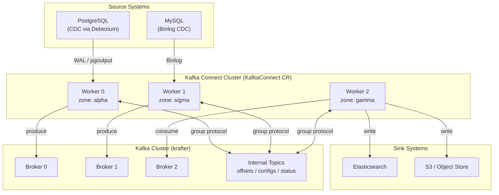

### Why a Separate Chart?

| Aspect | Embedded in kafka-cluster | Standalone connect-cluster |
|--------|:---:|:---:|
| Upgrade independence | ❌ Broker upgrade = Connect restart | ✅ Upgrade Connect without touching brokers |
| Scaling | ❌ Tied to broker chart values | ✅ Independent replica count |
| Failure blast radius | ❌ Bad connector config blocks broker chart | ✅ Connect failures isolated |
| CI/CD pipeline | ❌ Single chart = single pipeline | ✅ Separate lint/test/package/push |
| Environment overlays | ❌ Shared values file | ✅ Dedicated `values-generic.yaml`, `values-prod.yaml` |

## Helm Chart Structure

The `connect-cluster` chart lives at `charts/connect-cluster/` and produces two Strimzi CRDs:

```
charts/connect-cluster/
├── Chart.yaml                          # v1.0.0, appVersion 4.2.0
├── values.yaml                         # Production defaults
├── values-generic.yaml                    # Kind cluster overlay
├── values-dev.yaml                     # Development overlay
├── values-prod.yaml                    # Production overlay
├── values.schema.json                  # Input validation
├── README.md                           # Chart documentation
├── templates/
│   ├── _helpers.tpl                    # Naming, labels, namespace helpers
│   ├── kafka-connect.yaml              # KafkaConnect CR
│   ├── kafka-connectors.yaml           # KafkaConnector CRs
│   ├── validate-connectors.yaml        # Pre-install CI validation hook
│   ├── network-policy.yaml             # Ingress/egress rules
│   ├── service-account.yaml            # Dedicated RBAC
│   ├── service.yaml                    # REST API Service
│   ├── ingress.yaml                    # Optional REST API Ingress
│   ├── prometheus-alerts.yaml          # 8 alert rules
│   ├── pod-monitor.yaml                # Prometheus PodMonitor
│   ├── grafana-dashboard.yaml          # 8-panel dashboard
│   └── tests/
│       └── test-connect-api.yaml       # Helm test pod (REST API health)
└── NOTES.txt                           # Post-install instructions
```

### Deployment

The recommended way to deploy Kafka Connect is through the **Kates CLI**, which handles environment detection, overlay selection, and credential provisioning automatically:

```bash
# Deploy the full stack including Kafka Connect
kates deploy --topology isolated --with-kafka-connect

# Deploy with HA (3 workers)
kates deploy --topology isolated --with-kafka-connect --ha
```

The CLI deploys the `connect-cluster` chart as a separate Helm release, automatically applying the Kind overlay on Kind clusters and provisioning the PostgreSQL credentials secret.

#### Direct Helm (alternative)

For CI pipelines or when fine-grained control is needed:

```bash
# Basic deployment (same namespace as Kafka)
helm upgrade --install connect-cluster charts/connect-cluster \
  --namespace kafka

# With environment overlay
helm upgrade --install connect-cluster charts/connect-cluster \
  --namespace kafka \
  -f charts/connect-cluster/values-prod.yaml
```

## The KafkaConnect Custom Resource

The chart generates a `KafkaConnect` CR that the Strimzi operator reconciles into a Deployment of Connect worker pods:

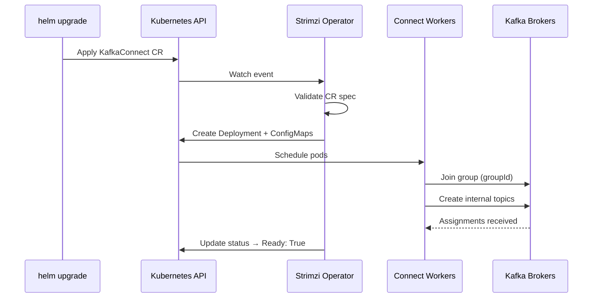

### Key Configuration

| Setting | Default | Purpose |
|---------|---------|---------|
| `groupId` | `kates-connect-cluster` | All workers sharing this ID form a single cluster |
| `replicas` | 3 (prod) / 1 (kind) | Number of worker pods |
| `image` | `ghcr.io/bmscomp/connect:3.0.2` | Pre-built image with Debezium + Apicurio plugins |
| `bootstrapServers` | `krafter-kafka-bootstrap:9093` | TLS-encrypted connection to Kafka |
| `version` | 4.2.0 | Kafka protocol version |

### Internal Topics

Connect stores its state in three compacted Kafka topics:

| Topic | Content | Retention |
|-------|---------|-----------|
| `<groupId>-offsets` | Source connector position / offset tracking | Compacted (forever) |
| `<groupId>-configs` | Connector and task configuration snapshots | Compacted (forever) |
| `<groupId>-status` | Connector and task status updates | Compacted (forever) |

These topics are automatically created by Connect workers on first startup. The `config.storage.replication.factor` is set to 3 to match the broker replication factor.

> [!IMPORTANT]
> Never delete the offsets topic. If deleted, all source connectors lose their position and will re-snapshot their entire database on restart.

### Authentication

Connect authenticates to Kafka using SCRAM-SHA-512 over TLS:

```yaml
authentication:
  type: scram-sha-512
  username: kates-connect
  passwordSecret:
    secretName: kates-connect
    password: password
tls:
  trustedCertificates:
    - secretName: krafter-cluster-ca-cert
      pattern: "*.crt"
```

The `kates-connect` KafkaUser must be created in the Kafka namespace with appropriate ACLs for topic creation, group management, and connector offset storage.

## Connector Lifecycle

### Source Connectors

Source connectors read from an external system and produce to Kafka:

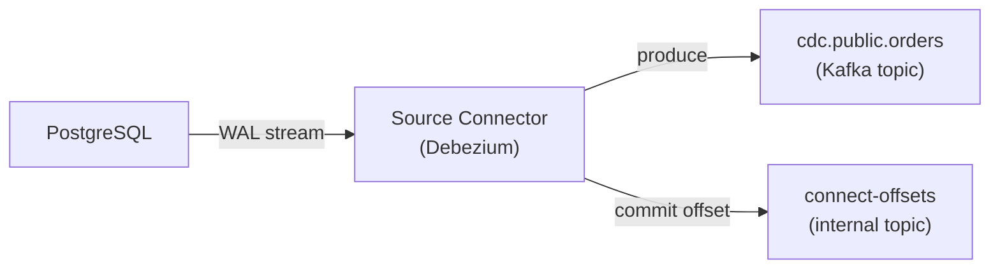

### Sink Connectors

Sink connectors consume from Kafka and write to an external system:

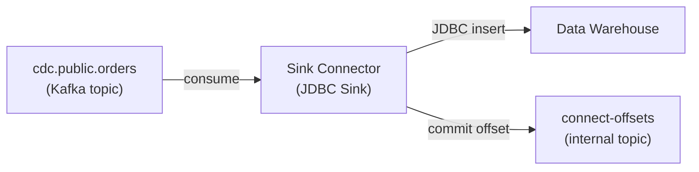

### Connector States

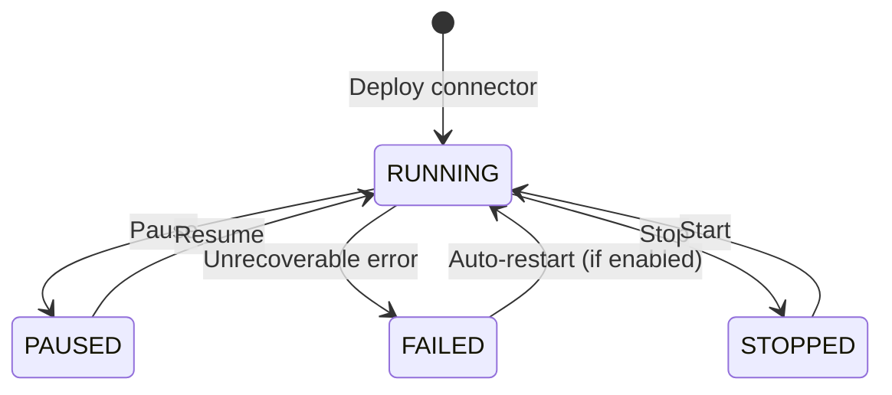

| State | Offset Tracking | Tasks Active | Use Case |
|-------|:-:|:-:|----------|
| `running` | ✅ Advancing | ✅ Yes | Normal operation |
| `paused` | ✅ Preserved | ❌ No | Maintenance window, schema migration |
| `stopped` | ✅ Preserved | ❌ No | Long-term pause, cost savings |
| `failed` | ✅ Preserved | ❌ No | Error — awaiting auto-restart or manual fix |

### Auto-Restart

The chart configures automatic restart for failed connectors:

```yaml
autoRestart:
  enabled: true
  maxRestarts: 10
```

When a connector fails, Strimzi will restart it up to `maxRestarts` times with exponential backoff. This is configured globally and can be overridden per-connector.

## Change Data Capture with Debezium

### The Connect Image

The pre-built Connect image (`ghcr.io/bmscomp/connect:3.0.2`) bundles the following plugins:

| Plugin | Version | Use Case |
|--------|---------|----------|
| Debezium PostgreSQL | 3.0.2.Final | WAL-based CDC from PostgreSQL |
| Debezium MySQL | 3.0.2.Final | Binlog-based CDC from MySQL |
| Debezium MongoDB | 3.0.2.Final | Change stream CDC from MongoDB |
| Debezium SQL Server | 3.0.2.Final | Change Tracking CDC from SQL Server |
| Apicurio Registry Converter | 2.5.11.Final | Schema Registry integration (Avro, JSON Schema, Protobuf) |
| Aiven JDBC Connector | 6.12.0 | Poll-based source/sink for SQL databases |

### PostgreSQL CDC Pipeline

The default Kates CDC pipeline captures changes from a PostgreSQL database:

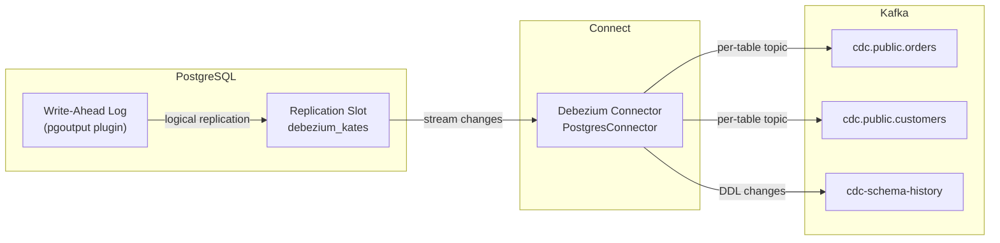

#### Connector Configuration

```yaml
connectors:
  - name: debezium-postgres-source
    class: io.debezium.connector.postgresql.PostgresConnector
    tasksMax: 1
    config:
      database.hostname: postgresql.database.svc
      database.port: "5432"
      database.user: debezium
      database.password: "${dir:/mnt/pg-credentials:password}"
      database.dbname: orders
      topic.prefix: cdc
      schema.include.list: public
      plugin.name: pgoutput
      slot.name: debezium_kates
      heartbeat.interval.ms: "10000"
      snapshot.mode: initial
      decimal.handling.mode: double
      tombstones.on.delete: "true"
```

#### Configuration Deep Dive

| Setting | Value | Rationale |
|---------|-------|-----------|
| `plugin.name: pgoutput` | — | Native PostgreSQL logical decoding plugin (no extra extensions needed) |
| `slot.name: debezium_kates` | — | Named replication slot — survives connector restarts |
| `snapshot.mode: initial` | — | Takes a full snapshot on first run, then switches to streaming |
| `heartbeat.interval.ms: 10000` | — | Prevents WAL retention from growing unbounded on idle tables |
| `tombstones.on.delete: true` | — | Produces a null-value record after a delete — enables downstream compaction |
| `decimal.handling.mode: double` | — | Avoids Avro precision issues with `NUMERIC` columns |

> [!WARNING]
> The `tasksMax` for a Debezium PostgreSQL connector must always be `1`. PostgreSQL logical replication uses a single replication slot per connector — multiple tasks would cause duplicate events or slot conflicts.

### External Configuration (Secrets)

Database credentials are mounted as files via Strimzi's `externalConfiguration`:

```yaml
externalConfiguration:
  volumes:
    - name: pg-credentials
      secretName: connect-pg-credentials
```

This mounts the secret at `/mnt/pg-credentials/` inside each worker pod. Connectors reference values using the `${dir:/mnt/pg-credentials:password}` syntax (Kafka's `DirectoryConfigProvider`).

> [!TIP]
> ConfigMap volumes are also supported. Use `type: configMap` and `configMapName` for non-sensitive data like SMT scripts or external lookup tables.

## Multi-AZ Deployment Strategy

The connect-cluster chart uses the **Stretched Cluster** strategy — a single `KafkaConnect` resource spanning all Availability Zones.

```mermaid
graph TB
    subgraph AZ_Alpha["AZ: alpha"]
        W0["Worker 0"]
    end

    subgraph AZ_Sigma["AZ: sigma"]
        W1["Worker 1"]
    end

    subgraph AZ_Gamma["AZ: gamma"]
        W2["Worker 2"]
    end

    subgraph Kafka_Internal["Shared Internal Topics"]
        OFF["connect-offsets"]
        CFG["connect-configs"]
        STA["connect-status"]
    end

    W0 <-->|"group protocol"| OFF
    W1 <-->|"group protocol"| OFF
    W2 <-->|"group protocol"| OFF

    style AZ_Alpha fill:#1a4a1a
    style AZ_Sigma fill:#1a3a4a
    style AZ_Gamma fill:#4a1a3a
```

### How It Works

- **Single `groupId`:** All workers share `kates-connect-cluster` and one set of internal topics
- **Topology Spread Constraints:** Workers are evenly distributed across zones via `topologySpreadConstraints`
- **Pod Anti-Affinity:** No two workers on the same node

### AZ Failure Behavior

When an entire Availability Zone goes offline:

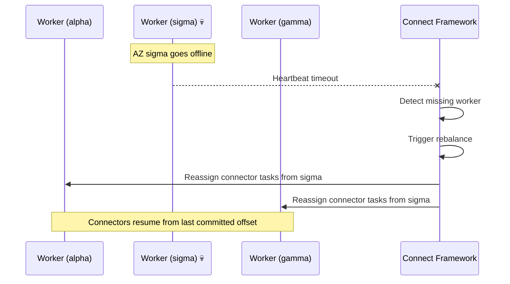

| Event | Behavior |
|-------|----------|
| Worker pod dies | Framework rebalances tasks to surviving workers (seconds) |
| Entire AZ offline | Framework reassigns all tasks from dead workers |
| AZ recovers | Workers rejoin, framework rebalances to restore even distribution |
| Offset continuity | ✅ Preserved — offsets stored in shared Kafka topic |

> [!NOTE]
> Cross-AZ data transfer costs apply when a connector in zone alpha reads from a database in zone sigma. This is an acceptable tradeoff for seamless failover — CDC downtime during a rebalance is typically under 30 seconds.

### Scheduling Configuration

```yaml
# Production (values-prod.yaml)
topologySpreadConstraints:
  enabled: true
  maxSkew: 1
  topologyKey: topology.kubernetes.io/zone
  whenUnsatisfiable: DoNotSchedule

podAntiAffinity:
  enabled: true
  topologyKey: kubernetes.io/hostname

rack:
  enabled: true
  topologyKey: topology.kubernetes.io/zone
```

For Kind clusters, all scheduling constraints are disabled since all pods run on a single node.

## Pre-Deploy Validation

The chart includes a **pre-install/pre-upgrade Helm hook** that validates connector configurations before they reach the Strimzi operator.

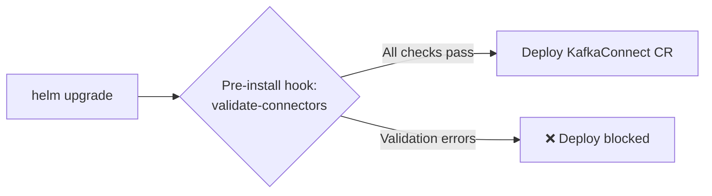

### What It Validates

| Check | Connector Type | Severity |
|-------|---------------|----------|
| `name` present | All | Error |
| `class` present | All | Error |
| `state` is valid enum | All | Error |
| `tasksMax` specified | All | Warning |
| `database.hostname` present | PostgreSQL, MySQL | Error |
| `database.dbname` present | PostgreSQL | Error |
| `topic.prefix` present | PostgreSQL | Warning |
| `plugin.name` present | PostgreSQL | Warning |
| `database.server.id` present | MySQL | Warning |
| `connection.url` present | JDBC Source/Sink | Error |

This catches misconfigurations at `helm upgrade` time rather than at runtime, preventing connector failures that could take minutes to surface.

## Observability

### Prometheus Alerts

The chart deploys 8 alert rules:

| Alert | Condition | Severity |
|-------|-----------|----------|
| `KafkaConnectDown` | No running workers for 5min | critical |
| `KafkaConnectorFailed` | Connector in FAILED state for 2min | critical |
| `KafkaConnectorTaskFailed` | Task in FAILED state for 2min | warning |
| `KafkaConnectRebalancing` | Cluster rebalancing for 10min | warning |
| `KafkaConnectHighLatency` | Connector source lag >60s for 10min | warning |
| `KafkaConnectHighErrorRate` | Error rate >5% for 5min | warning |
| `KafkaConnectWorkerDown` | Worker count < expected for 5min | warning |
| `KafkaConnectRestApiDown` | REST API unreachable for 3min | critical |

### Grafana Dashboard

The dashboard provides 8 panels:

| Panel | Metric | Visualization |
|-------|--------|---------------|
| Worker Count | `kafka_connect_worker_info` | Stat |
| Connector Status | `kafka_connect_connector_status` | Table |
| Task Count (by state) | `kafka_connect_connector_task_status` | Pie chart |
| Source Record Rate | `kafka_connect_source_task_source_record_poll_rate` | Time series |
| Sink Record Rate | `kafka_connect_sink_task_sink_record_send_rate` | Time series |
| Error Rate | `kafka_connect_task_error_total_record_errors` | Time series |
| Rebalance Duration | `kafka_connect_worker_rebalance_rebalance_time_ms_total` | Time series |
| JVM Heap Usage | `jvm_memory_bytes_used{area="heap"}` | Time series |

### Helm Test

The chart includes a test pod that validates the Connect REST API is reachable:

```bash
# Run the CDC integration test via Kates CLI
kates kafka connect test

# Or run the Helm chart test directly
helm test connect-cluster --namespace kafka --timeout 180s --logs
```

The `kates kafka connect test` command runs a full end-to-end CDC integration test against the backend, with a Bubble Tea progress UI showing each phase (DB setup → source deploy → sink deploy → verification).

The Helm test pod runs `curl http://<connect-service>:8083/connectors` and validates a 200 response.

## Environment Overlays

| Setting | Kind | Dev | Prod |
|---------|:----:|:---:|:----:|
| Replicas | 1 | 1 | 3 |
| JVM Heap | 256–512m | 512m | 2048m |
| Memory request/limit | 512Mi/1Gi | 1Gi/2Gi | 4Gi/6Gi |
| Topology spread | Disabled | Disabled | Zone-aware, `DoNotSchedule` |
| Pod anti-affinity | Disabled | Disabled | Per-hostname |
| Rack awareness | Disabled | Disabled | Per-zone |
| Alerts | Off | Off | On |
| PodMonitors | Off | On | On |
| Dashboards | Off | On | On |
| Tracing | Off | OpenTelemetry | OpenTelemetry |
| Priority class | — | — | `system-cluster-critical` |

## CLI Reference

The `kates kafka connect` command group provides a complete operational interface for Kafka Connect:

### Cluster Operations

| Command | Description |
|---------|-------------|
| `kates deploy --with-kafka-connect` | Deploy Connect as part of the full stack |
| `kates kafka connect status` | Show Connect cluster status (KafkaConnect CR) |
| `kates kafka connect scale [replicas]` | Scale Connect workers up/down |
| `kates kafka connect plugins` | List installed connector plugins |
| `kates kafka connect logs [-f]` | Tail Connect worker logs (with optional follow) |
| `kates kafka connect test` | Run end-to-end CDC integration test |

### Connector Management

| Command | Description |
|---------|-------------|
| `kates kafka connect connectors` | List all KafkaConnector CRs |
| `kates kafka connect connector [name]` | Describe a specific connector (YAML output) |
| `kates kafka connect config [name]` | Show connector configuration |
| `kates kafka connect pause [name]` | Pause a connector (preserves offsets) |
| `kates kafka connect resume [name]` | Resume a paused connector |
| `kates kafka connect restart [name]` | Restart a connector |
| `kates kafka connect restart-task [connector] [taskId]` | Restart a specific task |
| `kates kafka connect tasks [name]` | Show task-level status |
| `kates kafka connect delete [name]` | Delete a connector |

All commands accept `-n <namespace>` (defaults to `kafka` or `$KATES_KAFKA_NS`) and `-o json` for machine-readable output.

### Makefile Targets (CI/Chart Development)

For chart development and CI pipelines, Makefile targets are also available:

| Target | Description |
|--------|-------------|
| `make connect-chart-lint` | Lint the chart |
| `make connect-chart-template` | Render templates → `.build/connect-rendered.yaml` |
| `make connect-chart-package` | Package → `.build/connect-cluster-<version>.tgz` |
| `make connect-chart-push` | Push to OCI registry |
| `make connect-chart-all` | lint + template + package |

## Network Policies

The chart generates egress rules for cross-namespace database connections:

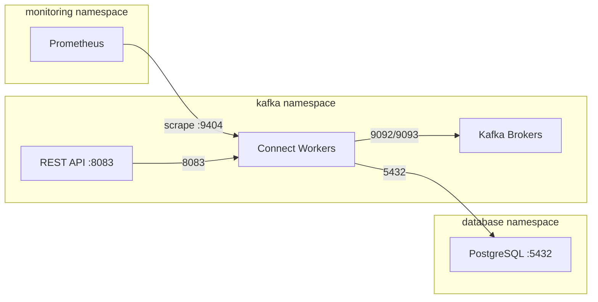

Database egress rules are dynamically generated from `values.yaml`:

```yaml
databaseEgress:
  - namespace: database
    port: 5432
    podSelector:
      app.kubernetes.io/name: postgresql
```

Each entry generates a `NetworkPolicy` egress rule allowing Connect workers to reach the specified pods in the specified namespace.

## REST API & Connector Operations

The Kates CLI wraps the Connect REST API with ergonomic commands:

```bash
# List all connectors
kates kafka connect connectors

# Describe a connector (full YAML)
kates kafka connect connector debezium-postgres-source

# Show connector config only
kates kafka connect config debezium-postgres-source

# Show task-level status
kates kafka connect tasks debezium-postgres-source

# Pause / resume / restart
kates kafka connect pause debezium-postgres-source
kates kafka connect resume debezium-postgres-source
kates kafka connect restart debezium-postgres-source

# Restart a specific task
kates kafka connect restart-task debezium-postgres-source 0

# Scale workers
kates kafka connect scale 5

# Tail logs (with follow)
kates kafka connect logs -f

# JSON output for scripting
kates kafka connect connectors -o json | jq '.[].metadata.name'
```

### Direct REST API Access

The Connect REST API (port 8083) is also exposed via a `ClusterIP` Service for direct access:

```bash
# Port-forward for local access
kubectl port-forward -n kafka svc/connect-cluster-connect-api 8083:8083

# List connectors via REST
curl -s http://localhost:8083/connectors | jq .
```

For external access, enable the Ingress:

```yaml
restApi:
  ingress:
    enabled: true
    className: nginx
    hosts:
      - host: connect.example.com
        paths:
          - path: /
            pathType: Prefix
```

## Exactly-Once Semantics

Kafka Connect supports **exactly-once source** (EOS) delivery — guaranteeing that each source record is written to Kafka exactly once, even if a worker crashes mid-batch.

### How EOS Works

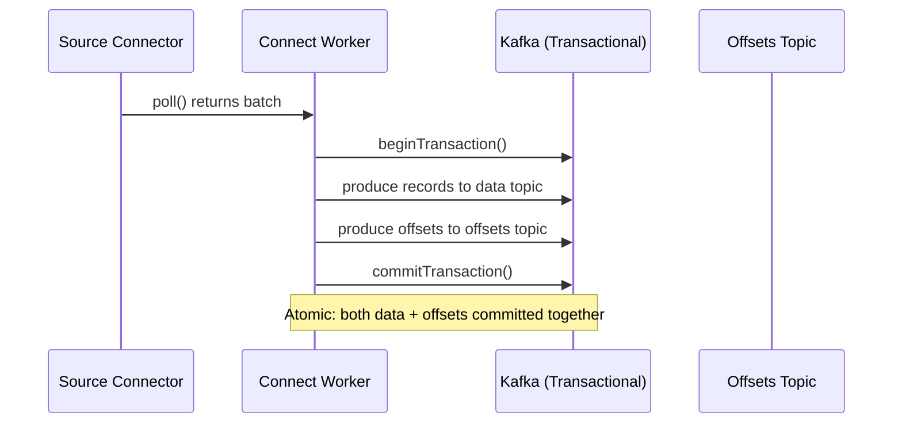

Without EOS, Connect commits offsets and data separately — a crash between the two steps causes duplicates on restart. With EOS enabled, the worker wraps both into a single Kafka transaction.

### Configuration

The chart enables EOS by default:

```yaml
extraConfig:
  exactly.once.source.support: "enabled"
  producer.acks: "all"
  producer.enable.idempotence: "true"
```

| Setting | Value | Purpose |
|---------|-------|---------|
| `exactly.once.source.support` | `enabled` | Wraps source records + offsets in a single transaction |
| `producer.acks` | `all` | Wait for all ISR replicas to acknowledge |
| `producer.enable.idempotence` | `true` | Deduplicates retried produce requests at the broker |

> [!IMPORTANT]
> EOS requires `min.insync.replicas >= 2` on the data topics and `acks=all` on the Connect producer. The krafter cluster satisfies both by default.

### When to Disable EOS

| Scenario | Recommendation |
|----------|---------------|
| Sink-only connectors | Not applicable — EOS is for source connectors only |
| Extremely high throughput (>100k records/s) | EOS adds ~5% latency — benchmark first |
| Non-critical data (metrics, logs) | Disable for better throughput; at-least-once is acceptable |

---

## Single Message Transforms (SMTs)

SMTs are lightweight, in-line transformations applied to each record as it passes through a connector — without requiring a separate stream processing layer.

### Transform Pipeline

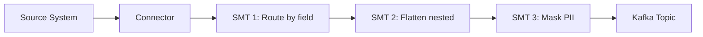

Transforms are chained in order — each receives the output of the previous one.

### Common Transforms

| Transform | Class | Use Case |
|-----------|-------|---------|
| Route records by field | `io.debezium.transforms.ByLogicalTableRouter` | Route to per-tenant topics |
| Flatten nested structs | `org.apache.kafka.connect.transforms.Flatten$Value` | Flatten JSON for downstream consumers |
| Add timestamp | `org.apache.kafka.connect.transforms.InsertField$Value` | Inject processing timestamp |
| Filter by field | `io.debezium.transforms.Filter` | Drop heartbeat or schema-change records |
| Mask sensitive fields | `org.apache.kafka.connect.transforms.MaskField$Value` | Zero-out PII before it reaches Kafka |
| Extract new record state | `io.debezium.transforms.ExtractNewRecordState` | Unwrap Debezium envelope to plain record |
| Set topic name | `org.apache.kafka.connect.transforms.RegexRouter` | Rewrite topic names with regex |

### Example: Unwrap Debezium Envelope + Route by Tenant

```yaml
connectors:
  - name: cdc-orders
    class: io.debezium.connector.postgresql.PostgresConnector
    config:
      # ... database config ...
      transforms: unwrap,route
      transforms.unwrap.type: io.debezium.transforms.ExtractNewRecordState
      transforms.unwrap.drop.tombstones: "false"
      transforms.unwrap.delete.handling.mode: rewrite
      transforms.unwrap.add.fields: "op,source.ts_ms"
      transforms.route.type: org.apache.kafka.connect.transforms.RegexRouter
      transforms.route.regex: "cdc\\.public\\.(.*)"
      transforms.route.replacement: "events.$1"
```

This chain:
1. Unwraps the Debezium envelope (`{before, after, source, op}`) into a flat record
2. Adds `op` and `source.ts_ms` as header fields for consumers
3. Renames `cdc.public.orders` → `events.orders`

> [!TIP]
> The `ExtractNewRecordState` SMT is almost always recommended for Debezium connectors. Without it, downstream consumers must understand the full Debezium envelope schema.

---

## Schema Registry Integration

When Apicurio Registry is deployed alongside Kafka, Connect can serialize records using Avro, JSON Schema, or Protobuf instead of plain JSON — enabling schema evolution and type safety.

### Data Flow with Schema Registry

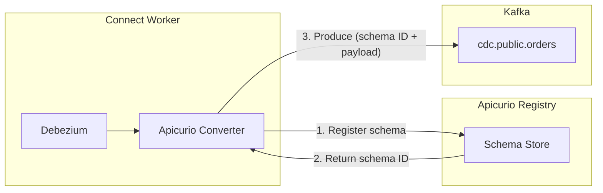

### Configuration

To enable Apicurio Avro serialization:

```yaml
schemaRegistry:
  enabled: true
  serviceName: apicurio-apicurio-registry
  port: 80
  path: /apis/ccompat/v7

config:
  keyConverter: io.apicurio.registry.utils.converter.AvroConverter
  valueConverter: io.apicurio.registry.utils.converter.AvroConverter
  keyConverterSchemasEnable: true
  valueConverterSchemasEnable: true
```

The chart automatically computes the full Schema Registry URL from the service name, port, path, and cluster domain:

```
http://apicurio-apicurio-registry.<namespace>.svc.<clusterDomain>:80/apis/ccompat/v7
```

### Schema Evolution

| Compatibility Mode | What's Allowed | Use Case |
|-------------------|---------------|----------|
| BACKWARD | New schema can read data written by old | Default — consumers upgrade first |
| FORWARD | Old schema can read data written by new | Producers upgrade first |
| FULL | Both backward and forward compatible | Strictest — safest for mission-critical data |
| NONE | Any change allowed | Development only |

> [!WARNING]
> Changing the converter from `JsonConverter` to `AvroConverter` on an existing connector requires reprocessing all data. The existing JSON records in Kafka are not automatically re-serialized. Plan a migration window with a new topic prefix.

---

## Dead Letter Queue (DLQ)

When a sink connector encounters a record it cannot process (malformed data, schema mismatch, downstream failure), it can route the record to a Dead Letter Queue instead of failing the entire task.

### DLQ Flow

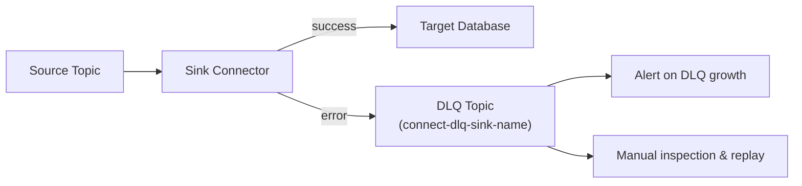

### Configuration

```yaml
connectors:
  - name: jdbc-sink-warehouse
    class: io.aiven.connect.jdbc.JdbcSinkConnector
    config:
      # ... connection config ...
      errors.tolerance: all
      errors.deadletterqueue.topic.name: connect-dlq-jdbc-sink
      errors.deadletterqueue.topic.replication.factor: 3
      errors.deadletterqueue.context.headers.enable: true
      errors.log.enable: true
      errors.log.include.messages: true
```

| Setting | Value | Purpose |
|---------|-------|---------|
| `errors.tolerance` | `all` | Continue processing despite errors (vs. `none` = fail fast) |
| `errors.deadletterqueue.topic.name` | `connect-dlq-*` | DLQ topic name |
| `errors.deadletterqueue.context.headers.enable` | `true` | Include error context (exception, stack trace) in record headers |
| `errors.log.enable` | `true` | Log errors to Connect worker logs |
| `errors.log.include.messages` | `true` | Include the problematic record in the log (disable for sensitive data) |

> [!CAUTION]
> Setting `errors.tolerance: all` without a DLQ silently drops bad records. Always configure a DLQ topic when using tolerant error handling.

---

## Capacity Planning

### Worker Sizing

Each Connect worker consumes memory proportional to the number of tasks it runs and the batch sizes configured:

```
Worker Memory = JVM Heap + Off-Heap
             = (-Xmx) + (Direct Buffers + Thread Stacks + JMX + GC Overhead)
             ≈ -Xmx × 2
```

| Workload | Workers | Heap (-Xmx) | Container Memory | CPU |
|----------|:-------:|:-----------:|:----------------:|:---:|
| 1–3 connectors, low throughput | 1 | 512m | 1Gi | 500m |
| 5–10 connectors, moderate throughput | 2 | 1024m | 2Gi | 1000m |
| 10–20 connectors, high throughput | 3 | 2048m | 4Gi | 2000m |
| 20+ connectors, very high throughput | 5+ | 2048m | 6Gi | 4000m |

### Task Distribution

Connectors are divided into tasks, and tasks are distributed across workers:

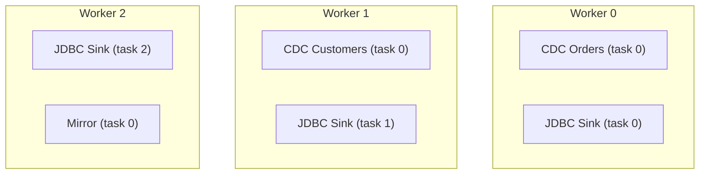

**Rules of thumb:**
- Debezium source connectors: always `tasksMax: 1` (limited by replication slot)
- JDBC sink connectors: `tasksMax` = number of topic partitions (for parallelism)
- Mirror connectors: `tasksMax` = number of source partitions
- Target: 2–5 tasks per worker for optimal CPU utilization

### Throughput Benchmarks

Approximate throughput per worker (single connector, 1Gi heap, 1 CPU):

| Connector Type | Records/second | MB/second | Notes |
|---------------|:--------------:|:---------:|-------|
| Debezium PostgreSQL (streaming) | 5,000–15,000 | 2–10 | Depends on WAL volume |
| Debezium PostgreSQL (snapshot) | 20,000–50,000 | 10–30 | Bulk read, higher throughput |
| JDBC Source (poll) | 1,000–5,000 | 1–5 | Limited by SQL query speed |
| JDBC Sink | 5,000–20,000 | 2–15 | Batched inserts |
| MirrorSource | 50,000–100,000 | 20–50 | Mostly network-bound |

---

## Security & Credential Rotation

### Credential Architecture

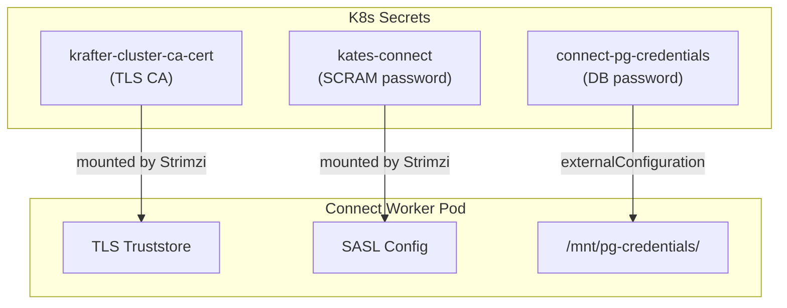

### Rotation Procedures

| Credential | Rotation Method | Downtime |
|-----------|----------------|:--------:|
| Kafka TLS CA | Strimzi auto-rotates 180 days before expiry | Zero — rolling restart |
| SCRAM password | Update `KafkaUser` CR → Strimzi updates Secret | Zero — rolling restart |
| Database password | Update K8s Secret → rolling restart of Connect | ~30s per worker |
| Connect REST API (if exposed) | Ingress-level auth (OAuth2 proxy, mTLS) | N/A |

**Database credential rotation:**

```bash
# 1. Update the secret
kubectl create secret generic connect-pg-credentials \
  -n kafka \
  --from-literal=username=debezium \
  --from-literal=password=NEW_PASSWORD \
  --dry-run=client -o yaml | kubectl apply -f -

# 2. Restart Connect workers to pick up new secret
kubectl rollout restart deployment -n kafka -l strimzi.io/kind=KafkaConnect
```

> [!IMPORTANT]
> Update the database password in PostgreSQL **before** updating the Kubernetes Secret. If you update the Secret first, Connect workers will restart and immediately fail authentication.

---

## Performance Tuning

### Producer Tuning

Connect's internal producer sends records to Kafka. These settings control batching and throughput:

| Setting | Default | Tuned | Effect |
|---------|---------|-------|--------|
| `producer.batch.size` | 16384 | 65536 | Larger batches = fewer requests, higher throughput |
| `producer.linger.ms` | 0 | 10 | Wait up to 10ms to fill batch |
| `producer.buffer.memory` | 33554432 | 67108864 | 64MB producer buffer |
| `producer.compression.type` | none | lz4 | Compress records — reduces network and storage |
| `producer.max.request.size` | 1048576 | 10485760 | 10MB max request — needed for large CDC events |

### Consumer Tuning (Sink Connectors)

| Setting | Default | Tuned | Effect |
|---------|---------|-------|--------|
| `consumer.fetch.min.bytes` | 1 | 65536 | Wait for 64KB before returning fetch |
| `consumer.max.poll.records` | 500 | 2000 | More records per poll = higher throughput |
| `consumer.auto.offset.reset` | `latest` | `earliest` | Chart default — don't miss records |

### Connector-Level Tuning

| Setting | Type | Default | Recommended | Notes |
|---------|------|---------|-------------|-------|
| `poll.interval.ms` | Debezium | 500 | 100–500 | Lower = less latency, more CPU |
| `max.batch.size` | Debezium | 2048 | 4096–8192 | Records per batch from the WAL |
| `max.queue.size` | Debezium | 8192 | 16384 | Internal queue between reader and producer |
| `snapshot.fetch.size` | Debezium | 2048 | 10000 | Rows per SELECT during snapshot |
| `batch.size` | JDBC Sink | 3000 | 5000–10000 | Rows per INSERT batch |

> [!TIP]
> Monitor `kafka_connect_source_task_source_record_poll_rate` and `kafka_connect_source_task_source_record_write_rate` in Grafana. If poll rate >> write rate, the producer is the bottleneck — increase `producer.batch.size` and enable compression.

---

## CDC Patterns

### Pattern 1: Transactional Outbox

The Outbox pattern avoids dual-write problems by writing events to an `outbox` table in the same database transaction as the business data. Debezium captures the outbox table and routes events to Kafka.

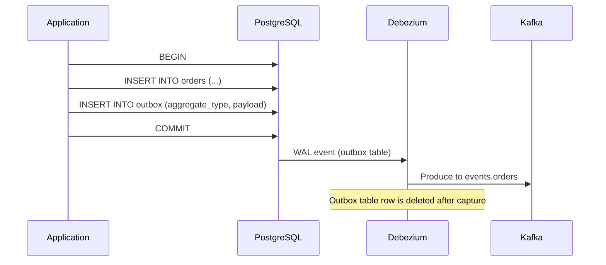

**Connector configuration for Outbox:**

```yaml
config:
  table.include.list: public.outbox
  transforms: outbox
  transforms.outbox.type: io.debezium.transforms.outbox.EventRouter
  transforms.outbox.table.fields.additional.placement: "type:header:eventType"
  transforms.outbox.route.by.field: aggregate_type
  transforms.outbox.route.topic.regex: "(.*)"
  transforms.outbox.route.topic.replacement: "events.$1"
```

### Pattern 2: Event Sourcing via CDC

Capture all state changes as an immutable event log:

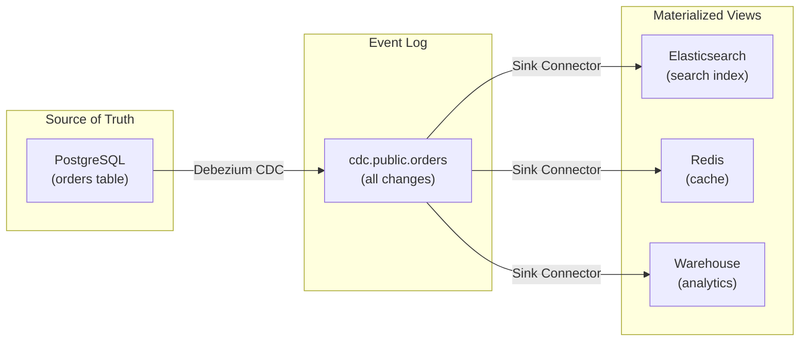

Each materialized view is independently rebuildable by replaying the CDC topic from the beginning (`snapshot.mode: initial`).

### Pattern 3: Cross-Database Sync

Replicate data between databases using a source-to-sink chain:

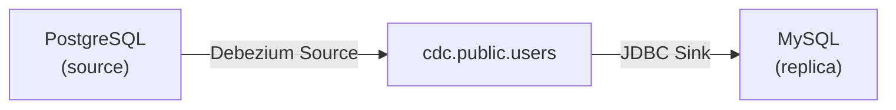

This is useful for:
- Migrating between database engines
- Feeding analytics databases
- Maintaining read replicas across cloud regions

> [!NOTE]
> Cross-database sync introduces eventual consistency. The sink always lags behind the source by the time it takes to process through Kafka. Monitor `kafka_consumergroup_lag` to measure the delay.

---

## Upgrade Procedures

### Upgrading the Connect Image

When a new Debezium or Kafka version is released:

```bash
# 1. Build and push the new image
DBZ_VERSION=3.1.0 make connect-build connect-push

# 2. Deploy with updated image via Kates CLI
kates deploy --with-kafka-connect

# Or update directly via Helm
helm upgrade connect-cluster charts/connect-cluster \
  --namespace kafka --reuse-values \
  --set image=ghcr.io/bmscomp/connect:3.1.0
```

Strimzi performs a **rolling restart** — one worker at a time. Connectors are rebalanced to surviving workers during each restart, ensuring zero downtime.

### Upgrade Checklist

| Step | Action | Verify |
|:----:|--------|--------|
| 1 | Read Debezium migration guide | Breaking changes documented |
| 2 | Build new image on CI | `make connect-build` passes |
| 3 | Deploy to dev/staging | `kates deploy --with-kafka-connect` on dev cluster |
| 4 | Run integration test | `kates kafka connect test` passes |
| 5 | Verify connector status | `kates kafka connect connectors` — all RUNNING, no DLQ growth |
| 6 | Deploy to production | `kates deploy --with-kafka-connect --ha` on prod cluster |
| 7 | Monitor for 24h | No alerts, no lag increase |

### Rolling Back

```bash
# Rollback to previous Helm release
helm rollback connect-cluster -n kafka

# Or pin to previous image
helm upgrade connect-cluster charts/connect-cluster \
  --namespace kafka --reuse-values \
  --set image=ghcr.io/bmscomp/connect:3.0.2
```

> [!WARNING]
> If the new Debezium version changed the internal offset format, rolling back may cause connectors to fail with deserialization errors. Always test in staging first.

---

## Disaster Recovery

### Scenario: Internal Topics Deleted

If the `connect-offsets` topic is accidentally deleted:

1. All source connectors lose their position
2. On restart, they fall back to `snapshot.mode` behavior:
   - `initial` → full database snapshot (hours for large databases)
   - `schema_only` → only new changes (data gap)

**Recovery procedure:**

```bash
# 1. Scale down Connect workers
kates kafka connect scale 0

# 2. Scale back up — workers recreate internal topics on startup
kates kafka connect scale 3

# 3. Monitor snapshot progress
kates kafka connect logs -f
```

### Scenario: Connect Cluster Completely Lost

If the entire Connect deployment is destroyed:

```bash
# 1. Redeploy via Kates CLI
kates deploy --with-kafka-connect --ha

# 2. Connectors defined in values.yaml are automatically recreated
# 3. If offsets topic still exists in Kafka, connectors resume from last position
# 4. If offsets topic is also lost, connectors re-snapshot
```

> [!TIP]
> The internal topics (`*-offsets`, `*-configs`, `*-status`) are the only persistent state for the Connect cluster. As long as these topics survive in Kafka (with RF=3), the Connect cluster is fully rebuildable from the Helm chart alone.

### Backup Strategy

The Connect cluster itself is stateless — all state lives in Kafka topics. Backup strategy:

| Component | Backup Method | RPO |
|-----------|-------------|:---:|
| Connector configs | Version-controlled in `values.yaml` | 0 |
| Connector offsets | Kafka topic with RF=3 | 0 (unless all brokers fail) |
| Database credentials | Kubernetes Secret backup (Velero) | Daily |
| Connect image | OCI registry + Dockerfile in Git | 0 |

---

## Troubleshooting

### Connector Stuck in FAILED State

**Symptom:** `KafkaConnector` status shows `FAILED` with `io.debezium.DebeziumException`

**Diagnosis:**

```bash
# Check connector status
kates kafka connect connectors
kates kafka connect connector debezium-postgres-source

# Check Connect worker logs
kates kafka connect logs
```

**Common causes:**

| Error | Cause | Fix |
|-------|-------|-----|
| `PSQLException: FATAL: password authentication failed` | Wrong credentials in secret | Update `connect-pg-credentials` secret |
| `replication slot "debezium_kates" is active` | Previous connector instance still holding the slot | Restart the connector or drop the slot manually |
| `could not access file "pgoutput"` | PostgreSQL `wal_level` is not `logical` | Set `wal_level = logical` in PostgreSQL config |
| `No matching table(s) in schema "public"` | `schema.include.list` doesn't match any tables | Verify the schema and table names exist |

### Rebalancing Takes Too Long

**Symptom:** Connect cluster stuck in `REBALANCING` state for minutes

**Cause:** Large number of connectors/tasks + default `group.initial.rebalance.delay.ms` of 3000ms

**Fix:** The chart sets `group.initial.rebalance.delay.ms: 3000`. If rebalancing takes more than 5 minutes, check for:
- Workers crashing during rebalance (check pod events)
- Network policies blocking inter-worker communication on port 8083
- Insufficient memory causing OOM kills during task assignment

### Connect Workers OOMKilled

**Symptom:** Pods restarting with `OOMKilled` exit reason

**Cause:** JVM heap (`-Xmx`) + off-heap memory exceeds the container memory limit

**Fix:** Ensure `resources.limits.memory` is at least 2× the `-Xmx` value to account for off-heap memory (direct buffers, thread stacks, JMX):

```yaml
jvmOptions:
  -Xmx: 1024m          # 1Gi heap
resources:
  limits:
    memory: 2Gi         # 2× heap = headroom for off-heap
```

### Replication Slot WAL Retention Growing

**Symptom:** PostgreSQL disk usage growing rapidly, `pg_replication_slots` shows large `wal_status`

**Cause:** The Debezium connector is down or paused, but the replication slot retains WAL segments

**Fix:**
1. Resume or restart the connector to drain the slot
2. If the connector is permanently removed, drop the slot:

```sql
SELECT pg_drop_replication_slot('debezium_kates');
```

3. Enable heartbeat to prevent WAL retention on idle tables:

```yaml
heartbeat.interval.ms: "10000"
```

### Validation Hook Blocks Deployment

**Symptom:** `helm upgrade` hangs or fails with "validation FAILED"

**Cause:** The pre-install hook detected missing required fields in connector configs

**Fix:** Read the hook pod logs to see which fields are missing:

```bash
kubectl logs -n kafka -l helm.sh/hook=pre-install --tail=50
```

Fix the connector configs in `values.yaml` and re-run `helm upgrade`.

## Version Matrix

| Component | Version | Notes |
|-----------|---------|-------|
| Kafka Connect | 4.2.0 | Matches broker version |
| Strimzi Operator | 1.0.0 | Manages KafkaConnect CR |
| Debezium | 3.0.2.Final | CDC connectors for PostgreSQL, MySQL, MongoDB, SQL Server |
| Apicurio Converter | 2.5.11.Final | Schema Registry integration |
| Aiven JDBC | 6.12.0 | Apache 2.0 licensed JDBC connector |
| Connect Image | `ghcr.io/bmscomp/connect:3.0.2` | Pre-built with all plugins |
| Helm Chart | 1.0.0 | `charts/connect-cluster` |
