# Kafka Connect & CDC Pipelines

This chapter covers the **connect-cluster** Helm chart — a standalone deployment of Kafka Connect on Kubernetes, managed by the Strimzi operator. It explains the architecture, connector lifecycle, Change Data Capture (CDC) patterns with Debezium, multi-AZ deployment strategy, observability, and operational procedures.

> **Scope**: this chapter covers Kafka Connect concepts and building CDC pipelines — architecture, the `KafkaConnect` resource, connectors, Debezium, transforms, schema management, and delivery semantics. Day-2 concerns (scaling, tuning, security rotation, upgrades, disaster recovery, troubleshooting) live in [Operating Kafka Connect](operating-kafka-connect.md).

## Architecture Overview

Kafka Connect runs as a distributed cluster of worker processes that execute connectors. Each connector is a plugin that moves data between Kafka and an external system (database, object store, search index). The Kates platform deploys Connect as a **separate Helm chart** decoupled from the Kafka broker chart, enabling independent scaling, upgrades, and lifecycle management.

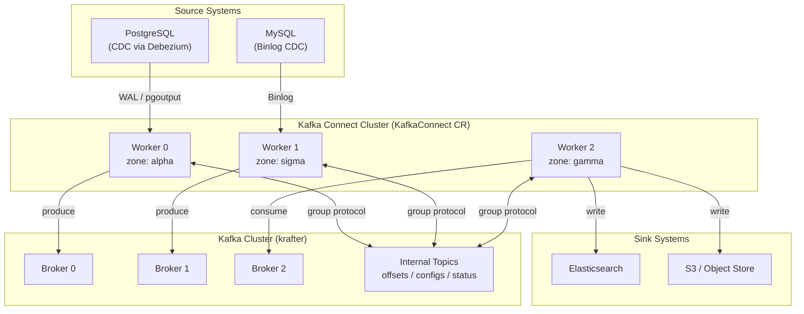

### Why a Separate Chart?

| Aspect | Embedded in kafka-cluster | Standalone connect-cluster |
|--------|:---:|:---:|
| Upgrade independence | ❌ Broker upgrade = Connect restart | ✅ Upgrade Connect without touching brokers |
| Scaling | ❌ Tied to broker chart values | ✅ Independent replica count |
| Failure blast radius | ❌ Bad connector config blocks broker chart | ✅ Connect failures isolated |
| CI/CD pipeline | ❌ Single chart = single pipeline | ✅ Separate lint/test/package/push |
| Environment overlays | ❌ Shared values file | ✅ Dedicated `values-generic.yaml`, `values-prod.yaml` |

## Helm Chart Structure

The `connect-cluster` chart lives at `charts/connect-cluster/` and produces the Strimzi `KafkaConnect` and `KafkaConnector` resources (plus an optional chart-managed `KafkaUser`):

```text
charts/connect-cluster/
├── Chart.yaml                          # v1.2.0, appVersion 4.2.0
├── values.yaml                         # Production defaults
├── values-generic.yaml                 # Generic cluster overlay (no Prometheus CRDs)
├── values-kind.yaml                    # Kind overlay (generic + local DB egress, Schema Registry)
├── values-dev.yaml                     # Development overlay
├── values-prod.yaml                    # Production overlay
├── values.schema.json                  # Input validation
├── README.md                           # Chart documentation
└── templates/
    ├── NOTES.txt                       # Post-install instructions
    ├── _helpers.tpl                    # Naming, labels, namespace helpers
    ├── kafka-connect.yaml              # KafkaConnect CR
    ├── connectors.yaml                 # KafkaConnector CRs
    ├── kafka-user.yaml                 # Managed KafkaUser (SCRAM + auto ACLs)
    ├── kafka-user-secret-sync.yaml     # Cross-namespace credentials Secret sync
    ├── kafka-connect-logging.yaml      # External log4j configuration
    ├── metrics-configmap-connect.yaml  # JMX Prometheus exporter rules
    ├── validate-connectors.yaml        # Pre-install/pre-upgrade validation hook
    ├── networkpolicies.yaml            # Explicit ingress/egress allow rules
    ├── networkpolicy-default-deny.yaml # Default-deny policy for Connect pods
    ├── secret-reader-rbac.yaml         # RBAC for KubernetesSecretConfigProvider
    ├── serviceaccount.yaml             # Dedicated ServiceAccount
    ├── service-rest-api.yaml           # REST API Service
    ├── ingress.yaml                    # Optional REST API Ingress
    ├── hpa.yaml                        # Optional HorizontalPodAutoscaler
    ├── alerts-connect.yaml             # Prometheus alert rules
    ├── podmonitor-connect.yaml         # Prometheus PodMonitor
    ├── dashboard-connect.yaml          # Grafana dashboard
    └── tests/
        ├── test-connect.yaml           # Helm test pod (REST API connectivity)
        ├── test-connectors.yaml        # helm-test example KafkaConnectors
        └── test-topics.yaml            # helm-test KafkaTopics
```

### Deployment

The recommended way to deploy Kafka Connect is through the **Kates CLI**, which handles environment detection, overlay selection, and credential provisioning automatically:

```bash
# Deploy the full stack including Kafka Connect
# (--ha defaults to true, so this gives you 3 workers)
kates deploy --topology isolated --with-kafka-connect

# Single-worker deployment (resource-constrained clusters)
kates deploy --topology isolated --with-kafka-connect --ha=false
```

The CLI deploys the `connect-cluster` chart as a separate Helm release (into the `connect` namespace by default under the isolated topology), automatically applying the Kind overlay on Kind clusters and provisioning the PostgreSQL credentials secret.

#### Direct Helm (alternative)

For CI pipelines or when fine-grained control is needed:

```bash
# Basic deployment (same namespace as Kafka)
helm upgrade --install connect-cluster charts/connect-cluster \
  --namespace kafka

# With environment overlay
helm upgrade --install connect-cluster charts/connect-cluster \
  --namespace kafka \
  -f charts/connect-cluster/values-prod.yaml
```

## The KafkaConnect Custom Resource

The chart generates a `KafkaConnect` CR that the Strimzi operator reconciles into a Deployment of Connect worker pods:

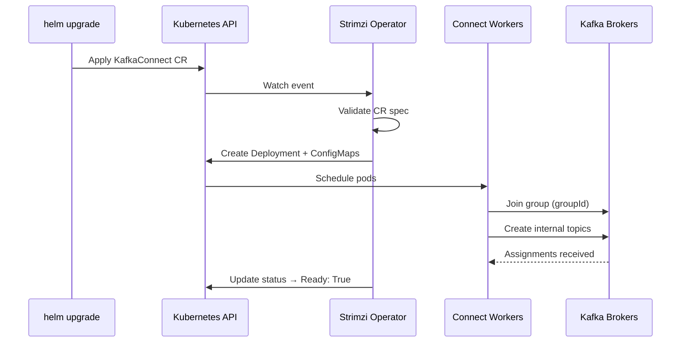

### Key Configuration

| Setting | Default | Purpose |
|---------|---------|---------|
| `groupId` | `kates-connect-cluster` | All workers sharing this ID form a single cluster |
| `replicas` | 3 (the CLI sets 1 with `--ha=false`; the dev overlay uses 1) | Number of worker pods |
| `image` | `ghcr.io/bmscomp/connect:3.6.0` | Pre-built image with Debezium + Apicurio plugins |
| `kafka.bootstrapServers` | `""` — computed as `<clusterName>-kafka-bootstrap.<ns>.svc:9092` (9093 when `kafka.tls.enabled`) | Connection to Kafka |
| `version` | 4.2.0 | Kafka protocol version |

### Internal Topics

Connect stores its state in three compacted Kafka topics:

| Topic | Content | Retention |
|-------|---------|-----------|
| `<groupId>-offsets` | Source connector position / offset tracking | Compacted (forever) |
| `<groupId>-configs` | Connector and task configuration snapshots | Compacted (forever) |
| `<groupId>-status` | Connector and task status updates | Compacted (forever) |

These topics are automatically created by Connect workers on first startup. The `config.storage.replication.factor` is set to 3 to match the broker replication factor.

::: {.callout-important}
Never delete the offsets topic. If deleted, all source connectors lose their position and will re-snapshot their entire database on restart.
:::

### Authentication

Connect authenticates to Kafka using SCRAM-SHA-512 (TLS is off by default and switched on with `kafka.tls.enabled`):

```yaml
authentication:
  type: scram-sha-512
  username: kates-connect
  passwordSecret:
    secretName: kates-connect
    password: password
tls:
  trustedCertificates:
    - secretName: krafter-cluster-ca-cert
      certificate: ca.crt
```

The `kates-connect` KafkaUser can be managed by the chart itself: setting `kafkaUser.create: true` provisions the `KafkaUser` in the Kafka namespace, and with `authorization.mode: auto` derives least-privilege ACLs from the chart values (`groupId`, the internal topics, exactly-once transactional IDs, and the data-topic prefixes in `kafkaUser.topicGrants`). When Connect runs in a different namespace than Kafka, `kafkaUser.secretSync` makes the generated credentials Secret available in the Connect namespace — either via a hook Job that copies it (re-run on upgrades for rotation) or via kubernetes-reflector annotations. This requires the Strimzi User Operator; the ACLs take effect when the Kafka cluster has authorization enabled.

## Connector Lifecycle

### Source Connectors

Source connectors read from an external system and produce to Kafka:

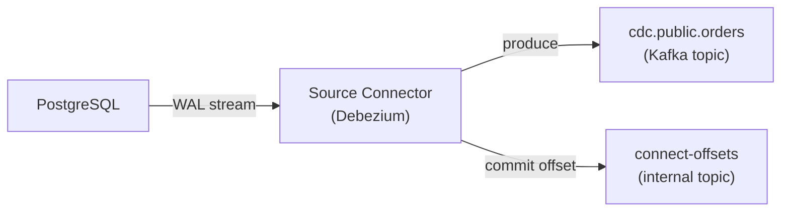

### Sink Connectors

Sink connectors consume from Kafka and write to an external system:

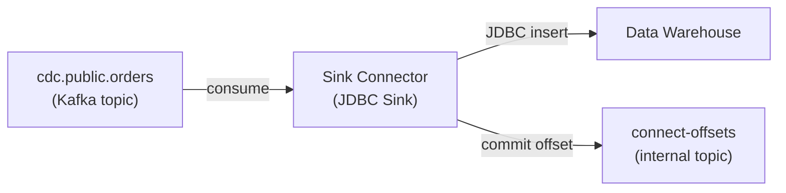

### Connector States

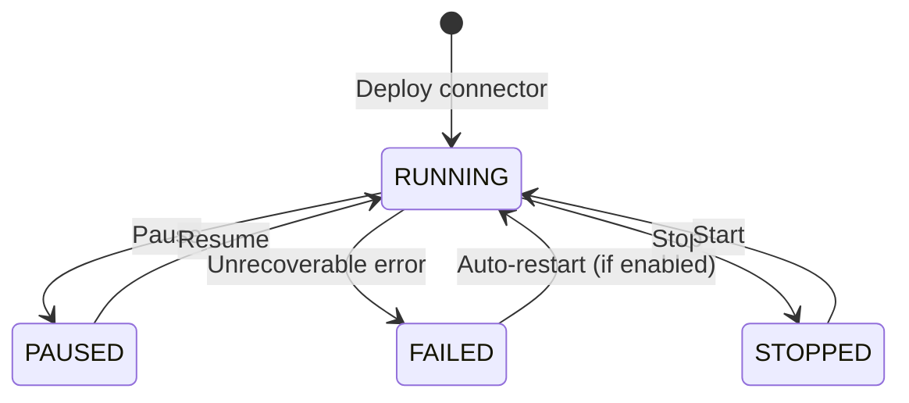

| State | Offset Tracking | Tasks Active | Use Case |
|-------|:-:|:-:|----------|
| `running` | ✅ Advancing | ✅ Yes | Normal operation |
| `paused` | ✅ Preserved | ❌ No | Maintenance window, schema migration |
| `stopped` | ✅ Preserved | ❌ No | Long-term pause, cost savings |
| `failed` | ✅ Preserved | ❌ No | Error — awaiting auto-restart or manual fix |

### Auto-Restart

The chart configures automatic restart for failed connectors:

```yaml
autoRestart:
  enabled: true
  maxRestarts: 10
```

When a connector fails, Strimzi will restart it up to `maxRestarts` times with exponential backoff. This is configured globally and can be overridden per-connector.

## Change Data Capture with Debezium

### The Connect Image

The pre-built Connect image (`ghcr.io/bmscomp/connect:3.6.0`) bundles the following plugins:

| Plugin | Version | Use Case |
|--------|---------|----------|
| Debezium PostgreSQL | 3.6.0.Final | WAL-based CDC from PostgreSQL |
| Debezium MySQL | 3.6.0.Final | Binlog-based CDC from MySQL |
| Debezium MongoDB | 3.6.0.Final | Change stream CDC from MongoDB |
| Debezium SQL Server | 3.6.0.Final | Change Tracking CDC from SQL Server |
| Debezium Oracle | 3.6.0.Final | CDC from Oracle LogMiner/XStream |
| Debezium Db2 | 3.6.0.Final | CDC from IBM Db2 ASN capture |
| Debezium Scripting | 3.6.0.Final | SMT for filtering and routing with Groovy 5 JSR-223 |
| Apicurio Registry Converter | 3.3.0 | Schema Registry integration (Avro, JSON Schema, Protobuf) |
| Debezium JDBC Sink | 3.6.0.Final | Upsert sink for SQL databases |

### Extending the Image with Additional Plugins

While the pre-built image contains the most common CDC connectors, you may need additional plugins (e.g., S3 Sink, Elasticsearch Sink). There are two ways to add plugins at runtime without rebuilding the Docker image:

#### 1. Using Strimzi `spec.build` (Recommended)

Strimzi can download plugins from Maven Central and build a new image automatically during operator reconciliation. Enable this in `values.yaml`:

```yaml
build:
  output:
    type: docker
    image: "ghcr.io/bmscomp/connect:custom"
    pushSecret: my-registry-credentials
  plugins:
    - name: camel-s3-sink
      artifacts:
        - type: maven
          group: org.apache.camel.kafkaconnector
          artifact: camel-aws-s3-sink-kafka-connector
          version: "4.8.3"
```

#### 2. Using the Plugin Loader Script

For environments where Strimzi image builds aren't possible, the repo ships `scripts/connect-plugin-loader.sh`, which downloads plugin JARs from Maven Central and extracts them into a `/plugins` directory:

```bash
EXTRA_PLUGINS="org.apache.camel.kafkaconnector:camel-aws-s3-sink-kafka-connector:4.8.3" \
  ./scripts/connect-plugin-loader.sh
```

The script is written to run as an init container that populates a shared volume on the worker's `plugin.path`, but the chart does not wire this up for you — its `template.pod` passthrough only covers pod metadata, so using the script this way means customizing the `KafkaConnect` resource yourself. In most cases, prefer `spec.build` above or bake the plugins into the image (`make connect-build`).

### PostgreSQL CDC Pipeline

The default Kates CDC pipeline captures changes from a PostgreSQL database:

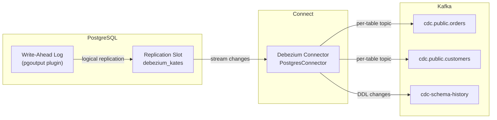

#### Connector Configuration

```yaml
connectors:
  - name: debezium-postgres-source
    class: io.debezium.connector.postgresql.PostgresConnector
    tasksMax: 1
    config:
      database.hostname: postgresql.database.svc
      database.port: "5432"
      database.user: debezium
      database.password: "${secrets:connect/connect-pg-credentials:password}"
      database.dbname: orders
      topic.prefix: cdc
      schema.include.list: public
      plugin.name: pgoutput
      slot.name: debezium_kates
      heartbeat.interval.ms: "10000"
      snapshot.mode: initial
      decimal.handling.mode: double
      tombstones.on.delete: "true"
```

#### Configuration Deep Dive

| Setting | Value | Rationale |
|---------|-------|-----------|
| `plugin.name: pgoutput` | — | Native PostgreSQL logical decoding plugin (no extra extensions needed) |
| `slot.name: debezium_kates` | — | Named replication slot — survives connector restarts |
| `snapshot.mode: initial` | — | Takes a full snapshot on first run, then switches to streaming |
| `heartbeat.interval.ms: 10000` | — | Prevents WAL retention from growing unbounded on idle tables |
| `tombstones.on.delete: true` | — | Produces a null-value record after a delete — enables downstream compaction |
| `decimal.handling.mode: double` | — | Avoids Avro precision issues with `NUMERIC` columns |

::: {.callout-warning}
The `tasksMax` for a Debezium PostgreSQL connector must always be `1`. PostgreSQL logical replication uses a single replication slot per connector — multiple tasks would cause duplicate events or slot conflicts.
:::

### External Configuration (Secrets)

The chart enables three Kafka config providers on every worker — `file`, `dir`, and `secrets` (Strimzi's `KubernetesSecretConfigProvider`):

```yaml
config.providers: file,dir,secrets
config.providers.file.class: org.apache.kafka.common.config.provider.FileConfigProvider
config.providers.dir.class: org.apache.kafka.common.config.provider.DirectoryConfigProvider
config.providers.secrets.class: io.strimzi.kafka.KubernetesSecretConfigProvider
```

Connectors reference Kubernetes Secrets directly with the `${secrets:<namespace>/<secret-name>:<key>}` syntax — no volume mounts required. The chart's `secret-reader-rbac.yaml` grants the Connect ServiceAccount read access to Secrets in its namespace.

::: {.callout-tip}
By default the secret-reader Role covers all Secrets in the namespace. Set `rbac.secretNames` to narrow the grant to the specific Secrets your connectors reference.
:::

## Pre-Deploy Validation

The chart includes a **pre-install/pre-upgrade Helm hook** that validates connector configurations before they reach the Strimzi operator.

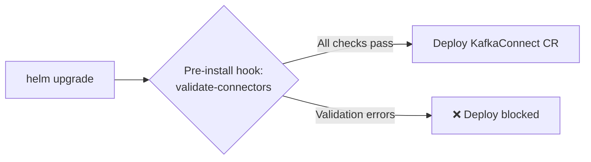

### What It Validates

| Check | Connector Type | Severity |
|-------|---------------|----------|
| `name` present | All | Error |
| `class` present | All | Error |
| `state` is valid enum | All | Error |
| `tasksMax` specified | All | Warning |
| `database.hostname` present | PostgreSQL, MySQL | Error |
| `database.dbname` present | PostgreSQL | Error |
| `topic.prefix` present | PostgreSQL | Warning |
| `plugin.name` present | PostgreSQL | Warning |
| `database.server.id` present | MySQL | Warning |
| `connection.url` present | JDBC Source/Sink | Error |

This catches misconfigurations at `helm upgrade` time rather than at runtime, preventing connector failures that could take minutes to surface.

## Environment Overlays

The Kates CLI applies `values-kind.yaml` on Kind clusters and `values-generic.yaml` on other clusters — the two are identical except that the Kind overlay adds database egress to the local `kates` namespace and enables the Schema Registry integration. `values-dev.yaml` and `values-prod.yaml` are for direct Helm use. Cells marked *(base)* are inherited from `values.yaml` rather than set by the overlay:

| Setting | Kind/Generic | Dev | Prod |
|---------|:----:|:---:|:----:|
| Replicas | 3 *(base)* — CLI sets 1 with `--ha=false` | 1 | 3 |
| JVM Heap | 1024m *(base)* | 512m | 2048m |
| Memory request/limit | 2Gi/4Gi *(base)* | 1Gi/2Gi | 4Gi/6Gi |
| Topology spread | Zone-aware, `ScheduleAnyway` *(base)* | Disabled | Zone-aware, `DoNotSchedule` |
| Pod anti-affinity | Per-hostname *(base)* | Disabled | Per-hostname |
| Alerts | Off | Off | On |
| PodMonitors | Off | On | On |
| Dashboards | Off | On | On |
| Tracing | Off | OpenTelemetry | OpenTelemetry |
| Schema Registry | On (Kind only) | Off *(base)* | Off *(base)* |
| Priority class | `system-cluster-critical` *(base)* | — (cleared) | `system-cluster-critical` |

## CLI Reference

The `kates kafka connect` command group provides a complete operational interface for Kafka Connect:

### Cluster Operations

| Command | Description |
|---------|-------------|
| `kates deploy --with-kafka-connect` | Deploy Connect as part of the full stack |
| `kates kafka connect status` | Show Connect cluster status (KafkaConnect CR) |
| `kates kafka connect scale [replicas]` | Scale Connect workers up/down |
| `kates kafka connect plugins` | List installed connector plugins |
| `kates kafka connect logs [-f]` | Tail Connect worker logs (with optional follow) |
| `kates kafka connect test` | Run end-to-end CDC integration test |

### Connector Management

| Command | Description |
|---------|-------------|
| `kates kafka connect connectors` | List all KafkaConnector CRs |
| `kates kafka connect connector [name]` | Describe a specific connector (YAML output) |
| `kates kafka connect config [name]` | Show connector configuration |
| `kates kafka connect pause [name]` | Pause a connector (preserves offsets) |
| `kates kafka connect resume [name]` | Resume a paused connector |
| `kates kafka connect restart [name]` | Restart a connector |
| `kates kafka connect restart-task [connector] [taskId]` | Restart a specific task |
| `kates kafka connect tasks [name]` | Show task-level status |
| `kates kafka connect delete [name]` | Delete a connector |

All commands accept `-n <namespace>` (resolved as `$KATES_CONNECT_NS` → auto-detect from the cluster's `KafkaConnect` CRs → `$KATES_KAFKA_NS` → `kafka`) and `-o json` for machine-readable output.

### Makefile Targets (CI/Chart Development)

For chart development and CI pipelines, Makefile targets are also available:

| Target | Description |
|--------|-------------|
| `make connect-chart-lint` | Lint the chart |
| `make connect-chart-template` | Render templates → `.build/connect-rendered.yaml` |
| `make connect-chart-package` | Package → `.build/connect-cluster-<version>.tgz` |
| `make connect-chart-push` | Push to OCI registry |
| `make connect-chart-all` | lint + template + package |

## Exactly-Once Semantics

Kafka Connect supports **exactly-once source** (EOS) delivery — guaranteeing that each source record is written to Kafka exactly once, even if a worker crashes mid-batch.

### How EOS Works

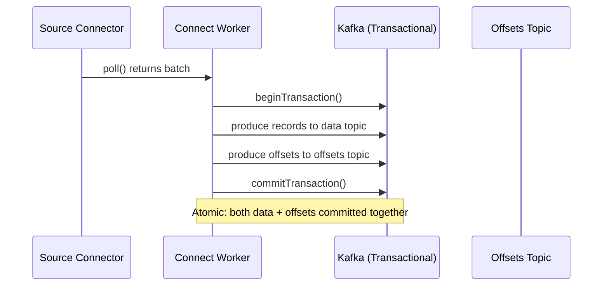

Without EOS, Connect commits offsets and data separately — a crash between the two steps causes duplicates on restart. With EOS enabled, the worker wraps both into a single Kafka transaction.

### Configuration

The chart enables EOS by default:

```yaml
extraConfig:
  exactly.once.source.support: "enabled"
  producer.acks: "all"
  producer.enable.idempotence: "true"
```

| Setting | Value | Purpose |
|---------|-------|---------|
| `exactly.once.source.support` | `enabled` | Wraps source records + offsets in a single transaction |
| `producer.acks` | `all` | Wait for all ISR replicas to acknowledge |
| `producer.enable.idempotence` | `true` | Deduplicates retried produce requests at the broker |

::: {.callout-important}
EOS requires `min.insync.replicas >= 2` on the data topics and `acks=all` on the Connect producer. The krafter cluster satisfies both by default.
:::

### When to Disable EOS

| Scenario | Recommendation |
|----------|---------------|
| Sink-only connectors | Not applicable — EOS is for source connectors only |
| Extremely high throughput (>100k records/s) | EOS adds ~5% latency — benchmark first |
| Non-critical data (metrics, logs) | Disable for better throughput; at-least-once is acceptable |

---

## Single Message Transforms (SMTs)

SMTs are lightweight, in-line transformations applied to each record as it passes through a connector — without requiring a separate stream processing layer.

### Transform Pipeline

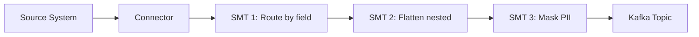

Transforms are chained in order — each receives the output of the previous one.

### Common Transforms

| Transform | Class | Use Case |
|-----------|-------|---------|
| Route records by field | `io.debezium.transforms.ByLogicalTableRouter` | Route to per-tenant topics |
| Flatten nested structs | `org.apache.kafka.connect.transforms.Flatten$Value` | Flatten JSON for downstream consumers |
| Add timestamp | `org.apache.kafka.connect.transforms.InsertField$Value` | Inject processing timestamp |
| Filter by field | `io.debezium.transforms.Filter` | Drop heartbeat or schema-change records |
| Mask sensitive fields | `org.apache.kafka.connect.transforms.MaskField$Value` | Zero-out PII before it reaches Kafka |
| Extract new record state | `io.debezium.transforms.ExtractNewRecordState` | Unwrap Debezium envelope to plain record |
| Set topic name | `org.apache.kafka.connect.transforms.RegexRouter` | Rewrite topic names with regex |

### Example: Unwrap Debezium Envelope + Route by Tenant

```yaml
connectors:
  - name: cdc-orders
    class: io.debezium.connector.postgresql.PostgresConnector
    config:
      # ... database config ...
      transforms: unwrap,route
      transforms.unwrap.type: io.debezium.transforms.ExtractNewRecordState
      transforms.unwrap.drop.tombstones: "false"
      transforms.unwrap.delete.handling.mode: rewrite
      transforms.unwrap.add.fields: "op,source.ts_ms"
      transforms.route.type: org.apache.kafka.connect.transforms.RegexRouter
      transforms.route.regex: "cdc\\.public\\.(.*)"
      transforms.route.replacement: "events.$1"
```

This chain:
1. Unwraps the Debezium envelope (`{before, after, source, op}`) into a flat record
2. Adds `op` and `source.ts_ms` as header fields for consumers
3. Renames `cdc.public.orders` → `events.orders`

::: {.callout-tip}
The `ExtractNewRecordState` SMT is almost always recommended for Debezium connectors. Without it, downstream consumers must understand the full Debezium envelope schema.
:::

---

## Schema Registry Integration

When Apicurio Registry is deployed alongside Kafka, Connect can serialize records using Avro, JSON Schema, or Protobuf instead of plain JSON — enabling schema evolution and type safety.

### Data Flow with Schema Registry

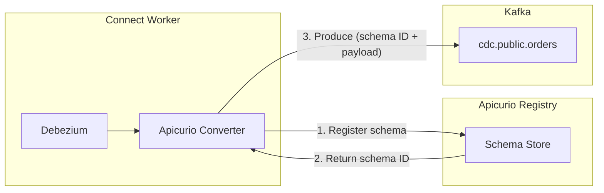

### Configuration

To enable Apicurio Avro serialization:

```yaml
schemaRegistry:
  enabled: true
  serviceName: apicurio-apicurio-registry
  port: 80
  path: /apis/ccompat/v7

config:
  keyConverter: io.apicurio.registry.utils.converter.AvroConverter
  valueConverter: io.apicurio.registry.utils.converter.AvroConverter
  keyConverterSchemasEnable: true
  valueConverterSchemasEnable: true
```

The chart automatically computes the full Schema Registry URL from the service name, port, path, and cluster domain:

```text
http://apicurio-apicurio-registry.<namespace>.svc.<clusterDomain>:80/apis/ccompat/v7
```

### Schema Evolution

| Compatibility Mode | What's Allowed | Use Case |
|-------------------|---------------|----------|
| BACKWARD | New schema can read data written by old | Default — consumers upgrade first |
| FORWARD | Old schema can read data written by new | Producers upgrade first |
| FULL | Both backward and forward compatible | Strictest — safest for mission-critical data |
| NONE | Any change allowed | Development only |

::: {.callout-warning}
Changing the converter from `JsonConverter` to `AvroConverter` on an existing connector requires reprocessing all data. The existing JSON records in Kafka are not automatically re-serialized. Plan a migration window with a new topic prefix.
:::

---

## Dead Letter Queue (DLQ)

When a sink connector encounters a record it cannot process (malformed data, schema mismatch, downstream failure), it can route the record to a Dead Letter Queue instead of failing the entire task.

### DLQ Flow

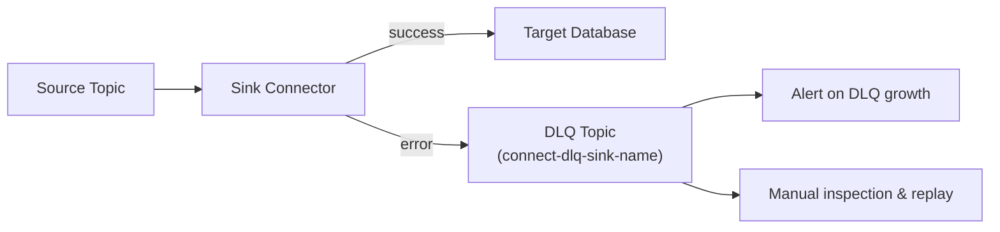

### Configuration

```yaml
connectors:
  - name: jdbc-sink-warehouse
    class: io.aiven.connect.jdbc.JdbcSinkConnector
    config:
      # ... connection config ...
      errors.tolerance: all
      errors.deadletterqueue.topic.name: connect-dlq-jdbc-sink
      errors.deadletterqueue.topic.replication.factor: 3
      errors.deadletterqueue.context.headers.enable: true
      errors.log.enable: true
      errors.log.include.messages: true
```

| Setting | Value | Purpose |
|---------|-------|---------|
| `errors.tolerance` | `all` | Continue processing despite errors (vs. `none` = fail fast) |
| `errors.deadletterqueue.topic.name` | `connect-dlq-*` | DLQ topic name |
| `errors.deadletterqueue.context.headers.enable` | `true` | Include error context (exception, stack trace) in record headers |
| `errors.log.enable` | `true` | Log errors to Connect worker logs |
| `errors.log.include.messages` | `true` | Include the problematic record in the log (disable for sensitive data) |

::: {.callout-caution}
Setting `errors.tolerance: all` without a DLQ silently drops bad records. Always configure a DLQ topic when using tolerant error handling.
:::

---

## CDC Patterns

### Pattern 1: Transactional Outbox

The Outbox pattern avoids dual-write problems by writing events to an `outbox` table in the same database transaction as the business data. Debezium captures the outbox table and routes events to Kafka.

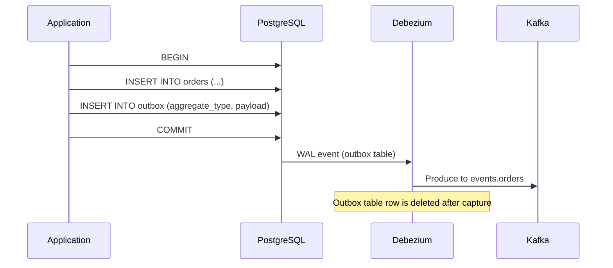

**Connector configuration for Outbox:**

```yaml
config:
  table.include.list: public.outbox
  transforms: outbox
  transforms.outbox.type: io.debezium.transforms.outbox.EventRouter
  transforms.outbox.table.fields.additional.placement: "type:header:eventType"
  transforms.outbox.route.by.field: aggregate_type
  transforms.outbox.route.topic.regex: "(.*)"
  transforms.outbox.route.topic.replacement: "events.$1"
```

### Pattern 2: Event Sourcing via CDC

Capture all state changes as an immutable event log:

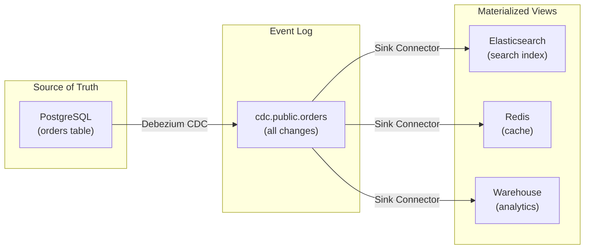

Each materialized view is independently rebuildable by replaying the CDC topic from the beginning (`snapshot.mode: initial`).

### Pattern 3: Cross-Database Sync

Replicate data between databases using a source-to-sink chain:

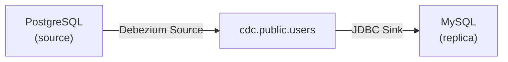

This is useful for:
- Migrating between database engines
- Feeding analytics databases
- Maintaining read replicas across cloud regions

::: {.callout-note}
Cross-database sync introduces eventual consistency. The sink always lags behind the source by the time it takes to process through Kafka. Monitor `kafka_consumergroup_lag` to measure the delay.
:::

---
