# Kafka Connect & CDC Pipelines

This chapter covers the **connect-cluster** Helm chart — a standalone deployment of Kafka Connect on Kubernetes, managed by the Strimzi operator. It explains the architecture, connector lifecycle, Change Data Capture (CDC) patterns with Debezium, multi-AZ deployment strategy, observability, and operational procedures.

> **Scope**: this chapter covers Kafka Connect concepts and building CDC pipelines — architecture, the `KafkaConnect` resource, connectors, Debezium, transforms, schema management, and delivery semantics. Day-2 concerns (scaling, tuning, security rotation, upgrades, disaster recovery, troubleshooting) live in [Operating Kafka Connect](operating-kafka-connect.md).

Whether you're wiring a database into Kafka for the first time or reviewing an existing pipeline, after this chapter you can:

- Deploy Connect as its own Helm release with `kates deploy --topology isolated --with-kafka-connect` and explain why it lives apart from the broker chart
- Build a PostgreSQL CDC pipeline with Debezium — replication slot, snapshot mode, and the internal topics that hold Connect's state
- Chain Single Message Transforms to unwrap the Debezium envelope, route topics, and mask fields without a separate stream processing layer
- Choose delivery semantics deliberately — exactly-once for source connectors, a Dead Letter Queue for tolerant sinks

## Architecture Overview

Kafka Connect runs as a distributed cluster of worker processes that execute connectors. Each connector is a plugin that moves data between Kafka and an external system (database, object store, search index). The Kates platform deploys Connect as a **separate Helm chart** decoupled from the Kafka broker chart, enabling independent scaling, upgrades, and lifecycle management.

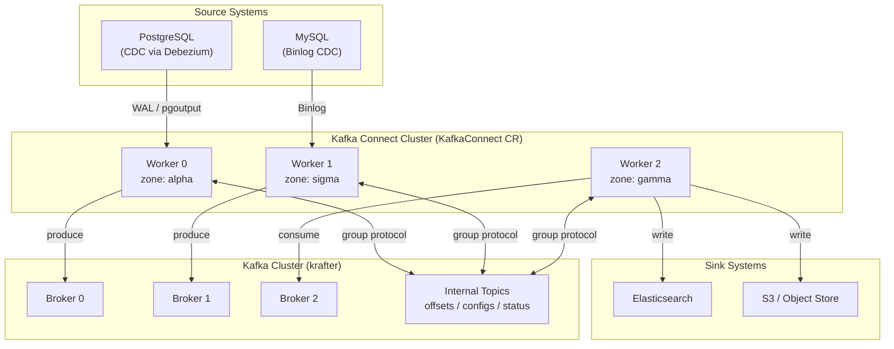

### Why a Separate Chart?

| Aspect | Embedded in kafka-cluster | Standalone connect-cluster |
|--------|:---:|:---:|
| Upgrade independence | ❌ Broker upgrade = Connect restart | ✅ Upgrade Connect without touching brokers |
| Scaling | ❌ Tied to broker chart values | ✅ Independent replica count |
| Failure blast radius | ❌ Bad connector config blocks broker chart | ✅ Connect failures isolated |
| CI/CD pipeline | ❌ Single chart = single pipeline | ✅ Separate lint/test/package/push |
| Environment overlays | ❌ Shared values file | ✅ Dedicated `values-generic.yaml`, `values-prod.yaml` |

## Helm Chart Structure

The `connect-cluster` chart lives at `charts/connect-cluster/` and produces the Strimzi `KafkaConnect` and `KafkaConnector` resources (plus an optional chart-managed `KafkaUser`). The worker spec, client authentication, `KafkaUser`, secret sync, PodMonitor and NetworkPolicy fragments come from the `kafka-common` library chart, which it shares with `mirror-maker2`:

```text
charts/connect-cluster/
├── Chart.yaml                     # 2.0.0; appVersion is the Kafka version, the image pin is the kates.io/connect-image annotation
├── Chart.lock                     # kafka-common dependency (file://../kafka-common)
├── charts/                        # kafka-common, filled by `helm dependency build`
├── values.yaml                    # Defaults
├── values-generic.yaml            # kates deploy on clusters other than kind
├── values-kind.yaml               # kates deploy on kind (no monitoring, platform database egress, Schema Registry)
├── values-dev.yaml                # One small worker, replication factor 1
├── values-prod.yaml               # productionMode: TLS listener, chart-managed certificate user, SLO alert
├── values.schema.json             # Input validation
├── README.md                      # Chart documentation
├── files/
│   └── metrics/
│       └── connect-metrics.yaml   # JMX Prometheus exporter rules
├── tests/                         # helm-unittest suites
└── templates/
    ├── NOTES.txt                  # Release summary, DEPRECATED 1.x keys, KafkaUser adoption commands
    ├── _helpers.tpl               # Naming, labels, bootstrap, known connector classes
    ├── _resolve.tpl               # Derived values, 1.x key translation, connector resolution and checks
    ├── _validate.tpl              # Render-time rails
    ├── kafka-connect.yaml         # KafkaConnect CR
    ├── connectors.yaml            # KafkaConnector CRs and dead letter queue KafkaTopics
    ├── kafka-user.yaml            # Managed KafkaUser (auto ACLs)
    ├── secret-sync.yaml           # Copies the user's Secret and the cluster CA across namespaces
    ├── logging-configmap.yaml     # External log4j2 configuration
    ├── metrics-configmap.yaml     # Exporter rules ConfigMap (key metrics-config.yml)
    ├── rbac-secrets.yaml          # get on exactly the Secrets connector configs reference
    ├── rbac-tests.yaml            # What the Helm test pods may read
    ├── serviceaccount.yaml        # The test pods' ServiceAccount
    ├── service-rest-api.yaml      # REST API Service
    ├── ingress.yaml               # Optional REST API Ingress
    ├── hpa.yaml                   # Optional HorizontalPodAutoscaler
    ├── networkpolicy.yaml         # Default-deny plus explicit allows, database-side ingress
    ├── preflight-job.yaml         # Optional pre-install/upgrade Kafka connection check
    ├── priorityclass.yaml         # Optional kates-streaming PriorityClass
    ├── podmonitor.yaml            # Prometheus PodMonitor
    ├── alerts.yaml                # PrometheusRule: alerts and recording rules
    ├── dashboard.yaml             # Grafana dashboard
    └── tests/
        ├── test-00-egress.yaml            # NetworkPolicy for the test pods
        ├── test-01-connect.yaml           # Credentials, Ready, workers, REST API, plugins, declared connectors
        ├── test-02-topics.yaml            # helm-test KafkaTopics (in the Kafka namespace)
        ├── test-02-connectors.yaml        # helm-test example KafkaConnectors
        └── test-03-test-connectors.yaml   # Each test connector reaches RUNNING
```

### Deployment

The recommended way to deploy Kafka Connect is through the **Kates CLI**, which handles environment detection, overlay selection, and credential provisioning automatically:

```bash
# Deploy the full stack including Kafka Connect
# (--ha defaults to true, so this gives you 3 workers)
kates deploy --topology isolated --with-kafka-connect

# Single-worker deployment (resource-constrained clusters)
kates deploy --topology isolated --with-kafka-connect --ha=false
```

The CLI deploys the `connect-cluster` chart as a separate Helm release (into the `connect` namespace by default under the isolated topology), automatically applying the Kind overlay on Kind clusters and provisioning the PostgreSQL credentials secret.

#### Direct Helm (alternative)

For CI pipelines or when fine-grained control is needed:

```bash
# Build the kafka-common library dependency first
helm dependency build charts/connect-cluster

# Basic deployment (same namespace as Kafka)
helm upgrade --install connect-cluster charts/connect-cluster \
  --namespace kafka

# Connect in its own namespace
helm upgrade --install connect-cluster charts/connect-cluster \
  --namespace connect --create-namespace \
  --set kafka.namespace=kafka

# With environment overlay
helm upgrade --install connect-cluster charts/connect-cluster \
  --namespace connect --create-namespace \
  -f charts/connect-cluster/values-prod.yaml
```

`kafka.namespace` defaults to the release's own namespace, so a release outside the Kafka namespace has to name it. `values-prod.yaml` sets it to `kafka`, turns on `productionMode`, and dials the TLS listener (9093) with `kafka.authentication.type: tls` and a chart-managed `KafkaUser` (`kafkaUser.create: true`).

::: {.callout-note}
A release installed from chart 1.x upgrades in place: 1.x keys still render in 2.x and appear as `DEPRECATED` lines in the release notes. The key-by-key table and the changes that need attention (secret access, Kafka egress ports, alert names) are in [the 2.0 upgrade guide](../connect-cluster-2.0-upgrade.md).
:::

## The KafkaConnect Custom Resource

The chart generates a `KafkaConnect` CR that the Strimzi operator reconciles into a Deployment of Connect worker pods:

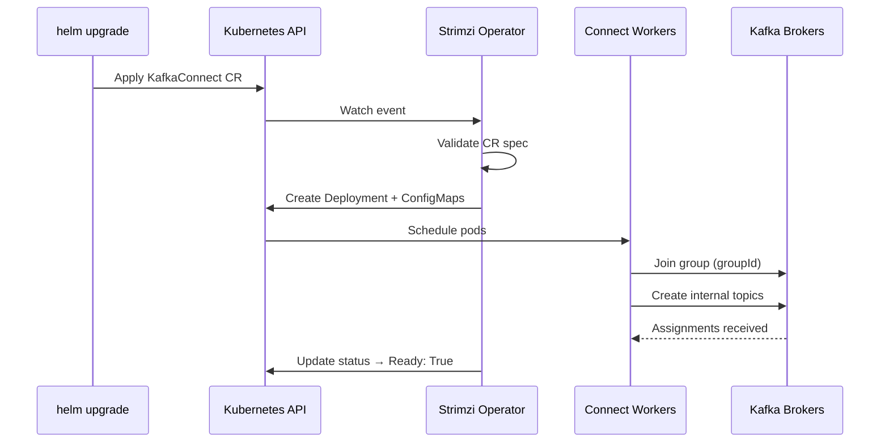

### Key Configuration

| Setting | Default | Purpose |
|---------|---------|---------|
| `groupId` | `kates-connect-cluster` | All workers sharing this ID form a single cluster |
| `replicas` | 3 (the CLI sets 1 with `--ha=false`; the dev overlay uses 1) | Number of worker pods |
| `image` | `ghcr.io/bmscomp/connect:3.6.2-kafka-4.3.1` | Pre-built image with Debezium, Aiven and Apicurio plugins; the chart refuses `:latest` and untagged images |
| `kafka.bootstrapServers` | `""` — computed as `<clusterName>-kafka-bootstrap.<kafka.namespace>.svc.<clusterDomain>:9092` (9093 when `kafka.tls.enabled`, or `kafka.listenerPort`) | Connection to Kafka |
| `kafka.namespace` | `""` — the release's namespace | Where the Kafka cluster, its `KafkaUser` and the test topics live |
| `version` | 4.3.1 | Kafka version the workers run; `Chart.yaml` `appVersion` tracks it |
| `productionMode` | `false` | Refuses plaintext connector passwords, `rbac.allSecrets`, and an unencrypted or unauthenticated Kafka connection |

### Internal Topics

Connect stores its state in three compacted Kafka topics:

| Topic | Content | Retention |
|-------|---------|-----------|
| `<groupId>-offsets` | Source connector position / offset tracking | Compacted (forever) |
| `<groupId>-configs` | Connector and task configuration snapshots | Compacted (forever) |
| `<groupId>-status` | Connector and task status updates | Compacted (forever) |

These topics are automatically created by Connect workers on first startup. `internalTopics.prefix` (default: `groupId`) names them, and `internalTopics.offsetsName`, `configsName` and `statusName` override single names. The chart sets all three replication factors from `config.replicationFactor` (3; the dev overlay uses 1), and refuses a value above `kafka.brokerCount` when you set it.

::: {.callout-important}
Never delete the offsets topic. If deleted, all source connectors lose their position and will re-snapshot their entire database on restart.
:::

### Authentication

By default Connect authenticates to Kafka with SCRAM-SHA-512 on the plaintext listener (9092). The chart renders this into the `KafkaConnect` spec:

```yaml
bootstrapServers: "krafter-kafka-bootstrap.kafka.svc.cluster.local:9092"
authentication:
  type: scram-sha-512
  username: "kates-connect"
  passwordSecret:
    secretName: "kates-connect"
    password: password
```

`kafka.authentication.type` picks the mechanism: `scram-sha-512`, `scram-sha-256` or `plain` (a username and `passwordSecret`), `tls` (a client certificate), `custom` (the SASL and config of `kafka.authentication.custom`, the v1 API's home of OAuth), or `""` for none. `kafka.tls.enabled` moves the workers to 9093 and trusts `<clusterName>-cluster-ca-cert`. The `krafter` Kafka cluster's TLS listener authenticates clients by certificate, so the chart refuses TLS together with SCRAM or PLAIN on that port. `values-prod.yaml` uses mutual TLS instead:

```yaml
bootstrapServers: "krafter-kafka-bootstrap.kafka.svc.cluster.local:9093"
tls:
  trustedCertificates:
    - secretName: "krafter-cluster-ca-cert"
      certificate: ca.crt
authentication:
  type: tls
  certificateAndKey:
    secretName: "kates-connect"
    certificate: user.crt
    key: user.key
```

The `kates-connect` KafkaUser can be managed by the chart itself: setting `kafkaUser.create: true` provisions a `scram-sha-512` or `tls` `KafkaUser` in the Kafka namespace. With `kafkaUser.authorization.mode: auto` (the default), the chart derives least-privilege ACLs from its values:

- the three internal topics, the worker group, the `connect-*` groups of sink connectors, `kafkaUser.groupGrants`, and the data-topic prefixes in `kafkaUser.topicGrants`
- the dead letter queues of the declared connectors
- with `exactlyOnce.enabled`, the transactional IDs `connect-cluster-<groupId>` (the leader) and `<groupId>-*` (the source tasks)
- cluster `Describe` and `DescribeConfigs`

`kafkaUser.authorization.mode: custom` takes `kafkaUser.acls` verbatim. When Connect runs in a different namespace than Kafka, `secretSync` copies the user's Secret — and, with TLS, the cluster CA — into the Connect namespace with a post-install/upgrade Job. `secretSync.watch` adds a CronJob that follows certificate and password rotation, and `secretSync.method: reflector` annotates the user's Secret for kubernetes-reflector instead. This requires the Strimzi User Operator; the ACLs take effect when the Kafka cluster has authorization enabled.

::: {.callout-note}
The `krafter` cluster's platform profile also provisions `kates-connect`. To let this chart own that user, adopt the existing object rather than recreate it — a new `KafkaUser` gets new credentials. The release notes print the `kubectl annotate` and `kubectl label` commands when the user belongs to another release.
:::

## Connector Lifecycle

### Source Connectors

Source connectors read from an external system and produce to Kafka:

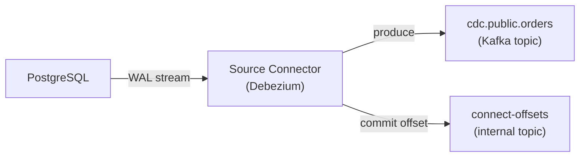

### Sink Connectors

Sink connectors consume from Kafka and write to an external system:

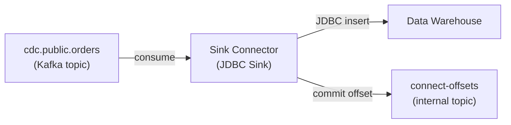

### Connector States

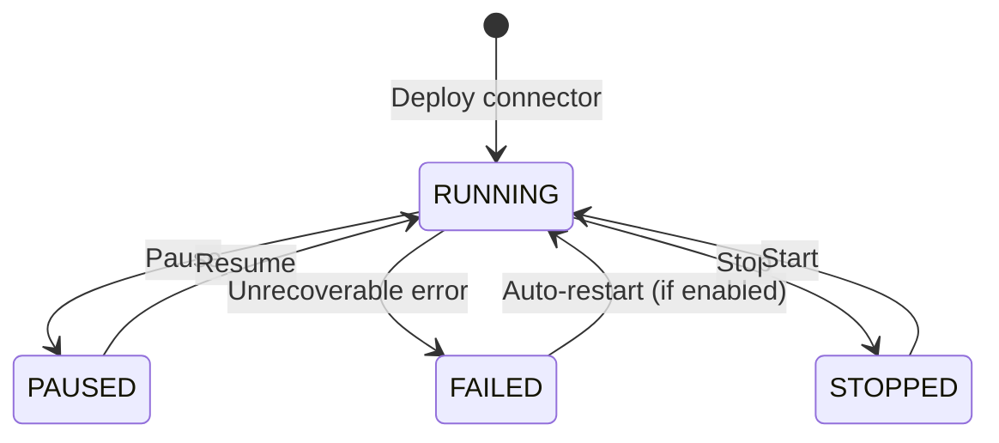

| State | Offset Tracking | Tasks Active | Use Case |
|-------|:-:|:-:|----------|
| `running` | ✅ Advancing | ✅ Yes | Normal operation |
| `paused` | ✅ Preserved | ❌ No | Maintenance window, schema migration |
| `stopped` | ✅ Preserved | ❌ No | Long-term pause, cost savings |
| `failed` | ✅ Preserved | ❌ No | Error — awaiting auto-restart or manual fix |

### Auto-Restart

The chart configures automatic restart for failed connectors through `connectorDefaults`, which is merged under every connector:

```yaml
connectorDefaults:
  autoRestart:
    enabled: true
    maxRestarts: 10
```

When a connector fails, Strimzi restarts it up to `maxRestarts` times with exponential backoff. A connector's own `autoRestart` overrides the default, and `connectorDefaults.config` adds settings every connector shares. The 1.x top-level `autoRestart` key still works in 2.x and is listed as deprecated.

## Change Data Capture with Debezium

### The Connect Image

The pre-built Connect image (`ghcr.io/bmscomp/connect:3.6.2-kafka-4.3.1` — the Debezium line, then the Kafka line) bundles the following plugins:

| Plugin | Version | Use Case |
|--------|---------|----------|
| Debezium PostgreSQL | 3.6.2.Final | WAL-based CDC from PostgreSQL |
| Debezium MySQL | 3.6.2.Final | Binlog-based CDC from MySQL |
| Debezium MongoDB | 3.6.2.Final | Change stream CDC from MongoDB |
| Debezium SQL Server | 3.6.2.Final | Change Tracking CDC from SQL Server |
| Debezium Scripting | 3.6.2.Final | SMT for filtering and routing with Groovy 5 JSR-223 |
| Apicurio Registry Converter | 3.3.0 | Schema Registry integration (Avro, JSON Schema, Protobuf) |
| Debezium JDBC Sink | 3.6.2.Final | Upsert sink for SQL databases |
| Aiven JDBC | 6.10.0 | Generic JDBC source (table polling) and sink |
| Aiven S3 Sink | 3.4.3 | Archive topics to Amazon S3 (JSON, Avro, Parquet, CSV) |
| Aiven S3 Source | 3.4.3 | Replay S3 objects back into Kafka topics |

### Extending the Image with Additional Plugins

While the pre-built image contains the most common CDC connectors, you may need additional plugins (e.g., Elasticsearch Sink, Snowflake Sink). The chart offers three ways to get them onto the workers:

| Way | How | When |
|-----|-----|------|
| `image` | A Connect image with the plugins inside | Recommended — bake them in (`make connect-build`) or layer your own image |
| `build` | The operator builds and pushes an image (`spec.build`) | A registry the operator can push to |
| `plugins` | OCI images mounted as volumes at start-up (`spec.plugins`) | No custom image, and every node has the Kubernetes ImageVolume feature |

The last two add plugins without you rebuilding the Docker image:

#### 1. Using Strimzi `spec.build`

Strimzi can download plugins from Maven Central and build a new image automatically during operator reconciliation. Enable this in `values.yaml`:

```yaml
build:
  output:
    type: docker
    image: "ghcr.io/bmscomp/connect:custom"
    pushSecret: my-registry-credentials
  plugins:
    - name: camel-s3-sink
      artifacts:
        - type: maven
          group: org.apache.camel.kafkaconnector
          artifact: camel-aws-s3-sink-kafka-connector
          version: "4.8.3"
```

#### 2. Mounting Plugin Images

`plugins` renders `spec.plugins`: each artifact is an OCI image that Kubernetes mounts into the workers as a volume. The feature gate is invisible to the chart, so `plugins` renders only once you set `imageVolumes.acknowledged: true`, and only on Kubernetes 1.31 or later (ImageVolume is alpha in 1.31 and beta from 1.33). `expect` adds the plugin's connector classes to the Helm test's list, so a plugin that fails to load fails `helm test`:

```yaml
imageVolumes:
  acknowledged: true

plugins:
  - name: camel-s3-sink
    artifacts:
      - type: image
        reference: registry.example.com/plugins/camel-aws-s3-sink:4.8.3
    expect:
      - org.apache.camel.kafkaconnector.awss3sink.CamelAwss3sinkSinkConnector
```

#### 3. Using the Plugin Loader Script

For environments where neither route is possible, the repo ships `scripts/connect-plugin-loader.sh`, which downloads plugin JARs from Maven Central and extracts them into a `/plugins` directory:

```bash
EXTRA_PLUGINS="org.apache.camel.kafkaconnector:camel-aws-s3-sink-kafka-connector:4.8.3" \
  ./scripts/connect-plugin-loader.sh
```

The script is written to run as an init container that populates a shared volume on the worker's `plugin.path`, but the chart does not wire this up for you. `templateExtra` (deep-merged into `spec.template`) and `connectContainer` can add a volume and its mount, but Strimzi's pod template cannot add an init container of your own, so using the script this way means running it outside the `KafkaConnect` resource. In most cases, prefer the image or one of the routes above.

### PostgreSQL CDC Pipeline

The default Kates CDC pipeline captures changes from a PostgreSQL database:

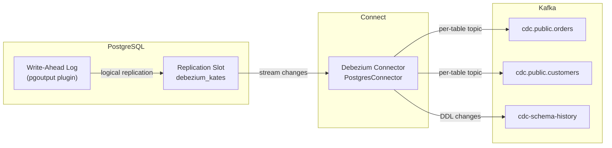

#### Connector Configuration

`connectors` is a map keyed by connector name, so an overlay can change one connector, or drop it with `enabled: false`, without restating the others. A 1.x-style list of `{name, …}` entries still renders in 2.x and is listed as deprecated.

```yaml
connectors:
  debezium-postgres-source:
    class: io.debezium.connector.postgresql.PostgresConnector
    tasksMax: 1
    state: running                 # running | paused | stopped
    config:
      database.hostname: postgresql.database.svc
      database.port: "5432"
      database.user: debezium
      database.password: "${secrets:connect/connect-pg-credentials:password}"
      database.dbname: orders
      topic.prefix: cdc
      schema.include.list: public
      plugin.name: pgoutput
      slot.name: debezium_kates
      heartbeat.interval.ms: "10000"
      snapshot.mode: initial
      decimal.handling.mode: double
      tombstones.on.delete: "true"
```

Beside `class`, `tasksMax`, `state` and `config`, a connector takes `autoRestart`, `deadLetterQueue` (see [Dead Letter Queue (DLQ)](#dead-letter-queue-dlq)), `enabled`, and three keys passed through to the `KafkaConnector`: `version` (a plugin version range, Kafka 4.1+), `listOffsets` and `alterOffsets`.

#### Configuration Deep Dive

| Setting | Value | Rationale |
|---------|-------|-----------|
| `plugin.name: pgoutput` | — | Native PostgreSQL logical decoding plugin (no extra extensions needed) |
| `slot.name: debezium_kates` | — | Named replication slot — survives connector restarts |
| `snapshot.mode: initial` | — | Takes a full snapshot on first run, then switches to streaming |
| `heartbeat.interval.ms: 10000` | — | Prevents WAL retention from growing unbounded on idle tables |
| `tombstones.on.delete: true` | — | Produces a null-value record after a delete — enables downstream compaction |
| `decimal.handling.mode: double` | — | Avoids Avro precision issues with `NUMERIC` columns |

::: {.callout-warning}
The `tasksMax` for a Debezium PostgreSQL connector must always be `1`. PostgreSQL logical replication uses a single replication slot per connector — multiple tasks would cause duplicate events or slot conflicts.
:::

### External Configuration (Secrets)

The chart enables three Kafka config providers on every worker — `file`, `dir`, and `secrets` (Strimzi's `KubernetesSecretConfigProvider`):

```yaml
config.providers: file,dir,secrets
config.providers.file.class: org.apache.kafka.common.config.provider.FileConfigProvider
config.providers.dir.class: org.apache.kafka.common.config.provider.DirectoryConfigProvider
config.providers.secrets.class: io.strimzi.kafka.KubernetesSecretConfigProvider
```

Connectors reference Kubernetes Secrets directly with the `${secrets:<namespace>/<secret-name>:<key>}` syntax — no volume mounts required. The workers resolve those references as the `<release>-connect` ServiceAccount that Strimzi creates. The chart's `rbac-secrets.yaml` reads every connector and test connector config in the values and grants that account `get` on exactly the Secrets they reference, with one Role per namespace. A reference without a namespace fails the render.

Connectors applied outside the chart — by hand, or the CDC connectors `kates deploy` applies next to the release — need their Secrets listed in `rbac.secretNames`, as a bare name (this namespace) or `namespace/name`. The kind and generic overlays list `connect-pg-credentials` and `kates-connect`, which `kates deploy`'s connectors read. For example:

```yaml
rbac:
  secretNames:
    - connect-pg-credentials      # this namespace
    - vault-sync/api-token        # another namespace
```

::: {.callout-warning}
Chart 1.x let the workers read every Secret in the Connect namespace and in the Kafka namespace. A connector that relied on that fails with `Forbidden` after the upgrade until its Secret is in `rbac.secretNames`. `rbac.allSecrets: true` restores the 1.x breadth for the transition; `productionMode` refuses it.
:::

## Pre-Deploy Validation

The chart validates connector configurations while Helm renders it (`_resolve.tpl` and `_validate.tpl`), before anything reaches the Kubernetes API or the Strimzi operator. A mistake fails `helm template`, `helm install` or `helm upgrade` itself, naming the connector and the setting — there is no hook Pod to wait for or read logs from.

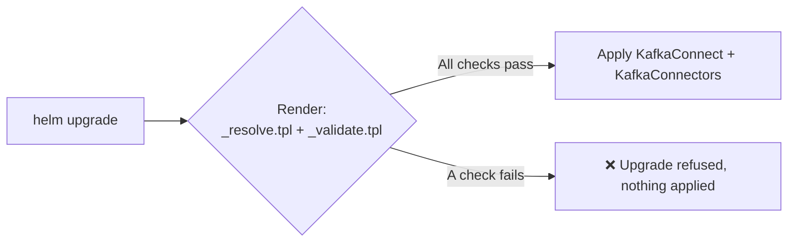

### What It Validates

Every check is an error:

| Check | Connector Type |
|-------|---------------|
| Name is a DNS-1123 subdomain, declared once | All |
| `class` present | All |
| `state` is `running`, `paused` or `stopped` | All |
| `tasksMax` is a whole number of at least 1 | All |
| Every `${secrets:…}` reference names a namespace | All |
| `version` only when the workers run Kafka 4.1+ | All |
| `topics` or `topics.regex` present | Sinks |
| `deadLetterQueue` only on a sink | All |
| No plaintext `*password` value | All, under `productionMode` |
| `database.hostname`, `database.dbname`, `topic.prefix` | Debezium PostgreSQL |
| `database.hostname`, `database.server.id`, `topic.prefix` | Debezium MySQL |
| `mongodb.connection.string`, `topic.prefix` | Debezium MongoDB |
| `database.hostname`, `database.names`, `topic.prefix` | Debezium SQL Server |
| `connection.url` | Debezium JDBC sink, Aiven JDBC sink |
| `connection.url`, `mode` | Aiven JDBC source |
| `aws.s3.bucket.name` | Aiven S3 sink |
| `file` | FileStream sink |
| `source.cluster.alias`, `target.cluster.alias` | MirrorHeartbeat |

A class outside this table counts as a sink when its name contains `Sink`; `type: sink` or `type: source` on the connector overrides that. The same pass checks the rest of the values too — floating image tags, TLS with SCRAM on the mutual-TLS port, `exactly.once.source.support` in `extraConfig`, a replication factor above `kafka.brokerCount` — and the chart README lists every rail. Render your values before an upgrade; a PostgreSQL connector without `topic.prefix`, for example, fails like this:

```bash
# charts/connect-cluster/charts/ is generated and gitignored, so a fresh
# checkout needs the kafka-common library before helm will render anything
helm dependency build charts/connect-cluster

helm template connect-cluster charts/connect-cluster -n connect -f my-values.yaml > /dev/null
```

Output:

```text
Error: execution error at (connect-cluster/templates/…): connect-cluster: connectors.orders-cdc (io.debezium.connector.postgresql.PostgresConnector) needs config.topic.prefix
```

This catches misconfigurations at `helm upgrade` time rather than at runtime, preventing connector failures that could take minutes to surface.

## Environment Overlays

The Kates CLI applies `values-kind.yaml` on Kind clusters and `values-generic.yaml` on other clusters. Both turn tracing off and list the Secrets the CLI's own connectors read in `rbac.secretNames`; the Kind overlay also turns monitoring off, adds database egress to the local `kates` namespace, and enables the Schema Registry integration. On the generic overlay, the PodMonitor and alerts render only where the `monitoring.coreos.com/v1` API exists (the CLI also turns them off when the Prometheus CRDs are missing). `values-dev.yaml` and `values-prod.yaml` are for direct Helm use. Cells marked *(base)* are inherited from `values.yaml` rather than set by the overlay:

| Setting | Kind | Generic | Dev | Prod |
|---------|:----:|:----:|:---:|:----:|
| Replicas | 3 *(base)* — CLI sets 1 with `--ha=false` | 3 *(base)* — CLI sets 1 with `--ha=false` | 1 | 3 |
| JVM Heap | 1024m *(base)* | 1024m *(base)* | 512m | 2048m |
| Memory request/limit | 2Gi/4Gi *(base)* | 2Gi/4Gi *(base)* | 1Gi/2Gi | 4Gi/6Gi |
| Internal topic replication factor | 3 *(base)* | 3 *(base)* | 1 | 3 *(base)* |
| Topology spread | Zone-aware, `ScheduleAnyway` *(base)* | Zone-aware, `ScheduleAnyway` *(base)* | Disabled | Zone-aware, `DoNotSchedule` |
| Pod anti-affinity | Per-hostname *(base)* | Per-hostname *(base)* | Disabled | Per-hostname |
| Kafka connection | SCRAM, 9092 *(base)* | SCRAM, 9092 *(base)* | SCRAM, 9092 *(base)* | Mutual TLS, 9093, chart-managed `KafkaUser` |
| `productionMode` | Off *(base)* | Off *(base)* | Off *(base)* | On |
| Alerts | Off | On *(base)* | Off | On, plus the task-availability SLO |
| PodMonitor | Off | On *(base)* | On *(base)* | On *(base)* |
| Dashboard | Off | On *(base)* | On *(base)* | On *(base)* |
| Tracing | Off | Off | OpenTelemetry, no endpoint *(base)* | OpenTelemetry, no endpoint *(base)* |
| Schema Registry | On | Off *(base)* | Off *(base)* | Off *(base)* |
| Database egress | `kates` (PostgreSQL) | — | — | `database` (PostgreSQL, MySQL, MongoDB) |
| Test connectors | Demo pipeline *(base)* | Demo pipeline *(base)* | Demo pipeline *(base)* | None |
| Priority class | None *(base)* | None *(base)* | None *(base)* | `kates-streaming`, created by the release |

## CLI Reference

The `kates kafka connect` command group provides a complete operational interface for Kafka Connect:

### Cluster Operations

| Command | Description |
|---------|-------------|
| `kates deploy --with-kafka-connect` | Deploy Connect as part of the full stack |
| `kates kafka connect status` | Show Connect cluster status (KafkaConnect CR) |
| `kates kafka connect scale [replicas]` | Scale Connect workers up/down |
| `kates kafka connect plugins` | List installed connector plugins |
| `kates kafka connect logs [-f]` | Tail Connect worker logs (with optional follow) |
| `kates kafka connect test` | Run end-to-end CDC integration test |

### Connector Management

| Command | Description |
|---------|-------------|
| `kates kafka connect connectors` | List all KafkaConnector CRs |
| `kates kafka connect connector [name]` | Describe a specific connector (YAML output) |
| `kates kafka connect config [name]` | Show connector configuration |
| `kates kafka connect pause [name]` | Pause a connector (preserves offsets) |
| `kates kafka connect resume [name]` | Resume a paused connector |
| `kates kafka connect restart [name]` | Restart a connector |
| `kates kafka connect restart-task [connector] [taskId]` | Restart a specific task |
| `kates kafka connect tasks [name]` | Show task-level status |
| `kates kafka connect delete [name]` | Delete a connector |

All commands accept `-n <namespace>` (resolved as `$KATES_CONNECT_NS` → auto-detect from the cluster's `KafkaConnect` CRs → `$KATES_KAFKA_NS` → `kafka`) and `-o json` for machine-readable output.

### Makefile Targets (CI/Chart Development)

For chart development and CI pipelines, Makefile targets are also available:

| Target | Description |
|--------|-------------|
| `make connect-chart-deps` | Build the `kafka-common` dependency (the targets below run it first) |
| `make connect-chart-lint` | Lint the chart with the default, prod and kind values |
| `make connect-chart-unittest` | Run the `helm unittest` suites (connectors, secret scoping, KafkaConnect, KafkaUser, alerts) |
| `make connect-chart-template` | Render templates → `.build/connect-rendered.yaml` |
| `make connect-chart-package` | Package → `.build/connect-cluster-<version>.tgz` |
| `make connect-chart-push` | Push to OCI registry |
| `make connect-chart-all` | lint + unit tests + template + package |

## Exactly-Once Semantics

Kafka Connect supports **exactly-once source** (EOS) delivery — guaranteeing that each source record is written to Kafka exactly once, even if a worker crashes mid-batch.

### How EOS Works

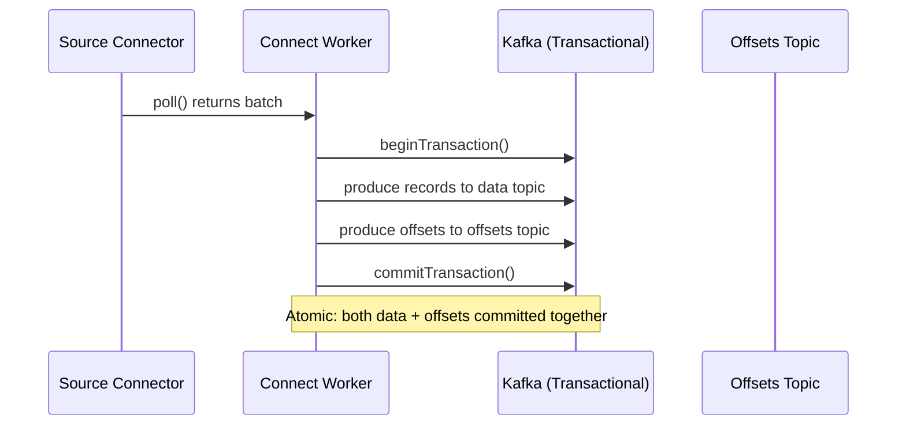

Without EOS, Connect commits offsets and data separately — a crash between the two steps causes duplicates on restart. With EOS enabled, the worker wraps both into a single Kafka transaction.

### Configuration

The chart enables EOS by default. It is a group-wide switch rather than an `extraConfig` line, because every worker in the group must agree and a chart-managed `KafkaUser` needs the matching transactional-ID grants:

```yaml
exactlyOnce:
  enabled: true

extraConfig:
  producer.acks: "all"
  producer.enable.idempotence: "true"
```

| Setting | Value | Purpose |
|---------|-------|---------|
| `exactly.once.source.support` | `enabled` (from `exactlyOnce.enabled`) | Wraps source records + offsets in a single transaction |
| `producer.acks` | `all` | Wait for all ISR replicas to acknowledge |
| `producer.enable.idempotence` | `true` | Deduplicates retried produce requests at the broker |

The chart refuses `exactly.once.source.support` in `extraConfig`; set `exactlyOnce.enabled` instead.

::: {.callout-important}
EOS requires `min.insync.replicas >= 2` on the data topics and `acks=all` on the Connect producer. The krafter cluster satisfies both by default.
:::

### When to Disable EOS

| Scenario | Recommendation |
|----------|---------------|
| Sink-only connectors | Not applicable — EOS is for source connectors only |
| Extremely high throughput (>100k records/s) | EOS adds ~5% latency — benchmark first |
| Non-critical data (metrics, logs) | Disable (`exactlyOnce.enabled: false`) for better throughput; at-least-once is acceptable |

---

## Single Message Transforms (SMTs)

SMTs are lightweight, in-line transformations applied to each record as it passes through a connector — without requiring a separate stream processing layer.

### Transform Pipeline

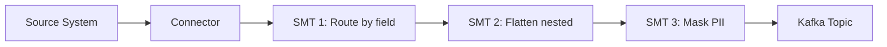

Transforms are chained in order — each receives the output of the previous one.

### Common Transforms

| Transform | Class | Use Case |
|-----------|-------|---------|
| Route records by field | `io.debezium.transforms.ByLogicalTableRouter` | Route to per-tenant topics |
| Flatten nested structs | `org.apache.kafka.connect.transforms.Flatten$Value` | Flatten JSON for downstream consumers |
| Add timestamp | `org.apache.kafka.connect.transforms.InsertField$Value` | Inject processing timestamp |
| Filter by field | `io.debezium.transforms.Filter` | Drop heartbeat or schema-change records |
| Mask sensitive fields | `org.apache.kafka.connect.transforms.MaskField$Value` | Zero-out PII before it reaches Kafka |
| Extract new record state | `io.debezium.transforms.ExtractNewRecordState` | Unwrap Debezium envelope to plain record |
| Set topic name | `org.apache.kafka.connect.transforms.RegexRouter` | Rewrite topic names with regex |

### Example: Unwrap Debezium Envelope + Route by Tenant

```yaml
connectors:
  cdc-orders:
    class: io.debezium.connector.postgresql.PostgresConnector
    config:
      database.hostname: postgresql.database.svc   # plus the rest of the database config
      database.dbname: orders
      topic.prefix: cdc
      transforms: unwrap,route
      transforms.unwrap.type: io.debezium.transforms.ExtractNewRecordState
      transforms.unwrap.drop.tombstones: "false"
      transforms.unwrap.delete.handling.mode: rewrite
      transforms.unwrap.add.fields: "op,source.ts_ms"
      transforms.route.type: org.apache.kafka.connect.transforms.RegexRouter
      transforms.route.regex: "cdc\\.public\\.(.*)"
      transforms.route.replacement: "events.$1"
```

This chain:
1. Unwraps the Debezium envelope (`{before, after, source, op}`) into a flat record
2. Adds `op` and `source.ts_ms` as header fields for consumers
3. Renames `cdc.public.orders` → `events.orders`

::: {.callout-tip}
The `ExtractNewRecordState` SMT is almost always recommended for Debezium connectors. Without it, downstream consumers must understand the full Debezium envelope schema.
:::

---

## Schema Registry Integration

When Apicurio Registry is deployed alongside Kafka, Connect can serialize records using Avro, JSON Schema, or Protobuf instead of plain JSON — enabling schema evolution and type safety.

### Data Flow with Schema Registry

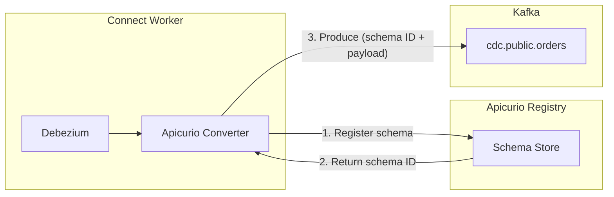

### Configuration

To enable Apicurio Avro serialization:

```yaml
schemaRegistry:
  enabled: true
  serviceName: apicurio-apicurio-registry
  port: 80
  path: /apis/ccompat/v7

config:
  keyConverter: io.apicurio.registry.utils.converter.AvroConverter
  valueConverter: io.apicurio.registry.utils.converter.AvroConverter
  keyConverterSchemasEnable: true
  valueConverterSchemasEnable: true
```

The chart automatically computes the full Schema Registry URL from the service name, port, path, and cluster domain:

```text
http://apicurio-apicurio-registry.<namespace>.svc.<clusterDomain>:80/apis/ccompat/v7
```

### Schema Evolution

| Compatibility Mode | What's Allowed | Use Case |
|-------------------|---------------|----------|
| BACKWARD | New schema can read data written by old | Default — consumers upgrade first |
| FORWARD | Old schema can read data written by new | Producers upgrade first |
| FULL | Both backward and forward compatible | Strictest — safest for mission-critical data |
| NONE | Any change allowed | Development only |

::: {.callout-warning}
Changing the converter from `JsonConverter` to `AvroConverter` on an existing connector requires reprocessing all data. The existing JSON records in Kafka are not automatically re-serialized. Plan a migration window with a new topic prefix.
:::

---

## Dead Letter Queue (DLQ)

When a sink connector encounters a record it cannot process (malformed data, schema mismatch, downstream failure), it can route the record to a Dead Letter Queue instead of failing the entire task.

### DLQ Flow

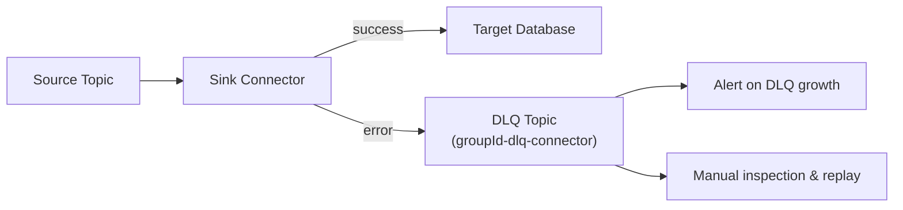

### Configuration

A sink connector's `deadLetterQueue` block sets the error handling for you and, with `createTopic` (the default), renders the queue's `KafkaTopic` in the Kafka namespace. A chart-managed `KafkaUser` is granted the queue:

```yaml
connectors:
  jdbc-sink-warehouse:
    class: io.aiven.connect.jdbc.JdbcSinkConnector
    deadLetterQueue:
      enabled: true            # errors.tolerance=all, the queue topic, context headers
      topic: ""                # empty = <groupId>-dlq-<connector>
      replicationFactor: 3     # empty = config.replicationFactor
      createTopic: true        # a KafkaTopic in the Kafka namespace
    config:
      topics: cdc.public.orders
      connection.url: jdbc:postgresql://warehouse.database.svc:5432/warehouse
      errors.log.include.messages: "true"
```

The connector's config then carries:

| Setting | Value | Purpose |
|---------|-------|---------|
| `errors.tolerance` | `all` | Continue processing despite errors (vs. `none` = fail fast) |
| `errors.deadletterqueue.topic.name` | `<groupId>-dlq-<connector>` (`deadLetterQueue.topic`) | DLQ topic name |
| `errors.deadletterqueue.topic.replication.factor` | `deadLetterQueue.replicationFactor` | DLQ topic replication factor |
| `errors.deadletterqueue.context.headers.enable` | `true` (`deadLetterQueue.contextHeaders`) | Include error context (exception, stack trace) in record headers |
| `errors.log.enable` | `true` | Log errors to Connect worker logs |
| `errors.log.include.messages` | `true`, from `config` above (the chart doesn't set it) | Include the problematic record in the log (leave it off for sensitive data) |

`KafkaConnectDeadLetterWrites` fires while records are dead-lettered and `KafkaConnectDeadLetterFailures` when the queue refuses them; see [the Connect runbook](../connect-cluster-runbook.md).

::: {.callout-caution}
Setting `errors.tolerance: all` without a DLQ silently drops bad records. Always configure a DLQ topic when using tolerant error handling. Connect ignores a DLQ on a source connector, so the chart refuses `deadLetterQueue` there.
:::

---

## CDC Patterns

### Pattern 1: Transactional Outbox

The Outbox pattern avoids dual-write problems by writing events to an `outbox` table in the same database transaction as the business data. Debezium captures the outbox table and routes events to Kafka.

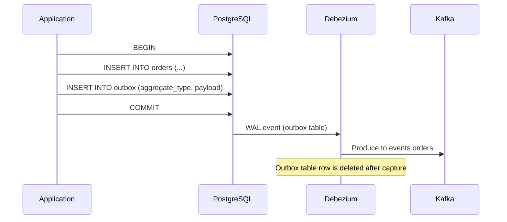

**Connector configuration for Outbox:**

```yaml
config:
  table.include.list: public.outbox
  transforms: outbox
  transforms.outbox.type: io.debezium.transforms.outbox.EventRouter
  transforms.outbox.table.fields.additional.placement: "type:header:eventType"
  transforms.outbox.route.by.field: aggregate_type
  transforms.outbox.route.topic.regex: "(.*)"
  transforms.outbox.route.topic.replacement: "events.$1"
```

### Pattern 2: Event Sourcing via CDC

Capture all state changes as an immutable event log:

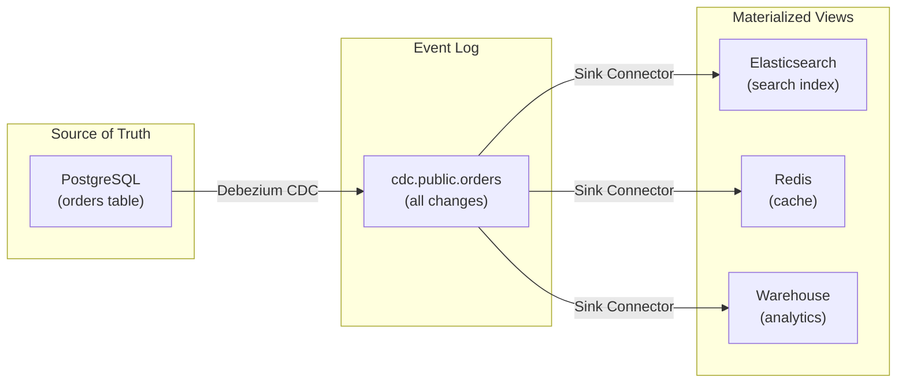

Each materialized view is independently rebuildable by replaying the CDC topic from the beginning (`snapshot.mode: initial`).

### Pattern 3: Cross-Database Sync

Replicate data between databases using a source-to-sink chain:

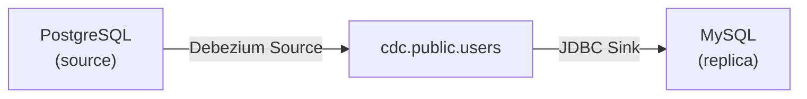

This is useful for:
- Migrating between database engines
- Feeding analytics databases
- Maintaining read replicas across cloud regions

::: {.callout-note}
Cross-database sync introduces eventual consistency. The sink always lags behind the source by the time it takes to process through Kafka. Monitor `kafka_consumergroup_lag` to measure the delay.
:::

---

::: {.callout-tip}
**Try it**

The chart ships a complete CDC pipeline as `testConnectors` — `helm test` creates those connectors and their topic, checks that each one reaches RUNNING with all its tasks, and deletes them again once the suite succeeds, so keeping the pipeline running means applying the same manifests persistently. With the stack running and the demo tables created in the `orders` database (one-time prep: `docs/tutorials/09-kafka-connect-working-examples.md`), replicate a row end to end:

```bash
# Validate the release — the suite checks the workers, the REST API and the
# plugins, then runs the working-example connectors transiently
helm test connect-cluster -n connect

# Deploy the CDC topic (in the kafka namespace, on the krafter cluster) and the
# working-example connectors persistently. kafka.namespace defaults to the
# release namespace, so name it as kates deploy does. The chart renders only
# once the kafka-common library is in charts/connect-cluster/charts/.
helm dependency build charts/connect-cluster
helm template connect-cluster charts/connect-cluster -n connect \
  --set kafka.namespace=kafka \
  -s templates/tests/test-02-topics.yaml \
  -s templates/tests/test-02-connectors.yaml | kubectl apply -f -

# Wait for the Debezium source and the JDBC sink to come up
kubectl wait -n connect --for=condition=Ready kafkaconnector/debezium-postgres-source-working-example --timeout=300s
kubectl wait -n connect --for=condition=Ready kafkaconnector/jdbc-sink-from-cdc-working-example --timeout=300s

# Insert a row into the watched table ...
kubectl exec -n database postgresql-0 -- /bin/bash -lc \
  "PGPASSWORD=debezium /opt/bitnami/postgresql/bin/psql -h 127.0.0.1 -U debezium -d orders -c \
  \"INSERT INTO public.demo_orders (id, customer_name, amount) VALUES (1001, 'alice', 42.50) ON CONFLICT (id) DO UPDATE SET customer_name = EXCLUDED.customer_name, amount = EXCLUDED.amount;\""

# ... and read it back from the replica table
kubectl exec -n database postgresql-0 -- /bin/bash -lc \
  "PGPASSWORD=debezium /opt/bitnami/postgresql/bin/psql -h 127.0.0.1 -U debezium -d orders -c \
  \"SELECT id, customer_name, amount FROM public.demo_orders_replica WHERE id = 1001;\""
```

The SELECT returns the row within a few seconds — Debezium captures the insert from the WAL, produces it to `cdc.public.demo_orders`, and the JDBC sink upserts it into `demo_orders_replica`. The applied objects keep their Helm test annotations, so a later `helm test` replaces them and removes them again when it passes. When you're done, the tutorial's cleanup section removes the connectors and the CDC topic.
:::

## Summary

- Connect runs as its own Helm chart (`charts/connect-cluster/`), decoupled from the brokers — the Strimzi operator reconciles the `KafkaConnect` CR into worker pods you can scale, upgrade, and break without touching Kafka.
- All connector state lives in compacted internal topics (offsets, configs, status) — never delete the offsets topic, or every source connector re-snapshots its entire database.
- A Debezium PostgreSQL connector owns exactly one replication slot, so `tasksMax` stays at 1; heartbeats keep WAL retention bounded on idle tables.
- SMTs transform records in-line — `ExtractNewRecordState` unwraps the Debezium envelope so consumers see plain records instead of `{before, after, source, op}`.
- Exactly-once source support commits records and offsets in a single Kafka transaction; sinks get resilience through a DLQ — `errors.tolerance: all` without one silently drops bad records.

That pipeline now has to survive production — [Operating Kafka Connect](operating-kafka-connect.md) covers the day-2 half: scaling, tuning, credential rotation, upgrades, disaster recovery, and troubleshooting.
