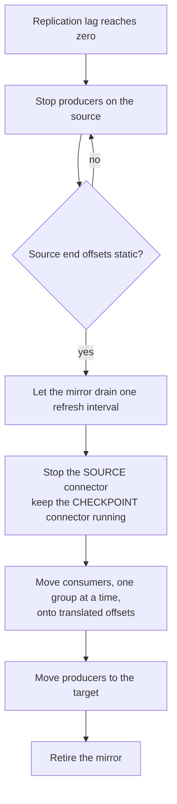

# Cross-Cluster Replication and Migration

MirrorMaker 2 is Kafka Connect wearing a specific hat. A `KafkaMirrorMaker2`
custom resource *is* a Connect cluster, running two built-in connectors —
`MirrorSourceConnector` and `MirrorCheckpointConnector` — whose job is to copy
records and consumer offsets from one Kafka cluster to another. Everything you
know about operating Connect applies: workers, tasks, rebalances, internal
topics, the REST layer.

One thing does not carry over, and it drives the whole design: Connect talks to
**one** cluster, and MirrorMaker 2 talks to **two**. Every difficulty in this
chapter descends from that.

## The Model

Strimzi's v1 API expresses the two clusters as two fields:

```yaml
spec:
  target:                         # where the Connect runtime lives
    alias: target
    bootstrapServers: krafter-kafka-bootstrap.kafka.svc:9092
    groupId: mm2
    configStorageTopic: mm2-configs
    offsetStorageTopic: mm2-offsets
    statusStorageTopic: mm2-status
  mirrors:
    - source:                     # where records are read from
        alias: legacy
        bootstrapServers: kafka-old.example.com:9092
      topicsPattern: "orders\\..*"
      groupsPattern: ".*"
      sourceConnector: { ... }
      checkpointConnector: { ... }
```

The **target** owns the Connect internal topics and is where the workers'
`AdminClient` writes. Each **source** carries its own bootstrap, TLS and
credentials, because the two clusters share nothing — not a CA, not a principal,
often not an operator or an owner.

::: callout-note
There is no `heartbeatConnector` in the v1 API, and no heartbeats:
`emit.heartbeats.enabled` on the source connector is a no-op. Replication lag
comes from the source connector's own `replication-latency-ms` metric instead.
:::

## Three Uses, Three Different Configurations

The same CR serves three purposes, and the configuration that is right for one
is wrong for the others.

| Use | Topic naming | Offset translation | Lifetime |
|:----|:-------------|:-------------------|:---------|
| Disaster recovery | Prefixed (`legacy.orders`) — you need to know the origin | Essential, for failover | Permanent |
| Aggregation | Prefixed — many sources, one target | Rarely | Permanent |
| Migration | **Preserved** (`orders`) — consumers repoint and find what they know | Essential, for cutover | Weeks |

The naming difference is the replication policy. `DefaultReplicationPolicy`
prefixes; `IdentityReplicationPolicy` does not.

## Why Migration Is the Hard Case

A DR mirror runs forever and nobody watches it closely. A migration has a
deadline, a cutover, and a rollback that stops being possible partway through.
Four things make it sharp.

### The Protocol Floor

[KIP-896](https://cwiki.apache.org/confluence/x/K5sODg) removed the pre-2.1
client protocol API versions in Kafka 4.0. MirrorMaker 2's consumer is an
ordinary Kafka client of whatever version the workers run, so a 4.x MirrorMaker
can read brokers **2.1 and newer, and nothing older**. Below that the broker
answers `UNSUPPORTED_VERSION`.

This is a protocol removal, not a setting. The supported path from 0.10–2.0 is
two hops: legacy → an intermediate 3.x cluster whose client can still read the
old broker → 4.x.

::: callout-warning
The failure is silent from the outside. The `KafkaMirrorMaker2` reports `Ready`,
because `Ready` means the Connect workers started. Only the connector status and
the target's record counts show that nothing is crossing.
:::

The `mirror-maker2` chart turns this into a render-time failure: declare
`mirrors[].source.kafkaVersion` and a source below the floor fails
`helm install` in seconds, naming the alias and the way out. Its pre-flight hook
goes further and performs the `ApiVersions` handshake against the real source
with the workers' own client, so a pass is evidence rather than an assumption.

That rail only fires once helm can render at all. The chart is built on the
`kafka-common` library chart, and `charts/mirror-maker2/charts/` is generated
and gitignored, so run `helm dependency build charts/mirror-maker2` on a fresh
checkout before any `helm install`, `upgrade`, `template` or `lint`.
`kates migrate` does it for you.

### Identity Mode Makes the Mirror Self-Matching

Preserve topic names and the mirror becomes eligible to read its own output —
`heartbeats`, `checkpoints`, the offset-syncs topic, the Connect internal topics.
MirrorMaker's stock exclusions do not cover them, because under the default
policy those topics are already renamed out of the way. The symptom is a topic
count that grows without bound.

The chart computes an exclusion set in both modes — MirrorMaker's own defaults
plus the Connect internal topics and anything already carrying the source's
prefix, which is what stops a loopback from re-mirroring `source.orders` as
`source.source.orders` — and identity mode appends MM2's own topic names:

```text
.*[\-\.]internal,.*\.replica,__.*,<groupId>-.*,<alias>\..*,mm2-.*,heartbeats,checkpoints,.*\.heartbeats,.*\.checkpoints\.internal
```

### Offset Translation Is the Half People Skip

`MirrorSourceConnector` moves records. `MirrorCheckpointConnector` moves
*positions* — it maps each source consumer group's committed offsets onto the
equivalent target offsets, through the `offset-syncs` topic, and writes them to
the target's `__consumer_offsets` when `sync.group.offsets.enabled` is true.

Without it a migration is data-only: every record is on the target, and no
consumer knows where to resume, so each one replays from the beginning or skips
to the end.

::: callout-important
Translation is approximate by design. Positions are mapped at record
granularity and the mapping lags the data, so a consumer moved onto a translated
offset may re-read a small number of records. MirrorMaker 2 is at-least-once —
plan for duplicates rather than being surprised by them.
:::

### The Cutover Is a Sequence



Two details in that diagram are the ones that go wrong.

**Stop the source connector, keep the checkpoint connector.** Consumers migrate
one at a time, and each one that has not moved yet still needs its position
translated. Stopping both together leaves every record on the target and no
consumer able to find its place.

**`stopped`, not `paused`.** `stopped` releases the connector's tasks, so a
worker restart cannot resume the mirror after producers have moved — which would
write old records *behind* the ones the new producers are appending.

Both are expressed in the chart's `cutover` block, applied as a values overlay
on top of whatever migration preset is running.

## Verifying a Mirror

Three questions, in increasing order of how much they tell you:

| Question | How | What it proves |
|:---------|:----|:---------------|
| Are the workers up? | `condition=Ready` on the CR | Almost nothing |
| Are the connectors running? | `.status.connectors[].connector.state` | The connectors started |
| Is data arriving? | End offsets on the target, twice (`kates migrate target offsets <topic>`) | The mirror works |

A test suite that stops at the first question reports success on a dead mirror.
The chart's Helm tests span all three — CR readiness, connector state, and (off
by default, because they need credentials) a produce-and-consume round trip and
an offset-translation check — and `kates migrate run` performs the third
question against a real legacy broker, diffing the full set of distinct records
read back rather than counting lines.

## Metrics That Answer Operational Questions

| Metric | Question |
|:-------|:---------|
| `kafka_connect_source_task_metrics_source_record_write_total` | Is anything moving at all? |
| `kafka_connect_mirror_source_connector_replication_latency_ms_max` | Is it safe to cut over? |
| `kafka_connect_mirror_source_connector_record_age_ms_max` | How far behind are the fetchers? |
| `kafka_connect_worker_metrics_connector_failed_task_count` | Is something broken outright? |
| `kafka_connect_worker_rebalance_metrics_completed_rebalances_total` | Is it stable? |

Replication latency is the one a cutover decision rests on, and you want its
history rather than a spot reading — which means turning metrics on before the
first record moves, not after something looks wrong.

::: callout-tip
Tasks do not replicate during a rebalance, so a rebalance storm presents as
intermittent lag with no failed tasks. If lag is sawtoothing, look at the
rebalance rate before you look at the source.
:::

## Testing a Migration Locally

The pinned Strimzi operator (see the [Version & Compatibility Matrix](appendix-d-versions.md))
runs Kafka 4.x only and validates `spec.version` against its supported set, so a
2.x or 3.x cluster cannot be expressed as a `Kafka` custom resource at all. The
`legacy-kafka` chart fills that gap: plain StatefulSets running the last 2.x
line on ZooKeeper, or the last 3.x line on KRaft, in their own namespace, purely
to be replicated from. Which 2.x and 3.x lines those are is pinned in that
chart's overlays, and `kates migrate pairs` prints the pairs this cluster can
actually stand up.

```bash
kates migrate pairs              # the source→target pairs available here
kates migrate run --from 3.9.1   # the 3.x leg
kates migrate run --from 2.8.2   # the 2.x leg
```

Each run stands up the legacy broker, produces a known corpus, commits a consumer
offset, mirrors it, reads the records back off the 4.x cluster, verifies offset
translation, and rehearses the cutover — reporting every assertion in a table.

::: callout-caution
The `legacy-kafka` chart is a lab fixture: single broker, RF1, `emptyDir`, no
TLS. It proves protocol and topology compatibility, not durability or
throughput. Never point production traffic at it.
:::

## What This Does Not Give You

- **Exactly-once across clusters.** MirrorMaker 2 is at-least-once. Duplicates
  after a retry or failover are expected behaviour.
- **A rollback after producers have moved.** Records written to the target are
  not replicated backwards. Past that point a rollback is a data merge, and the
  decision to accept that belongs before the cutover, not during it.
- **Source-side provisioning.** The source is a cluster the chart does not
  manage. Its principal, its ACLs and its network reachability are somebody
  else's to grant, and a missing source ACL fails as a connector that stays
  `RUNNING` and replicates nothing.

## Where to Go Next

The step-by-step procedures live outside the book, next to the code they drive:
`docs/tutorials/10-mirror-maker2-installation.md` for setup,
`11-migrating-kafka-2x-to-4x.md` and `12-migrating-kafka-3x-to-4x.md` for the two
migration paths, and `docs/mirror-maker2-runbook.md` for the cutover checklist
and the failure table. Chart reference: `charts/mirror-maker2/README.md`. Two
operational helpers are worth knowing by name: `kates migrate target topics`
lists what the mirror created on the target (the Topic Operator is
unidirectional, so `kubectl get kafkatopics` never will), and
`kates migrate target offsets <topic>` sums a topic's end offsets with whichever
offset tool the target's Kafka line ships. The `make mm2-topics` and
`make mm2-migration-test` targets still work and print the `kates migrate`
command they now stand for.
