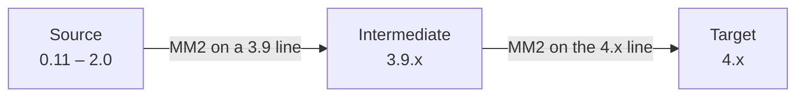

# Migrating a Legacy Kafka Source

[Cross-Cluster Replication and Migration](22-mirror-maker2-migration.md) explains
how MirrorMaker 2 moves data and consumer positions between two clusters. This
chapter is about the other half of the problem: the source cluster is old, and
its age changes things that have nothing to do with replication.

The mirror itself barely notices. MirrorMaker 2 is a Kafka Connect application
speaking the ordinary client protocol to both ends, and it neither knows nor
cares whether the source stores its metadata in ZooKeeper or KRaft. What the
source's era changes is everything *around* the mirror — which commands you can
run against it, which authorizer holds its ACLs, which TLS defaults its brokers
were built with, and whether a 4.x client can talk to it at all.

Read this before you plan the migration. Most of what follows is not
discoverable from a failing pod.

## The Cliff, and Where It Is

Kafka 4.0 removed the client protocol API versions that predate Kafka 2.1
([KIP-896](https://cwiki.apache.org/confluence/display/KAFKA/KIP-896%3A+Remove+old+client+protocol+API+versions+in+Kafka+4.0)).
The MirrorMaker 2 workers are 4.x clients, so the rule lands on them directly:

> users should ensure their brokers are running at least Apache Kafka 2.1
> before upgrading their Java clients to Apache Kafka 4.0

[KIP-1124](https://cwiki.apache.org/confluence/display/KAFKA/KIP-1124%3A+Providing+a+clear+Kafka+Client+upgrade+path+for+4.x)
states the consequence without hedging: 2.1 is the oldest version compatible
with 4.0, and 4.0 clients require a broker of 2.1 or newer.

This is a removal, not a setting. There is no compatibility flag, no
`inter.broker.protocol.version` you can lower on the client side, nothing to
negotiate. Below the floor the broker answers `UNSUPPORTED_VERSION` and the
connector fails — while the `KafkaMirrorMaker2` resource keeps reporting
`Ready`, because the operator's readiness is about the workers, not about
whether replication is happening.

::: {.callout-important}
The floor is on the **source broker**, and it is a floor on the *protocol*, not
on the data. A 2.1 broker holding records written years earlier in an ancient
message format is fine — see Message Formats below. A 2.0 broker holding
yesterday's records is not.
:::

The chart refuses this case at render time rather than letting you find it an
hour later:

```yaml
compatibility:
  enforce: true
  minSourceVersion: "2.1.0"
  requireDeclaredVersion: true
mirrors:
  - source:
      alias: legacy
      bootstrapServers: legacy-legacy-kafka-bootstrap.kafka-legacy-2x.svc:9092
      kafkaVersion: "2.8.2"
```

`requireDeclaredVersion` is the part worth keeping on. A source that does not
say what it is cannot be checked, and "we think it's a 2.x" is exactly the
sentence that precedes a failed cutover.

## Below the Floor: Two Hops

If the source is older than 2.1, one mirror cannot reach it. The supported
shape is two migrations with an intermediate cluster in the middle:



KIP-1124 names 3.9.x as the recommended bridge and is explicit that a direct
upgrade from 0.11–2.0 is "not officially supported and untested". 0.11 is the
lowest version with a supported path at all; below that, the migration is an
application-level replay, not a mirror.

::: {.callout-warning}
Running a 3.9-line MirrorMaker 2 against a pre-2.1 source is an inference from
the bridge-release guidance, not something Apache documents directly. Rehearse
it against a copy of the real cluster before committing to it, and measure —
do not assume — that the checkpoint connector translates offsets correctly.
:::

Two hops means two cutovers, two sets of consumer repointing, and a period
where the intermediate cluster is the system of record. Budget for it as two
migrations, because that is what it is.

## What the Source's Era Actually Changes

| | 2.x source | 3.x source | 4.x source |
|---|---|---|---|
| Metadata store | ZooKeeper | ZooKeeper or KRaft | KRaft only |
| Offset reading, from the cluster's own distribution | `kafka-run-class.sh kafka.tools.GetOffsetShell` | `kafka-get-offsets.sh` (3.0+) | `kafka-get-offsets.sh` |
| ACL administration | `--authorizer-properties zookeeper.connect=…` or `--bootstrap-server` | both, `--bootstrap-server` preferred | `--bootstrap-server` only |
| Authorizer class | `SimpleAclAuthorizer`, then `AclAuthorizer` from 2.4 | `AclAuthorizer` | `StandardAuthorizer` |
| Config changes from a 4.x toolbox | only if the source is 2.3 or newer | yes | yes |
| Runs under Strimzi | no | no | yes, within the operator's window |
| Java for its own tools | 8 or 11 | 8, 11 or 17 | 17 or 21 |

Each row is a place where a runbook written for the target does the wrong thing
against the source.

### ZooKeeper Is the Source's Business, Not the Mirror's

Kafka 4.0 is the first release with no ZooKeeper at all, and every `zookeeper.*`
broker setting is gone along with it. KRaft was declared production-ready in
3.3 and ZooKeeper mode was deprecated in 3.5
([KIP-833](https://cwiki.apache.org/confluence/display/KAFKA/KIP-833%3A+Mark+KRaft+as+Production+Ready)),
which is why the 3.x releases are called bridge releases.

None of this reaches MirrorMaker 2. The mirror talks to the source over the
client protocol and never asks how the source stores its metadata. What the
removal does change:

- **The target** must already be KRaft with a metadata version of at least
  3.3.x before it can be 4.x at all. A ZooKeeper cluster has to be migrated to
  KRaft *before* it can be upgraded, not as part of the same step.
- **The source's administration** stays in its own era. You keep a 2.x-era
  toolbox for the old cluster, because a 4.x one cannot do the job — see below.

### The Tools You Reach for Are Not the Tools You Have

A 4.x distribution is missing things a 2.x runbook assumes, and the failures are
"command not found" rather than anything explanatory.

`kafka-get-offsets.sh` arrived in **3.0**
([KIP-635](https://cwiki.apache.org/confluence/display/KAFKA/KIP-635%3A+GetOffsetShell%3A+support+for+multiple+topics+and+consumer+configuration+override)).
Which form you use depends on the distribution you are typing into, not on the
broker you are pointing at — a modern client reads any broker above the 2.1
floor:

```bash
# From a 3.0-or-newer distribution, against any source above the floor
kafka-get-offsets.sh --bootstrap-server "$SRC" --topic orders

# From the source's own pre-3.0 distribution: the same tool, no launcher,
# and --broker-list rather than --bootstrap-server
kafka-run-class.sh kafka.tools.GetOffsetShell --broker-list "$SRC" --topic orders
```

The second form has its own cliff. `GetOffsetShell` moved to
`org.apache.kafka.tools` in **3.7.0**
([KAFKA-14581](https://issues.apache.org/jira/browse/KAFKA-14581)) and, unlike
the tools discussed below, was given no forwarder under the old name and no
release note. So the old invocation works on 3.6.2 and every 2.x, and raises
`ClassNotFoundException` from 3.7 onward — which, with stderr discarded, reads
as "no offsets".

`kafka-acls.sh` lost `--authorizer`, `--authorizer-properties` and
`--zk-tls-config-file` in 4.0. The classic 2.x incantation cannot be typed into
a 4.x distribution at all:

```bash
# 2.x era — impossible from a 4.x toolbox
kafka-acls.sh --authorizer-properties zookeeper.connect=zk:2181 --list

# From anywhere — requires an authorizer configured on the source brokers
kafka-acls.sh --bootstrap-server "$SRC" --list
```

`kafka-configs.sh` from 4.0 uses the `incrementalAlterConfigs` API and fails
outright against brokers older than 2.3. If the source is 2.1 or 2.2 — inside
the mirroring floor but below this one — its configuration has to be changed
from its own era's tooling.

Three more that bite:

- `kafka-run-class.sh kafka.tools.*` invocations break, but not all at the same
  release. Six tools — `JmxTool`, `ClusterTool`, `EndToEndLatency`,
  `StateChangeLogMerger`, `StreamsResetter` and `kafka.admin.FeatureCommand` —
  kept a deprecated forwarder under the old name and lose it in 4.0.
  `GetOffsetShell` was never given one: it moved in **3.7.0** and has raised
  `ClassNotFoundException` from a 3.7-or-newer distribution ever since, with no
  release note announcing it.
- `--bootstrap-server` accepts only comma-separated values in 4.0. Space-separated
  lists were tolerated before and now raise an exception.
- The MirrorMaker 1 binary is gone in 4.0. If the legacy estate mirrors with
  `kafka-mirror-maker.sh`, that path ends here, and Strimzi provides no
  automatic conversion of a MirrorMaker 1 deployment into a MirrorMaker 2 one.

::: {.callout-tip}
Keep an old toolbox pod alongside the new one and label them by era. The
alternative — one pod whose tools half-work against one of the two clusters —
produces the most confusing class of migration bug, where a command succeeds
and reports something that is not true of the cluster you meant.
:::

### Security Defaults Moved Under You

If the source has not been touched in years, its brokers were configured when
the defaults were different. A 4.x client applies today's defaults:

- **Hostname verification** is on. `ssl.endpoint.identification.algorithm`
  defaulted to empty before 2.0 and to `https` after, so a source whose broker
  certificates have no matching SANs fails the handshake. That is a real
  security improvement, not a bug to work around — but it is better to discover
  it in a pre-flight probe than in a stalled connector.
- **TLSv1 and TLSv1.1 are disabled** since 2.5, and TLSv1.3 is negotiated where
  both ends support it since 2.6. A source pinned to TLSv1 needs its listener
  moved before the mirror can connect.
- **`JndiLoginModule` is disabled by default** since 3.4, and 4.0 ships with an
  empty allow-list for OAUTHBEARER token endpoints
  (`org.apache.kafka.sasl.oauthbearer.allowed.urls`). A JAAS configuration
  copied from the old cluster can fail for reasons that have nothing to do with
  credentials being wrong.

The chart's pre-flight probe exists for exactly this: it performs a real
handshake against the real source with the real client, before anything is
deployed, and reports what it found. It is off by default and on in the
migration presets.

### Message Formats: the Half That Surprises People

Message formats v0 and v1 were deprecated in 3.0 and removed in 4.0
([KIP-724](https://cwiki.apache.org/confluence/display/KAFKA/KIP-724%3A+Drop+support+for+message+formats+v0+and+v1)),
and `log.message.format.version` no longer exists as a setting. What that means
in practice is more precise than "old formats are gone":

- **Reading old records still works.** KIP-724 keeps v0 and v1 records readable
  when they are already on disk — a broker returns them rather than scanning
  every batch to convert. A 4.x MirrorMaker 2 can drain a source whose oldest
  segments predate the current format.
- **Writing is always v2.** The target has no setting that would produce
  anything else, so everything the mirror writes lands in the modern format.
- **Your own old consumers are the problem.** A client that speaks Fetch v3 or
  lower cannot read the 4.x target, and there is no configuration that restores
  it. The mirror will have moved the data faithfully to a cluster your
  application cannot read.

::: {.callout-caution}
Inventory your clients before the cutover, not after. Kafka 3.7 added the
`DeprecatedRequestsPerSec` metric and a `requestApiVersionDeprecated` field in
the request log precisely so this question has an answer: if the metric is zero
on a 3.7+ cluster, nothing is speaking a removed protocol version. On a 2.x
source that metric does not exist, and the inventory is manual.
:::

## What MirrorMaker 2 Itself Requires

Less than people assume, and the surprises are on the target side.

**Of the source**: nothing beyond the KIP-896 floor. There is no
MirrorMaker-specific minimum documented anywhere; the 2.1 requirement comes from
the general client baseline applied to Connect, which the Kafka upgrade notes
call out by name. The checkpoint connector reads consumer positions through the
ordinary admin API — it lists groups and fetches their offsets — and never reads
the source's `__consumer_offsets` topic directly.

**Of the target**: at least 2.3, because `MirrorSourceConnector` uses the
`incrementalAlterConfigs` API and the escape hatch that avoided it was removed
in 4.0. In this platform the target is always well past that.

One setting deserves its own note, because its version story is the opposite of
what it looks like. `offset-syncs.topic.location` decides which cluster holds
the `mm2-offset-syncs` topic, and moving it to the target is what lets you
mirror a source you may only read
([KIP-716](https://cwiki.apache.org/confluence/display/KAFKA/KIP-716%3A+Allow+configuring+the+location+of+the+offset-syncs+topic+with+MirrorMaker2)).
It arrived in Kafka **3.0** — but it is a MirrorMaker-side setting, so what
matters is the version of MirrorMaker, not of the source. **A 2.x source does
not prevent it.** Since these workers run on the 4.x line, a read-only 2.x
source is fully supported:

```yaml
mirrors:
  - source:
      alias: legacy
      kafkaVersion: "2.8.2"
    readOnlySource: true
```

Two operational details from the KIP: the setting must be applied to both the
source and checkpoint connectors, and changing it on a running mirror means
stopping the connectors and clearing the offset-syncs topic — it is not a
value to flip while replication is live.

## The Legacy Cluster Has to Live Somewhere

Strimzi cannot run a 2.x or 3.x Kafka. Current operator releases dropped 3.x
entirely, and the supported window is 4.x only — the
[Version & Compatibility Matrix](appendix-d-versions.md) has the exact pairing
for this release. There is no operator setting that widens it.

So a legacy source is necessarily *outside* the operator. This platform runs one
as plain StatefulSets through the `legacy-kafka` chart, which is how a 2.x or
3.x cluster can exist beside a Strimzi-managed target on the same Kubernetes
cluster:

```bash
# A 2.8.2 source, its own namespace, no operator involved. legacy-kafka has no
# chart dependencies, so this renders straight from a checkout.
helm install legacy charts/legacy-kafka -n kafka-legacy-2x --create-namespace \
  -f charts/legacy-kafka/values-kafka-2x.yaml

# Or let the CLI pick the era, build the image the version needs, create the
# namespace and topics, and run the chart's own test
kates migrate source deploy --version 2.8.2
```

A 4.x source is different: it can run under Strimzi, though possibly not under
the *same* Strimzi. If the source is on a Kafka line the current operator has
dropped, it needs its own namespace-scoped operator beside the primary's — see
[Kafka Deployment Engineering](15-kafka-deployment.md) for the operator scope
rules and what they cost.

## The Sequence

The full cutover mechanics are in the MirrorMaker 2 runbook. What is specific to
an old source is where the version questions land in the order:

1. **Establish the source's version, from the source.** Not from the runbook,
   not from the ticket. `kafka-broker-api-versions.sh --bootstrap-server "$SRC"`
   lists, from the wire, the version range of each API the brokers serve; the
   newest versions narrow it to a release line, not an exact release. The
   broker's startup log (`Kafka version: …`) and the `Version` attribute of
   the `kafka.server:type=app-info` MBean name the release itself.
2. **Decide one hop or two.** At or above 2.1, one mirror. Below it, the
   intermediate cluster from Two Hops above.
3. **Inventory the clients**, using `DeprecatedRequestsPerSec` if the source is
   3.7 or newer, and by hand if it is not. This is the step that determines
   whether the cutover is a repointing or a client upgrade programme.
4. **Stand up the source** (`legacy-kafka` for 2.x and 3.x) and the target.
5. **Run the pre-flight probe** — a real handshake with the real client, which
   is where the TLS and SASL default changes surface.
6. **Start the mirror** with `identity` replication, so topic names are
   preserved and consumers can repoint without being rewritten, and with
   `sync.group.offsets.enabled` so they resume rather than restart.
7. **Verify replication and offset translation** before anything moves.
8. **Cut over**, then retire the mirror.

The `kates migrate` family runs steps 4 through 8 as one lab:

```bash
kates migrate pairs                    # which source→target pairs are possible here
kates migrate run --from 2.8.2         # stand up, mirror, verify, report
```

Step 1 through 3 are yours. No tool can tell you which of your applications
still speaks a protocol version that Kafka removed.

## What Goes Wrong

| Symptom | Cause |
|---|---|
| Connector fails with `UNSUPPORTED_VERSION`; the resource still says `Ready` | The source is below the 2.1 protocol floor, or a listener is not what the config says |
| TLS handshake fails against a source that "has always worked" | Hostname verification became the default in 2.0; the broker certificates have no matching SANs |
| `kafka-configs.sh` fails against the source | The 4.x tool requires a broker of 2.3 or newer; use the source's own era of tooling |
| `command not found` for a documented tool | `kafka-get-offsets.sh` is 3.0+; before that it is `kafka-run-class.sh kafka.tools.GetOffsetShell` |
| Consumers repoint after cutover and find nothing | The mirror ran under `default` policy, so topics landed as `<alias>.<topic>` |
| Consumers repoint and restart from the beginning | `sync.group.offsets.enabled` was off, so the data moved and the positions did not |
| Applications cannot read the new cluster at all | They are pre-2.1 clients. The mirror did its job; the clients were never inventoried |

The [Troubleshooting Index](appendix-b-troubleshooting.md) covers the symptoms
that are not version-specific.

## Where to Go Next

- [Cross-Cluster Replication and Migration](22-mirror-maker2-migration.md) — the
  replication model, offset translation, and why the cutover is a sequence.
- [Upgrade Playbook](18-upgrade-playbook.md) — upgrading a cluster in place,
  which is the other way to move versions and the right one when both ends can
  be the same cluster.
- [Version & Compatibility Matrix](appendix-d-versions.md) — the operator and
  Kafka versions this release is built against.
