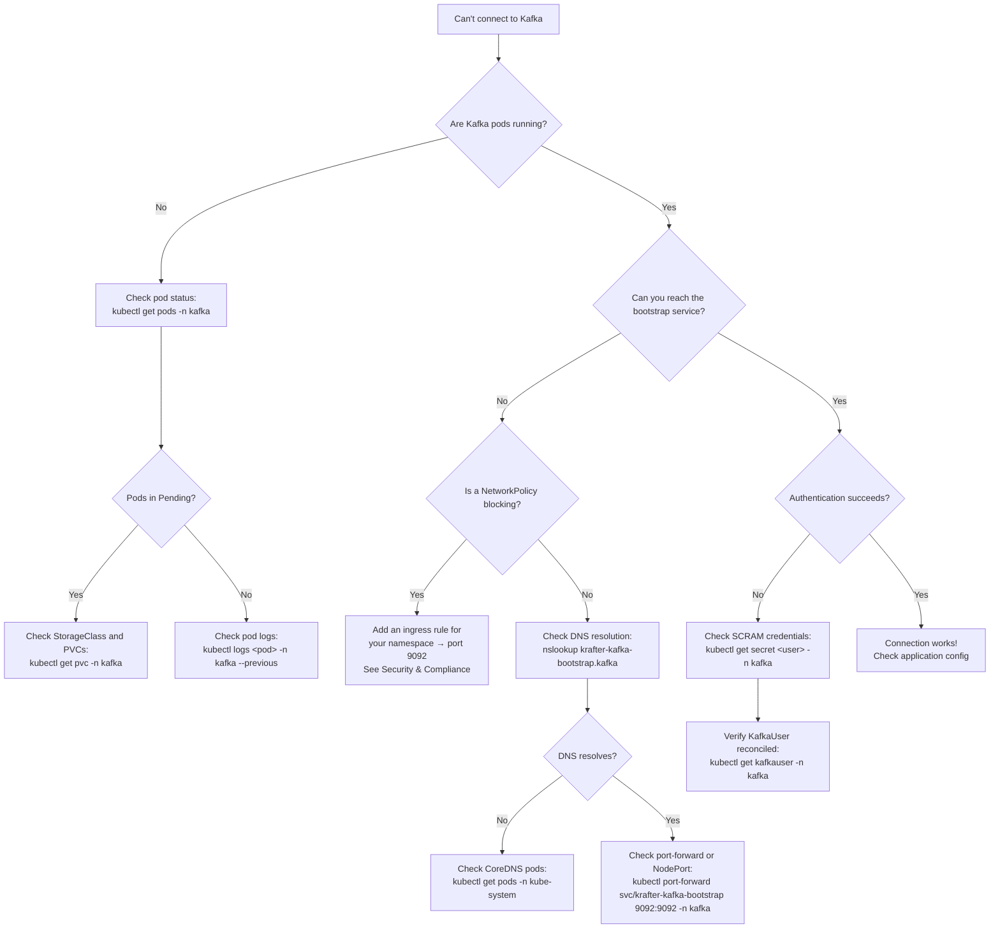

# Troubleshooting Index

A consolidated index of troubleshooting procedures from across the book. Jump to the relevant section for step-by-step diagnosis and fixes.

## Kafka Cluster

| Symptom | Likely Cause | Chapter |
|---------|-------------|---------|
| Strimzi operator `CrashLoopBackOff` with `UnsupportedVersionException` | Local chart has mismatched Kafka image map | [Kafka Deployment Engineering](15-kafka-deployment.md#strimzi-operator-crashloopbackoff) |
| Brokers crash with `ConfigException: Invalid value -1 for local.retention.bytes` | Kafka 4.1+ tightened validation — `-1` rejected when `retention.bytes` is set | [Kafka Deployment Engineering](15-kafka-deployment.md#brokers-crash-with-configexception) |
| Brokers crash immediately with `remote.log.storage.system.enable=true` | Tiered storage enabled without remote storage manager plugin JAR | [Kafka Deployment Engineering](15-kafka-deployment.md#brokers-crash-with-remotelogmanager) |
| `KafkaActiveControllerCount != 1` alert | Controller quorum lost or election in progress | [Kafka Deployment Engineering](15-kafka-deployment.md#prometheus-alerts) |
| Under-replicated partitions for extended period | Broker disk I/O saturated, network issues, or follower falling behind | [The Cluster Under Test](03-cluster.md#failure-tolerance-matrix) |
| Cruise Control `unsupported goals` error | Goals list doesn't match Strimzi's default goals | [Kafka Deployment Engineering](15-kafka-deployment.md#cruise-control-goal-mismatch) |
| Kafka CR stuck on `NotReady` with `UnforceableProblem` | Strimzi operator egress blocked by `generateNetworkPolicy` or isolated topology NetworkPolicy missing DNS/API server egress — can't reach controllers | [Kafka Deployment Engineering](15-kafka-deployment.md#strimzi-operator-cannot-determine-active-controller) |

## Kafka Connectivity

| Symptom | Likely Cause | Chapter |
|---------|-------------|---------|
| Kafka UI `CreateContainerConfigError` — secret not found | `KafkaUser` not applied before UI deployment | [Kafka Deployment Engineering](15-kafka-deployment.md#kafka-ui-createcontainerconfigerror) |
| Kates can't connect to Kafka | Wrong bootstrap address or NetworkPolicy blocking | [Deployment Guide](12-deployment.md#kates-cant-connect-to-kafka) |
| SCRAM authentication failure | Password rotated or KafkaUser not reconciled | [Security & Compliance](17-security.md#scram-sha-512) |
| Connection timeout from new namespace | Missing NetworkPolicy entry for the new namespace | [Security & Compliance](17-security.md#testing-network-policies) |

## Performance Issues

| Symptom | Likely Cause | Chapter |
|---------|-------------|---------|
| P99 latency regression between test runs | Partition hotspot, GC pauses, or ISR changes | [Recipes & Patterns — Recipe 4](14-recipes.md#recipe-4-investigate-a-latency-regression) |
| Bimodal latency distribution in heatmap | Some requests hitting page cache, others going to disk | [Performance Theory](04-performance-theory.md#heatmaps-seeing-the-full-picture) |
| Artificially low latency measurements | Coordinated omission — tool slows down with the system | [Performance Theory](04-performance-theory.md#coordinated-omission) |
| Stress test results vary wildly between identical runs | JVM warmup (JIT), GC pauses, small sample size — increase records to 500K+, use ZGC, discard first 2–3 warmup iterations | [Performance Theory](04-performance-theory.md#the-long-tail-problem), [Deployment Guide](12-deployment.md#jvm-tuning) |
| `KafkaRequestHandlerSaturated` alert | Request handlers over 70% busy — add threads or brokers | [Kafka Deployment Engineering](15-kafka-deployment.md#prometheus-alerts) |
| `KafkaLogFlushLatencyHigh` alert | Disk I/O saturated — check storage class and disk utilization | [Kafka Deployment Engineering](15-kafka-deployment.md#prometheus-alerts) |

## Deployment Issues

| Symptom | Likely Cause | Chapter |
|---------|-------------|---------|
| Images won't load into Kind | Registry unreachable or platform mismatch (arm64/amd64) | [Deployment Guide](12-deployment.md#images-wont-load) |
| Kafka pods stuck in `Pending` | StorageClass not created or no available nodes in the zone | [Deployment Guide](12-deployment.md#kafka-pods-not-starting) |
| PDB blocks rolling restart | Only 1 pod can be unavailable — intentional safety behavior | [Upgrade Playbook](18-upgrade-playbook.md#common-upgrade-issues) |
| Entity Operator never starts | Kafka CR hasn't reached `Ready` — check operator logs for `UnforceableProblem` | [Kafka Deployment Engineering](15-kafka-deployment.md#strimzi-operator-cannot-determine-active-controller) |
| PostgreSQL pod `CrashLoopBackOff` with `could not create lock file` | `readOnlyRootFilesystem: true` mutated by Kyverno — mount `emptyDir` at `/var/run/postgresql` and `/tmp` | [Deployment Guide](12-deployment.md#read-only-filesystem-compliance) |
| Pod admission rejected with Kyverno policy violation | Pod doesn't meet PSS standards — run `kates kyverno violations` to identify failing rules, then fix the manifest or add a `PolicyException` | [Security & Compliance](17-security.md#kyverno-policy-integration--admission-control) |

## CLI Issues

| Symptom | Likely Cause | Chapter |
|---------|-------------|---------|
| `kates health` killed immediately (exit 137) on macOS | macOS blocks unsigned binary — `com.apple.provenance` xattr | [Deployment Guide](12-deployment.md#cli-binary-killed-on-macos) |
| CLI connection timeout / connection refused | Backend not running or port-forward died | [Deployment Guide](12-deployment.md#kates-cant-connect-to-kafka) |

## Chaos Engineering

| Symptom | Likely Cause | Chapter |
|---------|-------------|---------|
| Litmus experiments fail to start | Chaos operator pod not running or RBAC insufficient | [Deployment Guide](12-deployment.md#litmus-experiments-fail) |
| Disruption doesn't take effect | Target pod selector doesn't match, or NetworkPolicy blocks | [Chaos Engineering in Practice](07-chaos-practice.md) |
| Cluster doesn't recover after chaos | ISR too small, `min.insync.replicas` violated | [Chaos Engineering Theory](06-chaos-theory.md) |

## Upgrades

| Symptom | Likely Cause | Chapter |
|---------|-------------|---------|
| `UnsupportedVersionException` after operator upgrade | Kafka version not supported by new operator version | [Upgrade Playbook](18-upgrade-playbook.md#version-compatibility-matrix) |
| Topics not reconciling after CRD API change | CRDs still using deprecated `v1beta2` | [Upgrade Playbook](18-upgrade-playbook.md#post-upgrade--api-migration) |
| Performance regression after Kafka upgrade | New version defaults changed — compare baseline tests | [Upgrade Playbook](18-upgrade-playbook.md#procedure) |

## Connectivity Debugging Flowchart

When you can't connect to Kafka, work through this decision tree. The commands here and in [Quick Diagnostic Commands](#quick-diagnostic-commands) assume the chart defaults — cluster name `krafter` in namespace `kafka` (set in `charts/kafka-cluster/values.yaml`); adjust them if your deployment overrides these values.



## When to Escalate

Not every problem is a Kates problem. Use this guide to determine where to focus your investigation:

| Symptom Pattern | Likely Layer | What to Check |
|-----------------|-------------|---------------|
| `kates health` shows all components UP, but tests fail | **Kafka** | Check broker logs, partition health, ISR state |
| CLI commands return "connection refused" or timeout | **Kates backend** | Check Kates pod status, port-forward, service endpoints |
| Pods stuck in `Pending`, `CrashLoopBackOff`, or `ImagePullBackOff` | **Kubernetes** | Check node resources, StorageClass, image registry access |
| Kyverno rejecting pod creation | **Kyverno policies** | Run `kates kyverno violations` to identify which rule is failing |
| Latency numbers are unreasonably high for all tests | **Infrastructure** | Check node CPU/memory pressure, disk I/O, network bandwidth |
| Everything works locally but fails in CI | **CI environment** | Check resource limits, network access, Docker-in-Docker configuration |

::: {.callout-tip}
When filing an issue, include the output of `kates doctor` — it runs a battery of diagnostic checks and gives you a single summary of system health.
:::

## Common Issues (Additional)

| Symptom | Likely Cause | Fix |
|---------|-------------|-----|
| `kates cluster topology` returns "Cluster topology is only available when the Kates backend is deployed on Kubernetes with access to Strimzi CRDs" | Missing `ClusterRoleBinding` for the Kates service account — the backend can't query Strimzi CRDs | Verify RBAC: `kubectl get clusterrolebinding kates` — if missing, redeploy with `helm upgrade --install kates charts/kates -n kates` |
| Test results show 0 records consumed even though producers succeeded | Consumer group hasn't started consuming, or topic has no committed offsets for the group | Check consumer lag: `kates kafka group <group-name>`. If lag equals total records, the consumer never started — check Kates backend logs for consumer errors |
| `kates trend` shows no data even after running tests | Tests completed but trend queries require at least 2 data points of the same test type | Run the same test type at least twice. Trend analysis needs historical data to draw a line |

## Quick Diagnostic Commands

```bash
# Cluster overview
kubectl get kafka,kafkanodepool,kafkatopic,kafkauser -n kafka

# Pod health
kubectl get pods -n kafka -o wide

# Strimzi operator logs (last 50 lines)
kubectl logs deployment/strimzi-cluster-operator -n kafka --tail=50

# Broker logs (last crash)
kubectl logs <broker-pod> -n kafka --previous --tail=30

# Kafka status conditions
kubectl get kafka krafter -n kafka -o jsonpath='{range .status.conditions[*]}{.type}: {.status} - {.message}{"\n"}{end}'

# Under-replicated partitions
kubectl exec <broker-pod> -n kafka -- bin/kafka-topics.sh --describe --under-replicated-partitions --bootstrap-server localhost:9092

# Consumer lag
kubectl exec <broker-pod> -n kafka -- bin/kafka-consumer-groups.sh --bootstrap-server localhost:9092 --all-groups --describe

# Kyverno policy status
kates kyverno status

# Kyverno violations (all namespaces)
kates kyverno violations

# Kyverno violations (specific namespace)
kates kyverno violations --namespace kafka
```

