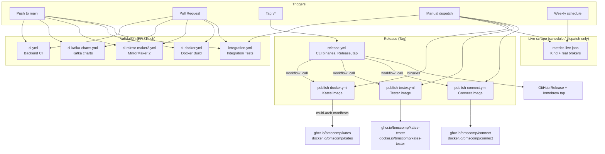
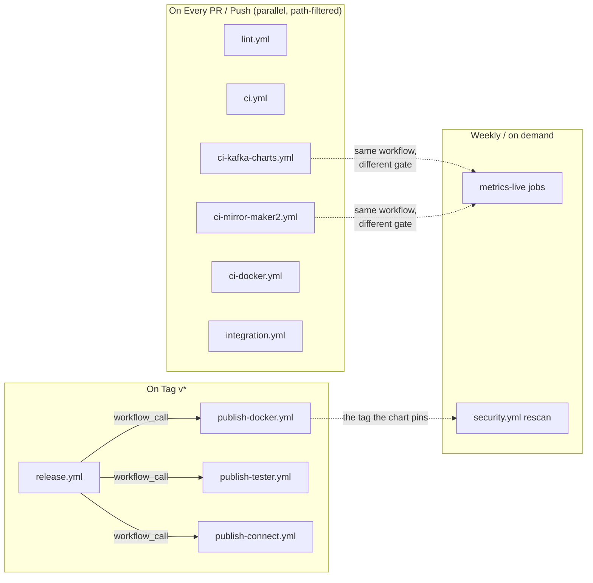

# CI/CD Pipeline

This appendix documents the GitHub Actions workflows that automate building, testing, and releasing the Kates platform — from pull-request validation to production image publishing and CLI binary releases. The repository carries further workflows for the Apicurio Registry chart (`ci-apicurio.yml`), the Connect image build check (`ci-connect.yml`), native-image builds (`native.yml`), the linters (`lint.yml`), dependency review and the weekly rescan of released images (`security.yml`), CodeQL (`codeql.yml`), chart publishing (`publish-charts.yml`), registry descriptions (`sync-registry-descriptions.yml`), and documentation builds (`docs.yml`, `book.yml`); they follow the same patterns and are not covered here.

Two things to keep in mind while reading. First, **any job that renders a chart runs `helm dependency build` first** — `strimzi-operator` pulls the operator subchart from `quay.io`, and `kafka-cluster`, `connect-cluster` and `mirror-maker2` all resolve the `kafka-common` library through a `file://` dependency. `helm lint` only warns about a missing dependency and still exits 0, so a job that skips the build can be green while the chart cannot be deployed. Second, the expensive jobs — the ones that stand up a Kind cluster and scrape a real broker — are gated behind a schedule, a manual dispatch, or a pull-request label, and never run on an ordinary push.

## Pipeline Overview



The validation workflows trigger independently — each filters its own jobs by path and there is no chaining between them. The `metrics-live` jobs live inside `ci-kafka-charts.yml` and `ci-mirror-maker2.yml` rather than in a workflow of their own, because they share those workflows' triggers and contracts; what separates them is the `if:` gate that keeps them off the push path.

## Path-Based Change Detection

Every validation workflow starts on every push and pull request, and then decides *inside the run* what to do: a first `changes` job uses `dorny/paths-filter` to classify the diff, and each real job carries an `if:` on that classification. A docs-only change starts `ci.yml` and skips every job in it within seconds.

The filters used to be workflow-level `paths:` blocks, and the move is not cosmetic. A workflow that never starts never reports a check, and a required status check that never reports blocks the merge forever — so a path-filtered workflow could not be required by branch protection at all. A job that starts and skips itself counts as passed. Each workflow therefore ends in a **gate** job (`Gate · Backend`, `Gate · Kafka charts`, …) that runs unconditionally, passes when every job it depends on succeeded or was skipped, and fails on any failure or cancellation. The gates are the only checks the `main` ruleset requires; adding or renaming a job inside a workflow never touches branch protection.

| Workflow | Filtered on |
|----------|-------------|
| `ci.yml` | `code` (`kates/**`, `cli/**`, `images.env`, `versions.env`, the workflow and composite actions), `helm` (`charts/**`, `versions.env`, `scripts/check-versions.sh`, `config/cluster.yaml`), `yaml` (`config/**`) |
| `ci-kafka-charts.yml` | `charts/kafka-cluster/**`, `charts/connect-cluster/**`, `charts/mirror-maker2/**`, `charts/kafka-common/**`, `charts/strimzi-operator/**`, `charts/monitoring/**`, `charts/kates/**`, `charts/kates-chaos/**`, the checker scripts (`scripts/check-strimzi-crs.py`, `check-strimzi-metrics.sh`, `check-chart-matrix.py`, `check-metric-contract.sh`), `scripts/chart-matrix/**`, `scripts/metric-contract/**`, `dashboards/**`, `images.env`, `versions.env` |
| `ci-mirror-maker2.yml` | `charts/mirror-maker2/**`, `charts/kafka-common/**`, `charts/legacy-kafka/**`, `charts/kafka-cluster/**` (the migration e2e stands a real source cluster up), `Dockerfile.legacy-kafka`, the migration scripts, `scripts/metric-contract/**`, `cli/cmd/migrate*.go`, `cli/pkg/migrate/**`, `cli/internal/podrun/**`, `docs/mirror-maker2-runbook.md` |
| `ci-docker.yml` | `kates/**`, `cli/**`, `images.env`, `versions.env` |
| `integration.yml` | `kates/**`, `cli/**`, `config/**`, `Makefile`, `images.env`, `versions.env` |
| `lint.yml` | one category per linter: workflows, scripts, Dockerfiles, YAML, Go, Java, the Makefile |

The `ci.yml`, `ci-docker.yml` and `integration.yml` filters exclude `**/*.md` under the source trees, so a README edit does not trigger a build. `ci-mirror-maker2.yml` is the deliberate exception: its filter lists `docs/mirror-maker2-runbook.md`, because one of its checks asserts that every `runbook_url` anchor the alerts point at is a real heading in that file, and a heading rename must therefore run the job. Scheduled and manual runs have no diff to filter on, and run everything.

`ci.yml`'s `helm` category includes `config/cluster.yaml`, because `scripts/check-versions.sh` asserts the Kind node image tags in that file against `versions.env`. `ci-mirror-maker2.yml` adds `labeled` to its pull-request event types; without it the `test-migration` label would fire nothing and the job it gates would be unreachable on a pull request.

Every workflow also shares three conventions: a `concurrency` group per branch (a new push to a pull request cancels the run it supersedes; pushes to `main` and tags always run to completion), a `timeout-minutes` on every job, and every `uses:` pinned to a commit SHA with the version in a trailing comment, which Dependabot keeps current. The tool versions the workflows install — Helm, kubeconform, the Kyverno CLI, Java, Node, the linters — are declared once in `versions.env` and exported by the `load-versions` composite action; `scripts/check-versions.sh --workflows` fails on a workflow that hardcodes one. Go's version is `cli/go.mod`.

---

## 1. Backend CI (`ci.yml`)

**Purpose:** Validates backend code, CLI code, Helm chart integrity, Kyverno policies, and config YAML on every push and pull request.

**Triggers:**
- Push to `main` branch (paths in the table above)
- Pull request targeting `main` (same paths)

### What It Runs

| Job | Runtime | Description |
|-----|---------|-------------|
| **Detect Changes** | `dorny/paths-filter` | Splits the run into `code`, `helm` and `yaml` categories. Every job below keys its `if:` off one of them, except Kyverno Policy Validation, which always runs |
| **Build & Test** | Java 21 (Temurin) | Compiles the Quarkus backend and runs the test suite with `./mvnw verify`, publishes the surefire *and* failsafe JUnit reports as a check, uploads the JaCoCo report and writes its totals to the run summary |
| **Dependency CVE scan** | — | Trivy over the Maven tree and `govulncheck` over the Go module, as its own job so a new CVE and a failing test are two different red checks |
| **CLI Tests** | Go 1.25 | Runs `go test -race` across all CLI packages, then the terminal-compatibility and CLI style harnesses |
| **Helm Lint** | Helm v3.17.0 | Lints, renders and schema-validates every chart under `charts/`, and runs the repository's cross-file consistency checks |
| **Kyverno Policy Validation** | Kyverno CLI v1.13.0 | Renders the Kyverno policy templates from the `kates`, `kafka-cluster`, and `kates-chaos` charts and validates them with `kyverno apply` |
| **YAML Validation** | Python + PyYAML | Parses every YAML file under `config/` to catch syntax errors |

### Key Details

- **Java 21** is used as the build JDK, matching the project's compiler target (`maven.compiler.release`)
- The JUnit reporter globs both `surefire-reports` and `failsafe-reports`. Globbing only surefire made every integration-test result invisible in the checks UI — the job still went red, with no indication of which test broke
- The Trivy scan fails the build on `CRITICAL` findings only, with `ignore-unfixed` set, and is pointed at `.trivyignore.yaml` explicitly. The scan target is `kates/`, the ignore file is at the repository root, and an ignore file that is silently not loaded is the worst of both worlds
- The **Go race detector** (`-race`) is always enabled to catch data races in CLI concurrency paths (e.g., streaming watch, dashboard refresh); packages run serially (`-p 1`) to keep memory in check. `scripts/check-cli-compat.sh` then runs the real binary under piped stdout, `NO_COLOR`, `TERM=dumb`, `--plain` and an unset locale — the conditions that produce escape codes in CI logs, which unit tests never see — and `scripts/check-cli-style.sh` is its static companion

### What Helm Lint Actually Checks

This job grew well past `helm lint charts/kates`. In order:

| Step | What it asserts |
|------|-----------------|
| `helm lint` / `helm template` on `charts/kates` | The chart this repository's own application ships in renders |
| `scripts/check-versions.sh` | The Strimzi, Kafka, Connect-image and local-toolchain pins agree across every file that carries one |
| `scripts/check-chart-test-paths.sh` | Every path a chart's Helm test calls exists as a JAX-RS resource. A test that calls a 404 exits 0, so `helm test` passing proves nothing on its own |
| `helm dependency build charts/strimzi-operator/`, then lint and template it across `values-kind`, `-dev`, `-prod` and `-generic` | The operator wrapper renders on every overlay it ships, not only on defaults |
| A deliberately misspelled `--set strimzi-kafka-operator.leaderElection.enabled=false` | The values schema **rejects** it. The chart's reason to exist is that a typo'd key fails loudly instead of being silently ignored, so the rejection itself is asserted |
| `helm dependency build` across `kafka-cluster`, `kates-chaos`, `monitoring`, `mirror-maker2`, `connect-cluster`, `kates-platform` | Charts whose dependency archives are gitignored are fetched before anything renders them. `mirror-maker2` and `connect-cluster` come before `kates-platform`, because the umbrella packages its `file://` subcharts as they are on disk |
| `helm lint` and `helm template` over `charts/*/` | Every chart renders. A library chart is linted but not templated — `kafka-common` is not installable, and `ci-kafka-charts.yml` renders its harness instead |
| kubeconform against each render | Rendered manifests satisfy the Kubernetes OpenAPI schemas and, for custom resources, the community CRD catalog. `-ignore-missing-schemas` keeps kinds with no published schema from failing the build |
| `scripts/gen-chart-table.sh --check` | The chart table in the root `README.md` still matches `charts/*/Chart.yaml` |

---

## 2. Kafka Charts CI (`ci-kafka-charts.yml`)

**Purpose:** Checks the Strimzi charts — `strimzi-operator`, `kafka-cluster`, `connect-cluster`, `mirror-maker2`, and the `kafka-common` library they share — the way `ci-mirror-maker2.yml` checks MirrorMaker 2: rendered across every overlay and toggle, not only on defaults.

**Triggers:**

- Push to `main` and pull requests, on the chart and checker paths in the table above
- Manual `workflow_dispatch`
- A weekly `schedule` (Mondays, 05:00 UTC), which is the only automatic trigger for the live-scrape job

### What It Runs

| Job | Gate | Description |
|-----|------|-------------|
| **kafka-common** | Every push and pull request | Lints the library, builds the dependencies of its harness chart (`charts/kafka-common/tests/harness`), and runs `helm unittest` against it |
| **`<chart>`** (the render matrix) | Every push and pull request, one job per chart | Renders the chart across its documented shapes and checks every render |
| **Metric contract (live scrape, `<chart>`)** | `workflow_dispatch` or `schedule` only, for `kafka-cluster` and `connect-cluster` | Stands up a Kind cluster, runs Kafka (and Connect), scrapes the pods, and diffs the metric catalogue against the capture |

### The Library Job

A library chart cannot be rendered on its own, so `kafka-common` is exercised through a harness chart that calls every template while helm-unittest asserts on the output — including the refusals. The helm-unittest plugin version is read from `versions.env` (`HELM_UNITTEST_VERSION`) rather than floating, for the same reason every other tool version is pinned there.

The job ends with a packaging assertion: `helm package charts/kafka-common` must produce an archive with no `tests/` directory in it. A test harness that ships to users is not a test harness, it is dead weight in every install.

### The Render Matrix

The `matrix` job fans out over `strimzi-operator`, `kafka-cluster`, `connect-cluster` and `mirror-maker2`. Each job first fetches dependencies — always `helm dependency build charts/strimzi-operator/`, because the CRD schemas every render is checked against come from the operator chart this repository pins rather than from a community catalogue that may not carry the v1 Strimzi schemas at all, and then `helm dependency build` for the matrix chart itself when it declares dependencies.

`scripts/check-chart-matrix.py <chart>` then walks `scripts/chart-matrix/<chart>.yaml`, which lists the renders (overlays, toggles, API-version sets, Kubernetes versions) and the rails. Every render is checked three ways: against the pinned Strimzi CRDs with `scripts/check-strimzi-crs.py` (pruned fields, missing required fields, enum violations, duplicate keys), with kubeconform for built-in kinds, and against the render's own `assert` entries. The rails are the inverse — renders that must be **refused**, with the refusal message asserted, so a rail that fails for the wrong reason is not mistaken for a working one.

::: {.callout-note}
A render marked `known: <ID>` in the matrix file is a documented defect that must still reproduce. The job fails when such a render *stops* failing, so a marker cannot outlive its fix. That is the opposite of the usual skip annotation, and it is deliberate: a stale exemption is how a fixed bug quietly comes back.
:::

The remaining steps in each matrix job:

| Step | What it asserts |
|------|-----------------|
| `scripts/check-metric-contract.sh <chart>` | Every series an alert or a dashboard panel reads is one the chart's exporter rules actually produce. Skipped with a note for `strimzi-operator`, which has no contract file |
| `scripts/check-chart-matrix.py <chart> --promtool` | Every alert and recording rule is PromQL the pinned Prometheus accepts. `promtool` is downloaded at the version `images.env` pins for the Prometheus image |
| `scripts/check-strimzi-metrics.sh` (`kafka-cluster` only) | The exporter rules `kafka-cluster` vendors still match upstream Strimzi's, because the operator's dashboards read exactly what they produce |
| `helm unittest charts/<chart>` | Runs where `charts/<chart>/tests/*_test.yaml` exists — today `kafka-cluster` and `connect-cluster` |
| Packaging check (`kafka-cluster`, `connect-cluster`) | The published archive carries the Helm test pods under `templates/tests/` but **not** the `tests/` unit-test directory; for `kafka-cluster`, `profiles/platform.yaml` must be in the package, since the platform profile is useless to an installer who cannot reach it |

### The Live Scrape

`metrics-live` asks the one question a render cannot answer: what does a real worker actually expose? It creates a three-zone Kind cluster from `config/cluster.yaml`, deploys Strimzi and Kafka through `scripts/deploy-kafka-generic.sh` with `charts/kafka-cluster/values-ci.yaml`, layers `scripts/metric-contract/live/kafka-cluster.yaml` on top to turn the exporter agent on, produces and consumes real traffic as the platform's own principal, port-forwards each exporter's `/metrics`, and runs the contract against the capture.

The traffic step is not ceremony. A cluster nobody has written to registers a fraction of its per-topic, request and consumer-group beans, so scraping an idle broker would pass a contract that a busy one fails. For the `connect-cluster` leg the job additionally waits for at least two connectors to report `RUNNING`, since the task and client beans do not exist until a connector runs.

Captures are uploaded as an artifact with a 14-day retention, so a note about an uncatalogued series can be turned into a catalogue entry without paying for another cluster. On failure the job collects cluster state, custom resources, events and pod logs into a second artifact.

::: {.callout-important}
This job costs minutes and a cluster, which is why it runs weekly and on demand rather than on every push. Nothing on the pull-request path depends on it — the render-time contract check in the `matrix` job is what gates a merge.
:::

---

## 3. MirrorMaker 2 CI (`ci-mirror-maker2.yml`)

**Purpose:** Validates the `mirror-maker2` chart, the migration path it exists for, and the metrics its dashboard reads. Three jobs with very different costs.

### What It Runs

| Job | Gate | Timeout |
|-----|------|---------|
| **Chart validation** | Every push and pull request on the paths above | default |
| **Migration e2e (Kafka `<source>` → 4.x)** | `workflow_dispatch`, or a pull request carrying the `test-migration` label | 50 minutes |
| **Metric contract (live scrape)** | `workflow_dispatch`, the weekly `schedule` (Mondays, 05:30 UTC), or the `test-migration` label | 40 minutes |

### Chart Validation

Cheap enough to run on every pull request, and it does considerably more than a lint. It opens with `helm dependency build charts/mirror-maker2/` — the chart is built on the `kafka-common` library, so nothing renders until that resolves — then lints `mirror-maker2` and `legacy-kafka` and renders every overlay the chart ships: `kind`, `dev`, `prod`, `generic`, `mtls`, `migrate-2x`, `migrate-3x`, `migrate-4x`, `readonly-source`, `fan-in`, `failover` and `scale`.

`values-failback.yaml` is rendered with a source cluster named on the command line rather than as shipped, and that is the point: the overlay ships an *empty* source so the chart refuses a bare render instead of silently mirroring the target into itself.

The rest of the job:

- **Safety rails must reject bad input** — a guard that has never been observed to fail is indistinguishable from no guard, so each rail's refusal is asserted
- Renders are validated against the Strimzi CRD schemas with kubeconform and PyYAML alongside
- The Grafana dashboard's JSON parses and its layout holds; every query on it is valid PromQL; the go/no-go panel on the migration board behaves
- The metric contract and `promtool` checks, plus `promtool` **unit tests** for the SLI and SLO rules — not just that they parse, but that they compute what they claim to
- Every alert's `runbook_url` anchor resolves to a heading in `docs/mirror-maker2-runbook.md`
- Every embedded pod script parses under `dash`, and the migration scripts pass `shellcheck`
- A render diff against the last commit that carried a different chart version, asserting that the previous version's overlays still render **additively**. Deliberate removals are listed in the job with the decision behind each one; anything not on that list is a regression by definition. The job checks out with `fetch-depth: 0`, because a shallow clone has no history to walk

### Migration e2e and the Live Scrape

`migration-e2e` stands up a Kind cluster, a real Kafka 2.8.2 or 3.9.1 broker, and a real mirror, then asserts on real records. The `workflow_dispatch` input selects one source version or both. The whole point of the chart is this job; the whole point of not running it every time is that nobody waits ten minutes for a typo fix.

`metrics-live` is the same tier and the same cluster shape with a different question. Chart validation proves every series the rules and the dashboard read is one the exporter rules *can* produce, against a hand-written catalogue of MBeans; this job scrapes a real worker and diffs the catalogue against it, so an attribute a Kafka upgrade renames surfaces here rather than as an empty panel.

---

## 4. Docker Build Validation (`ci-docker.yml`)

**Purpose:** Validates that the Kates Docker images build successfully without pushing to a registry.

**Triggers:**
- Push to `main` branch
- Pull request targeting `main`

### Build Matrix

| Variant | Base Image | Platforms | Description |
|---------|-----------|-----------|-------------|
| **JVM** | `eclipse-temurin:21-jre` | `linux/amd64`, `linux/arm64` | Standard JVM-based image with a Java 21 runtime |
| **Native** | `ubi9-minimal` (Mandrel-built) | `linux/amd64` | GraalVM (Mandrel) native image — fast startup, lower memory |

### Key Details

- Uses **Docker Buildx** on native runners for each architecture — `ubuntu-latest` for amd64 and `ubuntu-24.04-arm` for arm64 — so no QEMU emulation is needed
- The matrix runs three combinations in parallel; **native/arm64 is excluded** from CI because GraalVM native-image is too slow even on native ARM runners — that combination is validated at release time instead
- Images are built with `push: false` — no registry writes during validation
- Build cache is stored via GitHub Actions cache (scoped per variant and architecture) to speed up subsequent builds

```yaml
strategy:
  fail-fast: false
  matrix:
    include:
      - { variant: jvm,    arch: amd64, runner: ubuntu-latest }
      - { variant: native, arch: amd64, runner: ubuntu-latest }
      - { variant: jvm,    arch: arm64, runner: ubuntu-24.04-arm }
```

---

## 5. Integration Tests (`integration.yml`)

**Purpose:** Spins up an ephemeral Kind cluster and validates what needs a real Kubernetes API — cluster topology, the `kates detect` compatibility gate, and server-side dry-runs of the Kafka manifests. Chart linting and config parsing are `ci.yml`'s job and are not repeated here.

**Triggers:**
- Push to `main` branch (paths in the table above)
- Pull request targeting `main` (same paths)
- Manual `workflow_dispatch`

### Infrastructure Provisioned

The workflow provisions a Kind cluster inside the GitHub Actions runner via `helm/kind-action`, created from `config/cluster.yaml` with three zone-labelled nodes (`alpha`, `sigma`, `gamma`):

| Component | Version | Purpose |
|-----------|---------|---------|
| Kind | `versions.env` `KIND_VERSION` | Ephemeral Kubernetes cluster with three zone-labelled nodes |
| kubectl | `versions.env` `KUBECTL_VERSION` | Applies and dry-runs manifests against the cluster |
| Helm | `versions.env` `HELM_VERSION` | Available for the manifests that need it |
| Go | `cli/go.mod` | Builds the `kates` CLI from source for the compatibility gate |

The pins are **not** declared in the workflow. The `load-versions` composite action exports them from `versions.env` into `$GITHUB_ENV`, and fails if one is missing — a silently empty `KIND_VERSION` would request a download URL with a hole in it and install a 404. The node image is deliberately left out of the action's inputs too: `config/cluster.yaml` names it per node, `scripts/check-versions.sh` asserts that file against `versions.env`, and passing the image as a flag as well would create a second source of truth that silently wins over the file.

### Validation Steps

1. **Cluster readiness** — waits for all Kind nodes to reach `Ready`
2. **Topology check** — verifies one node exists per zone (`alpha`, `sigma`, `gamma`)
3. **CI gate** — builds the CLI and runs `kates detect --fail-on-error --quiet` to confirm the cluster is compatible with a Kafka deployment
4. **Manifest dry-runs** — applies the storage classes, creates the namespaces, and server-side dry-runs the Kafka topic and NetworkPolicy manifests
5. **Monitoring config check** — verifies the Jaeger Helm values files are present

### Key Details

- The Kafka manifests are validated with `kubectl apply --dry-run=server` — the Strimzi operator is **not** installed, so this checks manifest validity against the API server rather than deploying a running Kafka cluster
- The job has a **30-minute timeout** and posts a per-check results table to the GitHub Actions step summary, read from each step's real outcome
- There is no explicit teardown. `helm/kind-action` registers a post step that deletes the cluster it created, on success and on failure alike; a `kind delete` of our own would only race it

---

## 6. Publish Kates Docker Image (`publish-docker.yml`)

**Purpose:** Builds and pushes the production Kates backend image to GitHub Container Registry (GHCR) and Docker Hub.

**Triggers:**
- Tag push matching `v*` (e.g., `v1.0.0`, `v2.3.1-rc1`)
- Manual workflow dispatch, with inputs to select the variant (`jvm`, `native`, or `both`) and target platforms

### Build Outputs

| Variant | Images | Platforms |
|---------|--------|-----------|
| **JVM** | `ghcr.io/bmscomp/kates:<version>`, `docker.io/bmscomp/kates:<version>` | `linux/amd64`, `linux/arm64` |
| **Native** | `ghcr.io/bmscomp/kates:<version>-native`, `docker.io/bmscomp/kates:<version>-native` | `linux/amd64`, `linux/arm64` |

### Process

1. **Compute the matrix** — the version is derived from the tag; each platform is mapped to a native runner (amd64 → `ubuntu-latest`, arm64 → `ubuntu-24.04-arm`), so no QEMU emulation is used
2. **Build and push per-architecture images** tagged `sha-<commit>-<arch>-<variant>` to both registries, each with a SLSA provenance and an SPDX SBOM attestation alongside
3. **Create multi-platform manifests** — `docker buildx imagetools create` combines the per-arch images (attestations included) so a single tag resolves to the correct architecture at pull time
4. **Verify** — asserts every requested platform is in the merged index, then scans the published image with Trivy (fixable `CRITICAL` findings fail the release)
5. **Sign** the release manifests with Cosign keyless signing (`cosign sign --yes`), on tag builds. The index digest comes from `docker buildx imagetools inspect`; the previous `docker manifest inspect -v | jq .digest` returned an array for a multi-arch image, so every image from 1.22.0 to 1.23.0 was "skipped" with a warning in a green job
6. **Update charts** — bumps `appVersion` in `charts/kates` on `main` and commits with `[skip ci]`

### Image Tags

| Tag Pattern | Example | Description |
|------------|---------|-------------|
| `<semver>` | `1.20.0` | Specific release version (the tag's leading `v` is stripped) |
| `<major>.<minor>`, `<major>` | `1.20`, `1` | Floating minor and major tags |
| `<semver>-native` | `1.20.0-native` | Native image variant |
| `<short-sha>` | `abc1234` | Commit-specific manifest tag |
| `sha-<commit>-<arch>-<variant>` | `sha-abc…-arm64-jvm` | Per-architecture intermediate build |

---

## 7. Publish Kates Tester Image (`publish-tester.yml`)

**Purpose:** Builds and pushes the `kates-tester` image — a lightweight container used in Helm test hooks and integration testing.

**Triggers:**
- Tag push matching `v*`
- Manual workflow dispatch

### Image Details

| Property | Value |
|----------|-------|
| **Images** | `ghcr.io/bmscomp/kates-tester:<version>`, `docker.io/bmscomp/kates-tester:<version>` |
| **Base** | `debian:bookworm-slim` |
| **Contents** | `kcat`, the Apache Kafka CLI scripts, `kubectl`, `curl`, `jq`, DNS and netcat utilities |
| **Platforms** | `linux/amd64`, `linux/arm64` (cross-built with QEMU) |

The tester image is referenced by the Kafka charts' test hooks — `kafka-cluster`, `connect-cluster`, `mirror-maker2` and `strimzi-operator` all pin it under `testImages`, and the operator chart's CRD-upgrade hook runs on it too. It validates Kafka connectivity, SCRAM authentication, and ACL enforcement from inside the cluster.

---

## 8. Publish Kafka Connect Image (`publish-connect.yml`)

**Purpose:** Builds and pushes the enterprise Kafka Connect image — Debezium CDC, the Apicurio Registry converters, and the Aiven JDBC and S3 connectors — to GHCR and Docker Hub.

**Triggers:**
- Tag push matching `v*`, filtered to changes touching `Dockerfile.connect`
- Manual workflow dispatch, with an optional Debezium version override and a platform selection

### Jobs

| Job | Description |
|-----|-------------|
| **Compute Build Matrix** (`meta`) | Derives the version and the image tag from `Dockerfile.connect`, and maps each requested platform to a native runner |
| **Build Connect (`<arch>`)** | Builds and pushes one single-arch image per platform, tagged `sha-<commit>-<arch>` |
| **Merge Multi-Arch Manifests** | Combines them with `docker buildx imagetools create` |
| **Verify Published Images** | Asserts every platform is in the index, pulls the image, lists the connector plugins it actually contains, and scans it with Trivy |
| **Sign Images** | Cosign keyless signing, on tag builds only, after verification |
| **Update Helm Charts** | Rewrites the image pin in `connect-cluster` on `main`, on tag builds only |

### Two Details Worth Knowing

**The tag folds in the Kafka base version.** The image's identity is the pair (Debezium, Kafka base), so the tag is `<debezium>-kafka-<kafka>` — for example `3.6.2-kafka-4.3.1`. Tagging by Debezium alone meant a base bump did not move the tag, and `connect:<debezium>` silently changed content under a fixed name. The Kafka version is parsed out of the base `FROM` line, and the job fails rather than guessing if that parse comes back empty.

**Manifests carry annotations, not labels.** `Dockerfile.connect` has a complete `LABEL` block, but labels live in the per-platform image config and a multi-arch index has none — so nothing propagated and the registry's description page stayed blank. The merge job sets `DOCKER_METADATA_ANNOTATIONS_LEVELS: index` and passes each annotation to `imagetools`, which can write them where `docker manifest create` cannot.

The `update-charts` job is what keeps `charts/connect-cluster` honest: it rewrites `image:` in `values.yaml` and the `kates.io/connect-image` annotation in `Chart.yaml` to the tag just published, and commits with `[skip ci]`. `appVersion` is deliberately left alone — since `connect-cluster` 2.0 it tracks the Kafka line, like `mirror-maker2`'s, while the image pin and the annotation carry the build identity. `scripts/check-versions.sh` asserts all of that agrees.

---

## 9. Release (`release.yml`)

**Purpose:** The one workflow a version tag starts. It cross-compiles the Kates CLI for all supported platforms, calls the three image workflows above, and — only once every image is built, verified and signed — creates the GitHub Release, updates the Homebrew tap, and `brew install`s the result on a macOS runner.

**Triggers:**
- Tag push matching `v*`

The image workflows are *called* (`workflow_call`) rather than triggered by the tag themselves, so a release is one run page with every job on it in dependency order. Before this, four workflows fired on the same tag with nothing between them, and a failed image build left the tap pointing at a version whose image did not exist — with nothing red to show for it.

### Build Matrix

| OS | Architecture | Binary Name |
|----|-------------|-------------|
| `darwin` | `amd64` | `kates-darwin-amd64` |
| `darwin` | `arm64` | `kates-darwin-arm64` |
| `linux` | `amd64` | `kates-linux-amd64` |
| `linux` | `arm64` | `kates-linux-arm64` |

### Release Process

1. **Cross-compile** — `GOOS` and `GOARCH` target each platform with `CGO_ENABLED=0`; the version, commit, and build date are embedded via `-ldflags`
2. **Compress** — each binary is compressed with `tar.gz`
3. **Checksum and attest** — a SHA-256 checksum is generated per artifact, plus an aggregated `checksums.txt`; each tarball also gets a SLSA build-provenance attestation (`gh attestation verify kates-darwin-arm64.tar.gz --repo bmscomp/kates`)
4. **Publish the images** — `publish-docker.yml`, `publish-connect.yml` and `publish-tester.yml` run as called workflows, in parallel with the CLI build
5. **Create GitHub Release** — once the binaries and all three images are done: uses the tag as the release, with auto-generated release notes; all tarballs and checksums are attached
6. **Update Homebrew tap** — regenerates `Formula/kates.rb` in the `bmscomp/homebrew-tap` repository so `brew install bmscomp/tap/kates` resolves to the new release
7. **Smoke test** — a macOS runner installs from the tap and checks `kates version` reports the tag

### Installation

Users install the CLI by downloading the appropriate binary from the GitHub Releases page:

```bash
# macOS (Apple Silicon)
curl -L https://github.com/bmscomp/kates/releases/latest/download/kates-darwin-arm64.tar.gz | tar xz
sudo mv kates /usr/local/bin/

# Linux (amd64)
curl -L https://github.com/bmscomp/kates/releases/latest/download/kates-linux-amd64.tar.gz | tar xz
sudo mv kates /usr/local/bin/

# Verify
kates version
```

---

## Workflow Dependencies

The following diagram shows how the workflows relate:



**PR / Push flow:** Every pull request and push to `main` runs the validation workflows in parallel. They are not chained — each classifies the diff on its own, so a chart-only change runs the chart jobs and skips everything else, while a change to `cli/pkg/migrate/` runs jobs in `ci.yml`, `lint.yml`, `integration.yml` and `ci-mirror-maker2.yml`. Each workflow's `Gate ·` job is what branch protection requires.

**Scheduled flow:** The `metrics-live` jobs are gated by an `if:` inside the chart workflows rather than by a separate file, so they share their workflow's paths and checks but run only on the weekly schedule, on a manual dispatch, or (for MirrorMaker 2) on the `test-migration` label. `security.yml` rescans the image tags the charts currently pin every Tuesday, and `native.yml` builds the native image nightly. A scheduled run that fails opens an issue labelled `ci-failure` (one per workflow, commented on while it stays open) instead of going unnoticed in the Actions tab.

**Release flow:** When a version tag is pushed, `release.yml` builds the CLI and calls the three image workflows; the GitHub Release and the Homebrew tap are published only after all of them have verified and signed what they pushed.

## Environment Secrets

The release workflows require these GitHub repository secrets:

| Secret | Used By | Purpose |
|--------|---------|---------|
| `GITHUB_TOKEN` | All workflows | Automatic — used for GHCR login, release creation, and chart-bump commits |
| `DOCKERHUB_USERNAME` / `DOCKERHUB_TOKEN` | `publish-docker.yml`, `publish-tester.yml`, `publish-connect.yml` | Docker Hub login for pushing images |
| `HOMEBREW_TAP_TOKEN` | `release.yml` | Pushes the updated formula to `bmscomp/homebrew-tap` |

::: {.callout-note}
`GITHUB_TOKEN` is automatically provided by GitHub Actions; the Docker Hub and Homebrew tap credentials must be configured manually in the repository settings. Image signing uses Cosign **keyless** signing through the workflow's OIDC identity — no signing-key secrets are required.
:::
