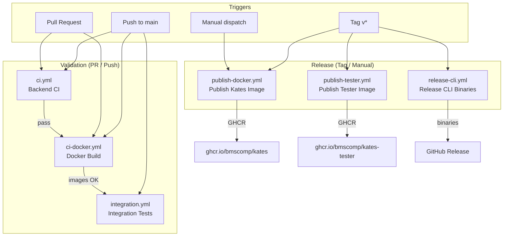
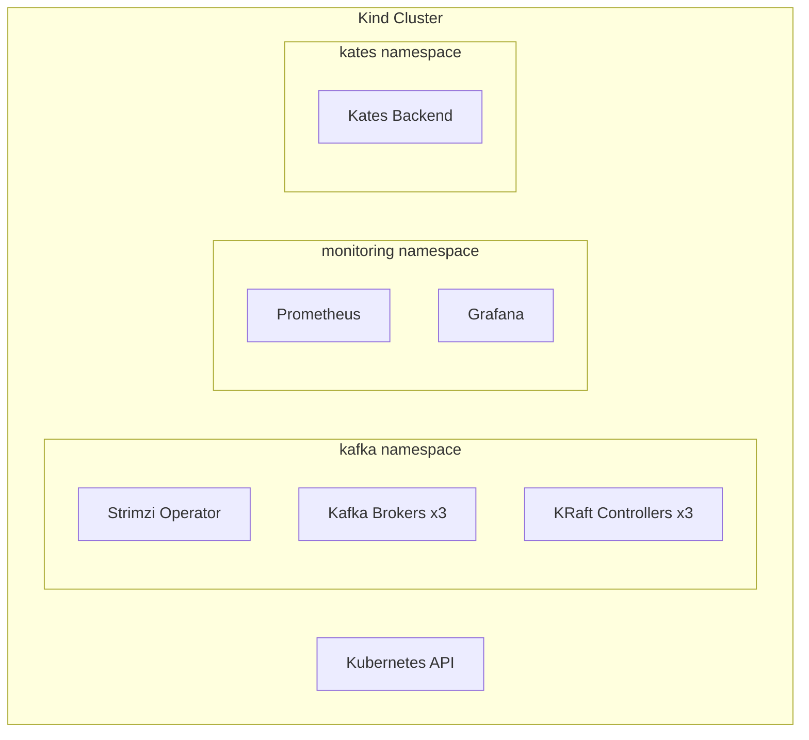
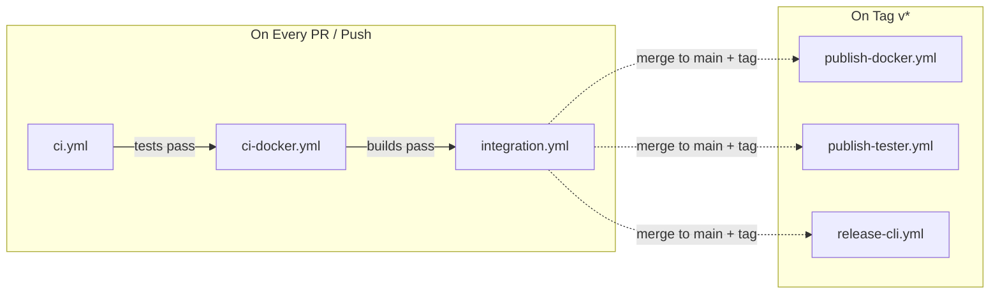

# Appendix C: CI/CD Pipeline

This appendix documents the GitHub Actions workflows that automate building, testing, and releasing the Kates platform. Six workflows cover the full lifecycle — from pull-request validation to production image publishing and CLI binary releases.

## Pipeline Overview



## Path-Based Change Detection

Several workflows use **path filters** to avoid unnecessary runs. Only changes to relevant source paths trigger the workflow:

| Workflow | Monitored Paths |
|----------|----------------|
| `ci.yml` | `kates/**`, `cli/**`, `charts/**` |
| `ci-docker.yml` | `kates/**`, `Dockerfile*` |
| `integration.yml` | `kates/**`, `cli/**`, `charts/**`, `config/**` |

This means documentation-only changes, README edits, or tutorial updates do not trigger CI builds — saving compute and reducing noise.

---

## 1. Backend CI (`ci.yml`)

**Purpose:** Validates backend code, CLI code, and Helm chart integrity on every push and pull request.

**Triggers:**
- Push to `main` branch (paths: `kates/**`, `cli/**`, `charts/**`)
- Pull request targeting `main` (same paths)

### What It Runs

| Stage | Runtime | Description |
|-------|---------|-------------|
| **Java Backend Tests** | Java 25 | Compiles the Quarkus backend and runs the full unit/integration test suite with `./mvnw verify` |
| **Go CLI Tests** | Go (latest) | Runs `go test -race ./...` across all CLI packages with race detector enabled |
| **Helm Lint** | Helm 3.x | Runs `helm lint` on all charts under `charts/` to catch template errors |
| **Helm Dry-Run** | Helm 3.x | Runs `helm template` + `helm install --dry-run` to validate rendered manifests against the Kubernetes API schema |

### Key Details

- **Java 25** is used as the build JDK, matching the project's target runtime
- The **Go race detector** (`-race`) is always enabled to catch data races in CLI concurrency paths (e.g., streaming watch, dashboard refresh)
- Helm dry-run validates that all template variables resolve correctly and that the rendered YAML passes Kubernetes schema validation

```yaml
# Simplified workflow structure
on:
  push:
    branches: [main]
    paths: ['kates/**', 'cli/**', 'charts/**']
  pull_request:
    branches: [main]
    paths: ['kates/**', 'cli/**', 'charts/**']

jobs:
  backend-tests:
    runs-on: ubuntu-latest
    steps:
      - uses: actions/setup-java@v4
        with: { java-version: '25' }
      - run: ./mvnw verify

  cli-tests:
    runs-on: ubuntu-latest
    steps:
      - uses: actions/setup-go@v5
      - run: go test -race ./...

  helm-lint:
    runs-on: ubuntu-latest
    steps:
      - run: helm lint charts/*
      - run: helm template kafka-cluster charts/kafka-cluster | kubectl apply --dry-run=client -f -
```

---

## 2. Docker Build Validation (`ci-docker.yml`)

**Purpose:** Validates that all Docker images build successfully across target platforms without pushing to a registry.

**Triggers:**
- Push to `main` branch
- Pull request targeting `main`

### Build Matrix

| Variant | Base Image | Platforms | Description |
|---------|-----------|-----------|-------------|
| **JVM** | Eclipse Temurin | `linux/amd64`, `linux/arm64` | Standard JVM-based image with Java 25 runtime |
| **Native** | `distroless` / `ubi-minimal` | `linux/amd64`, `linux/arm64` | GraalVM native image — sub-100ms startup, lower memory |

### Key Details

- Uses **Docker Buildx** with QEMU emulation for cross-platform builds
- The matrix runs all 4 combinations (2 variants × 2 architectures) in parallel
- Images are built with `--load` (local) or `--push=false` — no registry writes during validation
- Build cache is stored via GitHub Actions cache to speed up subsequent builds

```yaml
strategy:
  matrix:
    variant: [jvm, native]
    platform: [linux/amd64, linux/arm64]
```

---

## 3. Integration Tests (`integration.yml`)

**Purpose:** Deploys the full Kates stack on an ephemeral Kind cluster and runs end-to-end validation against a real Kafka cluster.

**Triggers:**
- Push to `main` branch (paths: `kates/**`, `cli/**`, `charts/**`, `config/**`)

### Infrastructure Provisioned

The workflow provisions a complete environment inside the GitHub Actions runner:



| Component | Version | Purpose |
|-----------|---------|---------|
| Kind | Latest | Ephemeral Kubernetes cluster (single-node) |
| Strimzi | 1.0.0 | Kafka operator for KRaft-mode cluster |
| Kafka | 4.1.1 | 3-broker, 3-controller KRaft cluster |
| Prometheus + Grafana | Latest | Monitoring stack for metrics validation |
| Kates Backend | Current build | The application under test |

### Validation Steps

1. **Cluster readiness** — waits for all pods to reach `Running` / `Ready`
2. **Kafka CR status** — verifies `Ready: True` on the Kafka custom resource
3. **Helm test suite** — runs `helm test kafka-cluster` (connectivity, auth, ACLs)
4. **Smoke test** — creates a LOAD test via the REST API, waits for completion, validates report
5. **Integrity check** — runs an INTEGRITY test to verify zero message loss
6. **Monitoring validation** — queries Prometheus to confirm metrics are being scraped

### Key Details

- The Kind cluster uses a **custom node image** with pre-pulled Kafka images to reduce setup time
- Total workflow runtime is typically **8–15 minutes** depending on cache availability
- Artifacts (test reports, pod logs) are uploaded on failure for debugging

---

## 4. Publish Kates Docker Image (`publish-docker.yml`)

**Purpose:** Builds and pushes the production Kates backend image to GitHub Container Registry (GHCR).

**Triggers:**
- Tag push matching `v*` (e.g., `v1.0.0`, `v2.3.1-rc1`)
- Manual workflow dispatch (for ad-hoc builds)

### Build Outputs

| Variant | Image | Platforms |
|---------|-------|-----------|
| **JVM** | `ghcr.io/bmscomp/kates:1.17.0` | `linux/amd64`, `linux/arm64` |
| **Native** | `ghcr.io/bmscomp/kates:1.17.0-native` | `linux/amd64`, `linux/arm64` |

### Process

1. **Checkout** at the tagged commit
2. **Build** both JVM and native variants using Docker Buildx
3. **Create multi-platform manifest** — a single tag resolves to the correct architecture at pull time
4. **Push** to `ghcr.io/bmscomp/kates` with version tag and `latest`
5. **Sign** images with Cosign (when signing keys are configured)
6. **Attest** provenance using SLSA GitHub generator

### Image Tags

| Tag Pattern | Example | Description |
|------------|---------|-------------|
| `v<semver>` | `v1.2.0` | Specific release version |
| `v<semver>-native` | `v1.2.0-native` | Native image variant |
| `latest` | — | Latest release (JVM) |
| `latest-native` | — | Latest release (native) |
| `sha-<commit>` | `sha-abc1234` | Commit-specific build (manual dispatch) |

---

## 5. Publish Kates Tester Image (`publish-tester.yml`)

**Purpose:** Builds and pushes the `kates-tester` image — a lightweight container used in Helm test hooks and integration testing.

**Triggers:**
- Tag push matching `v*`

### Image Details

| Property | Value |
|----------|-------|
| **Image** | `ghcr.io/bmscomp/kates-tester:1.17.0` |
| **Base** | Minimal Alpine/distroless |
| **Contents** | Pre-built Kates CLI binary, `curl`, `kafkacat`, connectivity test scripts |
| **Platforms** | `linux/amd64`, `linux/arm64` |

The tester image is referenced by the `kafka-cluster` Helm chart's test hooks (`helm test kafka-cluster`). It validates Kafka connectivity, SCRAM authentication, and ACL enforcement from inside the cluster.

---

## 6. Release Kates CLI (`release-cli.yml`)

**Purpose:** Cross-compiles the Kates CLI for all supported platforms and creates a GitHub Release with downloadable binaries.

**Triggers:**
- Tag push matching `v*`

### Build Matrix

| OS | Architecture | Binary Name |
|----|-------------|-------------|
| `darwin` | `amd64` | `kates-darwin-amd64` |
| `darwin` | `arm64` | `kates-darwin-arm64` |
| `linux` | `amd64` | `kates-linux-amd64` |
| `linux` | `arm64` | `kates-linux-arm64` |

### Release Process

1. **Cross-compile** — `GOOS` and `GOARCH` environment variables target each platform
2. **Compress** — each binary is compressed with `tar.gz`
3. **Checksum** — SHA-256 checksums are generated for all artifacts
4. **Create GitHub Release** — uses the tag name as the release title
5. **Upload assets** — all binaries, checksums, and the changelog are attached to the release

### Installation

Users install the CLI by downloading the appropriate binary from the GitHub Releases page:

```bash
# macOS (Apple Silicon)
curl -L https://github.com/bmscomp/kates/releases/latest/download/kates-darwin-arm64.tar.gz | tar xz
sudo mv kates /usr/local/bin/

# Linux (amd64)
curl -L https://github.com/bmscomp/kates/releases/latest/download/kates-linux-amd64.tar.gz | tar xz
sudo mv kates /usr/local/bin/

# Verify
kates version
```

---

## Workflow Dependencies

The following diagram shows the dependency and sequencing relationships between workflows:



**PR / Push flow:** Every pull request and push to `main` runs the validation pipeline (`ci` → `ci-docker` → `integration`). All three must pass before merging.

**Release flow:** When a version tag is pushed, three independent release workflows run in parallel — publishing Docker images, the tester image, and CLI binaries.

## Environment Secrets

The release workflows require these GitHub repository secrets:

| Secret | Used By | Purpose |
|--------|---------|---------|
| `GITHUB_TOKEN` | All workflows | Automatic — used for GHCR login and release creation |
| `COSIGN_PRIVATE_KEY` | `publish-docker.yml` | Cosign signing key for image signatures |
| `COSIGN_PASSWORD` | `publish-docker.yml` | Passphrase for the Cosign key |

::: {.callout-note}
`GITHUB_TOKEN` is automatically provided by GitHub Actions. Only `COSIGN_*` secrets need manual configuration in the repository settings, and only if image signing is enabled.
:::
