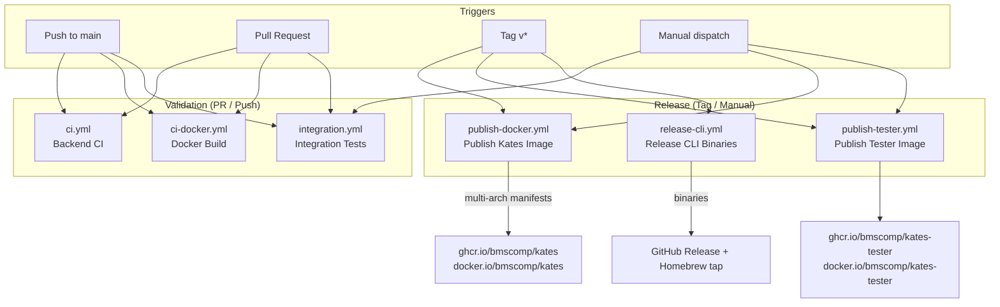
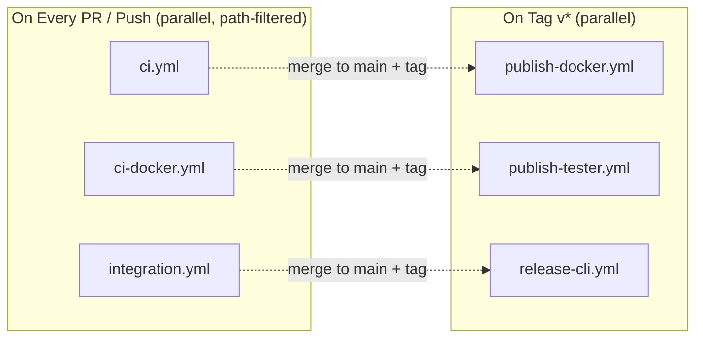

# CI/CD Pipeline

This appendix documents the GitHub Actions workflows that automate building, testing, and releasing the Kates platform. It covers the six core workflows — from pull-request validation to production image publishing and CLI binary releases. The repository carries additional workflows for the Kafka Connect image (`ci-connect.yml`, `publish-connect.yml`) and for documentation builds (`docs.yml`, `book.yml`); they follow the same patterns and are not covered here.

## Pipeline Overview



The three validation workflows trigger independently — each has its own path filter and there is no chaining between them.

## Path-Based Change Detection

Several workflows use **path filters** to avoid unnecessary runs. Only changes to relevant source paths trigger the workflow:

| Workflow | Monitored Paths |
|----------|----------------|
| `ci.yml` | `kates/**`, `cli/**`, `charts/kates/**`, `config/**`, `images.env`, `versions.env`, the workflow file itself |
| `ci-docker.yml` | `kates/**`, `cli/**`, `images.env`, `versions.env`, the workflow file itself |
| `integration.yml` | `kates/**`, `cli/**`, `Makefile`, `images.env`, `versions.env`, the workflow file itself |

Each filter also carries an explicit `!**/*.md` exclusion, so documentation-only changes, README edits, or tutorial updates do not trigger CI builds — saving compute and reducing noise.

---

## 1. Backend CI (`ci.yml`)

**Purpose:** Validates backend code, CLI code, Helm chart integrity, Kyverno policies, and config YAML on every push and pull request.

**Triggers:**
- Push to `main` branch (paths in the table above)
- Pull request targeting `main` (same paths)

### What It Runs

| Job | Runtime | Description |
|-----|---------|-------------|
| **Build & Test** | Java 21 (Temurin) | Compiles the Quarkus backend and runs the test suite with `./mvnw verify`; JUnit results are published as a check |
| **CLI Tests** | Go 1.25 | Runs `go test -race` across all CLI packages with the race detector enabled |
| **Helm Lint** | Helm v3.17.0 | Runs `helm dependency build` and `helm lint` on the `kates` chart, then `helm template` to verify the chart renders |
| **Kyverno Policy Validation** | Kyverno CLI v1.13.0 | Renders the Kyverno policy templates from the `kates`, `kafka-cluster`, and `kates-chaos` charts and validates them with `kyverno apply` |
| **YAML Validation** | Python + PyYAML | Parses every YAML file under `config/` to catch syntax errors |

### Key Details

- A first `changes` job (using `dorny/paths-filter`) detects whether code, chart, or config paths changed, and the remaining jobs run only for the relevant categories
- **Java 21** is used as the build JDK, matching the project's compiler target (`maven.compiler.release`)
- The **Go race detector** (`-race`) is always enabled to catch data races in CLI concurrency paths (e.g., streaming watch, dashboard refresh); packages run serially (`-p 1`) to keep memory in check
- `helm template` validates that the `kates` chart renders without template errors

```yaml
# Simplified workflow structure
on:
  push:
    branches: [main]
    paths: ["kates/**", "cli/**", "charts/kates/**", "config/**",
            "images.env", "versions.env", "!**/*.md"]
  pull_request:
    branches: [main]
    paths: # same as push

env:
  JAVA_VERSION: "21"

jobs:
  build-and-test:
    runs-on: ubuntu-latest
    steps:
      - uses: actions/setup-java@v4
        with: { distribution: temurin, java-version: "21" }
      - run: ./mvnw verify
        working-directory: kates

  go-tests:
    runs-on: ubuntu-latest
    steps:
      - uses: actions/setup-go@v5
        with: { go-version: "1.25" }
      - run: go test -p 1 ./... -race -count=1
        working-directory: cli

  helm-lint:
    runs-on: ubuntu-latest
    steps:
      - run: helm dependency build charts/kates/
      - run: helm lint charts/kates/
      - run: helm template kates charts/kates/ > /dev/null
```

---

## 2. Docker Build Validation (`ci-docker.yml`)

**Purpose:** Validates that the Kates Docker images build successfully without pushing to a registry.

**Triggers:**
- Push to `main` branch
- Pull request targeting `main`

### Build Matrix

| Variant | Base Image | Platforms | Description |
|---------|-----------|-----------|-------------|
| **JVM** | `eclipse-temurin:21-jre` | `linux/amd64`, `linux/arm64` | Standard JVM-based image with a Java 21 runtime |
| **Native** | `ubi9-minimal` (Mandrel-built) | `linux/amd64` | GraalVM (Mandrel) native image — fast startup, lower memory |

### Key Details

- Uses **Docker Buildx** on native runners for each architecture — `ubuntu-latest` for amd64 and `ubuntu-24.04-arm` for arm64 — so no QEMU emulation is needed
- The matrix runs three combinations in parallel; **native/arm64 is excluded** from CI because GraalVM native-image is too slow even on native ARM runners — that combination is validated at release time instead
- Images are built with `push: false` — no registry writes during validation
- Build cache is stored via GitHub Actions cache (scoped per variant and architecture) to speed up subsequent builds

```yaml
strategy:
  fail-fast: false
  matrix:
    include:
      - { variant: jvm,    arch: amd64, runner: ubuntu-latest }
      - { variant: native, arch: amd64, runner: ubuntu-latest }
      - { variant: jvm,    arch: arm64, runner: ubuntu-24.04-arm }
```

---

## 3. Integration Tests (`integration.yml`)

**Purpose:** Spins up an ephemeral Kind cluster and validates that the charts, config manifests, and CLI work against a real Kubernetes API — cluster topology, the `kates detect` compatibility gate, chart linting, and server-side dry-runs of the Kafka manifests.

**Triggers:**
- Push to `main` branch (paths: `kates/**`, `cli/**`, `Makefile`, `images.env`, `versions.env`)
- Pull request targeting `main` (same paths)
- Manual `workflow_dispatch`

### Infrastructure Provisioned

The workflow provisions a Kind cluster inside the GitHub Actions runner, created from `config/cluster.yaml` with three zone-labelled nodes (`alpha`, `sigma`, `gamma`):

| Component | Version | Purpose |
|-----------|---------|---------|
| Kind | v0.27.0 | Ephemeral Kubernetes cluster with three zone-labelled nodes |
| kubectl | v1.33.0 | Applies and dry-runs manifests against the cluster |
| Helm | v3.17.0 | Lints every chart under `charts/` |
| Go | 1.25 | Builds the `kates` CLI from source for the compatibility gate |

### Validation Steps

1. **Cluster readiness** — waits for all Kind nodes to reach `Ready`
2. **Topology check** — verifies one node exists per zone (`alpha`, `sigma`, `gamma`)
3. **CI gate** — builds the CLI and runs `kates detect --fail-on-error --quiet` to confirm the cluster is compatible with a Kafka deployment
4. **Helm lint** — builds dependencies and lints every chart under `charts/`
5. **YAML validation** — parses all config files under `config/`
6. **Manifest dry-runs** — applies the storage classes, creates the namespaces, and server-side dry-runs the Kafka topic and NetworkPolicy manifests
7. **Monitoring config check** — verifies the Jaeger Helm values files are present

### Key Details

- The Kafka manifests are validated with `kubectl apply --dry-run=server` — the Strimzi operator is **not** installed, so this checks manifest validity against the API server rather than deploying a running Kafka cluster
- The job has a **30-minute timeout** and posts a per-check results table to the GitHub Actions step summary
- The Kind cluster is deleted in an `always()` cleanup step, even on failure

---

## 4. Publish Kates Docker Image (`publish-docker.yml`)

**Purpose:** Builds and pushes the production Kates backend image to GitHub Container Registry (GHCR) and Docker Hub.

**Triggers:**
- Tag push matching `v*` (e.g., `v1.0.0`, `v2.3.1-rc1`)
- Manual workflow dispatch, with inputs to select the variant (`jvm`, `native`, or `both`) and target platforms

### Build Outputs

| Variant | Images | Platforms |
|---------|--------|-----------|
| **JVM** | `ghcr.io/bmscomp/kates:<version>`, `docker.io/bmscomp/kates:<version>` | `linux/amd64`, `linux/arm64` |
| **Native** | `ghcr.io/bmscomp/kates:<version>-native`, `docker.io/bmscomp/kates:<version>-native` | `linux/amd64`, `linux/arm64` |

### Process

1. **Compute the matrix** — the version is derived from the tag; each platform is mapped to a native runner (amd64 → `ubuntu-latest`, arm64 → `ubuntu-24.04-arm`), so no QEMU emulation is used
2. **Build and push per-architecture images** tagged `sha-<commit>-<arch>-<variant>` to both registries
3. **Create multi-platform manifests** — `docker manifest create` combines the per-arch images so a single tag resolves to the correct architecture at pull time
4. **Sign** the release manifests with Cosign keyless signing (`cosign sign --yes`), on tag builds
5. **Verify** — pulls and inspects the published manifests
6. **Update charts** — bumps `appVersion` in `charts/kates` and `charts/kates-chaos` on `main` and commits with `[skip ci]`

### Image Tags

| Tag Pattern | Example | Description |
|------------|---------|-------------|
| `<semver>` | `1.20.0` | Specific release version (the tag's leading `v` is stripped) |
| `<major>.<minor>`, `<major>` | `1.20`, `1` | Floating minor and major tags |
| `<semver>-native` | `1.20.0-native` | Native image variant |
| `<short-sha>` | `abc1234` | Commit-specific manifest tag |
| `sha-<commit>-<arch>-<variant>` | `sha-abc…-arm64-jvm` | Per-architecture intermediate build |

---

## 5. Publish Kates Tester Image (`publish-tester.yml`)

**Purpose:** Builds and pushes the `kates-tester` image — a lightweight container used in Helm test hooks and integration testing.

**Triggers:**
- Tag push matching `v*`
- Manual workflow dispatch

### Image Details

| Property | Value |
|----------|-------|
| **Images** | `ghcr.io/bmscomp/kates-tester:<version>`, `docker.io/bmscomp/kates-tester:<version>` |
| **Base** | `debian:bookworm-slim` |
| **Contents** | `kcat`, the Apache Kafka CLI scripts, `kubectl`, `curl`, `jq`, DNS and netcat utilities |
| **Platforms** | `linux/amd64`, `linux/arm64` (cross-built with QEMU) |

The tester image is referenced by the `kafka-cluster` Helm chart's test hooks (`helm test kafka-cluster`). It validates Kafka connectivity, SCRAM authentication, and ACL enforcement from inside the cluster.

---

## 6. Release Kates CLI (`release-cli.yml`)

**Purpose:** Cross-compiles the Kates CLI for all supported platforms and creates a GitHub Release with downloadable binaries.

**Triggers:**
- Tag push matching `v*`

### Build Matrix

| OS | Architecture | Binary Name |
|----|-------------|-------------|
| `darwin` | `amd64` | `kates-darwin-amd64` |
| `darwin` | `arm64` | `kates-darwin-arm64` |
| `linux` | `amd64` | `kates-linux-amd64` |
| `linux` | `arm64` | `kates-linux-arm64` |

### Release Process

1. **Cross-compile** — `GOOS` and `GOARCH` target each platform with `CGO_ENABLED=0`; the version, commit, and build date are embedded via `-ldflags`
2. **Compress** — each binary is compressed with `tar.gz`
3. **Checksum** — a SHA-256 checksum is generated per artifact, plus an aggregated `checksums.txt`
4. **Create GitHub Release** — uses the tag as the release, with auto-generated release notes; all tarballs and checksums are attached
5. **Update Homebrew tap** — regenerates `Formula/kates.rb` in the `bmscomp/homebrew-tap` repository so `brew install bmscomp/tap/kates` resolves to the new release

### Installation

Users install the CLI by downloading the appropriate binary from the GitHub Releases page:

```bash
# macOS (Apple Silicon)
curl -L https://github.com/bmscomp/kates/releases/latest/download/kates-darwin-arm64.tar.gz | tar xz
sudo mv kates /usr/local/bin/

# Linux (amd64)
curl -L https://github.com/bmscomp/kates/releases/latest/download/kates-linux-amd64.tar.gz | tar xz
sudo mv kates /usr/local/bin/

# Verify
kates version
```

---

## Workflow Dependencies

The following diagram shows how the workflows relate:



**PR / Push flow:** Every pull request and push to `main` runs the validation workflows in parallel. They are not chained — each triggers independently from its own path filter, so a given change may run one, two, or all three.

**Release flow:** When a version tag is pushed, three independent release workflows run in parallel — publishing Docker images, the tester image, and CLI binaries.

## Environment Secrets

The release workflows require these GitHub repository secrets:

| Secret | Used By | Purpose |
|--------|---------|---------|
| `GITHUB_TOKEN` | All workflows | Automatic — used for GHCR login, release creation, and chart-bump commits |
| `DOCKERHUB_USERNAME` / `DOCKERHUB_TOKEN` | `publish-docker.yml`, `publish-tester.yml` | Docker Hub login for pushing images |
| `HOMEBREW_TAP_TOKEN` | `release-cli.yml` | Pushes the updated formula to `bmscomp/homebrew-tap` |

::: {.callout-note}
`GITHUB_TOKEN` is automatically provided by GitHub Actions; the Docker Hub and Homebrew tap credentials must be configured manually in the repository settings. Image signing uses Cosign **keyless** signing through the workflow's OIDC identity — no signing-key secrets are required.
:::
