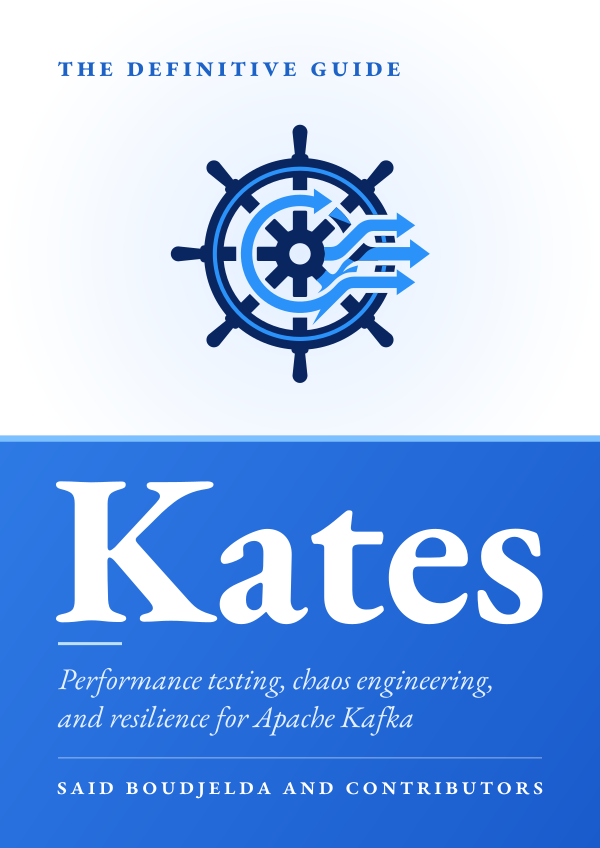
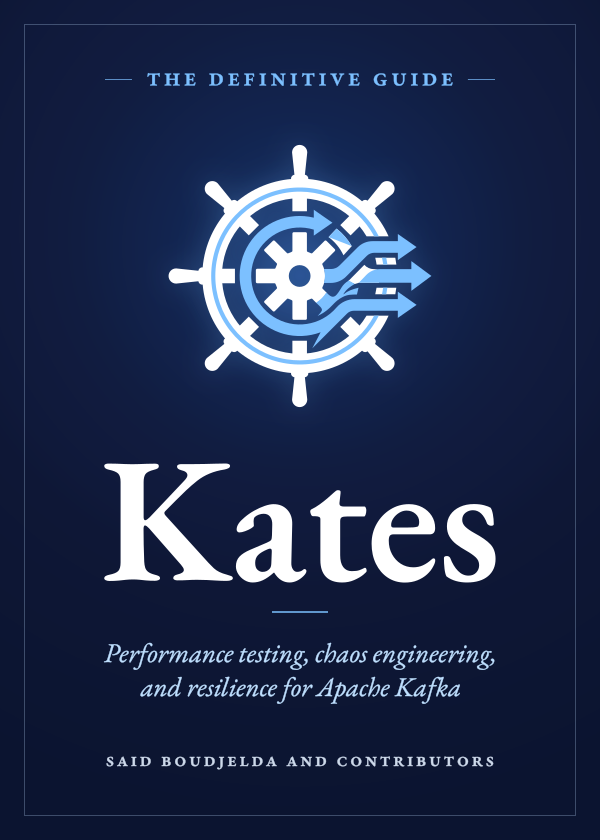
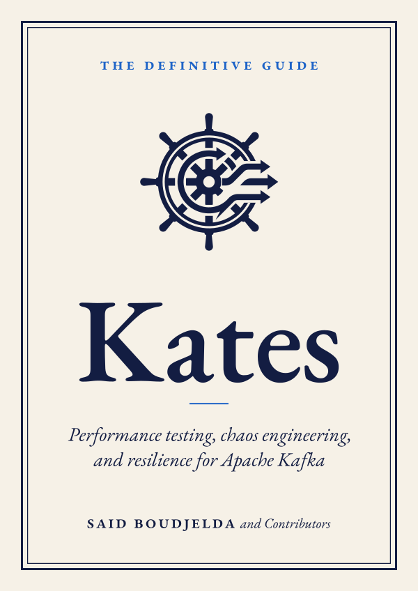
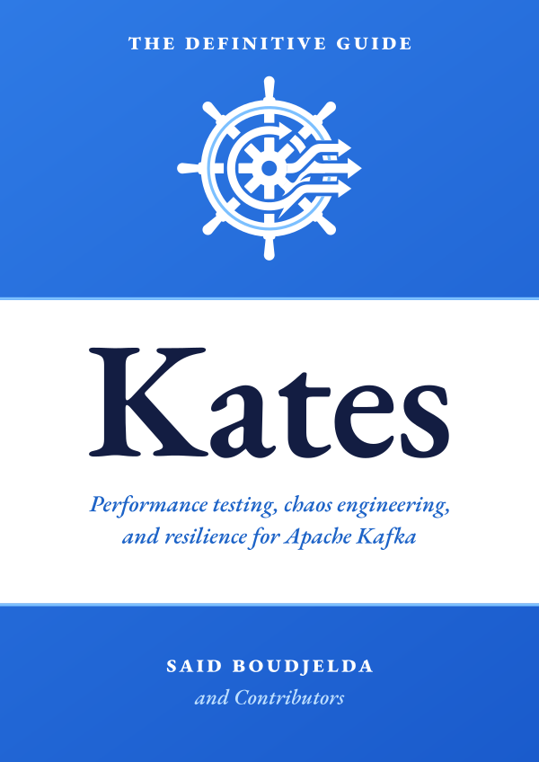

# Cover proposals

Four covers were drawn for the book when it moved to EB Garamond. Each uses the old Kates helm (`docs/assets/kates-logo.svg`) for its art, and its words are EB Garamond outlines, so it looks the same wherever it is shown. An editor's review scored each and gave its main risk. The book uses **Evolution**: [`../cover.svg`](../cover.svg) is this proposal with the title in SemiBold instead of Bold, as the review asked.

| Proposal | Score | What it does, and its main risk |
|:--|:--|:--|
| [Evolution](evolution.svg) | 8 | Keeps the light top and blue band readers know, with the helm in its own colours; the title is the easiest of the four to read at thumbnail size. As proposed, its Bold title was heavier than the book's text. |
| [Nocturne](nocturne.svg) | 7.5 | Night blue, with the helm in white and sky blue under a soft glow: the most premium of the four. It moves away from the blue book, and `rsvg-convert` turns the glow into a 72-dpi image in the PDF. |
| [Scholar's Press](scholar.svg) | 7 | Warm paper, a navy thick-and-thin frame, and the helm in navy alone as a printer's mark: the best typography of the four. It drops the blue book and the helm's two colours, so it suits a deliberate rebrand. |
| [Tri-band](triband.svg) | 6.5 | Blue, white and blue bands, with a navy title on white: the strongest on a shelf. The bands can read as a flag, and the all-white helm blurs at small sizes. |

   
