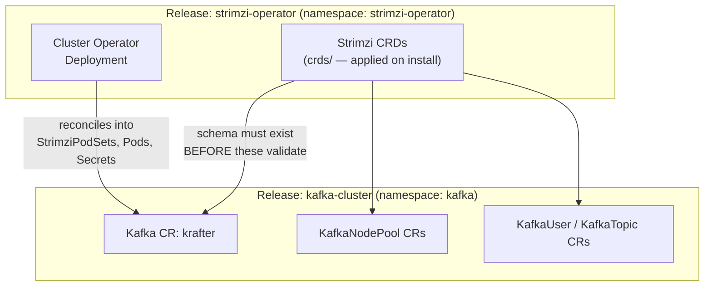

# Deploying the Strimzi Operator

Every Kafka cluster in this repository is a custom resource, and a custom resource is inert without two things: the CRD that defines its schema, and an operator that reconciles it into pods. The `strimzi-operator` chart owns both. It is the first thing installed on a new cluster and the last thing to touch casually on a running one — the operator's version decides which Kafka versions exist at all, and its CRDs are the only reason your `Kafka` resources are still in etcd.

::: {.callout-note appearance="simple"}
**Scope**: installing, migrating to, upgrading, and rolling back the `charts/strimzi-operator` release. For the engineering rationale behind the cluster it manages — node pools, listeners, certificates — see [Kafka Deployment Engineering](15-kafka-deployment.md). For the Kafka cluster install that follows this one, see [Installing Kafka with the kafka-cluster Helm Chart](20-installation-guide.md).
:::

After this chapter, you can:

- Install the operator from the chart and prove the watch scope, the CRDs, and the operand images took effect
- Explain why the operator is a separate Helm release from `kafka-cluster`, and why its CRDs live in `crds/` rather than `templates/`
- Migrate the existing ad-hoc `oci://` release onto the chart without recreating a single resource — and defer the data-plane roll that adoption triggers
- Recognize the two operations that would delete every Kafka custom resource in the cluster, and the one flag that keeps upgrades failing loudly instead of silently

## What the Chart Deploys

`charts/strimzi-operator` is a thin wrapper. It declares the upstream `strimzi-kafka-operator` chart as a subchart dependency, vendors none of its templates, and adds three things the upstream chart does not provide: a CRD-upgrade hook, a strict values schema, and Helm tests. It also pins the kates defaults that were previously scattered across `--set` flags at each call site.

The release is small, and its shape is the single most important thing to understand about it:

| Scope | Resources |
|-------|-----------|
| Cluster-scoped | `ClusterRole`: `strimzi-cluster-operator-namespaced`, `-global`, `-leader-election`, `-watched`, `strimzi-kafka-broker`, `strimzi-entity-operator`, `strimzi-kafka-client` · `ClusterRoleBinding`: `strimzi-cluster-operator-namespaced`, `strimzi-cluster-operator`, `-watched`, `-kafka-broker-delegation`, `-entity-operator-delegation`, `-kafka-client-delegation` |
| Namespaced | `ServiceAccount`, `ConfigMap`, and `Deployment` named `strimzi-cluster-operator`, plus the `RoleBinding` `strimzi-cluster-operator-leader-election` |

Thirteen of those seventeen resources are cluster-scoped, and every name in the table is hardcoded upstream — none of them derive from the Helm release name. That makes this chart a **cluster singleton**: two releases cannot coexist, cannot be distinguished, and cannot arbitrate between themselves. There is no parallel install-then-cutover, and no blue-green. Every procedure in this chapter follows from that constraint.

## Why a Separate Release

The operator is not a subchart of `kafka-cluster`, and it never becomes one. The reason is a chicken-and-egg problem in Helm's own validation order:



Helm validates a manifest against the API server before it creates anything. A `Kafka` resource whose CRD does not yet exist is rejected outright — Helm cannot install a CRD and a resource that depends on that CRD in the same pass reliably, because CRD establishment is asynchronous. Splitting them into two releases makes the ordering explicit and enforceable: the operator release completes, its CRDs reach `Established`, and only then does the cluster release have a schema to validate against.

The split has a second benefit that matters more day to day. The operator is cluster-wide (it watches every namespace), while `kafka-cluster` is a per-cluster, per-namespace artifact. Folding a singleton into a chart you might install twice is how you get two operators fighting over the same `StrimziPodSet` writes.

## The CRD Lifecycle Gap

This is the mechanical fact that shapes the chart. The upstream chart ships its CRDs in `crds/`, not `templates/` — ten of them: `kafkas`, `kafkaconnects`, `kafkatopics`, `kafkausers`, `kafkanodepools`, `kafkabridges`, `kafkaconnectors`, `kafkamirrormaker2s`, and `kafkarebalances` in the `kafka.strimzi.io` group, plus `strimzipodsets` in `core.strimzi.io`. Helm treats that directory unlike anything else, and `helm upgrade --help` states the behavior plainly:

> `--skip-crds`: if set, no CRDs will be installed when an upgrade is performed with install flag enabled. By default, CRDs are installed if not already present, when an upgrade is performed with install flag enabled

Read that carefully — *installed if not already present*. There is no update path. The consequences:

| Helm operation | What happens to `crds/` |
|----------------|-------------------------|
| `helm install` | Applied, once |
| `helm upgrade` | **Never updated** — already present, so skipped |
| `helm uninstall` | **Never deleted** — Helm does not track them |
| `helm get manifest` | They do not appear — Helm does not know they exist |

Left alone, the CRDs freeze at whatever version was first installed while the operator moves on. That failure is silent in the worst way: the API server accepts a `Kafka` resource carrying fields the frozen schema does not know about, then **prunes them**. No error, no event, no rejection — the field simply vanishes between `kubectl apply` and etcd.

The chart closes the gap with a `pre-install`/`pre-upgrade` hook Job in `charts/strimzi-operator/templates/crd-upgrade.yaml`. It runs before the operator Deployment is patched, so the schema is always current before the controller that depends on it starts. The Job fetches the pinned CRD bundle and validates it three ways before mutating anything: the download must succeed (`curl -f`, so an HTTP error is an error rather than a 404 body written to disk), the bundle must contain exactly ten `CustomResourceDefinition` documents, and a `kubectl apply --server-side --dry-run=server` must pass. Only then does it apply for real, with `--force-conflicts` — Helm 4 applies server-side by default, so its field manager co-owns these CRDs and would otherwise conflict.

::: {.callout-note}
The hook needs egress to the CRD bundle URL on **every** install and upgrade, not just the first. Because it is a `pre-upgrade` gate, an unreachable URL aborts the upgrade and leaves the release in `pending-upgrade`. On restricted-egress clusters, mirror the bundle and point `crdUpgrade.url` at it — `charts/strimzi-operator/values-prod.yaml` documents the pattern.
:::

### Why the CRDs Stay in `crds/`

Moving them into `templates/` would look tidier and would be a serious mistake, for two independent reasons.

The first is adoption: the CRDs on a running cluster carry no Helm ownership metadata, so templating them makes the very first upgrade fail with an ownership error.

The second is the one that matters:

::: {.callout-caution}
Templating the CRDs would hand `helm uninstall` the power to delete every Kafka custom resource in the cluster. Kubernetes garbage collection cascades along the whole chain — `CRD → Kafka / KafkaNodePool → StrimziPodSet → Pods`. Deleting a Strimzi CRD deletes every resource of that kind cluster-wide, and the operator then tears down the workloads behind them. Today Helm cannot do this, because it does not know the CRDs exist. Keep it that way: the CRDs stay in the subchart's `crds/`, and nothing in this chart templates them.
:::

## Deploying the Operator

### Prerequisites

The chart declares a subchart, so the dependency must be fetched **before** any Helm operation — template, lint, install, or upgrade:

```bash
helm dependency build charts/strimzi-operator
```

Skip it and every command fails before it ever contacts the cluster:

Output:

```text
Error: an error occurred while checking for chart dependencies. You may need to run 'helm dependency build' to fetch missing dependencies: found in Chart.yaml, but missing in charts/ directory: strimzi-kafka-operator
```

::: {.callout-warning}
`helm lint` only **warns** about a missing dependency and still reports `0 chart(s) failed`. A green lint does not mean a deployable chart — the failure surfaces at deploy time. Any CI job or script that renders this chart must run `helm dependency build` first.
:::

The dependency build pulls from `quay.io`, and the CRD hook fetches from `github.com`. Both are required egress paths; the first one is not new, since the ad-hoc install this chart replaces already pulled the same chart from the same registry.

### Fresh Install

```bash
helm dependency build charts/strimzi-operator

helm upgrade --install strimzi-operator charts/strimzi-operator \
  --namespace strimzi-operator --create-namespace \
  --timeout 5m --wait
```

That is the whole install. No `--version` flag and no `--set` flags: the version is pinned in `Chart.yaml`, and the defaults already reproduce what runs in production.

### Environment Overlays

Four overlays ship with the chart. All of them are overrides only — they layer on top of the defaults rather than restating them.

| Overlay | What it changes | When to use it |
|---------|-----------------|----------------|
| `values-kind.yaml` | Lowers operator memory to fit a laptop; PDB off | Local `panda` Kind cluster |
| `values-dev.yaml` | `logLevel: DEBUG`, lower memory request | Debugging operand reconciliation |
| `values-prod.yaml` | Hardening, PDB, NetworkPolicy, tighter reconciliation loop | Production — **read the header first** |
| `values-generic.yaml` | Dashboards off; documents DNS-domain injection | Clusters whose topology is not known ahead of time (EKS/GKE/AKS/on-prem) |

```bash
helm upgrade --install strimzi-operator charts/strimzi-operator \
  --namespace strimzi-operator --create-namespace \
  -f charts/strimzi-operator/values-prod.yaml \
  --timeout 5m --wait
```

::: {.callout-warning}
`values-prod.yaml` is an **uplift, not a description of current behavior**. Its settings were stranded in `config/kafka/strimzi-values.yaml`, whose header claimed a deploy script passed it with `-f` — it never did. Applying it is a real behavior change: it adds a NetworkPolicy and a PodDisruptionBudget, tightens the reconciliation interval, and flips the operator to a read-only root filesystem. Roll it out deliberately, in a window, not as a default.
:::

### The Values That Matter

Every operator setting nests under the `strimzi-kafka-operator:` key, because that is the subchart's name. A top-level `watchAnyNamespace: true` is not an override — Helm silently ignores it. The schema rejects it deliberately so the mistake is loud:

```bash
helm template strimzi-operator charts/strimzi-operator -n strimzi-operator \
  --set watchAnyNamespace=true
```

Output:

```text
Error: values don't meet the specifications of the schema(s) in the following chart(s):
strimzi-operator:
- at '': additional properties 'watchAnyNamespace' not allowed
```

The handful of keys worth knowing:

| Key | Default | Why it matters |
|-----|---------|----------------|
| `strimzi-kafka-operator.watchAnyNamespace` | `true` | Sets `STRIMZI_NAMESPACE="*"`. Turn it off and every Kafka cluster outside the operator's own namespace goes unmanaged — the CRs stay, nothing reconciles them. |
| `strimzi-kafka-operator.kubernetesServiceDnsDomain` | `cluster.local` | Upstream emits `KUBERNETES_SERVICE_DNS_DOMAIN` **only** when this differs from the default. Omitting it is invisible on a default cluster and silently breaks the operator on a custom domain — callers must inject the detected value. |
| `strimzi-kafka-operator.leaderElection.enable` | `true` | `enable`, not `enabled`. See the troubleshooting section — the misspelling was live for a full release cycle. |
| `strimzi-kafka-operator.resources` | memory only | The chart pins memory and lets cpu inherit upstream's defaults rather than duplicating them. |
| `strimzi-kafka-operator.defaultImageRegistry` | unset | Registry redirection. **Not** `global.imageRegistry` — upstream contains zero `.Values.global` references and ignores it entirely, so this chart does not declare `global` at all and `--set global.*` fails loudly. |
| `crdUpgrade.enabled` | `true` | Disable it and your CRDs freeze. Only do this if another applier demonstrably owns them. |
| `crdUpgrade.url` | derived | Override for airgapped mirrors. |

## Migrating from the Ad-Hoc Install

The operator was previously installed by direct `helm upgrade --install ... oci://quay.io/strimzi-helm/strimzi-kafka-operator` calls duplicated across the deploy scripts and the `kates` CLI. Those copies had drifted: different memory limits, different timeouts, and one flag that never did anything. Migration folds them onto one chart.

The good news first: **adoption is a pure in-place patch**. The release name, the namespace, and every resource name are identical across the old chart and the new one, so Helm patches fields rather than recreating objects. Nothing is deleted.

### Step 0 — Pre-Flight

All of these are blocking.

```bash
# Record the current state — this is your rollback reference
helm list -n strimzi-operator
helm get values strimzi-operator -n strimzi-operator > /tmp/pre-migration-values.yaml

# Back up the CRDs. Helm does not manage them, so neither `helm rollback` nor
# `helm uninstall` can restore them — this file is the only way back.
kubectl get crd -l strimzi.io/crd-install=true -o yaml > /tmp/pre-migration-crds.yaml

# The chart will not render without this
helm dependency build charts/strimzi-operator
```

The CRD backup is the one artifact you cannot reconstruct after the fact. The label selects every Strimzi CRD, including `strimzipodsets.core.strimzi.io`, which lives outside the `kafka.strimzi.io` group and is easy to miss when selecting by name.

**The version gate.** The operator's supported Kafka range moves with every release, and a Kafka version that the target operator has never heard of leaves its cluster orphaned. Every `Kafka` resource's version must appear in the target's image map:

```bash
# What every cluster runs today
kubectl get kafka -A -o jsonpath='{range .items[*]}{.metadata.namespace}/{.metadata.name}: {.spec.kafka.version}{"\n"}{end}'

# What the target operator supports — read it out of the rendered Deployment
helm template strimzi-operator charts/strimzi-operator -n strimzi-operator \
  | grep -A5 STRIMZI_KAFKA_IMAGES
```

Every version on the left must appear on the right. If one does not, stop and upgrade that cluster's Kafka version first.

**The roll-survivability gate.** Adoption rolls every broker (the next section explains why), so the cluster must survive losing one at a time. Read the replication settings from inside the cluster, not from `KafkaTopic` resources — a cluster with no `KafkaTopic` resources still has topics, and it is the real topics that must survive:

```bash
BROKER=$(kubectl get pods -n kafka -l strimzi.io/broker-role=true -o name | head -1)

kubectl exec -n kafka "${BROKER}" -- \
  /opt/kafka/bin/kafka-topics.sh --bootstrap-server localhost:9092 --describe \
  | grep -E 'ReplicationFactor:\s*1\b'
```

Expect no output. Any topic with a replication factor of 1 goes offline the moment its broker restarts. Confirm `min.insync.replicas` is strictly below `default.replication.factor`, that no partition is under-replicated, and that every broker pool has more than one replica or a replication factor that spans pools.

**The condition gate.** Check conditions by name rather than eyeballing for green:

```bash
kubectl get kafka krafter -n kafka -o jsonpath='{range .status.conditions[*]}{.type}={.status} {.reason}{"\n"}{end}'
```

`Ready=True` is the bar. A `Warning=True` with reason `KafkaMetadataVersion` may also be present — it means the `metadataVersion` in the CR trails the running Kafka version and an earlier upgrade never finished. That is pre-existing debt: this migration neither causes it nor fixes it, and waiting for it to clear on its own will not work. Record it, decide separately whether to complete that metadata upgrade, and do not treat it as a blocker for the operator work.

Finally, record the baseline watch scope (expect `*`) and take a maintenance window.

### Step 1 — Verify Adoptability Without Mutating

::: {.callout-important}
Pass `--reset-values`. Bare `helm upgrade` **is** `--reuse-values`: when you supply no values, Helm copies the previous release's stored config forward. That stored config is the stale flat keys from the retired call sites, and this chart's schema rejects them. This is a one-time cost — after the first adoption the stored config is clean and later bare upgrades pass.
:::

```bash
helm upgrade strimzi-operator charts/strimzi-operator \
  --namespace strimzi-operator \
  --reset-values --dry-run=server
```

Expect a clean render with no ownership error and no schema error. Confirm `helm list -n strimzi-operator` still shows the old revision — a server dry-run does not mutate the release.

Omit `--reset-values` and you get this instead, which is the error most people hit first:

Output:

```text
Error: UPGRADE FAILED: values don't meet the specifications of the schema(s) in the following chart(s):
strimzi-operator:
- at '': additional properties 'kubernetesServiceDnsDomain', 'leaderElection', 'replicas', 'resources', 'watchAnyNamespace', 'operationTimeoutMs' not allowed
```

Those are exactly the keys the old ad-hoc call sites set. The schema is telling you they moved under `strimzi-kafka-operator:`, and that leaving them at the top level would have been silently ignored.

### Step 2 — Diff the Operator Environment

Compare what runs against what the chart renders, before committing. Two variables decide whether this migration is safe, and they are expected to behave in opposite ways.

The watch scope **must not change** — expect `*` from both sides:

```bash
# Live
kubectl get deploy strimzi-cluster-operator -n strimzi-operator \
  -o jsonpath='{.spec.template.spec.containers[0].env[?(@.name=="STRIMZI_NAMESPACE")].value}'

# Rendered
helm template strimzi-operator charts/strimzi-operator -n strimzi-operator \
  | grep -A1 'name: STRIMZI_NAMESPACE'
```

The operand image map **is expected to change** — this is the version bump itself, and the reason Step 3 is a three-part procedure rather than one command:

```bash
# Live
kubectl get deploy strimzi-cluster-operator -n strimzi-operator \
  -o jsonpath='{.spec.template.spec.containers[0].env[?(@.name=="STRIMZI_KAFKA_IMAGES")].value}'

# Rendered
helm template strimzi-operator charts/strimzi-operator -n strimzi-operator \
  | grep -A4 'name: STRIMZI_KAFKA_IMAGES'
```

Every Kafka version on the live side must still be present on the rendered side — that is the version gate from Step 0, restated against the actual artifact. The image each version maps to changes, because the operand tag embeds the operator version.

### Step 3 — Adopt, in Three Movements

::: {.callout-caution}
Adoption rolls the entire Kafka data plane. The operand image tag embeds the operator version — the operator's image map reads `<kafka-version>=quay.io/strimzi/kafka:<operator-version>-kafka-<kafka-version>` — so the same Kafka version resolves to a different image after the bump. No node pool pins an image, so every broker and every controller restarts. This is not optional and it is not avoidable — pinning `.spec.kafka.image` to dodge it is not supported by Strimzi. It can only be **deferred**, which is what the three movements below do — the roll itself is sequenced by the operator, not by you. Take a maintenance window.
:::

**Step 3a — Pause reconciliation:** annotate the Kafka resource so the new operator adopts the cluster without touching it.

Pause the `Kafka` resource, and only the `Kafka` resource:

```bash
kubectl annotate kafka krafter -n kafka strimzi.io/pause-reconciliation=true --overwrite

# Confirm the pause took effect BEFORE upgrading anything
kubectl get kafka krafter -n kafka \
  -o jsonpath='{.status.conditions[?(@.type=="ReconciliationPaused")].status}'
```

This must report `True`. Do not proceed otherwise.

::: {.callout-important}
Do not try to pause node pools. Strimzi runs no assembly operator for `KafkaNodePool` — the pause annotation is honored on the `Kafka` resource and on the other top-level resources that have their own operator, and nowhere else. Annotating a pool writes an annotation nothing reads: the pool reports no `ReconciliationPaused` condition, so a gate that waits for one never passes.

Pausing the parent is sufficient precisely because pools have no independent reconciliation. They are reconciled as part of the `Kafka` resource, so the parent's pause is what stops the roll.
:::

Listing the pools is still worthwhile — it sizes the roll you are deferring, and names the pods that restart in Step 3c:

```bash
kubectl get kafkanodepool -n kafka
```

**Step 3b — Upgrade the control plane only:** this is the real checkpoint, and the only place where rollback is cheap.

```bash
helm upgrade strimzi-operator charts/strimzi-operator \
  --namespace strimzi-operator \
  --reset-values --timeout 10m --wait
```

The `pre-upgrade` hook applies the target CRDs before the Deployment is patched. Verify in isolation — the data plane has not moved yet:

```bash
# Operator image is the new version
kubectl get deploy strimzi-cluster-operator -n strimzi-operator \
  -o jsonpath='{.spec.template.spec.containers[0].image}'

# The canary: if this is not "*", STOP and roll back
kubectl get deploy strimzi-cluster-operator -n strimzi-operator \
  -o jsonpath='{.spec.template.spec.containers[0].env[?(@.name=="STRIMZI_NAMESPACE")].value}'

# All ten CRDs Established
kubectl get crd -l strimzi.io/crd-install=true

# Leader election acquired, no errors
kubectl logs deployment/strimzi-cluster-operator -n strimzi-operator --tail=50 | grep -iE 'error|leader'
```

**Step 3c — Unpause and let the operator sequence the roll:** pausing deferred the roll; this is where it happens.

Unpausing the `Kafka` resource releases the whole data plane at once. There is no per-pool staging — the pause lives on the parent, so lifting it resumes reconciliation for every pool together:

```bash
kubectl annotate kafka krafter -n kafka strimzi.io/pause-reconciliation-

# The roll starts immediately; watch it proceed
kubectl get pods -n kafka -w
```

You do not sequence this roll — the operator does, and its guarantees are stronger than manual staging would be. Strimzi's roller restarts **one node at a time** and refuses to restart a node when doing so would break the cluster:

- **Controllers** are gated on a KRaft quorum check — a controller is not restarted if the quorum could not tolerate losing it.
- **Brokers** are gated on an availability check that determines whether the broker can be rolled without affecting `acks=all` producers publishing to topics with `min.insync.replicas`.
- The **active controller restarts last**, after every other node has been verified.

This is why Step 0's replication gate is the real safety mechanism: the roller can only honor what your replication factors permit. On a topic with `min.insync.replicas` equal to its replication factor, there is no safe moment to roll and the operator stalls rather than breaking the topic.

Watch the cluster converge:

```bash
kubectl get kafka krafter -n kafka -o jsonpath='{range .status.conditions[*]}{.type}={.status}{"\n"}{end}'
```

Then run the chart's tests:

```bash
helm test strimzi-operator -n strimzi-operator
```

### Step 4 — Cut the Old Paths Over

Retarget every remaining ad-hoc install in the same change: the deploy scripts, the `kates` CLI's deploy path, its remediation hints, and `charts/kafka-cluster/INSTALL.md`. Any one of them left behind re-creates the drift this chart exists to remove — and because the chart is a cluster singleton, a stray `helm install strimzi ...` with a different release name produces a colliding second operator that nothing detects and nothing cleans up.

## Upgrading the Operator

Once adopted, a version bump is a values change plus an upgrade. The pin lives in five places that must agree, which `scripts/check-versions.sh` enforces — it runs in CI on every chart change, and locally via `make check-versions`:

| Pin | Purpose |
|-----|---------|
| `Chart.yaml` `dependencies[].version` | Which operator chart is pulled |
| `Chart.yaml` `appVersion` | What the chart claims to deploy |
| `values.yaml` `strimziVersion` | Builds the CRD bundle URL |
| `versions.env` `STRIMZI_VERSION` | The repo-wide pin |
| `charts/kafka-cluster/values.yaml` `strimziVersion` | The Helm-test Kafka client image |

The last one is easy to overlook: `kafka-cluster` no longer installs the operator, but it still builds a `strimzi/kafka:<strimziVersion>-kafka-<kafkaVersion>` image for its Helm tests, so the pin stays load-bearing there.

The pairing that matters most is the CRD bundle URL against the dependency version. If those two drift, the hook applies the CRDs of one operator version while installing another — and nothing else in the repo would notice.

```bash
scripts/check-versions.sh
helm dependency build charts/strimzi-operator
```

If `strimziVersion` drifts from the dependency version, the hook applies CRDs for a different operator than the one being installed — the worst failure this design can produce, and a silent one. Run the check before the upgrade, not after.

From there the procedure is Step 0 through Step 3 above, unchanged. Every operator upgrade rolls the data plane for the same reason adoption does, so every operator upgrade needs the pause-and-sequence treatment and a window. The [Upgrade Playbook](18-upgrade-playbook.md)'s golden rule still holds: upgrade the operator before Kafka, and run `make gameday` afterwards.

## Rollback

Because names are identical across chart versions, a rollback is a plain field patch:

```bash
helm history strimzi-operator -n strimzi-operator
helm rollback strimzi-operator <revision> -n strimzi-operator

# Re-verify the canary
kubectl get deploy strimzi-cluster-operator -n strimzi-operator \
  -o jsonpath='{.spec.template.spec.containers[0].env[?(@.name=="STRIMZI_NAMESPACE")].value}'
```

Two caveats decide whether rollback is cheap or expensive:

- **Rollback does not revert the CRDs.** The hook applied the target schema, and rolling the release back leaves it in place. Helm never owned the CRDs, so `helm rollback` cannot touch them. For an additive schema change this is harmless — the older operator ignores fields it does not know. When it is not additive, restore the Step 0 backup by hand:

  ```bash
  kubectl apply --server-side --force-conflicts -f /tmp/pre-migration-crds.yaml
  ```

  Restoring an older schema over resources that already use newer fields drops those fields. Roll the operator back first, so nothing is writing the fields you are about to remove.
- **Rollback re-rolls the data plane.** Rolling back at Step 3b, while the `Kafka` resource is still paused, is free. Rolling back after Step 3c means every broker restarts a second time.

::: {.callout-caution}
Never migrate or roll back by uninstalling. `helm uninstall strimzi-operator` leaves the CRDs behind — and those orphaned CRDs are the only thing keeping every `Kafka`, `KafkaNodePool`, `KafkaTopic`, and `KafkaUser` resource alive while no operator is running. Deleting them by hand to "clean up" cascades through `CRD → Kafka / KafkaNodePool → StrimziPodSet → Pods` and destroys every cluster the operator manages, in every namespace. The two operations to never perform on a live cluster are `kubectl delete crd` on anything matching `*.strimzi.io`, and an uninstall-then-reinstall cycle. Use `helm upgrade` and `helm rollback` — both are in-place patches.
:::

::: {.callout-tip}
**Try it**

On a scratch cluster, install the operator and prove all three of the chart's claims — the watch scope, the CRDs, and the operand mapping — without deploying a single Kafka broker:

```bash
helm dependency build charts/strimzi-operator

helm upgrade --install strimzi-operator charts/strimzi-operator \
  --namespace strimzi-operator --create-namespace \
  -f charts/strimzi-operator/values-kind.yaml \
  --timeout 5m --wait

# 1. The watch scope did not collapse
kubectl get deploy strimzi-cluster-operator -n strimzi-operator \
  -o jsonpath='{.spec.template.spec.containers[0].env[?(@.name=="STRIMZI_NAMESPACE")].value}'

# 2. The hook applied the CRDs — and they are Established
kubectl get crd -l strimzi.io/crd-install=true \
  -o jsonpath='{range .items[*]}{.metadata.name}: {.status.conditions[?(@.type=="Established")].status}{"\n"}{end}'

# 3. Which Kafka versions this operator can actually run
kubectl get deploy strimzi-cluster-operator -n strimzi-operator \
  -o jsonpath='{.spec.template.spec.containers[0].env[?(@.name=="STRIMZI_KAFKA_IMAGES")].value}'

# All of the above, as an assertion
helm test strimzi-operator -n strimzi-operator
```

The watch scope prints `*`, all ten CRDs report `Established: True`, and the image map shows each supported Kafka version pointing at an operand image tagged with the operator's own version — the coupling that makes every operator upgrade a data-plane roll, made visible before it costs you a window.

The hook's own log is deliberately not part of this check. Helm deletes a successful hook Job as soon as it succeeds, so there is no pod left to read logs from on the happy path. The CRDs themselves are the evidence that the hook ran; the log survives only when the hook *fails*, which is exactly when you need it.
:::

## Troubleshooting

### `found in Chart.yaml, but missing in charts/ directory: strimzi-kafka-operator`

**Symptom:** every `helm` command against the chart fails immediately, before touching the cluster.

**Cause:** the subchart has not been fetched. `helm lint` only warns about this, so CI can be green while deploys fail.

**Fix:** `helm dependency build charts/strimzi-operator`. Add it to any script or workflow that renders the chart.

### `at '': additional properties 'watchAnyNamespace', 'replicas', ... not allowed`

**Symptom:** `helm upgrade` fails schema validation on keys you did not pass.

**Cause:** you passed no values, so Helm reused the previous release's stored ones — the stale flat keys from the retired ad-hoc install. Bare `helm upgrade` is `--reuse-values`.

**Fix:** pass `--reset-values` once (or `-f <overlay>`). Afterwards the stored config is clean.

### `at '/strimzi-kafka-operator/leaderElection': additional properties 'enabled' not allowed`

**Symptom:** a `--set strimzi-kafka-operator.leaderElection.enabled=false` that used to be accepted is now rejected.

**Cause:** the upstream key is `enable`, not `enabled`. The retired CLI call site set `enabled=false` for the lifetime of the release and Helm silently ignored it — leader election was never actually off. The schema now makes that typo class impossible.

**Fix:** use `leaderElection.enable`. Note that setting it to `false` is a **new** behavior change, not a restoration of the old intent — the intent never took effect.

### `invalid ownership metadata; label validation error: missing key "app.kubernetes.io/managed-by"`

**Symptom:** adoption fails with a message like:

```text
invalid ownership metadata; label validation error: missing key "app.kubernetes.io/managed-by": must be set to "Helm"; annotation validation error: missing key "meta.helm.sh/release-name"
```

or, when a resource belongs to a different release:

```text
annotation validation error: key "meta.helm.sh/release-name" must equal "X": current value is "Y"
```

**Cause:** a resource the chart wants to own exists but was not created by this Helm release — usually a leftover from a hand-run `kubectl apply` or a differently-named release.

**Fix:** label and annotate the offending resource, then retry:

```bash
kubectl label <kind>/<name> app.kubernetes.io/managed-by=Helm --overwrite
kubectl annotate <kind>/<name> meta.helm.sh/release-name=strimzi-operator --overwrite
kubectl annotate <kind>/<name> meta.helm.sh/release-namespace=strimzi-operator --overwrite
```

### CRD Hook Job Fails and the Release Is Stuck in `pending-upgrade`

**Symptom:** the upgrade aborts; `helm list` shows `pending-upgrade`.

**Cause:** the hook is a `pre-upgrade` gate, so a failed fetch blocks the upgrade by design. Read the Job's log — it self-diagnoses, printing the resolved URL and the HTTP status:

```bash
kubectl logs -n strimzi-operator -l app=crd-upgrade --tail=30
```

A `✗ Download FAILED` line means no egress to the bundle URL. A `✗ Expected 10 CustomResourceDefinitions, found N` line means something answered that was not the bundle — usually a proxy interstitial returning HTTP 200 with HTML.

**Fix:** restore egress, or mirror the bundle and set `crdUpgrade.url`. Then `helm rollback` to clear the pending state and retry.

### Kafka Clusters Stop Reconciling After an Upgrade

**Symptom:** the operator is `Running`, but resources in other namespaces are never picked up.

**Cause:** the watch scope collapsed — `STRIMZI_NAMESPACE` is the operator's own namespace instead of `*`. With this chart the default supplies `*`, so this means something explicitly overrode it, or a typo landed inside the `strimzi-kafka-operator:` block (which keeps `additionalProperties: true`, because upstream exposes dozens of keys that drift each release).

**Fix:** check the scope, then `helm get values` to find the override:

```bash
kubectl get deploy strimzi-cluster-operator -n strimzi-operator \
  -o jsonpath='{.spec.template.spec.containers[0].env[?(@.name=="STRIMZI_NAMESPACE")].value}'
helm get values strimzi-operator -n strimzi-operator
```

`helm test strimzi-operator -n strimzi-operator` asserts this automatically — it is the reason the watch-scope test exists.

For the symptom-by-symptom index across the whole book, see the [Troubleshooting Index](appendix-b-troubleshooting.md).

## Versions

The Strimzi operator version, the chart version, and the Kafka versions each operator release supports are tracked centrally in the [Version & Compatibility Matrix](appendix-d-versions.md), generated from `versions.env`. Two notes specific to this chapter: the operator version and the operand image tag are coupled (the image tag embeds the operator version, which is why an operator bump rolls the data plane), and this chart pins that version in five places which `scripts/check-versions.sh` asserts agree, in CI and via `make check-versions`.

## Summary

- The operator is a separate Helm release because CRDs must exist and be `Established` before any `Kafka` resource can validate — and because a cluster-wide singleton has no business inside a chart you might install twice.
- Helm applies `crds/` on install and never again; the chart's `pre-install`/`pre-upgrade` hook is what keeps the schema current, and without it the API server silently prunes fields the frozen CRDs do not know about.
- The CRDs deliberately stay untemplated: Helm does not know they exist, which is the only reason `helm uninstall` cannot cascade through `CRD → Kafka → StrimziPodSet → Pods` and destroy every cluster.
- Adoption is a pure in-place patch — identical names, nothing recreated — but it rolls every broker and controller, because the operand image tag embeds the operator version. Pause the `Kafka` resource, upgrade the control plane, verify, then unpause and let the operator sequence the roll.
- Bare `helm upgrade` is `--reuse-values`: pass `--reset-values` once during adoption, or the schema rejects the stale flat keys the ad-hoc install left in the release record.
- Every operator setting nests under `strimzi-kafka-operator:`; a top-level key is silently ignored by Helm, and the schema rejects it so the mistake is loud rather than invisible.

With the operator running, its CRDs current, and its watch scope proven, the cluster it manages is next: [Installing Kafka with the kafka-cluster Helm Chart](20-installation-guide.md) walks the `krafter` Kafka cluster install step by step.
