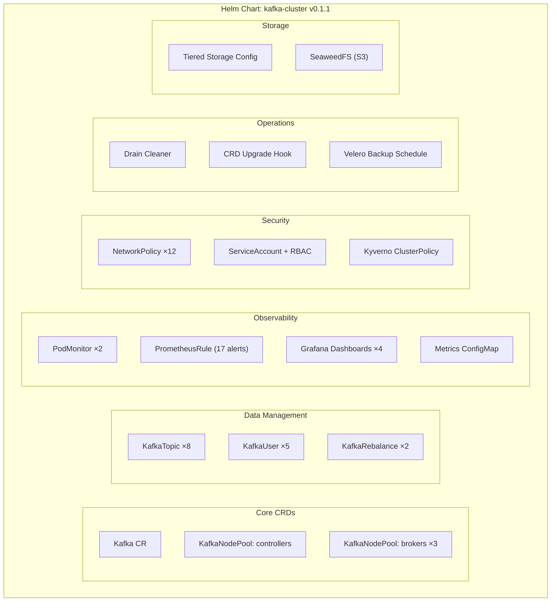
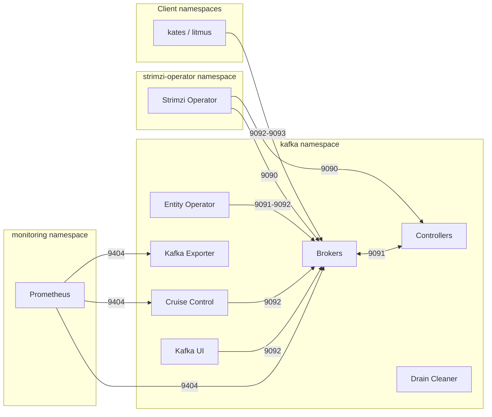
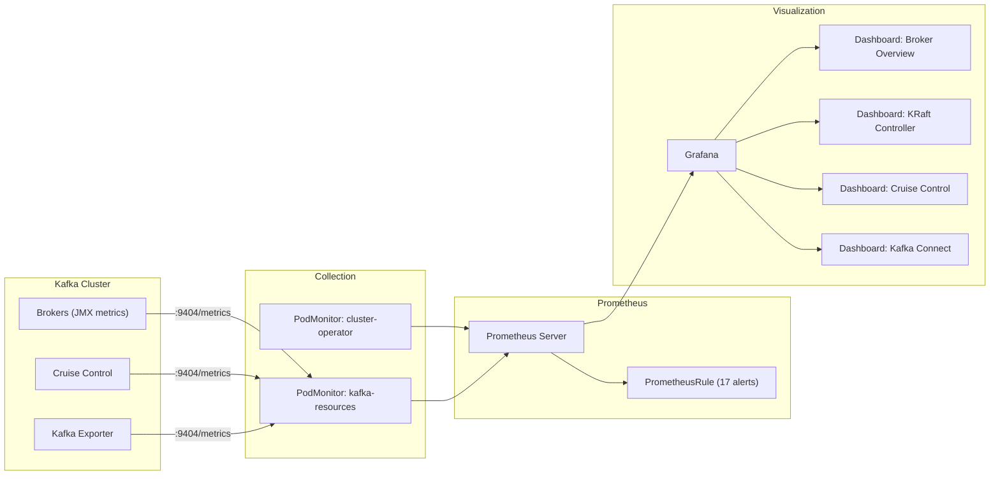
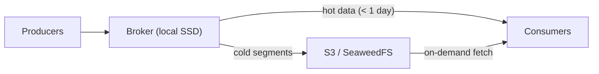

# kafka-cluster Chart Reference

::: {.callout-note appearance="simple"}
**Scope**: the reference half of the `kafka-cluster` chart — the resource graph and template files, listeners and authentication, default topics and users, network policies, the observability stack, and the advanced features. The step-by-step install walkthrough lives in [Installing Kafka with the kafka-cluster Helm Chart](20-installation-guide.md); the engineering rationale lives in [Kafka Deployment Engineering](15-kafka-deployment.md).
:::

The install walkthrough gets you to a running cluster; this chapter explains what the chart actually built. Reach for it when you need to know which template renders a resource, how a listener is wired, what a default topic or user is for, why a connection is blocked, where a metric comes from, or how an advanced feature behaves.

## 8. Chart Architecture Deep Dive

This section provides a comprehensive view of *every* resource the kafka-cluster Helm chart creates. Understanding the full resource graph helps you debug issues, plan capacity, and reason about security boundaries.

### Resource Graph

The chart renders 26 template files into the following resource categories:



### Template File Reference

Every template file in the chart and what it produces:

| Template File | Resources Created | Controlled By |
|---------------|-------------------|---------------|
| `kafka.yaml` | `Kafka` CR (cluster spec, listeners, CA, entity operator, Cruise Control, exporter) | Always |
| `nodepool-controllers.yaml` | `KafkaNodePool` for controller pods (one per zone) | `controllerPools[]` |
| `nodepool-brokers.yaml` | `KafkaNodePool` for broker pods (one per zone) | `brokerPools[]` |
| `topics.yaml` | `KafkaTopic` × 8 (managed topic declarations) | `topics.enabled` |
| `users.yaml` | `KafkaUser` × 5 (SCRAM users with ACLs and quotas) | `users.enabled` |
| `rebalance.yaml` | `KafkaRebalance` × 2 (`full-rebalance` + `add-broker-rebalance`) | `rebalance.enabled` |
| `networkpolicies.yaml` | `NetworkPolicy` × 12 (default-deny, DNS, broker, controller, operator, etc.) | `networkPolicies.enabled` |
| `prometheusrule.yaml` | `PrometheusRule` with 17 alert rules across 9 groups | `alerts.enabled` |
| `podmonitors.yaml` | `PodMonitor` × 2 (cluster-operator-metrics, kafka-resources-metrics) | `podMonitors.enabled` |
| `grafana-dashboards.yaml` | `ConfigMap` × 2 (broker overview, KRaft controller) | `dashboards.enabled` |
| `grafana-dashboards-advanced.yaml` | `ConfigMap` × 1 (Cruise Control dashboard) | `dashboards.cruiseControlDashboard` |
| `grafana-dashboards-connect.yaml` | `ConfigMap` × 1 (Kafka Connect dashboard) | `dashboards.connectDashboard` |
| `metrics-configmap.yaml` | `ConfigMap` (JMX Prometheus Exporter rules) | Always |
| `rbac.yaml` | `ServiceAccount`, `Role`, `RoleBinding` | `rbac.create` |
| `crd-upgrade.yaml` | `Job` + RBAC (pre-install/pre-upgrade hook) | `crdUpgrade.enabled` |
| `drain-cleaner.yaml` | `Deployment`, `Service`, `ValidatingWebhookConfiguration` + RBAC | `drainCleaner.enabled` |
| `tiered-storage.yaml` | `Secret` (S3 credentials), `ConfigMap` (RSM properties) | `tieredStorage.enabled` |
| `seaweedfs.yaml` | SeaweedFS subchart resources (master, volume, filer) | `seaweedfs.enabled` |
| `backup.yaml` | Velero `Schedule`, `Backup`, optional `PVC` | `backup.enabled` |
| `external-secrets.yaml` | `SecretStore`, `PushSecret`, `ExternalSecret` | `externalSecrets.enabled` |
| `pod-security-policy.yaml` | Kyverno `ClusterPolicy` (`kafka-pod-security-standards` — restricted PSS) | `podSecurityPolicy.enabled` |
| `tests/test-connection.yaml` | 9 test `Pod` specs (Helm test hooks, tiers 1–9) | Always (test hooks) |
| `tests/test-performance.yaml` | Performance benchmark test pod | Always (test hooks) |
| `tests/test-profiler.yaml` | JFR profiler test pod | Always (test hooks) |
| `_helpers.tpl` | Template helper functions (labels, names, images) | N/A |
| `NOTES.txt` | Post-install usage instructions | N/A |

::: {.callout-note}
Many resources are opt-in via boolean flags in `values.yaml`. A minimal installation with only core CRDs creates ~15 resources. A full production deployment with all features enabled creates 50+ resources.
:::

---

## 9. Kafka Listeners & Authentication

Kafka *listeners* define how clients connect to the cluster. Each listener has its own port, protocol, and authentication method. Understanding listeners is critical because **misconfigured listeners are the #1 cause of "I can't connect" issues**.

### Default Listener Configuration

The chart configures three listeners out of the box:

| Listener | Port | Protocol | Authentication | TLS | Use Case |
|----------|:----:|----------|---------------|:---:|----------|
| `plain` | 9092 | Plaintext | SCRAM-SHA-512 | ✗ | Internal services within the cluster (fast, no TLS overhead) |
| `tls` | 9093 | TLS | mTLS (certificate) | ✓ | Secure internal communication (mutual TLS — both client and server present certificates) |
| `external` | 9094 | TLS + NodePort | SCRAM-SHA-512 | ✓ | External clients outside the Kubernetes cluster |

**Why three listeners?** Different clients have different security requirements:
- **Internal microservices** use `plain:9092` — SCRAM authentication without TLS encryption. This is acceptable within a trusted network because Kubernetes NetworkPolicies restrict which pods can reach this port.
- **Security-sensitive services** use `tls:9093` — full mTLS ensures both authentication and encryption.
- **External tools** (monitoring dashboards, development laptops) use `external:9094` — NodePort with TLS so traffic is encrypted over the public network.

### Listener Configuration in values.yaml

```yaml
kafka:
  listeners:
    - name: plain
      port: 9092
      type: internal          # ClusterIP service, internal only
      tls: false
      authentication:
        type: scram-sha-512   # Username/password via SCRAM

    - name: tls
      port: 9093
      type: internal
      tls: true               # TLS termination at the broker
      authentication:
        type: tls             # Client certificate (mTLS)

    - name: external
      port: 9094
      type: nodeport          # Exposed via NodePort on each node
      tls: true
      authentication:
        type: scram-sha-512
      configuration: {}       # NodePort settings (overrides per node)
```

### Customizing Listeners

**Add an OAuth 2.0 listener** for services using token-based authentication:

```yaml
kafka:
  listeners:
    # ... existing listeners ...
    - name: oauth
      port: 9095
      type: internal
      tls: true
      authentication:
        type: oauth
        validIssuerUri: https://keycloak.example.com/realms/kafka
        jwksEndpointUri: https://keycloak.example.com/realms/kafka/protocol/openid-connect/certs
        userNameClaim: preferred_username
```

**Change the external listener to LoadBalancer** (cloud clusters):

```yaml
kafka:
  listeners:
    - name: external
      port: 9094
      type: loadbalancer      # Cloud LB instead of NodePort
      tls: true
      authentication:
        type: scram-sha-512
      configuration:
        bootstrap:
          annotations:
            service.beta.kubernetes.io/aws-load-balancer-type: nlb
```

::: {.callout-warning}
When adding or removing listeners, the Strimzi operator performs a **rolling restart** of all brokers. Plan listener changes during a maintenance window.
:::

### Bootstrap Addresses

Each listener gets its own bootstrap service. Use these addresses in your client configurations:

| Listener | Internal Bootstrap Address | External Access |
|----------|---------------------------|-----------------|
| `plain` | `krafter-kafka-bootstrap.kafka.svc:9092` | N/A |
| `tls` | `krafter-kafka-bootstrap.kafka.svc:9093` | N/A |
| `external` | N/A | `<node-ip>:<nodeport>` |

---

## 10. Topics & Users Reference

This section documents every default topic and user the chart creates. You rarely need to create these manually — the Strimzi **Entity Operator** (Topic Operator + User Operator) watches for `KafkaTopic` and `KafkaUser` CRs and reconciles them automatically.

### Default Topics

The chart creates 8 topics, each designed for a specific data pipeline:

| Topic | Partitions | Replicas | Retention | Compression | Cleanup | Purpose |
|-------|:----------:|:--------:|:---------:|:-----------:|:-------:|---------|
| `kates-events` | 6 | 3 | 2 days | — | delete | Test lifecycle events (suite start/end, test pass/fail) |
| `kates-results` | 12 | 3 | 7 days | lz4 | delete | Detailed test results with payloads (high throughput) |
| `kates-metrics` | 6 | 3 | 1 day | lz4 | delete | Real-time metrics pipeline (latency, throughput, resource usage) |
| `kates-audit` | 3 | 3 | 30 days | — | delete | Audit trail for compliance (who ran what, when) |
| `kates-dlq` | 3 | 3 | forever | — | compact | Dead letter queue for failed messages (compacted to keep latest per key) |
| `cdc-schema-history` | 1 | 3 | forever | — | compact | Debezium schema history for CDC connectors |
| `cdc-heartbeat` | 1 | 3 | 1 day | — | delete | CDC liveness heartbeats (detects stalled connectors) |
| `test-sink-topic` | 3 | 3 | 1 day | — | delete | Sink target for Kafka Connect sink connector validation |

**Why these specific configurations?**

- **Partitions** scale with expected throughput — `kates-results` has 12 partitions because it handles the highest message volume.
- **Replicas: 3** ensures data survives the loss of any single broker (`min.insync.replicas: 2` across all topics).
- **Compact cleanup** on `kates-dlq` and `cdc-schema-history` means Kafka keeps only the latest value per key, acting as a key-value store.
- **lz4 compression** on high-volume topics reduces storage and network I/O with minimal CPU overhead.

To list all topics using the kates CLI:

```bash
kates kafka topics
```

### Default Users

The chart creates 5 users with different permission levels:

| User | Auth Type | Quotas | ACL Summary | Purpose |
|------|:---------:|--------|-------------|---------|
| `kates-backend` | SCRAM-SHA-512 | None (superUser) | Full access (superUser bypass) | Primary application service account |
| `kafka-ui` | SCRAM-SHA-512 | 1 MB/s produce, 50 MB/s consume, 10% request | Read-only: all topics, all groups, cluster Describe | Kafka UI dashboard (read-only monitoring) |
| `apicurio-registry` | SCRAM-SHA-512 | 10 MB/s produce, 20 MB/s consume, 15% request | Read/Write/Create: `__apicurio*` topics; Read: `apicurio*` groups | Apicurio Schema Registry |
| `litmus-chaos` | SCRAM-SHA-512 | None | Full topic CRUD: all topics; Read: `litmus*` groups; Describe cluster | Chaos engineering test agent |
| `kates-connect` | SCRAM-SHA-512 | 50 MB/s produce, 50 MB/s consume, 25% request | Read/Write/Create: `kates-connect-*`, `kates-*`, `cdc*` topics; transactional IDs; Read: `kates-connect*`, `connect-*` groups | Kafka Connect worker identity |

**Understanding quotas:**

Quotas prevent a single user from monopolizing cluster resources. For example, `kafka-ui` is limited to 1 MB/s produce because a monitoring dashboard should never produce significant data. The `requestPercentage` quota limits the percentage of broker request handler threads the user can consume.

To list all users:

```bash
kubectl get kafkausers -n kafka -l strimzi.io/cluster=krafter
```

### User Secrets

Each `KafkaUser` CR produces a Kubernetes `Secret` with the same name. The secret contains:

| Key | Content |
|-----|---------|
| `password` | Auto-generated SCRAM password (base64-encoded) |
| `sasl.jaas.config` | Complete JAAS configuration string, ready to use |

**Retrieve a password:**

```bash
kubectl get secret kates-backend -n kafka -o jsonpath='{.data.password}' | base64 -d
```

::: {.callout-important}
Secrets are only created after the Kafka cluster reaches `Ready` state. If secrets are missing, check that the Entity Operator pod is running — see the Troubleshooting section of [Installing Kafka with the kafka-cluster Helm Chart](20-installation-guide.md#10-troubleshooting).
:::

---

## 11. Network Policies

Network policies enforce the principle of **least privilege** at the network layer. Without them, any pod in the cluster can connect to Kafka — with them, only explicitly allowed namespaces and pods can reach specific ports.

### Why Network Policies Matter

In a shared Kubernetes cluster, Kafka is a high-value target:
- It stores sensitive business data
- It has administrative APIs (port 9090) that can modify cluster state
- Unauthorized produce/consume can corrupt data pipelines

The chart's default-deny + explicit-allow approach means you must **opt in** to connectivity — nothing is open by default.

### Traffic Flow Diagram



### All 12 Network Policies

| # | Policy Name | Target Pods | Allows | Ports |
|:-:|-------------|-------------|--------|:-----:|
| 1 | `default-deny` | All pods with `app.kubernetes.io/part-of: strimzi-krafter` | Nothing (baseline deny-all ingress + egress) | — |
| 2 | `allow-dns` | All pods with `app.kubernetes.io/part-of: strimzi-krafter` | DNS egress to any destination | 53/UDP, 53/TCP |
| 3 | `kafka-brokers` | Broker pods (`strimzi.io/kind: Kafka`) | Inter-broker, client namespaces, monitoring, external, operator | 9090–9094, 9404 |
| 4 | `kafka-controllers` | Controller pods (`strimzi.io/controller-role: true`) | Inter-cluster pods (admin API + replication) | 9090, 9091 |
| 5 | `strimzi-operator` | Operator pods (in operator namespace) | Health probes ingress; egress to DNS, API server, kafka namespace | 8080, 53, 443, 6443 |
| 6 | `kafka-ui` | Pods with `app: kafka-ui` | Ingress from any (UI port); egress to brokers | 8080, 9092 |
| 7 | `cruise-control` | Cruise Control pods | Operator admin API, monitoring metrics | 9090, 9404 |
| 8 | `strimzi-drain-cleaner` | Drain Cleaner pods | Webhook ingress; egress to API server | 8443, 443, 6443 |
| 9 | `kafka-mirror-maker` | MirrorMaker2 pods | Monitoring metrics ingress; egress to brokers | 9404, 9092 |
| 10 | `entity-operator` | Entity Operator pods | Monitoring metrics ingress; egress to brokers | 8080, 8081, 9091, 9092 |
| 11 | `kafka-exporter` | Kafka Exporter pods | Monitoring metrics ingress; egress to brokers | 9404, 9092 |
| 12 | `test-egress` | Test pods (`kates.io/test-pod: true`) | Egress to all Kafka ports + DNS (for Helm tests) | 9090–9094, 53 |

### Allowed Client Namespaces

The `kafka-brokers` policy allows ingress from pods in the `kates` and `litmus` namespaces:

```yaml
networkPolicies:
  allowedClientNamespaces:
    - kates
    - litmus
```

**To add a new namespace** (e.g., your application namespace):

```yaml
networkPolicies:
  allowedClientNamespaces:
    - kates
    - litmus
    - my-app-namespace    # Add your namespace here
```

After `helm upgrade`, the broker NetworkPolicy is regenerated with the new ingress rule.

::: {.callout-caution}
The `allowedClientNamespaces` setting uses `namespaceSelector` with broad pod selectors. Only add namespaces you trust, as **all pods** in the namespace will be able to reach Kafka brokers.
:::

### Disabling Network Policies

For development or Kind clusters where NetworkPolicy enforcement isn't needed:

```yaml
networkPolicies:
  enabled: false
```

::: {.callout-warning}
Never disable network policies in production. They are a critical layer of defense-in-depth.
:::

---

## 12. Observability Stack

The chart deploys a comprehensive monitoring pipeline that integrates with the Prometheus + Grafana stack. This section explains *what* is monitored, *why* each alert fires, and *how* the dashboards are structured.

### Architecture



### PrometheusRule Alerts (17 Alerts)

The chart creates a single `PrometheusRule` resource with 17 alerts organized into 9 groups. Each alert is tuned to avoid false positives while catching real issues:

| Group | Alert | Severity | Threshold | For | What It Means |
|-------|-------|:--------:|-----------|:---:|---------------|
| **kafka.cluster** | `KafkaOfflinePartitions` | critical | > 0 offline partitions | 2m | Data is unavailable — some partitions have no leader |
| | `KafkaUnderReplicatedPartitions` | warning | > 0 under-replicated | 5m | Replicas are falling behind — potential data loss risk |
| | `KafkaActiveControllerCount` | critical | ≠ 1 active controller | 3m | Split-brain or no controller — cluster cannot make metadata changes |
| | `KafkaBrokerDiskUsageHigh` | warning | > 80% disk used | 10m | Broker running low on disk — increase storage or retention |
| | `KafkaBrokerDiskUsageCritical` | critical | > 90% disk used | 5m | Broker nearly out of disk — immediate action needed |
| **kafka.consumer** | `KafkaConsumerGroupLag` | warning | > 1M messages lag | 15m | Consumer is falling behind — check consumer health |
| | `KafkaConsumerGroupLagCritical` | critical | > 10M messages lag | 5m | Consumer severely behind — likely stuck or dead |
| **kafka.kraft** | `KafkaRaftLeaderElectionRate` | warning | > 0.5 elections/s | 5m | Frequent leader elections indicate controller instability |
| | `KafkaRaftUncommittedRecords` | warning | > 1000 uncommitted | 5m | Metadata backlog — controllers may be overloaded |
| **kafka.network** | `KafkaRequestLatencyHigh` | warning | P99 > 1000ms | 10m | Slow requests — disk I/O, network, or overloaded brokers |
| **strimzi.operator** | `StrimziOperatorDown` | critical | operator unreachable | 5m | Operator down — no reconciliation of Kafka CRs |
| **kafka.replication** | `KafkaISRShrinkRate` | warning | ISR shrink > 0/s | 5m | Replicas falling out of sync — network or disk problems |
| **kafka.performance** | `KafkaLogFlushLatencyHigh` | warning | P99 > 500ms | 10m | Slow disk writes — check I/O scheduler and disk health |
| | `KafkaRequestHandlerSaturated` | warning | idle < 30% | 10m | Request handlers over 70% busy — add threads or brokers |
| **kafka.cruisecontrol** | `CruiseControlAnomalyDetected` | warning | > 0 anomalies/10m | 5m | Cruise Control detected cluster imbalance or failures |
| **kafka.certificates** | `KafkaCertificateExpiringSoon` | warning | < 30 days to expiry | 1h | Certificate renewal needed — auto-renewal should handle this |
| | `KafkaCertificateExpiryCritical` | critical | < 7 days to expiry | 30m | Certificate about to expire — manual intervention may be needed |

### Grafana Dashboards

The chart creates 4 Grafana dashboards as ConfigMaps with the `grafana_dashboard: "1"` label. The Grafana sidecar auto-discovers and loads them:

| Dashboard | ConfigMap | Key Panels | Controlled By |
|-----------|-----------|------------|---------------|
| **Broker Overview** | `kafka-broker-dashboard` | Messages in/out rate, bytes in/out, request latency P99, ISR metrics, disk usage | `dashboards.brokerDashboard` |
| **KRaft Controller** | `kafka-kraft-dashboard` | Leader election rate, uncommitted records, metadata log size, quorum health | `dashboards.kraftDashboard` |
| **Cruise Control** | `kafka-cruise-control-dashboard` | Anomaly count, rebalance status, optimization goals, broker capacity | `dashboards.cruiseControlDashboard` |
| **Kafka Connect** | `kafka-connect-dashboard` | Connector status, task failures, source/sink throughput, offset commit rate | `dashboards.connectDashboard` |

### PodMonitors

Two PodMonitors tell Prometheus which pods to scrape:

| PodMonitor | Matches | Endpoint | Relabelings |
|------------|---------|----------|-------------|
| `cluster-operator-metrics` | `strimzi.io/kind: cluster-operator` | `/metrics` on port `http` | None |
| `kafka-resources-metrics` | `strimzi.io/kind` ∈ {Kafka, KafkaConnect, KafkaMirrorMaker, KafkaMirrorMaker2} | `/metrics` on port `tcp-prometheus` | Pod name, namespace, node name |

### JMX Metrics ConfigMap

The `kafka-metrics` ConfigMap contains the JMX Prometheus Exporter configuration that controls which MBeans are exported as Prometheus metrics. The Kafka CR and Cruise Control both reference this ConfigMap via `metricsConfig.valueFrom.configMapKeyRef`.

Key metric categories exported:
- **Broker**: messages in/out, bytes in/out, request latency, ISR state
- **Controller**: active controller count, election rate, metadata log
- **Network**: request handler idle percent, connection count
- **Log**: flush rate and time, segment count, log end offset
- **Replication**: ISR shrink/expand rate, under-replicated partitions

---

## 13. Advanced Features

This section covers the chart's optional features that go beyond the basic Kafka deployment. Each feature is independently toggleable via `values.yaml`.

### CRD Upgrade Hook

**Why it exists:** Strimzi CRDs are cluster-scoped resources that Helm [cannot manage cleanly](https://helm.sh/docs/chart_best_practices/custom_resource_definitions/) — Helm won't upgrade CRDs after initial install. Without this hook, upgrading Strimzi versions leaves stale CRDs that block new features.

**How it works:** The chart includes a `pre-install`/`pre-upgrade` Helm hook Job that:

1. Downloads the Strimzi CRDs YAML from the GitHub release matching `strimziVersion`
2. Applies them with `kubectl apply --server-side --force-conflicts`
3. Verifies all required CRDs (`kafkas`, `kafkatopics`, `kafkausers`, `kafkanodepools`) exist

```yaml
crdUpgrade:
  enabled: true                    # Set to false if CRDs are managed externally
  image: "bitnami/kubectl:latest"  # Image with kubectl binary
```

::: {.callout-note}
The Job runs with a dedicated `ServiceAccount` and `ClusterRole` scoped only to CRD read/write. It cleans itself up after success (`hook-delete-policy: before-hook-creation,hook-succeeded`).
:::

### Drain Cleaner

**Why it exists:** When a Kubernetes node is drained (e.g., during upgrades), the kubelet evicts pods immediately. For Kafka, this can cause data loss if a broker is killed without transferring partition leadership first.

**How it works:** The Strimzi Drain Cleaner is a ValidatingWebhookConfiguration that intercepts pod eviction requests. When it sees a Kafka pod being evicted:

1. It annotates the pod's `StrimziPodSet` to trigger a controlled restart
2. The Strimzi operator performs a graceful shutdown — transferring leadership, waiting for ISR to heal
3. Only then is the pod terminated

```yaml
drainCleaner:
  enabled: false     # Enable for production clusters with node upgrade cycles
  image: quay.io/strimzi/drain-cleaner:1.6.1
  resources:
    requests:
      memory: 64Mi
      cpu: 50m
    limits:
      memory: 128Mi
      cpu: 100m
```

::: {.callout-tip}
Enable Drain Cleaner in any environment where nodes are regularly drained — EKS managed node groups, GKE node auto-upgrades, or spot/preemptible instances.
:::

### Tiered Storage

**Why it exists:** Kafka's local disk storage is expensive and finite. Tiered storage (Kafka 3.6+ KIP-405) moves cold log segments to cheap object storage while keeping hot data on local SSDs for low-latency reads.

**How it works:**



- **Local retention**: 1 day (`log.local.retention.ms: 86400000`)
- **Remote retention**: Follows the topic's `retention.ms` setting
- **Backend**: Any S3-compatible store — SeaweedFS (built-in), AWS S3, MinIO

```yaml
tieredStorage:
  enabled: true
  s3:
    bucketName: kafka-tiered-storage
    region: us-east-1
    endpointUrl: ""              # Auto-resolves to SeaweedFS when seaweedfs.enabled=true
    pathStyleAccessEnabled: true
  retention:
    localRetentionMs: 86400000   # 1 day on local disk
```

::: {.callout-warning}
Tiered storage requires Kafka 3.6+. Enabling it on older versions will cause broker startup failures.
:::

### SeaweedFS

**Why it exists:** Not every environment has AWS S3 or a cloud object store. SeaweedFS provides a lightweight, self-hosted S3-compatible backend deployed as a Helm subchart.

**Two roles in the Kates stack:**
1. **Tiered Storage backend** — Kafka's Remote Log Storage Manager writes cold segments here
2. **Velero backup target** — Velero stores CRD and controller PVC backups here

```yaml
seaweedfs:
  enabled: false    # Enable in staging/prod overlays
  s3:
    accessKeyId: "kates-kafka"
    secretAccessKey: "change-me-in-prod"
  master:
    replicas: 1     # 3 for production HA
  volume:
    replicas: 1     # 3 for production HA
    storage: 100Gi  # 500Gi+ in prod
  filer:
    replicas: 1
    s3:
      enabled: true
      port: 8333
```

### Velero Backup

**Why it exists:** Even with replicated data, you need to back up the *cluster topology* — the CRDs, Secrets, and ConfigMaps that define your Kafka cluster. Without them, you'd have to recreate every topic, user, and ACL from scratch after a disaster.

**What gets backed up:**
- Strimzi CRs (`Kafka`, `KafkaNodePool`, `KafkaTopic`, `KafkaUser`)
- Secrets (SCRAM passwords, CA certificates)
- Controller PVCs (KRaft metadata logs — small, ~1 GB each)

**What does NOT get backed up:**
- Broker PVCs — intentionally excluded. Broker data is recoverable via replication (`replication.factor: 3`) and tiered storage. Snapshotting broker PVCs would be redundant, wasteful, and unsafe (crash-consistent snapshots can contain partially flushed segments).

```yaml
backup:
  enabled: true
  schedule: "0 2 * * *"         # Daily at 2 AM
  ttl: 168h0m0s                 # 7-day retention
  snapshotVolumes: false        # MUST be false — see above
  storageLocation: default      # Points to SeaweedFS BSL
```

::: {.callout-caution}
Do **not** set `snapshotVolumes: true`. Broker PVC snapshots are crash-consistent and can corrupt data on restore. See the section "Why NetBackup is Incompatible with Kafka" in the chart's README (`charts/kafka-cluster/README.md`) for the full rationale.
:::

### External Secrets Operator

**Why it exists:** Strimzi generates SCRAM passwords as Kubernetes Secrets, but your application might need those passwords in AWS Secrets Manager, HashiCorp Vault, or another namespace. The External Secrets Operator (ESO) bridges this gap.

**Three modes:**

| Mode | Direction | Use Case |
|------|-----------|----------|
| **Push** | K8s → External vault | Push Strimzi user passwords to AWS Secrets Manager or Vault |
| **Pull** | External vault → K8s | Pull S3 credentials from Vault into the kafka namespace |
| **Sync** | K8s → K8s (cross-namespace) | Replicate a user secret from `kafka` to your app's namespace |

```yaml
externalSecrets:
  enabled: true
  secretStore:
    create: true
    provider:
      vault:
        server: "https://vault.example.com"
        path: "secret"
        auth:
          kubernetes:
            mountPath: "kubernetes"
            role: "kafka"
  push:
    - sourceSecret: kates-backend
      refreshInterval: 1h
      data:
        - secretKey: password
          remoteKey: kafka/kates-backend
          property: password
```

### Kyverno Pod Security Policies

**Why they exist:** Kubernetes deprecated PodSecurityPolicies (PSP) in v1.25. The chart uses [Kyverno](https://kyverno.io/) ClusterPolicies as a modern replacement, enforcing Pod Security Standards (PSS) at the `restricted` level.

**The ClusterPolicy:**

| Policy | Validates / Mutates | Key Rules |
|--------|:-------------------:|-----------|
| `kafka-pod-security-standards` | Both | Non-root, drop ALL capabilities, seccomp RuntimeDefault, no privilege escalation, no host namespaces |

The `kates-workload-standards`, `kates-image-verification`, and `kates-generate-network-policies` policies listed in section 1.5 ship with the Kates backend chart (`charts/kates`), not with kafka-cluster.

```yaml
podSecurityPolicy:
  enabled: false          # Enable when Kyverno is installed
  action: Audit           # Start with Audit, switch to Enforce after testing
  mutate: false           # Auto-inject security contexts
  excludeStrimziPods: true  # Don't mutate Strimzi-managed pods (operator handles them)
```

::: {.callout-tip}
Always start with `action: Audit`. Run `kubectl get policyreport -A` to see which pods would be blocked, then fix them before switching to `Enforce`.
:::

### Cruise Control & Rebalance

**Why it exists:** When you add or remove brokers, partitions don't automatically redistribute. Cruise Control continuously monitors broker load and generates optimal partition assignment plans.

**Two KafkaRebalance resources:**

| Name | Mode | Trigger |
|------|------|---------|
| `full-rebalance` | `full` | Manual — annotate to approve a full cluster rebalance |
| `add-broker-rebalance` | `add-brokers` | Automatic — Cruise Control detects new brokers and generates a plan |

**8 optimization goals** (in priority order):

1. `RackAwareGoal` — Spread replicas across failure domains
2. `ReplicaCapacityGoal` — Don't exceed broker replica limits
3. `DiskCapacityGoal` — Keep disk usage balanced
4. `NetworkInboundCapacityGoal` — Balance inbound network load
5. `NetworkOutboundCapacityGoal` — Balance outbound network load
6. `CpuCapacityGoal` — Balance CPU utilization
7. `TopicReplicaDistributionGoal` — Spread topic replicas evenly
8. `LeaderBytesInDistributionGoal` — Balance leader write load

**Trigger a manual rebalance:**

```bash
# Generate a rebalance proposal
kubectl annotate kafkarebalance full-rebalance strimzi.io/rebalance=approve -n kafka

# Check the proposal status
kubectl get kafkarebalance full-rebalance -n kafka -o jsonpath='{.status.conditions}'
```

### Certificate Authority

**Why it exists:** Kafka uses TLS for inter-broker communication and client connections. The chart configures Strimzi to auto-generate and manage both the cluster CA and clients CA.

**Two CAs:**

| CA | Purpose | Validity | Renewal Window |
|----|---------|:--------:|:--------------:|
| **Cluster CA** | Signs broker and controller certificates | 5 years (1825 days) | 180 days before expiry |
| **Clients CA** | Signs client certificates (mTLS users) | 5 years (1825 days) | 180 days before expiry |

```yaml
kafka:
  clusterCa:
    generateCertificateAuthority: true
    validityDays: 1825
    renewalDays: 180
    certificateExpirationPolicy: replace-key

  clientsCa:
    generateCertificateAuthority: true
    validityDays: 1825
    renewalDays: 180
    certificateExpirationPolicy: replace-key
```

**`replace-key`** means Strimzi generates a new CA key pair on renewal. This is more secure than `renew-certificate` (which reuses the existing key) but causes a rolling restart as all pods receive new certificates.

::: {.callout-note}
The `KafkaCertificateExpiringSoon` alert (see [Section 12.2](#prometheusrule-alerts-17-alerts)) fires 30 days before expiry. With a 180-day renewal window, you should never see this alert under normal operations — if you do, Strimzi's automatic renewal may be stuck.
:::

### Helm Test Suite (9 Tiers)

The chart includes a comprehensive test suite executed via `kates test helm` (or `helm test kafka-cluster -n kafka`). Tests are organized in 9 tiers, running in order from basic connectivity to full observability validation:

| Tier | Hook Weight | Pod Name | Validates |
|:----:|:-----------:|----------|-----------|
| 1 | 1 | `*-test-connectivity` | Bootstrap TCP connectivity, Kafka CR Ready, broker pod health, DNS resolution, listener reachability |
| 2 | 2 | `*-test-produce-consume` | End-to-end produce/consume round-trip with SCRAM-SHA-512 authentication |
| 3 | 3 | `*-test-authorization` | KafkaUser CR readiness, SCRAM credential secrets exist, ACL authorization type is `simple` |
| 4 | 4 | `*-test-kraft-quorum` | Controller node pool replicas match spec, controller pods running, KRaft mode annotation enabled |
| 5 | 5 | `*-test-topics` | All KafkaTopic CRs are Ready, partition/replica counts match declared values |
| 6 | 6 | `*-test-listeners` | All listeners have bootstrapServers in status, TLS CA cert exists and is not expired |
| 7 | 7 | `*-test-nodepools` | Broker pool replicas match spec, total broker pod count, node distribution across zones |
| 8 | 8 | `*-test-cruise-control` | Cruise Control pod running, KafkaRebalance CRD registered, Cruise Control in Kafka CR spec |
| 9 | 9 | `*-test-metrics` | `kafka-metrics` ConfigMap exists, Kafka Exporter pod running, PodMonitor resources present |

**Run the full suite:**

```bash
kates test helm
```

Or with direct Helm (useful in CI):

```bash
helm test kafka-cluster -n kafka --timeout 120s
```

**Run a specific tier** by filtering test pods:

```bash
# Run only tier 2 (produce/consume)
helm test kafka-cluster -n kafka --filter name=krafter-test-produce-consume
```

::: {.callout-tip}
If tier 2 (produce/consume) fails but tier 1 passes, the issue is usually authentication — check that the user secret exists and the SCRAM password is populated. Run `kubectl get kafkausers -n kafka` to verify user status.
:::
