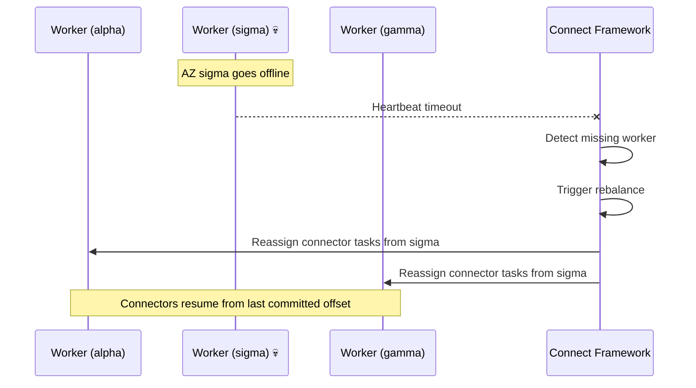
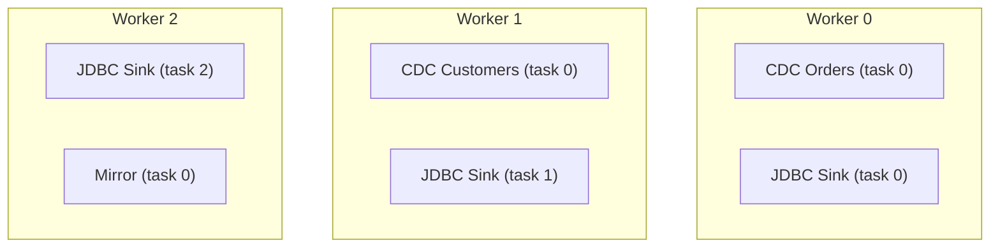
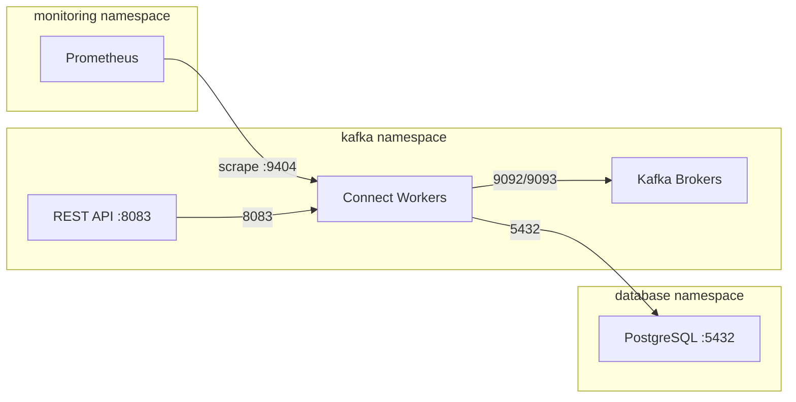
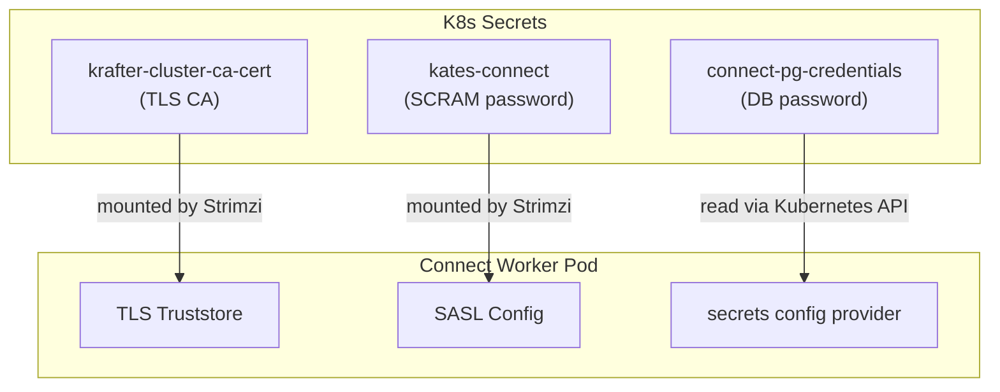

# Operating Kafka Connect

Building a Connect pipeline is half the job; keeping it healthy in production is the other half. This chapter collects the operational half: placement and scaling, tuning, network isolation, the REST API in anger, credential rotation, upgrades, disaster recovery, and troubleshooting.

> **Scope**: day-2 operations for the `connect-cluster` chart. For concepts, the `KafkaConnect` resource, Debezium, and pipeline design, see [Kafka Connect & CDC Pipelines](21-kafka-connect.md).

## Multi-AZ Deployment Strategy

The connect-cluster chart uses the **Stretched Cluster** strategy — a single `KafkaConnect` resource spanning all Availability Zones.

```mermaid
graph TB
    subgraph AZ_Alpha["AZ: alpha"]
        W0["Worker 0"]
    end

    subgraph AZ_Sigma["AZ: sigma"]
        W1["Worker 1"]
    end

    subgraph AZ_Gamma["AZ: gamma"]
        W2["Worker 2"]
    end

    subgraph Kafka_Internal["Shared Internal Topics"]
        OFF["connect-offsets"]
        CFG["connect-configs"]
        STA["connect-status"]
    end

    W0 <-->|"group protocol"| OFF
    W1 <-->|"group protocol"| OFF
    W2 <-->|"group protocol"| OFF

    style AZ_Alpha fill:#1a4a1a
    style AZ_Sigma fill:#1a3a4a
    style AZ_Gamma fill:#4a1a3a
```



### How It Works

- **Single `groupId`:** All workers share `kates-connect-cluster` and one set of internal topics
- **Topology Spread Constraints:** Workers are evenly distributed across zones via `topologySpreadConstraints`
- **Pod Anti-Affinity:** No two workers on the same node

### AZ Failure Behavior

When an entire Availability Zone goes offline:



| Event | Behavior |
|-------|----------|
| Worker pod dies | Framework rebalances tasks to surviving workers (seconds) |
| Entire AZ offline | Framework reassigns all tasks from dead workers |
| AZ recovers | Workers rejoin, framework rebalances to restore even distribution |
| Offset continuity | ✅ Preserved — offsets stored in shared Kafka topic |

::: {.callout-note}
Cross-AZ data transfer costs apply when a connector in zone alpha reads from a database in zone sigma. This is an acceptable tradeoff for seamless failover — CDC downtime during a rebalance is typically under 30 seconds.
:::


### Scheduling Configuration

```yaml
# Production (values-prod.yaml)
topologySpreadConstraints:
  enabled: true
  maxSkew: 1
  topologyKey: topology.kubernetes.io/zone
  whenUnsatisfiable: DoNotSchedule

podAntiAffinity:
  enabled: true
  topologyKey: kubernetes.io/hostname

rack:
  enabled: true
  topologyKey: topology.kubernetes.io/zone
```

The base values use `whenUnsatisfiable: ScheduleAnyway`, so single-node clusters like Kind still schedule all workers; the dev overlay disables topology spread and anti-affinity entirely, while the prod overlay tightens spreading to `DoNotSchedule`.

## Capacity Planning

### Worker Sizing

Each Connect worker consumes memory proportional to the number of tasks it runs and the batch sizes configured:

```
Worker Memory = JVM Heap + Off-Heap
             = (-Xmx) + (Direct Buffers + Thread Stacks + JMX + GC Overhead)
             ≈ -Xmx × 2
```

| Workload | Workers | Heap (-Xmx) | Container Memory | CPU |
|----------|:-------:|:-----------:|:----------------:|:---:|
| 1–3 connectors, low throughput | 1 | 512m | 1Gi | 500m |
| 5–10 connectors, moderate throughput | 2 | 1024m | 2Gi | 1000m |
| 10–20 connectors, high throughput | 3 | 2048m | 4Gi | 2000m |
| 20+ connectors, very high throughput | 5+ | 2048m | 6Gi | 4000m |

### Task Distribution

Connectors are divided into tasks, and tasks are distributed across workers:



**Rules of thumb:**
- Debezium source connectors: always `tasksMax: 1` (limited by replication slot)
- JDBC sink connectors: `tasksMax` = number of topic partitions (for parallelism)
- Mirror connectors: `tasksMax` = number of source partitions
- Target: 2–5 tasks per worker for optimal CPU utilization

### Throughput Benchmarks

Approximate throughput per worker (single connector, 1Gi heap, 1 CPU):

| Connector Type | Records/second | MB/second | Notes |
|---------------|:--------------:|:---------:|-------|
| Debezium PostgreSQL (streaming) | 5,000–15,000 | 2–10 | Depends on WAL volume |
| Debezium PostgreSQL (snapshot) | 20,000–50,000 | 10–30 | Bulk read, higher throughput |
| JDBC Source (poll) | 1,000–5,000 | 1–5 | Limited by SQL query speed |
| JDBC Sink | 5,000–20,000 | 2–15 | Batched inserts |
| MirrorSource | 50,000–100,000 | 20–50 | Mostly network-bound |

---

## Performance Tuning

### Producer Tuning

Connect's internal producer sends records to Kafka. These settings control batching and throughput:

| Setting | Default | Tuned | Effect |
|---------|---------|-------|--------|
| `producer.batch.size` | 16384 | 65536 | Larger batches = fewer requests, higher throughput |
| `producer.linger.ms` | 0 | 10 | Wait up to 10ms to fill batch |
| `producer.buffer.memory` | 33554432 | 67108864 | 64MB producer buffer |
| `producer.compression.type` | none | lz4 | Compress records — reduces network and storage |
| `producer.max.request.size` | 1048576 | 10485760 | 10MB max request — needed for large CDC events |

### Consumer Tuning (Sink Connectors)

| Setting | Default | Tuned | Effect |
|---------|---------|-------|--------|
| `consumer.fetch.min.bytes` | 1 | 65536 | Wait for 64KB before returning fetch |
| `consumer.max.poll.records` | 500 | 2000 | More records per poll = higher throughput |
| `consumer.auto.offset.reset` | `latest` | `earliest` | Chart default — don't miss records |

### Connector-Level Tuning

| Setting | Type | Default | Recommended | Notes |
|---------|------|---------|-------------|-------|
| `poll.interval.ms` | Debezium | 500 | 100–500 | Lower = less latency, more CPU |
| `max.batch.size` | Debezium | 2048 | 4096–8192 | Records per batch from the WAL |
| `max.queue.size` | Debezium | 8192 | 16384 | Internal queue between reader and producer |
| `snapshot.fetch.size` | Debezium | 2048 | 10000 | Rows per SELECT during snapshot |
| `batch.size` | JDBC Sink | 3000 | 5000–10000 | Rows per INSERT batch |

::: {.callout-tip}
Monitor `rate(kafka_connect_source_task_metrics_source_record_poll_total[5m])` and `rate(kafka_connect_source_task_metrics_source_record_write_total[5m])` in Grafana. If poll rate >> write rate, the producer is the bottleneck — increase `producer.batch.size` and enable compression.
:::


---

## Observability

### Prometheus Alerts

The chart deploys the following alert rules (thresholds are configurable under `alerts.thresholds`):

| Alert | Condition | Severity |
|-------|-----------|----------|
| `KafkaConnectTaskFailed` | Failed task count > 0 for 2min | critical |
| `KafkaConnectWorkerDown` | Worker reports 0 connectors for 3min | critical |
| `KafkaConnectTaskCountMismatch` | Expected vs running task count differ for 5min | critical |
| `KafkaConnectRebalanceStorm` | Completed-rebalance rate above threshold for 5min | warning |
| `KafkaConnectHighErrorRate` | Task error-log rate above threshold for 5min | warning |
| `KafkaConnectRebalanceTooLong` | A rebalance has been in progress for 5min | warning |
| `KafkaConnectWorkerHeapHigh` | JVM heap usage above threshold (default 85%) for 5min | warning |
| `KafkaConnectSourceLag` | Source task polled 0 records for `sourceLagMinutes` (default 15min) | warning |

### Grafana Dashboard

The dashboard ships the following panels:

| Panel | Metric | Visualization |
|-------|--------|---------------|
| Running Connectors | `kafka_connect_worker_metrics_connector_count` | Stat |
| Failed Tasks | `kafka_connect_worker_metrics_connector_failed_task_count` | Stat |
| Running Tasks | `kafka_connect_worker_metrics_task_count` | Stat |
| Rebalance Rate | `rate(kafka_connect_worker_rebalance_metrics_completed_rebalances_total[5m])` | Stat |
| Task Error Rate | `rate(kafka_connect_task_error_metrics_total_errors_logged[5m])` | Time series |
| Source Records Poll Rate | `rate(kafka_connect_source_task_metrics_source_record_poll_total[5m])` | Time series |
| Sink Records Put Rate | `rate(kafka_connect_sink_task_metrics_sink_record_send_total[5m])` | Time series |
| JVM Heap Usage | `jvm_memory_bytes_used{area="heap"}` | Time series |

### Helm Test

The chart includes Helm tests: a connectivity pod that probes the Connect REST API, plus example `KafkaTopic` and `KafkaConnector` resources (defined under `testTopics` / `testConnectors` in values) that are created during `helm test` and deleted when the test succeeds:

```bash
# Run the CDC integration test via Kates CLI
kates kafka connect test

# Or run the Helm chart test directly
helm test connect-cluster --namespace kafka --timeout 180s --logs
```

The `kates kafka connect test` command runs a full end-to-end CDC integration test against the backend, with a Bubble Tea progress UI showing each phase (DB setup → topic creation → source deploy → sink deploy → verification → cleanup).

The connectivity test pod curls the Connect REST API on port 8083 (the root endpoint and `/connector-plugins`) — first by exec-ing into a worker pod, then falling back to the chart's REST API Service.

## Network Policies

The chart ships a default-deny posture: a deny-all Ingress+Egress policy for the Connect pods (`networkPolicy.defaultDeny.enabled`, on by default) with every allowed flow — Kafka, DNS, the Kubernetes API, monitoring scrapes, the REST API, and databases — expressed as an explicit, individually configurable allow rule. For cross-namespace database connections it generates egress rules like these:



Database egress rules are dynamically generated from `values.yaml`:

```yaml
databaseEgress:
  - namespace: database
    port: 5432
    podSelector:
      app.kubernetes.io/name: postgresql
```

Each entry generates a `NetworkPolicy` egress rule allowing Connect workers to reach the specified pods in the specified namespace.

## REST API & Connector Operations

The Kates CLI wraps the Connect REST API with ergonomic commands:

```bash
# List all connectors
kates kafka connect connectors

# Describe a connector (full YAML)
kates kafka connect connector debezium-postgres-source

# Show connector config only
kates kafka connect config debezium-postgres-source

# Show task-level status
kates kafka connect tasks debezium-postgres-source

# Pause / resume / restart
kates kafka connect pause debezium-postgres-source
kates kafka connect resume debezium-postgres-source
kates kafka connect restart debezium-postgres-source

# Restart a specific task
kates kafka connect restart-task debezium-postgres-source 0

# Scale workers
kates kafka connect scale 5

# Tail logs (with follow)
kates kafka connect logs -f

# JSON output for scripting
kates kafka connect connectors -o json | jq '.[].metadata.name'
```

### Direct REST API Access

The Connect REST API (port 8083) is also exposed via a `ClusterIP` Service for direct access:

```bash
# Port-forward for local access
kubectl port-forward -n kafka svc/connect-cluster-rest-api 8083:8083

# List connectors via REST
curl -s http://localhost:8083/connectors | jq .
```

For external access, enable the Ingress:

```yaml
restApi:
  ingress:
    enabled: true
    className: nginx
    hosts:
      - host: connect.example.com
        paths:
          - path: /
            pathType: Prefix
```

## Security & Credential Rotation

### Credential Architecture



### Rotation Procedures

| Credential | Rotation Method | Downtime |
|-----------|----------------|:--------:|
| Kafka TLS CA | Strimzi auto-rotates 180 days before expiry | Zero — rolling restart |
| SCRAM password | Update `KafkaUser` CR → Strimzi updates Secret | Zero — rolling restart |
| Database password | Update K8s Secret → restart the connector | Seconds — connector restart only |
| Connect REST API (if exposed) | Ingress-level auth (OAuth2 proxy, mTLS) | N/A |

**Database credential rotation:**

```bash
# 1. Update the secret
kubectl create secret generic connect-pg-credentials \
  -n connect \
  --from-literal=username=debezium \
  --from-literal=password=NEW_PASSWORD \
  --dry-run=client -o yaml | kubectl apply -f -

# 2. Restart the connector — the secrets config provider re-reads
#    the Secret when the connector configuration is (re)applied
kates kafka connect restart debezium-postgres-source
```

::: {.callout-important}
Update the database password in PostgreSQL **before** updating the Kubernetes Secret. If you update the Secret first, Connect workers will restart and immediately fail authentication.
:::


---

## Upgrade Procedures

### Upgrading the Connect Image

When a new Debezium or Kafka version is released:

```bash
# 1. Bump ARG DEBEZIUM_VERSION in Dockerfile.connect (e.g. 3.7.0.Final),
#    then build and push — the image tag is derived from that ARG
make connect-build connect-push

# 2. Deploy with updated image via Kates CLI
kates deploy --with-kafka-connect

# Or update directly via Helm
helm upgrade connect-cluster charts/connect-cluster \
  --namespace kafka --reuse-values \
  --set image=ghcr.io/bmscomp/connect:3.7.0
```

Strimzi performs a **rolling restart** — one worker at a time. Connectors are rebalanced to surviving workers during each restart, ensuring zero downtime.

### Upgrade Checklist

| Step | Action | Verify |
|:----:|--------|--------|
| 1 | Read Debezium migration guide | Breaking changes documented |
| 2 | Build new image on CI | `make connect-build` passes |
| 3 | Deploy to dev/staging | `kates deploy --with-kafka-connect` on dev cluster |
| 4 | Run integration test | `kates kafka connect test` passes |
| 5 | Verify connector status | `kates kafka connect connectors` — all RUNNING, no DLQ growth |
| 6 | Deploy to production | `kates deploy --with-kafka-connect --ha` on prod cluster |
| 7 | Monitor for 24h | No alerts, no lag increase |

### Rolling Back

```bash
# Rollback to previous Helm release
helm rollback connect-cluster -n kafka

# Or pin to previous image
helm upgrade connect-cluster charts/connect-cluster \
  --namespace kafka --reuse-values \
  --set image=ghcr.io/bmscomp/connect:3.6.0
```

::: {.callout-warning}
If the new Debezium version changed the internal offset format, rolling back may cause connectors to fail with deserialization errors. Always test in staging first.
:::


---

## Disaster Recovery

### Scenario: Internal Topics Deleted

If the `connect-offsets` topic is accidentally deleted:

1. All source connectors lose their position
2. On restart, they fall back to `snapshot.mode` behavior:
   - `initial` → full database snapshot (hours for large databases)
   - `schema_only` → only new changes (data gap)

**Recovery procedure:**

```bash
# 1. Scale down Connect workers
kates kafka connect scale 0

# 2. Scale back up — workers recreate internal topics on startup
kates kafka connect scale 3

# 3. Monitor snapshot progress
kates kafka connect logs -f
```

### Scenario: Connect Cluster Completely Lost

If the entire Connect deployment is destroyed:

```bash
# 1. Redeploy via Kates CLI
kates deploy --with-kafka-connect --ha

# 2. Connectors defined in values.yaml are automatically recreated
# 3. If offsets topic still exists in Kafka, connectors resume from last position
# 4. If offsets topic is also lost, connectors re-snapshot
```

::: {.callout-tip}
The internal topics (`*-offsets`, `*-configs`, `*-status`) are the only persistent state for the Connect cluster. As long as these topics survive in Kafka (with RF=3), the Connect cluster is fully rebuildable from the Helm chart alone.
:::


### Backup Strategy

The Connect cluster itself is stateless — all state lives in Kafka topics. Backup strategy:

| Component | Backup Method | RPO |
|-----------|-------------|:---:|
| Connector configs | Version-controlled in `values.yaml` | 0 |
| Connector offsets | Kafka topic with RF=3 | 0 (unless all brokers fail) |
| Database credentials | Kubernetes Secret backup (Velero) | Daily |
| Connect image | OCI registry + Dockerfile in Git | 0 |

---

## Troubleshooting

### Connector Stuck in FAILED State

**Symptom:** `KafkaConnector` status shows `FAILED` with `io.debezium.DebeziumException`

**Diagnosis:**

```bash
# Check connector status
kates kafka connect connectors
kates kafka connect connector debezium-postgres-source

# Check Connect worker logs
kates kafka connect logs
```

**Common causes:**

| Error | Cause | Fix |
|-------|-------|-----|
| `PSQLException: FATAL: password authentication failed` | Wrong credentials in secret | Update `connect-pg-credentials` secret |
| `replication slot "debezium_kates" is active` | Previous connector instance still holding the slot | Restart the connector or drop the slot manually |
| `could not access file "pgoutput"` | PostgreSQL `wal_level` is not `logical` | Set `wal_level = logical` in PostgreSQL config |
| `No matching table(s) in schema "public"` | `schema.include.list` doesn't match any tables | Verify the schema and table names exist |

### Rebalancing Takes Too Long

**Symptom:** Connect cluster stuck in `REBALANCING` state for minutes (the `KafkaConnectRebalanceTooLong` alert fires after 5 minutes)

**Cause:** A large number of connectors/tasks being reassigned, or workers repeatedly leaving and rejoining the group. (The chart also sets `group.initial.rebalance.delay.ms: 3000`, which adds a fixed 3-second wait before the *first* assignment when the group forms — that delay is intentional and not the problem here.)

**Fix:** If rebalancing takes more than 5 minutes, check for:
- Workers crashing during rebalance (check pod events)
- Network policies blocking inter-worker communication on port 8083
- Insufficient memory causing OOM kills during task assignment

### Connect Workers OOMKilled

**Symptom:** Pods restarting with `OOMKilled` exit reason

**Cause:** JVM heap (`-Xmx`) + off-heap memory exceeds the container memory limit

**Fix:** Ensure `resources.limits.memory` is at least 2× the `-Xmx` value to account for off-heap memory (direct buffers, thread stacks, JMX):

```yaml
jvmOptions:
  -Xmx: 1024m          # 1Gi heap
resources:
  limits:
    memory: 2Gi         # 2× heap = headroom for off-heap
```

### Replication Slot WAL Retention Growing

**Symptom:** PostgreSQL disk usage growing rapidly, `pg_replication_slots` shows large `wal_status`

**Cause:** The Debezium connector is down or paused, but the replication slot retains WAL segments

**Fix:**
1. Resume or restart the connector to drain the slot
2. If the connector is permanently removed, drop the slot:

```sql
SELECT pg_drop_replication_slot('debezium_kates');
```

3. Enable heartbeat to prevent WAL retention on idle tables:

```yaml
heartbeat.interval.ms: "10000"
```

### Validation Hook Blocks Deployment

**Symptom:** `helm upgrade` hangs or fails with "validation FAILED"

**Cause:** The pre-install hook detected missing required fields in connector configs

**Fix:** Read the hook pod logs to see which fields are missing:

```bash
kubectl logs -n kafka connect-cluster-validate-connectors --tail=50
```

Fix the connector configs in `values.yaml` and re-run `helm upgrade`.

Component versions for the Connect stack are tracked centrally in the [Version & Compatibility Matrix](appendix-d-versions.md).
