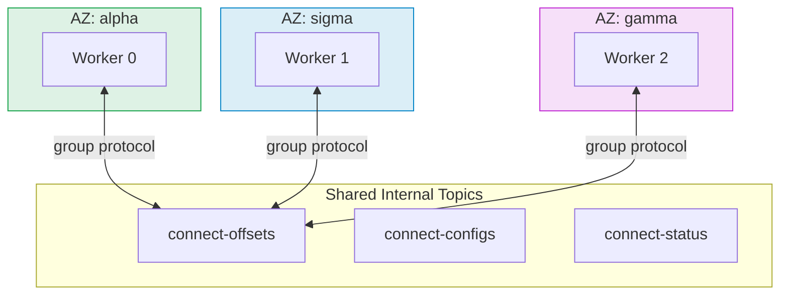
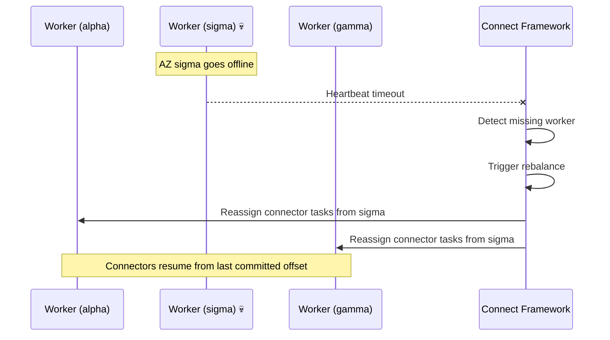
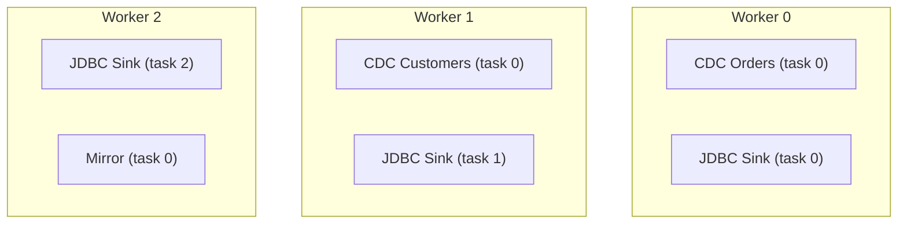
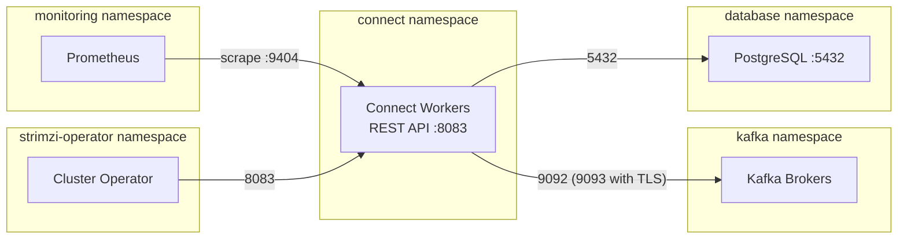
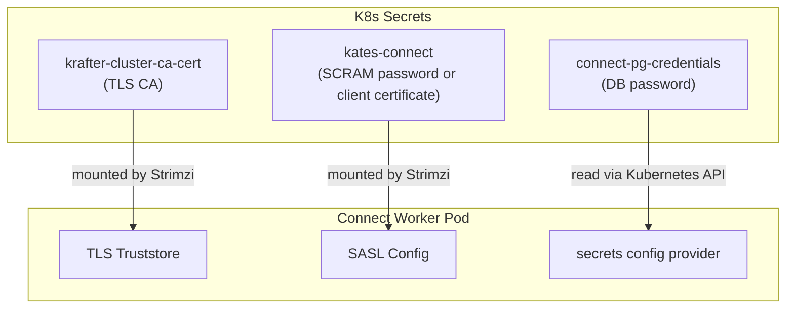

# Operating Kafka Connect

Building a Connect pipeline is half the job; keeping it healthy in production is the other half. This chapter collects the operational half: placement and scaling, tuning, network isolation, the REST API in anger, credential rotation, upgrades, disaster recovery, and troubleshooting.

> **Scope**: day-2 operations for the `connect-cluster` chart. For concepts, the `KafkaConnect` resource, Debezium, and pipeline design, see [Kafka Connect & CDC Pipelines](21-kafka-connect.md).

After this chapter, you can:

- Place and size Connect workers so an Availability Zone failure costs a short rebalance, not an outage
- Tune producer, consumer, and connector batching when throughput stalls
- Rotate database credentials and roll out image upgrades with zero downtime
- Trace a FAILED connector from alert to root cause with the CLI, the REST API, and worker logs

## Multi-AZ Deployment Strategy

The connect-cluster chart uses the **Stretched Cluster** strategy — a single `KafkaConnect` resource spanning all Availability Zones.



### How It Works

- **Single `groupId`:** All workers share `kates-connect-cluster` and one set of internal topics
- **Topology Spread Constraints:** Workers are evenly distributed across zones via `topologySpreadConstraints`
- **Pod Anti-Affinity:** No two workers on the same node

### AZ Failure Behavior

When an entire Availability Zone goes offline:



| Event | Behavior |
|-------|----------|
| Worker pod dies | Framework rebalances tasks to surviving workers (seconds) |
| Entire AZ offline | Framework reassigns all tasks from dead workers |
| AZ recovers | Workers rejoin, framework rebalances to restore even distribution |
| Offset continuity | ✅ Preserved — offsets stored in shared Kafka topic |

::: {.callout-note}
Cross-AZ data transfer costs apply when a connector in zone alpha reads from a database in zone sigma. This is an acceptable tradeoff for seamless failover — CDC downtime during a rebalance is typically under 30 seconds.
:::

### Scheduling Configuration

```yaml
# Production (values-prod.yaml)
topologySpreadConstraints:
  enabled: true
  maxSkew: 1
  topologyKey: topology.kubernetes.io/zone
  whenUnsatisfiable: DoNotSchedule

podAntiAffinity:
  enabled: true
  topologyKey: kubernetes.io/hostname

rack:
  enabled: true
  topologyKey: topology.kubernetes.io/zone
```

The base values use `whenUnsatisfiable: ScheduleAnyway`, so single-node clusters like Kind still schedule all workers; the dev overlay disables topology spread and anti-affinity entirely, while the prod overlay tightens spreading to `DoNotSchedule`.

## Capacity Planning

### Worker Sizing

Each Connect worker consumes memory proportional to the number of tasks it runs and the batch sizes configured:

```text
Worker Memory = JVM Heap + Off-Heap
             = (-Xmx) + (Direct Buffers + Thread Stacks + JMX + GC Overhead)
             ≈ -Xmx × 2
```

| Workload | Workers | Heap (-Xmx) | Container Memory | CPU |
|----------|:-------:|:-----------:|:----------------:|:---:|
| 1–3 connectors, low throughput | 1 | 512m | 1Gi | 500m |
| 5–10 connectors, moderate throughput | 2 | 1024m | 2Gi | 1000m |
| 10–20 connectors, high throughput | 3 | 2048m | 4Gi | 2000m |
| 20+ connectors, very high throughput | 5+ | 2048m | 6Gi | 4000m |

### Task Distribution

Connectors are divided into tasks, and tasks are distributed across workers:



**Rules of thumb:**
- Debezium source connectors: always `tasksMax: 1` (limited by replication slot)
- JDBC sink connectors: `tasksMax` = number of topic partitions (for parallelism)
- Mirror connectors: `tasksMax` = number of source partitions
- Target: 2–5 tasks per worker for optimal CPU utilization

### Throughput Benchmarks

Approximate throughput per worker (single connector, 1Gi heap, 1 CPU):

| Connector Type | Records/second | MB/second | Notes |
|---------------|:--------------:|:---------:|-------|
| Debezium PostgreSQL (streaming) | 5,000–15,000 | 2–10 | Depends on WAL volume |
| Debezium PostgreSQL (snapshot) | 20,000–50,000 | 10–30 | Bulk read, higher throughput |
| JDBC Source (poll) | 1,000–5,000 | 1–5 | Limited by SQL query speed |
| JDBC Sink | 5,000–20,000 | 2–15 | Batched inserts |
| MirrorSource | 50,000–100,000 | 20–50 | Mostly network-bound |

---

## Performance Tuning

### Producer Tuning

Connect's internal producer sends records to Kafka. These settings control batching and throughput:

| Setting | Default | Tuned | Effect |
|---------|---------|-------|--------|
| `producer.batch.size` | 16384 | 65536 | Larger batches = fewer requests, higher throughput |
| `producer.linger.ms` | 0 | 10 | Wait up to 10ms to fill batch |
| `producer.buffer.memory` | 33554432 | 67108864 | 64MB producer buffer |
| `producer.compression.type` | none | lz4 | Compress records — reduces network and storage |
| `producer.max.request.size` | 1048576 | 10485760 | 10MB max request — needed for large CDC events |

### Consumer Tuning (Sink Connectors)

| Setting | Default | Tuned | Effect |
|---------|---------|-------|--------|
| `consumer.fetch.min.bytes` | 1 | 65536 | Wait for 64KB before returning fetch |
| `consumer.max.poll.records` | 500 | 2000 | More records per poll = higher throughput |
| `consumer.auto.offset.reset` | `latest` | `earliest` | Chart default — don't miss records |

### Connector-Level Tuning

| Setting | Type | Default | Recommended | Notes |
|---------|------|---------|-------------|-------|
| `poll.interval.ms` | Debezium | 500 | 100–500 | Lower = less latency, more CPU |
| `max.batch.size` | Debezium | 2048 | 4096–8192 | Records per batch from the WAL |
| `max.queue.size` | Debezium | 8192 | 16384 | Internal queue between reader and producer |
| `snapshot.fetch.size` | Debezium | 2048 | 10000 | Rows per SELECT during snapshot |
| `batch.size` | JDBC Sink | 3000 | 5000–10000 | Rows per INSERT batch |

::: {.callout-tip}
Monitor `rate(kafka_connect_source_task_metrics_source_record_poll_total[5m])` and `rate(kafka_connect_source_task_metrics_source_record_write_total[5m])` in Grafana. If poll rate >> write rate, the producer is the bottleneck — increase `producer.batch.size` and enable compression.
:::

---

## Observability

### Prometheus Alerts

The chart's `alerts.yaml` renders a `PrometheusRule` where the `monitoring.coreos.com/v1` API exists. Every rule is scoped to the release's own workers and carries a `runbook_url` into [the Connect runbook](../connect-cluster-runbook.md), which says how to confirm and act on each alert. Thresholds are configurable under `alerts.thresholds`:

| Alert | Condition | Severity |
|-------|-----------|----------|
| `KafkaConnectWorkerDown` | Fewer workers scraped than the release runs, for 3min | critical |
| `KafkaConnectConnectorFailed` | A connector is FAILED for 2min | critical |
| `KafkaConnectTaskFailed` | A connector has FAILED tasks for 2min | critical |
| `KafkaConnectDeadLetterFailures` | A dead letter queue refuses records for 2min | critical |
| `KafkaConnectTaskAvailabilitySLOBurning` | Opt-in (`alerts.slo.enabled`): task availability burns its error budget (`alerts.slo.target`, `burnRate`) | critical |
| `KafkaConnectTasksNotRunning` | Tasks neither running nor paused for 5min | warning |
| `KafkaConnectErrorsLogged` | Record errors above `errorRatePerSecond` for 5min | warning |
| `KafkaConnectDeadLetterWrites` | Records are dead-lettered for 5min | warning |
| `KafkaConnectOffsetCommitFailures` | Offset commits fail for 10min | warning |
| `KafkaConnectSinkLag` | A declared sink connector's group lags beyond `sinkLagRecords` for 10min (reads Kafka Exporter's `kafka_consumergroup_lag`) | warning |
| `KafkaConnectSourceIdle` | Opt-in (`alerts.sourceIdle.enabled`): a running source polls 0 records for `sourceIdleMinutes` (default 15min) | warning |
| `KafkaConnectRebalanceStorm` | Completed-rebalance rate above `rebalanceRatePerSecond` for 5min | warning |
| `KafkaConnectRebalanceTooLong` | A rebalance has been in progress for 5min | warning |
| `KafkaConnectWorkerHeapHigh` | JVM heap usage above `heapUsagePercent` (default 85%) for 5min | warning |

The same rule also records `connect:tasks_running:ratio`, `connect:records_processed:rate5m` and `connect:errors:rate5m` (plus `connect:task_unavailability:ratio_avg*` with the SLO). The alerts read the JMX exporter's metric names, so the chart refuses `alerts.enabled` without metrics, and with `metrics.type: strimziMetricsReporter` unless `alerts.allowReporterMetrics` is set.

::: {.callout-important}
Chart 2.0 renamed three alerts, so Alertmanager routes and silences that match on names need updating: `KafkaConnectTaskCountMismatch` is now `KafkaConnectTasksNotRunning`, `KafkaConnectHighErrorRate` is `KafkaConnectErrorsLogged`, and `KafkaConnectSourceLag` is `KafkaConnectSourceIdle`, which is off by default.
:::

### Grafana Dashboard

The board is [`dashboards/kafka-connect/`](https://github.com/bmscomp/kates/tree/main/dashboards/kafka-connect), built from `board.py` by `scripts/gen-dashboards.py`. Since connect-cluster 2.1.0 it is delivered by `charts/monitoring` with every other board (`dashboards.enabled` there), as one file for every install — nothing is injected per release, and this chart's old `dashboards.*` values are refused with that location named.

Thirty-five panels: a stat row on top, then one row per concern, in the order an incident asks them.

| Row | Panels | Example metric |
|-----|--------|----------------|
| Top (stats) | Workers up, connectors, failed connectors, failed tasks, tasks running, record errors | `kafka_connect_connector_task_status{status="failed"}` |
| Connectors and tasks | Connector status, task status, tasks per worker, task running and paused ratio, sink partitions assigned | `kafka_connect_connector_metrics` |
| Throughput | Source records polled / written / in flight, sink records read / put, sink lag | `rate(kafka_connect_source_task_metrics_source_record_poll_total[5m])` |
| Errors and dead letter queue | Errors logged, record failures and skips, dead letter queue writes and failures | `rate(kafka_connect_task_error_metrics_total_errors_logged[5m])` |
| Offset commits | Commit time, commit failures, sink commit rate | `kafka_connect_connector_task_metrics_offset_commit_failure_percentage` |
| Workers | Rebalances, rebalance time, rebalance in progress, time since last rebalance, startup failures, heap used, heap used / max | `rate(kafka_connect_worker_rebalance_metrics_completed_rebalances_total[5m])` |
| Client path (collapsed) | The embedded producer and consumer: records sent, errors and retries, request latency, consumer lag | `kafka_producer_*`, `kafka_consumer_*` |

Four of those panels are new, and each closes a gap the rest of the board leaves open. **Task running and paused ratio** says how much of the window each task actually spent running — a task that keeps restarting reports RUNNING on every status panel. **Sink partitions assigned** should equal the partition count of the subscribed topics; less than that is a task holding nothing, which looks from every throughput panel like a quiet day. **Rebalance in progress** pinned at 1 is a group that cannot converge, and **time since last rebalance** resets to zero at each one, so its drops are the storm the rate panel only averages.

Every panel now carries a description saying what it shows, what it means when it moves, and where the number comes from. They had none before, and the layout gate in `ci-kafka-charts.yml` will not accept a panel without one.

The board is scoped by two template variables, `$namespace` and `$cluster`, rather than by a per-release pod regex. `strimzi_io_cluster` reaches the series through `kafka-common.strimziRelabelings` on the chart's PodMonitor and Strimzi sets it to the `KafkaConnect` CR name, which this chart sets to the release fullname — so one copy of the file serves every Connect group in a Grafana and the dropdown separates them.

The metrics come from the chart's exporter rules (`files/metrics/connect-metrics.yaml`, in the `<release>-metrics` ConfigMap under `metrics-config.yml`); `metrics.existingConfigMap` points the workers at rules of your own instead. `monitoring.podMonitor` renders the PodMonitor that scrapes them. `scripts/check-metric-contract.sh connect-cluster` runs those rules over a catalogue of MBeans and fails the build if any panel reads a series they cannot produce.

`dashboards/kafka-connect/README.md` documents the board section by section, including the three traps that make Connect metrics easy to misread: worker, connector and task are three different scopes and aggregate differently; sink record lag is the gap inside a task, not the backlog; and the `total-*` error series are typed GAUGE while being cumulative. `dashboards/METRICS.md` has a row for every series the board reads.

Upstream's `strimzi-kafka-connect.json` is not an alternative to this board. It reads 21 `kafka_*` names and exactly one of them is producible by this chart's exporter rules, because the chart's rules and Strimzi's example use different name templates.

### Helm Test

The chart includes Helm tests, run in order: a connectivity pod, then example `KafkaTopic` and `KafkaConnector` resources (defined under `testTopics` / `testConnectors` in values), then a pod that waits for those connectors. The example resources are created during `helm test` and deleted when the test succeeds:

```bash
# Run the CDC integration test via Kates CLI
kates kafka connect test

# Or run the Helm chart test directly
helm test connect-cluster --namespace connect --timeout 180s --logs
```

The `kates kafka connect test` command runs a full end-to-end CDC integration test against the backend, with a Bubble Tea progress UI showing each phase (DB setup → topic creation → source deploy → sink deploy → verification → cleanup).

The connectivity test pod (`test-01-connect.yaml`) checks the credentials Secret, the `KafkaConnect` `Ready` condition, and the running workers. It then calls the REST API on port 8083 from inside a worker, which the NetworkPolicy admits — the root endpoint, and `/connector-plugins` against `tests.expectedPlugins` plus each `plugins[].expect` — and finally checks each declared connector's state and tasks. The last pod (`test-03-test-connectors.yaml`) waits for every test connector to reach RUNNING with all its tasks running. The test topics are created in the Kafka namespace, and `values-prod.yaml` turns the test connectors off because they need the platform's demo PostgreSQL.

## Network Policies

The chart's `networkpolicy.yaml` ships a default-deny posture: a deny-all Ingress+Egress policy for the Connect pods (`networkPolicy.defaultDeny.enabled`, on by default) and one policy in which every allowed flow is an explicit, individually configurable rule:

| Flow | Setting |
|------|---------|
| Ingress: metrics scrape (9404) | `networkPolicy.monitoring` (namespace `monitoring`) |
| Ingress: REST API (8083) | `networkPolicy.restApi.clients` (default: the Kates backend), the Cluster Operator in `networkPolicy.strimziOperatorNamespace` (default `strimzi-operator`), and the other workers; `networkPolicy.restApi.allowAll` opens it to any source |
| Egress: DNS, Kubernetes API | `networkPolicy.dns`, `networkPolicy.apiServer` (the secrets config provider reads Secrets through the API) |
| Egress: Kafka | The Kafka namespace's `strimzi.io/cluster` pods, on the ports the bootstrap dials (9092, or 9093 with TLS); `networkPolicy.kafka.ports` fixes the list and refuses a bootstrap port outside it |
| Egress: Schema Registry, OTLP | `schemaRegistry.enabled` (the registry pods' `schemaRegistry.targetPort`, 8080, and the Service `port`), `tracing.endpoint` |
| Egress: databases | `networkPolicy.egress.databases` |
| Anything else | `networkPolicy.extraIngress`, `networkPolicy.extraEgress` |

For the default `kates deploy` layout — workers in `connect`, brokers in `kafka` — the flows look like this:



Database egress rules are dynamically generated from `values.yaml`:

```yaml
networkPolicy:
  egress:
    databases:
      - namespace: database
        port: 5432
        podSelector:
          app.kubernetes.io/name: postgresql
```

Each entry generates a `NetworkPolicy` egress rule allowing Connect workers to reach the specified pods in the specified namespace, and a matching ingress policy in the database namespace (`allow-<release>-ingress-<port>`) unless the entry sets `createIngressPolicy: false`. The 1.x `databaseEgress` key still works in 2.x and is listed as deprecated.

::: {.callout-warning}
Chart 1.x allowed Kafka egress on 9092 and 9093 whatever the bootstrap dialed, and looked for the Cluster Operator in the Kafka namespace. After an upgrade to 2.0, a bootstrap that reaches Kafka on another port needs `networkPolicy.kafka.ports`, and an operator outside `strimzi-operator` needs `networkPolicy.strimziOperatorNamespace` — otherwise the workers cannot reach the brokers, or the operator cannot manage the connectors. The `krafter` Kafka cluster admits Connect through its own `networkPolicy.clients`.
:::

## REST API & Connector Operations

The Kates CLI wraps the Connect REST API with ergonomic commands:

```bash
# List all connectors
kates kafka connect connectors

# Describe a connector (full YAML)
kates kafka connect connector debezium-postgres-source

# Show connector config only
kates kafka connect config debezium-postgres-source

# Show task-level status
kates kafka connect tasks debezium-postgres-source

# Pause / resume / restart
kates kafka connect pause debezium-postgres-source
kates kafka connect resume debezium-postgres-source
kates kafka connect restart debezium-postgres-source

# Restart a specific task
kates kafka connect restart-task debezium-postgres-source 0

# Scale workers
kates kafka connect scale 5

# Tail logs (with follow)
kates kafka connect logs -f

# JSON output for scripting
kates kafka connect connectors -o json | jq '.[].metadata.name'
```

### Direct REST API Access

The Connect REST API (port 8083) is also exposed via a `ClusterIP` Service (`<release>-rest-api`) for direct access:

```bash
# Port-forward for local access
kubectl port-forward -n connect svc/connect-cluster-rest-api 8083:8083

# List connectors via REST
curl -s http://localhost:8083/connectors | jq .

# Or call it from inside a worker, as the Helm test does
kubectl -n connect exec connect-cluster-connect-0 -- \
  curl -s 'http://localhost:8083/connectors?expand=status' | jq .
```

In-cluster clients reach the Service only if the NetworkPolicy admits them: add them to `networkPolicy.restApi.clients` (see [Network Policies](#network-policies)).

For external access, enable the Ingress, and admit the ingress controller's pods in `networkPolicy.restApi.clients`:

```yaml
restApi:
  ingress:
    enabled: true
    className: nginx
    hosts:
      - host: connect.example.com
        paths:
          - path: /
            pathType: Prefix
```

## Security & Credential Rotation

### Credential Architecture



The workers read `connect-pg-credentials` through the API only because the chart grants them `get` on it — it is referenced by the test connectors, and the kind and generic overlays list it in `rbac.secretNames`. When Kafka lives in another namespace, the chart's secret-sync Job copies `kates-connect` (for a chart-managed `KafkaUser`) and, with TLS, the cluster CA into the Connect namespace on every install and upgrade.

### Rotation Procedures

| Credential | Rotation Method | Downtime |
|-----------|----------------|:--------:|
| Kafka TLS CA | Strimzi auto-rotates 180 days before expiry; across namespaces, `secretSync.watch` re-copies it (otherwise the next `helm upgrade` does) | Zero — rolling restart |
| SCRAM password | Update `KafkaUser` CR → Strimzi updates Secret; across namespaces, `secretSync.watch` or the next `helm upgrade` re-copies it | Zero — rolling restart |
| Client certificate (`values-prod.yaml`) | The User Operator renews it; `secretSync.watch` (on in the prod overlay) re-copies it | Zero — rolling restart |
| Database password | Update K8s Secret → restart the connector | Seconds — connector restart only |
| Connect REST API (if exposed) | Ingress-level auth (OAuth2 proxy, mTLS) | N/A |

**Database credential rotation:**

```bash
# 1. Update the secret
kubectl create secret generic connect-pg-credentials \
  -n connect \
  --from-literal=username=debezium \
  --from-literal=password=NEW_PASSWORD \
  --dry-run=client -o yaml | kubectl apply -f -

# 2. Restart the connector — the secrets config provider re-reads
#    the Secret when the connector configuration is (re)applied
kates kafka connect restart debezium-postgres-source
```

::: {.callout-important}
Update the database password in PostgreSQL **before** updating the Kubernetes Secret. If you update the Secret first, Connect workers will restart and immediately fail authentication.
:::

---

## Upgrade Procedures

### Upgrading the Connect Image

When a new Debezium or Kafka version is released:

```bash
# 1. Bump ARG DEBEZIUM_VERSION in Dockerfile.connect (e.g. 3.7.0.Final),
#    then build and push — the image tag is derived from that ARG
make connect-build connect-push

# 2. Upgrade the release from the values it runs with. charts/connect-cluster/charts/
#    is generated and gitignored, so build the kafka-common library first.
helm dependency build charts/connect-cluster
helm get values connect-cluster -n connect -o yaml > connect-current.yaml
helm upgrade connect-cluster charts/connect-cluster \
  --namespace connect -f connect-current.yaml \
  --set image=ghcr.io/bmscomp/connect:3.7.0
```

`connect-current.yaml` holds everything the release was installed with — for a `kates deploy` install, the bootstrap address, the Kafka namespace, the schema registry URL, the database egress and the replica count all arrive as `--set` flags that no file records. `--reuse-values` keeps them too, but over the *old* chart's defaults, so a default the new chart changes never applies. `kates deploy --with-kafka-connect` is not an upgrade path: it skips a Connect release that is already deployed and has worker pods.

`make connect-push` publishes the Debezium-only tag (`connect:3.7.0`). The chart's own pin is the fully qualified `<debezium>-kafka-<kafka>` tag, and it lives in two places: `image` in `values.yaml` and the `kates.io/connect-image` annotation in `Chart.yaml`. `kates deploy` runs whatever `values.yaml` pins. A `v*` release tag runs `.github/workflows/publish-connect.yml`, which publishes the qualified tag and moves both pins together, and `scripts/check-versions.sh` fails when the pins disagree with each other, with `Dockerfile.connect`, or with the Kafka pin. `Chart.yaml` `appVersion` is the Kafka version the workers run (the `version` value), not the Debezium version. The chart refuses `:latest` and untagged images.

Strimzi performs a **rolling restart** — one worker at a time. Connectors are rebalanced to surviving workers during each restart, ensuring zero downtime.

### Upgrading the Chart from 1.x

Chart 2.0 reads 1.x values: each moved key is translated, and `helm upgrade` prints a `DEPRECATED` line in the release notes for each one still in use. Start from the values the 1.x release runs with, then check the render and the list before you upgrade:

```bash
helm dependency build charts/connect-cluster
helm get values connect-cluster -n connect -o yaml > connect-current.yaml
helm template connect-cluster charts/connect-cluster -n connect -f connect-current.yaml > /dev/null
helm upgrade connect-cluster charts/connect-cluster -n connect -f connect-current.yaml --dry-run | sed -n '/^NOTES/,$p'
helm upgrade connect-cluster charts/connect-cluster -n connect -f connect-current.yaml
```

The upgrade rolls the workers once (the metrics ConfigMap key is now `metrics-config.yml`). Afterwards, check that every connector still runs: one that fails with `Forbidden` reading a Secret needs that Secret in `rbac.secretNames`. The Kafka egress ports, the operator namespace and three alert names changed too — see [Network Policies](#network-policies), [Prometheus Alerts](#prometheus-alerts), and [the 2.0 upgrade guide](../connect-cluster-2.0-upgrade.md) for the key-by-key table.

### Upgrade Checklist

| Step | Action | Verify |
|:----:|--------|--------|
| 1 | Read Debezium migration guide | Breaking changes documented |
| 2 | Build new image on CI | `make connect-build` passes |
| 3 | Deploy to dev/staging | The `helm upgrade` above, from the release's current values; every worker rolls onto the new image |
| 4 | Run integration test | `kates kafka connect test` passes |
| 5 | Verify connector status | `kates kafka connect connectors` — all RUNNING, no DLQ growth |
| 6 | Deploy to production | The same `helm upgrade` on the production cluster, from its own current values |
| 7 | Monitor for 24h | No alerts, no lag increase |

### Rolling Back

```bash
# Rollback to previous Helm release
helm rollback connect-cluster -n connect

# Or pin to previous image
helm dependency build charts/connect-cluster
helm get values connect-cluster -n connect -o yaml > connect-current.yaml
helm upgrade connect-cluster charts/connect-cluster \
  --namespace connect -f connect-current.yaml \
  --set image=ghcr.io/bmscomp/connect:3.6.2-kafka-4.3.1
```

Rolling a 2.0 release back to a 1.3 revision restores the 1.x manifests: the workers roll back onto the `kafka-metrics-config.yml` key, and the 1.x namespace-wide Secret access returns.

::: {.callout-warning}
If the new Debezium version changed the internal offset format, rolling back may cause connectors to fail with deserialization errors. Always test in staging first.
:::

---

## Disaster Recovery

### Scenario: Internal Topics Deleted

If the `connect-offsets` topic is accidentally deleted:

1. All source connectors lose their position
2. On restart, they fall back to `snapshot.mode` behavior:
   - `initial` → full database snapshot (hours for large databases)
   - `schema_only` → only new changes (data gap)

**Recovery procedure:**

```bash
# 1. Scale down Connect workers
kates kafka connect scale 0

# 2. Scale back up — workers recreate internal topics on startup
kates kafka connect scale 3

# 3. Monitor snapshot progress
kates kafka connect logs -f
```

### Scenario: Connect Cluster Completely Lost

If the entire Connect deployment is destroyed:

```bash
# 1. Redeploy via Kates CLI
kates deploy --with-kafka-connect --ha

# 2. Connectors defined in values.yaml are automatically recreated
# 3. If offsets topic still exists in Kafka, connectors resume from last position
# 4. If offsets topic is also lost, connectors re-snapshot
```

::: {.callout-tip}
The internal topics (`*-offsets`, `*-configs`, `*-status`) are the only persistent state for the Connect cluster. As long as these topics survive in Kafka (with RF=3), the Connect cluster is fully rebuildable from the Helm chart alone.
:::

### Backup Strategy

The Connect cluster itself is stateless — all state lives in Kafka topics. Backup strategy:

| Component | Backup Method | RPO |
|-----------|-------------|:---:|
| Connector configs | Version-controlled in `values.yaml` | 0 |
| Connector offsets | Kafka topic with RF=3 | 0 (unless all brokers fail) |
| Database credentials | Kubernetes Secret backup (Velero) | Daily |
| Connect image | OCI registry + Dockerfile in Git | 0 |

---

## Troubleshooting

### Connector Stuck in FAILED State

**Symptom:** `KafkaConnector` status shows `FAILED` with `io.debezium.DebeziumException`

**Diagnosis:**

```bash
# Check connector status
kates kafka connect connectors
kates kafka connect connector debezium-postgres-source

# Check Connect worker logs
kates kafka connect logs
```

**Common causes:**

| Error | Cause | Fix |
|-------|-------|-----|
| `PSQLException: FATAL: password authentication failed` | Wrong credentials in secret | Update `connect-pg-credentials` secret |
| `replication slot "debezium_kates" is active` | Previous connector instance still holding the slot | Restart the connector or drop the slot manually |
| `could not access file "pgoutput"` | PostgreSQL `wal_level` is not `logical` | Set `wal_level = logical` in PostgreSQL config |
| `No matching table(s) in schema "public"` | `schema.include.list` doesn't match any tables | Verify the schema and table names exist |

### Rebalancing Takes Too Long

**Symptom:** Connect cluster stuck in `REBALANCING` state for minutes (the `KafkaConnectRebalanceTooLong` alert fires after 5 minutes)

**Cause:** A large number of connectors/tasks being reassigned, or workers repeatedly leaving and rejoining the group. (The chart also sets `group.initial.rebalance.delay.ms: 3000`, which adds a fixed 3-second wait before the *first* assignment when the group forms — that delay is intentional and not the problem here.)

**Fix:** If rebalancing takes more than 5 minutes, check for:
- Workers crashing during rebalance (check pod events)
- Network policies blocking inter-worker communication on port 8083
- Insufficient memory causing OOM kills during task assignment

### Connect Workers OOMKilled

**Symptom:** Pods restarting with `OOMKilled` exit reason

**Cause:** JVM heap (`-Xmx`) + off-heap memory exceeds the container memory limit

**Fix:** Ensure `resources.limits.memory` is at least 2× the `-Xmx` value to account for off-heap memory (direct buffers, thread stacks, JMX):

```yaml
jvmOptions:
  -Xmx: 1024m          # 1Gi heap
resources:
  limits:
    memory: 2Gi         # 2× heap = headroom for off-heap
```

### Replication Slot WAL Retention Growing

**Symptom:** PostgreSQL disk usage growing rapidly, `pg_replication_slots` shows large `wal_status`

**Cause:** The Debezium connector is down or paused, but the replication slot retains WAL segments

**Fix:**
1. Resume or restart the connector to drain the slot
2. If the connector is permanently removed, drop the slot:

```sql
SELECT pg_drop_replication_slot('debezium_kates');
```

3. Enable heartbeat to prevent WAL retention on idle tables:

```yaml
heartbeat.interval.ms: "10000"
```

### Connector Validation Blocks Deployment

**Symptom:** `helm upgrade` (or `helm template`) fails at once with `Error: execution error at (connect-cluster/templates/…): connect-cluster: …`

**Cause:** The chart checks connector configs and the rest of the values while it renders — a missing required key, a sink without `topics`, a `${secrets:…}` reference without a namespace, a plaintext password under `productionMode`, and so on. Nothing is applied. There is no validation hook Pod any more.

**Fix:** The message names the connector and the setting, for example:

```text
connect-cluster: connectors.orders-cdc (io.debezium.connector.postgresql.PostgresConnector) needs config.topic.prefix
```

Fix the connector configs in `values.yaml`, render them again (`helm dependency build charts/connect-cluster`, then `helm template connect-cluster charts/connect-cluster -n connect -f values.yaml > /dev/null`), and re-run `helm upgrade`. [Pre-Deploy Validation](21-kafka-connect.md#pre-deploy-validation) lists the checks.

### Connector Fails with `Forbidden` Reading a Secret

**Symptom:** A connector is `FAILED` and its trace reads `Forbidden` or `secrets "…" is forbidden`

**Cause:** The workers resolve `${secrets:<namespace>/<name>:<key>}` as the `<release>-connect` ServiceAccount, and the chart grants `get` only on the Secrets its own connector configs reference. A connector applied outside the chart — by hand, or by `kates deploy` — reads a Secret the chart doesn't know about.

**Fix:** List the Secret in `rbac.secretNames` (`name` for this namespace, `namespace/name` for another) and upgrade, then restart the connector. Check the grant:

```bash
kubectl auth can-i get secret/connect-pg-credentials -n connect \
  --as=system:serviceaccount:connect:connect-cluster-connect
```

For the symptom-by-symptom index across the whole book, see the [Troubleshooting Index](appendix-b-troubleshooting.md).

Component versions for the Connect stack are tracked centrally in the [Version & Compatibility Matrix](appendix-d-versions.md).

::: {.callout-tip}
**Try it**

Port-forward the Connect REST API and compare its view of connector state with the CLI's:

```bash
kubectl port-forward -n connect svc/connect-cluster-rest-api 8083:8083 &

# Worker version and the Kafka cluster it belongs to
curl -s http://localhost:8083/ | jq .

# Connector- and task-level state in one call
curl -s "http://localhost:8083/connectors?expand=status" | jq .

# The same connectors as the CLI sees them
kates kafka connect connectors
```

Every connector and task reports `RUNNING` in both views — the CLI reads the `KafkaConnector` CRs, whose status Strimzi reconciles from the same REST API you just curled.
:::

## Summary

- One stretched `KafkaConnect` cluster spans all Availability Zones; topology spread constraints and pod anti-affinity keep workers apart, and the group protocol reassigns tasks off a dead zone in seconds with offsets intact
- Give containers roughly 2× the JVM heap — off-heap memory is what gets workers OOMKilled — and target 2–5 tasks per worker
- The internal topics (`*-offsets`, `*-configs`, `*-status`) hold the only persistent state; as long as they survive in Kafka, the cluster is rebuildable from the Helm chart alone
- Rotate the database password in PostgreSQL first, then the Kubernetes Secret, then restart the connector — in the reverse order the connector restarts straight into failed authentication
- Upgrades roll one worker at a time with zero downtime, but a Debezium release that changes the offset format makes rollback unsafe — validate in staging with `kates kafka connect test`
- Most FAILED connectors trace back to credentials, an occupied replication slot, or `wal_level` — start with `kates kafka connect connectors` and the worker logs

Next, [Recipes & Patterns](14-recipes.md) combines individual commands like these into end-to-end procedures — upgrade validation, scheduled regression suites, and resilience certification.
