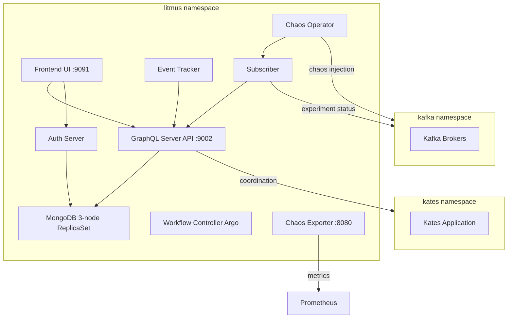

# Kates Chaos Engineering — Deployment Guide

Comprehensive guide for deploying the **kates-chaos** Helm chart on any Kubernetes cluster. This chart wraps [LitmusChaos 3.27.0](https://litmuschaos.io/) with Kafka-specific RBAC, experiment definitions, monitoring, and secrets management.

## Prerequisites

| Requirement | Minimum Version | Notes |
|-------------|----------------|-------|
| Kubernetes | 1.25+ | Any managed (EKS, GKE, AKS) or self-managed cluster |
| Helm | 3.12+ | Chart uses OCI and subchart dependencies |
| kubectl | 1.25+ | Must be configured for your target cluster |
| Storage class | Any | Dynamic provisioning for MongoDB PVCs |
| Kafka | Deployed | In the `kafka` namespace (configurable) |

### Namespace Requirements

The chart expects these namespaces to exist (or creates them):

- **`litmus`** — Created automatically by `--create-namespace`
- **`kafka`** — Must exist if RBAC is enabled (chaos target)
- **`kates`** — Must exist if RBAC is enabled (chaos coordinator)

## Architecture Overview



## Quick Start

### Step 1 — Add the Litmus Helm Repository

```bash
helm repo add litmuschaos https://litmuschaos.github.io/litmus-helm/
helm repo update
```

### Step 2 — Install CRDs

CRDs must be applied before Helm install (the chart's post-install hooks depend on them):

```bash
kubectl apply -f config/litmus/chaos-litmus-chaos-enable.yml
kubectl apply -f config/litmus/kafka-litmus-chaos-enable.yml
kubectl wait --for=condition=Established \
  crd/chaosengines.litmuschaos.io --timeout=60s
```

### Step 3 — Build Chart Dependencies

```bash
cd charts/kates-chaos
helm dependency build
cd ../..
```

This downloads `litmus-3.27.0.tgz` into `charts/kates-chaos/charts/`.

### Step 4 — Install the Chart

```bash
helm upgrade --install chaos charts/kates-chaos \
  -n litmus --create-namespace \
  -f charts/kates-chaos/values-generic.yaml \
  --timeout 10m --wait
```

Or use the Makefile shorthand:

```bash
make litmus-generic
```

### Step 5 — Verify Deployment

```bash
# Check pod status
kubectl get pods -n litmus

# Run Helm test suite (portal, frontend, MongoDB, CRDs)
helm test chaos -n litmus

# Or via Makefile
make litmus-test
```

Expected output — all pods `Running`:

```
NAME                                        READY   STATUS
chaos-litmus-auth-server-xxx                1/1     Running
chaos-litmus-frontend-xxx                   1/1     Running
chaos-litmus-server-xxx                     1/1     Running
chaos-mongodb-0                             1/1     Running
chaos-mongodb-1                             1/1     Running
chaos-mongodb-2                             1/1     Running
chaos-operator-ce-xxx                       1/1     Running
chaos-exporter-xxx                          1/1     Running
subscriber-xxx                              1/1     Running
workflow-controller-xxx                     1/1     Running
event-tracker-xxx                           1/1     Running
```

## Configuration Reference

### Secrets Management

The chart auto-generates credentials on first install and persists them in a Kubernetes Secret with `helm.sh/resource-policy: keep` (survives `helm upgrade`).

| Credential | Secret Key | Behavior |
|-----------|-----------|----------|
| Portal admin password | `admin-password` | Auto-generated if `auth.adminPassword` is empty |
| MongoDB root password | `db-root-password` | Auto-generated (16-char random) |
| JWT signing secret | `jwt-secret` | Auto-generated (32-char random) |

**Option A — Auto-generated (recommended for production)**

```yaml
auth:
  adminPassword: ""    # auto-generated
  dbRootPassword: ""   # auto-generated
  jwtSecret: ""        # auto-generated
```

**Option B — Explicit passwords**

```bash
helm upgrade --install chaos charts/kates-chaos \
  -n litmus --create-namespace \
  -f charts/kates-chaos/values-generic.yaml \
  --set auth.adminPassword=MySecureP@ss \
  --set auth.dbRootPassword=MongoR00t! \
  --timeout 10m --wait
```

**Option C — External Secrets Operator**

```yaml
auth:
  existingSecret: my-external-secret
```

The existing Secret must have keys: `admin-password`, `db-root-password`, `jwt-secret`.

**Retrieve auto-generated credentials:**

```bash
kubectl get secret chaos-auth -n litmus -o jsonpath='{.data.admin-password}' | base64 -d
kubectl get secret chaos-auth -n litmus -o jsonpath='{.data.db-root-password}' | base64 -d
```

### MongoDB Configuration

The generic overlay deploys a 3-node MongoDB ReplicaSet with arbiter:

```yaml
litmus:
  mongodb:
    architecture: replicaset
    replicaCount: 3
    arbiter:
      enabled: true
    auth:
      enabled: true
    persistence:
      enabled: true
      size: 10Gi
      storageClass: ""   # uses cluster default
    resources:
      requests:
        cpu: 500m
        memory: 1Gi
      limits:
        cpu: 2
        memory: 2Gi
```

> **Storage Class**: Set `storageClass` to your cluster's provisioner (e.g., `gp3`, `standard-rwo`, `longhorn`). Leave empty (`""`) to use the cluster default.

### RBAC (Cross-Namespace Chaos)

The chart creates RBAC resources allowing the chaos operator to inject faults into target namespaces:

```yaml
rbac:
  enabled: true
  kafkaNamespace: kafka    # where Kafka brokers run
  katesNamespace: kates    # where Kates application runs
```

This creates:
- `ClusterRole` + `ClusterRoleBinding` for `litmus-admin` → `kafka` namespace
- `Role` + `RoleBinding` for chaos coordinator → `kates` namespace

### Network Policies

Enabled by default in the generic overlay. Controls traffic to/from the litmus namespace:

```yaml
networkPolicies:
  enabled: true
```

**Allowed traffic:**
- Litmus ↔ Litmus (inter-component communication)
- Litmus → Kafka namespace (chaos injection)
- Litmus → Kates namespace (chaos coordination)
- Litmus → kube-system (DNS resolution, TCP/UDP port 53)

**All other ingress/egress is denied.**

### PodDisruptionBudgets

Protects MongoDB from accidental disruptions:

```yaml
pdb:
  enabled: true      # default in generic overlay
```

Creates a PDB with `minAvailable: 1` for MongoDB.

### Monitoring

#### Prometheus ServiceMonitor

```yaml
monitoring:
  serviceMonitor:
    enabled: true
    interval: 15s
    labels:
      release: monitoring   # match your Prometheus operator selector
```

#### Grafana Dashboard

Auto-discovered via the `grafana_dashboard: "1"` label:

```yaml
monitoring:
  grafanaDashboard:
    enabled: true
    labels:
      grafana_dashboard: "1"
```

Dashboard panels:
- Experiment pass/fail counts
- Engine duration time series
- Experiment run count over time
- Chaos infrastructure pod status table
- MongoDB health indicator

### ChaosExperiment Definitions

7 experiments are installed via a post-install/post-upgrade Job:

| Experiment | Scope | Description |
|-----------|-------|-------------|
| `pod-delete` | Namespaced | Kill a random pod |
| `pod-cpu-hog` | Namespaced | CPU stress on target pod |
| `pod-memory-hog` | Namespaced | Memory stress on target pod |
| `pod-network-partition` | Namespaced | Network isolation |
| `pod-io-stress` | Namespaced | Disk I/O stress |
| `pod-dns-error` | Namespaced | DNS resolution failure |
| `node-drain` | Cluster | Drain a Kubernetes node |

Verify experiments are installed:

```bash
kubectl get chaosexperiments -n kafka
```

### ChaosEngine Automation

Create `ChaosEngine` resources declaratively via values:

```yaml
engines:
  kafkaPodDelete:
    enabled: true
    appNamespace: kafka
    appLabel: "strimzi.io/cluster=krafter"
    appKind: statefulset
    experiment: pod-delete
    duration: 30
    interval: 10
    force: false
    env:
      PODS_AFFECTED_PERC: "50"
```

This creates a `ChaosEngine` resource that runs the `pod-delete` experiment against the Kafka StatefulSet.

### GameDay Validation

Trigger a 6-point infrastructure validation:

```bash
# Via Makefile
make litmus-gameday

# Via Helm
helm upgrade chaos charts/kates-chaos \
  -n litmus \
  -f charts/kates-chaos/values-generic.yaml \
  --set gameday.enabled=true \
  --timeout 5m --wait
```

Checks performed:
1. CRDs installed
2. Chaos operator running
3. MongoDB responsive
4. Experiments installed in kafka namespace
5. Subscriber connected
6. Kafka namespace accessible

## Accessing the Portal

### ClusterIP (generic default)

```bash
kubectl port-forward svc/chaos-litmus-frontend-service 9091:9091 -n litmus
```

Then open http://localhost:9091

### Ingress (production)

Create an Ingress via Helm values:

```yaml
litmus:
  ingress:
    enabled: true
    ingressClassName: nginx
    host:
      name: chaos.example.com
```

## Uninstalling

```bash
# Full teardown (Helm release + PVCs + namespace)
make litmus-undeploy

# Or manually
helm uninstall chaos -n litmus
kubectl delete pvc --all -n litmus
kubectl delete all --all -n litmus
kubectl delete namespace litmus
```

## Troubleshooting

### MongoDB pods stuck in `Pending`

**Cause**: No StorageClass available or PVC cannot bind.

```bash
kubectl describe pvc -n litmus
```

**Fix**: Set `litmus.mongodb.persistence.storageClass` to a valid provisioner name.

### Auth-server/server stuck in `Init:0/1`

**Cause**: Init container `wait-for-mongodb` cannot connect. MongoDB must be a StatefulSet (not Deployment).

**Fix**: Ensure `litmus.mongodb.architecture: replicaset` (not `standalone`). The init container connects via StatefulSet DNS (`chaos-mongodb-0.chaos-mongodb-headless`).

### ImagePullBackOff on MongoDB

**Cause**: The upstream Litmus chart defaults to a deprecated `bitnamilegacy/mongodb` image.

**Fix**: Already handled by the chart — overrides to `bitnami/mongodb:7.0.28`. If issues persist, verify image availability:

```bash
docker pull bitnami/mongodb:7.0.28
```

### Subscriber CrashLoopBackOff

**Cause**: Transient — subscriber starts before the Litmus server is fully ready.

**Fix**: Generally self-resolving within 2-3 restart cycles. If persistent, check server logs:

```bash
kubectl logs -n litmus -l app.kubernetes.io/component=litmus-server
```

### Experiments not appearing in kafka namespace

**Cause**: Post-install Job failed or RBAC insufficient.

```bash
# Check the installer job
kubectl get jobs -n litmus | grep experiment
kubectl logs job/chaos-experiments -n litmus
```

## Chart Files Reference

```
charts/kates-chaos/
├── Chart.yaml                              # v1.0.0, depends on litmus 3.27.0
├── values.yaml                             # Base defaults
├── values-kind.yaml                        # Kind cluster overlay (dev)
├── values-generic.yaml                     # Generic Kubernetes overlay (prod)
├── values.schema.json                      # Helm install-time validation
├── .helmignore
└── templates/
    ├── _helpers.tpl                        # Template helpers
    ├── NOTES.txt                           # Post-install instructions
    ├── secrets.yaml                        # Auto-generated auth secrets
    ├── chaos-rbac.yaml                     # Cross-namespace RBAC
    ├── experiments.yaml                    # Post-install ChaosExperiment Job
    ├── chaosengines.yaml                   # Templated ChaosEngine resources
    ├── servicemonitor.yaml                 # Prometheus integration
    ├── grafana-dashboard.yaml              # Grafana dashboard ConfigMap
    ├── pdb.yaml                            # MongoDB PodDisruptionBudget
    ├── networkpolicy.yaml                  # Namespace isolation
    ├── gameday.yaml                        # Infrastructure validation Job
    └── tests/
        └── test-connectivity.yaml          # 4-tier Helm test suite
```

## Makefile Targets

| Target | Description |
|--------|-------------|
| `make litmus` | Deploy with Kind overlay (development) |
| `make litmus-generic` | Deploy with generic Kubernetes overlay (production) |
| `make litmus-undeploy` | Full teardown (release + PVCs + namespace) |
| `make litmus-test` | Run Helm test suite |
| `make litmus-gameday` | Trigger GameDay infrastructure validation |
| `make chaos-ui` | Port-forward Litmus UI to localhost:9091 |
| `make chaos-status` | Show release, pods, experiments, engines, results |
