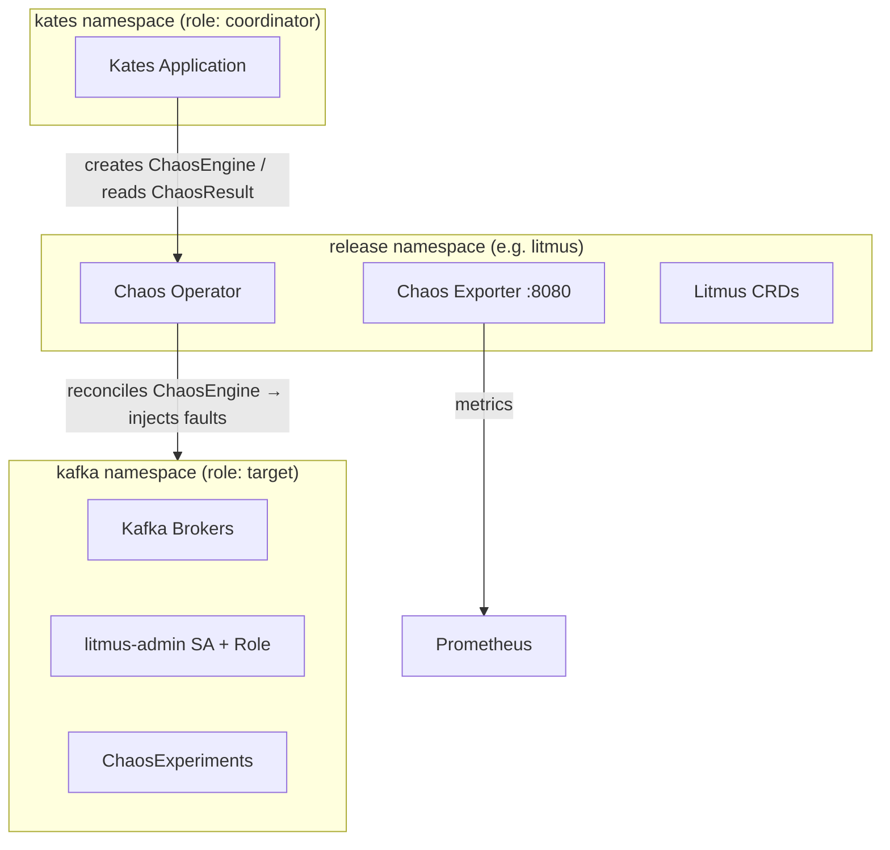

# Kates Chaos Chart — Deployment Guide

> **This document covers the `kates-chaos` Helm chart deployment and configuration.** For a condensed values reference, examples, and upgrade notes, see the [chart README](../charts/kates-chaos/README.md). For chaos engineering theory and methodology, see [Chaos Engineering Theory](book/06-chaos-theory.md) and [Chaos Engineering in Practice](book/07-chaos-practice.md).

Guide for deploying the **kates-chaos** Helm chart on any Kubernetes cluster. This chart wraps the [LitmusChaos](https://litmuschaos.io/) **execution plane** with Kafka/Kates-specific RBAC, ChaosExperiment/ChaosEngine templating, monitoring, network isolation, and admission policy.

> **Scope — execution plane only.** This chart deploys the LitmusChaos chaos **operator**, the chaos **exporter**, and the **CRDs** (via the `litmus-core` subchart). It does **not** deploy the ChaosCenter web portal (frontend / GraphQL server / auth-server / MongoDB). Drive chaos declaratively through the `engines:` values or by applying `ChaosEngine` resources. If you want the UI, install ChaosCenter separately.

## Prerequisites

| Requirement | Minimum Version | Notes |
|-------------|----------------|-------|
| Kubernetes | 1.25+ | Any managed (EKS, GKE, AKS) or self-managed cluster |
| Helm | 3.12+ | Chart uses a subchart dependency (`litmus-core`) |
| kubectl | 1.25+ | Must be configured for your target cluster |
| Kafka | Deployed | In the `kafka` namespace (configurable via `rbac.targetNamespaces`) |

### Namespace Requirements

- **release namespace** (e.g. `litmus`) — where the operator/exporter run; created by `--create-namespace`
- **target namespaces** — every entry in `rbac.targetNamespaces` must exist. `role: target` namespaces receive the chaos ServiceAccount + Role (fault injection); `role: coordinator` namespaces get a ClusterRole binding to create engines and read results.

## Architecture Overview



## Quick Start

### Step 1 — Add the Litmus Helm Repository

```bash
helm repo add litmuschaos https://litmuschaos.github.io/litmus-helm/
helm repo update
```

### Step 2 — Install CRDs

CRDs must be applied before Helm install (the post-install hooks depend on them):

```bash
kubectl apply -f config/litmus/chaos-litmus-chaos-enable.yml
kubectl apply -f config/litmus/kafka-litmus-chaos-enable.yml
kubectl wait --for=condition=Established \
  crd/chaosengines.litmuschaos.io --timeout=60s
```

### Step 3 — Build Chart Dependencies

```bash
cd charts/kates-chaos
helm dependency build
cd ../..
```

This downloads `litmus-core-3.28.1.tgz` into `charts/kates-chaos/charts/`.

### Step 4 — Install the Chart

```bash
helm upgrade --install chaos charts/kates-chaos \
  -n litmus --create-namespace \
  -f charts/kates-chaos/values-generic.yaml \
  --timeout 10m --wait
```

Or use the Makefile shorthand (`make litmus-generic` — note it installs into the `kafka` namespace).

### Step 5 — Verify Deployment

```bash
kubectl rollout status deployment -l app.kubernetes.io/name=litmus -n litmus
helm test chaos -n litmus
```

Expected pods — operator + exporter only:

```
NAME                          READY   STATUS
chaos-operator-ce-xxx         1/1     Running
chaos-exporter-xxx            1/1     Running
```

## Configuration Reference

### Images

All chart-managed images resolve from a single `images` block, with an optional global registry prefix and digest pinning:

```yaml
global:
  imageRegistry: ""          # prefix applied to every chart-managed image
  imagePullPolicy: IfNotPresent
  imagePullSecrets: []
images:
  kubectl:                   # installer Job, GameDay, Helm tests
    repository: registry.k8s.io/kubectl
    tag: "v1.33.0"
    digest: ""               # takes precedence over tag when set
  goRunner:                  # default runtime for ChaosExperiment definitions
    repository: litmuschaos/go-runner
    tag: "3.28.0"
```

The `litmus-core` subchart images (operator/runner) are configured under the `litmus-core:` key.

### Service Account

```yaml
serviceAccount:
  name: litmus-admin         # created in each target namespace; used by ChaosEngines
```

### RBAC (cross-namespace chaos)

```yaml
rbac:
  enabled: true
  targetNamespaces:
    - name: kafka
      role: target           # litmus-admin SA + Role + RoleBinding (fault injection)
    - name: kates
      role: coordinator      # ClusterRole binding: create engines, read results
  nodeChaos:
    enabled: true            # cluster-scoped RBAC for node-drain and node-level faults
```

Each `coordinator` entry may set `serviceAccount:` (defaults to `default`) to bind a specific SA.

> **Deprecated:** `rbac.kafkaNamespace` / `rbac.katesNamespace` still work and win over `targetNamespaces` when set, but `targetNamespaces` is preferred and supports any number of namespaces.

### ChaosExperiment Definitions

Installed via a post-install/post-upgrade Job. Definitions carry optional default `env` and `permissions` (mapped to `spec.definition`):

```yaml
experiments:
  enabled: true
  installer:                 # the kubectl Job that applies the definitions
    backoffLimit: 3
    ttlSecondsAfterFinished: 300
    resources: {}
    securityContext: {}
    nodeSelector: {}
    tolerations: []
  targetNamespaces: []       # empty = every role:target namespace
  definitions:
    - name: pod-delete
      scope: Namespaced
      env:                   # baked into the ChaosExperiment as defaults
        PODS_AFFECTED_PERC: "50"
      permissions: []        # extra RBAC the runner needs (spec.definition.permissions)
```

Default set: `pod-delete`, `pod-cpu-hog`, `pod-memory-hog`, `pod-network-partition`, `pod-io-stress`, `pod-dns-error` (Namespaced) and `node-drain` (Cluster).

Verify: `kubectl get chaosexperiments -n kafka`

### ChaosEngine Automation

Each `engines:` entry renders a `ChaosEngine`. Probes and pod `components` are first-class:

```yaml
engines:
  kafka-leader-kill:
    enabled: true
    appNamespace: kafka                 # defaults to the primary target namespace
    appLabel: "strimzi.io/kind=Kafka"
    appKind: statefulset
    experiment: pod-delete
    serviceAccount: ""                  # defaults to serviceAccount.name
    engineState: active                 # active | stop
    annotationCheck: false
    jobCleanUpPolicy: retain            # delete | retain
    duration: 60                        # TOTAL_CHAOS_DURATION
    interval: 60                        # CHAOS_INTERVAL
    force: true                         # FORCE=true
    targetPods: "krafter-pool-alpha-0"  # TARGET_PODS
    podsAffectedPerc: "100"             # PODS_AFFECTED_PERC
    env:                                # any additional experiment env
      APP_NS: kafka
    components:
      nodeSelector: {}
      resources: {}
      tolerations: []
    probes:                             # passed through verbatim to spec…probe
      - name: verify-isr-failover
        type: cmdProbe
        mode: PostChaos
        runProperties: { probeTimeout: "120s", interval: "10s", retry: 6 }
        cmdProbe/inputs:
          command: "kubectl exec -n kafka krafter-pool-alpha-1 -- kafka-topics.sh --bootstrap-server localhost:9092 --list"
          comparator: { type: string, criteria: contains, value: "orders" }
    labels: {}
    annotations: {}
```

This model expresses the scenarios in `config/litmus/experiments/` (leader-kill, network-latency, ISR-health probe, multi-broker-kill) directly as values.

### Network Policy

Scopes what the chaos-infra pods in the release namespace may talk to. Egress **must** include the Kubernetes API server (the operator needs it) and DNS:

```yaml
networkPolicy:
  enabled: true
  apiServer:
    enabled: true
    ports: [443, 6443]
    ipBlock: {}              # e.g. {cidr: 10.0.0.1/32} to pin the control plane
  dns:
    enabled: true
    ports: [53]
  monitoring:
    enabled: true            # ingress for Prometheus to scrape the exporter
    namespace: monitoring
    port: 8080
  targets:
    enabled: true            # egress to every rbac.targetNamespaces entry
  extraIngress: []           # raw rules appended verbatim
  extraEgress: []
```

> **Deprecated:** `networkPolicies.enabled` is honored as an alias — the policy renders if **either** key is true.

### Monitoring

```yaml
monitoring:
  serviceMonitor:
    enabled: false           # litmus-core ships its own exporter ServiceMonitor;
                             # enable this only if you scrape via THIS chart
    selector: { app: litmus }  # must match the exporter Service
    port: http
    path: /metrics
    interval: 15s
    scrapeTimeout: ""
    honorLabels: false
    relabelings: []
    metricRelabelings: []
    labels: { release: monitoring }
  grafanaDashboard:
    enabled: true
    namespace: ""            # namespace used in dashboard PromQL (default: release ns)
    folder: ""               # grafana_folder annotation
    labels: { grafana_dashboard: "1" }
```

Dashboard panels: experiment pass/fail counts, engine duration, run-count over time, chaos-infra pod status, chaos operator up.

### Kyverno Pod Security Policies

```yaml
kyvernoPolicy:
  enabled: false
  action: Audit              # Audit | Enforce
  mutate: true               # auto-inject restricted security contexts on admission
  namespaces: []             # empty = release namespace only
  excludeSelector:           # pods skipped from validate/mutate (need privileges)
    matchExpressions:
      - key: chaosUID
        operator: Exists
```

Only rendered when the cluster has the `kyverno.io/v1` API.

### PodDisruptionBudget

Off by default — the chart ships no stateful workload to protect. To guard a workload you run in the release namespace, enable it and **provide a selector** (required):

```yaml
pdb:
  enabled: true
  minAvailable: 1            # or set maxUnavailable
  selector:
    app.kubernetes.io/name: my-workload
```

### GameDay Validation

A Job of read-only checks. Checks are data-driven; leave `checks` empty for the operator-only default set, or override:

```yaml
gameday:
  enabled: true
  checks:
    - name: CRDs installed
      command: "kubectl get crd chaosengines.litmuschaos.io"
    - name: Custom broker check
      command: "kubectl get pods -n kafka -l strimzi.io/kind=Kafka | grep Running"
```

```bash
# Enable on an existing release
helm upgrade chaos charts/kates-chaos -n litmus --reuse-values --set gameday.enabled=true
```

## Uninstalling

```bash
helm uninstall chaos -n litmus
kubectl delete namespace litmus
```

## Troubleshooting

### Experiments not appearing in the target namespace

**Cause**: post-install Job failed or the CRDs weren't established first.

```bash
kubectl get jobs -n litmus | grep experiments
kubectl logs job/chaos-kates-chaos-experiments -n litmus
```

### Operator not reconciling ChaosEngines

**Cause**: with `networkPolicy.enabled=true` and a strict CNI, the operator may be unable to reach the Kubernetes API server.

**Fix**: ensure `networkPolicy.apiServer.enabled=true` (default) and, on locked-down clusters, set `networkPolicy.apiServer.ipBlock.cidr` to the control-plane CIDR.

### `helm test` fails on the operator check

**Cause**: the operator Deployment is not `Available` yet.

```bash
kubectl rollout status deployment -l app.kubernetes.io/name=litmus -n litmus
kubectl get pods -n litmus -l app.kubernetes.io/name=litmus
```

## Chart Files Reference

```
charts/kates-chaos/
├── Chart.yaml                              # v2.0.0, depends on litmus-core 3.28.1
├── README.md                               # Chart reference (values tables, examples, upgrade notes)
├── values.yaml                             # Base defaults
├── values-kind.yaml                        # Kind cluster overlay (dev)
├── values-generic.yaml                     # Generic Kubernetes overlay (prod)
├── values.schema.json                      # Helm install-time validation
├── .helmignore
└── templates/
    ├── _helpers.tpl                        # Image/label/namespace helpers
    ├── NOTES.txt                           # Post-install instructions
    ├── chaos-rbac.yaml                     # Cross-namespace RBAC (per target namespace)
    ├── experiments.yaml                    # Post-install ChaosExperiment installer Job
    ├── chaosengines.yaml                   # Templated ChaosEngine resources (probes/components)
    ├── servicemonitor.yaml                 # Prometheus integration
    ├── grafana-dashboard.yaml              # Grafana dashboard ConfigMap
    ├── kyverno-policies.yaml               # Pod security ClusterPolicy
    ├── networkpolicy.yaml                  # Chaos-infra network isolation
    ├── pdb.yaml                            # Optional PodDisruptionBudget
    ├── gameday.yaml                        # Data-driven validation Job
    └── tests/
        └── test-connectivity.yaml          # Helm test suite (operator + CRDs)
```

## Makefile Targets

| Target | Description |
|--------|-------------|
| `make litmus` | Deploy with Kind overlay (development) |
| `make litmus-generic` | Deploy with generic Kubernetes overlay (production) |
| `make litmus-undeploy` | Full teardown (release + namespace) |
| `make litmus-test` | Run Helm test suite |
| `make litmus-gameday` | Trigger GameDay validation |
| `make chaos-status` | Show release, pods, experiments, engines, results |

## See Also

- [Chaos Engineering Theory](book/06-chaos-theory.md)
- [Chaos Engineering in Practice](book/07-chaos-practice.md)
- [Tutorial 3: Chaos Engineering](tutorials/03-chaos-engineering.md)
