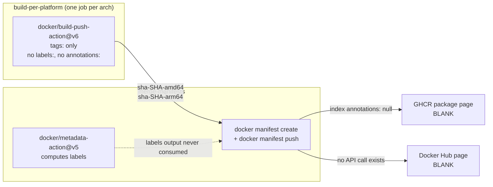
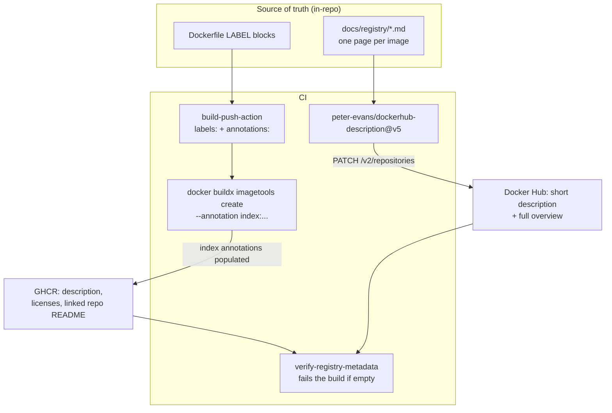

# Registry Publication Plan

**Making `kates`, `connect` and `kates-tester` describe themselves on GHCR and Docker Hub.**

Status: **Phases 1–3 implemented on this branch**; Phase 4 proposed ·
Branch: `docs/registry-publication` · Owner: @bmscomp

> **Blocked on one secret.** Phase 3 needs `DOCKERHUB_DESCRIPTION_TOKEN` — a Docker
> Hub PAT with `read/write/delete` scope, separate from the existing
> `DOCKERHUB_TOKEN` push credential. See [§7](#7-auth-and-secrets).

---

## 1. Summary

All six registry pages for our three images are blank:

| Image | GHCR page | Docker Hub page |
|---|---|---|
| `kates` (+`-native`) | no description | no description, no overview |
| `connect` | no description | no description, no overview |
| `kates-tester` | no description | no description, no overview |

The intuitive diagnosis — "we forgot the labels" — is wrong. `connect` has a
complete, well-written `LABEL` block in `Dockerfile.connect`, and `kates-tester`
publishes correct OCI labels through `docker/metadata-action`. Both pages are
still blank.

There are **three independent root causes**, and only one of them is about labels:

1. **GHCR reads the description from *index annotations*, not from labels.** Our
   multi-arch indexes carry `"annotations": null`. Labels live in the per-platform
   image *config*; an image index has no labels, only annotations. There is no
   propagation between the two.
2. **`docker manifest create` cannot write annotations at all.** Two of our three
   publish workflows merge with it, so the index is created annotation-free by
   construction. The third builds multi-platform in one step but never passes
   `annotations:`.
3. **Docker Hub has no label mechanism whatsoever.** Descriptions there are set
   only through the Hub API or UI. Nothing in CI calls it.

The plan below fixes each cause at its own layer, adds the per-image content the
pages need, and — critically — adds a CI gate, because every failure mode here is
silent. Nothing errors today when a description is missing.

---

## 2. Evidence

Live registry reads (2026-09-11) and the workflow files as they stand on `main`.

### 2.1 What is actually published

| Artifact | Index annotations | Per-platform config labels |
|---|---|---|
| `ghcr.io/bmscomp/kates:latest` | `null` | **inherited from the base image only** — `title=ubuntu`, `description=The Ubuntu container image maintained by Canonical…`. No `source`, no `licenses`. |
| `ghcr.io/bmscomp/connect:latest` | — | tag absent (`MANIFEST_UNKNOWN`); only `sha-*`, short-sha and `3.0.2`-style tags exist |
| `ghcr.io/bmscomp/kates-tester:latest` | `null` | correct: `source`, `description`, `licenses=Apache-2.0`, `title`, `url`, `revision`, `version`, `created` |

Docker Hub, via `GET https://hub.docker.com/v2/repositories/<repo>`:

| Repo | `description` | `full_description` | `categories` |
|---|---|---|---|
| `bmscomp/kates` | `""` | `""` | `[]` |
| `bmscomp/connect` | `""` | `""` | `[]` |
| `bmscomp/kates-tester` | `""` | `""` | `[]` |

`kates-tester` is the clean experiment: **correct labels, empty index
annotations, blank page.** That is the whole thesis in one row.

### 2.2 Where the metadata is lost



Three concrete defects visible in `publish-docker.yml`:

- **L125–138** — the per-platform build passes `tags:` but neither `labels:` nor
  `annotations:`. `kates/Dockerfile` and `kates/Dockerfile.native` have no `LABEL`
  instruction either. This is why the published `kates` image advertises itself as
  Ubuntu: every label it carries is inherited from `eclipse-temurin` → `ubuntu`.
- **L171–190** — `docker/metadata-action` computes a hand-written `labels:` block
  in the *merge* job, where no step consumes its output. Dead code that reads like
  working code, which is why this went unnoticed.
- **L230–231** — `docker manifest create` / `docker manifest push`. This command
  has no annotation support: its only flags are `--amend` and `--insecure`, and
  `docker manifest annotate` sets only `--arch`, `--os`, `--os-features`,
  `--os-version`, `--variant`.

`publish-connect.yml` has the same shape (merge at L216). Its Dockerfile labels
*are* correct and *do* reach the per-platform configs — they just cannot reach the
index.

`publish-tester.yml` is different: one multi-platform `build-push-action@v6` with
`labels:` at L74 and no `annotations:`. Nothing to un-break in the merge, only an
input to add.

---

## 3. What each registry can actually render

This asymmetry drives the whole content model, so it is worth stating precisely.

### 3.1 GHCR

GitHub documents **exactly three** OCI keys and where each surfaces:

| Key | Renders as | Limit |
|---|---|---|
| `org.opencontainers.image.source` | links the package to a repository | must be `https://github.com/OWNER/REPO` |
| `org.opencontainers.image.description` | text under the package name | 512 characters |
| `org.opencontainers.image.licenses` | SPDX id in the Details sidebar | 256 characters |

The **README shown on a package page is the linked repository's README** — there
is no per-package README on GHCR, and no API to set a package description. The
Packages REST API is list/get/delete/restore only; the GraphQL `Package` type has
no `description` field. The label/annotation at push time is the only lever.

For multi-arch images GitHub is explicit that the description comes from the
index: their own example uses
`outputs: type=image,name=target,annotation-index.org.opencontainers.image.description=…`.

**Consequence:** on GHCR all three images will share one README (the repo's), and
the only per-image differentiation available is the 512-character description.

### 3.2 Docker Hub

| Field | Set by | Limit |
|---|---|---|
| short description | API `description` / UI | 100 (docs say characters; the sync action truncates at 100 **bytes**) |
| overview / README | API `full_description` / UI | 25,000 |
| categories | Hub UI only, curated list, max 3 | — |

No OCI label or annotation feeds any of these. The documented automation path is
the API:

```
POST  https://hub.docker.com/v2/auth/token        {"identifier": …, "secret": …}
PATCH https://hub.docker.com/v2/repositories/{ns}/{name}
      Authorization: Bearer <jwt>
      {"description": "...", "full_description": "..."}
```

**Consequence:** Docker Hub is where per-image content investment actually pays
off — 25,000 characters, per image, fully under our control.

---

## 4. Target state



Acceptance is mechanical: `imagetools inspect --raw` shows a non-empty
`org.opencontainers.image.description` on the index, and the Hub API returns a
non-empty `full_description`, for all three repositories on both registries.

---

## 5. Content model

### 5.1 New files

```
docs/registry/
  kates.md          # Hub overview for bmscomp/kates (jvm + -native variants)
  connect.md        # Hub overview for bmscomp/connect
  kates-tester.md   # Hub overview for bmscomp/kates-tester
  _shared-footer.md # links, licence, support — appended by hand to each
```

These are **image** READMEs, not the project README. The repo's `README.md`
(15.7 KB) opens with `make all` and a kind cluster — correct for a contributor,
wrong for someone who has just typed `docker pull`. An image page needs, in this
order:

1. One sentence: what this image *is*.
2. `docker run` that works, copy-pasteable.
3. Tags and variants (for `kates`: `1.22.0` vs `1.22.0-native`, and what the
   trade-off is — startup time vs memory vs build reproducibility).
4. Ports, volumes, environment variables.
5. What it is *not*. This matters most for `kates-tester`, whose name invites
   exactly the wrong guess: it is **not** a load generator and runs no tests of
   its own. It is the toolbox the charts mount into test hooks and CRD hook Jobs
   (`testImages.kubectl` / `testImages.kafka` in `charts/*/values.yaml`) —
   kubectl, the Apache Kafka CLI scripts, kcat, jq, netcat and dig on
   debian-slim, with `CMD ["bash"]`. An earlier draft of this plan described it
   as a workload runner; that was wrong, and it is the reason this section
   exists. Likewise `connect` is a Strimzi-based Connect image, not vanilla
   Connect, and the `kates` image bundles the Go CLI alongside the backend.
6. Links back to the docs book and the Helm charts.

`enable-url-completion: true` on the sync action rewrites relative links to
absolute GitHub URLs, so these files can link to the repo naturally. Note its
documented limitations: it also rewrites links inside code blocks, and skips
reference-style links.

### 5.2 Descriptions (the 512- and 100-char levers)

Proposed strings, ASCII-only to keep the byte count equal to the character count:

| Image | short description (Hub, <=100 bytes) |
|---|---|
| `kates` | `Kubernetes-native performance, chaos and resilience testing for Apache Kafka clusters` (84) |
| `connect` | `Kafka Connect: Debezium CDC, Apicurio Registry, Aiven JDBC & S3, on Strimzi Kafka 4.3` (85) |
| `kates-tester` | `kubectl + Apache Kafka CLI toolbox behind the Kates Helm chart test hooks` (73) |

The GHCR description (512 chars) can be the fuller sentence — one or two lines,
still no Markdown, since GitHub renders it as text only.

> **Byte trap.** The Hub docs say 100 *characters*; `peter-evans/dockerhub-description`
> truncates at 100 *bytes* and only warns in the run log. An em dash costs 3 bytes.
> Gate it in CI: `[ "$(printf %s "$SHORT" | wc -c)" -le 100 ]`.

---

## 6. Implementation

Four phases, each independently shippable and independently revertable.

### Phase 1 — Dockerfile labels (baseline, registry-agnostic)

Add a `LABEL` block to `kates/Dockerfile`, `kates/Dockerfile.native` and
`tester/Dockerfile`, modelled on the existing one in `Dockerfile.connect`
(L105–114), which is already correct and needs no change.

This is worth doing even though GHCR ignores per-platform labels for multi-arch
images: it makes `docker inspect` truthful, it is what most scanners and SBOM
tools read, and it stops `kates` from claiming to be Ubuntu.

```dockerfile
LABEL org.opencontainers.image.title="kates" \
      org.opencontainers.image.description="Kafka Advanced Testing & Engineering Suite" \
      org.opencontainers.image.source="https://github.com/bmscomp/kates" \
      org.opencontainers.image.url="https://github.com/bmscomp/kates" \
      org.opencontainers.image.documentation="https://github.com/bmscomp/kates/blob/main/docs/registry/kates.md" \
      org.opencontainers.image.vendor="bmscomp" \
      org.opencontainers.image.licenses="Apache-2.0"
```

`version` / `revision` / `created` stay out of the Dockerfile — they are build
inputs, and baking them in busts the layer cache on every commit. CI supplies
them.

### Phase 2 — Index annotations (fixes GHCR)

**2a. `publish-tester.yml`** — the easy one. Two additions to the existing job:

```yaml
      - name: Compute Docker metadata
        id: docker-meta
        uses: docker/metadata-action@v5
        env:
          DOCKER_METADATA_ANNOTATIONS_LEVELS: index,manifest
        with:
          images: |
            ${{ env.DOCKERHUB_REPO }}
            ${{ env.GHCR_REPO }}
          tags: |
            type=semver,pattern={{version}}
            type=sha,prefix=sha-,format=short
            type=raw,value=latest,enable=${{ github.ref == 'refs/heads/main' }}
          labels: |
            org.opencontainers.image.title=kates-tester
            org.opencontainers.image.description=Toolbox image for the Kates Helm charts — chart test hooks, CRD hook Jobs and in-cluster diagnostics. Ships kubectl, the Apache Kafka CLI scripts, kcat, jq, netcat and dig.
            org.opencontainers.image.licenses=Apache-2.0
            org.opencontainers.image.vendor=bmscomp

      - name: Build and push
        uses: docker/build-push-action@v6
        with:
          # ... unchanged ...
          labels: ${{ steps.docker-meta.outputs.labels }}
          annotations: ${{ steps.docker-meta.outputs.annotations }}
```

`docker/metadata-action` generates `labels` and `annotations` from the *same*
key set; the only difference is that annotations are prefixed with a level.
`DOCKER_METADATA_ANNOTATIONS_LEVELS` (default `manifest`) is what promotes them
to the index. Valid levels are `manifest`, `index`, `manifest-descriptor`,
`index-descriptor` — the action does no validation, so a typo silently produces a
useless prefix. Docker's caveat applies: asking for `index` when the build
produces no index fails the build. Here it does produce one (two platforms).

Default keys emitted: `title`, `description`, `url`, `source`, `version`,
`created`, `revision`, `licenses` — the first two taken from the *GitHub repo*
name and description, which is why an explicit `labels:` block is still needed to
say `kates-tester` rather than `kates`. `vendor` is not in the default set.

**2b. `publish-docker.yml` and `publish-connect.yml`** — the load-bearing change.
Replace `docker manifest create` with `docker buildx imagetools create`, which
supports `index:` and `manifest-descriptor:` annotation prefixes.

```yaml
      - name: Set up Docker Buildx
        uses: docker/setup-buildx-action@v3

      - name: Create and push multi-arch manifests
        env:
          VERSION: ${{ needs.meta.outputs.version }}
          DESCRIPTION: >-
            Kafka Advanced Testing & Engineering Suite: load, soak, chaos and
            data-integrity testing for Apache Kafka on Kubernetes.
        run: |
          set -euo pipefail
          ANNOTATIONS=(
            --annotation "index:org.opencontainers.image.title=kates"
            --annotation "index:org.opencontainers.image.description=${DESCRIPTION}"
            --annotation "index:org.opencontainers.image.source=https://github.com/bmscomp/kates"
            --annotation "index:org.opencontainers.image.url=https://github.com/bmscomp/kates"
            --annotation "index:org.opencontainers.image.licenses=Apache-2.0"
            --annotation "index:org.opencontainers.image.vendor=bmscomp"
            --annotation "index:org.opencontainers.image.version=${VERSION}"
            --annotation "index:org.opencontainers.image.revision=${GITHUB_SHA}"
          )

          # ... existing SOURCES / TAGS loop, unchanged ...
                docker buildx imagetools create "${ANNOTATIONS[@]}" \
                  -t "${TAG}" ${SOURCES}
```

Notes on this swap:

- `docker manifest create TAG SRC...` becomes
  `docker buildx imagetools create -t TAG SRC...`. `imagetools create` pushes as
  part of the same command, so the separate `docker manifest push` line goes away.
- The merge jobs currently have **no** `setup-buildx-action` step (only the build
  jobs do). `docker buildx` is preinstalled on `ubuntu-latest`, but adding the
  action pins the version and makes the dependency explicit. Do not skip it.
- The `-native` variant needs its own title/description — it is a distinct tag on
  the same repository, so on GHCR whichever variant is pushed last wins the page
  description. Keep the two descriptions consistent rather than variant-specific,
  and mention the variant split in the README instead.
- `imagetools create` refuses `manifest:` prefixes; only `index:` and
  `manifest-descriptor:` are accepted.

**2c. Delete the dead metadata block** in `publish-docker.yml` L171–190, or wire
its `annotations` output into the command above. Leaving a computed-and-unused
`labels:` block is what disguised this bug for so long.

### Phase 3 — Docker Hub description sync

A single new workflow owns all three Hub pages. Deliberately **decoupled from
releases**: fixing a typo in an overview should not require cutting a tag.

```yaml
name: Sync Registry Descriptions

on:
  push:
    branches: [main]
    paths:
      - 'docs/registry/*.md'
      - '.github/workflows/sync-registry-descriptions.yml'
  workflow_dispatch:

permissions:
  contents: read

jobs:
  dockerhub:
    name: Sync ${{ matrix.repo }}
    runs-on: ubuntu-latest
    strategy:
      fail-fast: false
      matrix:
        include:
          - repo: bmscomp/kates
            readme: ./docs/registry/kates.md
            short: "Kafka Advanced Testing & Engineering Suite: load, soak and chaos testing on Kubernetes"
          - repo: bmscomp/connect
            readme: ./docs/registry/connect.md
            short: "Kafka Connect: Debezium CDC, Apicurio Registry, Aiven JDBC & S3, on Strimzi Kafka 4.3"
          - repo: bmscomp/kates-tester
            readme: ./docs/registry/kates-tester.md
            short: "Test workload runner for Kates: producers, consumers and integrity checks"
    steps:
      - uses: actions/checkout@v4

      - name: Check short description length
        run: |
          n=$(printf %s "${{ matrix.short }}" | wc -c)
          echo "short description: ${n} bytes"
          [ "$n" -le 100 ] || { echo "::error::exceeds Docker Hub's 100-byte limit"; exit 1; }

      - name: Sync description
        uses: peter-evans/dockerhub-description@v5
        with:
          username: ${{ secrets.DOCKERHUB_USERNAME }}
          password: ${{ secrets.DOCKERHUB_DESCRIPTION_TOKEN }}
          repository: ${{ matrix.repo }}
          short-description: ${{ matrix.short }}
          readme-filepath: ${{ matrix.readme }}
          enable-url-completion: true
```

`fail-fast: false` so one bad README does not hide the other two.

### Phase 4 — Verification gate

Everything above fails silently. Add a job that asserts the outcome, run after
publish and on a weekly schedule (registry state can be changed outside CI, e.g.
by editing in the Hub UI):

```bash
#!/usr/bin/env bash
# scripts/check-registry-metadata.sh
set -euo pipefail
fail=0

for img in ghcr.io/bmscomp/kates ghcr.io/bmscomp/connect ghcr.io/bmscomp/kates-tester; do
  desc=$(docker buildx imagetools inspect --raw "${img}:latest" \
         | jq -r '.annotations["org.opencontainers.image.description"] // ""')
  if [ -z "$desc" ]; then
    echo "::error::${img}: index has no org.opencontainers.image.description"
    fail=1
  else
    echo "ok  ${img}: ${desc:0:60}..."
  fi
done

for repo in bmscomp/kates bmscomp/connect bmscomp/kates-tester; do
  json=$(curl -fsS "https://hub.docker.com/v2/repositories/${repo}")
  short=$(jq -r '.description // ""' <<<"$json")
  full=$(jq -r '.full_description // ""'  <<<"$json")
  [ -n "$short" ] || { echo "::error::${repo}: empty short description"; fail=1; }
  [ -n "$full"  ] || { echo "::error::${repo}: empty overview";          fail=1; }
done

exit "$fail"
```

The Hub read is public and unauthenticated, so this job needs no secrets.

---

## 7. Auth and secrets

**This is the most likely thing to block the rollout.**

`secrets.DOCKERHUB_TOKEN` already exists and works for `docker login`. That
proves it has push scope — it does **not** prove it can update a description.
`peter-evans/dockerhub-description` documents its `password` input as requiring
`read/write/delete` scope, and for org-owned repositories the user must have
Admin on the repository.

Actions required:

1. Mint a **new** Docker Hub PAT with `read/write/delete` scope.
2. Store it as `DOCKERHUB_DESCRIPTION_TOKEN` — separate from `DOCKERHUB_TOKEN`.
   Do not widen the push token's scope: the push token is used on every build,
   including on PR-triggered paths, and a delete-capable token should have the
   narrowest possible blast radius.
3. Leave `DOCKERHUB_USERNAME` as-is; the same identity works for both.

Two constraints worth recording:

- **A PAT is sufficient; a password is not required.** The token endpoint's
  `secret` field explicitly accepts "a password, personal access token, or
  organization access token", and Docker's own CI guide passes
  `secrets.DOCKERHUB_TOKEN` to this action. If SSO is ever enforced on the
  account, a PAT becomes *mandatory*.
- **An Organization Access Token will not work.** OATs authenticate only against
  the namespace-scoped `/v2/namespaces/{ns}/repositories/` routes and are rejected
  with `403 token issued from organization access token is not allowed` on the
  legacy `/v2/repositories/{ns}/{repo}` path that the description update uses.
  `bmscomp` is a personal namespace, so a PAT is the right and only choice today —
  but this blocks any future move to an org account without rework.

---

## 8. Risks

| # | Risk | Likelihood | Mitigation |
|---|---|---|---|
| 1 | **The Hub description endpoint is undocumented.** `PATCH /v2/repositories/{ns}/{name}` does not appear in Docker's published OpenAPI spec, and the whole legacy `/v2/repositories/` path family is being retired (`GET` on it was deprecated 2025-09-19). | Medium | Pin `peter-evans/dockerhub-description` by commit SHA, not tag. Phase 4's gate turns a silent break into a failing weekly job. Fallback is the Hub UI — 3 pages, ~10 minutes. |
| 2 | GHCR silently truncates or rejects over-limit descriptions (512) / licences (256) — behaviour undocumented. | Low | Keep descriptions under 400 chars; assert length in the gate. |
| 3 | `imagetools create` behaves differently from `manifest create` for cross-registry sources. | Low | Both take pushed refs; the existing loop already builds per-registry source lists. Validate on a `workflow_dispatch` run before tagging a release. |
| 4 | The `-native` variant overwrites the `kates` page description on GHCR. | Certain, by design | Use one description covering both variants; explain the split in the README. |
| 5 | `enable-url-completion` mangles links inside fenced code blocks. | Medium | Use absolute URLs inside code blocks in `docs/registry/*.md`. |
| 6 | Description drift between the Dockerfile `LABEL`, the workflow annotation, and the Hub short description — three copies of one string. | High over time | Phase 4 gate compares them; longer term, generate all three from a single `docs/registry/images.yml`. Out of scope for this plan. |

---

## 9. Open questions

Flagged rather than guessed:

- Does GHCR fall back to per-platform config labels when an index has no
  annotations? The `kates-tester` evidence (correct labels, blank page) says no,
  but GitHub does not document a fallback either way. Phase 2a settles it
  empirically.
- Does GHCR read `source` and `licenses` at the **index** level for multi-arch
  images? GitHub's multi-arch section discusses only `description`. Phase 2b sets
  all three at index level regardless; the gate will show which took effect.
- `ghcr.io/bmscomp/connect:latest` does not exist, while `kates:latest` and
  `kates-tester:latest` do. **Cause unknown.** The obvious suspect — the
  `paths: [Dockerfile.connect]` filter on the tag trigger — is ruled out:
  `publish-connect.yml` has 13 runs and succeeded on `v1.21.0`, `v1.20.0` and
  `v1.19.0`, the last three releases. Both workflows use the identical
  `type=raw,value=latest,enable={{is_default_branch}}` tag rule, yet only one
  produced a `latest`. Worth an hour of log-reading before Phase 3 — syncing a
  description for an image whose `latest` is missing is a poor first impression.
  **Not fixed by this plan.**

---

## 10. Acceptance criteria

- [ ] `docker buildx imagetools inspect --raw :latest | jq .annotations` returns a
      non-empty `org.opencontainers.image.description` for all three GHCR images.
- [ ] All three GHCR package pages show the repository README (i.e. the package is
      linked to `bmscomp/kates`) and a per-image description line.
- [ ] `GET hub.docker.com/v2/repositories/<repo>` returns non-empty `description`
      and `full_description` for all three Hub repositories.
- [ ] `docker inspect` on each image reports our own `title`/`vendor`, not Ubuntu's.
- [ ] `scripts/check-registry-metadata.sh` exits 0 in CI and is wired into a
      weekly schedule.
- [ ] Editing `docs/registry/kates.md` on `main` updates the Hub page without a
      release tag.

---

## 11. Sequencing

**Phases 1–3 are implemented on this branch:**

- Dockerfile `LABEL` blocks on all three images, with `documentation` pointing
  at each image's own page.
- `docker manifest create` → `docker buildx imagetools create --annotation`,
  with `DOCKER_METADATA_ANNOTATIONS_LEVELS: index`. GHCR descriptions should
  appear on the next release.
- `docs/registry/{kates,connect,kates-tester}.md` — the long-form pages, every
  link verified against files that exist on `main`.
- `.github/workflows/sync-registry-descriptions.yml` — Hub sync, pinned by
  commit SHA, with pre-flight size gates and a public read-back that fails the
  job if the page is still empty afterwards.

What remains:

1. **Add `DOCKERHUB_DESCRIPTION_TOKEN`** (repo secret). Nothing in Phase 3 runs
   until this exists — see [§7](#7-auth-and-secrets). This is the only step that
   needs a human.
2. **Validate Phase 2 with a `workflow_dispatch` run** before the next release
   tag, and confirm with `docker buildx imagetools inspect --raw` that the index
   carries annotations. `imagetools` could not be exercised offline: its
   behaviour here is documented, not yet observed in this repo.
3. **Phase 4** — the standing verification gate, once there is something for it
   to assert. The read-back step already in the sync workflow is a subset of it.

---

## 12. References

- GHCR labels and multi-arch descriptions — <https://docs.github.com/en/packages/working-with-a-github-packages-registry/working-with-the-container-registry#labelling-container-images>
- Connecting a repository to a package — <https://docs.github.com/en/packages/learn-github-packages/connecting-a-repository-to-a-package>
- OCI image index (annotations) — <https://github.com/opencontainers/image-spec/blob/main/image-index.md>
- OCI image config (labels) — <https://github.com/opencontainers/image-spec/blob/main/config.md>
- `docker buildx imagetools create --annotation` — <https://docs.docker.com/reference/cli/docker/buildx/imagetools/create/#annotation>
- Annotation levels — <https://docs.docker.com/build/metadata/annotations/#specify-annotation-level>
- Annotations in GitHub Actions — <https://docs.docker.com/build/ci/github-actions/annotations/>
- `docker/metadata-action` annotations — <https://github.com/docker/metadata-action#annotations>
- Docker Hub repository information — <https://docs.docker.com/docker-hub/repos/manage/information/>
- Docker Hub API auth — <https://docs.docker.com/reference/api/hub/latest/#tag/authentication-api/operation/AuthCreateAccessToken>
- Docker Hub API deprecations — <https://docs.docker.com/reference/api/hub/deprecated/>
- `peter-evans/dockerhub-description` — <https://github.com/peter-evans/dockerhub-description>
- Docker's own guide to this problem — <https://docs.docker.com/build/ci/github-actions/update-dockerhub-desc/>
