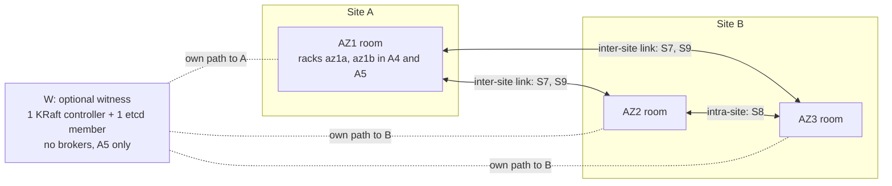

# Topology and Constraints

This page fixes the vocabulary the rest of the set uses — failure domains, scenario IDs, notation — and the hard limits every design has to live with: the majority arithmetic of KRaft and etcd, what an acknowledged Kafka write actually guarantees, the timers that turn a failure into a failover, and what Strimzi, Kafka and Kubernetes do and do not support. [Candidate Architectures](02-architectures.md) applies all of it to eight concrete layouts.

The analysis is checked against Kafka 4.3.1, Strimzi 1.2.0 and Kubernetes 1.34. Kubernetes 1.34 reaches end of life on 2026-10-27 ([release schedule](https://kubernetes.io/releases/)), so build production on 1.35 or later. The repository's exact version pins are in the [Version & Compatibility Matrix](../book/appendix-d-versions.md).

> [!IMPORTANT]
> Three results drive everything else in this set:
>
> 1. No placement of KRaft controllers or etcd members confined to two sites survives the loss of either site. Only a voter at a third location changes that.
> 2. No combination of replication factor, `min.insync.replicas` and replica placement gives both "writes continue automatically" and "no acknowledged record is lost" for both sites.
> 3. Apache Kafka 4.3.1 has no supported way to recover a KRaft quorum that has lost its majority. Permanently losing the site that holds the majority means losing the Kafka cluster.

## What Upstream Supports

- **Apache Kafka** recommends one local cluster per datacenter with mirroring between them, and advises against one cluster spanning datacenters over a high-latency link ([datacenters.md](https://github.com/apache/kafka/blob/4.3.1/docs/operations/datacenters.md#L29-L39)). Its design document says Kafka stays available through node failures after a short failover, but may not through network partitions ([design.md L311](https://github.com/apache/kafka/blob/4.3.1/docs/design/design.md#L311)). The 4.x datacenters page has a sentence claiming availability in all locations during a network split; it is an editing error left over from the ZooKeeper removal, and the [3.9 wording](https://github.com/apache/kafka/blob/3.9.0/docs/ops.html#L511) says the opposite.
- **Strimzi** supports a single Kubernetes cluster and has no stretch-cluster feature: proposals [#129](https://github.com/strimzi/proposals/pull/129) and [#187](https://github.com/strimzi/proposals/pull/187) were closed unmerged. A maintainer put the two-zone case plainly: "You cannot have fully automatic availability and reliability with 2 zones only" ([discussion #11012](https://github.com/orgs/strimzi/discussions/11012)). The Strimzi documentation describes rack awareness as meant for one location, not for spanning regions ([deploying guide](https://strimzi.io/docs/operators/1.2.0/deploying.html)).
- **Confluent's guidance**, whose arithmetic applies to Apache Kafka too: stretch only over stable links under 100 ms and across three or more fully operational datacenters, and get RPO 0 only with `min.insync.replicas` greater than the replicas held in any one datacenter ([multi-region architectures](https://docs.confluent.io/platform/current/multi-dc-deployments/multi-region-architectures.html)).
- **OKD** recommends three sites for a spanned control plane, and says a spanned cluster is one failure domain, not a disaster-recovery plan ([OKD span guidance](https://docs.okd.io/latest/etcd/etcd-guidance-span.html)).

Two sites with three rooms meet none of these preconditions in full. The rest of this page quantifies what that costs.

## Sites, Rooms and Failure Domains

| Term | Definition |
|---|---|
| Site A | One physical site with a single room, **AZ1**. Losing AZ1 and losing site A are the same event. |
| Site B | One physical site with two rooms, **AZ2** and **AZ3**, each its own AZ. Losing site B loses two of the three AZs. |
| Room (= AZ) | Power, cooling and network that fail independently of the other rooms. Identified by the node label `topology.kubernetes.io/zone`. |
| W (witness) | An optional third location that fails independently of both sites. It holds only voters and **never brokers**. A5, the only design that uses it, puts exactly one KRaft controller and one etcd member there. |
| az1a, az1b | Two independent power and top-of-rack groups inside the AZ1 room. Kafka racks in A4 and A5 only. |
| Inter-site link | The network between site A and site B. Its RTT, jitter, loss and bandwidth are what S9 varies. |
| Preferred site | The site that holds the voter majority, for KRaft and for etcd. Without W, losing it is fatal. |

The domains nest as host ⊂ room ⊂ site. Three more domains sit outside that nesting: the inter-site link, W, and the Kubernetes control plane (etcd), which S10 covers.



### Node and Pod Labels

Node labels define the domains; nothing in Kubernetes knows about sites.

- `topology.kubernetes.io/zone=az1|az2|az3|w` on every node. Only cloud providers set it automatically. On-premises you set it by hand, and Kubernetes assumes it never changes during a node's lifetime ([well-known labels](https://kubernetes.io/docs/reference/labels-annotations-taints/#topologykubernetesiozone)).
- `example.com/site=a|b|w`, a custom label, because Kubernetes has no notion of a site (`example.com/` is a placeholder prefix).
- A4 and A5 only: `example.com/fault-domain=az1a|az1b|az2|az3|w`, used as the chart's `nodePools.defaults.scheduling.zoneKey` so that a pool can pin to a sub-rack of AZ1.
- W nodes carry the taint `example.com/witness=true:NoSchedule`, so nothing but the witness controller and etcd member lands there.

On pods, `charts/kafka-cluster` renders a `zone=<pool zone>` label, together with a required node affinity on `zoneKey`, only for pools that set `zone:` ([nodepools.yaml](../../charts/kafka-cluster/templates/nodepools.yaml)). A `site=a|b|w` pod label goes into each pool's raw `template` (`template.pod.metadata.labels`), which the chart deep-merges last. The pools in `values-prod.yaml` set no `zone:`, so they are neither pinned nor labelled. [Node Pools and Pinning](03-kubernetes-and-strimzi.md#node-pools-and-pinning) in Platform Design on the Stretched Cluster has the pinning rules, and [How the Values Sketches Are Written](02-architectures.md#how-the-values-sketches-are-written) in Candidate Architectures the pool layouts.

> [!WARNING]
> `kates detect --generate-values` writes one single-replica controller pool per detected zone ([valuesgen.go](../../cli/pkg/detect/valuesgen.go)). With three zones that is `C 1/1/1`. If W's nodes also carry `topology.kubernetes.io/zone=w`, it writes four controllers — an even count. Write `nodePools.pools` by hand for every layout in this set.

## Scenario IDs

Every matrix and test in this set uses these IDs verbatim.

| ID | Scenario | Domain lost |
|---|---|---|
| S1 | Single broker pod or node loss | One host |
| S2 | Single controller loss, including the active controller | One voter |
| S3 | AZ1 loss | AZ1 = the whole of site A |
| S4 | AZ2 room loss | One room of site B |
| S5 | AZ3 room loss | One room of site B |
| S6 | Site B loss (AZ2 and AZ3 together) | Two of three AZs |
| S7 | Inter-site partition A ∣ B, both sides alive and isolated from each other | None; the link |
| S8 | Intra-site partition AZ2 ∣ AZ3, with site A reaching both | None; the room-to-room link |
| S9 | WAN degradation between the sites: RTT raised (for example 2 → 20 → 50 ms), 1–5% packet loss, a bandwidth cap | None; link quality |
| S10 | Kubernetes control plane (etcd) quorum loss while the Kafka nodes stay up | The Kubernetes API |
| S11 | Witness location loss (only designs with a witness) | W |
| S12 | Planned maintenance: drain a whole AZ | One room, planned |

## Notation

### Layout Symbols

| Notation | Meaning |
|---|---|
| `C 1/1/1` | KRaft controllers (voters) in AZ1/AZ2/AZ3 |
| `+1W` | Plus one voter at W, as in `C 2/1/1+1W` |
| `E 1/2/2` | etcd members in AZ1/AZ2/AZ3; `+1W` works the same way |
| `B 3/3/3` | Brokers per AZ. `B 3+3/3/3` means az1a+az1b/az2/az3. |
| `R 1/1/1` | Replicas of one partition per AZ, each on its own rack (`broker.rack`). In A4 and A5, `R 2/1/1` puts one replica on each of az1a and az1b. `r_X` is the number of replicas inside domain X. |
| RF, m | Replication factor, and `min.insync.replicas` |
| N, q, mK | N voters; q = ⌊N/2⌋+1, the majority; mK = margin K, meaning K more voters can be lost and the quorum still holds |
| P, D | P = aggregate produce rate (bytes/s); D = logical data size |
| t_f, t_c, t_fc, t_r, t_lag, t_g, t_node, t_sd, t_dr | Timers, defined under [Timers](#timers) |
| E_X | Exposure of domain X, defined below |

### Exposure E_X

**E_X is the number of partitions, internal topics included, whose ISR ∪ ELR lies entirely inside domain X.** The ELR (see [Eligible Leader Replicas](#eligible-leader-replicas)) is empty whenever the ISR is at or above m, so for healthy partitions the test is simply "ISR inside X". Counting the ELR as well keeps under-min-ISR partitions out: their former ISR members outside X still hold every committed record, so they expose nothing.

- X depends on the design: sites A and B for A1–A5 and A7; rooms AZ2 and AZ3 for A6's site-B cluster and A8's main cluster, where every replica sits in site B. Clusters confined to one room (A6's site-A cluster, the AZ1 standbys of A7 and A8) are exposed to that room by construction; their protection is the MM2 copy.
- E_X must be 0 in steady state. Alert when it stays above 0 for 60 s.
- An E_X > 0 at the moment X fails turns those partitions offline, and possibly lossy (see [RPO Symbols](#rpo-symbols)).
- Neither Kafka nor Kates computes it. Compute it from the DescribeTopicPartitions API (which returns the ISR and the ELR), each broker's `broker.rack`, and a rack-to-domain map: [Site Exposure E_X](03-kubernetes-and-strimzi.md#site-exposure-e_x) in Platform Design on the Stretched Cluster has a script and an alert rule.

### Matrix Legend

- **Quorum.** `KRaft Y 4/5 (m1)`: the quorum survives with 4 of 5 voters and margin 1. `KRaft N 1/5`: it is lost. etcd uses the same form.
- **Writes** always means acks=all produce. **Avail**: available after the stated stall. **Blocked**: rejected or timing out. **Partial**: some partitions or some client paths only.
- **Reads** means reading committed data, up to the high watermark (HW).
- **auto t_f/t_fc** means t_f, or t_fc when the active controller was inside the lost domain. Every test report states which quorum timers were in effect.

### RPO Symbols

RPO is stated for acks=all producers and per lost domain X. acks=0 and acks=1 get no guarantee anywhere.

| Symbol | Condition | Meaning |
|---|---|---|
| **0g** | m > r_X for every partition | Guaranteed. Every acknowledged record had an ISR member outside X at ack time, so nothing is lost even if X loses power. |
| **0c** | m ≤ r_X, writes continue | Conditional. No loss if E_X = 0 when X fails. The partitions counted in E_X go offline while X is down; what happens next is in the table below. |
| **>0** | By design | Acknowledged records can be lost, for example with an asynchronous MirrorMaker 2 (MM2) copy or a backup. |

What happens to the E_X partitions under 0c:

| How X returns | Outcome for those partitions |
|---|---|
| Its brokers never restarted (a network cut) | Clean re-election from the ELR. No loss. |
| Its brokers restarted after a process crash or a pod kill | Kafka re-elects the last known leader automatically. The election is flagged unclean and RECOVERING. No loss: the page cache survived. |
| Its brokers restarted after a power loss | The same automatic election, but the unflushed tail of acknowledged records is lost silently, and the other replicas truncate to the new leader's log. |
| Never (X destroyed) | They stay offline. Only a forced unclean election onto a replica outside X brings them back, and it loses acknowledged records. |

S7, S8 and S9 destroy no domain, so their event RPO is 0 for acks=all. What they change is exposure: when new writes become durable in one site or one room only, the matrices give the event RPO as 0 and add the exposure, for example "E_B = 100% on the serving side", because a later failure of that side is then 0c. S12 is the planned version of the same thing: draining AZ1 in A1, A2, A5 and A7 runs with E_B = 100% until AZ1's replicas are back in the ISR.

### Architecture IDs

The layouts are defined in [Candidate Architectures](02-architectures.md#the-eight-architectures). They appear on this page only as labels.

| ID | Controllers | Brokers | Data | etcd | Status |
|---|---|---|---|---|---|
| A1 | C 1/1/1 | B 3/3/3 | RF 3, R 1/1/1, m 2 | E 1/1/1 | Existing clusters only |
| A2 | C 1/2/2 | B 3/3/3 | RF 3, R 1/1/1, m 2 | E 1/2/2 | Best single stretched cluster without W |
| A3 | C 3/1/1 | B 3/3/3 | RF 3, m 2 | E 3/1/1 | Rejected |
| A4 | C 1/2/2 | B 3+3/3/3 | RF 4, R 2/1/1, m 3 | E 1/2/2 | Rejected as a standalone design |
| A5 | C 2/1/1+1W | B 3+3/3/3 | RF 4, R 2/1/1, m 2 (m 3 per topic) | E 2/1/1+1W | Recommended when a third location exists |
| A6 | KA: 3 in AZ1; KB: C 0/2/1 | KA 3; KB B 0/3/3 | KA RF 3, m 2; KB RF 4 (2+2), m 2 | E 1/2/2 | Dominated by A8 |
| A7 | A2 plus a 3-controller standby in AZ1 | B 3/3/3 plus ≥ 3 in AZ1 | As A2 | E 1/2/2 | Recommended with two sites only |
| A8 | C 1/2/2 (AZ1 holds only a controller) plus a standby | B 0/3/3 plus ≥ 3 in AZ1 | RF 4 (2+2), m 2 | E 1/2/2 | Fallback when the WAN fails the synchronous gates |

## Quorum Math

KRaft controllers and etcd members are both Raft voters, so the same arithmetic governs Kafka's metadata and Kubernetes' state.

### Majority Arithmetic

A quorum of N voters needs q = ⌊N/2⌋+1 of them alive and connected ([kraft.md L47](https://github.com/apache/kafka/blob/4.3.1/docs/operations/kraft.md#L47); [etcd FAQ](https://etcd.io/docs/v3.6/faq/)).

| N | q | Voters it can lose | Note |
|---|---|---|---|
| 3 | 2 | 1 | The minimum for any fault tolerance |
| 4 | 3 | 1 | No gain over 3; Strimzi adds a warning condition for any even count |
| 5 | 3 | 2 | Kubernetes recommends 5 etcd members in production ([etcd operations](https://kubernetes.io/docs/tasks/administer-cluster/configure-upgrade-etcd/)) |
| 6 | 4 | 2 | No gain over 5 |
| 7 | 4 | 3 | Every commit waits for 4 acknowledgements |

The book's single-site reasoning is in [Kafka Deployment Engineering](../book/15-kafka-deployment.md#why-3-controllers).

### The Two-Site Impossibility

Let every voter sit in site A or site B, with n_A + n_B = N. The quorum survives losing site X exactly when the voters outside X number at least q.

1. **No two-site layout survives both site losses.** Surviving the loss of A needs n_B ≥ q; surviving the loss of B needs n_A ≥ q. Together they give N ≥ 2q > N. This holds for every N and every split between AZ2 and AZ3.
2. **Tolerating a room loss forces the majority into site B.** Surviving the loss of any single room needs every room to hold at most N − q voters. Site A is one room, so n_A ≤ N − q, which gives n_B ≥ q. Site B becomes the preferred site, and losing it is fatal. Putting the majority in A instead makes the single room AZ1 fatal.
3. **Adding voters changes the margins, never which site is fatal.**
4. **Non-voters do not help, and voter changes need a quorum.** etcd learners and KRaft observers (brokers) cannot vote. Every membership change — etcd member add, remove or promote, and the KIP-853 `add-controller` and `remove-controller` commands — needs a live majority ([etcd runtime reconfiguration](https://etcd.io/docs/v3.6/op-guide/runtime-configuration/); [KIP-853](https://cwiki.apache.org/confluence/display/KAFKA/KIP-853%3A+KRaft+Controller+Membership+Changes)). `add-controller` and `remove-controller` exist only on dynamic quorums, and Strimzi 1.2.0 formats static ones. **With Strimzi 1.2.0, choose the voter layout before the first install:** changing it later is unsupported, and nothing stops you from trying (see [Controller-Pool Changes Are Unsupported and Not Prevented](#controller-pool-changes-are-unsupported-and-not-prevented)). Kafka 4.1 and later can convert a static quorum to a dynamic one ([KAFKA-16538](https://issues.apache.org/jira/browse/KAFKA-16538)), and the open Strimzi proposal [#203](https://github.com/strimzi/proposals/pull/203) would automate it; until a Strimzi release supports that, a different layout means a new cluster and a migration with MM2.
5. **Partitions.** At most one side of a network partition keeps a quorum; that is Raft's safety property. With an even split, neither side does.

### The Witness Condition

Add a third location W holding n_W voters, with N = 2k+1 and so q = k+1. Losing a location or a room X leaves N − n_X voters, so the quorum survives exactly when X holds at most k voters. Surviving the loss of each of AZ1 (= site A), AZ2, AZ3, site B and W therefore requires:

- **each location (A, B, W) and each room (AZ1, AZ2, AZ3) holds at most k voters.**

Because n_A + n_B + n_W = 2k+1:

| n_W | What the condition forces | Minimal layouts |
|---|---|---|
| 1 | n_A + n_B = 2k with both ≤ k, so **n_A = n_B = k** | `C 1/1/0+1W` (N = 3, k = 1) and **`C 2/1/1+1W`** (N = 5, k = 2) |
| 2 | n_A + n_B = 2k − 1: a k and k − 1 split | `C 1/1/1+2W` (N = 5: n_A = 1, n_B = 2) — two votes at one location |
| ≥ k+1 | W alone holds more than k voters, so losing W is fatal | None |

Two further conditions apply to every witness layout:

- **Independent paths.** W must reach A and B over paths that do not pass through the other site. A W tunnel that terminates in site B puts W inside B's failure domain, and an A ∣ B partition then drags W to one side: item 1 of the impossibility applies again.
- **W down means two sites again.** Once W is down, no layout survives a further site loss. W's time to restore is therefore a hard SLO.

The same rules hold for etcd: `E 2/1/1+1W` is the etcd counterpart of `C 2/1/1+1W`, and W must meet etcd's RTT guidance to both sites (see [Latency Tolerance per Component](#latency-tolerance-per-component)).

### Voter Layouts Against Failure Domains

Each cell gives the voters left and the margin. The table applies to KRaft controllers and etcd members alike.

| Layout | N | q | Lose AZ1 (= site A) | Lose AZ2 | Lose AZ3 | Lose site B | Lose W | A ∣ B split: side that keeps quorum | AZ2 ∣ AZ3 split (A reaches both) | Verdict |
|---|---|---|---|---|---|---|---|---|---|---|
| C 1/1/1 | 3 | 2 | Y 2 (m0) | Y 2 (m0) | Y 2 (m0) | **N** 1 | – | B | Y | A1 |
| C 1/2/2 | 5 | 3 | Y 4 (m1) | Y 3 (m0) | Y 3 (m0) | **N** 1 | – | B (m1) | Y | A2, A4, A7, A8 |
| C 2/1/2 or 2/2/1 | 5 | 3 | Y 3 (m0) | Y 3–4 | Y 3–4 | **N** 2 | – | B (m0) | Y | Same class as 1/2/2, less margin after losing AZ1 |
| C 1/3/3 | 7 | 4 | Y 6 (m2) | Y 4 (m0) | Y 4 (m0) | **N** 1 | – | B | Y | Same fate as 1/2/2; every commit needs 4 acknowledgements |
| C 0/2/1 | 3 | 2 | Y 3 (m1) | **N** 1 | Y 2 (m0) | **N** 0 | – | B | Y (AZ2 side) | Rejected: the AZ2 room becomes fatal |
| C 2/1/0 | 3 | 2 | **N** 1 | Y 2 (m0) | Y 3 (m1) | Y 2 (m0) | – | A | Y | A3 class, rejected |
| C 3/1/1 | 5 | 3 | **N** 2 | Y 4 (m1) | Y 4 (m1) | Y 3 (m0) | – | A | Y | A3, rejected |
| C 2/1/1 | 4 | 3 | **N** 2 | Y 3 (m0) | Y 3 (m0) | **N** 2 | – | Neither (2 against 2) | Y | Rejected: even count |
| C 2/2/2 | 6 | 4 | Y 4 (m0) | Y 4 (m0) | Y 4 (m0) | **N** 2 | – | B | Y | Rejected: even count |
| C 1/1/1+1W | 4 | 3 | Y 3 (m0) | Y 3 (m0) | Y 3 (m0) | **N** 2 | Y 3 (m0) | B, only if W backs B; otherwise neither | Y | Rejected: even count, the witness is wasted |
| C 1/1/0+1W | 3 | 2 | Y 2 (m0) | Y 2 (m0) | Y 3 (m1) | Y 2 (m0) | Y 2 (m0) | The side W follows | Y | Minimal witness (A5-3v) |
| **C 2/1/1+1W** | 5 | 3 | Y 3 (m0) | Y 4 (m1) | Y 4 (m1) | **Y 3 (m0)** | Y 4 (m1) | The side holding the current leader, which W keeps following; a leader at W keeps the whole quorum | Y | **A5** |
| C 1/1/1+2W | 5 | 3 | Y 4 (m1) | Y 4 (m1) | Y 4 (m1) | Y 3 (m0) | Y 3 (m0) | The side W backs | Y | Alternative; two votes at one location |

The split columns rely on Pre-Vote, which KRaft has since 4.0 ([KAFKA-16164](https://issues.apache.org/jira/browse/KAFKA-16164)) and etcd 3.6 enables by default ([etcd configuration](https://etcd.io/docs/v3.6/op-guide/configuration/)). A KRaft follower that has fetched from the current leader rejects pre-votes ([FollowerState.java](https://github.com/apache/kafka/blob/4.3.1/raft/src/main/java/org/apache/kafka/raft/FollowerState.java)), so a voter cut off from the leader cannot unseat it through voters that still reach it. That is why an AZ2 ∣ AZ3 cut, bridged by AZ1, causes no election, and why W keeps following the incumbent leader during an A ∣ B split.

### Double Faults in Witness Layouts

| Double fault | C 2/1/1+1W | C 1/1/1+2W | C 1/1/0+1W |
|---|---|---|---|
| W + AZ1 | **N** 2 | **N** 2 | **N** 1 |
| W + AZ2 | Y 3 | **N** 2 | **N** 1 |
| W + AZ3 | Y 3 | **N** 2 | Y 2 |
| W + site B | **N** 2 | **N** 1 | **N** 1 |
| AZ1 + AZ2 | **N** 2 | Y 3 | **N** 1 |
| W down, then an A ∣ B split | Neither side | Neither side | Neither side |

`C 2/1/1+1W` is the canonical witness layout: W stays small with one voter, the quorum survives W plus either room of site B, and losing W costs one vote. `C 1/1/1+2W` trades that for surviving AZ1 plus one room of B, at the price of two voters at W and two votes lost when W goes down.

### KRaft and etcd Must Share the Preferred Site

| KRaft majority | etcd majority | Lose site A | Lose site B | Verdict |
|---|---|---|---|---|
| B | B | Kafka up, Kubernetes up | Kafka down, Kubernetes down | Consistent (A1, A2, A4, A7, A8) |
| B | A | Kafka up, Kubernetes down | Kafka down, Kubernetes up | Every site loss breaks something. **Never.** |
| A | A | Kafka down, Kubernetes down | Kafka up with writes blocked, Kubernetes up | A3, rejected |
| Witness | Witness | Up / up | Up / up | A5 |
| Witness | B | Up / up | Kafka up on its existing pods, Kubernetes down | Half a witness. Reject. |

### Recovery After Losing the Majority

Recovery is asymmetric: etcd has a supported, manual path; KRaft on Apache Kafka 4.3.1 has none.

| | etcd 3.6 | KRaft on Kafka 4.3.1 and Strimzi 1.2.0 | Confluent Platform only |
|---|---|---|---|
| Changing members while the majority is up | Member add, remove or promote. Learners do not vote, never promote themselves, and are limited to 1 by default ([learner design](https://etcd.io/docs/v3.6/learning/design-learner/)). | `add-controller` and `remove-controller` on dynamic quorums only (`kraft.version=1`). Strimzi 1.2.0 formats static quorums and does not support (or prevent) controller-pool changes. | – |
| After losing the majority | **Supported, manual, possibly lossy:** run `--force-new-cluster` on a survivor, or restore a snapshot, then add members back one at a time. Fence the old majority first, or it causes split-brain when it returns. | **No supported procedure.** [KIP-1347](https://cwiki.apache.org/confluence/display/KAFKA/KIP-1347:+Overriding+voter+set+on+storage+formatting) is under discussion, covers only endpoint changes, and itself states there is no safe recovery from majority loss. | Confluent for Kubernetes 3.3+ `kubectl confluent kraft recover-region`, or `kafka-metadata-recovery reconfig force-standalone`: irreversible, can lose committed metadata, and not usable with Apache Kafka or Strimzi ([CFK disaster recovery](https://docs.confluent.io/operator/current/co-disaster-recovery.html)). |
| Time back to service | Minutes, manual | A new cluster with a new cluster ID, restored from backup or a mirror: hours or more, **unbounded** | – |

> [!CAUTION]
> After a KRaft majority loss, never hand-edit `controller.quorum.voters`, never re-format a surviving controller as a standalone voter, never re-format or wipe a majority of controllers, and never use a forced unclean election as "recovery". Under Strimzi, an empty controller volume is formatted automatically at pod start (see [Empty Controller Volumes Are Formatted Automatically](#empty-controller-volumes-are-formatted-automatically)), so losing a controller disk is itself a quorum event.

## Replication Semantics

These rules decide what "RPO 0" can mean on this topology. They hold for Kafka 4.3.1 with unclean leader election off.

### ISR, acks=all and the min ISR Floor

1. **ISR.** The set of replicas the active controller has recorded as in sync. Only the controller commits ISR changes; the leader proposes them through AlterPartition. A follower leaves the ISR when it has not caught up to the leader's log end offset within `replica.lag.time.max.ms` (30 s; in practice 30–45 s, see [Timers](#timers)), or when its broker is fenced after `broker.session.timeout.ms` (9 s) without a heartbeat.
2. **acks=all waits for the whole current ISR.** The leader completes an acks=all request once every member of the current ISR has the record, which is when the high watermark passes it ([TopicConfig](https://github.com/apache/kafka/blob/4.3.1/clients/src/main/java/org/apache/kafka/common/config/TopicConfig.java#L175-L187)). It does not mean a majority, and it does not mean all assigned replicas: the ISR can hold anywhere from 1 to RF replicas. Produce latency is set by the slowest ISR member, which in a healthy stretched cluster is across the WAN.
3. **`min.insync.replicas` is a floor, not a quorum.** An acks=all request fails with `NOT_ENOUGH_REPLICAS` if the ISR is below m when the record is appended, and with `NOT_ENOUGH_REPLICAS_AFTER_APPEND` if it drops below m afterwards. The effective m is min(m, RF). Lowering m never lowers latency; it only lets the ISR shrink further before writes stop.
4. **Strict min ISR.** Since Kafka 3.7 the high watermark does not advance while the ISR is below the effective m, whatever the acks setting ([Partition.scala](https://github.com/apache/kafka/blob/4.3.1/core/src/main/scala/kafka/cluster/Partition.scala#L994-L1014)). acks=0 and acks=1 records written to such a partition are appended but stay invisible to consumers.
5. **What an acknowledgement guarantees.** An acks=all record is guaranteed to exist only on the replicas that were in the ISR when it was acknowledged, and there were at least m of them. It is not guaranteed to exist on every assigned replica ([design.md](https://github.com/apache/kafka/blob/4.3.1/docs/design/design.md#L302-L360)).
6. **Only the active controller** elects leaders, changes ISRs, fences brokers and creates topics ([PartitionChangeBuilder](https://github.com/apache/kafka/blob/4.3.1/metadata/src/main/java/org/apache/kafka/controller/PartitionChangeBuilder.java#L212-L284)). Without a quorum, existing leaders keep serving what they can and nothing fails over. When the quorum goes down with site B, every `__consumer_offsets` partition freezes its high watermark — even one led in AZ1 still lists site-B replicas in its ISR, and no shrink can commit — so no consumer group can commit offsets or rebalance anywhere. Consumers that are already assigned can read, up to the frozen high watermark, only from partitions led in AZ1.

### Page Cache and Power Loss

Kafka does not fsync on every acknowledgement: the `log.flush.interval.*` settings default to `Long.MAX_VALUE`, which leaves flushing to the operating system ([ServerLogConfigs](https://github.com/apache/kafka/blob/4.3.1/server-common/src/main/java/org/apache/kafka/server/config/ServerLogConfigs.java)).

- An acknowledged copy survives a process crash or a pod kill, because the page cache survives.
- It does not survive the host losing power.
- RPO 0 through a correlated power loss therefore needs an ISR member **outside** the domain that lost power.

### Zombie Leaders

A partition leader cut off from the active controller cannot shrink its ISR, and while a shrink is pending it keeps using the current ISR to advance the high watermark ([Partition.scala](https://github.com/apache/kafka/blob/4.3.1/core/src/main/scala/kafka/cluster/Partition.scala#L1636-L1660)). Brokers never fence themselves; they keep retrying heartbeats and serving from their last metadata image ([BrokerLifecycleManager](https://github.com/apache/kafka/blob/4.3.1/server/src/main/java/org/apache/kafka/server/BrokerLifecycleManager.java#L674-L720)).

- acks=all writes to a zombie leader **time out**; they do not fail with `NOT_ENOUGH_REPLICAS`.
- acks=0 and acks=1 writes are appended locally and then **truncated** after the heal if a new leader was elected elsewhere. That is silent loss.

This behaviour is read from the code; [T3](04-test-and-chaos-scenarios.md#t3-symmetric-partition-between-the-sites) in Test and Chaos Scenarios demonstrates it with an acks=1 canary.

### Eligible Leader Replicas

Eligible Leader Replicas (ELR) is KIP-966 part 1, enabled by the feature `eligible.leader.replicas.version=1` ([eligible-leader-replicas.md](https://github.com/apache/kafka/blob/4.3.1/docs/operations/eligible-leader-replicas.md); [KIP-966](https://cwiki.apache.org/confluence/display/KAFKA/KIP-966%3A+Eligible+Leader+Replicas)).

- A replica removed from the ISR **while the ISR is below m** becomes an eligible leader replica. It is safe to elect: the high watermark froze when the ISR fell below m, so the replica holds every committed record.
- A replica removed while the ISR is still at or above m goes into neither set. The ELR is empty whenever the ISR is at or above m.
- An **unclean shutdown** removes a replica from both the ISR and the ELR ([ReplicationControlManager](https://github.com/apache/kafka/blob/4.3.1/metadata/src/main/java/org/apache/kafka/controller/ReplicationControlManager.java#L1482-L1494)). Every restart that skipped controlled shutdown counts: SIGKILL, a pod deleted with grace period 0 (which is what Kates `POD_KILL` does, [KubernetesChaosProvider.java](../../kates/src/main/java/com/bmscomp/kates/chaos/KubernetesChaosProvider.java)), a crash, a power loss. Such a broker also cannot register again until its previous session has expired, so it returns as a new, unclean incarnation.
- **Election order:** an ISR member; otherwise an unfenced ELR member; otherwise the last known leader (next section).
- **Changing m clears ELR state.** A cluster-level change clears it for every partition; a topic-level change clears it for that topic. Change m only after ELR elections have settled.
- **Is it on?** ELR is the default for clusters formatted at metadata version 4.1-IV0 or later. Strimzi formats storage with the Kafka resource's `metadataVersion` ([kafka_run.sh](https://github.com/strimzi/strimzi-kafka-operator/blob/1.2.0/docker-images/kafka-based/kafka/scripts/kafka_run.sh#L55-L62)), and `charts/kafka-cluster` pins `4.2-IV1` ([values.yaml](../../charts/kafka-cluster/values.yaml#L88)), so a new cluster built from the chart gets ELR v1. An upgraded cluster may not. Check on the running cluster:

```bash
kafka-features.sh --bootstrap-server <broker>:9092 describe
# Expect eligible.leader.replicas.version at FinalizedVersionLevel 1,
# and kraft.version at 0 (static quorum, as Strimzi 1.2.0 formats it).
# If ELR shows 0, enable it before relying on any RPO statement in this set:
kafka-features.sh --bootstrap-server <broker>:9092 upgrade --feature eligible.leader.replicas.version=1
```

- `ElectionFromEligibleLeaderReplicasPerSec` (Kafka 4.1+) counts ELR elections ([monitoring.md](https://github.com/apache/kafka/blob/4.3.1/docs/operations/monitoring.md#L405-L530)).

### Last-Known-Leader Election After a Correlated Restart

When a partition first becomes leaderless, the controller records its last leader. If the ISR and the ELR are both empty when that broker unfences again, the controller elects it **automatically, whatever `unclean.leader.election.enable` says** ([PartitionChangeBuilder](https://github.com/apache/kafka/blob/4.3.1/metadata/src/main/java/org/apache/kafka/controller/PartitionChangeBuilder.java#L286-L316)). It sets the ISR to the new leader alone, marks the partition's leader recovery state RECOVERING, and counts the election in `UncleanLeaderElectionsPerSec`. The other replicas then truncate to the new leader's log.

A worked case, A5 at m 2, for a partition whose ISR is {b2, b3}, both in site B, when site B power-cycles:

1. The controller fences b2 and b3. The ISR becomes {}, the ELR {b2, b3}, and the last known leader b2.
2. b2 and b3 come back and register as unclean incarnations, which empties the ELR.
3. When b2 unfences, the controller elects it: ISR {b2}, RECOVERING. b2's log lacks whatever was still in its page cache when the power went. Nobody acted.

Without ELR (v0) the outcome is also lossy: the power-cycled last ISR member is simply re-elected.

> [!WARNING]
> Kafka 4.3.1 has no setting that turns this election off. To hold such partitions for manual reconciliation after a power loss, keep the returning brokers from unfencing — leave them stopped — until you decide.

The same path runs after a **correlated pod kill**, such as a transient kill of every site-B pod. Every killed replica returns as an unclean incarnation and is removed from every ISR:

- In A1, A2, A4 and A7, the kill also takes site B's controllers, the voter majority, so nothing changes until they are back and a leader is elected (t_c). Then every partition's ISR drops to its AZ1 replicas, below m, and writes stay blocked until the site-B replicas catch up. All leadership sits on AZ1's brokers until the preferred-leader rebalance moves it back (checked every 300 s).
- In A6's site-B cluster and A8's main cluster, where every replica lives in site B, every partition comes back through a last-known-leader election.

T0 in [Test and Chaos Scenarios](04-test-and-chaos-scenarios.md#t0-correlated-transient-kills) gives the expected result of this transient for every architecture.

So `UncleanLeaderElectionsPerSec` above 0 after a known correlated crash is expected. Identify those elections by RECOVERING together with the restart, and judge data loss on the client-side ledger of a Kates INTEGRITY run (`lostRecords`, `dataLossPercent`), not on the election count. The `KafkaUncleanLeaderElection` entry of the [Kafka Cluster Runbook](../kafka-cluster-runbook.md#kafkauncleanleaderelection) assumes someone enabled unclean elections; on this topology, check for a correlated restart first.

### Unclean Leader Election

- `unclean.leader.election.enable` stays `false` (the Kafka default and the chart's).
- Turning it on is lossy and needs a live quorum. It takes effect at the controller's 5-minute periodic check, or immediately with `kafka-leader-election.sh --election-type unclean` ([ReplicationConfigs](https://github.com/apache/kafka/blob/4.3.1/server/src/main/java/org/apache/kafka/server/config/ReplicationConfigs.java#L122-L130)).
- KIP-966 part 2 ("Unclean Recovery", which would pick the replica with the longest log) is not in 4.3.1 ([KAFKA-15580](https://issues.apache.org/jira/browse/KAFKA-15580)). A classic unclean election picks any live replica.

### Internal Topics

- `__consumer_offsets` has no min ISR setting of its own: it inherits the cluster `min.insync.replicas`. Since Kafka 4.0, offset commits always use acks=all (`offsets.commit.required.acks` was removed, [upgrade notes](https://github.com/apache/kafka/blob/4.3.1/docs/getting-started/upgrade.md#L245)), and the 4.x group coordinator stores all group state there. A design with cluster m 3 therefore stops offset commits and group changes whenever that topic's ISR drops to 2.
- `__transaction_state` uses `transaction.state.log.min.isr`.
- Both need the same RF and placement as the data topics. Kafka's server defaults (`min.insync.replicas` 1, `default.replication.factor` 1) are not safe here; `charts/kafka-cluster` sets RF 3, m 2 and `transaction.state.log.min.isr` 2 ([values.yaml](../../charts/kafka-cluster/values.yaml#L133-L138)).

Any procedure that lowers m after a site loss has to name both `__consumer_offsets` and `__transaction_state`: see [R-SD](03-kubernetes-and-strimzi.md#r-sd-step-down-after-a-site-or-az1-loss) in Platform Design on the Stretched Cluster.

### What Is Guaranteed Where

For one partition, with acks=all and unclean election off, let r_X be the number of its replicas inside failure domain X:

- **(a) RPO 0g on losing X**, even through a power loss in X, **if and only if m > r_X.** When r_X ≥ m, the ISR can legally shrink until it lies entirely inside X (the remote followers drop out after t_lag), and acknowledgements continue.
- **(b) acks=all writes continue after losing X** with no configuration change **if and only if RF − r_X ≥ m**, provided the surviving replicas were in the ISR.
- **(a) and (b) together** need r_X < m ≤ RF − r_X: X must hold a strict minority of the replicas.
- Sites A and B hold every replica between them, so at most one of them can hold a strict minority. **No RF, m and placement give (a) and (b) for both sites.** Concretely, "writes continue automatically after losing AZ1" and "RPO 0g after losing site B" exclude each other, because AZ1 is the complement of site B.
- A witness stores no data and cannot change this. Two things can: lowering m after the failure (R-SD), which needs a live quorum and keeps 0g for every record acknowledged before the change; or a replica at a third location, which makes W a data site — outside this topology, so it appears only as a reference row below.
- When a copy exists outside X, ELR makes it electable: either a surviving ISR member exists outside X, or the last one left the ISR while it was below m and so sits in the ELR. **Automatic recovery with RPO 0 depends on ELR v1.**

Confluent states the same rule for RPO 0: min ISR greater than the replicas in any one datacenter ([multi-region architectures](https://docs.confluent.io/platform/current/multi-dc-deployments/multi-region-architectures.html)).

### Data Layouts Against Failure Domains

"auto" means writable without a configuration change; "blocked" means writes stop until R-SD or until the domain returns.

| Data layout | RF | m | Lose AZ1 (= A) | Lose AZ2 or AZ3 | Lose site B | Used by, or why not |
|---|---|---|---|---|---|---|
| R 1/1/1 (racks az1/az2/az3) | 3 | 2 | auto, **0g** | auto, 0g | blocked, 0c | A1, A2, A3, A7, A5-r3; the repository default |
| R 1/1/1 | 3 | 3 | blocked, 0g | blocked, 0g | blocked, 0g | The chart refuses m = RF as the cluster default ([_rails.tpl](../../charts/kafka-cluster/templates/_rails.tpl#L39-L41)): every rolling restart would stop writes |
| R 2/1/1 (racks az1a/az1b/az2/az3) | 4 | 2 | auto, **0c** | auto, 0g | auto, **0c** | A5 default |
| R 2/1/1 (4 racks) | 4 | 3 | blocked, 0g | auto, 0g | blocked, 0g | A4, A5-a (per topic), A7-d |
| RF 4 with `broker.rack` = AZ (3 racks) | 4 | 2 | auto; 0c on the ~1/3 of partitions with 2 replicas in AZ1 | auto; 0c on partitions whose extra replica is in that room | ~2/3 of partitions keep 1 replica in A: blocked, 0c | Rejected: the placer doubles only the preferred leader's rack |
| RF 4 with `broker.rack` = site (2 racks) | 4 | 2 | auto, 0c | auto, 0c; both B replicas can land in one room | auto, 0c | Rejected: loses the AZ spread inside B for no gain over 4 racks |
| **RF 3 on 4 racks** (az1a/az1b/az2/az3) | 3 | 2 | ~1/2 of partitions blocked | auto, 0g | ~1/2 of partitions blocked | **Forbidden in A4 and A5**: 3 replicas over 2 sites put 2 in one site for every partition, so every topic there, internal ones included, must be RF 4 |
| R 0/2/2 (brokers in B only) | 4 | 2 | Not affected | auto, 0c | Everything lost except the MM2 copy (>0) | A6's site-B cluster, A8 |
| RF 5 over 3 racks (2/2/1, not guaranteed by the placer) | 5 | 3 | auto, 0g | auto, 0g | blocked, 0c | Rejected: 5/3 of A1's storage, no site-level gain |
| R A/B/W (one replica at a third location) | 3 | 2 | auto, 0g | auto, 0g | auto, 0g | Reference ceiling only: W becomes a data site and sits in the acks=all latency path |

### Replica Placement

- With `broker.rack` set, KRaft's StripedReplicaPlacer spreads each partition over min(#racks, RF) racks ([basic-kafka-operations.md](https://github.com/apache/kafka/blob/4.3.1/docs/operations/basic-kafka-operations.md#L119-L136); [StripedReplicaPlacer](https://github.com/apache/kafka/blob/4.3.1/metadata/src/main/java/org/apache/kafka/metadata/placement/StripedReplicaPlacer.java#L337-L387)):
  - RF = #racks: exactly one replica per rack;
  - RF < #racks: RF distinct racks, rotating per partition from a random offset chosen for each topic-creation call;
  - RF > #racks: the preferred leader's rack gets the extra replica, rotating per partition.
- There is one rack level. The placer has no hierarchy such as site, then AZ: `broker.rack` names either the AZ or the site, not both.
- A rack with fewer brokers gets more replicas per broker, so keep broker counts per rack equal.
- The placer acts only when partitions are created. Existing assignments change only through a reassignment, for example with Cruise Control.
- Cruise Control's RackAwareGoal needs a distinct rack for every replica and fails when RF exceeds the number of racks alive: every RF 3 rebalance fails while an AZ is down, RF 4 on 4 racks fails while any sub-rack is down, and RF 4 on 2 racks always fails ([RackAwareGoal](https://github.com/linkedin/cruise-control/blob/main/cruise-control/src/main/java/com/linkedin/kafka/cruisecontrol/analyzer/goals/RackAwareGoal.java)). Designs with 2+2 placement need RackAwareDistributionGoal instead; [Cruise Control](03-kubernetes-and-strimzi.md#cruise-control) in Platform Design on the Stretched Cluster has the goal configuration.

## Timers

`charts/kafka-cluster` overrides the KRaft quorum timers to 5000/10000/5000 ms — `controller.quorum.election.timeout.ms`, `controller.quorum.fetch.timeout.ms`, `controller.quorum.election.backoff.max.ms` ([values.yaml](../../charts/kafka-cluster/values.yaml#L154-L156)) — against Kafka's defaults of 1000/2000/1000 ms ([QuorumConfig](https://github.com/apache/kafka/blob/4.3.1/raft/src/main/java/org/apache/kafka/raft/QuorumConfig.java#L74-L118)). It does not set `broker.session.timeout.ms` or `broker.heartbeat.interval.ms`, which keep Kafka's 9000 and 2000 ms ([KRaftConfigs](https://github.com/apache/kafka/blob/4.3.1/raft/src/main/java/org/apache/kafka/raft/KRaftConfigs.java#L39-L45)).

| Symbol | Meaning | With the chart's timers | With Kafka's defaults |
|---|---|---|---|
| **t_f** | A broker is fenced, removed from every ISR, and its partitions change leader | ≈ 9–10 s after its last heartbeat. The stale-broker check runs every session ÷ 8 and fences one broker per run ([QuorumController](https://github.com/apache/kafka/blob/4.3.1/metadata/src/main/java/org/apache/kafka/controller/QuorumController.java)). | Same |
| **t_c** | The active controller is hard-lost and a new leader is elected | ≈ 10–20 s: the 10 s fetch timeout detects the loss, and the election normally completes within one election timeout, randomised over 5–10 s. A split vote adds up to 5 s of backoff and another election, ≈ 25 s. | ≈ 2–4 s |
| **t_fc** | The active controller and brokers are lost in one event: a new controller is elected first, then it fences the brokers | t_c + t_f, because a newly active controller resets every unfenced broker's contact time ([ClusterControlManager](https://github.com/apache/kafka/blob/4.3.1/metadata/src/main/java/org/apache/kafka/controller/ClusterControlManager.java)): ≈ 20–30 s typical, more after a split vote | ≈ 11–14 s |
| **t_r** | An isolated active controller resigns (check-quorum at 1.5 × fetch timeout, [LeaderState](https://github.com/apache/kafka/blob/4.3.1/raft/src/main/java/org/apache/kafka/raft/LeaderState.java#L65)) | 15 s | 3 s |
| **t_lag** | A follower that stops catching up, without being fenced, leaves the ISR | 30–45 s: `replica.lag.time.max.ms` is 30 s, and the ISR check runs every 15 s ([ReplicaManager](https://github.com/apache/kafka/blob/4.3.1/core/src/main/scala/kafka/server/ReplicaManager.scala#L282-L284)) | 30–45 s |
| **t_g** | Graceful controlled shutdown of a broker | < 1–2 s | Same |
| **t_node** | A node goes NotReady, is tainted NoExecute, and its pods are deleted once the default toleration runs out | 50 s to the taint; 50 + 300 s = 5 min 50 s to the pod deletion (see [Node Failure Timeline](#node-failure-timeline)) | Kubernetes defaults |
| **t_sd** | Step-down (R-SD): lowering m after a site or AZ1 loss; needs a live KRaft quorum | Manual, 5–15 min. Automated, 1–2 min, but that automation is custom software. | – |
| **t_dr** | Failover to a standby cluster (R-DR): the decision, the fence, the etcd recovery and the promotion | Manual. The decision and the switch are estimated at ≈ 15–30 min, mostly spent deciding, with a technical switch of about 5 min. With `E 1/2/2`, site B's loss also takes the Kubernetes API down, so fencing site B and running etcd `--force-new-cluster` in AZ1 come first and add to t_dr. T1 measures the whole. | – |
| Producer tolerance | `delivery.timeout.ms` | 120 s | 120 s |
| Operator failover | Strimzi Cluster Operator Lease | ≈ 15 s with 2 or more replicas; ≈ 6 min with 1 replica, the chart default, and only while the API is up | – |
| etcd leader failover | etcd election, randomised between one and two election timeouts | 1–2 s at 100/1000 ms; 2.5–5 s at OKD's 500/2500 ms; 5–10 s at K3s/RKE2's 500/5000 ms | – |

Notes on the table:

- **"≤ 30 s" is typical, not a bound.** Automatic failovers in this set usually finish within t_fc ≈ 20–30 s with the chart's timers; a split vote can push past 30 s. The 120 s `delivery.timeout.ms` covers every case.
- **Measuring t_c.** Measure it as the window during which `ActiveControllerCount`, summed over every controller, is 0, with the controller kept down by powering off or isolating its node. raft `election-latency-max` excludes the 10 s detection, and a pod kill under-measures: a restarted leader comes back resigned and announces it, which shortcuts detection. [T10](04-test-and-chaos-scenarios.md#t10-failover-calibration-hard-loss-versus-pod-kill) in Test and Chaos Scenarios is the calibration test.
- **`fetch.timeout.ms` also drives Strimzi's rolls.** The KafkaRoller counts a controller as caught up when it lags the leader by less than the `controller.quorum.fetch.timeout.ms` set in the Kafka resource (2000 ms if unset), so changing the timer changes rolling behaviour too.
- **Faster timers are a candidate, not a default.** 2000/4000/2000 ms gives t_c ≈ 4–8 s by the same arithmetic, and t_r = 6 s. Adopt it only after the WAN sweep (T4) at the measured RTT P99 plus 50 ms of jitter shows zero KRaft elections. [Kafka Deployment Engineering](../book/15-kafka-deployment.md#kraft-quorum-tuning) explains the chart's choice.

## WAN Sensitivity

### What Crosses the Link

- **Every acks=all produce** waits for the slowest ISR member, so it pays at least one cross-site RTT per batch whenever the ISR spans the sites (A1, A2, A4, A5, A7). Larger `linger.ms` and `batch.size` spread that round trip over more records.
- **Replication.** RF 3 with R 1/1/1 sends 2P/3 each way: the B-led two thirds of partitions send one copy to AZ1, and the A-led third send two copies to B. RF 4 with R 2/1/1 sends P each way: the A-led half sends two copies to B, and the B-led half two copies to A.
- **Client traffic.** Producers write to leaders wherever they are: rack-aware producer partitioning ([KIP-1123](https://cwiki.apache.org/confluence/display/KAFKA/KIP-1123:+Rack-aware+partitioning+for+Kafka+Producer)) arrives only in Kafka 4.4.0, which is unreleased. Consumers cross the link unless the brokers set `replica.selector.class=org.apache.kafka.common.replica.RackAwareReplicaSelector` and the consumers set `client.rack`; a follower that leaves the ISR stops serving reads, and its consumers fall back to the remote leader ([ReplicaManager](https://github.com/apache/kafka/blob/4.3.1/core/src/main/scala/kafka/server/ReplicaManager.scala#L1976-L1990)). Count this traffic in the bandwidth budget.
- **Metadata.** Every KRaft commit needs a majority of voters, so it crosses the link whenever the leader's majority needs a remote voter: always in A5; in `C 1/1/1` and `C 1/2/2` while the leader is the AZ1 voter, or once a room of site B is lost. Brokers heartbeat to the active controller every 2 s, and fetch metadata and send AlterPartition to it, wherever it runs. In A8, whose brokers all sit in site B, this is how WAN trouble reaches the write path: while the AZ1 voter is the active controller, severe loss delays ISR changes and can even get site-B brokers fenced while the voters still meet check-quorum. If the AZ1 voter becomes the leader during WAN trouble, restart it gracefully: leadership moves back into site B.
- **etcd.** Every Kubernetes write needs a majority of etcd members, with the same geometry.

### Latency Tolerance per Component

| Component | Timers | What RTT and jitter do |
|---|---|---|
| KRaft voters, chart timers | 5000/10000/5000 ms | An election needs 10 s without a successful fetch, far beyond any WAN RTT. Commits that need a remote voter add at least one RTT. |
| KRaft voters, Kafka defaults | 1000/2000/1000 ms | Jitter spikes approaching 1–2 s can trigger elections ([QuorumConfig](https://github.com/apache/kafka/blob/4.3.1/raft/src/main/java/org/apache/kafka/raft/QuorumConfig.java#L74-L118)). |
| Broker leases | Heartbeat 2 s, session 9 s | Fencing needs 9 s without a heartbeat. |
| ISR membership | `replica.lag.time.max.ms` 30 s | A follower that fails to catch up for 30–45 s leaves the ISR. |
| etcd, default | Heartbeat 100 ms, election 1000 ms | RTT under ≈ 33 ms recommended, under 66 ms maximum; disk, network and jitter together must keep the etcd peer RTT under 100 ms ([OKD etcd performance](https://docs.okd.io/latest/etcd/etcd-performance.html)). |
| etcd, OKD "Slower" profile | Heartbeat 500 ms, election 2500 ms | For RTTs beyond the default profile. Set it identically on every member and validate it with T4. |
| etcd, K3s and RKE2 | Heartbeat 500 ms, election 5000 ms | Slower leader failover, 5–10 s ([k3s etcd.go](https://github.com/k3s-io/k3s/blob/master/pkg/etcd/etcd.go)). |

etcd's own tuning rules: the heartbeat interval about the RTT (0.5–1.5×), the election timeout at least 10 × RTT, and both identical on every member ([etcd tuning](https://etcd.io/docs/v3.6/tuning/)). Its disks need a WAL fsync P99 under 10 ms and a backend commit P99 under 25 ms ([etcd FAQ](https://etcd.io/docs/v3.6/faq/)), because slow disks also cost heartbeats.

At 50 ms plus 5–10 ms of jitter (55–60 ms), etcd at 100/1000 ms is above OKD's recommended 33 ms but below its 66 ms maximum. Expect heartbeat warnings and higher commit latency. A leader change needs about 1 s of missed heartbeats, so it comes only if loss or jitter starves heartbeats that long. Treat etcd behaviour during a WAN sweep as something to observe, not to predict.

### Bandwidth Shortage in Two Phases

When the link carries less than the synchronous replication need, the effects arrive in two phases.

1. **Throughput cap.** In every design with a cross-site ISR member (A1, A2, A4, A5, A7), acks=all completion is gated by the WAN, so producers throttle themselves through `max.in.flight.requests.per.connection`, `buffer.memory` and the 30 s `request.timeout.ms`. Throughput caps at the link's capacity, P99 latency rises, and `REQUEST_TIMED_OUT` retries appear. This may be the only effect.
2. **ISR shrink**, only if remote followers are actually removed. A follower leaves the ISR only if it fails to reach the leader's log end offset, as of its previous fetch, for 30–45 s. That needs a per-partition backlog larger than one fetch response (`replica.fetch.max.bytes` 1 MiB per partition, `replica.fetch.response.max.bytes` 10 MiB per response), which depends on producer concurrency. Once it happens:
   - in A1, A2 and A7, the AZ1-led partitions drop to ISR {az1} below m and are **blocked**, while the B-led partitions continue with an ISR inside B and **E_B rises silently**;
   - A4 blocks writes on every partition whose two remote followers lag (fail-safe);
   - A5 continues on its same-site pairs, which equal m, while E_X rises.

Record which phase a test reached (`IsrShrinksPerSec`), and size the bandwidth need with client cross-site traffic included.

### Per-Connection Throughput and MTU

Each replica fetcher thread holds one connection per source broker. With `num.replica.fetchers` 3 (the chart's value), an AZ1 broker in A1 fetches from 6 site-B brokers over 3 × 6 = 18 cross-site connections. As a window model, not a measurement:

| Limit | 20 ms RTT | 50 ms RTT |
|---|---|---|
| Default 64 KiB `replica.socket.receive.buffer.bytes`, per connection | ≈ 3.2 MB/s | ≈ 1.3 MB/s |
| Mathis loss limit at 1% loss and a 1448-byte MSS, per connection | ≈ 0.9 MB/s | ≈ 0.35 MB/s |
| Buffer needed for 1 Gbit/s on one connection (bandwidth-delay product) | ≈ 2.5 MB | ≈ 6.3 MB |

Kafka advises sizing socket buffers to the bandwidth-delay product on high-latency links ([datacenters.md L37](https://github.com/apache/kafka/blob/4.3.1/docs/operations/datacenters.md#L37)); [Network Path, MTU and Bandwidth](03-kubernetes-and-strimzi.md#network-path-mtu-and-bandwidth) in Platform Design on the Stretched Cluster has the settings, and [T4](04-test-and-chaos-scenarios.md#t4-wan-sweep) measures the result.

Set the pod network MTU to the minimum MTU of any path, including encapsulation: WireGuard costs 60 bytes over IPv4 and 80 over IPv6, VXLAN 50 over IPv4 ([Calico MTU](https://docs.tigera.io/calico/latest/networking/configuring/mtu)). OKD lists MTU mismatches between control-plane nodes among the failures a spanned cluster must be tested for.

### Catch-Up After an Outage

While a domain is down, every leader sits in the surviving site, and leadership moves back only after the returning replicas rejoin the ISR. So the returning replicas fetch the backlog **and** the ongoing stream across the link:

- backlog = P × T × copies, where T is the outage length and copies is the number of replicas of each partition held in the returning domain (1 for AZ1 in A1, A2 and A7, 2 for either site in A4 and A5);
- catch-up time = backlog ÷ (link capacity − copies × P).

With P = 50 MB/s, a 1 h outage and a 1 Gbit/s link, AZ1 in A1 catches up in about 40 min, while a site in A5 takes about 4 h. Kafka does not throttle this catch-up by default, and client traffic crossing the link reduces the spare capacity further. Until the returning replicas rejoin the ISR, their domain adds no durability. [Catch-Up After an Outage](05-comparison-and-summary.md#catch-up-after-an-outage) in Comparison and Summary works the examples.

## Strimzi 1.2.0 Constraints

Strimzi 1.2.0 (GA 2026-08-20) supports Kafka 4.2.0 to 4.3.1 and serves only the `kafka.strimzi.io/v1` API; replicas and storage are set per KafkaNodePool ([releases](https://github.com/strimzi/strimzi-kafka-operator/releases); [kafka-versions.yaml](https://raw.githubusercontent.com/strimzi/strimzi-kafka-operator/1.2.0/kafka-versions.yaml)).

### Static Quorum Only

Strimzi 1.2.0 formats every cluster, new installs included, with a static controller quorum ([deploying guide §2.1.2](https://strimzi.io/docs/operators/1.2.0/deploying.html)). It renders `controller.quorum.voters` as fixed pod DNS names, `<nodeId>@<pod>.<cluster>-kafka-brokers.<namespace>.svc:9090`, sorted by node ID ([KafkaBrokerConfigurationBuilder](https://github.com/strimzi/strimzi-kafka-operator/blob/1.2.0/cluster-operator/src/main/java/io/strimzi/operator/cluster/model/KafkaBrokerConfigurationBuilder.java)). Under a static quorum, Strimzi does not support:

- adding or removing a node pool with the controller role;
- adding the controller role to, or removing it from, an existing pool;
- scaling a controller pool;
- renaming a controller pool;
- changing a controller pool's storage type.

Decide the controller layout — one pool per location, pinned, an odd total, no dual-role nodes — before the first install.

### Controller-Pool Changes Are Unsupported and Not Prevented

Strimzi documents those changes as limitations, but nothing rejects them. `KafkaSpecChecker` only adds warning conditions (for exactly 2 controllers, and for any even count) ([KafkaSpecChecker](https://github.com/strimzi/strimzi-kafka-operator/blob/1.2.0/cluster-operator/src/main/java/io/strimzi/operator/cluster/model/KafkaSpecChecker.java)), and `controller.quorum.voters` is rendered from the current pools. Editing a controller pool's replicas, roles or name therefore rewrites the static voter set on the next roll, and the nodes restart onto an inconsistent quorum instead of the operator refusing the edit.

Install an admission guard once the cluster is first Ready. Below is a ValidatingAdmissionPolicy sketch (the API is GA since Kubernetes 1.30), bound to the `kafka` namespace; adjust the namespace. `kubectl apply --dry-run=server` only proves that it compiles, so try an edit of a controller pool against it in a test namespace before relying on it. The policy also denies deleting the controller pools, so remove the binding before you deliberately tear the cluster down.

```yaml
apiVersion: admissionregistration.k8s.io/v1
kind: ValidatingAdmissionPolicy
metadata:
  name: freeze-kraft-controller-pools
spec:
  failurePolicy: Fail
  matchConstraints:
    resourceRules:
      - apiGroups: ["kafka.strimzi.io"]
        apiVersions: ["*"]
        operations: ["CREATE", "UPDATE", "DELETE"]
        resources: ["kafkanodepools", "kafkanodepools/scale"]
  validations:
    # The scale subresource carries no roles; controller pools are named controllers-*.
    - expression: "request.subResource != 'scale' || !request.name.startsWith('controllers-')"
      message: "Scaling a controller pool rewrites the static KRaft voter set."
    - expression: "request.operation != 'CREATE' || request.subResource == 'scale' || !('controller' in object.spec.roles)"
      message: "Strimzi 1.2.0 does not support adding a controller pool to a running cluster."
    - expression: "request.operation != 'DELETE' || !('controller' in oldObject.spec.roles)"
      message: "Strimzi 1.2.0 does not support deleting or renaming a controller pool."
    - expression: >-
        request.operation != 'UPDATE' || request.subResource == 'scale' ||
        (!('controller' in oldObject.spec.roles) && !('controller' in object.spec.roles)) ||
        (object.spec.replicas == oldObject.spec.replicas &&
         object.spec.roles == oldObject.spec.roles &&
         object.spec.storage.type == oldObject.spec.storage.type)
      message: "Strimzi 1.2.0 does not support changing a controller pool's replicas, roles or storage type."
---
apiVersion: admissionregistration.k8s.io/v1
kind: ValidatingAdmissionPolicyBinding
metadata:
  name: freeze-kraft-controller-pools
spec:
  policyName: freeze-kraft-controller-pools
  validationActions: [Deny]
  matchResources:
    namespaceSelector:
      matchLabels:
        kubernetes.io/metadata.name: kafka
```

Broker-only pools stay editable. Kates `SCALE_DOWN` lowers `spec.replicas` of broker-only KafkaNodePools and skips any pod with the controller role ([ScaleDownTargets.java](../../kates/src/main/java/com/bmscomp/kates/chaos/ScaleDownTargets.java)), so the policy does not block it. It is a real, persistent broker removal, not an AZ-outage fault: a broker that still hosts replicas is removed only through the Kafka resource's `remove-brokers` auto-rebalance, which `charts/kafka-cluster` configures, and otherwise the step fails and gives the pool its replicas back ([NodePoolScaleDown.java](../../kates/src/main/java/com/bmscomp/kates/chaos/NodePoolScaleDown.java)).

### Empty Controller Volumes Are Formatted Automatically

Apache Kafka refuses to format storage on its own, because a majority of controllers starting with empty logs could elect a leader without the committed metadata ([kraft.md L115](https://github.com/apache/kafka/blob/4.3.1/docs/operations/kraft.md#L115)). Strimzi's Kafka image does it anyway: on every container start it runs `kafka-storage.sh format ... -g` against the static voter set, and `-g` skips only volumes that are already formatted ([kafka_run.sh](https://github.com/strimzi/strimzi-kafka-operator/blob/1.2.0/docker-images/kafka-based/kafka/scripts/kafka_run.sh#L55-L62)).

So a controller whose metadata volume is lost, deleted or replaced — a manual PVC delete, `strimzi.io/delete-pod-and-pvc`, a new local PV — is re-formatted silently and rejoins the static quorum as a voter with an empty log and no vote state. With no vote state it can vote twice in one epoch. Nobody has to act for this to happen.

> [!CAUTION]
> - Never delete or replace a controller PVC, and never annotate a controller pod with `strimzi.io/delete-pod-and-pvc`, in a runbook or a chaos test.
> - If a controller disk is lost, keep that pod from starting — leave the old PVC in place so the pod cannot come up — until every other voter is healthy and caught up (`kafka-metadata-quorum.sh describe --replication`). Pausing reconciliation (`strimzi.io/pause-reconciliation`) is the other option; confirm on your version that it also stops pod recreation.
> - Never let more than one controller start empty. An empty majority can elect a leader without the committed metadata.

### Rack Awareness Types

`spec.kafka.rack` has two types ([configuring guide](https://strimzi.io/docs/operators/1.2.0/configuring.html)):

| | `topology-label` (the default) | `environment-variable` |
|---|---|---|
| How the broker learns its rack | An init container reads the node's `topologyKey` label through the Kubernetes API at pod start | `broker.rack=${strimzienv:<envVarName>}` from the container environment |
| Extra objects | A per-cluster ClusterRoleBinding, `strimzi-<namespace>-<cluster>-kafka-init` | None |
| Scheduling Strimzi adds | A node affinity requiring the `topologyKey` label | None: placement comes entirely from the pool pins |
| Needs the API when a pod (re)starts | Yes | No |

Since Strimzi 0.49, neither type adds anti-affinity to spread pods. Rack IDs finer than an AZ, such as az1a and az1b, work with both types (with `topology-label`, use `topologyKey: example.com/fault-domain`); the environment variable's real advantages are no API call at pod start and no ClusterRoleBinding. Strimzi writes `broker.rack` only for nodes with the broker role, so only broker and dual-role pools need the variable ([KafkaBrokerConfigurationBuilder](https://github.com/strimzi/strimzi-kafka-operator/blob/1.2.0/cluster-operator/src/main/java/io/strimzi/operator/cluster/model/KafkaBrokerConfigurationBuilder.java)).

`charts/kafka-cluster` uses `topology-label` today, with `kafka.rack.topologyKey: topology.kubernetes.io/zone` ([values.yaml](../../charts/kafka-cluster/values.yaml#L163-L164)). Helm merges maps key by key, so an overlay that switches type has to null the chart's key, or the rendered rack keeps a stale `topologyKey`. Strimzi ignores it, but Kates reads it and reports it as the rack-awareness key:

```yaml
kafka:
  rack:
    type: environment-variable
    envVarName: KAFKA_RACK
    topologyKey: null   # removes the chart default
nodePools:
  pools:
    - name: brokers-az1
      roles: [broker]
      zone: az1
      template:
        kafkaContainer:
          env:
            - name: KAFKA_RACK
              value: az1
```

### One PodDisruptionBudget for Every Kafka Pod

Strimzi creates a single PodDisruptionBudget covering every node-pool pod of a Kafka cluster, controllers and brokers of all pools together. The chart sets `maxUnavailable: 1` ([values.yaml](../../charts/kafka-cluster/values.yaml#L177-L179)), which Strimzi converts to minAvailable = pods − 1 ([configuring guide §37](https://strimzi.io/docs/operators/1.2.0/configuring.html)).

- During any AZ outage, the pods of that AZ already count as unavailable, so **every voluntary eviction of a Kafka pod anywhere in the cluster is blocked**. Planned AZ work goes through [R-DRAIN](03-kubernetes-and-strimzi.md#r-drain-planned-drain-of-one-az), described in Platform Design on the Stretched Cluster.
- `STRIMZI_POD_DISRUPTION_BUDGET_GENERATION=false` turns generation off so that you can write one PDB per pool, but it is operator-wide: with a cluster-wide operator it affects every Kafka, Connect, MirrorMaker 2 and Bridge cluster the operator manages.
- A PDB protects only against voluntary evictions. Taint-based eviction bypasses it (see [Taint Eviction Bypasses PodDisruptionBudgets](#taint-eviction-bypasses-poddisruptionbudgets)).

### KafkaRoller During an AZ Outage

The KafkaRoller orders pods as unready controllers, ready controllers (the active controller last), then brokers, one pod at a time; brokers start only after every controller has succeeded ([KafkaRoller](https://github.com/strimzi/strimzi-kafka-operator/blob/1.2.0/cluster-operator/src/main/java/io/strimzi/operator/cluster/operator/resource/KafkaRoller.java)). Two checks gate each restart:

- **Controllers:** a controller is restarted only if, without it, at least ⌈(N+1)/2⌉ controllers, the leader included, are still caught up (lagging the leader by less than the Kafka resource's `controller.quorum.fetch.timeout.ms`).
- **Brokers:** a broker is not restarted if, for any partition it hosts, the ISR equals m (and m < RF) with the broker in the ISR, or the ISR is already below m ([KafkaAvailability](https://github.com/strimzi/strimzi-kafka-operator/blob/1.2.0/cluster-operator/src/main/java/io/strimzi/operator/cluster/operator/resource/KafkaAvailability.java)).

During an AZ outage or drain, the pinned pods of that AZ break every reconciliation, whatever the quorum margin:

- a pinned pod that is Pending and unschedulable (after a cordon, or with its PV bound to a lost zone) makes the roller fail with "Pod is unschedulable or is not starting" ([KafkaRoller L566–L572](https://github.com/strimzi/strimzi-kafka-operator/blob/1.2.0/cluster-operator/src/main/java/io/strimzi/operator/cluster/operator/resource/KafkaRoller.java#L566-L572));
- a pod on a dead node is awaited for the operation timeout (`STRIMZI_OPERATION_TIMEOUT_MS`: 300 s by Strimzi's default, 15 min with the `operationTimeoutMs: 900000` of `charts/strimzi-operator`), then restarted, and never becomes Ready;
- brokers are rolled only after every controller succeeds.

So the Kafka resource stays NotReady and every reconcile fails while any pinned pod is Pending or on a dead node. Broker rolls — and with them CA-renewal rolls and configuration changes — cannot complete in any design until the AZ returns. Whether a site-B controller can still be rolled during an AZ1 outage in a design with quorum margin 1 (A2, A7) is unverified; [T2](04-test-and-chaos-scenarios.md#t2-sustained-loss-of-az1-then-a-controller-roll-in-site-b) in Test and Chaos Scenarios checks it.

### Operator and StrimziPodSet Behaviour

- **StrimziPodSets recreate a pod only when the pod object is absent.** A pod in a terminal phase is deleted so the next reconcile recreates it; any other existing pod is left alone ([StrimziPodSetController](https://github.com/strimzi/strimzi-kafka-operator/blob/1.2.0/cluster-operator/src/main/java/io/strimzi/operator/cluster/operator/assembly/StrimziPodSetController.java)). A pod stuck Terminating on an unreachable node is therefore never replaced until the pod object is gone. Pod names are fixed (`<cluster>-<pool>-<nodeId>`), and each pod is bound to its own PVC.
- **Pod kills do not create sustained outages.** Because the StrimziPodSet recreates a killed pod within seconds, and a pinned pod comes back in the same zone, no pod-level fault (Kates `POD_KILL` or `POD_DELETE`) keeps a zone down. Sustained S3 and S6 need infrastructure action; [What Needs Infrastructure](04-test-and-chaos-scenarios.md#what-needs-infrastructure) in Test and Chaos Scenarios covers how.
- **The operator is not in the data path.** Components keep running while the Cluster Operator is down, but nothing is reconciled ([deploying guide](https://strimzi.io/docs/operators/1.2.0/deploying.html)). Leader election uses a Lease (15 s duration, 10 s renew deadline, 2 s retry). The Strimzi documentation recommends standby replicas precisely for the loss of an availability zone; `charts/strimzi-operator` runs 1 replica by default ([values.yaml](../../charts/strimzi-operator/values.yaml)).
- **`min.insync.replicas` must stay in the Kafka resource.** If it is removed from `spec.kafka.config`, Strimzi resets it to 1 ([deploying guide §11.2.1](https://strimzi.io/docs/operators/1.2.0/deploying.html)).
- **Timer keys.** `spec.kafka.config` forbids the `controller.` and `broker.` prefixes except for `controller.quorum.election.backoff.max.ms`, `controller.quorum.election.timeout.ms`, `controller.quorum.fetch.timeout.ms`, `controller.socket.timeout.ms`, `broker.session.timeout.ms` and `broker.heartbeat.interval.ms` ([KafkaClusterSpec](https://github.com/strimzi/strimzi-kafka-operator/blob/1.2.0/api/src/main/java/io/strimzi/api/kafka/model/kafka/KafkaClusterSpec.java)). Forbidden keys are ignored with a warning.

## Kafka 4.3.1 Limits

- **No majority-loss recovery** for KRaft (see [Recovery After Losing the Majority](#recovery-after-losing-the-majority)).
- **No Unclean Recovery.** KIP-966 part 2 is not implemented; the last resort is a classic unclean election.
- **No switch for the last-known-leader election** after a correlated restart (see [Last-Known-Leader Election After a Correlated Restart](#last-known-leader-election-after-a-correlated-restart)).
- **No rack-aware producer partitioning** before 4.4.0 ([KIP-1123](https://cwiki.apache.org/confluence/display/KAFKA/KIP-1123:+Rack-aware+partitioning+for+Kafka+Producer)).
- **Rack-aware consumer assignment is classic-protocol only.** KIP-881 applies to the classic protocol, which is still the client default ([ConsumerConfig](https://github.com/apache/kafka/blob/4.3.1/clients/src/main/java/org/apache/kafka/clients/consumer/ConsumerConfig.java#L115)); reading the 4.3.1 source, the KIP-848 built-in server assignors do not use rack information ([group-coordinator assignors](https://github.com/apache/kafka/tree/4.3.1/group-coordinator/src/main/java/org/apache/kafka/coordinator/group/assignor)). Locality comes from fetch-from-follower.
- **No KRaft leadership-transfer tool** was found in 4.3.1: to move the active controller, restart it gracefully while every other voter is healthy.
- **Confluent Platform only, not available here:** Multi-Region Cluster observers, replica placement constraints, automatic observer promotion ([MRC](https://docs.confluent.io/platform/current/multi-dc-deployments/multi-region.html)), and the quorum-recovery tooling above. The Apache equivalent of observer promotion is the manual step-down R-SD.

## Kubernetes Constraints

### etcd Quorum Loss

When the etcd majority is gone, Kubernetes cannot change its state: scheduled pods may keep running, but no new pods are scheduled ([etcd operations](https://kubernetes.io/docs/tasks/administer-cluster/configure-upgrade-etcd/)). kube-controller-manager and kube-scheduler cannot renew their leader-election Leases (10 s renew deadline), so they exit, restart, and wait to reacquire a Lease once etcd returns. The API server's `/readyz` includes an etcd check ([health checks](https://kubernetes.io/docs/reference/using-api/health-checks/)), which is why the API load balancer must probe `/readyz`.

What stops without the API:

- creating or recreating any pod, including StrimziPodSet recreation and scheduling;
- the Strimzi operator: reconciliation, rolls, certificate renewal, the Topic and User Operators;
- the `topology-label` rack init container, which reads the node through the API: it runs again only when a pod sandbox is recreated (after a node reboot, for example), and then the Kafka pod cannot start;
- new CoreDNS pods, which wait up to 5 s at startup and then answer SERVFAIL for records they have not synced ([CoreDNS kubernetes plugin](https://github.com/coredns/coredns/blob/master/plugin/kubernetes/README.md));
- Kates disruption plans, which are rejected with "No broker pods found" because the safety guard cannot list pods ([DisruptionSafetyGuard.java](../../kates/src/main/java/com/bmscomp/kates/disruption/DisruptionSafetyGuard.java)).

What keeps working:

- kubelets keep running their pods, restart crashed containers, and keep the same Service proxying ([debug-cluster](https://kubernetes.io/docs/tasks/debug/debug-cluster/));
- Kafka's data plane — KRaft, replication, client traffic over the existing Service rules — needs no API server;
- CoreDNS pods that are already running are expected to keep answering from their cache; upstream documents only the startup behaviour.

Recovery is supported and manual: after fencing the old majority, run `--force-new-cluster` on a surviving member, or restore a snapshot, then add members back one at a time ([etcd runtime reconfiguration](https://etcd.io/docs/v3.6/op-guide/runtime-configuration/)). Reconfiguration itself needs a majority, and learners never promote themselves, so a non-voting member in site A does not help.

### Node Failure Timeline

For a node that stops responding, with Kubernetes 1.34 defaults:

| Time | Event |
|---|---|
| 0 | The kubelet stops renewing its node Lease (renewed every 10 s) |
| 50 s | `node-monitor-grace-period` (50 s since 1.32, 40 s before) expires: the node controller marks the node Unknown and taints it `node.kubernetes.io/unreachable:NoExecute` ([node status](https://kubernetes.io/docs/reference/node/node-status/); [1.32 changelog](https://github.com/kubernetes/kubernetes/blob/master/CHANGELOG/CHANGELOG-1.32.md)) |
| 5 min 50 s | The default 300 s toleration added to every pod runs out, and taint eviction deletes the pod ([taints and tolerations](https://kubernetes.io/docs/concepts/scheduling-eviction/taint-and-toleration/)) |
| Until the node returns | The pod stays Terminating or Unknown: nothing removes it from the API until the Node object is deleted, the kubelet returns and finishes the deletion, or someone force-deletes it ([force-delete](https://kubernetes.io/docs/tasks/run-application/force-delete-stateful-set-pod/)). The StrimziPodSet does not replace it. |
| 6 min after a failed deletion | Kubernetes force-detaches volumes from an unhealthy node, which can corrupt data; `disable-force-detach-on-timeout` turns this off ([node shutdown](https://kubernetes.io/docs/concepts/cluster-administration/node-shutdown/#storage-force-detach-on-timeout)) |

Evictions are rate-limited per zone at 0.1 node/s. When at least 55% of a zone's nodes (minimum 3) are unhealthy, the rate drops to 0.01 node/s, or to zero in zones of 50 nodes or fewer; a zone whose nodes are all unhealthy is evicted at the normal rate; when every zone is fully unhealthy, nothing is evicted ([eviction rate limits](https://kubernetes.io/docs/concepts/architecture/nodes/#rate-limits-on-eviction)).

During a partition (S7, S8), the side that holds the control plane marks the other side's nodes unreachable, but the deletion decision cannot reach their kubelets; those pods keep running until the partition heals, and then they are killed. With node-local PVs, pinned Kafka pods cannot move anyway, so tolerate the unreachable and not-ready taints without `tolerationSeconds` to avoid a restart wave when a partition longer than 5 min 50 s heals; [Node Lifecycle and Tolerations](03-kubernetes-and-strimzi.md#node-lifecycle-and-tolerations) in Platform Design on the Stretched Cluster has the tolerations.

### Taint Eviction Bypasses PodDisruptionBudgets

Taint-based eviction deletes pods with a plain DELETE, not the Eviction API, so PodDisruptionBudgets are never consulted ([taint_eviction.go](https://github.com/kubernetes/kubernetes/blob/release-1.34/pkg/controller/tainteviction/taint_eviction.go)). PDBs limit only voluntary evictions such as `kubectl drain` ([API-initiated eviction](https://kubernetes.io/docs/concepts/scheduling-eviction/api-eviction/)). Strimzi's PDB therefore throttles planned drains, but does nothing when an AZ fails.

### Non-Graceful Shutdown and the Out-of-Service Taint

For a node you have confirmed is powered off, the out-of-service taint (GA since 1.28) force-deletes its pods that lack a matching toleration and detaches their volumes at once ([non-graceful node shutdown](https://kubernetes.io/docs/concepts/cluster-administration/node-shutdown/#non-graceful-node-shutdown)):

```bash
# Only after confirming the node is powered off:
kubectl taint nodes <node> node.kubernetes.io/out-of-service=nodeshutdown:NoExecute
# Remove the taint by hand once the node is back:
kubectl taint nodes <node> node.kubernetes.io/out-of-service=nodeshutdown:NoExecute-
```

To rebuild a **broker** whose node is gone for good: apply the out-of-service taint (or delete the Node object) so that the pod object disappears, then annotate the broker pod with `strimzi.io/delete-pod-and-pvc=true`. Without that first step, the pod stays Terminating, PVC protection holds the claim, and the rebuild never completes. With local PVs, the new volume must be provisioned on another node of the same AZ. [Rebuilding a Broker on a Dead Node](03-kubernetes-and-strimzi.md#rebuilding-a-broker-on-a-dead-node) in Platform Design on the Stretched Cluster has the procedure. Never do this for a controller (see [Empty Controller Volumes Are Formatted Automatically](#empty-controller-volumes-are-formatted-automatically)).

## Where to Go Next

- [Candidate Architectures](02-architectures.md) applies these rules to A1–A8, scenario by scenario.
- [Platform Design on the Stretched Cluster](03-kubernetes-and-strimzi.md) turns them into etcd, storage, operator and Kafka settings, and the R-SD, R-DR and R-DRAIN [runbooks](03-kubernetes-and-strimzi.md#runbooks).
- [Test and Chaos Scenarios](04-test-and-chaos-scenarios.md) measures every timer and theorem on this page with the tests T0–T10.
- [Comparison and Summary](05-comparison-and-summary.md) weighs the designs against each other.
- [Kafka on a Stretched Kubernetes Cluster](README.md) is the short version.
