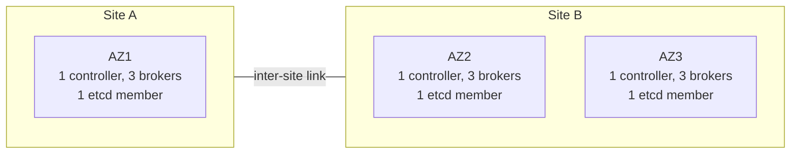
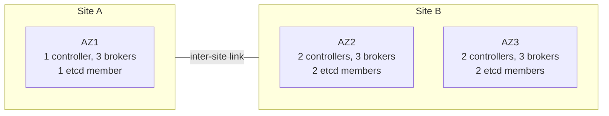
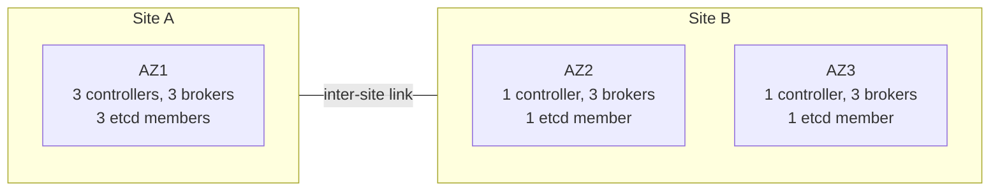
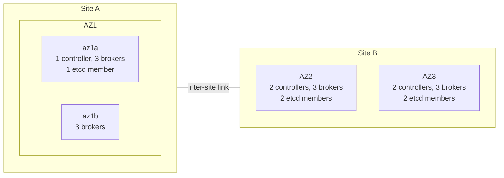
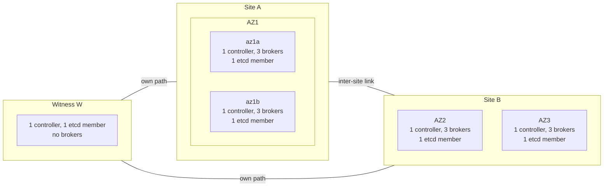
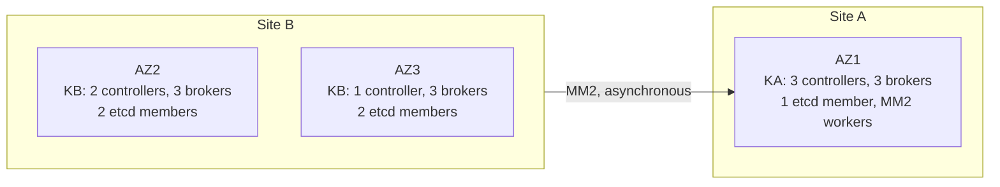
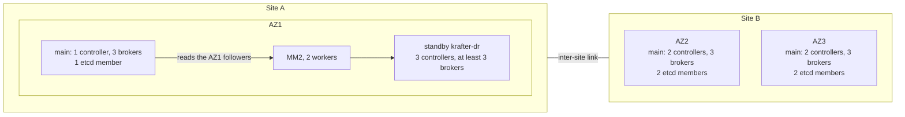
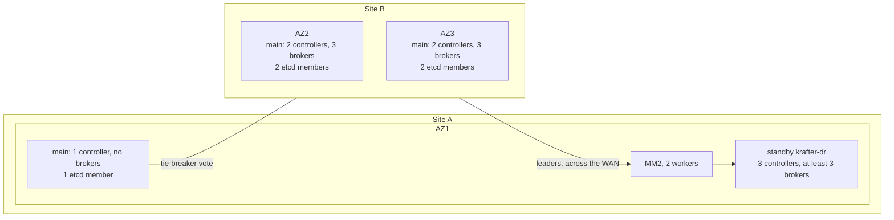

# Candidate Architectures

This page describes eight candidate architectures, A1 to A8, for Kafka on one Kubernetes cluster stretched over two sites and three availability zones. Site A is a single room, AZ1. Site B holds two rooms, AZ2 and AZ3. A5 adds a small third location, W. For each architecture you get its intent, where the KRaft controllers, brokers and etcd members sit, its racks and topic settings, the client settings it depends on, its behaviour in every scenario S1–S12, a values sketch for `charts/kafka-cluster` where one is useful, its variants and a verdict.

[Topology and Constraints](01-topology-and-constraints.md) defines the sites, the scenarios, the notation, and the quorum and replication rules that every cell below applies. [Platform Design on the Stretched Cluster](03-kubernetes-and-strimzi.md) covers the platform around Kafka and the [runbooks](03-kubernetes-and-strimzi.md#runbooks) the matrices call: R-DRAIN, R-SD and R-DR. [Test and Chaos Scenarios](04-test-and-chaos-scenarios.md) shows how to prove each row, and [Comparison and Summary](05-comparison-and-summary.md) weighs the designs against each other.

Everything here is checked against Kafka 4.3.1, Strimzi 1.2.0 and Kubernetes 1.34. Build production on Kubernetes 1.35 or later: 1.34 reaches end of life on 2026-10-27. The repository's pins are in the [Version & Compatibility Matrix](../book/appendix-d-versions.md).

## The Eight Architectures

| ID | Name | Controllers | Brokers | Data | etcd | Status |
|---|---|---|---|---|---|---|
| **A1** | Symmetric 3-AZ, three voters | C 1/1/1 | B 3/3/3 | RF 3, R 1/1/1, m 2 | E 1/1/1 | For existing 3-controller clusters. Superseded by A2 for new builds |
| **A2** | Five voters, majority in site B | C 1/2/2 | B 3/3/3 | RF 3, R 1/1/1, m 2 | E 1/2/2 | The best single stretched cluster without W; the main cluster of A7 |
| **A3** | Controllers weighted toward site A | C 3/1/1 | B 3/3/3 | RF 3, m 2 | E 3/1/1 | **Rejected**: one room becomes fatal |
| **A4** | Site-aware durability without a witness | C 1/2/2 | B 3+3/3/3 | RF 4, R 2/1/1, m 3 | E 1/2/2 | **Rejected as a standalone design**; its data layout is reused by A5 and A7-d |
| **A5** | Witness tie-breaker plus site-aware data | C 2/1/1+1W | B 3+3/3/3 | RF 4, R 2/1/1, m 2 (m 3 per topic) | E 2/1/1+1W | **Recommended when a third location exists** |
| **A6** | Two independent clusters, one per site, with MirrorMaker 2 | KA: 3 in AZ1. KB: C 0/2/1 | KA 3; KB 0/3/3 | KA RF 3, m 2; KB RF 4 (2+2), m 2 | E 1/2/2 | Dominated by A8 |
| **A7** | A2 plus a MirrorMaker 2 warm standby in AZ1 | C 1/2/2, plus 3 in the standby | B 3/3/3, plus ≥ 3 in the standby | As A2 | E 1/2/2 | **Recommended with two sites only** |
| **A8** | Data plane in site B, AZ1 tie-breaker controller, AZ1 standby | C 1/2/2, plus 3 in the standby | B 0/3/3, plus ≥ 3 in the standby | RF 4 (2+2), m 2 | E 1/2/2 | The fallback when the WAN fails the synchronous gates |

> [!IMPORTANT]
> No voter layout confined to the two sites survives both the loss of site A and the loss of site B. To survive the loss of any single room, the voter majority has to sit in site B, so without W, losing site B stops both the KRaft quorum and etcd: A1, A2 and A4 can then only wait for site B or rebuild, and A6, A7 and A8 fail over to a standby by hand. A3 puts the majority in site A instead, which makes the single room AZ1 fatal. A5 alone survives the loss of either site automatically. [Topology and Constraints](01-topology-and-constraints.md#the-two-site-impossibility) gives the proof.

## Reading the Failure Matrices

### Scenarios

| ID | Scenario |
|---|---|
| S1 | Single broker pod or node loss |
| S2 | Single controller loss, including the active controller |
| S3 | AZ1 loss, which is the whole of site A |
| S4 | AZ2 room loss |
| S5 | AZ3 room loss |
| S6 | Site B loss (AZ2 and AZ3 together) |
| S7 | Inter-site partition A∣B, both sides alive |
| S8 | Intra-site partition AZ2∣AZ3, site A reaching both |
| S9 | WAN degradation between the sites: RTT raised (2 → 20 → 50 ms), 1–5% loss, a bandwidth cap |
| S10 | Kubernetes control-plane (etcd) quorum loss while Kafka nodes stay up |
| S11 | Witness loss (only where there is one) |
| S12 | Planned maintenance: drain a whole AZ |

### Columns and Symbols

- **Quorum.** `KRaft Y 4/5 (m1)` means the quorum holds with 4 of 5 voters and a margin of 1: one more voter can go. `KRaft N 1/5` means the quorum is lost. etcd uses the same notation.
- **Writes** always means acks=all produce. **Avail**: available after the stated stall. **Blocked**: rejected or timing out. **Partial**: some partitions or some client paths only.
- **Reads** means reading committed data, up to the high watermark (HW).
- **RPO** applies to acks=all producers, per lost domain X ([RPO Symbols](01-topology-and-constraints.md#rpo-symbols)). acks=0 and acks=1 get no guarantee anywhere.

| RPO | Meaning |
|---|---|
| **0g** | Guaranteed. m > r_X for every partition (r_X = replicas inside the lost domain X), so every acknowledged record had an ISR member outside X at ack time. This holds even if X loses power. |
| **0c** | Conditional. m ≤ r_X and writes continue. Lossless only if E_X = 0 at the moment X fails. The partitions counted in E_X go offline while X is down, and come back as [Returning Brokers Elect the Last Known Leader](#returning-brokers-elect-the-last-known-leader) describes: losslessly after a network cut or a crash, missing their unflushed tail after a power loss, never if X is destroyed. |
| **>0** | Acknowledged records can be lost by design: an asynchronous MirrorMaker 2 (MM2) copy, or a backup. |
| **0 (event)** | The scenario destroys no domain (S7, S8, S9), so the event itself loses no acks=all record. The cell names the exposure it creates: while it lasts, new writes may be durable in one site or one room only. |

### Exposure E_X

**E_X** is the number of partitions, internal topics included, whose ISR ∪ ELR lies entirely inside domain X. The Eligible Leader Replicas set (ELR, [KIP-966](https://github.com/apache/kafka/blob/4.3.1/docs/operations/eligible-leader-replicas.md)) is empty whenever the ISR is at or above m, so for a healthy partition this is simply its ISR. A replica that leaves the ISR while the ISR is below m stays in the ELR and keeps everything up to the frozen HW, so it still counts as a copy outside X.

- X is site A or site B for A1–A5 and for A7's main cluster.
- X is room AZ2 or AZ3 for A6's KB and A8's main cluster, whose replicas all sit in site B.

E_X must be 0 in steady state. Neither Kafka nor Kates computes it: derive it from the Admin API (DescribeTopicPartitions returns the ELR), each broker's `broker.rack`, and a rack-to-domain map. Alert when it stays above 0 for 60 s. [Exposure E_X](01-topology-and-constraints.md#exposure-e_x) has the full definition.

### Timers

Times assume the chart's KRaft timers (`controller.quorum.election.timeout.ms` 5000, `controller.quorum.fetch.timeout.ms` 10000, `controller.quorum.election.backoff.max.ms` 5000) and Kafka's broker session defaults. [Timers](01-topology-and-constraints.md#timers) derives each value.

| Symbol | Meaning | Chart timers | Kafka defaults |
|---|---|---|---|
| t_g | Graceful controlled shutdown of one broker | < 1–2 s | same |
| t_f | A hard-lost broker is fenced, leaves every ISR, and its partitions change leader | ≈ 9–10 s after its last heartbeat | same |
| t_c | The active controller is hard-lost and a new one is elected | ≈ 10–20 s typical; a split vote can push it to about 25 s | ≈ 2–4 s |
| t_fc | The active controller and brokers are lost together: t_c, then t_f | ≈ 20–30 s typical; it can exceed 30 s | ≈ 11–14 s |
| t_r | An isolated active controller resigns (check-quorum, 1.5 × fetch timeout) | 15 s | 3 s |
| t_lag | A follower that stopped keeping up, but is not fenced, leaves the ISR | 30–45 s | 30–45 s |
| t_sd | R-SD step-down: lowering m by hand; needs a live KRaft quorum | 5–15 min (estimate) | – |
| t_dr | R-DR failover to a standby: decide, fence site B, recover etcd in AZ1, promote | The decision and the switch are estimated at 15–30 min, mostly spent deciding; the fence and the etcd recovery come on top. T1 measures the whole | – |
| t_node | A node goes NotReady and gets the NoExecute taint; pods go when the default toleration expires | 50 s to the taint; 5 min 50 s to deletion | same |

"t_f/t_fc" means t_f, or t_fc when the active controller was inside the lost domain. The producer's `delivery.timeout.ms` of 120 s covers every automatic case, including the slow ones.

## Behaviour Shared by Every Architecture

These rules apply to every matrix below, so the cells refer to them instead of repeating them.

### WAN Degradation Comes in Two Phases

S9 unfolds in two phases wherever an ISR spans both sites (A1–A5 and A7's main cluster):

1. **Phase 1, always.** acks=all waits for every ISR member, so every produce request waits for the WAN. Producers throttle themselves (in-flight requests, `buffer.memory`, the 30 s request timeout): throughput caps at the WAN capacity, produce P99 rises, and `REQUEST_TIMED_OUT` retries appear. This may be the only effect.
2. **Phase 2, only if cross-site followers are removed.** A follower leaves the ISR only if it fails to reach the leader's log end offset for t_lag (30–45 s), which needs a per-partition backlog larger than a fetch response (1 MiB per partition, 10 MiB per response). Then the designs diverge: A1, A2, A3 and A7 block their AZ1-led partitions and keep writing the B-led ones while E_B rises; A4 blocks (fail-safe); A5 keeps writing on its same-site pairs while E_X rises. `IsrShrinksPerSec` tells you whether phase 2 was reached.

Size the WAN for the synchronous replication need plus the client produce and consume traffic that crosses it. A6 and A8 keep the WAN out of the data acks path.

### No Roll Completes During an Outage

While any pinned Kafka pod is Pending (its zone is down or cordoned) or sits on a dead node, every Strimzi reconciliation of that cluster fails. The [KafkaRoller](https://github.com/strimzi/strimzi-kafka-operator/blob/1.2.0/cluster-operator/src/main/java/io/strimzi/operator/cluster/operator/resource/KafkaRoller.java) visits every node, unready controllers first. It treats a Pending, unschedulable pod as a fatal problem, waits the operation timeout for a pod on a dead node (15 min with `charts/strimzi-operator`, 300 s by Strimzi's default), and rolls brokers only after every controller succeeds. So during any AZ outage or drain, in every design:

- the Kafka CR stays NotReady;
- no broker roll completes, so neither does a certificate-renewal roll;
- controller quorum margin tells you whether the quorum survives one more loss, not whether a roll can run.

On top of that, the KafkaRoller refuses to roll a broker that would take a partition from ISR = m below m, and refuses a controller roll that would leave fewer than ⌈(N+1)/2⌉ controllers caught up. Make no Kafka CR changes during a site incident. [KafkaRoller During an AZ Outage](01-topology-and-constraints.md#kafkaroller-during-an-az-outage) has the code references.

### The Controller Layout Is Fixed at Creation

Strimzi 1.2.0 formats every KRaft quorum as static, and its [deploying guide](https://strimzi.io/docs/operators/1.2.0/deploying.html) lists adding, removing, scaling or renaming a controller pool, or changing its roles, as unsupported. Strimzi does not prevent those edits: it renders `controller.quorum.voters` from the current pools, so an edit rewrites the static voter set on the next roll and leaves the nodes on an inconsistent quorum. Deny such edits with an admission policy (Kyverno, or a CEL ValidatingAdmissionPolicy) on KafkaNodePools that carry the controller role; [Controller-Pool Changes Are Unsupported and Not Prevented](01-topology-and-constraints.md#controller-pool-changes-are-unsupported-and-not-prevented) has a policy sketch.

Moving between A1, A2 and A5 therefore means a new cluster and an MM2 migration. A future Strimzi release with dynamic quorums ([proposal #203](https://github.com/strimzi/proposals/pull/203), still open) could allow an in-place re-layout.

### Never Replace a Controller Disk

Kafka itself refuses to auto-format storage, but Strimzi's image formats storage at every container start ([`kafka_run.sh`](https://github.com/strimzi/strimzi-kafka-operator/blob/1.2.0/docker-images/kafka-based/kafka/scripts/kafka_run.sh#L55-L62), with `-g` to skip formatted volumes) against the static voter list. A controller whose metadata PVC is lost, deleted or replaced is silently re-formatted and rejoins the quorum as a voter with an empty log and no vote state, so it can vote twice in one epoch.

- Never delete or replace a controller PVC, and never annotate a controller with `strimzi.io/delete-pod-and-pvc`.
- If a controller's disk is lost, keep the pod from starting (leave the old PVC in place, or pause reconciliation) until every other voter is healthy and caught up.
- Never let more than one controller start empty: an empty majority can elect a leader without the committed metadata.

[Controller Disk Loss](03-kubernetes-and-strimzi.md#controller-disk-loss) in Platform Design on the Stretched Cluster has the procedure.

### Without a Quorum, No Group Commits

Without a KRaft quorum, no ISR can shrink, so the HW of every `__consumer_offsets` partition freezes, including those led in a surviving site: their ISR still lists the unreachable replicas. OffsetCommit, SyncGroup and KIP-848 epoch writes time out for every group. Consumers that are already assigned can keep fetching, up to the frozen HW, from partitions whose leader is still reachable, but no group can commit offsets or rebalance.

### Returning Brokers Elect the Last Known Leader

A partition whose whole ISR ∪ ELR sat in a lost domain is offline while the domain is down. What happens when the domain returns depends on how it was lost, and `unclean.leader.election.enable` stays false throughout:

- **Network cut, no restart:** the controller re-elects the returning replicas cleanly from the ELR. Nothing is lost.
- **Restart (pod kill, process crash or power loss):** the brokers re-register as unclean shutdowns, which removes them from the ISR and the ELR. Kafka 4.3.1 then elects the last known leader automatically, sets ISR = {leader} and the leader recovery state RECOVERING, and counts it in `UncleanLeaderElectionsPerSec`. After a crash the page cache survived, so nothing is lost; after a power loss the unflushed tail of acknowledged records is gone, silently.
- **Destroyed:** the partition stays offline.

No setting turns the automatic election off: to hold such partitions for manual reconciliation, keep the returning brokers from unfencing. [Last-Known-Leader Election After a Correlated Restart](01-topology-and-constraints.md#last-known-leader-election-after-a-correlated-restart) in Topology and Constraints has the mechanism and a worked example.

The same path runs after a correlated pod kill, such as a transient kill of every site-B pod: every killed replica returns as an unclean incarnation and leaves every ISR.

- In A1, A2, A4 and A7, the kill also takes the voter majority, so nothing changes until site B's controllers are back and elect a leader. Then every partition's ISR drops to its AZ1 replicas, below m, and writes stay Blocked until the site-B replicas catch up: the RTO is pod recreation, plus t_c, plus that catch-up. All leadership sits on AZ1's brokers until the preferred-leader rebalance moves it back (checked every 300 s).
- In A3 the quorum holds, but writes wait for the site-B replicas to return and catch up. A5 keeps writing on site A's pairs after t_fc.
- In A6's KB and A8's main cluster, where every replica lives in site B, every partition comes back through a last-known-leader election.

So an unclean-election alert after a known correlated restart is expected. Identify those elections by RECOVERING together with the restart, and judge data loss on the client-side record count (`lostRecords` of a Kates INTEGRITY run), not on the election count ([T0](04-test-and-chaos-scenarios.md#t0-correlated-transient-kills) in Test and Chaos Scenarios).

## Shared Configuration

### Kafka and Strimzi Baseline

Every architecture assumes the Kafka and Strimzi baseline B0-K, which [Kafka and Strimzi Baseline](03-kubernetes-and-strimzi.md#kafka-and-strimzi-baseline-b0-k) in Platform Design on the Stretched Cluster details. The parts that shape the layouts below:

- **Dedicated controller pools, one per location.** No dual-role nodes: Kafka advises against combined mode in critical deployments ([kraft.md](https://github.com/apache/kafka/blob/4.3.1/docs/operations/kraft.md#L288)), and rolling a dual-role broker also rolls a voter. An odd voter count; Strimzi warns on 2 or any even count ([KafkaSpecChecker](https://github.com/strimzi/strimzi-kafka-operator/blob/1.2.0/cluster-operator/src/main/java/io/strimzi/operator/cluster/model/KafkaSpecChecker.java)). Two controllers in the same AZ run on different hosts, which needs a *required* host anti-affinity (the chart renders only a preferred one).
- **Every pool pinned** with `zone:`, which renders a required nodeAffinity and a `zone` pod label.
- **One broker pool per rack**, with equal broker counts per rack: KRaft's replica placer gives a rack with fewer brokers more replicas per broker.
- **Racks from an environment variable:** `kafka.rack` of type `environment-variable` with `KAFKA_RACK` set on broker pools. This removes the rack init container's API call at every pod start and the per-cluster ClusterRoleBinding. Strimzi then adds no affinity of its own, so placement comes entirely from the pins.
- **Broker settings:** `unclean.leader.election.enable=false`; RF and m always set explicitly (removing `min.insync.replicas` from the CR resets it to 1); internal topics follow the data topics; `replica.selector.class=org.apache.kafka.common.replica.RackAwareReplicaSelector`; `num.replica.fetchers` ≥ 3; socket buffers at least the bandwidth-delay product; `broker.session.timeout.ms=9000` and `broker.heartbeat.interval.ms=2000` set explicitly.
- **KRaft timers** stay at the chart's 5000/10000/5000 until T4 shows zero KRaft elections at the measured RTT P99 plus 50 ms of jitter.
- **Verify the features** on the running cluster with `kafka-features.sh --bootstrap-server <broker>:9092 describe`: expect `kraft.version=0` and `eligible.leader.replicas.version=1`. A fresh cluster from this chart is formatted at `4.2-IV1`, where ELR is on; an upgraded one may not be.

`__consumer_offsets` has no min ISR of its own: it inherits the cluster-level `min.insync.replicas`. Since Kafka 4.0, offset commits always use acks=all ([upgrade notes](https://github.com/apache/kafka/blob/4.3.1/docs/getting-started/upgrade.md#L245)), and the group coordinator keeps all group state there, so when m blocks data topics it blocks consumer groups too. Every R-SD therefore names `__consumer_offsets` and `__transaction_state` along with the data topics.

### Client Baseline

Every architecture's clients start from this set; each section lists only what it adds.

| Setting | Value | Why |
|---|---|---|
| `acks` | `all`, set explicitly (the 4.x default) | acks=0 or 1 on the minority side of a split writes to zombie leaders, and those records are truncated at the heal |
| `enable.idempotence` | `true` | Retries across failovers without duplicates |
| `delivery.timeout.ms` / `request.timeout.ms` | 120000 / 30000 | Covers every automatic recovery time in this page |
| `linger.ms` / `batch.size` | 10–20 / ≥ 256 KiB | Spreads the cross-site round trip of each acks=all batch over more records |
| `compression.type` | `lz4` or `zstd` | Fewer replication bytes on the WAN |
| `bootstrap.servers` | The `<cluster>-kafka-bootstrap` Service, or at least one broker per rack | With `metadata.recovery.strategy=rebootstrap` (the 4.x default, [KAFKA-17885](https://issues.apache.org/jira/browse/KAFKA-17885)) surviving clients find the cluster again after a site loss |
| `client.rack` (consumers, MM2, Connect) | Exactly the local `broker.rack` string | Fetch from follower: no cross-site consume traffic while the local replica is in the ISR |
| `metadata.max.age.ms` (consumers) | 60000 | The preferred read replica is cached until metadata expires (300000 by default) |
| `isolation.level` | `read_committed` for exactly-once workloads | – |
| `session.timeout.ms` (classic protocol) | 10000–15000 | Frees the partitions of consumers lost with a site sooner; the broker minimum is 6000 |
| `group.protocol` | Test both `classic` and `consumer` | Rebalances behave differently, and the 4.3.1 source of the KIP-848 built-in server assignors has no rack logic ([assignor package](https://github.com/apache/kafka/tree/4.3.1/group-coordinator/src/main/java/org/apache/kafka/coordinator/group/assignor)); rack-aware assignment (KIP-881) is classic-protocol only |
| `transaction.timeout.ms` | ≥ 60000 (the default) | Outlasts a failover |
| Processing | Idempotent | MM2 failover re-reads records, because offset translation is conservative |
| Placement | Spread clients across both sites | Clients in a lost site die with it in every design |

Rack-aware producer partitioning ([KIP-1123](https://cwiki.apache.org/confluence/display/KAFKA/KIP-1123:+Rack-aware+partitioning+for+Kafka+Producer)) arrives only in Kafka 4.4.0, which is unreleased. On 4.3.1, produce traffic to leaders in the other site cannot be avoided.

### How the Values Sketches Are Written

The sketches target `charts/kafka-cluster`, whose node pool model is described under Node pools in [kafka-cluster](../../charts/kafka-cluster/README.md#node-pools), and use the chart's default cluster name, the `krafter` Kafka cluster, in namespace `kafka`. Each one renders with `helm template` over `values-prod.yaml` once it is combined as its section describes. They follow these rules:

- **Write `nodePools.pools` explicitly, in an overlay placed last.** Helm replaces lists, the pools in `values-prod.yaml` are not pinned, and `kates detect --generate-values` writes `C 1/1/1` with one broker per zone, in the older `controllerPools` and `brokerPools` keys that `values-prod.yaml` clears ([valuesgen.go](../../cli/pkg/detect/valuesgen.go)). Neither gives these layouts.
- **`zone:` on every pool**, controllers included. `nodePools.defaults.scheduling.zoneKey` names the node label it pins to.
- **`kafka.rack` with `topologyKey: null`.** Helm deep-merges `kafka.rack`, so without the null the chart's default `topologyKey` stays in the rendered rack object. Strimzi ignores it in environment-variable mode, but `kates cluster topology` reports it as the rack key, which is misleading.
- **`KAFKA_RACK` on broker pools only.** Strimzi writes `broker.rack` only for broker and dual-role nodes ([KafkaBrokerConfigurationBuilder](https://github.com/strimzi/strimzi-kafka-operator/blob/1.2.0/cluster-operator/src/main/java/io/strimzi/operator/cluster/model/KafkaBrokerConfigurationBuilder.java#L162-L170)); setting it on controllers is harmless.
- **A `site` pod label on every pool**, through the pool's raw `template`, which the chart deep-merges last. With `zone`, it gives chaos tests and runbooks a selector per site (`strimzi.io/cluster=krafter,site=b`).
- **Required host anti-affinity** for pools with two or more controllers in one AZ, also through the raw `template`. It renders beside the chart's preferred rule.
- **Pool names** `brokers-*` sort before `controllers-*`. Kates command probes run in the first Kafka pod by name ([ProbeExecutor.java](../../kates/src/main/java/com/bmscomp/kates/chaos/ProbeExecutor.java)), and for a site-B test that pod should be a site-A broker.
- **Lists in a pool's `template` replace the chart's.** If tiered storage is on, the chart puts its object-store credentials in `kafkaContainer.env`; a pool that sets `env` for `KAFKA_RACK` must repeat them.

Check a sketch before you install it:

```bash
helm dependency build charts/kafka-cluster
helm template krafter charts/kafka-cluster -n kafka \
  -f charts/kafka-cluster/values-prod.yaml \
  -f stretch.yaml > rendered.yaml
```

Then confirm, per KafkaNodePool, the node affinity, the `zone` and `site` labels and the `KAFKA_RACK` value, and on the Kafka CR the rack block and the replication settings.

## A1: Symmetric 3-AZ, Three Voters

### A1 Intent

The simplest layout, and the direction the repository already takes. Every single room, and all of site A, fails over automatically with RPO 0g. Losing site B is accepted as fatal.

### A1 Layout

| | AZ1 (site A) | AZ2 (site B) | AZ3 (site B) | W | Total |
|---|---|---|---|---|---|
| KRaft controllers | 1 | 1 | 1 | – | 3 |
| Brokers | 3 | 3 | 3 | – | 9 (minimum 6) |
| etcd members | 1 | 1 | 1 | – | 3 |
| Replicas per partition | 1 | 1 | 1 | – | RF 3 |



Keep peak client-facing utilisation at 60% or below. Losing an AZ moves its third of the leadership onto 6 brokers, a factor of 1.5; each broker's replica write load stays the same. etcd runs as three stacked control-plane nodes, one per AZ, so its majority is in site B, like KRaft's.

### A1 Racks, Topics and Clients

- **Racks:** `az1`, `az2`, `az3`, from `KAFKA_RACK`.
- **Topics:** RF 3 (R 1/1/1), m 2. `offsets.topic.replication.factor` 3, `transaction.state.log.replication.factor` 3, `transaction.state.log.min.isr` 2; `__consumer_offsets` inherits m 2. Unclean election off, ELR v1 verified.
- **Clients:** the client baseline.

### A1 Failure Matrix

| S | Quorum | Writes (acks=all) | Reads | RPO | RTO / manual action |
|---|---|---|---|---|---|
| S1 | KRaft Y 3/3 | Avail. Partitions with a replica on the lost broker stall for t_f after a hard failure (under t_g after a graceful one), then run at ISR 2 = m, with no margin, until it returns. | Avail | 0g | Automatic, t_f. A killed pod is back within seconds. After a hard node loss with a node-local PV the broker stays down until the node returns: the pod stays Terminating, and reconciliations fail meanwhile. If the node is gone for good, delete the Node object (or add the out-of-service taint once power-off is confirmed), provide a local PV on another node in the same AZ, then rebuild the broker with `strimzi.io/delete-pod-and-pvc` ([Rebuilding a Broker on a Dead Node](03-kubernetes-and-strimzi.md#rebuilding-a-broker-on-a-dead-node)). Brokers only, never a controller. |
| S2 | KRaft Y 2/3 (m0) | Avail. If the lost controller was active, metadata operations (elections, ISR changes, fencing, topic creation) freeze for t_c. | Avail | 0g | Automatic, t_c. At m0 the KafkaRoller refuses controller rolls until the controller returns, and one more controller loss ends the quorum. For a lost controller disk, see [Never Replace a Controller Disk](#never-replace-a-controller-disk). |
| S3 | KRaft Y 2/3 (m0, both voters in B); etcd Y 2/3 | Avail after a stall. Every partition has an AZ1 replica, so every partition stalls for t_f/t_fc; about 1/3 also change leader. Then ISR = {az2, az3} = m everywhere. | Avail | **0g** (m 2 > r_A 1). E_B = 100% until AZ1 is back in the ISR. | Automatic, t_f/t_fc. 6 of 9 brokers carry the load (×1.5). No roll completes until AZ1 returns, and one more controller loss ends the quorum. Throttle AZ1's catch-up when it returns. |
| S4 | KRaft Y 2/3 (m0; metadata commits now need the AZ1 voter, across the WAN); etcd Y 2/3 | Avail after t_f/t_fc. ISR = {az1, az3}, so every write waits for a cross-site acknowledgement. | Avail | 0g | Automatic. No roll completes until AZ2 returns. |
| S5 | As S4, with AZ1 and AZ2 surviving | As S4 | Avail | 0g | Automatic, as S4 |
| S6 | **KRaft N 1/3; etcd N 1/3 (API down)** | **Blocked everywhere.** No election and no ISR shrink can commit. acks=all writes to AZ1-led partitions time out at `delivery.timeout.ms`; acks=0/1 writes are appended but stay invisible (HW frozen). | Partial: assigned consumers read the AZ1-led partitions (about 1/3) up to the frozen HW. No group can commit offsets or rebalance. | B back after a network loss or a process crash: 0 (after a crash, the E_B partitions return through an automatic RECOVERING election). B lost power: >0 for partitions with E_B > 0, lost silently when B returns. B destroyed: the data sits on AZ1 disks but cannot be served, so the effective RPO is the last backup or mirror. | **Manual.** Wait for B. If B is lost for good: fence B, run etcd `--force-new-cluster` in AZ1, then build a new Kafka cluster and restore it (hours or more, unbounded). |
| S7 | B side: KRaft Y 2/3, etcd Y 2/3. A side: N (an active controller in AZ1 resigns after t_r). | B side: Avail after t_f if the active controller was in B, or about t_fc if it was in AZ1. A side: acks=all writes time out on zombie leaders; acks=0/1 writes are accepted, then truncated at the heal. | B: Avail. A: stale, up to the frozen HW. | 0 (event) for acks=all; E_B = 100% on the B side during the split. acks=0/1 on the A side: >0. | B side: automatic. A-side clients are down until the heal. No action. Without the NoExecute tolerations of B0-K, a split longer than 5 min 50 s restarts the AZ1 Kafka pods at the heal. |
| S8 | KRaft Y (AZ1 bridges both rooms; Pre-Vote keeps the epoch stable); etcd Y | Partial. About 2/3 of partitions (those led in AZ2 or AZ3) stall until the room without the active controller is fenced (t_f) or, with the active controller in AZ1, until the unreachable follower is dropped (t_lag). The server side is then Avail. Clients in AZ2 cannot reach AZ3 leaders, and the other way round. | Partial (cross-room client paths) | 0 (event); every ISR keeps a replica in each site, so E_X stays 0 | Server side automatic, t_f to t_lag. Client paths stay down until the heal. Optionally stop one room's brokers to turn this into a clean S4 or S5. |
| S9 | KRaft Y (the chart's timers tolerate far more than 50 ms). etcd: 50 ms plus jitter is above OKD's recommended 33 ms, so expect heartbeat warnings and slower commits; leader changes only if loss or jitter starves heartbeats for about 1 s. | Phase 1: throughput caps at the WAN capacity, P99 rises, `REQUEST_TIMED_OUT` retries appear. Phase 2, only if cross-site followers fall behind for t_lag: the AZ1-led partitions (about 1/3) drop to ISR {az1} < m and are **Blocked**; the B-led partitions continue with ISR ⊆ B, so **E_B rises silently**. | Avail. Follower fetching falls back to the cross-site leader once the local follower leaves the ISR. | 0 (event). A raised E_B turns a later S6 power loss into loss. | Recovers with the link. Alert on E_B > 0. Shed load or fix socket buffers. |
| S10 | KRaft Y; etcd **N** | Avail | Avail | 0g | No Kafka action; restore etcd. Until then no pod is created or recreated, Strimzi does no reconciling, rolling or certificate renewal, a topology-label rack init container fails, and new CoreDNS pods cannot sync. The kubelet still restarts crashed containers. |
| S11 | n/a | – | – | – | No witness |
| S12 | KRaft Y 2/3 (m0) | Avail. A stall under t_g per broker; ISR = m for the whole window. | Avail | 0g. Draining AZ1 runs with E_B = 100%. | R-DRAIN. The Kafka CR stays NotReady and reconciliations fail while the drained pods are Pending. |

### A1 Values Sketch

The same shape serves A2 and A7's main cluster with different controller counts.

```yaml
kafka:
  rack:
    type: environment-variable
    envVarName: KAFKA_RACK
    topologyKey: null          # drop the chart default (see the sketch rules)
  config:
    default.replication.factor: 3
    min.insync.replicas: 2
    offsets.topic.replication.factor: 3
    transaction.state.log.replication.factor: 3
    transaction.state.log.min.isr: 2
    unclean.leader.election.enable: false
    replica.selector.class: org.apache.kafka.common.replica.RackAwareReplicaSelector
    broker.session.timeout.ms: 9000
    broker.heartbeat.interval.ms: 2000
    # controller.quorum.* stay at the chart's 5000/10000/5000 until T4 passes
nodePools:
  defaults:
    scheduling:
      zoneKey: topology.kubernetes.io/zone
  pools:
    - name: brokers-az1
      roles: [broker]
      replicas: 3
      zone: az1
      template:
        kafkaContainer: {env: [{name: KAFKA_RACK, value: az1}]}
        pod: {metadata: {labels: {site: a}}}
    - name: brokers-az2
      roles: [broker]
      replicas: 3
      zone: az2
      template:
        kafkaContainer: {env: [{name: KAFKA_RACK, value: az2}]}
        pod: {metadata: {labels: {site: b}}}
    - name: brokers-az3
      roles: [broker]
      replicas: 3
      zone: az3
      template:
        kafkaContainer: {env: [{name: KAFKA_RACK, value: az3}]}
        pod: {metadata: {labels: {site: b}}}
    - name: controllers-az1
      roles: [controller]
      replicas: 1
      zone: az1
      template: {pod: {metadata: {labels: {site: a}}}}
    - name: controllers-az2
      roles: [controller]
      replicas: 1
      zone: az2
      template: {pod: {metadata: {labels: {site: b}}}}
    - name: controllers-az3
      roles: [controller]
      replicas: 1
      zone: az3
      template: {pod: {metadata: {labels: {site: b}}}}
```

### A1 Verdict

**Acceptable only for an existing 3-controller cluster** that is not yet worth rebuilding. Check that its controllers really sit one per AZ (`kubectl get pod -n kafka -l strimzi.io/controller-role=true -o wide`, against the nodes' zone labels) and add A7's standby. For a new build, use A2: two more controllers buy margin 1 after losing site A, and the voter layout cannot change later.

- Site B's loss takes down both Kafka and the Kubernetes control plane, and a permanent loss has no supported recovery.
- After any room loss the quorum has no margin.
- WAN saturation blocks the AZ1-led partitions, and every write crosses the WAN.

## A2: Five Voters, Majority in Site B

### A2 Intent

A1's data plane with five voters, so that after losing site A the controller quorum keeps a margin of 1. Whether that margin lets controller rolls run during a long AZ1 outage is unverified: see [No Roll Completes During an Outage](#no-roll-completes-during-an-outage).

### A2 Layout

| | AZ1 (site A) | AZ2 (site B) | AZ3 (site B) | W | Total |
|---|---|---|---|---|---|
| KRaft controllers | 1 | 2 (separate hosts) | 2 (separate hosts) | – | 5 |
| Brokers | 3 | 3 | 3 | – | 9 (minimum 6) |
| etcd members | 1 | 2 | 2 | – | 5 |
| Replicas per partition | 1 | 1 | 1 | – | RF 3 |



Headroom as A1: 60% at most. Build the 5-member etcd as five stacked control-plane nodes, or as an external etcd topology for all members. Three stacked control-plane nodes plus two etcd-only nodes also works, but kubeadm supports [stacked or external etcd, not a mix](https://kubernetes.io/docs/setup/production-environment/tools/kubeadm/ha-topology/), so that option means managing etcd membership, upgrades and certificates by hand.

### A2 Racks, Topics and Clients

As A1: racks `az1`/`az2`/`az3`, RF 3, m 2, internal topics RF 3 with min ISR 2, unclean election off, ELR v1, and the client baseline.

### A2 Failure Matrix

| S | Quorum | Writes (acks=all) | Reads | RPO | RTO / manual action |
|---|---|---|---|---|---|
| S1 | KRaft Y 5/5 | As A1 | Avail | 0g | As A1 |
| S2 | KRaft Y 4/5 (m1) | Avail. Metadata freezes for t_c if the active controller was lost. | Avail | 0g | Automatic, t_c. The quorum survives one more controller loss. |
| S3 | KRaft Y 4/5 (m1); etcd Y 4/5 | As A1: every partition stalls for t_f/t_fc, then ISR = {az2, az3} = m | Avail | 0g. E_B = 100% until AZ1 is back in the ISR. | Automatic, t_f/t_fc. Margin 1: one more controller loss is survivable. The KafkaRoller's quorum check would allow a controller roll (3 of 4 stay caught up), but no reconciliation completes while AZ1's pinned pods are down, so whether the roll runs is unverified. Broker rolls are held anyway (ISR = m). |
| S4 | KRaft Y 3/5 (m0; commits need the AZ1 voter, across the WAN); etcd Y 3/5 | Avail after t_f/t_fc. ISR = {az1, az3}. | Avail | 0g | Automatic. No roll completes until AZ2 returns. |
| S5 | As S4 | As S4 | Avail | 0g | Automatic |
| S6 | **KRaft N 1/5; etcd N 1/5** | Blocked, as A1 | Partial, as A1 | As A1 | Manual, as A1 |
| S7 | B side: KRaft Y 4/5 (m1), etcd Y 4/5. A side: N. | As A1 | As A1 | As A1 | As A1 |
| S8 | KRaft Y (AZ1 plus either room gives 3) | As A1 | Partial | 0 (event); E_X stays 0 | As A1 |
| S9 | KRaft Y. While the leader is in B, metadata commits stay inside B (4 voters there, q = 3). etcd as A1. | As A1, in two phases | As A1 | As A1 | As A1 |
| S10 | KRaft Y; etcd N only if 3 of 5 members are lost | Avail | Avail | 0g | As A1 |
| S11 | n/a | – | – | – | – |
| S12 | Draining AZ1: Y 4/5 (m1). Draining AZ2 or AZ3: Y 3/5 (m0). | Avail. ISR = m for the window. | Avail | 0g. Draining AZ1 runs with E_B = 100%. | R-DRAIN |

### A2 Values Sketch

A1's sketch with two controllers in each site-B room and a required host anti-affinity between controllers:

```yaml
nodePools:
  pools:
    # brokers-az1..3 and controllers-az1 exactly as in the A1 sketch
    - name: controllers-az2
      roles: [controller]
      replicas: 2
      zone: az2
      template:
        pod:
          metadata: {labels: {site: b}}
          affinity:
            podAntiAffinity:
              requiredDuringSchedulingIgnoredDuringExecution:
                - labelSelector:
                    matchLabels: {strimzi.io/cluster: krafter, strimzi.io/controller-role: "true"}
                  topologyKey: kubernetes.io/hostname
    - name: controllers-az3
      roles: [controller]
      replicas: 2
      zone: az3
      template:
        pod:
          metadata: {labels: {site: b}}
          affinity:
            podAntiAffinity:
              requiredDuringSchedulingIgnoredDuringExecution:
                - labelSelector:
                    matchLabels: {strimzi.io/cluster: krafter, strimzi.io/controller-role: "true"}
                  topologyKey: kubernetes.io/hostname
```

Because `pools` is a list, the overlay must carry all six pools, not only the two that change.

### A2 Variants

| Variant | Change | Effect |
|---|---|---|
| **A2b** | Keeps `E 1/1/1` (three control-plane nodes) | The preferred site does not change. Kafka keeps A2's margins; Kubernetes has A1's (etcd m0 after any room loss). Saves two etcd nodes, the larger part of A2's extra cost. |

### A2 Verdict

**The best single stretched cluster when there is no third location. Use it as the main cluster of A7.** On its own it is acceptable only if "wait for site B, or restore from backup" is an agreed disaster-recovery answer: the S6 cliff is the same as A1's. A restore from the chart's daily Velero backup means an RPO of up to 24 h, and it works only if the backup storage location sits outside site B, which the `values-prod.yaml` default (the chart's in-cluster SeaweedFS) does not guarantee. [Site-B Loss Without a Standby](03-kubernetes-and-strimzi.md#site-b-loss-without-a-standby-a1-a2) in Platform Design on the Stretched Cluster has the options; a full-cluster restore of Kafka into AZ1 is untested. It costs two more controller pods (about +4 GiB memory, +2–4 vCPU and +40 GiB disk at the `values-prod.yaml` sizes) and two more etcd members. An existing 3-controller cluster reaches A2 only by building a new cluster and moving with MM2.

## A3: Controllers Weighted Toward Site A (Rejected)

### A3 Intent

Survive the loss of site B by putting the voter majority in site A.

### A3 Layout

| | AZ1 (site A) | AZ2 (site B) | AZ3 (site B) | W | Total |
|---|---|---|---|---|---|
| KRaft controllers | 3 (separate hosts) | 1 | 1 | – | 5 (or `C 2/1/0`, 3) |
| Brokers | 3 | 3 | 3 | – | 9 |
| etcd members | 3 | 1 | 1 | – | 5 |
| Replicas per partition | 1 | 1 | 1 | – | RF 3 |



etcd must mirror KRaft's preferred side, so it is `E 3/1/1`.

### A3 Racks, Topics and Clients

As A1: racks `az1`/`az2`/`az3`, RF 3, m 2, and the client baseline.

### A3 Failure Matrix

| S | Quorum | Writes (acks=all) | Reads | RPO | RTO / manual action |
|---|---|---|---|---|---|
| S1 | KRaft Y 5/5 | As A1 | Avail | 0g | Automatic, t_f |
| S2 | KRaft Y 4/5 (m1) | Avail | Avail | 0g | Automatic, t_c |
| S3 | **KRaft N 2/5; etcd N 2/5 (API down)** | **Blocked everywhere**: every partition has an AZ1 replica, and no ISR can shrink | Partial: assigned consumers read the B-led partitions (about 2/3) up to the frozen HW; no group can commit offsets or rebalance | 0g on disk (m 2 > r_A 1), but nothing can be served without a quorum | **Manual.** Repair the room, or rebuild Kafka and run etcd disaster recovery in B. |
| S4 | KRaft Y 4/5 (m1) | Avail after t_f/t_fc | Avail | 0g | Automatic |
| S5 | KRaft Y 4/5 (m1) | Avail after t_f/t_fc | Avail | 0g | Automatic |
| S6 | KRaft Y 3/5 (m0, all in one room); etcd Y 3/5 | **Blocked**: ISR = {az1}, below m 2 | Avail after t_f for partitions whose AZ1 replica was in the ISR or ELR. Partitions with E_B > 0 are offline. | 0c | **Manual**: R-SD to m 1, naming `__consumer_offsets` and `__transaction_state`. That leaves a single copy in one room, with ×3 load on AZ1's brokers. |
| S7 | A side: KRaft Y 3/5. B side: N. | **Global write outage.** The A side is Blocked (ISR {az1} < m) until m 1; the B side has zombie leaders. | A: Avail up to the HW. B: stale. | 0 (event) for acks=all; acks=0/1 on the B side: >0 | Manual R-SD to m 1 on the A side, naming `__consumer_offsets` and `__transaction_state`, or wait for the heal |
| S8 | KRaft Y. The active controller is most often in AZ1 (3 of 5 voters), and then nothing is fenced. | Partial, stalling up to t_lag (t_f for the room cut off from an active controller in AZ2 or AZ3) | Partial | 0 (event); every ISR keeps its AZ1 replica, so E_X stays 0 | Automatic |
| S9 | KRaft Y (commits stay in A while the leader is in A) | As A1 | As A1 | As A1 | As A1 |
| S10 | KRaft Y; etcd N | Avail | Avail | 0g | Restore etcd |
| S11 | n/a | – | – | – | – |
| S12 | **Draining AZ1: N 2/5.** Draining AZ2 or AZ3: Y 4/5. | Draining AZ1 is a planned outage of Kafka and the Kubernetes API | – | 0g | AZ1 can never be maintained without an outage |

### A3 Verdict

**Never, in this topology.** AZ1 goes down on either a room event or a site-A event, while site B goes down only on a site-B event, so A3 wins only if site B as a whole is less reliable than one room of site A. Independently of those rates, A3 turns every AZ1 maintenance into a total outage, turns S7 into a global write outage, and "survives" S6 only onto a single copy after a manual step. It fits only a different topology, where AZ1 contains three or more independent power and cooling domains and site B is known to be the weaker site. No values sketch is given.

## A4: Site-Aware Durability Without a Witness (Rejected Standalone)

### A4 Intent

Guarantee a copy of every acknowledged record in both sites (RPO 0g for every single domain, correlated power loss included), and accept that writes stop until R-SD after losing AZ1. A Strimzi maintainer [suggests the same shape](https://github.com/orgs/strimzi/discussions/11012) for two zones: RF 4 with min ISR 3 spread over the zones. Confluent's multi-region guidance states the rule behind it, min ISR greater than the replicas in any one datacenter ([Confluent Platform docs](https://docs.confluent.io/platform/current/multi-dc-deployments/multi-region-architectures.html); the arithmetic applies to Apache Kafka too).

### A4 Layout

| | AZ1 (site A): az1a + az1b | AZ2 (site B) | AZ3 (site B) | W | Total |
|---|---|---|---|---|---|
| KRaft controllers | 1 (az1a) | 2 (separate hosts) | 2 (separate hosts) | – | 5 |
| Brokers | 3 + 3 | 3 | 3 | – | 12 (minimum 8) |
| etcd members | 1 | 2 | 2 | – | 5 |
| Replicas per partition | 2 (one per sub-rack) | 1 | 1 | – | RF 4 |



az1a and az1b are two genuinely independent power and top-of-rack groups inside the AZ1 room. Keep utilisation at 45% or below: after a site loss, and an R-SD, the surviving 6 brokers carry ×2.

### A4 Racks, Topics and Clients

- **Racks:** `az1a`, `az1b`, `az2`, `az3`. RF 4 equals the number of racks, so KRaft's [placer](https://github.com/apache/kafka/blob/4.3.1/metadata/src/main/java/org/apache/kafka/metadata/placement/StripedReplicaPlacer.java#L337-L387) puts exactly one replica per rack: R 2/1/1.
- **Topics:** **every** topic RF 4, internal topics included, because RF 3 on four racks puts two of the three replicas in one site for every partition, so either site's loss blocks about half of the partitions. `offsets.topic.replication.factor` 4, `transaction.state.log.replication.factor` 4, `transaction.state.log.min.isr` 3, cluster-level m 3. `__consumer_offsets` inherits m 3, so offset commits and group-state writes stop together with the data topics, and R-SD must name it. Unclean election off, ELR v1 verified.
- **Chart:** set `topics.defaults.replicas: 4` and `min.insync.replicas: "3"` in `topics.defaults.config`; otherwise the chart derives a topic min ISR of min(RF − 1, 2) = 2. The chart's rails accept RF 4 with m 3.
- **Clients:** the client baseline. Producers must either survive write stops of t_sd (larger `delivery.timeout.ms` and `buffer.memory`) or fail fast into an application-level retry.

### A4 Failure Matrix

| S | Quorum | Writes (acks=all) | Reads | RPO | RTO / manual action |
|---|---|---|---|---|---|
| S1 | KRaft Y 5/5 | Avail. Partitions with a replica on the lost broker run at ISR 3 = m (no margin), so the KafkaRoller holds rolls of their other brokers. | Avail | 0g | Automatic, t_f |
| S2 | KRaft Y 4/5 (m1) | Avail | Avail | 0g | Automatic, t_c |
| S3 | KRaft Y 4/5 (m1); etcd Y 4/5 | **Blocked** on every partition, `__consumer_offsets` included: ISR = {az2, az3} = 2 < 3 | Avail after t_f/t_fc, up to the HW. Offset commits fail. | 0g | **Manual**: R-SD to m 2 (t_sd) on every topic, naming `__consumer_offsets` and `__transaction_state`. Restore m 3 after AZ1 has returned and caught up. |
| S4 | KRaft Y 3/5 (m0) | Avail after t_f/t_fc: ISR = {az1a, az1b, az3} = 3 = m, no margin | Avail | 0g | Automatic. No roll completes until AZ2 returns. |
| S5 | As S4 | As S4 | Avail | 0g | Automatic |
| S6 | **KRaft N 1/5; etcd N 1/5** | Blocked | Partial: assigned consumers read the A-led partitions (about 1/2) up to the frozen HW; no group can commit offsets or rebalance | **0g on the AZ1 disks** (m 3 > r_B 2, even through a site-B power loss), but nothing can be served without a quorum | Manual, as A1. Salvaging from the AZ1 disks is unsupported. |
| S7 | B side: KRaft Y 4/5. A side: N. | **Global write outage**: the B side is Blocked (ISR {az2, az3} < 3), offset commits included, until R-SD; the A side has zombie leaders | B: Avail up to the HW. A: stale. | 0 (event) for acks=all | Manual R-SD on the B side, naming `__consumer_offsets` and `__transaction_state` |
| S8 | KRaft Y | Avail after t_f or t_lag: the ISR keeps az1a, az1b and one room, which is 3 | Partial (cross-room clients) | 0 (event); E_X stays 0 | Automatic |
| S9 | KRaft Y; etcd as A1 | **Fail-safe.** Phase 1: throughput caps at the WAN capacity. Phase 2: when both remote followers of a partition lag past t_lag, its ISR drops below 3 and its writes are **Blocked**; under saturation this is widespread. E_X stays 0, because the second follower removed enters the ELR. | Avail | 0 (event); E_X stays 0 | Recovers once replication catches up. R-SD is optional and trades durability for availability. |
| S10 | KRaft Y; etcd N | Avail | Avail | 0g | Restore etcd |
| S11 | n/a | – | – | – | – |
| S12 | Draining AZ1: Y 4/5, but writes (offset commits included) are **Blocked** unless an R-SD is planned. Draining AZ2 or AZ3: Y 3/5. | Draining AZ2 or AZ3: Avail with no margin | Avail | 0g | Plan an R-SD before draining AZ1 |

### A4 Values Sketch

A4 uses A5's racks and broker pools without the witness. Relative to the [A5 sketch](#a5-values-sketch): drop `controllers-az1b` and `controllers-w`, give `controllers-az2` and `controllers-az3` two replicas each with the required host anti-affinity from the A2 sketch, and raise m:

```yaml
kafka:
  config:
    min.insync.replicas: 3
    transaction.state.log.min.isr: 3
    # the other replication keys as in the A5 sketch (RF 4 everywhere)
topics:
  defaults:
    replicas: 4
    config:
      min.insync.replicas: "3"
```

### A4 Verdict

**Rejected as a standalone design.** Losing AZ1, maintaining AZ1 and S7 all stop writes for t_sd, and S6 is still fatal: the data survives on the AZ1 disks but cannot be served. It costs +33% storage (4D against 3D), 1.5× A1's cross-site replication (P each way against 2P/3), and four equal racks. Its data layout is the module A5 uses, and with A7's standby it becomes A7-d, the maximum-durability option without a witness.

## A5: Witness Tie-Breaker Plus Site-Aware Data (Recommended With a Third Location)

### A5 Intent

The only design that survives **every** single failure domain, either whole site included, without a manual step, with the Kubernetes control plane surviving too. Surviving the loss of each of AZ1, AZ2, AZ3, site B and W requires every location and every room to hold at most k of the 2k + 1 voters ([The Witness Condition](01-topology-and-constraints.md#the-witness-condition)). With a single witness voter this forces n_A = n_B = k: `C 2/1/1+1W` for five voters. `C 1/1/1+2W` is the two-witness-voter case (see [A5 Variants](#a5-variants)).

### A5 Layout

| | AZ1 (site A): az1a + az1b | AZ2 (site B) | AZ3 (site B) | W | Total |
|---|---|---|---|---|---|
| KRaft controllers | 1 + 1 | 1 | 1 | 1 | 5 |
| Brokers | 3 + 3 | 3 | 3 | **0** | 12 (minimum 8) |
| etcd members | 1 + 1 | 1 | 1 | 1 | 5 |
| Replicas per partition | 2 (one per sub-rack) | 1 | 1 | 0 | RF 4 |



- Keep utilisation at 45% or below: a site loss leaves 6 of 12 brokers carrying ×2.
- The W etcd member is best a tainted stacked control-plane node, whose API server you can leave out of the API load balancer. An external etcd member at W beside stacked members elsewhere is not kubeadm-managed.
- Keep the etcd leader off W with `etcdctl move-leader`.
- If the KRaft leader lands on W, every broker heartbeats to W and fetches metadata from it. Kafka 4.3.1 has no leadership-transfer tool: restart W's controller gracefully, and only while all five voters are healthy.
- **The layout is final with Strimzi 1.2.0.** A `C 1/1/1` or `C 1/2/2` cluster cannot be converted in place; the way there is a new cluster plus an MM2 migration. Decide it before the production install.

### A5 Witness Requirements

- Independent power.
- Network paths to site A and to site B that do not pass through the other site. A W tunnel that terminates in site B puts W inside B's failure domain, and an A∣B split then drags W to one side.
- RTT to both sites of 33 ms or less recommended, 66 ms at most, for etcd's default 100/1000 ms timers ([OKD guidance](https://docs.okd.io/latest/etcd/etcd-performance.html)). Above that, set the 500/2500 profile on every member and validate it with T4. There is no Kafka-specific bound.
- 100 Mbit/s to 1 Gbit/s to each site.
- W is a node of the stretched Kubernetes cluster, because Strimzi manages one Kubernetes cluster. The CNI MTU must account for the tunnel.
- Size it as a full controller plus a full etcd member, since either can become leader: about 4 vCPU, 12–16 GiB, SSD with a WAL fsync P99 under 10 ms (an estimate).
- W's restore time is a P1 SLO: while W is down, a site loss is fatal again.

### A5 Racks, Topics and Clients

- **Racks:** `az1a`, `az1b`, `az2`, `az3`; R 2/1/1, exactly one replica per rack. The W controller needs no rack.
- **Topics:** **every** topic RF 4 (RF 3 on four racks is forbidden: every partition would put two of its three replicas in one site, and either site's loss would block about half of them). **m 2 by default.** `offsets.topic.replication.factor` 4, `transaction.state.log.replication.factor` 4, `transaction.state.log.min.isr` 2; `__consumer_offsets` inherits m 2. Unclean election off, ELR v1 verified. Topics that must favour RPO over write availability take a per-topic m 3 (variant A5-a). Chart: `topics.defaults.replicas: 4`.
- **Clients:** the client baseline, with `client.rack` set to the local sub-rack (`az1a` or `az1b`) or room.

### A5 Failure Matrix

| S | Quorum | Writes (acks=all) | Reads | RPO | RTO / manual action |
|---|---|---|---|---|---|
| S1 | KRaft Y 5/5; etcd Y | Avail. ISR 3 ≥ m, margin 1. | Avail | 0g | Automatic, t_f (under t_g if graceful) |
| S2 | KRaft Y 4/5 (m1), whichever voter was lost, W's included | Avail. Metadata freezes for t_c if the active controller was lost. | Avail | 0g | Automatic, t_c |
| S3 | KRaft Y **3/5** (az2, az3, W; m0); etcd Y 3/5 | **Avail** after t_f/t_fc. ISR = {az2, az3} = 2 = m. | Avail | **0c** (r_A 2 = m): lossless only if E_A = 0 when AZ1 fails | **Automatic.** W is now a single point of failure (P1). 6 of 12 brokers carry ×2. No roll completes until AZ1 returns; broker rolls are held (ISR = m) and controller rolls refused (m0). |
| S4 | KRaft Y 4/5 (m1); etcd Y 4/5 | Avail after t_f/t_fc. ISR 3, margin 1. | Avail | 0g (r 1 < m 2) | Automatic. No roll completes until AZ2 returns. |
| S5 | As S4 | As S4 | Avail | 0g | Automatic |
| S6 | KRaft Y **3/5** (az1a, az1b, W; m0); etcd Y 3/5, so **the API survives** | **Avail** after t_f/t_fc. ISR = {az1a, az1b} = m. | Avail | **0c**: lossless only if E_B = 0 when site B fails | **Automatic.** W is P1. ×2 load on site A. No roll completes until site B returns. |
| S7 (W reaches both sides) | The side holding the active KRaft leader keeps the quorum together with W (Y 3/5); W keeps following the incumbent (Pre-Vote). If the leader is **at W**, the quorum stays whole. etcd decides separately and can pick the other side. | **Leader in A or in B:** that side is Avail after t_f (the other side's brokers are fenced, and its 2 local replicas = m). The losing side: acks=all writes time out; acks=0/1 writes are accepted, then truncated. **Leader at W:** nobody is fenced. After t_lag every leader shrinks its ISR to its local pair, and each side serves the roughly 50% of partitions it leads (Partial). | Winning side Avail, losing side stale. Leader at W: about 50% on each side. | 0 (event) for acks=all; E_X = 100% on each serving side for the duration of the split | Automatic: t_f to t_fc for the winner, t_lag with the leader at W. **Alert when the KRaft winner and the etcd winner differ:** the Kafka side then has no pod lifecycle. With the leader at W, a graceful restart of W's controller should force one side to win (untested). |
| S8 | KRaft Y (A's 2 + W + either room) | Avail after t_f to t_lag. ISR ≥ 3. | Partial (cross-room clients) | 0 (event); E_X stays 0 | Automatic |
| S9 | KRaft Y; every commit needs an acknowledgement from the nearest other location. etcd as A1. | Phase 1: throughput caps at the WAN capacity, with at least one extra RTT per acknowledgement. Phase 2, once remote followers are removed after t_lag: every partition keeps writing on its same-site pair (= m), and **E_X rises**. | Avail | 0 (event). E_X > 0 turns a later S3 or S6 into offline partitions or loss. | Alert on E_X > 0. Restore the WAN. Start no maintenance. |
| S10 | KRaft Y; etcd N only if 3 of 5 members are lost (a site loss no longer breaks etcd) | Avail | Avail | 0g | Restore etcd |
| S11 | KRaft Y 4/5 (m1); etcd Y 4/5 | Avail (a pause of t_c if W held the active controller) | Avail | 0g | **Restore W within its SLO.** While W is down, S3 or S6 is fatal (2 of 5 left), and S7 freezes both sides (2 against 2). |
| S12 | Draining AZ1: Y 3/5 (m0). Draining AZ2 or AZ3: Y 4/5. | Avail. Draining AZ1 leaves ISR 2 = m; draining AZ2 or AZ3 leaves ISR 3. | Avail | 0g. Draining AZ1 runs with E_B = 100%. | R-DRAIN. Preconditions: W healthy, E_X = 0, URP = 0. |

When E_A (S3) or E_B (S6) was above 0 at the failure, those partitions are offline while the domain is down and come back as described in [Returning Brokers Elect the Last Known Leader](#returning-brokers-elect-the-last-known-leader): cleanly from the ELR after a network cut, through an automatic RECOVERING election after a restart (lossless after a crash, silently missing the unflushed tail after a power loss), and never if the domain is destroyed. This is the price of m 2; E_X alerting is its mitigation, and A5-a is the alternative for RPO-critical topics.

### A5 Values Sketch

Nodes carry `example.com/fault-domain=az1a|az1b|az2|az3|w` (`example.com/` is a placeholder prefix), and W nodes carry the taint `example.com/witness=true:NoSchedule`. The NoExecute tolerations without `tolerationSeconds` suit node-local PVs; with zonal network storage keep a finite value (see [Node Lifecycle and Tolerations](03-kubernetes-and-strimzi.md#node-lifecycle-and-tolerations)).

```yaml
kafka:
  rack:
    type: environment-variable
    envVarName: KAFKA_RACK
    topologyKey: null
  config:
    default.replication.factor: 4
    min.insync.replicas: 2
    offsets.topic.replication.factor: 4
    transaction.state.log.replication.factor: 4
    transaction.state.log.min.isr: 2
    unclean.leader.election.enable: false
    replica.selector.class: org.apache.kafka.common.replica.RackAwareReplicaSelector
    num.replica.fetchers: 4
    broker.session.timeout.ms: 9000
    broker.heartbeat.interval.ms: 2000
    # controller.quorum.* stay at the chart's 5000/10000/5000 until T4 passes
topics:
  defaults:
    replicas: 4              # the chart default is min(brokers, 3); RF 3 on 4 racks is forbidden
nodePools:
  defaults:
    scheduling:
      zoneKey: example.com/fault-domain
      tolerations:           # node-local PVs only
        - {key: node.kubernetes.io/unreachable, operator: Exists, effect: NoExecute}
        - {key: node.kubernetes.io/not-ready, operator: Exists, effect: NoExecute}
  pools:
    - name: brokers-az1a
      roles: [broker]
      replicas: 3
      zone: az1a
      template:
        kafkaContainer: {env: [{name: KAFKA_RACK, value: az1a}]}
        pod: {metadata: {labels: {site: a}}}
    - name: brokers-az1b
      roles: [broker]
      replicas: 3
      zone: az1b
      template:
        kafkaContainer: {env: [{name: KAFKA_RACK, value: az1b}]}
        pod: {metadata: {labels: {site: a}}}
    - name: brokers-az2
      roles: [broker]
      replicas: 3
      zone: az2
      template:
        kafkaContainer: {env: [{name: KAFKA_RACK, value: az2}]}
        pod: {metadata: {labels: {site: b}}}
    - name: brokers-az3
      roles: [broker]
      replicas: 3
      zone: az3
      template:
        kafkaContainer: {env: [{name: KAFKA_RACK, value: az3}]}
        pod: {metadata: {labels: {site: b}}}
    - name: controllers-az1a
      roles: [controller]
      replicas: 1
      zone: az1a
      template: {pod: {metadata: {labels: {site: a}}}}
    - name: controllers-az1b
      roles: [controller]
      replicas: 1
      zone: az1b
      template: {pod: {metadata: {labels: {site: a}}}}
    - name: controllers-az2
      roles: [controller]
      replicas: 1
      zone: az2
      template: {pod: {metadata: {labels: {site: b}}}}
    - name: controllers-az3
      roles: [controller]
      replicas: 1
      zone: az3
      template: {pod: {metadata: {labels: {site: b}}}}
    - name: controllers-w      # no broker pool at W
      roles: [controller]
      replicas: 1
      zone: w
      scheduling:
        tolerations:           # a pool's list replaces the default list
          - {key: node.kubernetes.io/unreachable, operator: Exists, effect: NoExecute}
          - {key: node.kubernetes.io/not-ready, operator: Exists, effect: NoExecute}
          - {key: example.com/witness, operator: Exists, effect: NoSchedule}
      template: {pod: {metadata: {labels: {site: w}}}}
```

With four racks and RF 4, Cruise Control's RackAwareGoal works while every rack is up, and fails (as it should) while one is down. Use `replicationThrottle` for any reassignment that crosses the WAN.

### A5 Variants

| Variant | Change | Rows that differ from A5 |
|---|---|---|
| **A5-a** (RPO first, per topic) | m 3 on the chosen topics. `__consumer_offsets` keeps the cluster m 2 unless you override it deliberately, so offset commits continue. | **S1:** ISR 3 = m, so rolls are held while a broker is down. **S4, S5, S8, and S12 draining AZ2 or AZ3:** Avail, but the affected partitions run at ISR 3 = m, with no margin. **S3, S6 and the winning side of S7:** the quorum survives but writes are **Blocked** until R-SD (t_sd; possible because the quorum is alive). RPO **0g**, with no offline partitions. **S7 with the leader at W:** Blocked on both sides until R-SD. **S9:** Blocked wherever both remote followers lag (fail-safe). **S12, draining AZ1:** Blocked unless an R-SD is planned. |
| **A5-r3** (budget) | Witness quorum `C 2/1/1+1W` (AZ1's two controllers on separate hosts) with A1's data layout: `B 3/3/3`, racks `az1`/`az2`/`az3`, RF 3, R 1/1/1, m 2 | **S1:** ISR 2 = m, no margin; broker rolls held. **S3:** automatic, 0g. **S4, S5:** ISR {az1, az3} or {az1, az2} = m, no margin. **S6:** quorum Y 3/5, but writes **Blocked** (ISR {az1} < 2), offset commits included, until R-SD to m 1 naming `__consumer_offsets` and `__transaction_state`: a single copy, ×3 load on AZ1. Reads return after t_f. RPO 0c. **S7:** leader in A → every write Blocked until m 1; leader in B → as A1; leader at W → A-led partitions Blocked once their ISR shrinks, B-led partitions Avail. **S8:** ISR 2 = m, no margin. **S9:** as A1. **S11:** as A5. **S12:** draining AZ2 or AZ3 leaves ISR 2 = m; draining AZ1 runs with E_B = 100%. |
| **A5-3v** (minimum) | `C 1/1/0+1W` and `E 1/1/0+1W` | Survives every single domain. Margin 0 after losing AZ1, AZ2, site B or W, so the KafkaRoller refuses controller rolls during those outages; losing AZ3 costs no voter (3/3, m1). Use it only if five control-plane nodes are unaffordable. |
| Two witness voters | `C 1/1/1+2W` and `E 1/1/1+2W` | Survives every single domain, and AZ1 plus one room of B. Costs two nodes at W, and losing W removes 2 of 5 votes. See the double-fault table below. |

Double faults in the witness layouts (Y = quorum survives, with the voters left):

| Double fault | C 2/1/1+1W (A5) | C 1/1/1+2W | C 1/1/0+1W (A5-3v) |
|---|---|---|---|
| W + AZ1 | **N** 2 | **N** 2 | **N** 1 |
| W + AZ2 | Y 3 | **N** 2 | **N** 1 |
| W + AZ3 | Y 3 | **N** 2 | Y 2 |
| W + site B | **N** 2 | **N** 1 | **N** 1 |
| AZ1 + AZ2 | **N** 2 | Y 3 | **N** 1 |
| W down, then an A∣B split | Neither side | Neither side | Neither side |

`C 2/1/1+1W` is the default: one vote at W keeps the witness small, it survives W plus either room of B, and losing W costs a single vote.

### A5 Verdict

**Recommended whenever a qualifying third location can be obtained.** Default m 2, with A5-a per topic for RPO-critical data. S1 to S8 recover automatically within t_fc or t_lag (under a minute with the chart's timers), both sites included; single rooms get RPO 0g, and sites 0c, whose exposure you can see ahead of time as E_X. Kubernetes survives either site loss. The costs: a third location that becomes a critical dependency, RF 4 (+33% storage, P of cross-site replication each way), ×2 headroom, nine node pools, and a cross-location acknowledgement on every metadata and etcd commit. Keep off-cluster disaster recovery on top (an MM2 copy to an independent cluster, or backups): a stretched cluster is still one failure domain for software and operator errors.

## A6: Two Independent Clusters, One per Site, With MirrorMaker 2 (Dominated)

### A6 Intent

Apache Kafka's [recommended multi-datacenter pattern](https://github.com/apache/kafka/blob/4.3.1/docs/operations/datacenters.md#L29-L39): one local cluster per site, no WAN in the acks path, isolated metadata. Only two rooms are available in site B, so KB's own room layout hits the two-site impossibility at room level.

### A6 Layout

| | AZ1 (site A) | AZ2 (site B) | AZ3 (site B) | W | Total |
|---|---|---|---|---|---|
| KRaft controllers | KA: 3 (separate hosts) | KB: 2 | KB: 1 | – | 3 + 3 |
| Brokers | KA: 3, sized for KB's whole load | KB: 3 | KB: 3 | – | 3 + 6 |
| etcd members | 1 | 2 | 2 | – | 5 (one shared control plane) |
| Replicas per partition | KA: 3 (RF 3) | KB: 2 | KB: 2 | – | KB RF 4 |



KB keeps utilisation at 45% or below, since losing a room doubles the load on the other.

### A6 Racks, Topics, Mirroring and Clients

- **Racks:** KA uses host groups inside AZ1; KB uses `az2` and `az3`.
- **Topics:** KA RF 3, m 2. KB RF 4 (always 2+2 over two racks), m 2, internal topics RF 4 with min ISR 2. Both: unclean election off, ELR v1. KB's Cruise Control needs RackAwareDistributionGoal and a `hard.goals` override, because RackAwareGoal always fails with RF 4 on two racks (see the [A8 sketch](#a8-values-sketch)).
- **Mirroring, A6-p (default, active/passive):** MM2 from KB to KA, running in AZ1, with IdentityReplicationPolicy, `exactly.once.source.support=enabled`, `sync.group.offsets.enabled=true`, checkpoint and sync intervals of 10–15 s (60 s by default), remote-topic `replication.factor` 3 (2 by default). Producer ACLs on KA stay closed until promotion.
- **Clients:** the client baseline. Producers bootstrap to KB through a DNS alias managed outside Kubernetes, listed in `configuration.bootstrap.alternativeNames` of both clusters' client listener. Consumers are idempotent.

### A6 Failure Matrix

E_X here is per room of KB (E_AZ2, E_AZ3).

| S | Quorum | Writes (acks=all) | Reads | RPO | RTO / manual action |
|---|---|---|---|---|---|
| S1 | KB Y; KA Y | Avail | Avail | 0g | Automatic, t_f |
| S2 | The affected cluster Y 2/3 (m0) | Avail | Avail | 0g | Automatic, t_c |
| S3 | KB unaffected; **KA and MM2 lost**; etcd Y 4/5 | KB Avail. Site-A clients are lost with the site. | Avail | 0 (KB) | No action for KB. No DR copy until AZ1 returns. |
| S4 (KB's 2-voter room) | **KB N 1/3**; etcd Y 3/5 (the API stays up) | KB **Blocked** | KB Partial: assigned consumers read the AZ3-led partitions up to the frozen HW; no group can commit offsets or rebalance | **>0** (the MM2 lag) after failover | **Manual** R-DR to KA (t_dr, without an etcd recovery here), or wait for AZ2 |
| S5 | KB Y 2/3 (m0) | Avail after t_f/t_fc: ISR = the AZ2 pair = m | Avail | 0c (r_AZ3 2 = m): lossless only if E_AZ3 = 0 | Automatic. ×2 load on AZ2. |
| S6 | **KB N; etcd N 1/5** | Blocked until failover | Through KA after failover | **>0** (the MM2 lag) | **Manual** R-DR: fence B, recover etcd in AZ1 with `--force-new-cluster`, then promote KA. t_dr includes the etcd recovery. |
| S7 | KB Y (all its voters are in B) | Site-B clients: Avail. Site-A clients cannot reach KB: Blocked. | B: Avail | 0 (event); MM2 in AZ1 cannot read KB, so the DR copy falls behind for the duration | **Do not promote KA** (split-brain) |
| S8 | KB: the AZ2 side keeps the quorum (2/3); no AZ1 voter bridges the rooms | Partial: AZ3's brokers are fenced after t_f (t_fc if KB's active controller was in AZ3), and AZ3's clients lose KB | Partial | 0 (event); E_AZ2 = 100% on the serving side | Automatic, AZ2 side only |
| S9 | KB Y; etcd as A1 | Site-B clients unaffected (no WAN in the acks path). Site-A clients pay the RTT to KB. MM2 lag grows. | Avail | Exposure = the MM2 lag | None |
| S10 | KB Y; KA Y; etcd **N** | Avail | Avail | 0g | Restore etcd |
| S11 | n/a | – | – | – | – |
| S12 | Draining AZ1: KA offline, no DR copy. **Draining AZ2: KB N**, so a planned failover is needed. Draining AZ3: KB Y 2/3 (m0). | – | – | 0g. Draining AZ3 runs with E_AZ2 = 100%. | Schedule the AZ2 drain as a planned DR drill |

### A6 Variants

**A6-aa** (active/active) runs MM2 in both directions with DefaultReplicationPolicy, which prefixes remote topics with the source alias and detects cycles. Applications write to their local cluster and consume both `topic` and `<alias>.topic`. It differs from A6-p in S3 (site-A data not yet mirrored is lost if AZ1 is destroyed, >0), S6 (site-A applications keep running on KA; site-B data is >0) and S7 (both sides keep writing locally). It requires application changes: prefixed topics, no ordering across sites, and failback by reconciling two histories.

### A6 Verdict

**Dominated by A8.** A8 keeps the same data plane and borrows one AZ1 voter as a tie-breaker, which removes KB's room-level single point of failure (S4, and draining AZ2). A6 also has RPO > 0 on any site loss, two clusters plus MM2 to operate, and a Kubernetes control plane that is still shared. Choose it only if strict metadata isolation between the sites is mandated.

## A7: A2 Plus a MirrorMaker 2 Warm Standby in AZ1 (Recommended With Two Sites)

### A7 Intent

A2's automatic, RPO 0g handling of every room and of site A, plus a bounded, supported answer for S6: fail over to a standby cluster in AZ1. Nothing unsupported is ever done to the KRaft quorum.

### A7 Layout

| | AZ1 (site A) | AZ2 (site B) | AZ3 (site B) | W | Total |
|---|---|---|---|---|---|
| Main: KRaft controllers | 1 | 2 (separate hosts) | 2 (separate hosts) | – | 5 |
| Main: brokers | 3 | 3 | 3 | – | 9 |
| Standby KS (`krafter-dr`): controllers | 3 (separate hosts) | – | – | – | 3 |
| Standby KS: brokers | ≥ 3, on hosts other than the main AZ1 brokers, sized for 100% of peak load | – | – | – | ≥ 3 |
| MM2 workers | 2 | – | – | – | 2 |
| etcd members | 1 | 2 | 2 | – | 5 |
| Replicas per partition (main) | 1 | 1 | 1 | – | RF 3 |



The main cluster keeps A2's 60% headroom. AZ1 holds 1D of the main cluster plus 3fD of the standby, where f is the mirrored fraction times the standby's retention over the primary's.

### A7 Racks, Topics, Mirroring and Clients

- **Racks:** main `az1`/`az2`/`az3`; KS uses host groups inside AZ1 (for example `kafka.rack.topologyKey: kubernetes.io/hostname`).
- **Topics:** main as A2. KS RF 3, m 2, retention set by the disaster-recovery policy.
- **Mirroring:** a KafkaMirrorMaker2 with 2 workers pinned to AZ1. Its source consumer sets `client.rack=az1`, so it reads the **AZ1 follower replicas** and adds no WAN traffic while AZ1 is in the ISR. IdentityReplicationPolicy in one direction only (it has no cycle detection), remote-topic `replication.factor` 3, `sync.group.offsets.enabled=true`, `emit.checkpoints.interval.seconds` and `sync.group.offsets.interval.seconds` at 10–15 (60 by default). Exactly-once source support is optional. Producer ACLs on KS stay closed until promotion.
- **Clients:** the client baseline, plus:
  - Both Kafka CRs share one custom cluster CA and one custom clients CA, and identical KafkaUsers exist on both clusters. Verify the shared CA in a DR drill.
  - Clients bootstrap through a DNS alias with a TTL of 60 s or less, managed **outside Kubernetes**.
  - That alias is listed in `configuration.bootstrap.alternativeNames` on the client listener of **both** Kafka CRs, so TLS hostname verification passes after the switch. Shared CAs alone do not make the alias valid.
  - Processing is idempotent: consumers resume from translated offsets and re-read up to one sync interval.
  - Plan for client restarts at the switch: whether clients recover by re-bootstrapping alone onto a cluster with a different cluster ID is unverified until T1 shows it.

### A7 Failure Matrix

| S | Quorum | Writes (acks=all) | Reads | RPO | RTO / manual action |
|---|---|---|---|---|---|
| S1 | As A2 | As A2 | Avail | 0g | As A2. KS is unaffected. |
| S2 | As A2 | As A2 | Avail | 0g | As A2 |
| S3 | Main Y 4/5 (m1); etcd Y 4/5. **KS and MM2 lost.** | Main Avail after t_f/t_fc | Avail | 0g. E_B = 100% until AZ1 is back in the ISR. | Automatic. No DR copy until AZ1 returns; if AZ1 is destroyed, re-seed KS. No roll of the main cluster completes meanwhile. |
| S4 | As A2. KS is unaffected. | As A2 | Avail | 0g | Automatic. No roll completes until AZ2 returns. |
| S5 | As S4 | As S4 | Avail | 0g | Automatic |
| S6 | Main **N** 1/5; etcd **N** 1/5; **KS Y** | Main Blocked. **KS Avail after promotion.** | Through KS. Consumers resume from the synced offsets and re-read up to one sync interval. | **>0: the MM2 lag at the moment of failure.** Target a lag of 5 s or less at P99; alert above 30 s. | **Manual** R-DR, t_dr: fence B, recover etcd in AZ1, then promote KS. Keep B fenced when it returns. |
| S7 | As A2 (B wins). KS is isolated. | As A2 | As A2 | As A2. MM2 in AZ1 cannot reach the B leaders, so the DR copy falls behind for the duration. | As A2. **Never promote KS during a partition.** |
| S8 | As A2 | As A2 | Partial | 0 (event) | As A2 |
| S9 | As A2 | As A2, in two phases. MM2 lag follows the AZ1 followers' lag; once AZ1 leaves the ISR, MM2 falls back to the B leaders and mirrors about fP across the WAN. | As A2 | As A2 | As A2 |
| S10 | As A2. KS keeps running. | Avail | Avail | 0g | Restore etcd |
| S11 | n/a | – | – | – | – |
| S12 | As A2 | As A2 | Avail | 0g. Draining AZ1 runs with E_B = 100%. | R-DRAIN. **Draining AZ1 also stops KS and MM2**, so do it only while site B is healthy. |

> [!CAUTION]
> R-DR is serial, not parallel. Site B's loss leaves etcd at 1 of 5, so the Kubernetes API is down, and the promotion steps that go through Kubernetes and Strimzi need it: stopping the KafkaMirrorMaker2, opening producer ACLs through KafkaUser resources, restarting in-cluster clients, recreating any KS pod that dies. etcd `--force-new-cluster` in turn requires site B to be fenced first. So the order is fence B, recover etcd in AZ1, then promote, and t_dr includes all three. A promotion path that avoids the API exists, with ACLs opened through the Admin API, the fence as the only guard against mixed histories, and only clients outside Kubernetes switched; [R-DR](03-kubernetes-and-strimzi.md#r-dr-failover-to-the-az1-standby-after-s6) in Platform Design on the Stretched Cluster gives both paths in full. From site A, S6 and S7 look identical: confirm through an out-of-band channel that site B is down before you promote. An MM2 left running while an unfenced site B returns would copy the old main cluster's diverged data into the promoted KS under the same topic names.

MM2's `replication-latency-ms` and `record-age-ms` ([MirrorSourceMetrics](https://github.com/apache/kafka/blob/4.3.1/connect/mirror/src/main/java/org/apache/kafka/connect/mirror/MirrorSourceMetrics.java)) update only while records flow, so they cannot detect a stalled mirror. Base the RPO alert on the MM2 source consumer's lag (`records-lag-max`, or partition end offsets minus mirrored offsets) plus a no-progress alert. The checkpoint connector reports `checkpoint-latency-ms` and its min, max and average ([MirrorCheckpointMetrics](https://github.com/apache/kafka/blob/4.3.1/connect/mirror/src/main/java/org/apache/kafka/connect/mirror/MirrorCheckpointMetrics.java)).

### A7 Values Sketch

The main cluster is the [A2 sketch](#a2-values-sketch) plus the shared CAs and the alias. Here the alias sits on the external listener that `values-prod.yaml` enables; put it on whichever listener your clients bootstrap through. With `generateCertificateAuthority: false`, Strimzi expects the CA Secrets of each cluster to exist before its first install, so create them from the one shared CA in both namespaces.

```yaml
# main cluster (krafter), added to the A2 overlay
kafka:
  clusterCa:
    generateCertificateAuthority: false     # one custom cluster CA, shared with krafter-dr
  clientsCa:
    generateCertificateAuthority: false     # one custom clients CA, shared with krafter-dr
  externalAccess:
    configuration:
      bootstrap:
        alternativeNames: [kafka.example.com]   # the DNS alias managed outside Kubernetes
```

The standby is a second release of the same chart in its own namespace (for example `kafka-dr`), with every pool in AZ1:

```yaml
# standby (krafter-dr)
clusterName: krafter-dr
kafka:
  rack:
    topologyKey: kubernetes.io/hostname     # racks = hosts inside AZ1
  clusterCa:
    generateCertificateAuthority: false
  clientsCa:
    generateCertificateAuthority: false
  externalAccess:
    configuration:
      bootstrap:
        alternativeNames: [kafka.example.com]
nodePools:
  pools:
    - name: brokers-dr
      roles: [broker]
      replicas: 3                           # sized for 100% of peak load
      zone: az1
    - name: controllers-dr
      roles: [controller]
      replicas: 3
      zone: az1
      template:
        pod:
          affinity:
            podAntiAffinity:
              requiredDuringSchedulingIgnoredDuringExecution:
                - labelSelector:
                    matchLabels: {strimzi.io/cluster: krafter-dr, strimzi.io/controller-role: "true"}
                  topologyKey: kubernetes.io/hostname
```

The sketch does not keep the standby's brokers off the main cluster's AZ1 hosts. Give them dedicated nodes, or add a required anti-affinity term against `strimzi.io/cluster: krafter` with `namespaces: [kafka]`, so that one host failure cannot take a main AZ1 broker and a standby broker together.

The mirror uses `charts/mirror-maker2`. Its [credential contract](../../charts/mirror-maker2/README.md#the-credential-contract-read-this) lists the users and ACLs on both sides, and its [cross-namespace checklist](../../charts/mirror-maker2/README.md#cross-namespace--inter-cluster-checklist) covers a source in another namespace. `rack.clientRack` renders `consumer.client.rack` on the source. `mirrors` is a list that replaces the chart's, so repeat the source authentication and the connector settings you keep:

```yaml
replicas: 2
nodeSelector:
  topology.kubernetes.io/zone: az1
rack:
  clientRack: az1                  # read the main cluster's AZ1 followers
target:
  alias: dr
  clusterName: krafter-dr
  namespace: kafka-dr
replicationPolicy:
  mode: identity                   # one direction only
mirrors:
  - source:
      alias: main
      clusterName: krafter
      namespace: kafka
      kafkaVersion: "4.3.1"
      authentication:              # a KafkaUser on krafter, per the credential contract
        type: scram-sha-512
        username: mm2-source
        secretName: mm2-source     # present in the mirror's namespace
        secretKey: password
    topicsPattern: ".*"
    groupsPattern: ".*"
    sourceConnector:
      config:
        replication.factor: 3
        offset-syncs.topic.replication.factor: 3
        sync.topic.acls.enabled: "false"
    checkpointConnector:
      config:
        checkpoints.topic.replication.factor: 3
        sync.group.offsets.enabled: "true"
        emit.checkpoints.interval.seconds: 10
        sync.group.offsets.interval.seconds: 10
```

Failing over and failing back with this chart is covered in [mirror-maker2](../../charts/mirror-maker2/README.md#failing-over-and-failing-back) and in the [MirrorMaker 2 Runbook — Cutover, Rollback, Troubleshooting](../mirror-maker2-runbook.md#failing-over-and-failing-back).

### A7 Variants

**A7-d** (durability first): the main cluster uses A4's data layout (racks `az1a`/`az1b`/`az2`/`az3`, `B 3+3/3/3`, RF 4, cluster-level m 3). RPO is then 0g everywhere except the permanent loss of site B, where it is the MM2 lag. S3, S7 and AZ1 maintenance become write stops until R-SD. `__consumer_offsets` inherits the cluster m 3, so offset commits stop too, and R-SD must name it alongside `__transaction_state`. Choose it only if RPO 0g through a site-B power loss is mandatory and the owner accepts the write stops.

### A7 Verdict

**Recommended when only the two sites exist and the WAN passes the T4 gates.** It is the best achievable result without a third location: every room and all of site A fail over automatically with RPO 0g, and losing site B becomes one rehearsed decision with RPO = the MM2 lag (seconds) and RTO = t_dr. The same MM2 tooling is the migration path from A1 to A2 or A5, and the standby's separate metadata contains control-plane mistakes (MM2 still copies bad records). The costs: a second cluster and MM2 to operate, a failback procedure, a human decision to tell S6 from S7, and no DR cover while AZ1 is drained or lost. Prerequisites: A2 as the main cluster, the standby sized for 100% of load, the DNS alias outside Kubernetes with `alternativeNames`, shared CAs, a rehearsed R-DR (T1), and MM2 lag alerting.

## A8: Data Plane in Site B, AZ1 Tie-Breaker, AZ1 Standby (WAN Fallback)

### A8 Intent

Keep synchronous replication inside site B, so the WAN is never in the data acks path, while one AZ1 voter bridges B's two rooms. Site A keeps a standby, as in A7.

### A8 Layout

| | AZ1 (site A) | AZ2 (site B) | AZ3 (site B) | W | Total |
|---|---|---|---|---|---|
| Main: KRaft controllers | 1 (tie-breaker, no brokers) | 2 (separate hosts) | 2 (separate hosts) | – | 5 |
| Main: brokers | **0** | 3 (or 4) | 3 (or 4) | – | 6 (or 8) |
| Standby KS (`krafter-dr`) | 3 controllers, ≥ 3 brokers sized for 100% of load | – | – | – | 3 + ≥ 3 |
| MM2 workers | 2 | – | – | – | 2 |
| etcd members | 1 | 2 | 2 | – | 5 |
| Replicas per partition (main) | 0 | 2 | 2 | – | RF 4 |



Keep utilisation in site B at 45% or below: a room loss doubles the load on the other room.

### A8 Racks, Topics, Mirroring and Clients

- **Racks:** `az2`, `az3`. RF 4 on two racks always gives 2+2.
- **Topics:** RF 4, m 2, internal topics RF 4 with min ISR 2, unclean election off, ELR v1.
- **Cruise Control:** RackAwareDistributionGoal plus a `hard.goals` override, because RackAwareGoal always fails with RF 4 on two racks.
- **Mirroring:** as A7, except that MM2 has no AZ1 follower to read: it reads the site-B leaders across the WAN, asynchronously, about fP in one direction.
- **Clients:** as A7. Site-A clients always cross the WAN, for both produce and consume.

### A8 Failure Matrix

E_X here is per room (E_AZ2, E_AZ3).

| S | Quorum | Writes (acks=all) | Reads | RPO | RTO / manual action |
|---|---|---|---|---|---|
| S1 | KRaft Y 5/5 | Avail. ISR 3, margin 1. | Avail | 0g | Automatic, t_f |
| S2 | KRaft Y 4/5 (m1) | Avail | Avail | 0g | Automatic, t_c |
| S3 | KRaft Y 4/5 (m1); etcd Y 4/5 | **Avail with no data-path stall** (no brokers in A). Metadata pauses for t_c if the active controller was in AZ1. | Avail | 0 (no data in A) | None for the data path. KS and MM2 are lost, and no roll of the main cluster completes until the AZ1 controller returns. |
| S4 | KRaft Y 3/5 (m0; AZ1 + AZ3) | Avail after t_f/t_fc. ISR = the 2 replicas in AZ3 = m. | Avail | **0c** (r_AZ2 2 = m): lossless only if E_AZ2 = 0. E_AZ3 = 100% during the outage. | Automatic. ×2 load on AZ3. No roll completes until AZ2 returns. |
| S5 | As S4, mirrored | As S4 | Avail | 0c | Automatic |
| S6 | **KRaft N 1/5; etcd N 1/5**; KS Y | Main Blocked. KS Avail after promotion. | Through KS | **>0** (the MM2 lag). No copy to salvage in A. | **Manual** R-DR, t_dr: fence B, recover etcd in AZ1, then promote KS (see the A7 caution) |
| S7 | B side: KRaft Y 4/5 (m1) | Site-B clients Avail. **No zombie leaders**, because there are no brokers in A. Site-A clients are Blocked. | B: Avail | 0 (event); MM2 cannot read site B, so the DR copy falls behind for the duration | None. Do not fail over. |
| S8 | KRaft Y (AZ1 bridges) | Partial. Each room's ISR shrinks to its own 2 replicas after t_lag, or the room without the active controller is fenced after t_f. From then on, new writes are durable in one room only. | Partial | 0 (event); E_AZ2 and E_AZ3 = 100% on the serving side | Automatic |
| S9 | KRaft Y; etcd as A1 | **Site-B clients unaffected while the KRaft leader is in B.** Site-A clients pay the RTT. MM2 lag grows. When the AZ1 voter is the leader (about 1 election in 5), every broker's heartbeats, metadata fetches and AlterPartition requests cross the WAN: severe loss can delay ISR changes, and in the extreme the leader fences site-B brokers, which are all of A8's brokers, while its own voter fetches still pass check-quorum. | Avail | Exposure = the MM2 lag | If the AZ1 controller becomes the leader during WAN trouble, restart it gracefully to move leadership into B. |
| S10 | KRaft Y; etcd N only if 3 of 5 members are lost | Avail | Avail | 0g | Restore etcd |
| S11 | n/a (the AZ1 controller is the tie-breaker; losing it is S3) | – | – | – | – |
| S12 | Draining AZ1: no data-path impact (one controller and KS), Y 4/5. Draining AZ2 or AZ3: Y 3/5 (m0). | Avail. Draining a room leaves ×2 load on the other. | Avail | 0g. Draining a room runs with E_X = 100% in the other room. | R-DRAIN. The main Kafka CR stays NotReady while any drained pod is Pending, the AZ1 controller included. |

### A8 Values Sketch

```yaml
kafka:
  rack:
    type: environment-variable
    envVarName: KAFKA_RACK
    topologyKey: null
  config:
    default.replication.factor: 4
    min.insync.replicas: 2
    offsets.topic.replication.factor: 4
    transaction.state.log.replication.factor: 4
    transaction.state.log.min.isr: 2
    unclean.leader.election.enable: false
    replica.selector.class: org.apache.kafka.common.replica.RackAwareReplicaSelector
    broker.session.timeout.ms: 9000
    broker.heartbeat.interval.ms: 2000
topics:
  defaults:
    replicas: 4
cruiseControl:
  config:
    hard.goals: >-
      com.linkedin.kafka.cruisecontrol.analyzer.goals.RackAwareDistributionGoal,
      com.linkedin.kafka.cruisecontrol.analyzer.goals.ReplicaCapacityGoal,
      com.linkedin.kafka.cruisecontrol.analyzer.goals.DiskCapacityGoal,
      com.linkedin.kafka.cruisecontrol.analyzer.goals.NetworkInboundCapacityGoal,
      com.linkedin.kafka.cruisecontrol.analyzer.goals.NetworkOutboundCapacityGoal,
      com.linkedin.kafka.cruisecontrol.analyzer.goals.CpuCapacityGoal
rebalance:
  goals:                            # the chart's list with RackAwareGoal replaced
    - com.linkedin.kafka.cruisecontrol.analyzer.goals.RackAwareDistributionGoal
    - com.linkedin.kafka.cruisecontrol.analyzer.goals.ReplicaCapacityGoal
    - com.linkedin.kafka.cruisecontrol.analyzer.goals.DiskCapacityGoal
    - com.linkedin.kafka.cruisecontrol.analyzer.goals.NetworkInboundCapacityGoal
    - com.linkedin.kafka.cruisecontrol.analyzer.goals.NetworkOutboundCapacityGoal
    - com.linkedin.kafka.cruisecontrol.analyzer.goals.CpuCapacityGoal
    - com.linkedin.kafka.cruisecontrol.analyzer.goals.TopicReplicaDistributionGoal
    - com.linkedin.kafka.cruisecontrol.analyzer.goals.LeaderBytesInDistributionGoal
nodePools:
  defaults:
    scheduling:
      zoneKey: topology.kubernetes.io/zone
  pools:
    - name: brokers-az2
      roles: [broker]
      replicas: 3
      zone: az2
      template:
        kafkaContainer: {env: [{name: KAFKA_RACK, value: az2}]}
        pod: {metadata: {labels: {site: b}}}
    - name: brokers-az3
      roles: [broker]
      replicas: 3
      zone: az3
      template:
        kafkaContainer: {env: [{name: KAFKA_RACK, value: az3}]}
        pod: {metadata: {labels: {site: b}}}
    - name: controllers-az1         # the tie-breaker: no broker pool in AZ1
      roles: [controller]
      replicas: 1
      zone: az1
      template: {pod: {metadata: {labels: {site: a}}}}
    - name: controllers-az2
      roles: [controller]
      replicas: 2
      zone: az2
      template:
        pod:
          metadata: {labels: {site: b}}
          affinity:
            podAntiAffinity:
              requiredDuringSchedulingIgnoredDuringExecution:
                - labelSelector:
                    matchLabels: {strimzi.io/cluster: krafter, strimzi.io/controller-role: "true"}
                  topologyKey: kubernetes.io/hostname
    - name: controllers-az3
      roles: [controller]
      replicas: 2
      zone: az3
      template:
        pod:
          metadata: {labels: {site: b}}
          affinity:
            podAntiAffinity:
              requiredDuringSchedulingIgnoredDuringExecution:
                - labelSelector:
                    matchLabels: {strimzi.io/cluster: krafter, strimzi.io/controller-role: "true"}
                  topologyKey: kubernetes.io/hostname
```

The main cluster takes the same shared-CA and alias additions as A7's, and the standby and the mirror follow the [A7 sketch](#a7-values-sketch), without `rack.clientRack` on the mirror (there is no AZ1 replica to read).

### A8 Variants

**A8-aa**: the AZ1 cluster is active for site-A-local applications, with MM2 in both directions using DefaultReplicationPolicy, as in A6-aa. Applications then consume prefixed remote topics and reconcile two histories on failback.

### A8 Verdict

**Choose it over A7 when T4 fails the synchronous gates but the RTT is still under about 33 ms**, etcd's recommended bound with the default 100/1000 ms timers. It is also the fix for A6. WAN trouble and site-A events stay off the data write path while the KRaft leader is in B, S7 has no zombie leaders, and AZ1 maintenance is the easiest of any design. The costs: room-loss RPO is only 0c; RF 4 plus ×2 headroom in B makes it the most expensive per unit of load served; site-A clients always cross the WAN; and on S6 there is no copy to salvage in A, unlike A7. Prerequisites: the standby, R-DR and MM2 lag alerting as in A7.

## Where to Go Next

- [Test and Chaos Scenarios](04-test-and-chaos-scenarios.md) turns these matrices into the discriminating tests T0–T10, with the [test × architecture matrix](04-test-and-chaos-scenarios.md#test-and-architecture-matrix) that shows which test separates which designs.
- [Comparison and Summary](05-comparison-and-summary.md) puts the architectures side by side, with [costs and capacity](05-comparison-and-summary.md#cost-and-capacity) and the [decision rule](05-comparison-and-summary.md#decision-rule).
- [Platform Design on the Stretched Cluster](03-kubernetes-and-strimzi.md) holds the etcd, CoreDNS, storage and operator design, and the runbooks R-DRAIN, R-SD and R-DR.
- [Kafka on a Stretched Kubernetes Cluster](README.md) is the one-page summary and reading guide.
