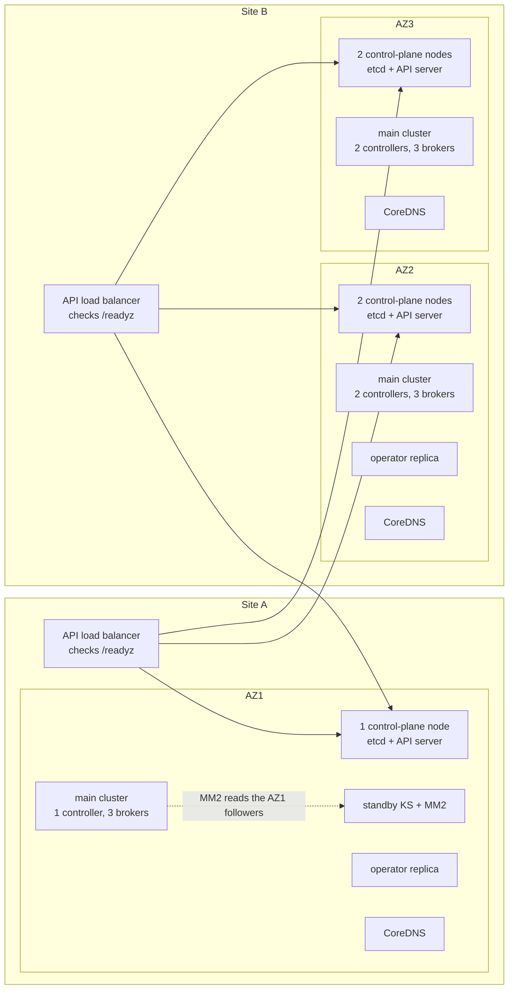

# Platform Design on the Stretched Cluster

On one Kubernetes cluster stretched over two sites, Kafka's availability depends as much on the platform around it as on the broker settings. The etcd layout decides whether Kubernetes survives a site loss. CoreDNS placement decides whether the surviving site can still resolve Kafka's voters. The Strimzi Cluster Operator's placement decides whether anything can be repaired afterwards. This page turns those constraints into settings: the Kubernetes baseline **B0-K8s**, the Kafka and Strimzi baseline **B0-K**, and the harness placement **B0-H**. It also gives the runbooks that the failure matrices call: **R-DRAIN**, **R-SD**, **R-DR**, and the failback after R-DR.

The vocabulary comes from [Topology and Constraints](01-topology-and-constraints.md):

- Site A is one room, AZ1. Site B holds two rooms, AZ2 and AZ3. W is an optional witness location.
- S1–S12 are the scenarios.
- `C 1/2/2`, `E 1/2/2`, `B 3/3/3` and `R 1/1/1` count controllers, etcd members, brokers and replicas per AZ, and `+1W` adds a voter at W.
- RF is the replication factor and m is `min.insync.replicas`. In quorum cells, `m0` and `m1` are the margin: how many more voters the quorum can lose.
- E_X is the number of partitions whose ISR ∪ ELR lies entirely inside domain X.

The architectures A1–A8 are in [Candidate Architectures](02-architectures.md#the-eight-architectures), and the tests T0–T10 are in [Test and Chaos Scenarios](04-test-and-chaos-scenarios.md#the-discriminating-tests). Everything here was checked against Kafka 4.3.1, Strimzi 1.2.0 and Kubernetes 1.34; the [Version & Compatibility Matrix](../book/appendix-d-versions.md) holds the pins. Kubernetes 1.34 reaches end of life on 2026-10-27, so build production on 1.35 or later ([releases](https://kubernetes.io/releases/)).

Node labels used on this page:

- `topology.kubernetes.io/zone=az1|az2|az3|w`. On-premises you set it by hand; only cloud providers set it for you.
- `example.com/site=a|b|w`. Kubernetes has no notion of a site, so this is a custom label, and `example.com/` is a placeholder prefix.
- W nodes carry the taint `example.com/witness=true:NoSchedule`.
- In A4 and A5, nodes also carry `example.com/fault-domain=az1a|az1b|az2|az3|w`, and that label is the chart's `nodePools.defaults.scheduling.zoneKey`, so that a pool can pin to a sub-rack of AZ1.

Commands assume a client shell with the Kafka 4.3.1 scripts, for example the cluster's own image `quay.io/strimzi/kafka:1.2.0-kafka-4.3.1`, and two more things. `BOOTSTRAP` points at a surviving broker or at the `krafter-kafka-bootstrap` Service (`krafter` is the chart's default cluster name). `client.properties` holds the listener's credentials, set up as in the [Kafka Cluster Runbook](../kafka-cluster-runbook.md).

## The Baseline at a Glance

| Area | Baseline | Checked by |
|---|---|---|
| etcd layout | Majority on the same side as the KRaft majority: `E 1/2/2` (A2, A4, A6, A7, A8), `E 1/1/1` (A1, A2b), `E 2/1/1+1W` (A5) | T1, T9 |
| etcd timers | Identical on every member. 100/1000 ms up to 33 ms RTT (recommended) or 66 ms (maximum); above that, 500/2500 ms on every member | T4 |
| API endpoint | Reachable from every site without depending on one site; health check on `/readyz` | T1, T3 |
| CoreDNS | At least 3 replicas, zone spread with `ScheduleAnyway`, no `minDomains`, plus NodeLocal DNSCache | T1, T9 |
| Storage | Zonal block storage, `WaitForFirstConsumer`, no stretched storage | – |
| Tolerations | Node-local PVs: NoExecute tolerations without `tolerationSeconds`. Zonal network storage: a finite value | T3 |
| Cluster Operator | At least 2 replicas, one per site | T1, T2 |
| Drain Cleaner | 2 replicas across sites, deny mode | T8 |
| PodDisruptionBudget | Strimzi's single PDB; planned AZ work through R-DRAIN | T8 |
| Racks | `environment-variable` type with `topologyKey: null`, `KAFKA_RACK` on broker pools | – |
| Cruise Control | RackAwareGoal as a hard goal where RF ≤ racks; RackAwareDistributionGoal for A6-KB and A8's main cluster | – |
| Certificates | The failover DNS alias in `bootstrap.alternativeNames` on both clusters (A6, A7, A8) | T1 |
| Monitoring | E_X, quorum, ISR, etcd, operator and MM2 lag alerts | All |
| Harness | Kates, PostgreSQL, Prometheus and LitmusChaos pinned to the site each test expects to survive | All |

The platform of A7, the recommended design with two sites, looks like this:



## Kubernetes Control Plane (B0-K8s)

### etcd Follows the KRaft Layout

Raft majority arithmetic applies to etcd exactly as it does to KRaft. Voters confined to two sites always leave one site with the majority, and losing that site loses the quorum ([etcd FAQ](https://etcd.io/docs/v3.6/faq/)). So put the etcd majority on the same side as the KRaft majority. If the two majorities sit on opposite sides, every site loss breaks something: losing one site takes down Kubernetes, and losing the other takes down Kafka.

| etcd layout | Used by | N / q | Lose AZ1 (= site A) | Lose AZ2 | Lose AZ3 | Lose site B | Lose W | A∣B split: side that keeps etcd |
|---|---|---|---|---|---|---|---|---|
| `E 1/1/1` | A1, A2b | 3 / 2 | Y 2 (m0) | Y 2 (m0) | Y 2 (m0) | **N** 1 | – | B (m0) |
| `E 1/2/2` | A2, A4, A6, A7, A8 | 5 / 3 | Y 4 (m1) | Y 3 (m0) | Y 3 (m0) | **N** 1 | – | B (m1) |
| `E 2/1/1+1W` | A5 | 5 / 3 | Y 3 (m0) | Y 4 (m1) | Y 4 (m1) | **Y 3 (m0)** | Y 4 (m1) | The side holding the etcd leader, together with W |
| `E 1/1/0+1W` | A5-3v | 3 / 2 | Y 2 (m0) | Y 2 (m0) | Y 3 (m1) | Y 2 (m0) | Y 2 (m0) | The side W follows |
| `E 3/1/1` | A3 (rejected) | 5 / 3 | **N** 2 | Y 4 (m1) | Y 4 (m1) | Y 3 (m0) | – | A |

- **The witness condition.** With N = 2k+1 voters, surviving every single domain requires two things. Each location and each room holds at most k voters, and W reaches A and B over paths that do not pass through the other site. With a single voter at W, this forces n_A = n_B = k. `E 1/1/1+2W` is the two-voter case, and it too survives every single domain.
- **A∣B with W reaching both sides.** etcd 3.6 enables Pre-Vote by default ([configuration](https://etcd.io/docs/v3.6/op-guide/configuration/)). Members that still hear from the leader reject pre-votes, so the side holding the current etcd leader keeps the quorum together with W. KRaft picks its own winner independently. Alert when the two winners differ, because the Kafka side then has no pod lifecycle.
- **Non-voters do not help.** Learners cannot vote, and promoting a learner needs the quorum that was just lost ([learner design](https://etcd.io/docs/v3.6/learning/design-learner/)). kubeadm adds every joining member as a learner (EtcdLearnerMode, GA since 1.32), and etcd allows one learner at a time by default.
- **Kafka can run for hours with Kubernetes down.** KRaft, replication and client traffic over the existing kube-proxy rules need no API server. What does need it: creating or recreating pods, the Strimzi operator (reconciliation, rolls, certificate renewal, the Topic and User Operators), the `topology-label` rack init container, new CoreDNS pods, and Kates. [Topology and Constraints](01-topology-and-constraints.md#etcd-quorum-loss) lists what stops and what keeps working.

### Stacked or External etcd

kubeadm supports two topologies ([HA topology](https://kubernetes.io/docs/setup/production-environment/tools/kubeadm/ha-topology/)):

- **stacked:** every control-plane node runs a local etcd member that talks only to that node's API server;
- **external:** etcd runs on separate hosts, with at least 3 control-plane hosts plus 3 etcd hosts.

Mixing the two, stacked control-plane nodes plus extra etcd-only members, is not a kubeadm topology. Those extra members are managed by hand, outside `kubeadm upgrade` and kubeadm's certificate handling.

| etcd layout | kubeadm-managed options | Not kubeadm-managed |
|---|---|---|
| `E 1/1/1` | 3 stacked control-plane nodes, one per AZ | – |
| `E 1/2/2` | 5 stacked control-plane nodes (1/2/2), or external etcd on 5 hosts (1/2/2) with control-plane hosts in every AZ | 3 stacked control-plane nodes plus 2 etcd-only members |
| `E 2/1/1+1W` | 5 stacked control-plane nodes, with the W node tainted and its API server left out of the API endpoint; or external etcd on 5 hosts, one of them an etcd-only host at W | 4 stacked control-plane nodes plus an etcd-only W |

Five members is Kubernetes' production recommendation ([operating etcd](https://kubernetes.io/docs/tasks/administer-cluster/configure-upgrade-etcd/)). A2b keeps `E 1/1/1` to save two control-plane nodes; Kubernetes then has A1's margins, and the preferred side does not change. kubeadm for Kubernetes 1.34 pins etcd 3.6.5 ([constants.go](https://github.com/kubernetes/kubernetes/blob/release-1.34/cmd/kubeadm/app/constants/constants.go)).

In A5, W hosts one etcd member and one KRaft controller, and either can become leader. The witness requirements:

- **Sizing.** Size W as a full member of each quorum: about 4 vCPU, 12–16 GiB and an SSD with a WAL fsync P99 under 10 ms. The sizing is an estimate.
- **Link.** 100 Mbit/s to 1 Gbit/s to each site, over paths that do not pass through the other site: a tunnel to W that terminates in site B puts W inside B's failure domain.
- **Round-trip time.** The etcd timer table below applies to W's links too: up to 33 ms is recommended and 66 ms is the maximum at the default timers; above that, every member moves to 500 / 2500 ms. There is no Kafka-specific bound.
- **Cluster membership.** W must be a node of the stretched Kubernetes cluster, because Strimzi manages one cluster only. The CNI MTU has to account for any tunnel to W.
- **Restore time.** While W is down, losing either site is fatal, so treat W's restore as a P1.

### etcd Timers and Round-Trip Time

Every member must use the same heartbeat interval and election timeout. The defaults are 100 ms and 1000 ms. etcd's rule of thumb is a heartbeat close to the round-trip time between members and an election timeout of at least 10 × RTT ([tuning](https://etcd.io/docs/v3.6/tuning/)).

| Member RTT, measured P99 | Timers (heartbeat / election) | Basis |
|---|---|---|
| Up to 33 ms | 100 / 1000 ms (the default) | OKD's recommended bound for a 100 ms heartbeat |
| 33–66 ms | 100 / 1000 ms, still allowed | OKD's maximum: 66 ms × 1.5 ≈ 99 ms, just under the heartbeat |
| Above 66 ms, or leader changes caused by missed heartbeats | 500 / 2500 ms (OKD's "Slower" profile) on every member | Validate with T4 before production |

The OKD figures come from [etcd performance](https://docs.okd.io/latest/etcd/etcd-performance.html). OKD also requires the etcd peer round-trip, which is network, disk latency and jitter together, to stay under 100 ms; that figure is not the same as the network RTT.

- **Distribution defaults differ.** K3s and RKE2 ship 500 / 5000 ms ([k3s etcd.go](https://github.com/k3s-io/k3s/blob/master/pkg/etcd/etcd.go)). Every test report must state which etcd timers and which KRaft timers were in effect.
- **Larger timers cost failover time.** etcd randomises each election between one and two election timeouts, so a new leader takes about 1–2 s at 100 / 1000 ms, 2.5–5 s at 500 / 2500 ms and 5–10 s at K3s/RKE2's 500 / 5000 ms.
- **The OKD figures are sizing guidance for the heartbeat, not a predictor of leader changes.** A leader change needs about one election timeout (1 s at the defaults) of missed heartbeats. Take 50 ms of RTT plus T4's 5–10 ms of jitter, 55–60 ms in total: that is above the 33 ms recommendation but under the 66 ms maximum. Expect heartbeat warnings in the etcd log and higher commit latency. Expect leader changes only if loss or jitter starves heartbeats for about a second; TCP retransmission backoff under packet loss can do that. T4 records what etcd does rather than assuming it.

### etcd Disks and Leader Placement

- **Disks.** WAL fsync P99 must stay under 10 ms and backend commit P99 under 25 ms ([etcd FAQ](https://etcd.io/docs/v3.6/faq/)). A slow fsync causes missed heartbeats and leader changes even on a healthy network. Give etcd a dedicated low-latency disk on every control-plane node.
- **Leader placement.** Keep the etcd leader in the preferred site, and in A5 keep it off W. With `E 1/2/2` and the leader in site B, every commit completes inside B (4 members there, q = 3); a leader in AZ1 adds a cross-site round trip to every commit. This is a Raft inference, not a documented etcd recommendation. Move leadership with `etcdctl move-leader` ([etcdctl](https://github.com/etcd-io/etcd/blob/release-3.6/etcdctl/README.md)):

```bash
# kubeadm stacked control plane: etcdctl ships in the etcd static pod.
ETCDCTL="kubectl -n kube-system exec etcd-<control-plane-node> -- etcdctl \
  --cacert /etc/kubernetes/pki/etcd/ca.crt \
  --cert /etc/kubernetes/pki/etcd/server.crt \
  --key /etc/kubernetes/pki/etcd/server.key"
# Which member leads (IS LEADER column), and each member's ID:
$ETCDCTL --endpoints https://127.0.0.1:2379 endpoint status --cluster -w table
# Send the request to the current leader:
$ETCDCTL --endpoints <leader client URL> move-leader <target member ID, hex>
```

KRaft has no leadership-transfer tool in 4.3.1. To move the active controller, for example off W in A5, or off the AZ1 voter in A8 during WAN trouble, restart it gracefully while every other voter is healthy.

### API Endpoint

Kubernetes gives the API endpoint no cross-zone resilience of its own; you provide it with DNS, SRV records or a health-checked load balancer ([running in multiple zones](https://kubernetes.io/docs/setup/best-practices/multiple-zones/)).

- **No dependency on one site.** Run a load-balancer instance in each site, each listing every API server except W's, and point each site's nodes at their local instance. A single load-balancer appliance in site B takes the API away from site A even in A5, where etcd survives.
- **Health check `/readyz`**, not `/livez` or a TCP probe. `/readyz` includes an `etcd` check with a 2 s timeout by default, so it drops an API server whose local etcd member has lost the quorum ([health checks](https://kubernetes.io/docs/reference/using-api/health-checks/)). One example is the AZ1 API server during S7 in A1, A2 and A7.
- **The controllers stop without etcd.** kube-controller-manager and kube-scheduler hold Leases (15 s duration, 10 s renew deadline, 2 s retry) and exit when they cannot renew them ([controllermanager.go](https://github.com/kubernetes/kubernetes/blob/release-1.34/cmd/kube-controller-manager/app/controllermanager.go)). Without etcd there is no node lifecycle, no taint eviction, no scheduling and no EndpointSlice update.
- **A plain `kubectl get` is not proof of health.** Consistent reads need etcd, but `resourceVersion=0` reads can be served stale from the watch cache ([API concepts](https://kubernetes.io/docs/reference/using-api/api-concepts/#semantics-for-get-and-list)). Check `/readyz?verbose` and `etcd_server_has_leader` instead.

## Cluster Services

### CoreDNS and NodeLocal DNSCache

Cluster DNS is on Kafka's data path. Strimzi renders `controller.quorum.voters` and every broker address as pod DNS names on the headless `<cluster>-kafka-brokers` Service ([KafkaBrokerConfigurationBuilder](https://github.com/strimzi/strimzi-kafka-operator/blob/1.2.0/cluster-operator/src/main/java/io/strimzi/operator/cluster/model/KafkaBrokerConfigurationBuilder.java)).

kubeadm deploys CoreDNS with 2 replicas and only a preferred hostname anti-affinity ([manifests.go](https://github.com/kubernetes/kubernetes/blob/release-1.34/cmd/kubeadm/app/phases/addons/dns/manifests.go)). Both replicas can land in site B. A site-B loss then leaves site A unable to resolve new connections once its caches expire; CoreDNS's default record TTL is 5 s. A CoreDNS pod that starts while the API is unreachable waits up to 5 s, then answers SERVFAIL for records it has not synced ([CoreDNS kubernetes plugin](https://github.com/coredns/coredns/blob/master/plugin/kubernetes/README.md)).

- **At least 3 replicas, spread over the zones with `whenUnsatisfiable: ScheduleAnyway` and no `minDomains`.** Avoid `DoNotSchedule` with `minDomains: 3`: whenever fewer than 3 zones are eligible, the global minimum counts as 0. A replica lost with its AZ then cannot be recreated in a surviving zone that already holds one, so after a site-B loss in A5, CoreDNS would run on a single replica ([topology spread](https://kubernetes.io/docs/concepts/scheduling-eviction/topology-spread-constraints/)).
- **`nodeTaintsPolicy: Honor`** keeps the tainted W node, and unreachable nodes, out of the spread calculation.
- **NodeLocal DNSCache on every node,** so cache hits never leave the node ([NodeLocal DNSCache](https://kubernetes.io/docs/tasks/administer-cluster/nodelocaldns/)). Cache misses still need a reachable CoreDNS.
- **Check the placement after every rollout,** because `ScheduleAnyway` prefers a spread without guaranteeing it. Check it again after every `kubeadm upgrade`, which re-applies kubeadm's own CoreDNS manifest.

```yaml
# Patch for the kube-system/coredns Deployment (kubeadm labels its pods k8s-app=kube-dns)
spec:
  replicas: 3
  template:
    spec:
      topologySpreadConstraints:
        - maxSkew: 1
          topologyKey: topology.kubernetes.io/zone
          whenUnsatisfiable: ScheduleAnyway
          nodeTaintsPolicy: Honor
          labelSelector:
            matchLabels:
              k8s-app: kube-dns
```

The table gives CoreDNS replicas per scenario, with 3 replicas placed 1/1/1. A lost replica is recreated only when the API is up, once the default 300 s toleration has run out, 5 min 50 s after its node went silent.

| Scenario | Replicas left at once | After 5 min 50 s |
|---|---|---|
| S3 (AZ1) | 2, in B | 3, in B (the API survives in every design except A3) |
| S4 or S5 (one room of B) | 2 | 3 |
| S6 (site B) | 1, in AZ1 | A5: 3, in site A. Designs with `E 1/1/1` or `E 1/2/2`: still 1 until etcd is recovered (in R-DR for A6, A7 and A8) |
| S7 (A∣B) | Site A 1, site B 2 | Unchanged. The side without etcd answers from its cache only. That running CoreDNS pods keep serving cached records without the API is expected; CoreDNS documents only its startup behaviour |
| S10 (etcd quorum loss) | 3 | 3, cache only; no pod can be recreated |
| S11 (W) | 3 | 3 (no replica runs at W) |

### Network Path, MTU and Bandwidth

- **MTU.** Use the minimum MTU of any path, encapsulation included. Calico's overheads are 20 bytes for IP-in-IP, 50 or 70 for IPv4 or IPv6 VXLAN, and 60 or 80 for IPv4 or IPv6 WireGuard ([Calico MTU](https://docs.tigera.io/calico/latest/networking/configuring/mtu)). Inter-site links often carry a smaller MTU than the rooms. A mismatch shows up as stalls on large batches and TLS handshakes rather than as an outage, and OKD lists it among the failures to test ([OKD span guidance](https://docs.okd.io/latest/etcd/etcd-guidance-span.html)).
- **Bandwidth, per direction.** Add up four flows:
  - synchronous replication: 2P/3 with RF 3 on `R 1/1/1` (A1, A2, A7), or P with RF 4 on `R 2/1/1` (A4, A5);
  - client traffic that crosses the link;
  - MirrorMaker 2: the mirrored share of P, one way, in A6 and A8, and in A7 once the AZ1 followers leave the ISR;
  - catch-up after an outage.

  Producer partitioning is not rack-aware before Kafka 4.4.0. With leaders spread evenly over three AZs, about 2/3 of a site-A producer's bytes go to site B, and about 1/3 of a site-B producer's bytes go to site A. Consumers with `client.rack` read locally while their local replica is in the ISR.
- **A short link first caps throughput.** Every acks=all batch waits for its cross-site ISR member, so producers slow to the link's capacity, P99 rises, and `REQUEST_TIMED_OUT` retries appear. Only when remote followers stay behind for t_lag (30–45 s) do they leave the ISR, and then E_X starts to rise. [Topology and Constraints](01-topology-and-constraints.md#bandwidth-shortage-in-two-phases) describes both phases.
- **Socket buffers.** Raise `socket.send.buffer.bytes`, `socket.receive.buffer.bytes` and `replica.socket.receive.buffer.bytes` to at least the bandwidth-delay product of one connection: 1 Gbit/s × 20 ms ≈ 2.5 MB. The alternative is -1, which hands sizing to the OS; that `replica.socket.receive.buffer.bytes` accepts -1 is unverified. With the 64 KiB replica default, a window model gives one fetcher connection about 3.2 MB/s at 20 ms and 1.3 MB/s at 50 ms. Kafka advises sizing buffers to the bandwidth-delay product on high-latency links ([datacenters.md](https://github.com/apache/kafka/blob/4.3.1/docs/operations/datacenters.md#L37)).

### Measuring the Network

Measure before you choose an architecture:

```bash
# Every kates detect run measures a cross-AZ ping matrix (5 pings per AZ pair:
# min, average, max, jitter); --bench-network adds iperf3 bandwidth sweeps between AZs
kates detect --bench-network
```

`kates detect` gives a spot check, not a P99. For the P99 that the timer table needs, read etcd's own peer round trip over several days:

```promql
histogram_quantile(0.99,
  sum by (le, instance, To) (rate(etcd_network_peer_round_trip_time_seconds_bucket[5m])))
```

T4 then sweeps RTT, loss and bandwidth around the measured values.

## Storage

- **Block storage, zonal.** Strimzi strongly recommends block storage and says replicated storage is not required, because Kafka replicates by itself ([storage considerations](https://github.com/strimzi/strimzi-kafka-operator/blob/1.2.0/documentation/modules/configuring/con-considerations-for-data-storage.adoc)).
- **`volumeBindingMode: WaitForFirstConsumer`.** A volume is provisioned only once its pinned pod is scheduled, in that pod's zone. The default, `Immediate`, can provision a volume in a zone the pod cannot run in ([storage classes](https://kubernetes.io/docs/concepts/storage/storage-classes/#volume-binding-mode)). The alternative is one class per zone restricted with `allowedTopologies`, which the kind lab uses for `local-storage-alpha`, `-sigma` and `-gamma` ([storage-classes.yaml](../../config/storage/storage-classes.yaml)). The topology key must be the one your CSI driver reports.
- **Local volumes** support `WaitForFirstConsumer` only with pre-created PVs; there is no dynamic provisioning.
- **No stretched or replicated storage under Kafka.** A stretched Ceph or ODF needs its own arbiter, for the same quorum reason as etcd. It adds cross-site write latency and makes Kafka no more durable. A pod whose volume sits in a lost domain stays down, which is the intended behaviour.
- **Force-detach.** Kubernetes force-detaches a volume 6 minutes after a pod deletion fails on an unhealthy node ([node shutdown](https://kubernetes.io/docs/concepts/cluster-administration/node-shutdown/#storage-force-detach-on-timeout)). With storage that nodes in both sites can attach, that is a corruption risk during a partition. `disable-force-detach-on-timeout` in kube-controller-manager turns it off, and zonal storage avoids the case.

```yaml
apiVersion: storage.k8s.io/v1
kind: StorageClass
metadata:
  name: kafka-zonal
provisioner: <your CSI driver>
volumeBindingMode: WaitForFirstConsumer
reclaimPolicy: Retain        # a deleted claim leaves its volume behind for recovery
allowVolumeExpansion: true
```

In `charts/kafka-cluster`, `nodePools.defaults.volume.class: kafka-zonal` gives every pool's volumes this class.

## Node Lifecycle and Tolerations

A node that stops responding is tainted `node.kubernetes.io/unreachable:NoExecute` after `node-monitor-grace-period` (50 s). Pods without their own toleration are deleted 300 s later, 5 min 50 s in total ([taints and tolerations](https://kubernetes.io/docs/concepts/scheduling-eviction/taint-and-toleration/)). Three consequences matter here:

- Taint eviction is a plain DELETE that ignores PodDisruptionBudgets.
- The pod object stays Terminating while its kubelet is unreachable, and a StrimziPodSet never replaces a pod whose object still exists.
- A room of 50 nodes or fewer that loses at least 55% of them (and at least 3), but not all, stops evicting altogether ([eviction rate limits](https://kubernetes.io/docs/concepts/architecture/nodes/#rate-limits-on-eviction)).

[Topology and Constraints](01-topology-and-constraints.md#node-failure-timeline) has the full timeline.

Tolerations for the Kafka pools:

| Storage | Tolerations | Why |
|---|---|---|
| Node-local PVs | NoExecute tolerations for `node.kubernetes.io/unreachable` and `node.kubernetes.io/not-ready`, without `tolerationSeconds` | Pinned pods cannot move anyway. Without these tolerations, a partition longer than 5 min 50 s marks every Kafka pod on the far side for deletion, and their kubelets kill them when it heals: a restart wave |
| Zonal network storage | The same two keys with a finite `tolerationSeconds` | A pod on a node whose kubelet still runs but reports NotReady is deleted and recreated on another node of the same AZ, and its volume follows. On an unreachable node nothing moves until the out-of-service taint (see [Rebuilding a Broker on a Dead Node](#rebuilding-a-broker-on-a-dead-node)) |

```yaml
# charts/kafka-cluster: every pool inherits this list
nodePools:
  defaults:
    scheduling:
      tolerations:
        - {key: node.kubernetes.io/unreachable, operator: Exists, effect: NoExecute}
        - {key: node.kubernetes.io/not-ready, operator: Exists, effect: NoExecute}
```

Helm replaces lists: a pool that sets its own `scheduling.tolerations`, such as A5's `controllers-w` with the witness toleration, must repeat both entries.

Everything else keeps the default 300 s, so that it moves to the surviving site: CoreDNS, the operator, Drain Cleaner, Kates and unpinned applications. It moves only while the API is up, and the surviving site needs the capacity to absorb it.

## Kafka and Strimzi Baseline (B0-K)

### Node Pools and Pinning

1. **Dedicated controller pools, one per location:** `controllers-az1`, `-az2` and `-az3`, plus `controllers-w` in A5. A4 and A5 split AZ1 into `controllers-az1a` and `-az1b`. Use no dual-role nodes, for three reasons:
   - Kafka advises against combined mode in critical deployments;
   - Strimzi 1.2.0 does not support changing a controller pool later (item 8), so a dual-role pool could never be resized;
   - rolling a dual-role broker also rolls a voter.

   Keep the voter count odd; Strimzi warns on 2 controllers or any even count.
2. **Pin every pool, controllers included,** with `zone:`. It renders a required nodeAffinity on `nodePools.defaults.scheduling.zoneKey` and a `zone` pod label ([chart README](../../charts/kafka-cluster/README.md#node-pools)). Three things stand in the way:
   - the pools in `values-prod.yaml` are not pinned;
   - `kates detect --generate-values` writes `C 1/1/1` with one broker per zone, in the 0.4 keys;
   - `values-prod.yaml` clears those keys (`controllerPools: []`, `brokerPools: []`).

   Write `nodePools.pools` explicitly, in an overlay layered after `values-prod.yaml`, because Helm replaces lists.
3. **One broker pool per rack, with equal broker counts.** KRaft's replica placer gives a rack with fewer brokers more replicas per broker.
4. **Two controllers in one AZ run on different hosts.** That applies to AZ2 and AZ3 in A2, A4, A7 and A8, to AZ2 in A6's site-B cluster (KB), to AZ1 in A5-r3, and to the three controllers of every single-room cluster in AZ1 (A6's KA, the standby KS of A7 and A8). The chart renders only a preferred hostname anti-affinity between all controllers; add a required one through the pool's raw `template`. `helm template` renders both rules side by side.
5. **A `site` pod label on every pool,** added through the raw `template.pod.metadata.labels`, so that site-wide selectors such as `strimzi.io/cluster=krafter,site=b` work.
6. **Pool names.** `brokers-az1…` sorts before `controllers-*`. Kates `cmdProbes` exec into the alphabetically first Kafka pod, which for a site-B test must be a broker in site A. A8's main cluster has no broker in AZ1, so do not rely on `cmdProbes` for site-B tests there.
7. **Node IDs (optional).** Per-AZ ranges within 0–999 make placement visible in pod names:

   | Nodes | AZ1 | AZ2 | AZ3 | W |
   |---|---|---|---|---|
   | Controllers | 1x | 2x | 3x | 9x |
   | Brokers | 1xx (A4 and A5: az1a 100–149, az1b 150–199) | 2xx | 3xx | – |

   The ranges are set through `strimzi.io/next-node-ids`, which must be on the pool before its first reconcile. The chart renders only `helm.sh/resource-policy` on a KafkaNodePool, so this needs a chart extension.
8. **The controller layout is final with Strimzi 1.2.0.** Strimzi does not support adding, removing, renaming, scaling or re-roling a controller pool, and it does not prevent it either: the edit rewrites the static voter set on the next roll. Install the admission guard from [Topology and Constraints](01-topology-and-constraints.md#controller-pool-changes-are-unsupported-and-not-prevented) once the cluster is Ready. A future Strimzi release with dynamic quorums (the open [proposal #203](https://github.com/strimzi/proposals/pull/203)) could allow an in-place re-layout; until then, the only way to a new layout is a new cluster and an MM2 migration.

[Candidate Architectures](02-architectures.md#how-the-values-sketches-are-written) gives the pinned `nodePools.pools` overlay of every architecture, for example the [A1 sketch](02-architectures.md#a1-values-sketch), which A2 and A7 extend with two controllers per site-B room and a required host anti-affinity ([A2 sketch](02-architectures.md#a2-values-sketch)). Combine it with the storage class from [Storage](#storage) (`nodePools.defaults.volume.class`) and the tolerations from [Node Lifecycle and Tolerations](#node-lifecycle-and-tolerations).

### Racks

Use `kafka.rack` of type `environment-variable`, with `KAFKA_RACK` set in `template.kafkaContainer.env` of every broker pool.

- **No API call at pod start.** The default `topology-label` type runs an init container that reads the node's labels through the Kubernetes API whenever a pod sandbox is created, which ties every broker start to a working API.
- **No per-cluster ClusterRoleBinding** (`strimzi-<namespace>-<cluster>-kafka-init`).
- **Only broker pools need the variable.** Strimzi writes `broker.rack` only for nodes with the broker role, so controller-only pools never read it; setting it there is harmless ([KafkaBrokerConfigurationBuilder](https://github.com/strimzi/strimzi-kafka-operator/blob/1.2.0/cluster-operator/src/main/java/io/strimzi/operator/cluster/model/KafkaBrokerConfigurationBuilder.java)).
- **No affinity from Strimzi.** In this mode Strimzi adds no affinity of its own, so placement comes entirely from the pool pins.
- **Null the chart's key.** Helm merges maps key by key, so set `topologyKey: null`. Otherwise the rendered rack keeps the chart's `topologyKey`: Strimzi ignores it, but `kates cluster topology` reports it as the rack-awareness key.
- **One rack level.** Rack IDs finer than an AZ (az1a and az1b in A4 and A5) work with either type; the placer knows one rack level only.
- **Match `client.rack`.** The rack string must equal the `client.rack` that local consumers, MM2 and Kafka Connect use.
- **Switching rolls every broker.** Changing the type changes every broker's `broker.rack` setting, so do it with every AZ up.

### Broker and Topic Settings

| Setting | Value | Why |
|---|---|---|
| `unclean.leader.election.enable` | `false` | An unclean election loses data, and it needs a quorum anyway. It does not switch off the automatic last-known-leader election (see [When a Lost Domain Returns](#when-a-lost-domain-returns)) |
| `min.insync.replicas`, `default.replication.factor` | As the architecture specifies, always set explicitly | If `min.insync.replicas` is removed from the Kafka resource, Strimzi resets it to 1 |
| `offsets.topic.replication.factor`, `transaction.state.log.replication.factor`, `transaction.state.log.min.isr` | RF, RF and m | Internal topics follow the data topics. `__consumer_offsets` has no min ISR of its own and takes the cluster m |
| `topics.defaults.replicas` (chart) | 4 in A4, A5, A6-KB, A7-d and A8 | The chart defaults to min(brokers, 3). RF 3 cannot give the R 2/1/1 or 2+2 layout these designs rely on |
| `topics.defaults.config.min.insync.replicas` (chart) | The architecture's m: 3 in A4 and A7-d | When it is unset, the chart gives every KafkaTopic a topic-level m of RF − 1, clamped to 1–2, which is 2 for RF 4 |
| `replica.selector.class` | `org.apache.kafka.common.replica.RackAwareReplicaSelector` | Fetch from follower; the chart does not set it |
| `num.replica.fetchers` | At least 3 (the chart sets 3) | More connections share the cross-site replication |
| Socket buffers | At least the bandwidth-delay product | See [Network Path, MTU and Bandwidth](#network-path-mtu-and-bandwidth) |
| `broker.session.timeout.ms`, `broker.heartbeat.interval.ms` | 9000 and 2000, set explicitly | Pins t_f ≈ 9–10 s in the resource; Strimzi accepts both keys |

The chart refuses m = RF when RF > 1, and it accepts RF 4 with m 3.

### KRaft Timers and Feature Check

- **Timers.** Keep the chart's quorum timers of 5000 / 10000 / 5000 ms (`controller.quorum.election.timeout.ms`, `controller.quorum.fetch.timeout.ms`, `controller.quorum.election.backoff.max.ms`). They give t_c ≈ 10–20 s and t_r = 15 s. The faster set, 2000 / 4000 / 2000 ms (t_c ≈ 4–8 s, t_r = 6 s), is a candidate only. Adopt it after T4, run at the measured RTT P99 plus 50 ms of jitter, shows zero KRaft elections.
- **The fetch timeout also drives Strimzi's rolls.** The KafkaRoller counts a controller as caught up when it lags the leader by less than `controller.quorum.fetch.timeout.ms`. [Kafka Deployment Engineering](../book/15-kafka-deployment.md#kraft-quorum-tuning) explains the chart's choice.
- **Features.** Verify them on the running cluster:

```bash
kafka-features.sh --bootstrap-server "$BOOTSTRAP" --command-config client.properties describe
# Expect eligible.leader.replicas.version finalized at 1,
# and kraft.version at 0: a static quorum, as Strimzi 1.2.0 formats it.
```

Strimzi formats storage with the Kafka resource's metadata version ([kafka_run.sh](https://github.com/strimzi/strimzi-kafka-operator/blob/1.2.0/docker-images/kafka-based/kafka/scripts/kafka_run.sh#L55-L62)). The chart pins it at `4.2-IV1`, where ELR v1 is the default, so a fresh cluster from this chart has ELR on. An upgraded cluster may not. Every RPO statement in this set depends on ELR, so if the feature shows 0, upgrade it with `kafka-features.sh --bootstrap-server "$BOOTSTRAP" --command-config client.properties upgrade --feature eligible.leader.replicas.version=1`. Keep the metadata version one step behind the Kafka version, as the chart does, so that a rollback stays possible.

### Cluster Operator

The operator is not on Kafka's data path: running pods keep serving while it is down. It is, however, the only thing that recreates Kafka pods, rolls them and renews their certificates.

- **At least 2 replicas with leader election.** The Lease `strimzi-cluster-operator` has a 15 s duration, a 10 s renew deadline and a 2 s retry. A standby takes over in about 15 s. A single replica on a lost node returns only after the 5 min 50 s eviction plus rescheduling, about 6 min. The chart default is 1 ([values.yaml](../../charts/strimzi-operator/values.yaml)). Either way it needs the API: in S6 with `E 1/2/2`, no replica can act until etcd is recovered.
- **One replica per site, none at W.** The witness taint keeps it off W. With a required anti-affinity on `example.com/site`, also change the rollout strategy. With 2 replicas, the Deployment's default strategy rounds to maxSurge 1 and maxUnavailable 0; the surge pod finds no free site and the rollout never completes.
- **Operation timeout.** `charts/strimzi-operator` sets `operationTimeoutMs: 900000`, against Strimzi's default of 300000. That is how long the KafkaRoller waits for a pod that never becomes Ready, so a reconcile that meets a pod on a dead node takes 15 min to fail.
- **Make no Kafka resource changes during a site incident.**

```yaml
# charts/strimzi-operator overlay
strimzi-kafka-operator:
  replicas: 2
  affinity:
    podAntiAffinity:
      requiredDuringSchedulingIgnoredDuringExecution:
        - labelSelector:
            matchLabels:
              name: strimzi-cluster-operator
          topologyKey: example.com/site
  deploymentStrategy:
    type: RollingUpdate
    rollingUpdate:
      maxSurge: 0
      maxUnavailable: 1
```

### What the KafkaRoller Does During an Outage

The roller handles unready controllers first, then ready controllers (the active one last), then brokers, one pod at a time. It restarts a controller only if ⌈(N+1)/2⌉ controllers stay caught up without it. It does not restart a broker if any partition it hosts sits at ISR = m with the broker in the ISR, or already below m ([KafkaRoller](https://github.com/strimzi/strimzi-kafka-operator/blob/1.2.0/cluster-operator/src/main/java/io/strimzi/operator/cluster/operator/resource/KafkaRoller.java), [KafkaAvailability](https://github.com/strimzi/strimzi-kafka-operator/blob/1.2.0/cluster-operator/src/main/java/io/strimzi/operator/cluster/operator/resource/KafkaAvailability.java)).

During an AZ outage or a drain, the pinned pods of that AZ make every reconciliation fail, whatever the quorum margin:

- a Pending, unschedulable pod ends the roll with "Pod is unschedulable or is not starting";
- a pod on a dead node is awaited for the operation timeout, restarted, and never comes back;
- brokers are rolled only after every controller has succeeded.

So while any pinned pod is Pending or on a dead node, the Kafka resource stays NotReady. No broker roll can complete in any design: no configuration change, and no CA-renewal roll either. The chart starts CA renewal 180 days before expiry (`renewalDays`), inside `maintenanceTimeWindows` if you set any, so check the certificate dates before a long drain.

The margin 1 of A2 and A7 lets the quorum check pass for a site-B controller during an AZ1 outage. Whether the roller actually reaches that controller is unverified; [T2](04-test-and-chaos-scenarios.md#t2-sustained-loss-of-az1-then-a-controller-roll-in-site-b) checks it. `StrimziReconciliationsFailing` fires after 30 min of this, which is expected during every AZ outage and drain.

### Drain Cleaner

In deny mode (the chart default), Drain Cleaner rejects the eviction of a Kafka pod and annotates the pod with `strimzi.io/manual-rolling-update`. The operator then moves the pod with its own ISR and quorum checks.

- **Two replicas, one per site.** `values-prod.yaml` of `charts/strimzi-operator` runs 2 replicas with a PDB. The webhook uses `failurePolicy: Ignore`: if both pods are lost, every eviction goes through, guarded only by Strimzi's PDB.
- **Preferred, not required, site anti-affinity.** The chart exposes no rollout strategy for Drain Cleaner, and a required rule would strand its surge pod, as with the operator.
- **It does not help an AZ drain.** Rolls driven by Drain Cleaner stall on a Pending pod, like every other roll; R-DRAIN deletes pods directly instead.

```yaml
# charts/strimzi-operator overlay (replaces the chart's default hostname rule)
drainCleaner:
  affinity:
    podAntiAffinity:
      preferredDuringSchedulingIgnoredDuringExecution:
        - weight: 100
          podAffinityTerm:
            labelSelector:
              matchLabels: {app: strimzi-drain-cleaner}
            topologyKey: example.com/site
        - weight: 50
          podAffinityTerm:
            labelSelector:
              matchLabels: {app: strimzi-drain-cleaner}
            topologyKey: kubernetes.io/hostname
```

### PodDisruptionBudget Options

Strimzi creates one PDB for every Kafka pod of a cluster, controllers and brokers of all pools together. The chart's `maxUnavailable: 1` becomes minAvailable = pods − 1: 13 of 14 pods in A2, for example.

| Option | Effect | Use it when |
|---|---|---|
| Strimzi's single PDB (default) | During an AZ outage, the AZ's pods already count as unavailable, so every voluntary eviction of a Kafka pod anywhere is blocked | Always, together with R-DRAIN for planned AZ work |
| `strimzi-kafka-operator.generatePodDisruptionBudget: false` plus your own PDB per pool | Sets `STRIMZI_POD_DISRUPTION_BUDGET_GENERATION=false`. It is operator-wide: with a cluster-wide operator it removes the generated PDBs of every Kafka, Connect, MirrorMaker 2 and Bridge cluster. One eviction per pool at a time also means one per AZ in parallel, which can take two replicas of a partition, or two voters, at once | Only if drains are serialized per AZ by process |

A PDB limits only voluntary evictions; taint eviction ignores it. Whether Strimzi 1.2.0 lets you set `unhealthyPodEvictionPolicy` on its PDB is unverified. On your own PDBs, Kubernetes recommends `AlwaysAllow`.

### Cruise Control

`charts/kafka-cluster` lists RackAwareGoal first in the rebalance templates, and Strimzi makes it a hard goal. RackAwareGoal needs a distinct rack for every replica, and it fails when RF exceeds the number of racks that are alive.

| Layout | Goal | While a rack is down |
|---|---|---|
| RF 3 on 3 racks (A1, A2, A3, A7, A5-r3) | RackAwareGoal, the chart default | Every rebalance fails, which is what you want |
| RF 4 on 4 racks (A4, A5) | RackAwareGoal | Every rebalance fails while any sub-rack is down |
| RF 4 on 2 racks (A6-KB, A8's main cluster) | RackAwareDistributionGoal, replacing RackAwareGoal in the goals and in `hard.goals` | RackAwareGoal would fail even with every rack up |
| RF 3 in one room (A6's KA, the standby KS of A7 and A8) | RackAwareGoal, over host-group racks inside AZ1 (see [Standby Cluster Placement](#standby-cluster-placement-a6-a7-a8)) | With a single rack ID such as `az1` for every broker, RackAwareGoal fails even with every broker up, and so does every auto-rebalance |

```yaml
# charts/kafka-cluster overlay for A6-KB and A8: RackAwareDistributionGoal
# replaces RackAwareGoal among Strimzi's default hard goals
cruiseControl:
  config:
    hard.goals: >-
      com.linkedin.kafka.cruisecontrol.analyzer.goals.RackAwareDistributionGoal,
      com.linkedin.kafka.cruisecontrol.analyzer.goals.ReplicaCapacityGoal,
      com.linkedin.kafka.cruisecontrol.analyzer.goals.DiskCapacityGoal,
      com.linkedin.kafka.cruisecontrol.analyzer.goals.NetworkInboundCapacityGoal,
      com.linkedin.kafka.cruisecontrol.analyzer.goals.NetworkOutboundCapacityGoal,
      com.linkedin.kafka.cruisecontrol.analyzer.goals.CpuCapacityGoal
rebalance:
  goals:
    - com.linkedin.kafka.cruisecontrol.analyzer.goals.RackAwareDistributionGoal
    - com.linkedin.kafka.cruisecontrol.analyzer.goals.ReplicaCapacityGoal
    - com.linkedin.kafka.cruisecontrol.analyzer.goals.DiskCapacityGoal
    - com.linkedin.kafka.cruisecontrol.analyzer.goals.NetworkInboundCapacityGoal
    - com.linkedin.kafka.cruisecontrol.analyzer.goals.NetworkOutboundCapacityGoal
    - com.linkedin.kafka.cruisecontrol.analyzer.goals.CpuCapacityGoal
    - com.linkedin.kafka.cruisecontrol.analyzer.goals.TopicReplicaDistributionGoal
    - com.linkedin.kafka.cruisecontrol.analyzer.goals.LeaderBytesInDistributionGoal
```

- **Capacity.** Set `cruiseControl.brokerCapacity` to the real network capacity; the chart's 50 MiB/s is a placeholder, and the network goals are hard goals.
- **Throttle.** Throttle every reassignment that crosses the WAN with `rebalance.replicationThrottle` (bytes/s; 0 means unlimited).
- **Outages.** Run no rebalance and create no topic during an outage; where KRaft's placer puts new replicas while a rack is down is unverified.
- **A lower pool count is a real broker removal.** `cruiseControl.autoRebalance` runs `remove-brokers` whenever a broker pool's `replicas` drops, and the operator removes the broker once it is empty. Kates `SCALE_DOWN` lowers that value, so it is a persistent, destructive broker removal, not an AZ-outage fault ([Scaling Down a Node Pool](../book/07-chaos-practice.md#scaling-down-a-node-pool)). On Kafka 4.3, Strimzi 1.2.0 cordons the brokers being removed, so no new replicas land on them while they drain.

### Standby Cluster Placement (A6, A7, A8)

- **The standby is its own cluster.** In A7 and A8, KS is a second Kafka resource, `<cluster>-dr`, in its own namespace; in A6 the standby is the site-A cluster KA, fed from KB. Pin every pool to AZ1: 3 controllers on separate hosts and at least 3 brokers sized for 100% of peak load. Keep its brokers off the hosts of the main cluster's AZ1 brokers. Its quorum lives in one room and has no AZ-level protection.
- **Racks are host groups.** Give the standby one broker pool per host group inside AZ1, each with its own `KAFKA_RACK` (for example `az1-g1`, `az1-g2`, `az1-g3`), so that RF 3 lands on three host groups and RackAwareGoal can hold. To pin the pools, label only AZ1's nodes with a host-group key such as `example.com/host-group=az1-g1`, make that key the standby release's `nodePools.defaults.scheduling.zoneKey`, and set `zone: az1-g1` on the pool: each pool then stays on its group, and so in AZ1.
- **Pin its other operands too.** Put the standby's Entity Operator, Cruise Control and Kafka Exporter in AZ1 as well, through `entityOperator.template`, `cruiseControl.template` and `kafkaExporter.template` (Strimzi pod templates). A promotion needs the standby's User and Topic Operators, so they must not die with site B.
- **Pin the mirror.** Pin 2 MM2 workers with `charts/mirror-maker2`: `nodeSelector: {topology.kubernetes.io/zone: az1}`, which the chart renders as a required node affinity. In A7, add `rack.clientRack: az1`, which sets the source consumer's `client.rack`: MM2 then reads the AZ1 follower replicas and adds no WAN traffic while AZ1 is in the ISR.
- **Shared CAs and users.** Both Kafka resources share one custom cluster CA and one custom clients CA (`kafka.clusterCa.generateCertificateAuthority: false`, the same for `clientsCa`, with the CA Secrets provided as Strimzi's custom-CA procedure describes). Identical KafkaUsers exist on both. That two Strimzi clusters can share one custom CA this way is unverified; prove it in a DR drill.
- **Producer ACLs on the standby stay closed until promotion.**
- **AZ1 carries the DR cover.** Draining or losing AZ1 removes it.

### Listener Certificates for a DNS Alias

Clients that fail over (A6, A7, A8) bootstrap through a DNS alias managed outside Kubernetes, with a TTL of 60 s or less. A TLS client with hostname verification accepts the alias only if it appears in the broker certificates. Strimzi puts it there through the listener's `configuration.bootstrap.alternativeNames`; sharing the CAs alone does not make the alias valid. Set it on the client listener of both the main and the standby Kafka resource, and test it in [T1](04-test-and-chaos-scenarios.md#t1-sustained-loss-of-site-b).

```yaml
# charts/kafka-cluster, in both the main and the standby release
kafka:
  externalAccess:
    type: nodeport                 # the TLS listener values-prod.yaml enables
    tls: true
    configuration:
      bootstrap:
        alternativeNames:
          - kafka.example.com      # the failover alias
```

For clients inside Kubernetes on an internal TLS listener, add the same `configuration` to that listener in `kafka.listeners`. Restate the whole list there, because Helm replaces lists.

## Monitoring

### Site Exposure E_X

**E_X is the number of partitions, internal topics included, whose ISR ∪ ELR lies entirely inside domain X.** The ELR is empty whenever the ISR is at or above m, so for a healthy partition the test is simply "ISR inside X". Counting the ELR as well keeps under-min-ISR partitions out: their former ISR members outside X still hold every committed record, so they expose nothing.

- **Domains.** For A1–A5 and A7, the domains are sites A and B. For A6-KB and A8's main cluster, whose replicas all sit in site B, they are rooms AZ2 and AZ3.
- **Steady state.** E_X must be 0 in steady state. Alert when it stays above 0 for 60 s.
- **Expected above 0.** During an AZ1 drain (E_B = 100% in A1, A2, A5, A5-r3 and A7), during the second phase of a WAN shortage, and on the serving side during S7 and S8.
- **You compute it yourself.** Neither Kafka nor Kates provides it.

A script can compute it from the brokers' racks and the topic descriptions. Use the 4.3.1 scripts: their `kafka-topics.sh --describe` output carries the `Elr:` field. The kates-tester image ships the 3.7.0 scripts.

```bash
# 1. Once, with every broker up: broker ID -> domain.
#    Sites for A1-A5 and A7 (az1, az1a and az1b are site a).
#    For A6-KB and A8, print "$1, $2" to keep the rack itself as the domain.
kafka-broker-api-versions.sh --bootstrap-server "$BOOTSTRAP" --command-config client.properties \
  | sed -n 's/.*(id: \([0-9]*\) rack: \([^ ]*\) .*/\1 \2/p' | sort -n \
  | awk '{ print $1, ($2 ~ /^az1/ ? "a" : "b") }' > domains.txt

# 2. Every 15 s: partitions whose ISR and ELR sit inside one domain.
kafka-topics.sh --bootstrap-server "$BOOTSTRAP" --command-config client.properties --describe \
  | awk -F'\t' -v map=domains.txt '
      BEGIN { while ((getline l < map) > 0) { split(l, f, " "); dom[f[1]] = f[2]; e[f[2]] = 0 } }
      /Partition: / {
        ids = ""
        for (i = 1; i <= NF; i++)
          if ($i ~ /^(Isr|Elr): /) { v = $i; sub(/^[A-Za-z]+: /, "", v); if (v != "N/A") ids = ids "," v }
        n = split(ids, id, ","); d = ""; one = 1
        for (j = 1; j <= n; j++) {
          if (id[j] == "") continue
          x = (id[j] in dom) ? dom[id[j]] : "unmapped"
          if (d == "") d = x; else if (x != d) one = 0
        }
        if (d != "" && one) e[d]++
      }
      END { for (d in e) printf "kafka_site_exposure_partitions{domain=\"%s\"} %d\n", d, e[d] }'
```

Publish the output through whatever your Prometheus scrapes: a node-exporter textfile collector, a Pushgateway or a small exporter. Run it from a pod in each site, so that the metric outlives either site; a leaderless partition, with an empty ISR and ELR, is not counted, because `OfflinePartitionsCount` already reports it. The metric name is yours to choose, and the rule below assumes `kafka_site_exposure_partitions`. Hold it for 60 s (`for: 60s`) in a PrometheusRule:

```promql
max by (domain) (kafka_site_exposure_partitions) > 0
```

### Alert Set

`charts/kafka-cluster` ships the Kafka alerts below and `charts/strimzi-operator` the Strimzi ones; each links to its [Kafka Cluster Runbook](../kafka-cluster-runbook.md) entry. The table adds what each alert means on this topology.

| Signal | Alert | Meaning on the stretched cluster |
|---|---|---|
| `ActiveControllerCount`, summed over every controller | [KafkaActiveControllerCount](../kafka-cluster-runbook.md#kafkaactivecontrollercount) (sum ≠ 1 for 3 min) | 0 means no quorum anywhere, and the time spent at 0 is t_c. On the minority side of a split, an old leader keeps 1 until it resigns after t_r (15 s) |
| raft `current-leader`, `current-epoch`, `current-state`, `commit-latency-avg` | [KafkaRaftLeaderElections](../kafka-cluster-runbook.md#kafkaraftleaderelections) (more than 3 epoch changes in 15 min) | Which side leads, election churn, and metadata latency across the WAN. In A5 and A8, also alert when W's or AZ1's voter leads during WAN trouble |
| `OfflinePartitionsCount`, `FencedBrokerCount` | [KafkaOfflinePartitions](../kafka-cluster-runbook.md#kafkaofflinepartitions), [KafkaFencedBrokers](../kafka-cluster-runbook.md#kafkafencedbrokers) | Exposure turned into offline partitions, and which side lost a split |
| `UnderMinIsrPartitionCount`, `AtMinIsrPartitionCount` | [KafkaUnderMinIsrPartitions](../kafka-cluster-runbook.md#kafkaunderminisrpartitions) | Writes blocked, or zero margin: every partition is at m after any AZ loss in A1, A2 and A7 |
| `IsrShrinksPerSec`, `UnderReplicatedPartitions`, replica fetcher `MaxLag` | [KafkaISRShrinkRate](../kafka-cluster-runbook.md#kafkaisrshrinkrate), [KafkaUnderReplicatedPartitions](../kafka-cluster-runbook.md#kafkaunderreplicatedpartitions) | WAN stress, and the second phase of a shortage |
| `UncleanLeaderElectionsPerSec`, `ElectionFromEligibleLeaderReplicasPerSec` | [KafkaUncleanLeaderElection](../kafka-cluster-runbook.md#kafkauncleanleaderelection) | Stays 0, except for the automatic last-known-leader elections after a correlated restart of a domain with E_X > 0 (see [When a Lost Domain Returns](#when-a-lost-domain-returns)) |
| E_X | The rule above | RPO exposure before the event |
| `etcd_server_has_leader`, `etcd_server_leader_changes_seen_total`, P99 of `etcd_network_peer_round_trip_time_seconds`, `etcd_disk_wal_fsync_duration_seconds` and `etcd_disk_backend_commit_duration_seconds` | Your etcd rules | The Kubernetes side of every scenario |
| `/readyz?verbose` | Your API load balancer | API health per site |
| Cluster Operator | [StrimziOperatorDown](../kafka-cluster-runbook.md#strimzioperatordown), [StrimziReconciliationsFailing](../kafka-cluster-runbook.md#strimzireconciliationsfailing) | The second fires during every AZ outage and drain, which is expected |
| MM2 source consumer `records-lag-max`; `MirrorMaker2NoRecordsReplicated`; `checkpoint-latency-ms` | `charts/mirror-maker2` alerts, plus a consumer-lag rule of your own | RPO of A6, A7 and A8. A7's target is an MM2 lag P99 ≤ 5 s, with an alert above 30 s |

MirrorMaker 2's `replication-latency-ms` and `record-age-ms` update only while records flow, so they cannot see a stalled mirror. Base the RPO alert on the source consumer's lag, and keep the chart's `MirrorMaker2NoRecordsReplicated` rule as the no-progress alert (the chart leaves it out while a cutover or failover overlay stops the source connector). The chart's metrics ConfigMap exports the source consumer's per-topic fetch metrics but not its lag, so you need a JMX exporter rule for the lag. For the checkpoint connector, the metric is `checkpoint-latency-ms`; MirrorMaker 2 has no "checkpoint age" metric.

## Where to Run the Test Harness (B0-H)

- **Pin the harness to the survivors.** Pin Kates, its PostgreSQL, Prometheus and the Litmus operator to the site each test expects to survive. The Kates chart's defaults are unpinned, with one replica. A harness in the lost site dies with it. The faults it injected are cleaned up only by orphan recovery at its next start, and only once they are 15 min old.
- **Partition tests need both sites.** For S7 tests (T3), run one Kates per site, each with its own INTEGRITY workload.
- **Set the real cluster name** in `KATES_CHAOS_KAFKA_CLUSTER`.
- **One Kates per chaos provider.** Use the direct backend (`kubernetes`) for simultaneous kills, and Litmus (`litmus-crd`) for network faults. The provider is fixed for the life of the process.
- **Kates needs the Kubernetes API.** Without an etcd quorum, disruption plans are rejected with "No broker pods found". Start an INTEGRITY workload (`kates test apply`) before an outage that you create outside Kates: it measures `lostRecords` and the client-side RTO without the API.
- **Pod kills do not hold a zone down,** because StrimziPodSets recreate killed pods within seconds. Sustained S3 and S6 need power-off or a firewall, and [What Needs Infrastructure](04-test-and-chaos-scenarios.md#what-needs-infrastructure) in Test and Chaos Scenarios shows how.

```yaml
# charts/kates overlay for a harness in site A
nodeSelector:
  example.com/site: a
postgresql:
  nodeSelector:
    example.com/site: a
extraEnv:
  - name: KATES_CHAOS_KAFKA_CLUSTER
    value: krafter
  - name: KATES_CHAOS_PROVIDER
    value: kubernetes
```

In `charts/monitoring`, pin Prometheus with `kube-prometheus-stack.prometheus.prometheusSpec.nodeSelector`.

## Runbooks

### R-DRAIN: Planned Drain of One AZ

S12 needs its own procedure because `kubectl drain` cannot empty an AZ. Strimzi's single PDB allows one Kafka pod down at a time. A pinned pod evicted from a cordoned AZ cannot reschedule, because its zone is cordoned and its PV is bound there. So it stays Pending, and the PDB blocks every further eviction. That makes `kubectl drain -l topology.kubernetes.io/zone=azN --timeout=10m`, which hangs after the first Kafka pod, the negative control in [T8](04-test-and-chaos-scenarios.md#t8-planned-drain-of-each-az).

What a drain leaves, per architecture:

| Architecture | Drain AZ1 | Drain AZ2 or AZ3 |
|---|---|---|
| A1 | KRaft 2/3 (m0). ISR = m. E_B = 100% | KRaft 2/3 (m0). ISR = m |
| A2 | 4/5 (m1). ISR = m. E_B = 100% | 3/5 (m0). ISR = m |
| A3 | **2/5: no quorum.** A planned outage of Kafka and of the Kubernetes API | 4/5 (m1). ISR = m |
| A4 | 4/5 (m1), but writes are Blocked (ISR 2 < m 3) unless an R-SD is planned | 3/5 (m0). ISR 3 = m |
| A5 | 3/5 (m0). ISR 2 = m. E_B = 100%. W must be healthy | 4/5 (m1). ISR 3 |
| A5-a topics (m 3) | Blocked unless an R-SD is planned | 4/5 (m1). ISR 3 = m |
| A5-r3 | 3/5 (m0). ISR = m. E_B = 100% | 4/5 (m1). ISR 2 = m |
| A6 | KA, the DR copy, offline | AZ2: KB loses its quorum, so the drain is a planned failover. AZ3: KB 2/3 (m0), and the 2 AZ2 replicas = m |
| A7 | As A2, and KS and MM2 stop too: drain AZ1 only while site B is healthy | As A2 |
| A8 | Trivial: one controller and KS | 3/5 (m0). The 2 AZ3 replicas = m, with ×2 load on AZ3 |

> [!IMPORTANT]
> While any pinned pod of the drained AZ is Pending, the Kafka resource stays NotReady and every reconcile fails, in every design. No configuration change and no CA-renewal roll completes until the AZ is back.

Steps:

1. **Preconditions.**
   - URP (`UnderReplicatedPartitions`) = 0 and E_X = 0.
   - The row above keeps a quorum margin of at least 0; in A5, W is healthy.
   - No Kafka resource change is pending, and no CA renewal falls in the window: every reconcile fails while a pinned pod is Pending.
2. **Cordon the AZ.**

   ```bash
   NS=kafka; CLUSTER=krafter; ZONE=az2
   kubectl cordon -l topology.kubernetes.io/zone=$ZONE
   ```

3. **Freeze Kafka resource changes.** The KafkaRoller already holds broker rolls while the ISR sits at m. Pausing reconciliation is optional (`kubectl -n $NS annotate kafka $CLUSTER strimzi.io/pause-reconciliation=true`); whether it also stops StrimziPodSet recreation on 1.2.0 is unverified.
4. **Delete that AZ's Kafka pods one at a time,** with a normal, graceful delete, so that controlled shutdown completes within `terminationGracePeriodSeconds` (Strimzi's default is 30 s).
   - Before the next delete, wait until the broker's leaderships have moved: its `LeaderCount` reached 0 during shutdown and `OfflinePartitionsCount` is 0.
   - For a controller, wait until `kafka-metadata-quorum.sh --bootstrap-server "$BOOTSTRAP" --command-config client.properties describe --status` shows a leader.
   - The StrimziPodSet recreates each pod, and the pod stays Pending. The Kafka resource goes NotReady until the end of the drain.

   ```bash
   # In A4 and A5, select AZ1's pods with site=a: they carry zone=az1a or zone=az1b
   kubectl -n $NS get pods -l strimzi.io/cluster=$CLUSTER,zone=$ZONE -o name
   kubectl -n $NS delete pod <one pod>
   ```

5. **Do the maintenance.**
6. **Return the AZ.**
   - Uncordon the nodes (`kubectl uncordon -l topology.kubernetes.io/zone=$ZONE`) and remove the pause annotation if you set it.
   - The pods go back to their nodes and volumes. Wait for URP = 0 and E_X = 0.
   - Leaders move back within 300 s (`auto.leader.rebalance.enable`), which causes a second latency blip. The Kafka resource returns to Ready.

### R-SD: Step-Down After a Site or AZ1 Loss

R-SD lowers m on the partitions a loss left below it. It is used by A3, A4, A5-a, A5-r3 and A7-d.

1. **Preconditions.**
   - `kafka-metadata-quorum.sh --bootstrap-server "$BOOTSTRAP" --command-config client.properties describe --status` shows a leader. R-SD needs a live KRaft quorum.
   - Every broker of the lost domain has been fenced for at least 60 s.
   - `OfflinePartitionsCount` is stable, meaning the ELR elections have finished. The order matters: changing a topic's m clears that topic's ELR state, and changing the cluster-level m clears the ELR state of every partition.
2. **Lower `min.insync.replicas` at topic level on the affected topics.** Use 2 for RF 4/m 3 designs (A4, A5-a, A7-d) and 1 for RF 3 designs (A3, A5-r3). Prefer topic level to cluster level. Name both internal topics explicitly:
   - `__transaction_state`, whose min ISR comes from `transaction.state.log.min.isr`;
   - `__consumer_offsets`, which has no min ISR of its own and inherits the cluster value. Since Kafka 4.0, offset commits always use acks=all, and the group coordinator stores all group state there. Leave it out and no consumer group can commit offsets or rebalance.

   How you apply the change depends on the Kubernetes API:
   - **With the API and the Entity Operator up,** change the KafkaTopic resources: the Topic Operator can revert changes made behind its back on topics it manages. Then carry the value into your Helm values, or the next `helm upgrade` restores the old one.
   - **Without them,** use the Admin API from a client on the quorum side, and bring the KafkaTopic specs in line when the API returns.
   - **The internal topics have no KafkaTopic resource,** so change them with `kafka-configs.sh` in either case.
3. **Restore m** once the lost domain is back, `UnderReplicatedPartitions` has been 0 for at least 5 min, and E_X = 0. For `__consumer_offsets`, delete the override so that it inherits the cluster value again.

```bash
# Which topics the loss left below min ISR (internal topics included)
kafka-topics.sh --bootstrap-server "$BOOTSTRAP" --command-config client.properties \
  --describe --under-min-isr-partitions
# Step down the internal topics (RF 4/m 3 designs shown)
for t in __consumer_offsets __transaction_state; do
  kafka-configs.sh --bootstrap-server "$BOOTSTRAP" --command-config client.properties \
    --entity-type topics --entity-name "$t" --alter --add-config min.insync.replicas=2
done
# A topic managed by the Topic Operator
kubectl -n kafka patch kafkatopic <topic> --type merge -p '{"spec":{"config":{"min.insync.replicas":2}}}'
# Restore: __consumer_offsets inherits the cluster value again, __transaction_state gets its own back
kafka-configs.sh --bootstrap-server "$BOOTSTRAP" --command-config client.properties \
  --entity-type topics --entity-name __consumer_offsets --alter --delete-config min.insync.replicas
kafka-configs.sh --bootstrap-server "$BOOTSTRAP" --command-config client.properties \
  --entity-type topics --entity-name __transaction_state --alter --add-config min.insync.replicas=3
```

What m the internal topics carry, and so what R-SD must touch:

| Design | Cluster m | `__consumer_offsets` | `__transaction_state` | R-SD after | What to step down |
|---|---|---|---|---|---|
| A4, A7-d | 3 | 3, inherited | 3 | S3, an AZ1 drain, or the site-B side of S7 (S6 loses the KRaft quorum in A4 and goes to R-DR in A7-d) | Offset commits, group state and transactions stop with the data topics: step down the data topics and both internal ones to 2 |
| A5-a | 2 (m 3 on chosen topics) | 2, inherited, unless you deliberately set 3 | 2 | S3, S6, S7 (the winning side, or both sides with the KRaft leader at W) or an AZ1 drain | Consumer groups keep working: step down only the m 3 topics |
| A3, A5-r3 | 2 | 2 | 2 | S6, or the site-A side of S7 (in A5-r3, when the KRaft leader is in site A) | One replica left per partition: every topic, both internal ones included, goes to m 1 |

Every record acknowledged before the change keeps its guarantee. New writes are durable in one site only, and on a single copy when m = 1. By hand, t_sd is 5–15 min. Automating it, with a controller and a dwell timer, is custom software: it is the Apache equivalent of Confluent's automatic observer promotion (Confluent Platform only), and nothing like it exists in Kafka, Strimzi or Kates.

### R-DR: Failover to the AZ1 Standby After S6

R-DR is used by A6, A7 and A8 when site B is lost. The standby is KA in A6 and KS in A7 and A8. With `E 1/2/2`, losing site B takes etcd to 1 of 5, so the Kubernetes API is down, and several promotion steps go through Kubernetes and Strimzi. The steps are therefore serial, and t_dr includes all of them.

In A6, R-DR also covers the loss of KB's two-voter room (S4). There the trigger is KB's quorum loss with AZ2 unreachable, you fence AZ2 rather than the whole site, and step 5 is not needed: etcd keeps 3 of 5 members and the API stays up.

> [!WARNING]
> From site A, S6 and S7 look identical. Never promote the standby while site B may still be alive: the main cluster keeps serving there, and two writable histories follow.

1. **Trigger.** All of the following hold at once:
   - `ActiveControllerCount`, summed over every reachable controller, has been 0 for more than 60 s (an AZ1 active controller resigns after t_r = 15 s);
   - every site-B node is unreachable from site A;
   - etcd has no leader: `etcd_server_has_leader` is 0 on the AZ1 member, and `/readyz` fails.

   From site A, S6 and S7 look identical.
2. **Classify.** Confirm through an out-of-band channel that site B is actually down: the facility NOC, a separate management link, or site B's own monitoring. **If site B is alive (S7), do not fail over.** The main cluster keeps serving in B, and promoting the standby would create a second writable history.
3. **Declare,** following a written policy, with two people agreeing.
4. **Fence site B, and keep it fenced until failback.**
   - Keep the site-B nodes powered off, or isolate site B at its boundary from clients as well as from site A.
   - Site B holds a majority of both quorums. If it returns unfenced, its etcd members form a working control plane and its controllers a working KRaft quorum, and the old main cluster serves again, to site-B clients and to anyone else who can reach it.
5. **Recover etcd in AZ1** (kubeadm stacked control plane). This can lose data: the AZ1 member may lack the last writes the old majority committed, so Kubernetes' state can step back a few seconds ([runtime configuration](https://etcd.io/docs/v3.6/op-guide/runtime-configuration/)).
   1. Stop the AZ1 member by moving `/etc/kubernetes/manifests/etcd.yaml` out of the manifests directory, then copy its data directory (`/var/lib/etcd` by default).
   2. Add `--force-new-cluster` to the etcd command in the manifest and move it back. The kubelet starts etcd as a one-member cluster with AZ1's data.
   3. When `etcdctl endpoint health` passes and `etcdctl member list` shows one member, remove the flag again, so that a later restart does not force a new cluster again. Run `etcdctl` on the node itself, for example through `crictl exec` into the etcd container: `kubectl exec` needs the API that is still down.
   4. Once `/readyz` on the AZ1 API server passes, the API endpoint routes there.

   What follows once the API is back:
   - The site-A operator replica takes the Lease.
   - The node controller marks site B's nodes unreachable, and unpinned Deployments from site B reschedule into site A after 5 min 50 s, so site A needs the capacity.
   - Pause the dead main cluster's reconciliation (`kubectl -n kafka annotate kafka <cluster> strimzi.io/pause-reconciliation=true`). Its reconciles can only fail, and nothing should touch it before failback.
6. **Promote the standby.**
   - Stop MM2's source connector: `helm upgrade` the mirror with `charts/mirror-maker2/values-failover.yaml`, which sets the source connector to `stopped` and keeps the checkpoint connector `running` ([Failing over](../mirror-maker2-runbook.md#failing-over)). From then on, a site B that comes back unfenced can no longer feed the standby.
   - Record the last mirrored offset and timestamp of every partition. They are the RPO evidence: RPO = the MM2 lag at the moment of failure.
   - Check the synced group offsets on the standby with `kafka-consumer-groups.sh --describe --all-groups`.
   - Open the producer ACLs on the standby through its KafkaUsers.
   - Switch the bootstrap DNS alias, which is managed outside Kubernetes. The alias must be in the standby's `bootstrap.alternativeNames`.
   - Restart clients, or let them rebootstrap. Whether rebootstrapping alone works against a cluster with a new cluster ID and new producer IDs is unverified, so plan for restarts until T1 shows otherwise.
   - Consumers resume from the synced offsets and re-read up to one sync interval, so processing must be idempotent.
7. **Run degraded.** The standby lives in one room, with no AZ-level protection. Make no changes to the old main cluster's resources.

**t_dr** is the decision, plus the fence, plus the etcd recovery, plus the promotion. The decision and the switch are estimated at about 15–30 min, mostly spent deciding, with a technical switch of about 5 min; the fence and the etcd recovery come on top. [T1](04-test-and-chaos-scenarios.md#t1-sustained-loss-of-site-b) in Test and Chaos Scenarios measures all four phases.

**Promotion without the API.** Use this path when etcd recovery would take longer than the business can wait:

- **The standby's pods keep running under their kubelets,** but one that dies is not recreated until the API returns.
- **Open the ACLs through the Admin API:** `kafka-acls.sh` against the standby, with a super user. Copy them into the KafkaUser specs as soon as the API returns; otherwise the User Operator removes them.
- **Rely on the fence, not on stopping MM2.** MM2 cannot copy anything while site B is fenced, and the fence is the only durable guarantee. `crictl stop` on the worker containers stops MM2 only until the kubelet restarts them. Stop the source connector through the chart as soon as the API returns, and before any unfencing.
- **Only clients outside Kubernetes can be switched.** In-cluster clients cannot be restarted or reconfigured without the API.
- **etcd recovery (step 5) still follows.**

### Failback After R-DR

Failback is planned, and it never reuses the old main cluster.

1. **Rebuild the control plane first.** Never let site B's old etcd members start with their data. Wipe each site-B control-plane node and join it again as a new member, one at a time: with kubeadm, `kubeadm reset` and then `kubeadm join --control-plane`, which adds it as a learner and promotes it once it has caught up.
2. **Keep the old main cluster away from clients.**
   - Once site B's nodes run again, its controllers regain their KRaft quorum (they hold 4 of 5 votes in A7 and A8, and all 3 of KB's in A6), and the old cluster serves its diverged history to anyone who reaches it.
   - Export its unmirrored tail, the records acknowledged in site B after the last mirrored offset, for the data owners to reconcile.
   - Then retire it: delete its Kafka and KafkaNodePool resources, lifting the controller-pool admission guard for that step. The PVCs stay until you delete them.
3. **Build a new main cluster,** with a new cluster ID and fresh volumes.
4. **Mirror the standby to the new cluster, one way,** with a separate MirrorMaker 2 release built from `values-failback.yaml` ([Failing back](../mirror-maker2-runbook.md#failing-back)). Never run IdentityReplicationPolicy in both directions: it has no cycle detection, and the chart refuses that loop ([The loop the chart refuses](../mirror-maker2-runbook.md#the-loop-the-chart-refuses)).
5. **Cut over in a window.** Stop the producers, wait for the MM2 lag to reach 0 (end offsets identical twice, 60 s apart), switch the DNS alias, and move consumers with their translated offsets. The cutover has RPO 0.
6. **Rebuild the standby** and its mirror from the new main cluster.

### Site-B Loss Without a Standby (A1, A2)

A1 and A2 have no standby, and with `E 1/1/1` or `E 1/2/2` the loss of site B also takes the Kubernetes API down. In order of preference:

1. **Wait for site B.** The RTO is however long the repair takes. Nothing acknowledged is lost if E_B was 0 when site B failed; partitions counted in E_B return as described in [When a Lost Domain Returns](#when-a-lost-domain-returns), which after a power loss can cost their unflushed tail.
2. **Restore from backup into AZ1.** `values-prod.yaml` of `charts/kafka-cluster` turns on a daily Velero backup (`0 2 * * *`), so the RPO is up to 24 h. Its storage location is the chart's in-cluster SeaweedFS, which can sit in site B, so point Velero at object storage outside site B. A restore needs the API: fence site B and recover etcd in AZ1 first, as in steps 4 and 5 of R-DR. A full restore of Kafka into AZ1 is untested.
3. **Unsupported:** read the log segments offline and re-produce them into a new cluster.

[Topology and Constraints](01-topology-and-constraints.md#recovery-after-losing-the-majority) lists what never to do after a KRaft majority loss.

### When a Lost Domain Returns

Take the partitions whose ISR ∪ ELR lay entirely inside the lost domain X, that is, the E_X partitions at the moment of failure. They are offline while X is down. When X comes back, Kafka 4.3.1 re-elects them cleanly from the ELR if X's brokers never restarted (a network cut). If they restarted, it elects each partition's last known leader by itself, counts the election as unclean and marks the partition RECOVERING: nothing is lost after a process crash or a pod kill, and the unflushed tail of acknowledged records is lost silently after a power loss. If X is destroyed, they stay offline, and only a forced unclean election onto a replica outside X brings them back, at the cost of the records acknowledged since the ISR shrank into X. The [RPO Symbols](01-topology-and-constraints.md#rpo-symbols) and [Last-Known-Leader Election After a Correlated Restart](01-topology-and-constraints.md#last-known-leader-election-after-a-correlated-restart) sections of Topology and Constraints have the full table and the mechanism.

No setting in 4.3.1 turns the automatic election off. After a power loss, you may want to hold those partitions for manual reconciliation. To do that, keep X's brokers from unfencing until you have decided: leave X's nodes off, or block their brokers' access to the controllers' port 9090.

The returning replicas then catch up:

- **Volume and time.** The WAN carries P × T × the number of copies held in X: 1 for AZ1 in A1, A2 and A7, and 2 for either site in A5. While they catch up, every leader sits in the surviving domain, so the returning replicas also fetch the ongoing stream across the WAN: catch-up time ≈ backlog ÷ (WAN capacity − copies × P). [Catch-Up After an Outage](05-comparison-and-summary.md#catch-up-after-an-outage) in Comparison and Summary works the examples.
- **Throttling.** Catch-up is unthrottled by default; Kafka's replication quotas can cap it so that it does not starve producer replication.
- **Leadership.** Leaders move back within 300 s after the replicas rejoin the ISR.

### Rebuilding a Broker on a Dead Node

This procedure is for a broker whose node is gone for good: S1 with a node-local PV.

1. **Confirm that the node is powered off,** through its BMC or the facility, not merely unreachable. The out-of-service taint on a node that still runs splits the brain.
2. **Taint the node out of service,** or delete the Node object:

   ```bash
   kubectl taint nodes <node> node.kubernetes.io/out-of-service=nodeshutdown:NoExecute
   ```

   The pod object goes away and the StrimziPodSet recreates it ([non-graceful node shutdown](https://kubernetes.io/docs/concepts/cluster-administration/node-shutdown/#non-graceful-node-shutdown)). With zonal network storage, the volume is detached and the pod starts on another node of the same AZ with its data; you are done. With a node-local PV, the pod stays Pending, bound to the dead node's volume.
3. **Rebuild the broker on a new volume.** Make sure a free local PV exists on another node of the same AZ, then annotate the pod. The operator deletes the pod and its claim and recreates both, and the broker re-replicates its partitions from their leaders.

   ```bash
   kubectl -n kafka annotate pod <cluster>-<pool>-<id> strimzi.io/delete-pod-and-pvc=true
   ```

4. **Remove the taint** once the node is repaired or deleted (`kubectl taint nodes <node> node.kubernetes.io/out-of-service=nodeshutdown:NoExecute-`).

Do this for brokers only, never for a controller: see [Controller Disk Loss](#controller-disk-loss).

### Controller Disk Loss

> [!CAUTION]
> Never delete or replace a controller PVC, and never annotate a controller pod with `strimzi.io/delete-pod-and-pvc`, in a runbook or in a chaos test. The in-place rebuild at the end of this section is the only deliberate exception.

- **Why.** Strimzi's Kafka image formats an empty metadata volume at every container start, against the static voter set ([kafka_run.sh](https://github.com/strimzi/strimzi-kafka-operator/blob/1.2.0/docker-images/kafka-based/kafka/scripts/kafka_run.sh#L55-L62)). The node then rejoins the quorum as a voter with an empty log and no vote state, so it can vote twice in one epoch. A majority of empty voters can elect a leader without the committed metadata. [Topology and Constraints](01-topology-and-constraints.md#empty-controller-volumes-are-formatted-automatically) explains the mechanism.
- **The out-of-service taint is safe for a controller's node.** It only removes the pod object: the controller comes back with its own volume (network storage) or stays Pending (node-local PV).
- **If a controller's disk is lost, keep its pod from starting:** leave the old PVC in place so that the pod stays Pending, or pause reconciliation (whether the pause also stops StrimziPodSet recreation on 1.2.0 is unverified, so prefer the PVC). The quorum then runs one voter short. A1 is at m0 after that, so one more controller loss ends the quorum.
- **There is no supported rebuild under a static quorum.** Kafka's `remove-controller` and `add-controller` work only on dynamic quorums. The clean way back to full margin is a new cluster plus an MM2 migration. If you decide to rebuild in place anyway, which is the exception to the rule above, let the pod start on a new volume only under four conditions:
  - every other voter is up with zero lag (`kafka-metadata-quorum.sh --bootstrap-server "$BOOTSTRAP" --command-config client.properties describe --replication`);
  - the window is quiet;
  - you rebuild one controller at a time;
  - it is never a majority.

## Where to Go Next

- [Kafka on a Stretched Kubernetes Cluster](README.md) gives the short answer and the minimum configuration set.
- [Topology and Constraints](01-topology-and-constraints.md) explains the quorum math, the replication semantics, the timers and the Strimzi and Kubernetes limits behind every setting on this page.
- [Candidate Architectures](02-architectures.md) applies the baseline to A1–A8, with failure matrices and values sketches.
- [Test and Chaos Scenarios](04-test-and-chaos-scenarios.md) proves the timers, the runbooks and the placement with Kates.
- [Comparison and Summary](05-comparison-and-summary.md) weighs the designs and lists the next steps.
