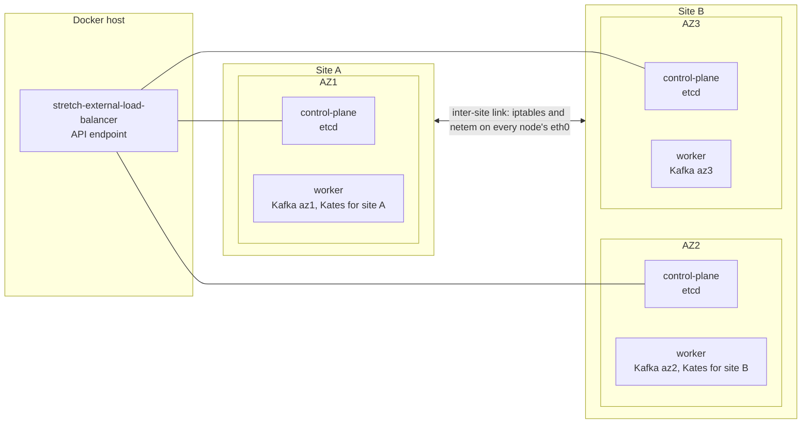

# Test and Chaos Scenarios

A layout on paper says which failures a stretched Kafka cluster should survive. Only a test shows that it does, on your network, with your timers. This page gives the method, a kind lab that emulates the two sites and three rooms, the signals that prove each result, the discriminating tests T0–T10 with the outcome expected for every architecture A1–A8, how to drive each test with Kates on `main`, and a scoring model that turns the results into a choice.

The scenario IDs S1–S12, the notation (`C 1/2/2`, `B 3/3/3`, RF, m, the RPO classes 0g, 0c and >0) and the quorum arithmetic are defined in [Topology and Constraints](01-topology-and-constraints.md#notation). The architectures and their failure matrices are in [Candidate Architectures](02-architectures.md#the-eight-architectures). The [runbooks](03-kubernetes-and-strimzi.md#runbooks) R-DRAIN, R-SD and R-DR, and the baselines B0-K8s and B0-K, are in [Platform Design on the Stretched Cluster](03-kubernetes-and-strimzi.md). The costs the scoring model needs are in [Cost and Capacity](05-comparison-and-summary.md#cost-and-capacity) in Comparison and Summary.

Everything here was checked against Kafka 4.3.1, Strimzi 1.2.0, Kubernetes 1.34 and Kates `main` at `63d00e7`. The pinned versions are in the [Version & Compatibility Matrix](../book/appendix-d-versions.md).

## Methodology

Every test is a Game Day experiment in the sense of [Chaos Engineering Theory](../book/06-chaos-theory.md#the-game-day-methodology): a written hypothesis, a verified steady state, a bounded blast radius, abort criteria, and evidence that a second person can check. [Chaos Engineering in Practice](../book/07-chaos-practice.md) covers the Kates mechanics this page builds on.

### Hypothesis and Steady State

Write each hypothesis with the numbers from the test's **Expected** block, in this form:

```text
When <scenario> hits <architecture>, the KRaft quorum <survives with k of N voters | is lost>,
acks=all writes are <available after a stall of at most x s | blocked until <manual step>>,
lostRecords is 0, and <signal> reads <value> within <time>.
```

Inject nothing until every row of this table has held for 10 minutes:

| Signal | Steady state |
|---|---|
| `UnderReplicatedPartitions`, `UnderMinIsrPartitionCount`, `OfflinePartitionsCount`, `FencedBrokerCount` | 0 |
| `ActiveControllerCount`, summed over every controller | 1 |
| raft `current-epoch` | Unchanged for 10 minutes |
| Exposure E_X for every domain X the architecture defines (see [Exposure](#exposure)) | 0 |
| `etcd_server_has_leader` on every member; `/readyz` on every API server | 1; `ok` |
| `Ready` condition of the `Kafka` resource | `True` |
| `eligible.leader.replicas.version` | 1 |
| Kates, its PostgreSQL and Prometheus | On nodes of the site the test expects to survive |
| KRaft and etcd timers | Recorded in the report |

### Blast Radius and Order of Runs

Rehearse each test in the lab, then run it on the target infrastructure before production traffic depends on it. Escalate one level at a time, as the "Minimize Blast Radius" principle of [Chaos Engineering Theory](../book/06-chaos-theory.md#5-minimize-blast-radius) describes: pod, then room, then site, then the link between the sites.

Run the tests in order of value: T0, T1, T3, T4, T5, T2, T7, T8, T6, then T9 and T10. T0 comes first because a design that loses acknowledged records under a correlated pod kill is out before any site-level test is worth its time. Run T10 once early as well if you changed the quorum timers, so every other expectation uses calibrated values.

### Abort Criteria and Restore

Stop the injection and restore when any of these happens:

- acks=all `lostRecords` > 0 in a test whose **Expected** block says 0. Keep every log: this is the finding.
- The KRaft quorum or etcd is lost, for more than 60 s, in a test whose **Expected** block says it survives.
- A pod on the side expected to survive restarts, or a node there goes `NotReady`.
- `OfflinePartitionsCount` exceeds the exposure measured just before the event.
- Kates or Prometheus loses contact with the cluster.
- The time box runs out: the test's planned duration plus 50%.

Restore in the reverse order of injection: remove the network rule, or unpause or power on the nodes. Then wait for `UnderReplicatedPartitions` = 0 and E_X = 0, and for leadership to move back within 300 s (`auto.leader.rebalance.enable`). Undo every manual step: restore m after R-SD, and follow the failback part of R-DR.

### Rules for Every Test

- **Never delete or replace a controller PVC, and never annotate a controller pod with `strimzi.io/delete-pod-and-pvc`.** Strimzi 1.2.0 formats an empty controller volume at every pod start ([`kafka_run.sh`](https://github.com/strimzi/strimzi-kafka-operator/blob/1.2.0/docker-images/kafka-based/kafka/scripts/kafka_run.sh) runs `kafka-storage.sh format ... -g` against the static `controller.quorum.voters`). The controller then rejoins the quorum as a voter with an empty log and no vote state. A disk test on a controller damages the quorum instead of testing it ([Controller Disk Loss](03-kubernetes-and-strimzi.md#controller-disk-loss)). Deleting a controller pod is safe: its PVC stays.
- **Never edit a controller pool's `replicas`, `roles` or name during a test.** Strimzi 1.2.0 does not support these changes and does not prevent them either: the next roll rewrites the static voter set. Install the admission guard of [Topology and Constraints](01-topology-and-constraints.md#controller-pool-changes-are-unsupported-and-not-prevented) before the first test.
- **Never use `SCALE_DOWN` as an outage fault.** On `main` it lowers `spec.replicas` of a broker KafkaNodePool, Cruise Control's `remove-brokers` auto-rebalance (where the `Kafka` resource has one) drains the broker, and Strimzi removes it for good (see "Scaling Down a Node Pool" in [Chaos Engineering in Practice](../book/07-chaos-practice.md#scaling-down-a-node-pool)). That is a capacity change, not the loss of a room.
- Never force an unclean election, never lower `min.insync.replicas` outside R-SD, and make no `Kafka` resource changes while a domain is down.
- Never run R-DR while the sites are only partitioned. From site A, S6 and S7 look the same.
- Pin the harness to the site the test expects to survive, and record where it ran.

### Evidence to Record

For every run, record:

- the test ID, the architecture and variant, the scenario, and lab or target infrastructure;
- the injection method, and the start and end of the injection in UTC (keep node clocks in sync with NTP);
- the quorum timers and the etcd timers;
- the location of the KRaft active controller and of the etcd leader, and E_X, just before the injection;
- every Kates run ID and its integrity fields;
- the readings of the signals the test lists;
- every manual step and its duration;
- every deviation from the **Expected** block.

## Lab Emulation

### What the Lab Can Show

| Property | kind lab | Target infrastructure |
|---|---|---|
| Zones, sites, pinning, selectors, runbook steps | Yes | Yes |
| KRaft and etcd quorum outcomes for room loss, site loss and partitions | Yes, with at least one control-plane node per AZ | Yes |
| t_f, t_c, t_r and t_lag | Yes: the timers are the same | Yes |
| Real WAN latency, loss and bandwidth; TCP and etcd heartbeats under real jitter | Approximate: netem on the node containers | Yes |
| Power loss that drops the page cache (T5) | No: `docker pause` and `docker kill` keep the Docker host's page cache | Yes: BMC power-off, hypervisor hard reset, `sysrq` reset |
| Disk fsync latency, capacity headroom | No | Yes |

T5 and the final T4 numbers therefore need the target infrastructure. Everything else can be rehearsed in kind.

### A Kind Cluster with Three Control-Plane Nodes

The repository's lab config (`config/cluster.yaml`) has a single control-plane node, so it cannot lose an etcd member without losing the Kubernetes API. Use a separate config with one control-plane node and one worker per AZ, a zone label and a site label on every node ([kind configuration](https://kind.sigs.k8s.io/docs/user/configuration/)). The control-plane nodes keep kind's `NoSchedule` taint, so Kafka runs only on the workers and T9 can stop etcd members without touching a broker. `scripts/start-cluster.sh` removes that taint, so create this lab with `kind` directly.

```yaml
# stretch-kind.yaml: sites A (az1) and B (az2, az3), one control-plane node and one worker per AZ
kind: Cluster
apiVersion: kind.x-k8s.io/v1alpha4
name: stretch
nodes:
  - role: control-plane
    image: kindest/node:v1.34.11
    labels: {topology.kubernetes.io/zone: az1, example.com/site: a}
  - role: control-plane
    image: kindest/node:v1.34.11
    labels: {topology.kubernetes.io/zone: az2, example.com/site: b}
  - role: control-plane
    image: kindest/node:v1.34.11
    labels: {topology.kubernetes.io/zone: az3, example.com/site: b}
  - role: worker
    image: kindest/node:v1.34.11
    labels: {topology.kubernetes.io/zone: az1, example.com/site: a}
    extraPortMappings:
      - {containerPort: 30083, hostPort: 30083}   # Kates for site A
  - role: worker
    image: kindest/node:v1.34.11
    labels: {topology.kubernetes.io/zone: az2, example.com/site: b}
    extraPortMappings:
      - {containerPort: 30084, hostPort: 30084}   # Kates for site B
  - role: worker
    image: kindest/node:v1.34.11
    labels: {topology.kubernetes.io/zone: az3, example.com/site: b}
```

```bash
kind create cluster --config stretch-kind.yaml
kubectl get nodes -L topology.kubernetes.io/zone,example.com/site
```

This gives `E 1/1/1`, the etcd layout of A1. For five etcd members add control-plane nodes: `E 1/2/2` (A2, A4, A6, A7, A8) needs one more in az2 and one more in az3. `E 2/1/1+1W` (A5) needs a second az1 node and a node labelled `topology.kubernetes.io/zone: w` and `example.com/site: w`, tainted `example.com/witness=true:NoSchedule` after creation. In the lab that W node is a control-plane node, so the `controllers-w` pool also needs a toleration for `node-role.kubernetes.io/control-plane:NoSchedule`. A4 and A5 also need the `example.com/fault-domain` label (`az1a`, `az1b`, `az2`, `az3`, `w`) and two az1 workers, one per sub-rack.

With several control-plane nodes, kind fronts the API servers with a load-balancer container, `stretch-external-load-balancer`. It runs on the Docker host, outside every zone, like an API endpoint that depends on no site. Two consequences: during a cut between the sites, site-A kubelets still reach the site-B API servers through it, as they would through a load balancer at a third location; and its health check is kind's, not the `/readyz` check B0-K8s asks of your production load balancer, so query each API server directly (see [Cluster Signals](#cluster-signals)).



### Kafka and the Harness in the Lab

The examples use the default cluster, `krafter`, in namespace `kafka`. Install the Strimzi Cluster Operator from `charts/strimzi-operator` with `strimzi-kafka-operator.replicas: 2` (the chart default is 1), and keep the two replicas in different sites. Then install `charts/kafka-cluster` with its platform profile (`values-platform.yaml`, which creates the `kates-backend` KafkaUser that Kates authenticates as and makes it a super user), then `values-kind.yaml`, then this overlay. The overlay pins every pool, adds the `site` pod label the selectors below use, takes the rack from `KAFKA_RACK`, and applies the B0-K tolerations for node-local volumes. Strimzi writes `broker.rack` only for broker-role nodes, so only broker pools need `KAFKA_RACK`. Node-pool lists replace the chart's, so this is the whole pool list. Add per-pool `resources`, `jvmOptions` and `storage` sized for your machine: the chart defaults are production sizes.

```yaml
# stretch-lab.yaml: an A2-shaped lab (C 1/2/2, one broker per AZ, RF 3, m 2)
kafka:
  rack:
    type: environment-variable
    envVarName: KAFKA_RACK
    topologyKey: null            # removes the chart's default key; Helm deletes a key set to null
nodePools:
  defaults:
    scheduling:
      zoneKey: topology.kubernetes.io/zone
      tolerations:               # node-local volumes: a pinned pod is never evicted
        - {key: node.kubernetes.io/unreachable, operator: Exists, effect: NoExecute}
        - {key: node.kubernetes.io/not-ready, operator: Exists, effect: NoExecute}
  pools:
    - name: brokers-az1
      roles: [broker]
      replicas: 1
      zone: az1
      template:
        kafkaContainer: {env: [{name: KAFKA_RACK, value: az1}]}
        pod: {metadata: {labels: {site: a}}}
    - name: brokers-az2
      roles: [broker]
      replicas: 1
      zone: az2
      template:
        kafkaContainer: {env: [{name: KAFKA_RACK, value: az2}]}
        pod: {metadata: {labels: {site: b}}}
    - name: brokers-az3
      roles: [broker]
      replicas: 1
      zone: az3
      template:
        kafkaContainer: {env: [{name: KAFKA_RACK, value: az3}]}
        pod: {metadata: {labels: {site: b}}}
    - name: controllers-az1
      roles: [controller]
      replicas: 1
      zone: az1
      template:
        pod: {metadata: {labels: {site: a}}}
    - name: controllers-az2
      roles: [controller]
      replicas: 2                # 1 for an A1-shaped lab; both share the az2 worker (lab only)
      zone: az2
      template:
        pod: {metadata: {labels: {site: b}}}
    - name: controllers-az3
      roles: [controller]
      replicas: 2
      zone: az3
      template:
        pod: {metadata: {labels: {site: b}}}
```

```bash
helm dependency build charts/kafka-cluster
helm upgrade --install krafter charts/kafka-cluster -n kafka --create-namespace \
  -f charts/kafka-cluster/values-platform.yaml -f charts/kafka-cluster/values-kind.yaml -f stretch-lab.yaml \
  --set monitoring.podMonitor.interval=5s     # resolves windows of a few seconds (T10)
```

The pool names matter to Kates: `brokers-az1-…` sorts before `controllers-…`, and Kates command probes run in the first Kafka pod the API lists, which for site-B tests must be a site-A pod.

Spread CoreDNS one replica per AZ. kind deploys two replicas with no zone spreading, and if both land in site B, site-A clients lose DNS with the site and every result measures DNS instead of Kafka:

```bash
kubectl -n kube-system scale deployment coredns --replicas 3
kubectl -n kube-system patch deployment coredns --type merge -p '{"spec":{"template":{"spec":{
  "topologySpreadConstraints":[{"maxSkew":1,"topologyKey":"topology.kubernetes.io/zone",
  "whenUnsatisfiable":"ScheduleAnyway","labelSelector":{"matchLabels":{"k8s-app":"kube-dns"}}}]}}}}'
```

The two Kates instances are set up in [Two Kates Instances](#two-kates-instances).

### Emulating the Inter-Site Link

kind nodes are containers on one Docker network, and pod traffic between nodes leaves each node on `eth0` with pod IPs, unencapsulated. So a rule inside each node container that matches the other group's node IPs and pod CIDRs acts on everything between the two groups: Kafka replication, KRaft, client traffic, etcd peers and kubelets. This script adds such rules. It needs `iptables` and `tc` in the node image, and the `sch_netem` module in the Docker host's kernel.

```bash
#!/usr/bin/env bash
# lab-link.sh: emulate the network between two groups of kind nodes.
#   lab-link.sh map                                  record name, zone, site, IP and pod CIDR of every node (API up)
#   lab-link.sh cut GROUP1 GROUP2                    drop all traffic between the groups, both directions
#   lab-link.sh wan GROUP1 GROUP2 RTT JITTER LOSS [RATE]
#                                                    add RTT ms and JITTER ms (split over both directions),
#                                                    LOSS % per direction, optional netem RATE per node (200mbit)
#   lab-link.sh heal                                 remove every rule this script added
# A GROUP is site=a, site=b, zone=az1, zone=az2 or zone=az3.
set -euo pipefail
MAP=${MAP:-lab-nodes.txt}

group_nodes() { awk -v k="${1%%=*}" -v v="${1#*=}" '(k == "zone" && $2 == v) || (k == "site" && $3 == v) {print $1}' "$MAP"; }
group_nets()  { awk -v k="${1%%=*}" -v v="${1#*=}" '(k == "zone" && $2 == v) || (k == "site" && $3 == v) {print $4 "/32"; print $5}' "$MAP"; }

partition() {   # GROUP1 nodes drop everything to and from GROUP2, which makes the cut symmetric
  local nets; nets=$(group_nets "$2" | tr '\n' ' ')
  for n in $(group_nodes "$1"); do
    docker exec "$n" sh -c "
      iptables -t raw -N LAB 2>/dev/null || true
      iptables -t raw -C PREROUTING -j LAB 2>/dev/null || iptables -t raw -I PREROUTING -j LAB
      iptables -t raw -C OUTPUT -j LAB 2>/dev/null || iptables -t raw -I OUTPUT -j LAB
      for x in $nets; do iptables -t raw -A LAB -s \$x -j DROP; iptables -t raw -A LAB -d \$x -j DROP; done"
  done
}

shape() {       # delay, jitter, loss and rate on FROM's egress towards TO
  local nets; nets=$(group_nets "$2" | tr '\n' ' ')
  for n in $(group_nodes "$1"); do
    docker exec "$n" sh -c "
      tc qdisc del dev eth0 root 2>/dev/null || true
      tc qdisc add dev eth0 root handle 1: prio bands 4
      tc qdisc add dev eth0 parent 1:4 handle 40: netem delay ${3}ms ${4}ms loss ${5}% ${6:+rate $6}
      for x in $nets; do tc filter add dev eth0 parent 1: protocol ip prio 1 u32 match ip dst \$x flowid 1:4; done"
  done
}

case "${1:-}" in
  map)
    kubectl get nodes -o jsonpath='{range .items[*]}{.metadata.name}{" "}{.metadata.labels.topology\.kubernetes\.io/zone}{" "}{.metadata.labels.example\.com/site}{" "}{.status.addresses[?(@.type=="InternalIP")].address}{" "}{.spec.podCIDR}{"\n"}{end}' > "$MAP" ;;
  cut)
    partition "$2" "$3" ;;
  wan)
    half=$(awk -v r="$4" 'BEGIN { print r / 2 }'); jit=$(awk -v j="$5" 'BEGIN { print j / 2 }')
    shape "$2" "$3" "$half" "$jit" "$6" "${7:-}"
    shape "$3" "$2" "$half" "$jit" "$6" "${7:-}" ;;
  heal)
    for n in $(awk '{print $1}' "$MAP"); do
      docker exec "$n" sh -c 'iptables -t raw -F LAB 2>/dev/null; tc qdisc del dev eth0 root 2>/dev/null; true'
    done ;;
  *)
    echo "usage: $0 map | cut G1 G2 | wan G1 G2 RTT JITTER LOSS [RATE] | heal" >&2; exit 2 ;;
esac
```

```bash
./lab-link.sh map                              # once, while the API is up; the other commands work without it
./lab-link.sh cut site=a site=b                # S7
./lab-link.sh cut zone=az2 zone=az3            # S8
./lab-link.sh wan site=a site=b 20 10 1        # S9 step: +20 ms RTT, ±5 ms jitter each way, 1% loss each way
./lab-link.sh wan site=a site=b 5 2 0 200mbit  # S9 step with a rate cap of 200 Mbit/s per node
./lab-link.sh heal
```

Three limits of the emulation. The rate cap applies per node, so the site's aggregate is the cap times the number of nodes that send across; set it to your link's capacity divided by that number. [netem](https://man7.org/linux/man-pages/man8/tc-netem.8.html) gives each packet its own delay, so jitter reorders packets, which is harsher than most real links. And loss applies per direction, so a round trip sees about twice the rate you set.

### Emulating Room and Site Loss

| Event | kind lab | Target infrastructure |
|---|---|---|
| A room or site goes silent: S3–S6, sustained | `docker pause` the domain's node containers, control-plane nodes included | Power off through the BMC or hypervisor, or firewall every node of the domain |
| Power loss that drops the page cache (T5) | Not possible | BMC power cycle, hypervisor hard reset, `echo b > /proc/sysrq-trigger` |
| The domain returns | `docker unpause`: processes resume without restarting | Power on: processes restart and register as unclean shutdowns |
| Partition between the sites (S7) or the rooms of B (S8) | `lab-link.sh cut` | Firewall or CNI-wide deny between the node and pod CIDRs, both directions |
| WAN degradation (S9) | `lab-link.sh wan` | WAN emulator, or shaping on the inter-site routers |
| etcd quorum loss with Kafka up (S10) | `docker pause` control-plane containers | Move `/etc/kubernetes/manifests/etcd.yaml` out of the manifests directory on q stacked members, or stop q external members |

A `NoExecute` taint is not a site loss. It leaves the etcd static pods running and shuts Kafka down gracefully, so it gives optimistic RTOs. Use it only where a test says so, and label the result as an approximation.

## Metrics and Gates

### Timings Behind the Expectations

| Symbol | Meaning | Repo quorum timers (5000/10000/5000 ms) | Kafka defaults (1000/2000/1000 ms) |
|---|---|---|---|
| t_f | A broker without heartbeats is fenced and its partitions change leader | ≈ 9–10 s: a 9 s session, a stale-broker check every session/8 that fences one broker per run | Same |
| t_c | The active controller is hard-lost and a new leader is elected | ≈ 10–20 s; a split vote can reach ≈ 25 s | ≈ 2–4 s |
| t_fc | The active controller and brokers are lost together | t_c + t_f: ≈ 20–30 s typical, can exceed 30 s | ≈ 11–14 s |
| t_r | An isolated active controller resigns: 1.5 × `controller.quorum.fetch.timeout.ms` ([`LeaderState`](https://github.com/apache/kafka/blob/4.3.1/raft/src/main/java/org/apache/kafka/raft/LeaderState.java#L65)) | 15 s | 3 s |
| t_lag | A follower that stopped catching up leaves the ISR; the check runs every `replica.lag.time.max.ms`/2 ([`ReplicaManager`](https://github.com/apache/kafka/blob/4.3.1/core/src/main/scala/kafka/server/ReplicaManager.scala#L282-L284)) | 30–45 s | Same |
| t_node | A node goes `NotReady` and gets the NoExecute taint; the default tolerations run out | 50 s; 5 min 50 s | Same |
| Producer | `delivery.timeout.ms` | 120 s | 120 s |

"≤ 30 s" for an automatic failover is a typical value, not a bound. The 120 s delivery timeout covers every automatic case.

### What Kates Measures

- **Primary evidence: `lostRecords` and `dataLossPercent`** of an INTEGRITY run, with `outOfOrderCount`, `crcFailures` and `verdict`. They count acks=all records that were acknowledged and never consumed. [Data Integrity Verification](../book/08-data-integrity.md#interpreting-integrity-results) explains each field.
- **Stall versus outage.** `maxRtoMs` measures failure windows: a window opens when a send fails and closes at the next acknowledgement. A failover shorter than the producer's `delivery.timeout.ms` fails no send, so `maxRtoMs` reads 0 and the stall shows up as the phase's `maxLatencyMs`. Kates' producers use kafka-clients 3.9.2 (`kates/pom.xml`) with the 120 s default. So gate automatic failovers on `maxLatencyMs`, and read an outage's write unavailability as `maxRtoMs` + 120 s.
- **`rpoMs`** exists only for `kates resilience run` with an INTEGRITY test on the native backend; -1 means not measured. The chaos start is marked when Kates triggers the fault, not when it lands, so records lost between the two make RPO clamp to 0 while `lostRecords` still counts them. Use the direct backend with `delayBeforeSec: 0`, and gate on `lostRecords`.
- **Disruption-plan SLAs on `main`** grade three thresholds: `maxRtoMs` (every watched Kafka pod Ready again, from the pod watcher), `maxP99LatencyMs` (the 0.99 quantile of Produce `TotalTimeMs`, maximum over brokers) and `minThroughputRecPerSec`. `maxAvgLatencyMs`, `maxP999LatencyMs`, `maxErrorRate`, `minRecordsProcessed`, `maxDataLossPercent` and `maxRpoMs` are listed as unevaluated ("SLA Grading" in [Chaos Engineering in Practice](../book/07-chaos-practice.md#sla-grading)). A plan's `maxRtoMs` is pod readiness, not what clients saw. Builds before `703398d` (#180) read P99 as 0 and did not grade `maxRtoMs` after a fault that left some pods alone, so do not compare against their reports.
- **ISR tracking** of a plan (`isrTrackingTopic`): `minIsrDepth`, `timeToFullIsr` and `underReplicatedPeakCount` per step, from `kates disruption kafka-metrics <id>` ("ISR Tracking" in [Chaos Engineering in Practice](../book/07-chaos-practice.md#isr-tracking)).

### Unclean Elections After a Correlated Crash

Kafka 4.3.1 with ELR v1 recovers a partition whose whole ISR ∪ ELR sat in a domain that restarted, without anyone acting and without `unclean.leader.election.enable`. A broker that comes back from a SIGKILL, a pod kill or a power loss registers as an unclean shutdown, which removes its replicas from both the ISR and the ELR ([`ReplicationControlManager`](https://github.com/apache/kafka/blob/4.3.1/metadata/src/main/java/org/apache/kafka/controller/ReplicationControlManager.java#L1482-L1494)). The controller then elects the partition's last known leader when it unfences ([`PartitionChangeBuilder`](https://github.com/apache/kafka/blob/4.3.1/metadata/src/main/java/org/apache/kafka/controller/PartitionChangeBuilder.java)), sets ISR = {leader} and the leader recovery state RECOVERING ([KIP-704](https://cwiki.apache.org/confluence/display/KAFKA/KIP-704%3A+Send+a+hint+to+the+partition+leader+to+recover+the+partition)), and counts the election in `UncleanLeaderElectionsPerSec`. After a pod kill or a process crash nothing is lost; after a power loss the unflushed tail of acknowledged records is gone, silently. If the domain's brokers come back without having restarted (a network cut, `docker unpause`), they are re-elected cleanly from the ELR instead, and if the domain is destroyed, the partitions stay offline. [Last-Known-Leader Election After a Correlated Restart](01-topology-and-constraints.md#last-known-leader-election-after-a-correlated-restart) in Topology and Constraints has the mechanism and a worked example.

So treat an unclean election as **expected** when both hold: the partition's whole ISR ∪ ELR sat in the domain that restarted, and its last known leader restarted just before the election. Identify it by the counter increment within seconds of that broker's re-registration (pod restart or node boot), ISR = {leader} right after, and, if you need proof, a partition change record with `leaderRecoveryState` 1 (RECOVERING) in the metadata log, which `kafka-dump-log.sh --cluster-metadata-decoder` prints from a controller's `__cluster_metadata-0` segments. Check `lostRecords` separately: 0 after a pod kill, possibly more after a power loss. Any unclean election that fails either condition is a finding.

### Exposure

E_X is the number of partitions, internal topics included, whose ISR ∪ ELR lies entirely inside domain X ([Exposure E_X](01-topology-and-constraints.md#exposure-e_x) in Topology and Constraints). The ELR is empty whenever the ISR is at or above m, so for a healthy partition this is its ISR. A partition that is under m and whose former ISR members sit in the ELR outside X exposes nothing: its high watermark froze when they left. X is site A or site B for A1–A5 and A7; room AZ2 or AZ3 for A6's cluster KB and for A8, whose replicas all sit in site B. E_X must be 0 in steady state; alert when it stays above 0 for 60 s. Neither Kafka nor Kates computes it. For the continuous metric and its alert, use the exporter in [Site Exposure E_X](03-kubernetes-and-strimzi.md#site-exposure-e_x); for a one-off check before each injection, this script counts one domain:

```bash
#!/usr/bin/env bash
# exposure.sh LABEL VALUE: partitions whose ISR ∪ ELR lies inside the brokers whose pods carry LABEL=VALUE
#   exposure.sh site b | exposure.sh site a | exposure.sh zone az2 | exposure.sh zone az3
# CLIENT is a pod with the Kafka tools and a client.properties, such as the client shell of the Kafka Cluster Runbook.
set -euo pipefail
NS=${NS:-kafka} CLUSTER=${CLUSTER:-krafter} CLIENT=${CLIENT:-kcat} CONFIG=${CONFIG:-client.properties}
inside=$(kubectl -n "$NS" get pods -l "strimzi.io/cluster=$CLUSTER,strimzi.io/broker-role=true,$1=$2" \
  -o jsonpath='{range .items[*]}{.metadata.name}{"\n"}{end}' | sed 's/.*-//' | paste -sd, -)
kubectl -n "$NS" exec "$CLIENT" -- /opt/kafka/bin/kafka-topics.sh \
    --bootstrap-server "$CLUSTER-kafka-bootstrap:9092" --command-config "$CONFIG" --describe |
  awk -v inside="$inside" '
    BEGIN { n = split(inside, ids, ","); for (i = 1; i <= n; i++) in_x[ids[i]] = 1 }
    /Partition: / {
      members = ""
      for (i = 1; i < NF; i++)
        if (($i == "Isr:" || $i == "Elr:") && $(i + 1) ~ /^[0-9,]+$/) members = members "," $(i + 1)
      k = split(members, m, ","); any = 0; all_in = 1
      for (j = 1; j <= k; j++) if (m[j] != "") { any = 1; if (!(m[j] in in_x)) all_in = 0 }
      if (any && all_in) exposed++
    }
    END { print exposed + 0 }'
```

Pod names end in the node ID, and the Kafka 4.x `kafka-topics.sh --describe` prints `Isr:` and `Elr:` per partition. Run it before every injection: it needs the Kubernetes API and a reachable bootstrap.

### Cluster Signals

| Signal | Source | Proves | Section of the [Kafka Cluster Runbook](../kafka-cluster-runbook.md) |
|---|---|---|---|
| `ActiveControllerCount`, summed over the controllers | Controller | Quorum present (1) or absent (0); the time at 0 is t_c | [KafkaActiveControllerCount](../kafka-cluster-runbook.md#kafkaactivecontrollercount) |
| raft `current-state`, `current-leader`, `current-epoch`, `commit-latency-avg` | `kafka.server:type=raft-metrics` | Which side leads, election churn, metadata latency over the WAN | [KafkaRaftLeaderElections](../kafka-cluster-runbook.md#kafkaraftleaderelections) |
| `OfflinePartitionsCount`, `FencedBrokerCount` | Controller | Exposure turned into offline partitions; which side lost | [KafkaOfflinePartitions](../kafka-cluster-runbook.md#kafkaofflinepartitions), [KafkaFencedBrokers](../kafka-cluster-runbook.md#kafkafencedbrokers) |
| `UnderMinIsrPartitionCount`, `AtMinIsrPartitionCount` | Broker | Writes blocked; zero margin | [KafkaUnderMinIsrPartitions](../kafka-cluster-runbook.md#kafkaunderminisrpartitions) |
| `IsrShrinksPerSec`, `UnderReplicatedPartitions` | Broker | WAN stress; phase 2 of S9 | [KafkaISRShrinkRate](../kafka-cluster-runbook.md#kafkaisrshrinkrate), [KafkaUnderReplicatedPartitions](../kafka-cluster-runbook.md#kafkaunderreplicatedpartitions) |
| `UncleanLeaderElectionsPerSec`, `ElectionFromEligibleLeaderReplicasPerSec` | Controller | Last-known-leader and ELR elections | [KafkaUncleanLeaderElection](../kafka-cluster-runbook.md#kafkauncleanleaderelection) |
| Produce `TotalTimeMs` P99 | Broker | The cross-site cost of acks=all | – |
| E_X | `exposure.sh` | RPO exposure before the event | – |
| `etcd_server_has_leader`, `etcd_server_leader_changes_seen_total`, `etcd_network_peer_round_trip_time_seconds`, `etcd_disk_wal_fsync_duration_seconds` | etcd | The Kubernetes side of every scenario | – |
| `/readyz?verbose` | Each kube-apiserver | Whether that API server's etcd has a quorum | – |
| MirrorMaker 2 source consumer lag (`records-lag-max`, or end offsets minus mirrored offsets) with a no-progress alert; `checkpoint-latency-ms` | MM2 | RPO of A6, A7 and A8 | – |

`replication-latency-ms` and `record-age-ms` of MM2 ([`MirrorSourceMetrics`](https://github.com/apache/kafka/blob/4.3.1/connect/mirror/src/main/java/org/apache/kafka/connect/mirror/MirrorSourceMetrics.java)) update only while records flow, so they cannot show a stalled MM2; base the RPO alert on consumer lag. The Kafka metrics are described in [Monitoring](https://github.com/apache/kafka/blob/4.3.1/docs/operations/monitoring.md). With the chart's PodMonitors, every series carries `zone` from the pod label and `strimzi_io_pool_name`:

```promql
# Quorum present (1) or absent (0); the length of a window at 0 is t_c
sum(kafka_controller_kafkacontroller_activecontrollercount{namespace="kafka", strimzi_io_cluster="krafter"})

# Where the KRaft leader is
count by (zone) (kafka_server_raftmetrics_current_state{namespace="kafka", strimzi_io_cluster="krafter", current_state="leader"})

# Election churn: rises by at most 2 over a T3 run, not at all in T7
max(kafka_server_raftmetrics_current_epoch{namespace="kafka", strimzi_io_cluster="krafter"})

# Writes blocked, zero margin, offline, fenced
sum(kafka_server_replicamanager_underminisrpartitioncount{namespace="kafka", strimzi_io_cluster="krafter"})
sum(kafka_server_replicamanager_atminisrpartitioncount{namespace="kafka", strimzi_io_cluster="krafter"})
sum(kafka_controller_kafkacontroller_offlinepartitionscount{namespace="kafka", strimzi_io_cluster="krafter"})
sum(kafka_controller_kafkacontroller_fencedbrokercount{namespace="kafka", strimzi_io_cluster="krafter"})

# Phase 2 of S9: followers leaving the ISR, per room
sum by (zone) (rate(kafka_server_replicamanager_isrshrinks_total{namespace="kafka", strimzi_io_cluster="krafter"}[1m]))

# Unclean elections, RECOVERING ones included
sum(increase(kafka_controller_controllerstats_uncleanleaderelections_total{namespace="kafka", strimzi_io_cluster="krafter"}[15m]))

# Produce P99 per broker, in ms
max by (kubernetes_pod_name) (kafka_network_requestmetrics_totaltimems{namespace="kafka", strimzi_io_cluster="krafter", request="Produce", quantile="0.99"})
```

Read the Kubernetes side on each control-plane node, because the API may be the thing that is down. kubeadm serves etcd metrics on `127.0.0.1:2381`:

```bash
for n in $(awk '$1 ~ /control-plane/ {print $1}' lab-nodes.txt); do
  echo "== $n"
  docker exec "$n" curl -s http://127.0.0.1:2381/metrics | grep -E '^etcd_server_(has_leader|leader_changes_seen_total) '
  docker exec "$n" curl -sk 'https://127.0.0.1:6443/readyz?verbose' | grep -E 'etcd|readyz'
done
```

The quorum and the features come from the Kafka tools, run from a client pod. During a partition, point `--bootstrap-server` at a broker of the side you are asking about, because the bootstrap Service can route to either side:

```bash
CLIENT=kcat      # the client shell of the Kafka Cluster Runbook; the later snippets reuse it
kubectl -n kafka exec "$CLIENT" -- /opt/kafka/bin/kafka-metadata-quorum.sh \
  --bootstrap-server krafter-kafka-bootstrap:9092 --command-config client.properties describe --status
kubectl -n kafka exec "$CLIENT" -- /opt/kafka/bin/kafka-metadata-quorum.sh \
  --bootstrap-server krafter-kafka-bootstrap:9092 --command-config client.properties describe --replication
```

A fenced broker is left out of metadata responses, so the broker IDs missing from `kafka-broker-api-versions.sh --bootstrap-server …` output are the fenced ones. `isQuorumLeader` in `kates cluster topology` is not the KRaft active controller: use `describe --status`.

### Pre-Flight Checks

Run these once per cluster and again after any change to it:

1. **Features.** `kafka-features.sh --bootstrap-server … describe` shows `kraft.version=0` (static, as Strimzi 1.2.0 formats it) and `eligible.leader.replicas.version=1`. A cluster the chart creates is formatted at metadata version `4.2-IV1`, which enables ELR. An upgraded cluster may show 0: run `kafka-features.sh … upgrade --feature eligible.leader.replicas.version=1` before any RPO test.
2. **Controller placement.** Controllers sit where the layout says, and two controllers of one AZ on different hosts:

   ```bash
   kubectl -n kafka get pods -l strimzi.io/cluster=krafter,strimzi.io/controller-role=true \
     -o custom-columns=POD:.metadata.name,NODE:.spec.nodeName,ZONE:.metadata.labels.zone,SITE:.metadata.labels.site
   ```

3. **Racks.** `kates cluster topology` lists each broker's rack from the Admin API: it matches the broker's AZ (or sub-rack in A4 and A5). Its "Rack Awareness" line reads `rack.topologyKey`, so it shows nothing with an environment-variable rack.
4. **Topics.** Every topic, internal topics included, has the architecture's RF and an explicit `min.insync.replicas`. `__consumer_offsets` has no dedicated min-ISR setting: it takes the cluster's m unless you give it a topic-level override on purpose (A4, A5-a and A7-d must decide which).
5. **Exposure.** `exposure.sh` prints 0 for every domain of the architecture.
6. **Harness.** Kates, its PostgreSQL and Prometheus run where the test needs them; CoreDNS has one replica per AZ; the Cluster Operator has a replica in each site.
7. **Timers.** The `controller.quorum.*` values in the `Kafka` resource, and `--heartbeat-interval` and `--election-timeout` on every etcd member, are written into the report.
8. **Plans.** Every plan passes its dry run and names the pods you expect.

## Running Tests with Kates

### Two Kates Instances

Run two Kates releases, one pinned to each site. A test that takes a site down needs a harness in the other site, T3 needs a client on each side, and each process has exactly one chaos provider for its lifetime. Both use the direct Kubernetes backend (`kubernetes`), which deletes every target at once. The default provider, LitmusChaos, deletes several targets one at a time ("Targeting Pods" in [Chaos Engineering in Practice](../book/07-chaos-practice.md#targeting-pods)), which turns a room loss into a rolling restart.

```yaml
# kates-site-a.yaml (kates-site-b.yaml: site b, nodePort "30084")
nodeSelector:
  example.com/site: a
postgresql:
  nodeSelector:
    example.com/site: a
service:
  type: NodePort
  nodePort: "30083"
networkPolicy:
  enabled: false        # its egress rules leave out the Kubernetes API, which the chaos backend calls
extraEnv:
  - name: KATES_CHAOS_PROVIDER                # simultaneous kills
    value: kubernetes
  - name: KATES_CHAOS_KAFKA_CLUSTER
    value: krafter
  - name: KATES_CHAOS_KAFKA_LABEL             # the safety guard counts exactly the node-pool pods, controllers included
    value: "strimzi.io/cluster=krafter,strimzi.io/pool-name"
  - name: KATES_ENGINE_MAX_DURATION_MS        # the engine fails any test still running after 30 minutes by default
    value: "7200000"
```

```bash
for s in a b; do
  kubectl create namespace "kates-$s"
  # Kates authenticates to Kafka as kates-backend, the KafkaUser of the platform profile
  kubectl -n "kates-$s" create secret generic kates-backend --from-literal=password="$(
    kubectl -n kafka get secret kates-backend -o jsonpath='{.data.password}' | base64 -d)"
  helm upgrade --install "kates-$s" charts/kates -n "kates-$s" -f "kates-site-$s.yaml"
done
KEY_A=$(kubectl -n kates-a get secret kates-a-api-key -o jsonpath='{.data.api-key}' | base64 -d)
KEY_B=$(kubectl -n kates-b get secret kates-b-api-key -o jsonpath='{.data.api-key}' | base64 -d)
kates ctx set site-a --url http://localhost:30083 --api-key "$KEY_A"
kates ctx set site-b --url http://localhost:30084 --api-key "$KEY_B"
```

`POD_KILL` needs no extra RBAC; leave `rbac.directChaos` off. The chart's NetworkPolicy allows egress only to DNS, PostgreSQL, Kafka and the `monitoring` namespace, so on a CNI that enforces policies it cuts Kates off from the API server its chaos backend and pod watcher use: disable it in the lab, or add a `networkPolicy.egressRules` entry for the API servers on the target. The chart's default `resources` request 2 GiB; lower them on a laptop. Reach each Kates through a NodePort or load balancer in its own site, not `kubectl port-forward`, which needs the API server that T1 and T9 take down. Read the API keys before any test for the same reason.

### Sustained Workloads

Tests that keep a domain down, cut the link or shape it run an INTEGRITY workload while the fault is applied outside Kates. Start it through the REST API: `throughput`, the rate an INTEGRITY run reads, is set only there and in a resilience file's raw `testRequest.spec`. `kates test create --throughput` and a scenario file's `targetThroughput` set `targetThroughput`, which INTEGRITY ignores, so a run started with `kates test apply` produces as fast as it can. Leave out `enableIdempotence`, `enableTransactions`, `enableCrc` and `consumerGroup`: [`TestOrchestrator.applyTypeDefaults`](../../kates/src/main/java/com/bmscomp/kates/engine/TestOrchestrator.java) does not carry them through today. CRC checks stay on by default, and the producer is idempotent by the client's default for acks=all.

```json
{
  "type": "INTEGRITY",
  "spec": {
    "topic": "t1-integrity-001",
    "partitions": 12,
    "replicationFactor": 3,
    "minInsyncReplicas": 2,
    "acks": "all",
    "recordSize": 512,
    "throughput": 1000,
    "numRecords": 3600000,
    "durationMs": 3600000
  }
}
```

Set `replicationFactor` and `minInsyncReplicas` to the architecture's (RF 4 and m 2 or 3 for A4 and A5), and use a new topic per run: Kates creates the topic when it is missing and reuses it otherwise. Twelve partitions spread leaders evenly over 3 or 4 racks. Size `numRecords` as `throughput` × duration, so the producer runs through the whole injection and the recovery after it.

```bash
# integrity.sh: source it, then call start_integrity and gate_integrity
start_integrity() {   # start_integrity URL API_KEY REQUEST.json: prints the run ID
  curl -sf -X POST "$1/api/tests" -H "Authorization: Bearer $2" \
    -H 'Content-Type: application/json' -d @"$3" | jq -r .id
}

gate_integrity() {    # gate_integrity CONTEXT RUN_ID: waits, prints the evidence, returns 1 on any loss
  until kates --context "$1" -o json test get "$2" | jq -e '.status == "DONE" or .status == "FAILED"' >/dev/null; do
    sleep 30
  done
  kates --context "$1" -o json test get "$2" > "run-$2.json"
  jq '.results[] | select(.integrity) | {phase: .phaseName, maxLatencyMs,
      lostRecords: .integrity.lostRecords, dataLossPercent: .integrity.dataLossPercent,
      maxRtoMs: .integrity.maxRtoMs, rpoMs: .integrity.rpoMs, verdict: .integrity.verdict}' "run-$2.json"
  jq -e '[.results[] | select(.integrity) | .integrity]
         | length > 0 and all(.lostRecords == 0 and .outOfOrderCount == 0 and .crcFailures == 0)' \
    "run-$2.json" >/dev/null
}
```

### Transient Faults

Correlated pod kills (T0) and the active-controller kill (T10) run as Kates faults. A disruption plan adds the safety guard, a dry run, ISR tracking and SLA grading:

```json
{
  "name": "t0-az1",
  "description": "T0: kill every Kafka pod in AZ1 at once; the StrimziPodSets recreate them in AZ1",
  "maxAffectedBrokers": 4,
  "autoRollback": true,
  "isrTrackingTopic": "t0-az1",
  "steps": [
    {
      "name": "kill",
      "faultSpec": {
        "experimentName": "t0-az1",
        "disruptionType": "POD_KILL",
        "targetNamespace": "kafka",
        "targetLabel": "strimzi.io/cluster=krafter,site=a",
        "targetAll": true,
        "targetBrokerId": -1,
        "chaosDurationSec": 30,
        "gracePeriodSec": 0,
        "envOverrides": {}
      },
      "steadyStateSec": 60,
      "observationWindowSec": 180,
      "requireRecovery": true
    }
  ],
  "sla": { "maxRtoMs": 180000, "maxP99LatencyMs": 500.0 }
}
```

Set `maxAffectedBrokers` to exactly the number of pods the selector should hit (four for AZ1 in A1, A2 and A7 at production size: one controller and three brokers), so a selector that matches more is rejected. `targetAll` outranks `targetBrokerId`, and on `main` fields a JSON spec leaves out get the builder defaults; the example still sets them explicitly. The `isrTrackingTopic` must exist: point it at the topic of an INTEGRITY run that writes during the plan.

A resilience run adds an INTEGRITY workload and is the only way to get `rpoMs`. It bypasses the safety guard, so dry-run the equivalent plan first:

```yaml
# t0-integrity.yaml: replace __NAME__ and __SELECTOR__
testRequest:
  type: INTEGRITY
  spec:
    topic: __NAME__
    partitions: 12
    replicationFactor: 3          # 4 for A4 and A5
    minInsyncReplicas: 2          # the architecture's m
    acks: all
    recordSize: 512
    throughput: 1000              # the rate INTEGRITY reads
    numRecords: 600000
    durationMs: 900000
chaosSpec:
  experimentName: __NAME__
  disruptionType: POD_KILL
  targetNamespace: kafka
  targetLabel: "__SELECTOR__"
  targetAll: true
  targetBrokerId: -1
  chaosDurationSec: 30
  delayBeforeSec: 0
  gracePeriodSec: 0
steadyStateSec: 60
maxRecoveryWaitSec: 300
```

`kates resilience run` leaves out every `chaosSpec` field whose value is 0 or `false`, so those take the builder defaults on the server: `delayBeforeSec` 0 as written, and a `gracePeriodSec` of 30 that `POD_KILL` ignores, since the direct backend always deletes with a grace period of 0. It does not print the integrity result, and its HTTP response returns while the INTEGRITY run is still producing: find the run with `kates test list --type INTEGRITY` (newest first) and read it with `kates test get <id>`, or wait for it with `gate_integrity`. `kates test list` filters on type or on status, not both: with `--type` set, `--status` is ignored.

### What Needs Infrastructure

Pod kills are undone by the StrimziPodSets within seconds, so no Kates fault keeps a room or a site down. `NETWORK_PARTITION` is a per-pod deny-all NetworkPolicy: next to the `kafka-cluster` chart's allow policies (`networkPolicy.enabled` defaults to `true`) it changes nothing, and it cannot express "site A against site B" anyway.

| Test | Kates part | Infrastructure part | Lab |
|---|---|---|---|
| T0 | Plans and resilience runs (`POD_KILL`) | – | Yes |
| T1 | REST INTEGRITY from site A | Power off or firewall site B, ≥ 30 min | Yes (`docker pause`) |
| T2 | REST INTEGRITY from site B | Power off or firewall AZ1; annotate a site-B controller | Yes |
| T3 | REST INTEGRITY and an acks=1 canary from each site | Firewall between the sites, both directions | Yes (`lab-link.sh cut`) |
| T4 | REST INTEGRITY per step | WAN emulator or shaping | Approximate (`lab-link.sh wan`) |
| T5 | REST INTEGRITY from site A | WAN cap, then a hard power cycle of site B | No |
| T6 | REST INTEGRITY | Power off W, then a site event | Yes, with five control-plane nodes |
| T7 | REST INTEGRITY | Firewall between AZ2 and AZ3 | Yes (`lab-link.sh cut`) |
| T8 | REST INTEGRITY; optionally a `ROLLING_RESTART` plan | R-DRAIN with `kubectl` | Yes |
| T9 | REST INTEGRITY started beforehand | Stop q etcd members | Yes (`docker pause`) |
| T10 | A `POD_KILL` plan with `targetPod` | Isolate the active controller; power off a broker node | Partly |

Kates can add latency to Kafka pods through Litmus (`NETWORK_LATENCY` runs `pod-network-latency`; Kates has no packet-loss or bandwidth type), but only after you add `pod-network-latency` to the `kates-chaos` chart's `experiments.definitions` (the list replaces the default, so re-list its seven entries: `pod-delete`, `pod-cpu-hog`, `pod-memory-hog`, `pod-network-partition`, `pod-io-stress`, `pod-dns-error` and `node-drain`; see "ChaosExperiment Definitions" in [Kates Chaos Chart — Deployment Guide](../kates-chaos-chart.md#chaosexperiment-definitions)), add a Kyverno exception for the `restrict-host-namespaces` rule the `kafka-cluster` chart enforces in production, and run a third Kates on `litmus-crd`. Even then it shapes only the targeted Kafka pods, one direction per step: etcd, the clients and Kates see no change, so it understates both the client-visible cost and the etcd risk. Use node-level shaping for T4.

### Harness Limits on Main

- Before each injection a plan requires every pod matching `KATES_CHAOS_KAFKA_LABEL` to be Running and Ready, so a plan cannot run during an outage created outside Kates. Every plan step also needs the Kubernetes API: with etcd down, plans are rejected with "No broker pods found".
- The safety guard takes the union of targets across a plan's steps, so a sweep over the three AZs is three plans. A plan hitting every node-pool pod is rejected.
- `ROLLING_RESTART` is a real Strimzi roll on `main`: it annotates every matching pod with `strimzi.io/manual-rolling-update` and waits up to `chaosDurationSec` for the Cluster Operator. The guard counts it as one pod. It rolls a room; it does not drain one.
- `kates disruption run` polls for at most 20 minutes, and `kates resilience run` waits at most 20 minutes for its HTTP response; the runs continue on the server either way. `kates.chaos.recovery.timeout-sec` is 300 s per step.
- The `maxRpoMs` gate of `kates test apply` never fires: only resilience runs mark a chaos start.
- Resilience runs add default probes for `POD_KILL` that exec into the first pod labelled `strimzi.io/component-type=kafka` and read the `Kafka` resource's `Ready` condition, both through the API.
- Benchmark consumers set no `client.rack`, so follower fetching is not measured.
- The built-in `az-failure` playbook targets `zone=alpha` only and playbooks take no parameters: ship stretch scenarios as JSON plans and resilience files.
- Kates' own clients are kafka-clients 3.9.2, where `metadata.recovery.strategy` defaults to `none`: after a bootstrap alias switch (R-DR), start a new run rather than expecting a running one to follow.

## Test and Architecture Matrix

Codes:

- **P**: passes automatically.
- **P\***: passes; the acks=1 canary on the losing side loses records, which proves the zombie-leader behaviour.
- **PM**: passes only through a manual step, R-SD or R-DR.
- **D**: degrades as described, with no acks=all loss.
- **F**: fails: quorum, writes or data are lost.
- n/a: the architecture has no such domain.

| Test | Scenario | A1 | A2 | A3 | A4 | A5 | A6 | A7 | A8 |
|---|---|---|---|---|---|---|---|---|---|
| **T0** | S1–S5 and a site-B transient: correlated pod kills | P | P | P | P | P | D (RECOVERING elections) | P | D (RECOVERING elections) |
| **T1** | S6 sustained, control plane included | F | F | PM (R-SD to m 1) | F | **P** (A5-a: PM) | PM (R-DR) | PM (R-DR) | PM (R-DR) |
| **T2** | S3 sustained, then a controller roll in site B | D (margin 0) | P | F | PM (R-SD) | D (margin 0) | P | P | P |
| **T3** | S7 with acks=all and an acks=1 canary on both sides | P\* | P\* | F | PM | P\* (leader at W: partial; A5-a: PM) | P | P\* | P |
| **T4** | S9 sweep | D | D | D | F (phase 2: fail-safe block) | D (phase 2: keeps writing, E_X rises) | P | D (plus MM2 lag) | P (leader in B) |
| **T5** | S9 until exposure, then a site-B power cycle | F | F | F | **P** | F by design (A5-a: P) | PM | PM | PM |
| **T6** | S11, then S3, S6 or S7 | n/a | n/a | n/a | n/a | F (expected) | n/a | n/a | n/a |
| **T7** | S8, active controller in AZ1, then in AZ2 | P | P | P | P | P | F (no bridge) | P | P |
| **T8** | S12: R-DRAIN of each AZ, plus the negative control | P | P | F (AZ1 ends the quorum) | PM (AZ1 needs R-SD) | P (A5-a: PM) | PM (AZ2 needs a KB failover) | P (KS off while AZ1 drains) | P |
| **T9** | S10: etcd quorum loss with Kafka up | P | P | P | P | P | P | P | P |
| **T10** | S2 and S1 calibration: hard loss versus pod kill | P | P | P | P | P | P | P | P |

### What Each Test Separates

- **T0** is the entry gate: any acks=all `lostRecords` > 0 disqualifies a design. It separates nothing else, except that A6 and A8, whose replicas all sit in site B, recover every partition of the site-B transient through a RECOVERING election.
- **T1** separates A5, the only design that survives the loss of site B automatically, from the rest; the standby designs A6–A8 (R-DR) from A1, A2 and A4 (fatal); and A3, which survives on one copy after R-SD. It measures t_sd, t_dr and the standby RPO.
- **T2** separates the quorum margin after losing AZ1: margin 1 in A2, A7 and A8, margin 0 in A1 and A5, a lost quorum in A3, and a write stop in A4.
- **T3** separates a global write outage (A3, A4) from a winning side, and zombie-leader canary loss (A1, A2, A5, A7) from none (A6, A8).
- **T4** decides whether the WAN can carry synchronous replication at all, which is the choice between A7 and A8. In phase 1 every synchronous design only slows down; once followers leave the ISR (phase 2), it separates A4 (stops writing), A5 (keeps writing, exposed) and A1, A2, A3 and A7 (a third of partitions blocked).
- **T5** separates RPO 0g through a power loss (A4, A5-a) from 0c (A1, A2, A3, A5, and A7's main cluster).
- **T6** proves W's restore SLO for A5.
- **T7** separates A6, which has no AZ1 voter to bridge site B's rooms.
- **T8** separates which rooms can be maintained without a manual step: never AZ1 in A3, AZ1 only after R-SD in A4 and A5-a, AZ2 only after a failover in A6.
- **T9** and **T10** separate no Kafka layouts. They validate the Kubernetes side (3 against 5 etcd members) and calibrate t_c and t_f.

## The Discriminating Tests

Each test lists what to inject, the workload, the expected result per architecture, the gate, and how to run it. "Avail", "Blocked" and "Partial" have the meaning of the failure matrices in [Candidate Architectures](02-architectures.md#columns-and-symbols).

### T0: Correlated Transient Kills

**Inject.** On the direct backend, kill at once:

1. S1: one random broker (`strimzi.io/cluster=krafter,strimzi.io/broker-role=true`, `targetAll: false`, `targetBrokerId: -1`, `maxAffectedBrokers: 1`).
2. S2: one random controller (`strimzi.io/cluster=krafter,strimzi.io/controller-role=true`, same settings).
3. S3, S4, S5: every Kafka pod of one room, as three separate plans: `site=a` for AZ1 (A4 and A5 pods carry `zone=az1a` or `zone=az1b`), `zone=az2`, `zone=az3`.
4. A site-B transient: every Kafka pod with `site=b`, `maxAffectedBrokers` = the site-B pod count. In A6 that is every pod of KB, which the safety guard rejects as a plan: run it as a resilience run only, and check its selector with `kubectl get pods -l` instead of a dry run.

The pods come back within seconds: this is not an outage test.

**Workload.** A resilience run with INTEGRITY per injection, for `lostRecords` and `rpoMs`. To add ISR tracking and pod-readiness grading, run the plan itself while a REST INTEGRITY run writes to its `isrTrackingTopic`.

**Expected.**

- `lostRecords` = 0 and `verdict` PASS for every injection in every design.
- One broker, one controller or one room: partitions with a replica on a killed pod stall until it is fenced or back, at most about t_fc; `maxLatencyMs` ≤ 30000 typically, and `maxRtoMs` = 0.
- The site-B transient depends on the design:
  - **A1, A2, A4, A7** lose the KRaft quorum until the site-B controllers restart with their data. The site-B brokers then register as unclean shutdowns and leave every ISR, which leaves ISR = the AZ1 replicas, below m: writes stay Blocked until the site-B replicas catch up, and all leadership sits in AZ1 until the preferred-leader rebalance (300 s). RTO = pod recreation + t_c + the catch-up of the site-B replicas.
  - **A3** keeps the quorum (3 of 5 voters in AZ1), but writes stay Blocked until the site-B replicas return and catch up.
  - **A5** keeps the quorum (az1a, az1b and W) and writes resume within t_fc on the AZ1 pairs.
  - **A6** (cluster KB) and **A8** (main cluster) lose every replica of every partition at once. Each partition recovers only through a last-known-leader election counted as unclean, with RECOVERING. After a pod kill this is lossless: grade D, and check `lostRecords` = 0.
- `UncleanLeaderElectionsPerSec`: 0 in A1–A5 and A7 when E_B was 0 before the kill; one per partition in A6's KB and in A8, each matching the RECOVERING-plus-restart pattern.

**Gate.** `lostRecords` = 0 and `dataLossPercent` = 0 for every injection. An unclean election that does not match the RECOVERING-plus-restart pattern blocks further testing until it is explained.

**Run it.** From the site-A Kates, with the plan above saved as `t0-plan.json` and the resilience file as `t0-integrity.yaml`. The dry run goes straight to the REST API, and `jq -e '.wouldSucceed'` stops the loop at a plan the guard would refuse:

```bash
source integrity.sh
for c in "az1 site=a" "az2 zone=az2" "az3 zone=az3" "siteb site=b"; do
  set -- $c
  name="t0-$1"; sel="strimzi.io/cluster=krafter,$2"
  n=$(kubectl -n kafka get pods -l "$sel" --no-headers | wc -l | tr -d ' ')
  jq --arg name "$name" --arg sel "$sel" --argjson n "$n" \
     '.name = $name | .description = "T0: kill every Kafka pod matching " + $sel
      | .maxAffectedBrokers = $n | .isrTrackingTopic = $name
      | .steps[0].faultSpec.experimentName = $name | .steps[0].faultSpec.targetLabel = $sel' \
     t0-plan.json > "$name.json"
  # The resilience run skips the guard: check the targets with the plan's dry run
  curl -sf -X POST "http://localhost:30083/api/disruptions?dryRun=true" \
    -H "Authorization: Bearer $KEY_A" -H 'Content-Type: application/json' -d @"$name.json" |
    jq -e '.wouldSucceed' >/dev/null || { echo "rejected: $name"; break; }
  sed -e "s|__NAME__|$name|g" -e "s|__SELECTOR__|$sel|" t0-integrity.yaml > "$name.yaml"
  kates --context site-a resilience run -f "$name.yaml"
  ID=$(kates --context site-a -o json test list --type INTEGRITY --size 1 | jq -r '.items[0].id')
  gate_integrity site-a "$ID" || { echo "acknowledged records lost: $name"; break; }
  ./exposure.sh site b      # must print 0, with URP = 0, before the next injection
done
```

### T1: Sustained Loss of Site B

**Inject.** Power off, or firewall, every site-B node, control-plane nodes included, for at least 30 minutes. In the lab, `docker pause` the site-B containers; this needs a control-plane node per AZ. Do not use a NoExecute taint for this test.

**Workload.** A REST INTEGRITY run from the site-A Kates, lasting the outage plus 15 minutes. `rpoMs` cannot be measured this way, so gate on `lostRecords` and `dataLossPercent`.

**Expected.**

- **A1, A2, A4.** `ActiveControllerCount`, summed over the AZ1 controllers, is 0 after t_r and stays 0: if the AZ1 controller was active, it stays leader until check-quorum makes it resign 15 s in. raft `current-state` is never `leader` after that. Every acks=all send fails at `delivery.timeout.ms`, so `maxRtoMs` ≈ the outage − 120 s + the recovery after B returns. `etcd_server_has_leader` = 0 in AZ1 and `/readyz` fails. No consumer group can commit offsets or rebalance; assigned consumers read up to the frozen high watermark, from AZ1-led partitions only. Kates plans are rejected. When B returns, nothing acknowledged is lost, because E_B was 0 before the event.
- **A3.** `ActiveControllerCount` = 1 in AZ1. `OfflinePartitionsCount` = E_B just before the event. `UnderMinIsrPartitionCount` = every online partition, that is the total minus `OfflinePartitionsCount`. Writes resume only after R-SD to m 1 on the affected topics, `__consumer_offsets` and `__transaction_state` included; measure t_sd.
- **A5.** One active controller within t_c, and writes resume within t_fc: `maxLatencyMs` typically ≤ 30000, `maxRtoMs` = 0. `lostRecords` = 0, which needs E_B = 0 before the event. `OfflinePartitionsCount` = that E_B, expected 0. `etcd_server_has_leader` = 1 in AZ1 and at W, and `/readyz` is `ok`: the Kubernetes API survives. **A5-a:** `UnderMinIsrPartitionCount` covers every m-3 topic until R-SD. **A5-r3:** the quorum survives (3 of 5) but writes are Blocked, with ISR = {az1} below m 2, until R-SD to m 1.
- **A6, A7, A8.** Run [R-DR](03-kubernetes-and-strimzi.md#r-dr-failover-to-the-az1-standby-after-s6) and time it end to end. Fence site B first, then run etcd `--force-new-cluster` in AZ1 to bring the Kubernetes API back, then promote the standby: stop MM2, record the last mirrored offsets, open the producer ACLs, switch the bootstrap alias, restart the clients. Stopping MM2, changing KafkaUsers and restarting in-cluster clients all go through the API, so t_dr includes the etcd recovery. If you use the API-free path instead (ACLs through the Admin API, MM2 stopped at process level, clients outside Kubernetes), say so in the report. RPO = the records the primary acknowledged that are missing on the standby. INTEGRITY cannot span two clusters, so measure it with an external producer ledger, and compare it with the MM2 source consumer lag at the moment of failure. Check that TLS clients with hostname verification connect through the alias, which needs `configuration.bootstrap.alternativeNames` on the listener of both clusters.
- **All.** After recovery, record the time until `UnderReplicatedPartitions` = 0, the catch-up volume, and the second leadership move within 300 s. Compare them with the prediction backlog ÷ (capacity − copies × P), with backlog = P × T × copies and copies = the replicas held in the returning domain (2 for site B in A5); [Catch-Up After an Outage](05-comparison-and-summary.md#catch-up-after-an-outage) in Comparison and Summary works the examples.

**Gate.** `lostRecords` = 0 in A1–A5. For A6–A8: the measured t_dr and RPO within the targets the scoring model uses.

**Run it.**

```bash
source integrity.sh
./exposure.sh site b                                    # must print 0
ID=$(start_integrity http://localhost:30083 "$KEY_A" t1-integrity.json)
sleep 120                                               # steady state under load
B=$(awk '$3 == "b" {print $1}' lab-nodes.txt)
docker pause $B                                         # target infrastructure: power off or firewall site B
sleep 1800
docker unpause $B                                       # target infrastructure: power on, lift the firewall
gate_integrity site-a "$ID"
```

### T2: Sustained Loss of AZ1, Then a Controller Roll in Site B

**Inject.** First check that `exposure.sh site a` prints 0: A5's RPO for S3 is 0c, so its `lostRecords` = 0 holds only when no partition's ISR ∪ ELR lies inside site A at the moment of the loss. Power off or firewall AZ1 (all of site A); in the lab, `docker pause` the az1 containers. A Kafka-only approximation, labelled as such in the report: cordon the AZ1 nodes and taint them `kates.io/outage=az1:NoExecute`. After 10 minutes, annotate one site-B controller pod with `strimzi.io/manual-rolling-update=true`.

**Workload.** A REST INTEGRITY run from the site-B Kates.

**Expected.**

- **Writes.** A1, A2, A5 and A7: Avail after t_f/t_fc; every partition has an AZ1 replica, so all of them stall, then run with ISR = the site-B replicas = m (`AtMinIsrPartitionCount` = every partition). A3: the quorum is lost (2 of 5 voters) and writes are Blocked everywhere. A4: `UnderMinIsrPartitionCount` = every partition (ISR = 2 < 3) until R-SD, `__consumer_offsets` and `__transaction_state` included. A6: KB is unaffected; KA and MM2 are lost. A8: no data impact; metadata pauses for t_c if the active controller was in AZ1.
- **Quorum margin.** A1 and A5 run at margin 0: one more controller loss ends the quorum. A2, A7 and A8 keep margin 1 (4 of 5).
- **Reconciliation reports failure.** While AZ1's pinned pods are Pending or sit on a dead node, the `Kafka` resource stays `NotReady` and every reconciliation fails. The KafkaRoller refuses an unschedulable pod outright, and waits for the operation timeout on a pod whose node is gone (`operationTimeoutMs`, 900000 in the `strimzi-operator` chart); controllers are rolled before brokers ([KafkaRoller](https://github.com/strimzi/strimzi-kafka-operator/blob/1.2.0/cluster-operator/src/main/java/io/strimzi/operator/cluster/operator/resource/KafkaRoller.java)). Check whether the annotated site-B controller was rolled and record it: the quorum check alone does not establish it. Broker rolls, and so CA-renewal rolls, cannot complete in any design while AZ1 is down. A6's KB has no pod in AZ1 and rolls normally.

**Gate.** `lostRecords` = 0 everywhere; writes Avail within t_fc in A1, A2, A5 and A7; the margin and the roll outcome recorded.

**Run it.**

```bash
source integrity.sh
./exposure.sh site a                                    # must print 0
ID=$(start_integrity http://localhost:30084 "$KEY_B" t2-integrity.json)
sleep 120
A=$(awk '$3 == "a" {print $1}' lab-nodes.txt)
docker pause $A
sleep 600
POD=$(kubectl -n kafka get pods -l strimzi.io/cluster=krafter,strimzi.io/controller-role=true,zone=az2 -o name | head -1)
UID_BEFORE=$(kubectl -n kafka get "$POD" -o jsonpath='{.metadata.uid}')
kubectl -n kafka annotate "$POD" strimzi.io/manual-rolling-update=true
sleep 600
kubectl -n kafka get kafka krafter -o jsonpath='{range .status.conditions[*]}{.type}={.status} {.reason}: {.message}{"\n"}{end}'
if [ "$(kubectl -n kafka get "$POD" -o jsonpath='{.metadata.uid}')" != "$UID_BEFORE" ]; then
  echo "$POD was rolled"
else
  echo "$POD was not rolled"
fi
docker unpause $A
gate_integrity site-b "$ID"
```

### T3: Symmetric Partition Between the Sites

**Inject.** A firewall rule, or a CNI-wide deny, between the site CIDRs (node and pod) in both directions: once for 2 minutes and once for 7 minutes. In the lab, `lab-link.sh cut site=a site=b`. Not `NETWORK_PARTITION`. Before each run, place the active controller in A, then in B, and for A5 also at W: delete the active controller's pod (never its PVC) until `describe --status` shows the leader where you want it. For A5, W must reach both sides over paths that do not cross the other site.

**Workload.** Both Kates instances run an acks=all INTEGRITY run and an acks=1 canary (`"acks": "1"`). Create each canary topic beforehand with its preferred leaders in its own site, so the losing side's canary writes to a zombie leader:

```bash
# One broker node ID per room: pod names end in the node ID
broker_id() { kubectl -n kafka get pods -l "strimzi.io/cluster=krafter,strimzi.io/broker-role=true,zone=$1" -o name | head -1 | sed 's/.*-//'; }
Z1=$(broker_id az1); Z2=$(broker_id az2); Z3=$(broker_id az3)
kubectl -n kafka exec "$CLIENT" -- /opt/kafka/bin/kafka-topics.sh \
  --bootstrap-server krafter-kafka-bootstrap:9092 --command-config client.properties \
  --create --topic t3-canary-a --config min.insync.replicas=2 \
  --replica-assignment "$Z1:$Z2:$Z3,$Z1:$Z3:$Z2,$Z1:$Z2:$Z3,$Z1:$Z3:$Z2"
```

Each comma-separated group is one partition, preferred leader first; `t3-canary-b` puts an AZ2 or AZ3 broker first.

**Expected.**

- acks=all `lostRecords` = 0 in every design. The event RPO is 0; during the split the exposure of the serving side is 100%: every new write exists only there.
- The acks=1 canary on the losing side loses records at the heal in A1, A2, A5 and A7: zombie leaders accept the writes, and they are truncated when the new leaders' logs win. It loses none in A6 or A8, where the cluster being written has no brokers in site A.
- `FencedBrokerCount` on the winning side = the brokers of the losing side, after t_f (t_fc if the active controller was on the losing side).
- **A5 with the leader at W:** nobody is fenced, `IsrShrinksPerSec` rises after t_lag (30–45 s), and each side serves the roughly 50% of partitions it leads. No leader changes, so neither canary loses records. **A5-a with the leader at W:** both sides are Blocked until R-SD, because each local pair of 2 is below m 3.
- raft `current-epoch` rises by at most 2 over the whole run: Pre-Vote ([KIP-996](https://cwiki.apache.org/confluence/display/KAFKA/KIP-996%3A+Pre-Vote)) keeps a voter that still hears its leader from starting an election.
- **A3 and A4:** a global write outage; `UnderMinIsrPartitionCount` covers every online partition on the quorum side.
- etcd decides separately: record which side keeps the etcd quorum, and in A5 alert when it is not the side the KRaft leader is on.
- After the 7-minute run: 0 restarts of the AZ1 Kafka pods at the heal, with the B0-K tolerations. Without them, a split longer than 5 min 50 s restarts those pods when it heals. This shows only where the site-A kubelets lose the API during the split. Where they still reach the site-B API servers through a load balancer outside both sites, as in the lab, no site-A node goes `NotReady` and nothing is evicted either way.

**Gate.** acks=all `lostRecords` = 0; `current-epoch` + 2 at most; no restart on the side expected to survive.

**Run it.**

```bash
source integrity.sh
ALL_A=$(start_integrity http://localhost:30083 "$KEY_A" t3-all-a.json)
CAN_A=$(start_integrity http://localhost:30083 "$KEY_A" t3-canary-a.json)
ALL_B=$(start_integrity http://localhost:30084 "$KEY_B" t3-all-b.json)
CAN_B=$(start_integrity http://localhost:30084 "$KEY_B" t3-canary-b.json)
sleep 120
./lab-link.sh cut site=a site=b
sleep 120                                   # 420 for the second run
./lab-link.sh heal
gate_integrity site-a "$ALL_A"; gate_integrity site-b "$ALL_B"
gate_integrity site-a "$CAN_A"; gate_integrity site-b "$CAN_B"   # canaries: a failure is the expected result on the losing side
```

### T4: WAN Sweep

**Inject.** Step through, holding each step for at least 10 minutes:

- total RTT of 2, 5, 10, 20 and 50 ms, with 5–10 ms of jitter;
- loss of 1, 3 and 5% per direction;
- bandwidth caps of 1.5×, 1.0× and 0.75× the design's synchronous need per direction. That need is the replication stream (2P/3 for A1, A2 and A7; P for A4 and A5; nothing for A6 and A8), plus the client produce and consume traffic that crosses the WAN, plus, for A7, MM2's fetches from the site-B leaders once AZ1 leaves the ISR.

Use a WAN emulator or shaping on the real link; in the lab, `lab-link.sh wan`. Compare the 64 KiB default `replica.socket.receive.buffer.bytes` with the bandwidth-delay-product sizing of B0-K.

**Workload.** A REST INTEGRITY run per step at the design's production P, from both sites.

**Pass criteria per step.** 0 KRaft elections (`current-epoch` unchanged), 0 etcd leader changes, `IsrShrinksPerSec` = 0 for 10 minutes, Produce `TotalTimeMs` P99 within the SLO, E_X = 0. Report the first failing step and the phase it reached.

**Expected.**

- **Phase 1**, in every design with a cross-site ISR member (A1–A5, A7): acks=all completion is gated by the WAN, so throughput caps at its capacity, Produce P99 rises, and `REQUEST_TIMED_OUT` retries appear; the ISR does not change. This can be the only phase: a follower leaves the ISR only if it stays behind the leader's log end for 30–45 s, which needs a per-partition backlog larger than a fetch response.
- **Phase 2**, only if `IsrShrinksPerSec` > 0:
  - **A1, A2, A3, A7:** the AZ1-led partitions (about 1/3) fall to ISR = {az1} < m and are Blocked; the site-B-led ones continue with an ISR inside site B while E_B rises silently.
  - **A4:** `UnderMinIsrPartitionCount` becomes widespread: the fail-safe block. E_X stays 0.
  - **A5:** keeps writing on its local pairs; `UnderMinIsrPartitionCount` = 0 while E_X rises.
- **A6, A8:** site-B Produce P99 stays flat while the MM2 source consumer lag rises. For A8 this holds while the KRaft leader is in site B. Run the sweep once more with the AZ1 controller as leader: every site-B broker's heartbeats, metadata fetches and AlterPartition requests then cross the WAN. If it misbehaves, the operating rule is to restart the AZ1 controller gracefully whenever it becomes leader during WAN trouble.
- **etcd: observe, do not predict.** Above OKD's recommended 33 ms RTT, expect heartbeat warnings and higher commit latency ([OKD etcd performance](https://docs.okd.io/latest/etcd/etcd-performance.html)). An etcd leader change needs about 1 s of missed heartbeats at the 100/1000 ms timers ([etcd tuning](https://etcd.io/docs/v3.6/tuning/)), so expect one only if loss or jitter starves the heartbeats. 50 ms plus 5–10 ms of jitter is 55–60 ms, below OKD's 66 ms maximum. Above 66 ms, set 500/2500 on every member and run T4 again.
- **Quorum timers.** The faster KRaft set (2000/4000/2000) is adoptable only if the step at the measured RTT P99 plus 50 ms of jitter shows zero KRaft elections.

**Gate and decision.** Run the decision point: 2 × the measured RTT P99, 1% loss, and 1.5 × the synchronous need. Pass (0 KRaft elections, 0 etcd leader changes, 0 ISR shrinks over 10 minutes, P99 within the SLO, E_X = 0): the synchronous designs stay in, A7 (or A2). Fail, with the RTT still under about 33 ms, etcd's recommended bound at the 100/1000 ms timers: A8. Worse: do not stretch the Kubernetes cluster.

**Run it.** In the lab, with each `t4-*.json` run lasting its 10-minute step (`durationMs` 600000):

```bash
source integrity.sh
for rtt in 2 5 10 20 50; do
  ./lab-link.sh heal && ./lab-link.sh wan site=a site=b "$rtt" 5 0
  ID=$(start_integrity http://localhost:30083 "$KEY_A" "t4-rtt-$rtt.json")
  sleep 600                                   # then read the pass criteria from Prometheus for this step
  gate_integrity site-a "$ID" || echo "acknowledged records lost at RTT $rtt ms"
done
./lab-link.sh heal
# The loss steps (wan site=a site=b 5 2 1, then 3, then 5) and the rate caps
# (wan site=a site=b 5 2 0 RATE) follow the same pattern; run the site-B Kates in parallel.
```

`gate_integrity` only proves that nothing was lost. The pass criteria (KRaft and etcd elections, ISR shrinks, P99, E_X) come from the queries in [Cluster Signals](#cluster-signals).

### T5: Exposure, Then a Site-B Power Cycle

> [!IMPORTANT]
> Target infrastructure only: a kind node keeps its page cache, so the lab cannot lose an acknowledged record this way.

**Inject.** Cap the WAN until E_B > 0 for at least 60 s (A1, A2, A3, A5, A7). In A4 and A5-a, E_B cannot rise, because the ISR ∪ ELR keeps a copy in site A; cap until `UnderMinIsrPartitionCount` > 0 for at least 60 s instead. Then hard power-cycle every site-B node: BMC, hypervisor hard reset, or `echo b > /proc/sysrq-trigger`. A pod kill keeps the page cache and proves nothing. If the cap only reaches phase 1, E_B stays 0: record that and stop, because the exposure the test needs cannot be produced at that cap.

**Workload.** A REST INTEGRITY run from the site-A Kates, running through the cap and the power cycle.

**Expected.**

- **A4 and A5-a:** producers saw errors or stalls during the cap: the fail-safe. `lostRecords` = 0 and no unclean election; the site-B-led partitions move to their ELR members in site A.
- **A5 (m 2), A1, A2, A3:** in A5 and A3 the quorum survives, and `OfflinePartitionsCount` = E_B while site B is down. In A1 and A2 (and A7's main cluster) the quorum goes with site B, so nothing is fenced or elected until it returns. When the site-B brokers boot and register, Kafka elects each exposed partition's last known leader by itself: `UncleanLeaderElectionsPerSec` accounts for E_B elections, with RECOVERING and ISR = {leader}. The unflushed tail of acknowledged records is gone and the other replicas truncate to it, so `lostRecords` > 0 is the expected result. For A5 it is the price of m 2, and E_X alerting is its mitigation. No Kafka 4.3.1 setting prevents it. To hold such partitions for reconciliation instead, keep the returning brokers stopped, so they cannot unfence, until you decide.
- **A6, A7, A8:** through the standby, RPO = the MM2 lag at the moment of failure, measured as in T1. A7's main cluster behaves like A2.
- **All:** the number of unclean elections equals the exposure measured before the power cycle; any other number is a finding.

**Gate.** A4 and A5-a: `lostRecords` = 0. Every other design: the measured loss matches the exposure. Enter the measured tail (`lostRecords` ÷ the produce rate, in seconds) into the scoring model.

**Run it.** On the target infrastructure, with `KATES_A` the URL of the site-A Kates; the infrastructure steps are comments:

```bash
source integrity.sh
./exposure.sh site b                          # 0 before the cap
ID=$(start_integrity "$KATES_A" "$KEY_A" t5-integrity.json)
sleep 120
# Cap the WAN until this stays above 0 for 60 s
# (A4 and A5-a: until UnderMinIsrPartitionCount stays above 0 for 60 s instead)
./exposure.sh site b                          # record E_B: the expected number of unclean elections
# Hard power-cycle every site-B node through the BMC or the hypervisor, then lift the cap
gate_integrity site-a "$ID"                   # fails where E_B > 0: record lostRecords
```

Read the unclean elections with the `uncleanleaderelections_total` query of [Cluster Signals](#cluster-signals) over the window of the power cycle.

### T6: Witness Loss, Then a Site Event

**A5 only.** In the lab this needs five control-plane nodes, one of them at W.

**Inject.** Stop W: power it off, or `docker pause` its node. Hold it down long enough to measure S11 alone, then take AZ1 or site B out, or cut A from B. Also run W plus AZ2, or W plus AZ3, which `C 2/1/1+1W` survives.

**Expected.**

- W alone (S11): KRaft 4 of 5 voters (margin 1), etcd 4 of 5; writes Avail, with a pause of t_c if W held the KRaft leadership. The W-down alert fires.
- W plus AZ2, or W plus AZ3: 3 of 5 voters; writes Avail after t_f/t_fc.
- W plus AZ1, or W plus site B: `ActiveControllerCount` = 0 across the cluster (2 of 5 voters) and etcd has no leader; writes are Blocked.
- W down, then an A∣B split: both sides freeze, 2 voters against 2.

This proves W's restore SLO and its paging: while W is down, one more site event is fatal.

**Gate.** The W-down alert fires within the detection time the SLO assumes, and the measured time to restore W is within the SLO.

**Run it.** In an A5-shaped lab, the W-plus-AZ2 case:

```bash
source integrity.sh
ID=$(start_integrity http://localhost:30083 "$KEY_A" t6-integrity.json)
sleep 120
W=$(awk '$3 == "w" {print $1}' lab-nodes.txt)
AZ2=$(awk '$2 == "az2" {print $1}' lab-nodes.txt)
docker pause $W          # S11 alone: time the W-down alert
sleep 600
docker pause $AZ2        # W plus AZ2: 3 of 5 voters, expected to survive
sleep 600
docker unpause $AZ2 $W
gate_integrity site-a "$ID"
```

The fatal combinations (W plus AZ1, W plus site B, W then `lab-link.sh cut site=a site=b`) follow the same pattern; expect the Kubernetes API to go with them.

### T7: Cut Between AZ2 and AZ3

**Inject.** A firewall between the AZ2 and AZ3 CIDRs only; site A still reaches both rooms. In the lab, `lab-link.sh cut zone=az2 zone=az3`. Place the active controller in AZ1 first, then in AZ2.

**Workload.** A REST INTEGRITY run from the site-A Kates.

**Expected.**

- **Leader in AZ1:** no broker is fenced, because every broker still reaches the controller. The partitions led in AZ2 or AZ3 (about 2/3) stall until the follower across the cut leaves the ISR: up to t_lag, 30–45 s.
- **Leader in AZ2:** the AZ3 brokers are fenced after t_f; the stall is about t_f.
- raft `current-epoch` does not change (Pre-Vote).
- acks=all `lostRecords` = 0; the event RPO is 0.
- Which room was fenced: `FencedBrokerCount`, and the broker IDs missing from `kafka-broker-api-versions.sh`.
- **A6:** KB has no AZ1 voter to bridge the rooms. The AZ2 side keeps the quorum (2 of 3), the AZ3 brokers are fenced, and AZ3's clients lose KB: Partial.
- **A6 and A8:** from the cut on, new writes are durable in one room only: E_AZ2 or E_AZ3 = 100% on the serving side.
- In every design, client paths across the rooms are down until the heal: a client in AZ2 cannot reach an AZ3 leader.

**Gate.** acks=all `lostRecords` = 0; `current-epoch` unchanged; the stall within t_lag.

**Run it.** In the lab, once with the active controller in AZ1 and once in AZ2 (placed as in T3):

```bash
source integrity.sh
ID=$(start_integrity http://localhost:30083 "$KEY_A" t7-integrity.json)
sleep 120
./lab-link.sh cut zone=az2 zone=az3
sleep 300
./lab-link.sh heal
gate_integrity site-a "$ID"
```

### T8: Planned Drain of Each AZ

**Inject.** R-DRAIN for each AZ in turn: cordon the room, freeze `Kafka` resource changes, delete the room's Kafka pods one at a time so each shuts down gracefully, keep them Pending during the maintenance, then uncordon. The full procedure is [R-DRAIN](03-kubernetes-and-strimzi.md#r-drain-planned-drain-of-one-az) in Platform Design on the Stretched Cluster. Negative control: `kubectl drain -l topology.kubernetes.io/zone=az2 --ignore-daemonsets --delete-emptydir-data --timeout=10m` (Strimzi pods mount an `emptyDir`), which is expected to hang after the first Kafka pod: that pod's replacement stays Pending in the cordoned room, and Strimzi's single PodDisruptionBudget then refuses every further eviction. With Drain Cleaner installed, the evictions become rolls that stall on the same Pending pod. Optional on `main`: a `ROLLING_RESTART` plan with a room selector rolls that room through the Cluster Operator. That is a roll, not a drain.

**Workload.** A REST INTEGRITY run from a Kates outside the drained room.

**Expected.**

- `UnderMinIsrPartitionCount` = 0 throughout, except where the S12 rows say Blocked: A3 draining AZ1 (the quorum ends), A4 and A5-a draining AZ1 without a planned R-SD, A6 draining AZ2 (KB's quorum ends).
- A maximum produce latency of 2 s or less at each graceful shutdown (`maxLatencyMs`).
- `lostRecords` = 0.
- The `Kafka` resource stays `NotReady` and every reconciliation fails while a pinned pod is Pending. That is expected during the window; do not "fix" it.
- Draining AZ1 in A1, A2, A5 and A7 runs with E_B = 100%: every write acknowledged in the window exists only in site B until AZ1 is back. In A7, draining AZ1 also stops KS and MM2, so do it only while site B is healthy.
- After the uncordon: `UnderReplicatedPartitions` = 0 and E_X = 0, and the leaders move back within 300 s, which causes a second latency blip.

**Gate.** `lostRecords` = 0; `maxLatencyMs` ≤ 2000 at each shutdown; `UnderMinIsrPartitionCount` = 0 wherever the design is expected to drain without a manual step.

**Run it.**

```bash
source integrity.sh
Z=az2
ID=$(start_integrity http://localhost:30083 "$KEY_A" t8-integrity.json)
sleep 120
kubectl cordon -l topology.kubernetes.io/zone=$Z
for pod in $(kubectl -n kafka get pods -l strimzi.io/cluster=krafter,zone=$Z -o name); do
  kubectl -n kafka delete "$pod"               # graceful: controlled shutdown within the grace period
  sleep 60                                     # R-DRAIN: wait until its leadership has moved before the next one
done
kubectl -n kafka get pods -l strimzi.io/cluster=krafter,zone=$Z    # all Pending: the maintenance window
kubectl uncordon -l topology.kubernetes.io/zone=$Z
gate_integrity site-a "$ID"
```

### T9: etcd Quorum Loss with Kafka Up

**Inject.** Stop q etcd members (2 of 3, or 3 of 5) while every Kafka pod stays up. In the lab, `docker pause` two control-plane containers; they run no Kafka. On the target, move `etcd.yaml` out of `/etc/kubernetes/manifests` on q stacked members. Then:

1. `crictl stop` one broker's `kafka` container on its node: the kubelet restarts it without the API.
2. Delete one Kafka pod with its default grace period, and stop the etcd members within that grace period (30 s). While etcd has no quorum the API rejects the delete, so the delete comes first. The pod is not recreated until the quorum returns. Alternatively, `crictl stopp` the pod's sandbox and record what the kubelet does.
3. On the target infrastructure, reboot one Kafka node: its pods stay absent until the API returns.

**Workload.** A REST INTEGRITY run started before the etcd members stop: while the API is down, Kates plans are rejected with "No broker pods found".

**Expected.** The Kafka metrics stay flat, apart from the broker you stopped. `/readyz` reports etcd failing and `etcd_server_has_leader` = 0. The Cluster Operator reconciles nothing and no pod is created. Record whether the running CoreDNS pods keep answering: nothing documents it.

**Gate.** `lostRecords` = 0 and the KRaft quorum unchanged in every design. The test validates the Kubernetes side (3 against 5 etcd members), the tolerations and DNS; it separates no Kafka layout.

**Run it.**

```bash
source integrity.sh
ID=$(start_integrity http://localhost:30083 "$KEY_A" t9-integrity.json)
sleep 120
W=$(awk '$1 !~ /control-plane/ && $2 == "az2" {print $1}' lab-nodes.txt)
BPOD=$(kubectl -n kafka get pods -l strimzi.io/cluster=krafter,zone=az2,strimzi.io/broker-role=true -o name | head -1 | cut -d/ -f2)
kubectl -n kafka delete pod "$(kubectl -n kafka get pods -l strimzi.io/cluster=krafter,zone=az3,strimzi.io/broker-role=true -o name | head -1 | cut -d/ -f2)" --wait=false
CP=$(awk '$1 ~ /control-plane/ && $3 == "b" {print $1}' lab-nodes.txt)
docker pause $CP                                              # within the 30 s grace period
docker exec "$W" sh -c "crictl stop \$(crictl ps --name kafka --label io.kubernetes.pod.name=$BPOD -q)"
sleep 600
docker unpause $CP
gate_integrity site-a "$ID"
```

### T10: Failover Calibration, Hard Loss Versus Pod Kill

**Part 1, the active controller.** Find it with `describe --status` (`LeaderId`), then isolate it and keep it down for at least 60 s. In the lab, drop all its traffic on its node; on the target, power off its node if it hosts nothing else, or firewall it. Measure t_c as the length of the window in which the summed `ActiveControllerCount` is 0, or from the old leader's last fetch to the new `current-epoch`. Do not use raft `election-latency-max`: it starts when a voter becomes a candidate, so it leaves out the fetch-timeout detection (10 s with the repo's timers). Then kill the new active controller with a `POD_KILL` plan for comparison. A killed leader restarts in the resigned state and announces it, which shortcuts detection, so a pod kill under-measures t_c for a hard loss. Kates `LEADER_ELECTION` kills a partition leader, not the KRaft active controller.

**Part 2, a broker node.** Power off a node that hosts a single broker, and separately `POD_KILL` the same broker.

**Expected.**

- t_c ≈ 10–20 s with the repo's timers (a split vote can reach ≈ 25 s), ≈ 2–4 s with Kafka's defaults; the pod kill gives a shorter window.
- After the power-off, `FencedBrokerCount` rises after t_f ≈ 9–10 s. The pod stays Terminating or Unknown and the broker stays absent until the node returns: pods on an unreachable node are not deleted ([force delete](https://kubernetes.io/docs/tasks/run-application/force-delete-stateful-set-pod/)), and a StrimziPodSet recreates a pod only when the pod object is gone. `UnderReplicatedPartitions` lasts the whole time. With the B0-K tolerations and node-local volumes, no pod is deleted at 5 min 50 s. If the node is dead for good, delete the Node object, or apply the `node.kubernetes.io/out-of-service` taint after confirming the power-off ([non-graceful node shutdown](https://kubernetes.io/docs/concepts/cluster-administration/node-shutdown/#non-graceful-node-shutdown)), before rebuilding the broker in the same AZ; with local PVs, it gets a new volume on another node of that AZ. Never do this to a controller's volume.
- After the pod kill, the broker is back within seconds.

**Gate.** None: every design passes. Use the measured t_c, t_f and t_fc in every other test's expectations.

**Run it.** Part 1 in the lab:

```bash
LEADER=$(kubectl -n kafka exec "$CLIENT" -- /opt/kafka/bin/kafka-metadata-quorum.sh \
  --bootstrap-server krafter-kafka-bootstrap:9092 --command-config client.properties describe --status |
  awk '/^LeaderId:/ {print $2}')
POD=$(kubectl -n kafka get pods -l strimzi.io/cluster=krafter,strimzi.io/controller-role=true -o name | grep -- "-$LEADER\$")
IP=$(kubectl -n kafka get "$POD" -o jsonpath='{.status.podIP}')
NODE=$(kubectl -n kafka get "$POD" -o jsonpath='{.spec.nodeName}')
docker exec "$NODE" sh -c "iptables -t raw -I PREROUTING -s $IP -j DROP; iptables -t raw -I PREROUTING -d $IP -j DROP"
sleep 90                                     # read the ActiveControllerCount = 0 window from Prometheus
docker exec "$NODE" sh -c "iptables -t raw -D PREROUTING -s $IP -j DROP; iptables -t raw -D PREROUTING -d $IP -j DROP"
```

The comparison kill, with `targetPod` set to the new leader's pod:

```json
{
  "name": "t10-kill-active-controller",
  "maxAffectedBrokers": 1,
  "autoRollback": true,
  "steps": [
    {
      "name": "kill-leader",
      "faultSpec": {
        "experimentName": "t10-kill-active-controller",
        "disruptionType": "POD_KILL",
        "targetNamespace": "kafka",
        "targetPod": "krafter-controllers-az2-4",
        "targetAll": false,
        "targetBrokerId": -1,
        "chaosDurationSec": 30,
        "gracePeriodSec": 0,
        "envOverrides": {}
      },
      "steadyStateSec": 60,
      "observationWindowSec": 120,
      "requireRecovery": true
    }
  ],
  "sla": { "maxRtoMs": 120000 }
}
```

## Scoring Model

The matrix predicts the outcomes; the tests measure them. The scoring model turns the measured values into a choice in two passes: gates remove the designs that cannot meet a requirement, and an expected annual loss ranks the rest.

### Gates

Discard a design when any of these holds:

1. **T0:** any acks=all `lostRecords` > 0 or `dataLossPercent` > 0, or an unclean election that does not match the RECOVERING-plus-restart pattern and stays unexplained.
2. **T2, T3, T7, T8:** any acks=all `lostRecords` > 0. None of these destroys a domain's data.
3. A scenario your requirements say must be survived automatically is graded F or PM for it.
4. **T4** at the decision point fails its pass criteria (a KRaft election, an etcd leader change, an ISR shrink, P99 above the SLO, or E_X > 0): the synchronous designs (A1–A5, A7) are out. A8 stays in if the RTT is under about 33 ms, etcd's recommended bound; otherwise stretching is out.
5. For the designs with a standby (A6, A7, A8): the measured t_dr, etcd recovery included, above the RTO target, or the MM2 lag P99 above the RPO target.
6. For A5: no location qualifies as W, or the measured time to restore W is above its SLO.

### Expected Annual Loss

For each design d that passes the gates:

```text
L(d) = Σ over scenarios S of  f_S × ( D_S(d) × c_w + R_S(d) × c_r + M_S(d) × c_m )  +  K(d)
```

| Term | Meaning | Where it comes from |
|---|---|---|
| f_S | Expected events per year of scenario S; for S12, planned drains per year | Facility, network and change history |
| D_S(d) | Minutes of acks=all write unavailability per event | Measured: `maxLatencyMs` for an automatic failover; `maxRtoMs` + 120 s for an outage; the measured t_sd or t_dr (etcd recovery included) for a manual step; for F, the agreed repair or rebuild time |
| R_S(d) | Seconds of acknowledged writes lost per event | 0 for 0g; for 0c, the probability that E_X > 0 at failure times the tail measured in T5; for >0, the MM2 lag P99 measured in T1 and T4 |
| M_S(d) | Manual procedures per event: R-SD, R-DR (its etcd recovery included), or the declared wait for a lost site | The matrix and the runbooks |
| c_w, c_r, c_m | Cost of a minute of write outage, a second of lost data, a manual procedure | The business |
| K(d) | Yearly infrastructure and operating cost | The [cost and capacity table](05-comparison-and-summary.md#cost-and-capacity) in Comparison and Summary |

Each scenario takes its terms from these tests:

| Scenario | Measured by |
|---|---|
| S1, S2 | T0 (pod kill) and T10 (hard loss) |
| S3 | T2 |
| S4, S5 | T0 (the stall); T8 (running without the room) |
| S6 | T1 (D and M) and T5 (R) |
| S7 | T3 |
| S8 | T7 |
| S9 | T4: the throughput cap and the phase-2 write blocks; the exposure it creates feeds R of S3 and S6 |
| S10 | T9 |
| S11 | T6 |
| S12 | T8 |

Pick the lowest L(d). On a tie, prefer the design with fewer moving parts: fewer node pools, no third location, no standby.

### Worked Example

The inputs are examples, not measurements: replace them with yours. c_w = 1 point per minute, c_r = 10 points per second, c_m = 30 points per procedure; site B is lost 0.02 times a year; waiting for site B to be repaired takes 2 days (2,880 minutes). Only S6 is shown:

| Design | T1 outcome | D (min) | R (s) | M | f × (D × c_w + R × c_r + M × c_m) |
|---|---|---|---|---|---|
| A2 | F: wait for site B | 2,880 | 0 | 1 | 0.02 × (2,880 + 0 + 30) = 58.2 |
| A7 | PM: R-DR, t_dr 30 min, MM2 lag P99 5 s | 30 | 5 | 1 | 0.02 × (30 + 50 + 30) = 2.2 |
| A5 | P: t_fc 30 s, E_B held at 0 | 0.5 | 0 | 0 | 0.02 × 0.5 = 0.01 |

On S6 alone, A7 saves 56 points a year over A2, so its standby must cost less than that in the same units. A5 saves another 2.2 points over A7, which has to pay for a third location, three more brokers and RF 4 storage. With realistic costs, K(d) usually decides between A5 and A7, and D for S6 decides between A7 and A2.

### From Scores to a Decision

The gates and T4 reproduce the [decision rule](05-comparison-and-summary.md#decision-rule) of Comparison and Summary: a qualifying third location leads to A5; without one, a WAN that passes T4 leads to A7 (or A2 when a standby is unaffordable and waiting for site B is an agreed answer); a WAN that fails T4 with an RTT still under about 33 ms leads to A8. The expected annual loss then tells you whether the measured numbers support that choice, and by how much. When they do not, record which measured term moved the result: that is the finding to take back to the architecture.
