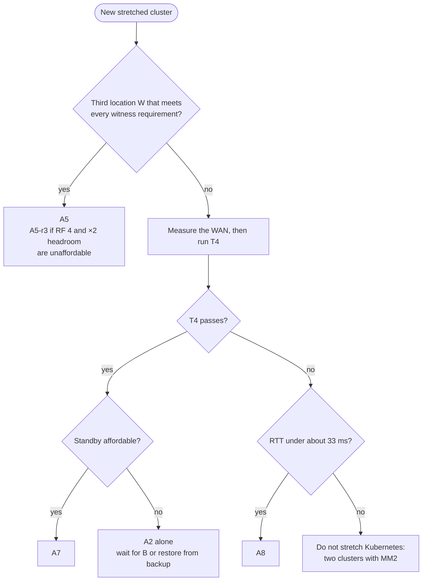

# Comparison and Summary

This page puts the eight candidate architectures side by side and ends with what to build, what it survives, what it does not, and what to test first. Each architecture's full failure matrix, diagram and values sketch are in [Candidate Architectures](02-architectures.md). The quorum and replication arguments behind every cell are in [Topology and Constraints](01-topology-and-constraints.md), the platform settings in [Platform Design on the Stretched Cluster](03-kubernetes-and-strimzi.md), and the test procedures in [Test and Chaos Scenarios](04-test-and-chaos-scenarios.md).

The analysis is checked against Kafka 4.3.1, Strimzi 1.2.0 and Kubernetes 1.34. The versions the repository pins are in the [Version & Compatibility Matrix](../book/appendix-d-versions.md).

The topology is fixed. Site A is one room, AZ1, so losing AZ1 and losing site A are the same event. Site B is two rooms, AZ2 and AZ3. One Kubernetes cluster spans all three rooms, and one cluster-wide Strimzi Cluster Operator manages Kafka. Only A5 adds a witness location W, which hosts one KRaft controller and one etcd member and never a broker.

## Notation

Every write below is an acks=all produce, `unclean.leader.election.enable` is `false`, and Eligible Leader Replicas (ELR, `eligible.leader.replicas.version=1`) is verified on the running cluster.

| Symbol | Meaning |
|---|---|
| `C 1/2/2`, `E 1/2/2`, `B 3/3/3` | KRaft controllers, etcd members and brokers in AZ1/AZ2/AZ3. `+1W` adds one at W. `B 3+3/3/3` splits AZ1 into two sub-racks, az1a and az1b |
| `R 2/1/1`, r_X | Replicas of one partition in AZ1/AZ2/AZ3; r_X is the number of those replicas inside domain X |
| RF, m | Replication factor, `min.insync.replicas` |
| P, D, f | Aggregate produce rate in bytes/s; logical data size; the mirrored fraction × (standby retention ÷ primary retention) |
| m0, m1 | Quorum margin left after the loss: how many more voters can fail before the quorum is lost |
| 0g | RPO 0, guaranteed. m > r_X, so every acknowledged record had an in-sync copy outside the lost domain X, even through a power loss |
| 0c | RPO 0, conditional. m ≤ r_X, so it is lossless only if E_X = 0 at the moment of failure (see below) |
| >0 | Acknowledged records can be lost by design: an asynchronous MirrorMaker 2 (MM2) copy, or a backup |
| E_X | Exposure: the number of partitions, internal topics included, whose ISR ∪ ELR lies entirely inside domain X. X is a site (A or B) for A1–A5 and A7, and a room (AZ2 or AZ3) for A6's site-B cluster and for A8, whose replicas all sit in site B. The ELR is empty while the ISR holds at least m replicas, so for a healthy partition this is its ISR. It must be 0 in steady state |
| auto | Recovers without a manual step, within t_f, t_fc or t_lag |
| t_f | A broker is fenced and its partitions change leader: about 9–10 s after its last heartbeat |
| t_c | A hard-lost active controller is replaced: about 10–20 s with the chart's quorum timers (election 5000 ms, fetch 10000 ms, backoff 5000 ms), and up to about 25 s after a split vote; 2–4 s with Kafka's defaults |
| t_fc | The active controller and brokers are lost in one event, so t_fc = t_c + t_f: about 20–30 s. This is typical, not a bound: a split vote can push it past 30 s. The 120 s `delivery.timeout.ms` still covers it |
| t_lag, t_r | A stalled follower is dropped from the ISR after 30–45 s; an isolated active controller resigns after 15 s |
| t_sd | Manual step-down R-SD, which lowers the topic-level m on the data topics, `__consumer_offsets` and `__transaction_state`: 5–15 min by hand |
| t_dr | Failover to a standby, R-DR. It includes fencing site B and recovering etcd in AZ1; the decision and the switch alone are estimated at 15–30 min, and T1 measures the real figure |

**What 0c means when E_X > 0.** Those partitions are offline while X is down. If X comes back without its brokers having restarted, as after a network cut, Kafka re-elects a leader from the ELR cleanly. If X's brokers restarted, Kafka elects the last known leader automatically, even with `unclean.leader.election.enable=false`, flags the election as unclean and the partition as RECOVERING: lossless after a process crash, silently missing the unflushed tail of acknowledged records after a power loss. If X is destroyed, the partitions stay offline. No Kafka 4.3.1 setting turns the automatic election off; to hold such partitions for manual reconciliation, keep the returning brokers from unfencing. [Last-Known-Leader Election After a Correlated Restart](01-topology-and-constraints.md#last-known-leader-election-after-a-correlated-restart) in Topology and Constraints has the mechanism.

## Pros and Cons

### A1: Symmetric 3-AZ, Three Voters

`C 1/1/1`, `E 1/1/1`, `B 3/3/3`, RF 3 (R 1/1/1), m 2. [Candidate Architectures](02-architectures.md#a1-symmetric-3-az-three-voters) has its failure matrix and values.

**Pros**
- The fewest parts, and the layout Strimzi documents for spreading a cluster over zones.
- Every single room, and all of site A, fails over automatically with RPO 0g, typically within t_fc.
- The lowest RF and the lowest WAN cost: 2P/3 of synchronous replication in each direction.
- `kates detect --generate-values` already writes this controller layout: one zone-pinned controller pool per detected zone.

**Cons**
- S6, the loss of site B, takes down Kafka and the Kubernetes API together: KRaft keeps 1 of 3 voters and etcd 1 of 3. A permanent loss has no supported KRaft recovery, so it means building a new cluster.
- During S6 no consumer group can commit offsets or rebalance. Consumers that are already assigned can read only the AZ1-led partitions, up to the frozen high watermark.
- Quorum margin 0 after any room loss: one more controller failure is a metadata outage.
- Every acks=all write waits for a replica in the other site.
- If WAN saturation drops the AZ1 followers from the ISR, about 1/3 of partitions (the AZ1-led ones) are Blocked while E_B rises silently on the rest.
- Draining AZ1 runs with E_B = 100% for the whole window.

**Verdict.** Keep it only for an existing three-controller cluster that is not yet worth rebuilding: verify that its controllers really sit one per AZ, and add A7's standby. For a new build, use A2.

### A2: Five Voters, Majority in Site B

`C 1/2/2`, `E 1/2/2`, `B 3/3/3`, RF 3, m 2. The two controllers in each site-B room run on different hosts. Variant **A2b** keeps `E 1/1/1`: the preferred site does not change, and Kubernetes keeps A1's margins. [Candidate Architectures](02-architectures.md#a2-five-voters-majority-in-site-b) has its failure matrix and values.

**Pros**
- Controller quorum margin 1 after losing site A: 4 of 5 voters remain and 3 are needed. Whether Strimzi can actually roll a controller during that outage is unverified. While any pinned pod is Pending or on a dead node, every reconciliation fails ([KafkaRoller](https://github.com/strimzi/strimzi-kafka-operator/blob/1.2.0/cluster-operator/src/main/java/io/strimzi/operator/cluster/operator/resource/KafkaRoller.java)), and T2 checks what happens.
- Five etcd members, which is what [Kubernetes recommends for production](https://kubernetes.io/docs/tasks/administer-cluster/configure-upgrade-etcd/).
- The same data plane, WAN cost and client settings as A1.

**Cons**
- The same S6 cliff as A1.
- Two more controller pods: about +4 GiB memory, +2–4 vCPU and +40 GiB disk at the `values-prod.yaml` sizes. Two more etcd members, which is the larger cost. Build them as five stacked control-plane nodes, or as an all-external etcd. Mixing stacked members with etcd-only nodes works only with manual etcd management, outside kubeadm.
- Under Strimzi 1.2.0's static quorum, an existing three-controller cluster reaches A2 only through a new cluster and an MM2 migration.
- Draining AZ1 runs with E_B = 100%.

**Verdict.** The best single stretched cluster without a third location, and the main cluster of A7. On its own it is acceptable only if "wait for site B, otherwise restore from backup" is an agreed disaster-recovery answer.

### A3: Controllers Weighted Toward Site A

`C 3/1/1` (the three AZ1 controllers on three hosts), `E 3/1/1`, `B 3/3/3`, RF 3, m 2. Rejected. [Candidate Architectures](02-architectures.md#a3-controllers-weighted-toward-site-a-rejected) has its layout and failure matrix.

**Pros**
- Survives S6 without an etcd disaster-recovery procedure, because the KRaft and etcd majorities both sit in AZ1.

**Cons**
- A single room becomes fatal. Losing AZ1 leaves KRaft and etcd at 2 of 5, and draining AZ1 is a planned outage of Kafka and the Kubernetes API.
- S6 is survived only onto a single copy. Every online partition is left with ISR {az1}, below m, so writes stay Blocked until R-SD lowers m to 1, `__consumer_offsets` included. AZ1's brokers then carry ×3 load. Partitions with E_B > 0 are offline, and the RPO is 0c.
- S7 becomes a global write outage: the A side is Blocked below m, and the B side has zombie leaders.
- It comes out ahead only if site B as a whole fails more often than the single AZ1 room, which also goes down with every site-A event.

**Verdict.** Never, in this topology. It fits only a topology where "AZ1" holds three or more independent power and cooling domains and site B is known to be the weaker site.

### A4: Site-Aware Durability Without a Witness

`C 1/2/2`, `E 1/2/2`, `B 3+3/3/3` over the racks az1a/az1b/az2/az3, RF 4 (R 2/1/1) on every topic, m 3. Rejected as a standalone design. [Candidate Architectures](02-architectures.md#a4-site-aware-durability-without-a-witness-rejected-standalone) has its failure matrix and values.

**Pros**
- RPO 0g for every single domain, correlated power loss included, because m 3 exceeds the replicas held in any domain: 2 in site A (= AZ1), 2 in site B, 1 in AZ2 or AZ3.
- Fails safe on WAN trouble: if the remote followers are dropped, writes stop rather than silently losing their cross-site copy, and E_X stays 0.

**Cons**
- S3, AZ1 maintenance and S7 all stop writes until R-SD (t_sd). In S7 the site-B side is Blocked below m and the site-A side has zombie leaders. R-SD must lower m on `__consumer_offsets` and `__transaction_state` as well as on the data topics. `__consumer_offsets` has no min ISR of its own and inherits the cluster m 3, and offset commits always use acks=all since Kafka 4.0 ([upgrade notes](https://github.com/apache/kafka/blob/4.3.1/docs/getting-started/upgrade.md#L245), KIP-1041). If it is left out, offset commits and group-state writes keep failing.
- S6 is still fatal. Every acknowledged record is on the AZ1 disks (0g), but no quorum can serve it, and salvaging it is unsupported.
- RF 4: +33% storage (4D) and 1.5× A1's cross-site replication (P in each direction).
- Four equal racks, which means splitting AZ1 into two genuinely independent power and top-of-rack groups.
- One broker down leaves its partitions at ISR 3 = m, so the KafkaRoller holds rolls of their other replicas.

**Verdict.** Rejected on its own. Its data layout is the module that A5-a uses per topic and A7-d uses for a whole main cluster.

### A5: Witness Tie-Breaker Plus Site-Aware Data

`C 2/1/1+1W` (one controller each in az1a, az1b, az2, az3 and W), `E 2/1/1+1W`, `B 3+3/3/3` with no brokers at W, RF 4 (R 2/1/1) on every topic, m 2 by default. Recommended when a third location exists. [Candidate Architectures](02-architectures.md#a5-witness-tie-breaker-plus-site-aware-data-recommended-with-a-third-location) has its failure matrix and values.

**Pros**
- The only design that survives every single failure domain, either whole site included, without a manual step. It is also the only design whose Kubernetes API survives both site losses.
- S1 through S8 recover without a manual step: typically within t_fc, and within t_lag for S8 and for S7 with the KRaft leader at W.
- RPO 0g for the loss of AZ2 or AZ3, and 0c for either site (AZ1 included), with the exposure visible ahead of time as E_X.
- If WAN saturation drops the remote followers, writes continue on each partition's local pair of replicas (ISR 2 = m).
- With all racks up, Cruise Control's RackAwareGoal works and the KafkaRoller rolls normally (ISR 4 > m).

**Cons**
- It needs a third location with independent network paths to both sites, and W becomes a P1 dependency. With W down, S3 or S6 is fatal and an A∣B split freezes both sides, 2 voters against 2.
- Site-loss RPO is 0c, not 0g. Partitions with E_X > 0 are offline while the site is down. If that site lost power, they come back by themselves when it returns, missing their unflushed tail.
- RF 4 costs +33% storage and P of cross-site replication in each direction. Every metadata and etcd commit crosses a location.
- Utilization must stay at 45% or below, because a site loss leaves 6 of 12 brokers carrying ×2.
- Nine node pools: four broker pools and five controller pools.
- Which side wins an A∣B split depends on where the KRaft leader sits. With the leader at W, each side serves about half of the partitions. etcd picks its own winner and can pick the other side, which leaves the Kafka side without pod lifecycle, so alert when the two differ.
- With Strimzi 1.2.0 the layout is final: a `C 1/1/1` or `C 1/2/2` cluster converts only through a new cluster and an MM2 migration. A future Strimzi release with dynamic quorums ([proposal #203](https://github.com/strimzi/proposals/pull/203)) could allow an in-place re-layout.

**Variants**
- **A5-a** (RPO first, per topic): m 3 on chosen topics. Site loss becomes 0g with no offline partitions. In exchange, writes to those topics are Blocked until R-SD on S3, on S6 and on the winning side of S7, and on both sides of S7 when the KRaft leader is at W. They are also Blocked wherever S9 drops both remote followers, and while AZ1 is drained unless an R-SD is planned. One broker down leaves them at ISR 3 = m, so rolls are held. `__consumer_offsets` keeps the cluster m 2 unless you override it deliberately.
- **A5-r3** (budget): the witness quorum with A1's data layout (`B 3/3/3`, RF 3, R 1/1/1, m 2). S3 is automatic and 0g. S6 keeps the quorum but Blocks writes until R-SD to m 1, which leaves one copy and ×3 load on AZ1, with RPO 0c. S1, S4, S5, S8 and draining AZ2 or AZ3 each leave ISR 2 = m, so broker rolls are held, and draining AZ1 runs with E_B = 100%. S7 with the KRaft leader in site B, and S9, behave as in A1. With the leader in site A, every write is Blocked until R-SD to m 1; with the leader at W, the AZ1-led partitions are Blocked once the ISRs shrink.
- **A5-3v** (minimum): `C 1/1/0+1W` and `E 1/1/0+1W`. It survives every single domain, with margin 0 after losing AZ1, AZ2, site B or W. Losing AZ3 costs no voter. Use it only if five control-plane nodes are unaffordable.

**Verdict.** Recommended whenever a qualifying third location exists. Keep off-cluster disaster recovery as well, as an MM2 copy to an independent cluster or as backups: a stretched cluster is still one failure domain for software and operator errors.

### A6: Two Independent Clusters With MirrorMaker 2

KA in site A: `C 3/0/0`, `B 3/0/0`, RF 3, m 2. KB in site B: `C 0/2/1`, `B 0/3/3`, RF 4 (always 2+2 over az2/az3), m 2. Both run on one stretched Kubernetes cluster with `E 1/2/2`. MM2 copies KB to KA (A6-p), or runs in both directions with prefixed topic names (A6-aa). Dominated by A8. [Candidate Architectures](02-architectures.md#a6-two-independent-clusters-one-per-site-with-mirrormaker-2-dominated) has its layout and failure matrix.

**Pros**
- No WAN in the acks path.
- The smallest blast radius: separate metadata, separate upgrades, separate configuration mistakes.
- The multi-datacenter pattern the [Apache Kafka documentation](https://github.com/apache/kafka/blob/4.3.1/docs/operations/datacenters.md#L29-L39) recommends.

**Cons**
- KB's majority sits in AZ2, so losing AZ2 (S4) or draining it is a manual disaster-recovery event. Inside site B, the two-room version of the two-site impossibility applies.
- The RPO is above 0 on the loss of site B (the MM2 lag), and in A6-aa on the loss of site A too. Losing AZ1 also takes the disaster-recovery copy with it.
- The Kubernetes control plane is still shared, so S6 also needs etcd recovery in AZ1 before any promotion step that goes through Kubernetes.
- Two clusters plus MM2 to operate, and failback by hand. A6-aa also needs application changes: prefixed topics, no ordering across sites, and two histories to reconcile on failback.

**Verdict.** A8 has the same site-B data plane and borrows one AZ1 voter as a tie-breaker, which removes KB's single-room point of failure. Choose A6 only if strict metadata isolation between the sites is mandated.

### A7: A2 Plus a Warm Standby in AZ1

A2's main cluster, plus a standby Kafka cluster KS (a Kafka CR `<cluster>-dr` in its own namespace, with 3 controllers and at least 3 brokers pinned to AZ1 and sized for 100% of peak load). MM2 feeds it in one direction with IdentityReplicationPolicy. Recommended with two sites only. [Candidate Architectures](02-architectures.md#a7-a2-plus-a-mirrormaker-2-warm-standby-in-az1-recommended-with-two-sites) has its failure matrix and values.

**Pros**
- A2's automatic, 0g handling of every room and of site A.
- A bounded, supported answer to S6: fail over to the standby. Nothing unsupported is ever done to the KRaft quorum.
- MM2 consumes with `client.rack=az1`, from the AZ1 follower replicas, so it adds no WAN traffic while AZ1 is in the ISR.
- IdentityReplicationPolicy keeps topic names, so clients move by switching the bootstrap DNS alias.
- The standby's separate metadata contains control-plane mistakes. MM2 still copies bad records.
- The same MM2 tooling is the migration path from A1 to A2 to A5.

**Cons**
- S6 has an RPO above 0: the MM2 lag at the moment of failure.
- The S6 recovery (R-DR) is serial. Stopping MM2, opening producer ACLs through KafkaUser resources and restarting in-cluster clients all go through the Kubernetes API, and site B's loss takes etcd down to 1 of 5. So you fence site B first, then recover etcd in AZ1 with `--force-new-cluster`, then promote the standby, and t_dr includes all three. The alternative is a documented promotion path that avoids the API.
- From site A, S6 and S7 look identical. Telling them apart is a human decision, and promoting during S7 creates two writable histories.
- A second cluster, MM2 and a failback procedure to operate. IdentityReplicationPolicy has no cycle detection, so it must never run in both directions.
- AZ1 holds 1D + 3fD of storage, and losing or draining AZ1 removes the disaster-recovery cover.
- Clients need a bootstrap DNS alias managed outside Kubernetes. The alias must be listed in `configuration.bootstrap.alternativeNames` on the client listener of both Kafka CRs, or TLS hostname verification fails after the switch. Both clusters also need shared cluster and clients CAs and identical KafkaUsers.
- MM2's `replication-latency-ms` and `record-age-ms` update only while records flow, so they miss a stalled mirror. Alert on the MM2 source consumer lag and on a lack of progress instead.

**Variant A7-d** (durability first): the main cluster uses A4's data layout (4 racks, RF 4, m 3). The RPO is 0g everywhere except the permanent loss of site B, where it is the MM2 lag. S3, AZ1 maintenance and the site-B side of S7 become write stops until R-SD, which must include `__consumer_offsets` (it inherits the cluster m 3) and `__transaction_state`.

**Verdict.** Recommended when only the two sites exist and the WAN passes T4.

### A8: Data Plane in Site B With an AZ1 Tie-Breaker

`C 1/2/2` where AZ1 holds only the controller, `E 1/2/2`, `B 0/3/3` (or 0/4/4), RF 4 (2+2 over az2/az3), m 2, plus A7's standby in AZ1. MM2 reads the site-B leaders across the WAN. The WAN fallback. [Candidate Architectures](02-architectures.md#a8-data-plane-in-site-b-az1-tie-breaker-az1-standby-wan-fallback) has its failure matrix and values.

**Pros**
- Synchronous replication stays inside site B, so the WAN is never in the data acks path.
- No zombie leaders in S7, because site A has no brokers.
- Site-A events never stall the site-B data path; at most, metadata pauses for t_c if the AZ1 controller was active. AZ1 maintenance is trivial: a controller and the standby.

**Cons**
- Room-loss RPO is only 0c, because each room holds 2 replicas = m.
- RF 4 plus ×2 headroom inside site B make it the most expensive design per unit of load served.
- Site-A clients always cross the WAN, to produce and to consume.
- On S6 there is no salvage copy in site A, unlike A7.
- When the KRaft leader is the AZ1 voter (about one election in five), the heartbeats, metadata fetches and ISR changes of every site-B broker cross the WAN. Severe WAN loss can then delay ISR changes, or even fence site-B brokers. Restart the AZ1 controller gracefully if it becomes the leader during WAN trouble.
- RF 4 on two racks makes Cruise Control's RackAwareGoal always fail, so rebalances need RackAwareDistributionGoal plus a `hard.goals` override.
- E_B is always 100% by construction, so exposure is tracked per room.

**Variant A8-aa**: the AZ1 cluster also serves site-A-local applications, with MM2 in both directions using DefaultReplicationPolicy and prefixed topics, as in A6-aa, and the same application changes.

**Verdict.** Choose it over A7 when T4 fails the synchronous gates but the RTT is still under about 33 ms, etcd's recommended bound.

## Comparison Table

### Failure Behavior

"fatal" means Kafka stays down until the lost domain returns; if it is lost for good, only a new cluster restored from a mirror or a backup brings Kafka back. The S9 column shows phase 2. In phase 1, every design whose ISRs span both sites (A1–A5 and A7) is first capped at the WAN capacity, with a higher produce P99 and `REQUEST_TIMED_OUT` retries. That may be the only effect: phase 2 starts only if remote followers fall behind long enough to be dropped from the ISR after t_lag.

| Arch | Layout | Room loss in B (S4/S5) | AZ1 = site A (S3) | Site B (S6) | RPO on site loss (A / B) | Kubernetes API after S3 / S6 | A∣B split (S7) | WAN degradation (S9), phase 2 |
|---|---|---|---|---|---|---|---|---|
| A1 | C 1/1/1, E 1/1/1, B 3/3/3, RF3 m2 | auto, 0g, m0 | auto, 0g, m0 | **fatal** | 0g / not servable until B returns; partitions with E_B > 0 lose their unflushed tail if B lost power | up / **down** | B wins; zombie leaders on the A side | The AZ1-led ~1/3 of partitions Blocked; E_B rises silently |
| A2 | C 1/2/2, E 1/2/2, B 3/3/3, RF3 m2 | auto, 0g, m0 | auto, 0g, **m1** | **fatal** | As A1 | up / **down** | B wins | As A1 |
| A3 | C 3/1/1, E 3/1/1, B 3/3/3, RF3 m2 | auto, 0g, m1 | **fatal** | Quorum up; writes Blocked until R-SD to m 1 | 0g on disk, not servable / 0c | **down** / up | Global write outage | As A1 |
| A4 | C 1/2/2, E 1/2/2, B 3+3/3/3, RF4 m3 | auto, 0g, m0 | Writes Blocked until R-SD; 0g | **fatal** (0g on disk, not servable) | 0g / 0g on disk | up / **down** | Global write outage until R-SD | Fail-safe: writes Blocked; E_X stays 0 |
| **A5** | C 2/1/1+1W, E 2/1/1+1W, B 3+3/3/3, RF4 m2 | auto, 0g, m1 | **auto, 0c**, m0 | **auto, 0c**, m0 | 0c / 0c (0g per topic with A5-a, which then needs R-SD) | up / up | The side holding the KRaft leader wins; leader at W → about half the partitions served on each side | Keeps writing on local pairs; E_X rises |
| A6 | KA C 3, B 3; KB C 0/2/1, B 0/3/3, RF4 m2; E 1/2/2 | AZ2: KB loses its quorum, R-DR, >0. AZ3: auto, 0c | KB unaffected; DR copy lost | R-DR, >0 | KB unaffected (A6-aa: >0) / >0 (MM2 lag) | up / **down** | B clients unaffected; do not promote | Not in the acks path; MM2 lag grows |
| **A7** | A2 + KS (C 3, B ≥ 3 in AZ1) | auto, 0g, m0 | auto, 0g, m1; DR copy lost | **R-DR, t_dr** | 0g / >0 (MM2 lag) | up / **down** | B wins; never promote KS | As A1, plus MM2 lag |
| A8 | C 1/2/2, E 1/2/2, B 0/3/3, RF4 m2 + KS | auto, **0c**, m0 | No data impact; DR copy lost | R-DR, t_dr | 0 (no data in A) / >0 (MM2 lag) | up / **down** | B wins; no zombie leaders | Not in the data acks path while the KRaft leader is in B; MM2 lag grows |

S7 and S8 lose no domain, so their event RPO is 0 for acks=all in every design. What they can create is exposure: during an A∣B split, new writes are durable only on the serving side (E = 100% for that site), and during an AZ2∣AZ3 split in A8 or in A6's KB, only in one room. acks=0 and acks=1 records written to a zombie leader on the losing side are truncated at the heal.

### Latency, Infrastructure and Operations

| Arch | Write-latency cost | Extra infrastructure vs A1 | Operations | Verdict |
|---|---|---|---|---|
| A1 | At least one cross-site RTT per acks=all batch; metadata commits stay in B while the KRaft leader is in B | – | Low | Existing clusters only |
| A2 | As A1 | +2 controllers, +2 etcd members | Low | The main cluster of A7 |
| A3 | As A1 for data; metadata commits stay in A while the leader is in A | +2 controllers, +2 etcd members | Low | **Rejected** |
| A4 | At least one RTT; P each way | +3 brokers, +2 controllers, +2 etcd members, +33% storage, two AZ1 sub-racks | Medium | **Rejected** standalone |
| **A5** | At least one RTT; P each way; every metadata and etcd commit crosses a location | W location, +3 brokers, +2 controllers, +2 etcd members, +33% storage, two AZ1 sub-racks | High | **Recommended with a third location** |
| A6 | None for site-B clients; site-A clients pay the RTT | A second cluster (+3 controllers), MM2, a DNS alias, +2 etcd members | High | Dominated by A8 |
| **A7** | As A1 | A standby cluster, MM2, a DNS alias, +2 controllers, +2 etcd members | High | **Recommended with two sites** |
| A8 | Site-A clients only | A standby cluster, MM2, a DNS alias, +2 controllers, +2 etcd members, RF 4 and ×2 headroom in site B | High | WAN fallback |

## Cost and Capacity

| Arch | Controllers | Brokers (example) | Storage | Synchronous cross-site replication | etcd members | Utilization ceiling (≤ 90% after the worst survivable loss) |
|---|---|---|---|---|---|---|
| A1 | 3 | 9 | 3D | 2P/3 each way | 3 | 60% |
| A2 | 5 | 9 | 3D | 2P/3 each way | 5 (A2b: 3) | 60% |
| A3 | 5 | 9 | 3D | 2P/3 each way | 5 | – (rejected) |
| A4 | 5 | 12 | 4D | P each way | 5 | 45% |
| A5 | 5 (1 at W) | 12 | 4D | P each way | 5 (1 at W) | 45% |
| A6 | 3 + 3 | 3 + 6 | 4D + 3fD | 0 (MM2 about fP, asynchronous) | 5 | KB 45%; KA sized for 100% |
| A7 | 5 + 3 | 9 + ≥ 3 | 3D + 3fD (AZ1 holds 1D + 3fD) | 2P/3 each way (MM2 adds 0 while AZ1 is in the ISR) | 5 | Main 60%; KS sized for 100% |
| A8 | 5 + 3 | 6 + ≥ 3 | 4D + 3fD | 0 (MM2 about fP from B to A, asynchronous) | 5 | Site B 45%; KS sized for 100% |

The utilization ceilings follow from the load a survivor inherits. Losing an AZ in A1, A2 or A7 moves about 1/3 of leadership onto 6 of 9 brokers (×1.5, so 60% becomes 90%). Losing a site in A4 or A5, or a room in A6's KB or in A8, doubles the load on the survivors (×2, so 45% becomes 90%).

### Where the Replication Figures Come From

- **2P/3 in each direction (RF 3, R 1/1/1).** The site-B-led partitions, 2/3 of them, each send one copy to AZ1. The AZ1-led third each sends two copies to site B.
- **P in each direction (RF 4, R 2/1/1).** The site-A-led half sends two copies to site B, and the site-B-led half sends two copies to site A.
- **MM2 in A7.** It reads the AZ1 followers, so it adds nothing while AZ1 is in the ISR. Once the AZ1 replicas leave the ISR, MM2 falls back to the site-B leaders and mirrors about fP across the WAN.

### Client Traffic Across the WAN

The replication figures leave out client traffic, and the WAN has to carry both. Producers always write to the partition leader, wherever it is: rack-aware producer partitioning ([KIP-1123](https://cwiki.apache.org/confluence/display/KAFKA/KIP-1123:+Rack-aware+partitioning+for+Kafka+Producer)) is not in 4.3.1; it is planned for 4.4.0, which is unreleased. So a site-A producer sends about 2/3 of its bytes to site B in A1, A2 and A7, about half in A5, and all of them in A8. A site-B producer sends about 1/3 of its bytes to AZ1 in A1, A2 and A7, and about half in A5. Consumers cross the WAN when they set no `client.rack`, when their local replica has left the ISR, or when there is no local replica, as for site-A consumers in A6 and A8. Add both to the bandwidth need that T4 tests.

### Per-Connection Ceilings

- Each broker opens one replica-fetcher connection per fetcher thread per source broker. With the chart's `num.replica.fetchers` of 3, each AZ1 broker in A1 holds 3 × 6 = 18 connections to site B.
- With the default 64 KiB `replica.socket.receive.buffer.bytes`, the TCP window caps each connection at about 3.2 MB/s at 20 ms RTT and 1.3 MB/s at 50 ms.
- At 20 ms and 1% packet loss, the Mathis model gives about 0.9 MB/s per connection.

These are model figures, not measurements. Size the socket buffers to the bandwidth-delay product (1 Gbit/s × 20 ms ≈ 2.5 MB), as the [Kafka documentation](https://github.com/apache/kafka/blob/4.3.1/docs/operations/datacenters.md#L37) advises for high-latency links, and measure the result with T4.

### Catch-Up After an Outage

While a domain is down, every leader moves to the surviving side. When the domain returns, its replicas have to fetch the backlog and keep up with the ongoing writes at the same time, and leadership moves back only after they have rejoined the ISR (preferred-leader rebalance, checked every 300 s). So during catch-up the ongoing stream toward the returning domain is copies × P, not the pre-outage figure. In A5 it is 2P.

- **Backlog** = P × T × copies, where T is the outage duration and copies is the number of replicas of each partition held in the returning domain. That is 1 for AZ1 in A1, A2 and A7, and 2 for either site in A4 and A5.
- **Catch-up time** = backlog ÷ (capacity − copies × P). Capacity is the WAN bandwidth toward the returning domain, less any client traffic on the same path.
- **If capacity ≤ copies × P,** the returning replicas never catch up, and under-replication never clears. Add bandwidth or shed load.

Worked example, with P = 50 MB/s and T = 1 h:

| Case | Copies | Backlog | Ongoing stream | Catch-up at 1 Gbit/s (125 MB/s) | Catch-up at 2 Gbit/s (250 MB/s) |
|---|---|---|---|---|---|
| A1, A2 or A7: AZ1 returns | 1 | 180 GB | 50 MB/s | 180 GB ÷ 75 MB/s = 40 min | 180 GB ÷ 200 MB/s = 15 min |
| A5: either site returns | 2 | 360 GB | 100 MB/s | 360 GB ÷ 25 MB/s = 4 h | 360 GB ÷ 150 MB/s = 40 min |

In A8, a returning room catches up inside site B and does not use the WAN. Catch-up traffic is unthrottled by default. A replication quota protects client traffic, but it lengthens the catch-up by the same arithmetic, and the leadership move back causes a second latency blip.

## Decision Rule

1. **Is there a third location W** that meets all of these?
   - It has independent power, and its network paths to site A and to site B do not pass through the other site. A tunnel that terminates in site B puts W inside site B's failure domain.
   - Its RTT to both sites is at most 33 ms (recommended) and at most 66 ms (maximum) with etcd's default 100/1000 ms timers ([OKD etcd performance](https://docs.okd.io/latest/etcd/etcd-performance.html)). Above that, set the 500/2500 ms profile on every etcd member and validate it with T4.
   - It can host one etcd member and one KRaft controller, sized as a full member of each because either can become leader: about 4 vCPU, 12–16 GiB, an SSD with WAL fsync P99 under 10 ms, and 100 Mbit/s to 1 Gbit/s to each site.
   - It can join the stretched Kubernetes cluster, because Strimzi manages Kafka inside one Kubernetes cluster, with a CNI MTU that accounts for any tunnel.
   - Its restore time can be held to an SLO.

   **→ A5**, decided before the cluster is created. If RF 4 and ×2 headroom are unaffordable, use A5-r3 and rehearse R-SD to m 1.
2. **Otherwise, measure the WAN** (RTT P99, jitter, bandwidth) and run T4 at 2 × the measured RTT P99, with 1% loss, and with bandwidth capped at 1.5 × the total WAN need: the synchronous replication need plus the client traffic that crosses the WAN.
   - **Pass:** 0 KRaft elections, 0 etcd leader changes and 0 ISR shrinks over 10 min, produce P99 within the SLO, and E_X = 0. **→ A7**, or A2 alone if a standby is unaffordable. As a heuristic, passing usually needs an RTT P99 of about 10 ms or less.
   - **Fail, but the RTT is still under about 33 ms**, etcd's recommended bound: **→ A8**.
   - **Worse than that:** do not stretch Kubernetes. Run two Kubernetes clusters with MM2 between them, which is outside this topology.
3. **An existing three-controller cluster (A1):** keep it. Check that its controllers really sit one per AZ by comparing `kubectl get pod -n <namespace> -l strimzi.io/controller-role=true -o wide` with the node zones, then add A7's standby. Move to A2 or A5 later with the same MM2 tooling.
4. **Never:** A3; an even number of voters; dual-role nodes; controllers placed by soft spreading; an etcd majority on a different side from the KRaft majority; or an edit to a controller pool of a running cluster.

## Final Summary

### What to Build

- **With the two sites only: A7.**
  - The main cluster is A2: `C 1/2/2`, `E 1/2/2`, `B 3/3/3` over the racks az1/az2/az3, RF 3, m 2, with internal topics at RF 3 and min ISR 2.
  - The warm standby KS sits in AZ1, with 3 controllers and at least 3 brokers on hosts other than the main cluster's AZ1 brokers, sized for 100% of peak load.
  - A KafkaMirrorMaker2 with 2 workers pinned to AZ1 reads the main cluster with `client.rack=az1`. It uses IdentityReplicationPolicy in one direction, `replication.factor` 3, `sync.group.offsets.enabled=true`, and `emit.checkpoints.interval.seconds` and `sync.group.offsets.interval.seconds` of 10–15. Producer ACLs on KS stay closed until promotion.
  - Every room and all of site A fail over automatically with RPO 0g. Site B becomes one rehearsed decision, R-DR, with RPO = the MM2 lag and RTO = t_dr.
- **With a third location: A5.** Controllers `C 2/1/1+1W`, etcd `E 2/1/1+1W` with the etcd leader kept off W, brokers `B 3+3/3/3` over az1a/az1b/az2/az3, RF 4 on every topic, internal topics included, and m 2 by default. Use m 3 per topic (A5-a) for data that must be 0g. Decide it before the production install.
- **If T4 fails but the RTT is under about 33 ms: A8.**
- **If RPO 0g through a site-B power loss is mandatory: A7-d,** accepting that an AZ1 loss or AZ1 maintenance stops writes until R-SD.
- **If a standby is unaffordable: A2 alone,** with "wait for site B, otherwise restore from backup" agreed in writing. The chart's Velero backup is off in `values.yaml` (`backup.enabled: false`) and on in `values-prod.yaml`, daily at `0 2 * * *`, so the RPO is up to 24 h. `values-prod.yaml` stores it in the chart's in-cluster SeaweedFS (`storageLocation: seaweedfs`), which runs on the stretched cluster itself and can sit in site B. For this purpose, point Velero at a storage location outside the stretched cluster and outside site B. A full-cluster restore into AZ1 has not been tested.

### Whatever You Build

Every design needs the same baseline, listed item by item in the [Minimum Configuration Set](README.md#minimum-configuration-set) of Kafka on a Stretched Kubernetes Cluster and detailed in [Platform Design on the Stretched Cluster](03-kubernetes-and-strimzi.md). In short:

- **Quorums fixed at creation.** Dedicated, pinned controller pools with an odd voter count and no dual-role nodes, an etcd layout with the same preferred side as KRaft, and an admission policy that denies any change to a controller pool of a running cluster.
- **Placement from the pins.** Every pool pinned with `zone:`, `kafka.rack` of type `environment-variable` with `topologyKey: null`, equal broker counts per rack, and zonal `WaitForFirstConsumer` storage.
- **Replication settings stated, not inherited.** `min.insync.replicas` set explicitly, internal topics at the data topics' RF and min ISR, unclean election off, and ELR v1 confirmed on the running cluster.
- **Exposure and quorum made visible.** The E_X metric and alert, the [Kafka Cluster Runbook](../kafka-cluster-runbook.md) alerts, and MM2 lag alerts wherever there is a standby.
- **Controller disks never replaced,** and the runbooks R-DRAIN, R-SD and R-DR written and rehearsed.

### What It Survives

"auto" is the data-plane outcome. Strimzi itself cannot finish a reconciliation while any pinned pod is Pending or sits on a dead node, so no roll completes during an AZ outage in any design, and that includes certificate-renewal rolls.

| Scenario | A2 alone | A7 | A8 | A5 |
|---|---|---|---|---|
| S1 broker pod or node | auto, 0g, t_f | As A2 | auto, 0g; ISR 3, margin 1 | auto, 0g; ISR 3, margin 1 |
| S2 one controller | auto, 0g, t_c; quorum m1 | As A2 | auto, 0g; m1 | auto, 0g; m1 |
| S3 AZ1 = site A | auto, 0g, t_f/t_fc; quorum m1 | auto, 0g; the standby and MM2 are lost | No data impact; the standby is lost | auto, **0c**; quorum m0, and W is now critical |
| S4 or S5 one room in B | auto, 0g; m0; metadata commits now need the AZ1 voter, so they cross the WAN | As A2 | auto, **0c**; m0; ×2 load on the other room | auto, 0g; m1 |
| S6 site B | **fatal:** wait for B, or restore from backup | **R-DR:** RPO = MM2 lag, RTO = t_dr | **R-DR:** RPO = MM2 lag, RTO = t_dr | auto, **0c**; the Kubernetes API survives |
| S7 A∣B split | B serves; site-A clients down until the heal | As A2; never promote KS | B serves; no zombie leaders; site-A clients down | The side holding the KRaft leader serves; leader at W → about half on each side |
| S8 AZ2∣AZ3 split | Server side auto in t_f to t_lag; event RPO 0; cross-room client paths down | As A2 | auto; new writes durable in one room until the heal | auto in t_f to t_lag; event RPO 0; cross-room client paths down |
| S9 WAN degradation | Phase 1 cap; phase 2 Blocks the AZ1-led ~1/3 while E_B rises | As A2, plus MM2 lag | Site-B data path unaffected while the KRaft leader is in B; MM2 lag grows | Phase 1 cap; phase 2 keeps writing on local pairs while E_X rises |
| S10 etcd quorum loss | Kafka keeps serving; no pod is created or recreated until etcd returns | As A2; KS keeps running | As A2 | As A2; less likely, since a site loss no longer breaks etcd |
| S11 witness loss | n/a | n/a | n/a (losing the AZ1 controller is S3) | auto; restore W within its SLO |
| S12 drain one AZ | R-DRAIN; ISR = m for the window; draining AZ1 runs with E_B = 100% | As A2; draining AZ1 also stops KS and MM2 | R-DRAIN; draining AZ1 is trivial; draining a room doubles the other's load | R-DRAIN with W healthy; draining AZ1 leaves ISR 2 = m and E_B = 100% |

### What It Does Not Survive

- **Site B, in any two-site design.** No voter placement confined to two sites survives both the loss of site A and the loss of site B, for KRaft and for etcd alike. Tolerating a room loss forces the majority into site B, so site B's loss is always the cliff. A6, A7 and A8 turn it into R-DR with RPO > 0. A1, A2 and A4 lose Kafka and the Kubernetes API together. A3 only moves the cliff to AZ1. The [Apache Kafka documentation](https://github.com/apache/kafka/blob/4.3.1/docs/operations/datacenters.md#L29-L39) advises against one cluster over a high-latency link, and a [Strimzi maintainer](https://github.com/orgs/strimzi/discussions/11012) states that two zones cannot give fully automatic availability and reliability.
- **The permanent loss of the KRaft majority.** Kafka 4.3.1 has no supported recovery. [KIP-1347](https://cwiki.apache.org/confluence/display/KAFKA/KIP-1347:+Overriding+voter+set+on+storage+formatting) is under discussion and covers only endpoint changes. The quorum-recovery tooling in [Confluent for Kubernetes](https://docs.confluent.io/operator/current/co-disaster-recovery.html) is Confluent Platform only. What remains is a new cluster, with a new cluster ID, restored from a mirror or a backup.
- **A5 once W is down.** A later S3 or S6 is fatal, and an A∣B split freezes both sides. With `C 2/1/1+1W`, the double faults W + AZ1, W + site B, and AZ1 + either room in site B all lose the quorum.
- **A power loss in a domain X with E_X > 0.** This covers either site in A5 at m 2, a room in A8 or in A6's KB, and site B in A1, A2, A3 and A7. When X returns, its exposed partitions come back by themselves, missing their unflushed tail. Each one counts as an unclean election and passes through RECOVERING.
- **acks=0 and acks=1 writes on the losing side of S7.** Zombie leaders accept them, and they are truncated at the heal.
- **Losing a controller's disk.** Strimzi 1.2.0 formats an empty controller volume automatically at pod start ([`kafka_run.sh`](https://github.com/strimzi/strimzi-kafka-operator/blob/1.2.0/docker-images/kafka-based/kafka/scripts/kafka_run.sh#L55-L62)). The controller then rejoins the static quorum as a voter with an empty log and no vote state, and it can vote twice in one epoch. Never delete or replace a controller PVC, and never annotate a controller pod with `strimzi.io/delete-pod-and-pvc`. If a controller disk is lost, keep the pod from starting until every other voter is healthy and caught up.
- **Software and operator errors.** A stretched cluster is one failure domain for a bad configuration, a bad upgrade or bad records, and MM2 copies bad records too. Keep an off-cluster copy in every design.

### What to Test First

Run the tests in a lab first, then on the real cluster. The lab is a kind cluster with one control-plane node per zone and a site label on every node; the repository's `config/cluster.yaml` has a single control-plane node, so it cannot test the etcd side. The procedures, JSON plans and scenario files are in [Test and Chaos Scenarios](04-test-and-chaos-scenarios.md), and the lab in its [Lab Emulation](04-test-and-chaos-scenarios.md#lab-emulation) section.

| Order | Test | Settles | Needs infrastructure action |
|---|---|---|---|
| 1 | T0 (correlated pod kills per AZ, then a site-B transient) | The entry gate: any `lostRecords` > 0 or `dataLossPercent` > 0 disqualifies a design | No: one JSON plan per AZ and one for site B on the Kubernetes backend (`kates.chaos.provider=kubernetes`), with an INTEGRITY workload running alongside |
| 2 | T1 (sustained site-B loss, control plane included) | A5's automatic survival, A2's outage, or A7 and A8's full R-DR: fence B, recover etcd, promote, switch the alias. Measure t_dr, and measure the RPO with an external producer ledger | Yes: power off or firewall every site-B node for at least 30 min |
| 3 | T3 (symmetric A∣B cut, 2 min then 7 min) | Which side wins, zombie-leader loss for acks=1, and no election flapping | Yes: a firewall or CNI deny between the site CIDRs |
| 4 | T4 (S9 sweep) | Which design the WAN allows (A7 or A8). Record the first failing step, and whether phase 2 was reached (IsrShrinksPerSec > 0). etcd's behavior is observed, not predicted | Yes: `tc` or a WAN emulator. Kates has no bandwidth fault and no packet-loss DisruptionType. Its `NETWORK_LATENCY` runs only through Litmus `pod-network-latency`, which the kates-chaos chart does not install (nor `pod-network-loss`), and whose helper pods may need a Kyverno exception |
| 5 | T5 (WAN cap until exposure, then a site-B power cycle) | The price of m 2: A5's exposed partitions return by themselves, missing their tail | Yes: WAN cap plus a hard power cycle (BMC). kind cannot reproduce it: its nodes share the host's page cache |

T4 also runs earlier, in the lab at the measured WAN figures, as step 2 of the decision rule. After these five, run T2, T7, T8, T6 (A5 only), then T9 and T10, the platform and calibration tests. The [test × architecture matrix](04-test-and-chaos-scenarios.md#test-and-architecture-matrix) shows which test separates which designs.

- **T0 grading.** Gate on `lostRecords` and `dataLossPercent` from an INTEGRITY run; `kates test get <id>` prints both. A correlated pod kill is an unclean shutdown for every broker it hits, so unclean elections afterwards are expected: identify them by the RECOVERING state together with a restart, and do not count them against the design when `lostRecords` is 0. In A1, A2, A4 and A7 the site-B transient blocks writes at ISR = the AZ1 replicas, below m, until the site-B replicas catch up. [T0](04-test-and-chaos-scenarios.md#t0-correlated-transient-kills) has the expected result per architecture.
- **T1 and T5 expectations.** [T1](04-test-and-chaos-scenarios.md#t1-sustained-loss-of-site-b) and [T5](04-test-and-chaos-scenarios.md#t5-exposure-then-a-site-b-power-cycle) give them per architecture. In short: A5 keeps a quorum and writes within t_fc; A2 is down until site B returns; A7 and A8 go through R-DR, with the RPO measured by an external producer ledger because Kates INTEGRITY cannot span two clusters; and after a power cycle, A5's exposed partitions return by themselves, missing their unflushed tail.
- **Why the site-level tests need infrastructure.** Every Kafka pod that Kates kills comes straight back, because StrimziPodSets recreate deleted pods. `NETWORK_PARTITION` is a per-pod deny-all NetworkPolicy, which does nothing next to the chart's allow policies. `SCALE_DOWN` lowers a KafkaNodePool's `spec.replicas` and removes a broker for good once the remove-brokers auto-rebalance has emptied it ([Scaling Down a Node Pool](../book/07-chaos-practice.md#scaling-down-a-node-pool)): a persistent, destructive change, not a zone outage. A disruption plan's `maxRtoMs` measures Kafka pods Ready again, not the client-perceived recovery, so INTEGRITY results stay the primary evidence ([Interpreting Integrity Results](../book/08-data-integrity.md#interpreting-integrity-results)). [What Needs Infrastructure](04-test-and-chaos-scenarios.md#what-needs-infrastructure) lists the infrastructure part of every test.

### Next Steps

1. **Settle the location question first.** Find out whether a qualifying W exists. Strimzi 1.2.0 supports no change to the controller layout after creation, so A5 has to be chosen before the production install.
2. **Plan the Kubernetes upgrade.** Build production on Kubernetes 1.35 or later.
3. **Measure the WAN.** `kates detect` measures a cross-AZ ping matrix (minimum, average, maximum and jitter over five pings per pair), and `kates detect --bench-network` adds iperf3 bandwidth sweeps between the AZs. Five pings give no P99, so also collect `etcd_network_peer_round_trip_time_seconds` P99 over a representative period. Then run T4 in the lab at the measured figures, and apply the decision rule.
4. **Write the values overlay.** Define `nodePools.pools` explicitly, in an overlay layered after `values-prod.yaml`: lists are replaced rather than merged, the production pools are unpinned, and `values-prod.yaml` clears the pools that `kates detect --generate-values` writes. Render it with `helm template` and check the pins, the rack settings and the anti-affinity. See the [kafka-cluster](../../charts/kafka-cluster/README.md) chart README and [How the Values Sketches Are Written](02-architectures.md#how-the-values-sketches-are-written) in Candidate Architectures for the sketches.
5. **Add the guards.** Add the controller-pool admission policy, and write the controller-disk rule (never delete a controller PVC) into the runbooks.
6. **Build the monitoring.** Add the E_X exporter and alert, the MM2 alerts for A7 and A8 (source consumer lag, no progress, and `checkpoint-latency-ms` from the checkpoint connector), the alerts of the [Alert Set](03-kubernetes-and-strimzi.md#alert-set) in Platform Design on the Stretched Cluster, and the etcd leader, peer RTT and WAL fsync panels.
7. **Write and rehearse the runbooks.** R-DRAIN for planned AZ work; R-SD, naming `__consumer_offsets` and `__transaction_state`; and R-DR in its serial order: fence site B, run etcd `--force-new-cluster` in AZ1, then promote. Include the failback, which builds a new stretched cluster and cuts over in a window. The [Runbooks](03-kubernetes-and-strimzi.md#runbooks) section of Platform Design on the Stretched Cluster has all three and the [failback](03-kubernetes-and-strimzi.md#failback-after-r-dr).
8. **Run the tests.** Run them in the order above: T0, T1, T3, T4 on the real WAN, T5, then T2, T7, T8, T6 for A5, then T9 and T10. Score the results with the [scoring model](04-test-and-chaos-scenarios.md#scoring-model) of Test and Chaos Scenarios, and repeat T0 and T4 after any change to timers, buffers or the WAN.
9. **Close the tooling gaps.**
   - Kates: a sustained zone-outage fault at node level, a symmetric partition with peer selectors, a bandwidth-cap fault, E_X in the ISR snapshot, `client.rack` on benchmark consumers, an integrity result and an RPO gate on `kates resilience run`, an integrity check that spans two clusters, and a kind configuration with three to five control-plane nodes and a `w` node.
   - The kafka-cluster chart: KafkaNodePool annotations for `strimzi.io/next-node-ids` (the chart renders only `helm.sh/resource-policy`), `replica.selector.class`, a production backup location outside the cluster, and a README prerequisite that still says Kubernetes 1.27 or later, where Strimzi 1.2.0 needs 1.30 or later.
