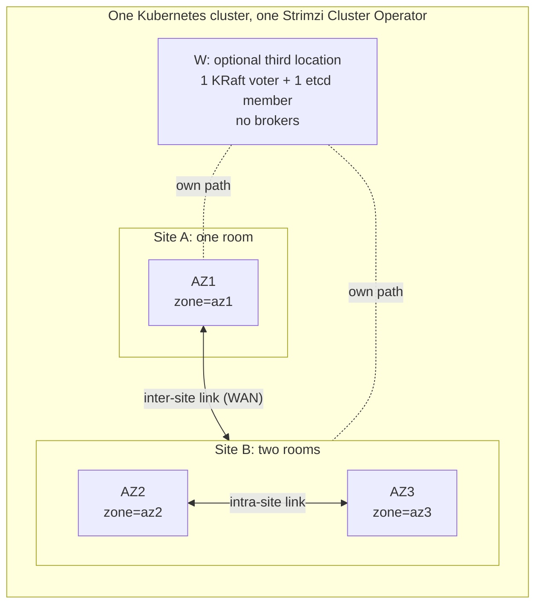

# Kafka on a Stretched Kubernetes Cluster

This set designs Kafka for one Kubernetes cluster stretched over two sites and three availability zones. Site A is a single room (AZ1). Site B holds two rooms (AZ2 and AZ3). One Strimzi Cluster Operator watches every namespace and runs Kafka in KRaft mode with KafkaNodePools. The set compares eight architectures (A1–A8) against twelve failure scenarios (S1–S12), recommends one design for two sites alone and one for when a third location exists, and defines the tests that prove the choice with Kates.

The analysis was checked against Kafka 4.3.1, Strimzi 1.2.0 and Kubernetes 1.34. The platform's pins live in the [Version & Compatibility Matrix](../book/appendix-d-versions.md). Kubernetes 1.34 reaches end of life on 2026-10-27 ([Kubernetes releases](https://kubernetes.io/releases/)), so build production on 1.35 or later.

## The Topology

- Losing AZ1 and losing site A are the same event. Losing site B loses two of the three AZs.
- Rooms are identified by the node label `topology.kubernetes.io/zone`, which you set by hand on-premises. Kubernetes has no notion of a site, so a custom node label such as `example.com/site=a|b|w` carries it.
- W is a location that fails independently of both sites and reaches each of them without crossing the other. Only A5 uses it.

## Notation Used in This Set

| Notation | Meaning |
|---|---|
| `C 1/2/2`, `E 1/2/2`, `B 3/3/3` | KRaft controllers, etcd members and brokers in AZ1/AZ2/AZ3. `+1W` adds one at W. `B 3+3/3/3` splits AZ1 into two rack groups, az1a and az1b. |
| `R 2/1/1`, RF, m | Replicas of one partition per AZ, replication factor, `min.insync.replicas` |
| q, mK | q = ⌊N/2⌋ + 1 is the majority of N voters. mK is the margin: K more voters can be lost before the quorum goes. |
| 0g / 0c / >0 | RPO for acks=all producers. **0g**: guaranteed zero, because m > r_X (the replicas inside the lost domain X), even through a power loss. **0c**: zero only if E_X = 0 at the moment of failure. **>0**: loss is possible by design, as with an asynchronous MirrorMaker 2 (MM2) copy. |
| E_X | Exposure: the partitions, internal topics included, whose ISR ∪ ELR lies entirely inside domain X. X is site A or site B for A1–A5 and A7, and room AZ2 or AZ3 for A8 and A6's site-B cluster. It must be 0 in steady state. |
| t_f | A broker is fenced and its partitions change leader: 9–10 s after its last heartbeat |
| t_c | A new active controller after a hard loss: about 10–20 s with the chart's quorum timers (election 5000 ms, fetch 10000 ms, backoff 5000 ms), up to about 25 s with a split vote |
| t_fc | The active controller and brokers are lost together: t_c + t_f, typically 20–30 s |
| t_lag | A follower that stops keeping up leaves the ISR: 30–45 s |
| t_dr | Manual failover to a standby cluster (runbook R-DR): the decision, fencing site B, recovering etcd in AZ1, and the promotion |

The producer default `delivery.timeout.ms` of 120 s outlasts every automatic recovery above. [Topology and Constraints](01-topology-and-constraints.md) defines every term in full: see its [Notation](01-topology-and-constraints.md#notation), [RPO Symbols](01-topology-and-constraints.md#rpo-symbols) and [Timers](01-topology-and-constraints.md#timers).

## The Short Answer

**No layout confined to two sites survives the loss of either site automatically.** KRaft controllers and etcd members are both Raft voters, and each quorum needs a majority of its voters ([KRaft](https://github.com/apache/kafka/blob/4.3.1/docs/operations/kraft.md#L47), [etcd](https://etcd.io/docs/v3.6/faq/)). If every voter sits in site A or site B, surviving the loss of A needs n_B ≥ q and surviving the loss of B needs n_A ≥ q, so N = n_A + n_B ≥ 2q > N. That holds for every N and every split between AZ2 and AZ3. Site A is also a single room, so tolerating the loss of any one room forces the majority into site B. Site B becomes the preferred site for both quorums, and losing it stops Kafka metadata and the Kubernetes API together ([The Two-Site Impossibility](01-topology-and-constraints.md#the-two-site-impossibility)).

**Kafka has no supported recovery from losing that majority.** etcd has a manual, possibly lossy path: fence the old majority, then run `--force-new-cluster` on a survivor ([etcd runtime reconfiguration](https://etcd.io/docs/v3.6/op-guide/runtime-configuration/)). Apache Kafka 4.3.1 has no supported procedure: [KIP-1347](https://cwiki.apache.org/confluence/display/KAFKA/KIP-1347:+Overriding+voter+set+on+storage+formatting) is still under discussion, and the quorum-recovery commands of [Confluent for Kubernetes](https://docs.confluent.io/operator/current/co-disaster-recovery.html) are Confluent Platform only. Strimzi 1.2.0 runs static controller quorums only and does not support changing controller pools later ([deploying guide](https://strimzi.io/docs/operators/1.2.0/deploying.html)), so the voter layout is fixed when you create the cluster. Losing site B for good means losing the Kafka cluster.

**Data has the same shape of limit.** Take a partition with r_X of its replicas inside a domain X. An acknowledged record is guaranteed to survive the loss of X, power loss included, only if m > r_X. Writes continue without a configuration change only if RF − r_X ≥ m. Sites A and B hold every replica between them, so "writes continue automatically after losing AZ1" and "RPO 0g after losing site B" exclude each other for any RF, m and placement. A witness stores no data and cannot change this ([What Is Guaranteed Where](01-topology-and-constraints.md#what-is-guaranteed-where)).

**What that means for you.** With two sites, one site loss is automatic (site A, because the majority sits in B) and the other becomes one rehearsed manual decision: fail over to a standby cluster fed by MM2, and accept its lag as the RPO. Only a third location that holds tie-breaking KRaft and etcd voters makes both site losses automatic. Apache Kafka advises against running one cluster over a high-latency link ([datacenters.md](https://github.com/apache/kafka/blob/4.3.1/docs/operations/datacenters.md#L29-L39)), and Strimzi's maintainers make the same point about two zones ([discussion #11012](https://github.com/orgs/strimzi/discussions/11012)).

## The Recommendation

| Design | Choose it when | Controllers | etcd | Brokers | Data | Standby | Peak utilization |
|---|---|---|---|---|---|---|---|
| **A7** | Only the two sites exist and the WAN passes T4 | `C 1/2/2` | `E 1/2/2` | `B 3/3/3` | RF 3, `R 1/1/1`, m 2 | KS in AZ1: 3 controllers, ≥ 3 brokers, fed by MM2 | Main 60%; KS sized for 100% of load |
| **A5** | A qualifying third location W exists | `C 2/1/1+1W` | `E 2/1/1+1W` | `B 3+3/3/3` | RF 4, `R 2/1/1`, m 2 (m 3 per topic: A5-a) | None; keep off-cluster DR | 45% |
| **A8** | T4 fails but the RTT is still under about 33 ms | `C 1/2/2`, only the controller in AZ1 | `E 1/2/2` | `B 0/3/3` | RF 4 as 2+2, m 2 | KS in AZ1, as A7 | 45% in B; KS sized for 100% of load |
| **A2** | A standby is unaffordable | `C 1/2/2` | `E 1/2/2` | `B 3/3/3` | RF 3, `R 1/1/1`, m 2 | None | 60% |

### Two Sites Only: A7

A7 is A2, five voters with the majority in site B, plus a warm standby cluster in AZ1.

- **Main cluster.** `C 1/2/2`, `E 1/2/2`, `B 3/3/3`, RF 3 with one replica per AZ, m 2. The two controllers of each B room run on different hosts.
- **Standby KS.** A second Kafka CR (`<cluster>-dr`, in its own namespace) with 3 controllers and at least 3 brokers pinned to AZ1, on hosts other than the main cluster's, sized for 100% of peak load.
- **Mirroring.** A KafkaMirrorMaker2 with 2 workers pinned to AZ1 and IdentityReplicationPolicy in one direction. Its source consumer sets `client.rack=az1`, so it reads the AZ1 follower replicas and adds no WAN traffic while they are in sync. Group-offset sync and checkpoints run every 10–15 s. Producer ACLs on KS stay closed until promotion.
- **Clients.** Both Kafka CRs share one cluster CA and one clients CA and carry identical KafkaUsers. The bootstrap DNS alias lives outside Kubernetes with a TTL of 60 s or less, and it is listed in `configuration.bootstrap.alternativeNames` on the client listener of both CRs so that TLS hostname verification accepts it.

Every single room, and all of site A, fails over automatically with RPO 0g, typically within t_fc. Losing site B becomes runbook R-DR, with RPO = the MM2 lag at the moment of failure, and nothing unsupported is ever done to the KRaft quorum. R-DR runs in a fixed order: confirm out of band that B is down (from site A, a site-B loss and an A∣B split look identical), fence B, recover etcd in AZ1 with `--force-new-cluster`, and only then promote the standby through Kubernetes: stopping MM2, opening ACLs through the KafkaUsers and restarting in-cluster clients all need the API. So t_dr includes the etcd recovery. The decision and the switch alone are estimated at 15–30 min, most of it spent deciding; the fence and the etcd recovery come on top, and T1 measures the whole. A promotion that avoids the API is possible but more manual: ACLs through the Admin API and copied into the KafkaUsers afterwards, the fence rather than a stopped MM2 as the guard against mixed histories, and only clients outside Kubernetes switched. [R-DR](03-kubernetes-and-strimzi.md#r-dr-failover-to-the-az1-standby-after-s6) in Platform Design on the Stretched Cluster gives both paths, and the [A7 section](02-architectures.md#a7-a2-plus-a-mirrormaker-2-warm-standby-in-az1-recommended-with-two-sites) of Candidate Architectures gives the full matrix and values.

The price is a second cluster and MM2 to operate, a planned failback (a new stretched cluster, mirrored one way, then a cutover), and no DR copy while AZ1 is down or drained.

### A Third Location Exists: A5

- **Quorums.** `C 2/1/1+1W`: one controller each in az1a, az1b, az2, az3 and W. `E 2/1/1+1W`, with the etcd leader kept off W. To survive every location and every room, each of them may hold at most k of the N = 2k + 1 voters ([The Witness Condition](01-topology-and-constraints.md#the-witness-condition)); with a single voter at W that forces k voters in each site, which for N = 5 is this layout. `C 1/1/1+2W` is the two-witness-voter alternative.
- **Data.** Four racks (az1a, az1b, az2, az3) with equal broker counts, RF 4 on every topic, internal topics included, so each rack holds exactly one replica (`R 2/1/1`). RF 3 on four racks is forbidden: it puts two of every partition's three replicas in one site. m is 2 by default. Topics that must keep RPO 0g through a site loss take m 3 (variant A5-a). They stop taking writes after a site loss until runbook R-SD, and on both sides of an A∣B split with the KRaft leader at W until R-SD or the heal.
- **W.** Independent power, paths to both sites that do not cross the other site, the RTT bound from the [decision rule](#decision-rule), 100 Mbit/s to 1 Gbit/s, and a node of the stretched Kubernetes cluster, tainted so that no broker lands there. Size it as a full controller plus a full etcd member (about 4 vCPU, 12–16 GiB, SSD with WAL fsync P99 under 10 ms). The [A5 section](02-architectures.md#a5-witness-tie-breaker-plus-site-aware-data-recommended-with-a-third-location) of Candidate Architectures has the full requirements, matrix and values.

A5 is the only design that survives every single failure domain, either whole site included, without a manual step, and the Kubernetes control plane survives with it. Site-loss RPO is 0c: zero as long as E_X is 0 when the site goes, which you monitor.

W becomes critical: once it is down, the next site loss is fatal, so its restore time is a P1 SLO. RF 4 costs 33% more storage and P of replication each way across the WAN, the utilization ceiling is 45%, and every metadata and etcd commit crosses a location. Decide A5 before the production install: with Strimzi 1.2.0 an existing `C 1/1/1` or `C 1/2/2` cannot be converted in place, so the way there is a new cluster plus an MM2 migration. A future Strimzi with dynamic quorums ([proposal #203](https://github.com/strimzi/proposals/pull/203)) could allow an in-place change. Keep off-cluster DR on top: a stretched cluster is still one failure domain for software and operator errors.

### Other Choices

- **A8, the WAN fallback.** Brokers only in site B (`B 0/3/3`, RF 4 as 2+2, m 2), one AZ1 controller as the tie-breaker, and the A7 standby in AZ1. Synchronous replication never crosses the WAN (MM2 does, asynchronously), and while the KRaft leader is in site B the write path stays inside B. When the AZ1 controller leads (about 1 election in 5), broker heartbeats and metadata cross the WAN, so restart it gracefully if it becomes the leader during WAN trouble. Room-loss RPO drops to 0c.
- **A2 alone.** Acceptable only if "wait for site B, otherwise restore from backup" is an agreed disaster-recovery answer. The Velero backup that `values-prod.yaml` turns on (the chart's base values leave it off) runs daily at `0 2 * * *`, so its RPO is up to 24 h. Its `seaweedfs` storage location is the chart's in-cluster SeaweedFS, which can land in site B, so point the backup at a store outside site B. A full restore into AZ1 is untested ([Site-B Loss Without a Standby](03-kubernetes-and-strimzi.md#site-b-loss-without-a-standby-a1-a2)).
- **A7-d.** A7 with a four-rack, RF 4, m 3 main cluster, for when RPO 0g through a site-B power loss is mandatory. An AZ1 loss, AZ1 maintenance or an A∣B split then stops writes until R-SD.
- **An existing three-controller cluster (A1).** Keep it, check that its controllers really sit one per AZ, add the A7 standby, and move to A2 or A5 later with the same MM2 tooling.
- **Rejected.** A3 puts the majority in site A, which makes the single room AZ1 fatal for both quorums. A4 on its own stops writes on every AZ1 loss and still cannot survive site B. A6, two independent clusters, is dominated by A8.

## What Survives What

"auto" means automatic within the stated time; t_f/t_fc means t_f, or t_fc when the active controller was in the lost domain. R-DR and R-DRAIN are runbooks. S1 (one broker) and S2 (one controller) recover automatically in every design, in t_f and t_c, with RPO 0g. The full matrices are in Candidate Architectures: [A5](02-architectures.md#a5-failure-matrix), [A7](02-architectures.md#a7-failure-matrix), [A8](02-architectures.md#a8-failure-matrix) and [A2](02-architectures.md#a2-failure-matrix).

| Scenario | A5 | A7 | A8 | A2 alone |
|---|---|---|---|---|
| S3 AZ1 = site A | auto t_f/t_fc, **0c**; quorum 3/5 (m0); W now critical | auto t_f/t_fc, 0g; quorum 4/5 (m1); standby and MM2 lost | No data-path stall (no brokers in A); quorum 4/5 (m1); metadata pauses for t_c if the AZ1 controller was active; standby and MM2 lost | auto t_f/t_fc, 0g; quorum 4/5 (m1) |
| S4/S5 one room of site B | auto t_f/t_fc, 0g; quorum 4/5 (m1) | auto t_f/t_fc, 0g; quorum 3/5 (m0), metadata commits cross the WAN | auto t_f/t_fc, **0c**; quorum 3/5 (m0); ×2 load on the other room | As A7 |
| S6 site B | **auto t_f/t_fc, 0c**; quorum 3/5 (m0); etcd 3/5, so the API survives | **R-DR**: fence B, recover etcd, promote KS; RPO = MM2 lag | **R-DR** as A7; RPO = MM2 lag; no copy left in A | **Down**: KRaft 1/5, etcd 1/5. Assigned consumers read AZ1-led partitions up to the frozen HW; no group can commit offsets or rebalance. Wait for B (RPO 0, except the unflushed tail of E_B partitions after a power loss), or restore a backup. |
| S7 A∣B split | The side holding the KRaft leader serves; leader at W: each side serves about 50% after t_lag. etcd picks its side separately: alert if it differs | B serves; A-side acks=all writes time out; never promote KS | B serves, no zombie leaders; site-A clients blocked | B serves; A-side acks=all writes time out |
| S8 AZ2∣AZ3 split | auto t_f to t_lag, RPO 0; cross-room client paths down | auto t_f to t_lag, RPO 0 (AZ1 bridges); cross-room client paths down | auto t_f to t_lag, RPO 0; ISRs shrink to single-room pairs, so new writes are durable in one room only | As A7 |
| S9 WAN degradation | Throughput capped by the WAN; if remote followers drop, local pairs keep writing and E_X rises | Throughput capped; if AZ1 followers drop, AZ1-led partitions (about 1/3) block and E_B rises; MM2 lag grows | Site-B writes unaffected while the KRaft leader is in B; MM2 lag grows | As A7, without MM2 |
| S10 etcd quorum loss | Kafka keeps serving; no pod is recreated and Strimzi does not reconcile until etcd returns | Same | Same | Same |
| S11 W loss | auto (t_c if W was the active controller); quorum 4/5 (m1); restore W within its SLO | n/a | n/a | n/a |
| S12 drain one AZ | R-DRAIN; draining AZ1 leaves quorum 3/5 (m0), ISR = m and E_B = 100% | R-DRAIN; draining AZ1 stops KS and MM2 and runs with E_B = 100% | R-DRAIN; draining AZ1 is trivial; draining AZ2 or AZ3 leaves quorum 3/5 (m0) and ×2 load on the other room | R-DRAIN; draining AZ1 runs with E_B = 100% |

How to read the cells:

- **0c in detail.** With E_X = 0 when X goes, nothing is lost. Partitions with E_X > 0 are offline while X is down. If X's brokers return without having restarted, as after a network cut, they are re-elected cleanly from the ELR. If they restarted, Kafka 4.3.1 re-elects the last known leader automatically, flags the election as unclean and the partition as RECOVERING, and this is lossless after a process crash but silently loses the unflushed tail after a power loss ([ELR](https://github.com/apache/kafka/blob/4.3.1/docs/operations/eligible-leader-replicas.md), [PartitionChangeBuilder](https://github.com/apache/kafka/blob/4.3.1/metadata/src/main/java/org/apache/kafka/controller/PartitionChangeBuilder.java#L256-L322)). No switch turns this off: to hold such partitions for manual reconciliation, keep the returning brokers from unfencing. If X is destroyed, they stay offline. [Last-Known-Leader Election After a Correlated Restart](01-topology-and-constraints.md#last-known-leader-election-after-a-correlated-restart) walks through the mechanism.
- **Splits.** For acks=all the event RPO is 0 in every design; during the split, new writes are durable on the serving side only (E = 100% there). acks=0 and acks=1 writes accepted by zombie leaders on the losing side are truncated at the heal.
- **WAN degradation has two phases.** First, wherever an ISR spans the WAN, acks=all throughput is capped at the WAN's capacity and P99 latency and request timeouts rise; this may be the only effect. Only if remote followers fall behind for 30–45 s does the ISR shrink, and then the designs diverge as the table shows ([Bandwidth Shortage in Two Phases](01-topology-and-constraints.md#bandwidth-shortage-in-two-phases)). Above OKD's recommended 33 ms RTT, etcd logs heartbeat warnings and commits slow down; it changes leader only if loss or jitter starves heartbeats for about 1 s ([OKD etcd performance](https://docs.okd.io/latest/etcd/etcd-performance.html)).
- **AZ outages and Strimzi.** While any pinned Kafka pod is Pending or stuck on a dead node, the Kafka CR stays NotReady and every reconciliation fails. No design completes broker rolls, CA-renewal rolls included, until the AZ returns ([KafkaRoller During an AZ Outage](01-topology-and-constraints.md#kafkaroller-during-an-az-outage)). A2 and A7 keep a controller quorum margin of 1 after losing site A, but whether a site-B controller roll completes during the outage is unverified ([T2](04-test-and-chaos-scenarios.md#t2-sustained-loss-of-az1-then-a-controller-roll-in-site-b)).

## Decision Rule

[Comparison and Summary](05-comparison-and-summary.md#decision-rule) draws the same rule as a flowchart.

1. **Is there a third location W** that meets all of the following?
   - Its paths to site A and site B do not pass through the other site.
   - Its RTT to both sites is at most 33 ms (recommended) and at most 66 ms (maximum) with etcd's default 100/1000 ms timers. Above that, set the 500/2500 ms profile on every etcd member and validate it with T4.
   - It can host one etcd member and one KRaft controller, and it can join the stretched Kubernetes cluster.
   - Its restore time can be held to an SLO.

   If so, build **A5**, decided before the cluster is created. If RF 4 and a 45% utilization ceiling are unaffordable, use **A5-r3** (the witness quorum with A1's RF 3 data layout): it has no ISR margin after any single broker, room or site loss, and a site-B loss blocks writes until R-SD lowers m to 1, so rehearse that runbook.
2. **Otherwise, measure the WAN.** `kates detect --bench-network` gives a first reading per AZ pair: RTT and jitter from 5 pings, and bandwidth from a 5 s iperf3 run. Take the RTT P99 from etcd's `etcd_network_peer_round_trip_time_seconds` over a representative period, busy hours included. Then run T4 at 2 × the measured RTT P99, 1% loss, and a bandwidth cap of 1.5 × the total WAN need: the synchronous replication need (2P/3 per direction for A2 and A7) plus the client produce and consume traffic that crosses the WAN.
   - **Pass** (over 10 min: 0 KRaft elections, 0 etcd leader changes, 0 ISR shrinks, produce P99 within your SLO, E_X = 0): build **A7**, or **A2** alone if a standby is unaffordable. As a heuristic, this usually needs an RTT P99 of about 10 ms or less.
   - **Fail, but the RTT is under about 33 ms**, etcd's recommended bound: build **A8**.
   - **Worse than that:** do not stretch Kubernetes. Run two Kubernetes clusters with MM2 between them, which is outside the scope of this set.
3. **An existing three-controller cluster (A1):** keep it, verify controller placement (`kubectl get pod -n <namespace> -l strimzi.io/controller-role=true -o wide` against the node zones), and add the A7 standby. Move to A2 or A5 later with the same MM2 tooling.
4. **Never:** A3, an even voter count, dual-role nodes, controllers placed by soft spreading, an etcd majority on a different side from the KRaft majority, or an edit to a controller pool of a running cluster.

## Minimum Configuration Set

Whichever architecture you choose, build it with the following. Each item links to the section of [Platform Design on the Stretched Cluster](03-kubernetes-and-strimzi.md) that explains it, and [Candidate Architectures](02-architectures.md#how-the-values-sketches-are-written) gives the `charts/kafka-cluster` values per architecture.

1. **Controller pools** ([Node Pools and Pinning](03-kubernetes-and-strimzi.md#node-pools-and-pinning)). Dedicated controller pools (`roles: [controller]`), one per location, an odd voter count, no dual-role nodes, and two controllers of one AZ on different hosts through a required anti-affinity added in the pool's raw `template` (the chart renders only a preferred one).
2. **A controller-pool guard** ([Controller-Pool Changes Are Unsupported and Not Prevented](01-topology-and-constraints.md#controller-pool-changes-are-unsupported-and-not-prevented)). Strimzi 1.2.0 does not support, and does not prevent, changes to a controller pool: creating or deleting one, adding or removing the controller role, or changing its replicas or storage type rewrites the static `controller.quorum.voters` on the next roll (a rename is a delete plus a create). Deny such edits with an admission policy (Kyverno or a ValidatingAdmissionPolicy).
3. **Pinning** ([Node Pools and Pinning](03-kubernetes-and-strimzi.md#node-pools-and-pinning)). Every pool, controllers included, pinned with `zone:`, which renders a required nodeAffinity and the `zone` pod label. The pools in `values-prod.yaml` are not pinned, so write `nodePools.pools` in an overlay layered after it: Helm replaces lists.
4. **Racks** ([Racks](03-kubernetes-and-strimzi.md#racks)). `kafka.rack` of type `environment-variable` with `KAFKA_RACK` set on every broker pool and `topologyKey: null` to drop the chart default. This type needs no init container, no API call at pod start and no ClusterRoleBinding. Controller-only pools need no `KAFKA_RACK`. Equal broker counts per rack.
5. **Storage** ([Storage](03-kubernetes-and-strimzi.md#storage)). A zonal StorageClass with `volumeBindingMode: WaitForFirstConsumer`, no stretched or replicated storage.
6. **Controller disks** ([Controller Disk Loss](03-kubernetes-and-strimzi.md#controller-disk-loss)). Never delete or replace a controller PVC and never annotate a controller with `strimzi.io/delete-pod-and-pvc`: Strimzi formats an empty controller volume at pod start ([kafka_run.sh](https://github.com/strimzi/strimzi-kafka-operator/blob/1.2.0/docker-images/kafka-based/kafka/scripts/kafka_run.sh#L55-L62)), and the node rejoins the static quorum as a voter with no log and no vote state, so it can vote twice in one epoch. If a controller disk is lost, keep that pod from starting (leave the old PVC in place, or pause reconciliation) until the other voters are healthy and caught up.
7. **Elections** ([KRaft Timers and Feature Check](03-kubernetes-and-strimzi.md#kraft-timers-and-feature-check)). `unclean.leader.election.enable=false`, and `eligible.leader.replicas.version=1` confirmed with `kafka-features.sh --bootstrap-server <broker>:9092 describe`.
8. **Replication** ([Broker and Topic Settings](03-kubernetes-and-strimzi.md#broker-and-topic-settings)). `min.insync.replicas` set explicitly (Strimzi resets a removed value to 1). Internal topics use the data topics' RF and min ISR; `__consumer_offsets` has no min ISR of its own and takes the cluster value. No RF 3 topic on a four-rack layout. `replica.selector.class=org.apache.kafka.common.replica.RackAwareReplicaSelector` on brokers, and `client.rack` on consumers, MM2 and Kafka Connect.
9. **Producers** ([Client Baseline](02-architectures.md#client-baseline)). acks=all, idempotence on, `delivery.timeout.ms` of at least 120 s, bootstrap addresses in every AZ.
10. **Monitoring** ([Monitoring](03-kubernetes-and-strimzi.md#monitoring)). The E_X metric, computed by a script from the Admin API's topic descriptions (they include the ELR), each broker's `broker.rack` and a rack-to-domain map, alerting when it stays above 0 for 60 s. Alerts on ActiveControllerCount, UnderMinIsr, OfflinePartitions, FencedBrokers, ISR shrinks, raft elections, unclean elections and failing reconciliations, as in the [Kafka Cluster Runbook](../kafka-cluster-runbook.md). With a standby: alert on the MM2 source consumer lag plus a no-progress alert, because `replication-latency-ms` updates only while records flow.
11. **etcd and the API** ([Kubernetes Control Plane](03-kubernetes-and-strimzi.md#kubernetes-control-plane-b0-k8s)). etcd laid out with the same preferred side as KRaft and identical timers on every member. For five members, use five stacked control-plane nodes or an all-external etcd: mixing stacked and etcd-only members is not kubeadm-managed. The API load balancer health-checks `/readyz`.
12. **Cluster services** ([Cluster Operator](03-kubernetes-and-strimzi.md#cluster-operator), [Drain Cleaner](03-kubernetes-and-strimzi.md#drain-cleaner), [CoreDNS](03-kubernetes-and-strimzi.md#coredns-and-nodelocal-dnscache)). At least 2 Cluster Operator replicas across sites (the chart default is 1), Drain Cleaner with 2 replicas across sites, and CoreDNS with at least 3 replicas spread by zone with `whenUnsatisfiable: ScheduleAnyway` and no `minDomains`, plus NodeLocal DNSCache.
13. **Tolerations** ([Node Lifecycle and Tolerations](03-kubernetes-and-strimzi.md#node-lifecycle-and-tolerations)). With node-local volumes, NoExecute tolerations for `node.kubernetes.io/unreachable` and `node.kubernetes.io/not-ready` without `tolerationSeconds`; with zonal network storage, a finite value.
14. **Timers** ([Timers](01-topology-and-constraints.md#timers)). The chart's KRaft quorum timers and the etcd timers recorded, and changed only after T4.
15. **Runbooks** ([Runbooks](03-kubernetes-and-strimzi.md#runbooks)). R-DRAIN for planned AZ work. R-SD, which names `__consumer_offsets` and `__transaction_state`, and R-DR, which confirms site B is down, fences it and recovers etcd before it promotes the standby, rehearsed wherever the architecture uses them.
16. **Test harness** ([Where to Run the Test Harness](03-kubernetes-and-strimzi.md#where-to-run-the-test-harness-b0-h)). Kates, its PostgreSQL, Prometheus and the LitmusChaos operator pinned to the site each test expects to survive.
17. **Kubernetes 1.35 or later** for production.

## What to Test First

Run the discriminating tests in this order: T0, T1, T3, T4, T5, T2, T7, T8, T6, then T9 and T10, the platform and calibration tests. Gate every run on the INTEGRITY results `lostRecords` and `dataLossPercent`. The [test × architecture matrix](04-test-and-chaos-scenarios.md#test-and-architecture-matrix) shows which test separates which designs.

1. **[T0](04-test-and-chaos-scenarios.md#t0-correlated-transient-kills), correlated pod kills per AZ and for site B.** The entry gate: `lostRecords` must be 0. Kafka treats a killed broker as an unclean shutdown, so unclean elections after a known correlated kill are expected; identify them by the RECOVERING state together with the restart. In A1, A2, A4 and A7 the site-B transient also blocks writes until the restarted site-B replicas catch up, because they re-register out of every ISR and leave only the AZ1 replicas, below m.
2. **[T1](04-test-and-chaos-scenarios.md#t1-sustained-loss-of-site-b), a sustained site-B loss** (power off or firewall every site-B node, control plane included, for 30 min or more). It separates A5 (automatic) from A7 and A8 (R-DR, timed end to end, etcd recovery included, with clients reaching the standby through the DNS alias) and from A2 (down).
3. **[T3](04-test-and-chaos-scenarios.md#t3-symmetric-partition-between-the-sites), an A∣B partition** in both directions, with acks=all and an acks=1 canary on each side.
4. **[T4](04-test-and-chaos-scenarios.md#t4-wan-sweep), the WAN sweep** that gates A7 against A8, recording which phase each step reached.
5. **[T5](04-test-and-chaos-scenarios.md#t5-exposure-then-a-site-b-power-cycle), exposure then a power cycle.** In A5 at m 2, the partitions exposed to site B come back by themselves when B returns, missing their unflushed tail, and the unclean-election count equals their number. That is the price of m 2.

Sustained outages need infrastructure action: power off or isolate a room's nodes, or a firewall or netem between the sites. Kates pod kills are undone within seconds by the StrimziPodSets, `NETWORK_PARTITION` is a no-op next to the chart's allow NetworkPolicies, and `SCALE_DOWN` lowers a KafkaNodePool's replicas, a persistent broker removal that Cruise Control drains first, rather than an AZ outage (see [Scaling Down a Node Pool](../book/07-chaos-practice.md#scaling-down-a-node-pool)). [What Needs Infrastructure](04-test-and-chaos-scenarios.md#what-needs-infrastructure) lists the Kates part and the infrastructure part of every test, and [Test and Chaos Scenarios](04-test-and-chaos-scenarios.md) gives every test, its expected result per architecture, the Kates commands and a [scoring model](04-test-and-chaos-scenarios.md#scoring-model).

## Reading Guide

Each document stands on its own; read them in this order for the full argument.

| Document | What it covers | Key sections |
|---|---|---|
| [Topology and Constraints](01-topology-and-constraints.md) | Sites, rooms and failure domains; scenarios S1–S12; notation; quorum math for KRaft and etcd, including the witness condition; replication semantics (acks=all, min ISR, ELR, unclean elections); timers and WAN sensitivity; the Strimzi 1.2.0, Kafka 4.3.1 and Kubernetes constraints | [Scenario IDs](01-topology-and-constraints.md#scenario-ids), [Quorum Math](01-topology-and-constraints.md#quorum-math), [Replication Semantics](01-topology-and-constraints.md#replication-semantics), [Timers](01-topology-and-constraints.md#timers), [Strimzi 1.2.0 Constraints](01-topology-and-constraints.md#strimzi-120-constraints) |
| [Candidate Architectures](02-architectures.md) | A1–A8 and their variants: distribution tables, diagrams, rack mapping, topic and client defaults, full failure matrices, chart values sketches and verdicts | [The Eight Architectures](02-architectures.md#the-eight-architectures), [Behaviour Shared by Every Architecture](02-architectures.md#behaviour-shared-by-every-architecture), [Shared Configuration](02-architectures.md#shared-configuration) |
| [Platform Design on the Stretched Cluster](03-kubernetes-and-strimzi.md) | The Kubernetes and Strimzi baselines B0-K8s, B0-K and B0-H (etcd, API load balancer, CoreDNS, storage, node lifecycle, operator, PDB, Cruise Control, monitoring, harness placement) and the runbooks R-DRAIN, R-SD, R-DR and failback | [The Baseline at a Glance](03-kubernetes-and-strimzi.md#the-baseline-at-a-glance), [Site Exposure E_X](03-kubernetes-and-strimzi.md#site-exposure-e_x), [Runbooks](03-kubernetes-and-strimzi.md#runbooks) |
| [Test and Chaos Scenarios](04-test-and-chaos-scenarios.md) | Methodology, the kind lab, metrics and gates, the discriminating tests T0–T10 with expected results per architecture, how to run each with Kates, and a scoring model | [Lab Emulation](04-test-and-chaos-scenarios.md#lab-emulation), [Test and Architecture Matrix](04-test-and-chaos-scenarios.md#test-and-architecture-matrix), [The Discriminating Tests](04-test-and-chaos-scenarios.md#the-discriminating-tests), [Scoring Model](04-test-and-chaos-scenarios.md#scoring-model) |
| [Comparison and Summary](05-comparison-and-summary.md) | Pros and cons of every architecture, the comparison and cost tables, the decision rule, and the final summary with next steps | [Comparison Table](05-comparison-and-summary.md#comparison-table), [Cost and Capacity](05-comparison-and-summary.md#cost-and-capacity), [Final Summary](05-comparison-and-summary.md#final-summary), [Next Steps](05-comparison-and-summary.md#next-steps) |

Related documentation in this repository:

- [Kafka Deployment Engineering](../book/15-kafka-deployment.md) for node pools, broker configuration and KRaft quorum tuning.
- [Chaos Engineering Theory](../book/06-chaos-theory.md) and [Chaos Engineering in Practice](../book/07-chaos-practice.md) for the method and the Kates disruption engine.
- [Data Integrity Verification](../book/08-data-integrity.md) for INTEGRITY runs and their results.
- [Cross-Cluster Replication and Migration](../book/22-mirror-maker2-migration.md) for MM2.
- [Kafka Cluster Runbook](../kafka-cluster-runbook.md) for the alerts named above, and the [kafka-cluster](../../charts/kafka-cluster/README.md) chart README for its values.
