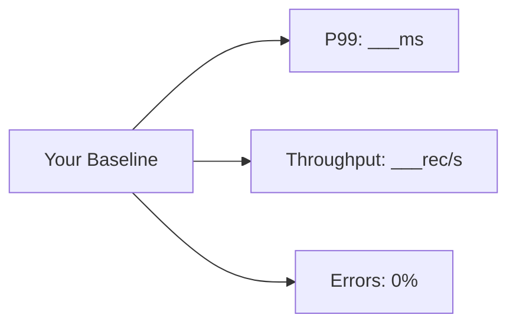
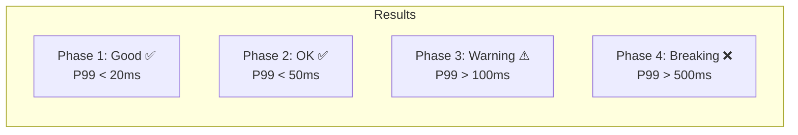
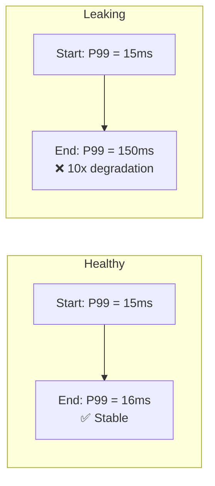
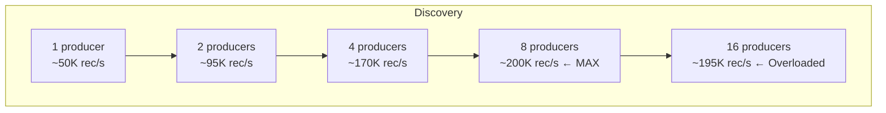
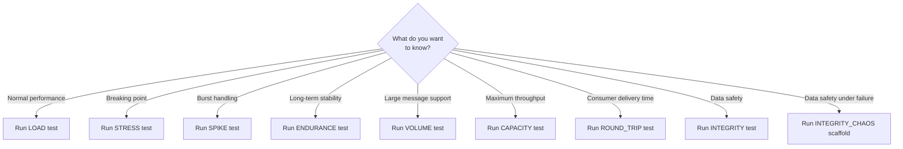

# Tutorial 2: Running Every Test Type

This tutorial walks through all 8 KATES test types with real commands and expected outputs. By the end, you'll understand which test to use for every scenario.

## Prerequisites

- KATES stack deployed and CLI configured (see [Tutorial 1](01-getting-started.md))
- System health verified: `kates health`

## 1. LOAD Test — Baseline Performance

The LOAD test establishes your cluster's steady-state performance at a controlled rate.

**When to use:** Before any other test. This provides the baseline you'll compare everything else against.

```bash
# Generate a scaffold to see all options
kates test scaffold --type LOAD

# Run a basic load test
kates test create --type LOAD \
  --records 100000 \
  --producers 2 \
  --acks all \
  --wait
```

**What to record:** Note the P99 latency and throughput. These are your baseline numbers.



## 2. STRESS Test — Finding the Breaking Point

The STRESS test ramps load until the cluster can no longer keep up.

**When to use:** Capacity planning. You need to know how much headroom exists.

```bash
# Generate scaffold
kates test scaffold --type STRESS -o stress.yaml

# Quick stress test with 4 producers ramping up
kates test create --type STRESS \
  --records 500000 \
  --producers 4 \
  --duration 180 \
  --wait
```

**What to watch:** Look for the phase where P99 latency jumps significantly. That's your saturation point.



## 3. SPIKE Test — Flash Sale Simulation

The SPIKE test hits the cluster with a sudden burst of traffic, then drops back to normal.

**When to use:** Preparing for events with sudden traffic increases (marketing campaigns, product launches).

```bash
# Generate scaffold
kates test scaffold --type SPIKE -o spike.yaml

# View the generated YAML to understand the phases
cat spike.yaml

# Apply the scaffold
kates test apply -f spike.yaml --wait
```

The scaffold creates a 3-phase test:
1. **Baseline** — normal rate for 30 seconds
2. **Spike** — 10x rate for 15 seconds
3. **Recovery** — back to normal rate for 60 seconds

**Key question:** How long does P99 take to return to baseline after the spike?

## 4. ENDURANCE Test — Soak Testing

The ENDURANCE test runs at moderate load for an extended period to detect slow resource leaks.

**When to use:** Before major releases. Run overnight to catch memory leaks, thread leaks, and log accumulation.

```bash
# Generate scaffold
kates test scaffold --type ENDURANCE -o endurance.yaml

# Start a 30-minute endurance test
kates test create --type ENDURANCE \
  --records 1000000 \
  --producers 2 \
  --duration 1800 \
  --wait
```

**What to watch:** Compare metrics from the first 5 minutes vs. the last 5 minutes. Any drift indicates a leak.



## 5. VOLUME Test — Large Data Handling

The VOLUME test focuses on large messages and data volumes to stress storage and replication.

**When to use:** When your production workload includes large messages (images, documents, large events).

```bash
# Generate scaffold
kates test scaffold --type VOLUME -o volume.yaml

# Run with large messages
kates test create --type VOLUME \
  --records 10000 \
  --record-size 102400 \
  --acks all \
  --wait
```

The 100KB record size × 10,000 records = ~1GB of data through the cluster.

**What to watch:** Does throughput (MB/s) scale linearly, or does it plateau?

## 6. CAPACITY Test — Maximum Throughput Discovery

The CAPACITY test removes all rate limiting and finds the absolute ceiling.

**When to use:** When you need hard numbers for capacity planning documents.

```bash
# Generate scaffold
kates test scaffold --type CAPACITY -o capacity.yaml

# Run with unlimited throughput
kates test create --type CAPACITY \
  --records 1000000 \
  --producers 8 \
  --throughput -1 \
  --wait
```

**Key metric:** The maximum sustained throughput before errors appear.



## 7. ROUND_TRIP Test — End-to-End Latency

The ROUND_TRIP test measures the complete journey from producer to consumer.

**When to use:** When you need to SLA on consumer-side delivery latency, not just producer acknowledgment.

```bash
# Generate scaffold
kates test scaffold --type ROUND_TRIP -o roundtrip.yaml

# Run with 1 producer and 1 consumer
kates test create --type ROUND_TRIP \
  --records 10000 \
  --producers 1 \
  --consumers 1 \
  --wait
```

**Key insight:** Round-trip latency is typically 2–5x higher than producer latency because it includes consumer fetch polling intervals.

## 8. INTEGRITY Test — Zero Data Loss Verification

The INTEGRITY test verifies that every message is persisted and deliverable.

**When to use:** Whenever you change Kafka configuration, upgrade brokers, or validate a new cluster.

```bash
# Generate scaffold
kates test scaffold --type INTEGRITY -o integrity.yaml

# Run data integrity verification
kates test create --type INTEGRITY \
  --records 100000 \
  --consumers 1 \
  --acks all \
  --wait
```

**Expected output:**

```
  Data Integrity
  ──────────────
  Sent       100,000
  Acked      100,000
  Received   100,000
  Lost            0
  Mode       idempotent
  Verdict    PASS ✅
```

### Integrity + Chaos (Advanced)

For the ultimate validation — verify integrity while killing a broker:

```bash
# Generate a chaos-aware integrity test
kates test scaffold --type INTEGRITY_CHAOS -o integrity-chaos.yaml

# Review the YAML — it includes chaos injection mid-test
cat integrity-chaos.yaml

# Run it
kates test apply -f integrity-chaos.yaml --wait
```

## Quick Reference: Choosing the Right Test



## Comparing All Results

After running multiple tests:

```bash
# List all your test runs
kates test list

# View trends
kates trend --type LOAD --metric p99LatencyMs --days 1
kates trend --type LOAD --metric throughputRecordsPerSec --days 1
```

## What's Next?

- [Tutorial 3: Chaos Engineering](03-chaos-engineering.md) — inject broker failures
- [Tutorial 5: Heatmaps and Exports](05-observability.md) — deep analysis
