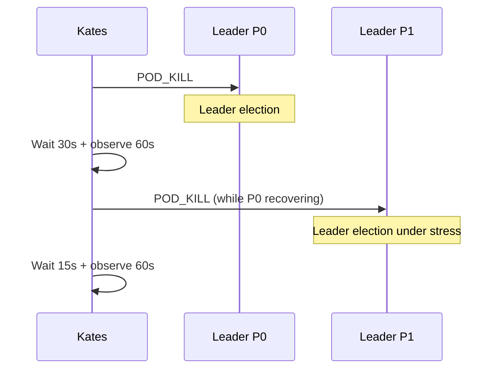
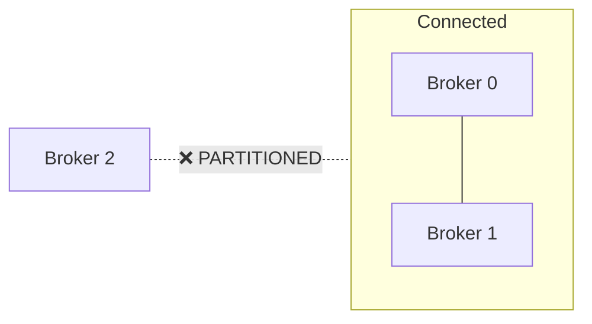
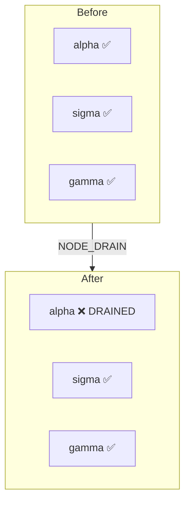

# Tutorial 3: Chaos Engineering with Kates

This tutorial teaches you to inject controlled failures into your Kafka cluster and measure the impact. You'll kill brokers, create network partitions, and run built-in playbooks.

## Prerequisites

- Kates stack deployed and CLI configured
- LitmusChaos deployed (`make litmus`)
- A baseline LOAD test completed (from Tutorial 1)

## Part 1: Direct Disruption with Makefile

The quickest way to run chaos experiments is through the Makefile:

```bash
# Kill a Kafka broker pod
make chaos-kafka-pod-delete

# Create a network partition
make chaos-kafka-network-partition

# Stress CPU on a broker
make chaos-kafka-cpu-stress

# Run ALL chaos experiments
make chaos-kafka-all

# Check experiment status
make chaos-kafka-status
```

Monitor the cluster during chaos:

```bash
# In another terminal — watch pod status
kubectl get pods -n kafka -w

# In another terminal — watch Grafana
# Open http://localhost:30080 → Kafka Cluster Health dashboard
```

## Part 2: Kates Disruption Plans

For structured, repeatable chaos testing, use Kates disruption plans.

### Step 1: View Available Disruption Types

```bash
kates disruption types
```

Output:

```
  Available Disruption Types
  ┌────────────────────┬──────────────────────────────────────────────┐
  │ Type               │ Description                                  │
  ├────────────────────┼──────────────────────────────────────────────┤
  │ POD_KILL           │ Immediately terminate a broker pod            │
  │ POD_DELETE         │ Gracefully delete a broker pod                │
  │ NETWORK_PARTITION  │ Isolate a broker from the cluster             │
  │ NETWORK_LATENCY    │ Inject latency into broker network            │
  │ CPU_STRESS         │ Saturate CPU on a broker node                 │
  │ DISK_FILL          │ Fill the broker's persistent volume           │
  │ ROLLING_RESTART    │ Restart all brokers sequentially              │
  │ LEADER_ELECTION    │ Force leader re-election for a partition      │
  │ SCALE_DOWN         │ Reduce the number of broker replicas          │
  │ NODE_DRAIN         │ Drain a Kubernetes node                       │
  └────────────────────┴──────────────────────────────────────────────┘
```

### Step 2: Create a Disruption Plan

Create a file called `broker-kill-plan.json`:

```json
{
  "name": "single-broker-kill",
  "maxAffectedBrokers": 1,
  "autoRollback": true,
  "steps": [
    {
      "name": "kill-broker-0",
      "faultSpec": {
        "experimentName": "broker-kill",
        "disruptionType": "POD_KILL",
        "targetNamespace": "kafka",
        "targetLabel": "strimzi.io/cluster=krafter",
        "chaosDurationSec": 30,
        "gracePeriodSec": 0
      },
      "steadyStateSec": 15,
      "observationWindowSec": 60,
      "requireRecovery": true
    }
  ]
}
```

### Step 3: Dry Run

Always validate before executing:

```bash
kates disruption run --config broker-kill-plan.json --dry-run
```

The dry run checks:
- Safety guardrails pass
- Plan is syntactically valid
- Target namespace and labels are correct

### Step 4: Execute

```bash
kates disruption run --config broker-kill-plan.json
```

Expected output:

```
  ◉ Executing disruption plan: single-broker-kill

  Step 1/1: kill-broker-0
  ────────────────────────
  Type         POD_KILL
  Target       kafka/krafter-pool-alpha-0
  Duration     30s
  Recovery     Required

  Collecting steady state... (15s)
  Injecting fault...
  Observing... (60s)
  Checking recovery...

  ✅ Step passed — cluster recovered

  SLA Verdict
  ──────────
  Recovery Time     8.3s ✅ (threshold: 30s)
  Max Latency       245ms ✅ (threshold: 500ms)
  Data Loss         0 ✅
```

### Step 5: Review in Detail

```bash
# Full report
kates disruption status <id>

# Pod event timeline
kates disruption timeline <id>

# Kafka intelligence data
kates disruption kafka-metrics <id>
```

## Part 3: Built-In Playbooks

Kates ships with 6 battle-tested playbooks. These represent common production failure scenarios:

### leader-cascade

Tests cascading leader election recovery:



### split-brain

Isolates a broker via network partition:



### az-failure

Simulates a full availability zone failure — drains a Kubernetes node:



### rolling-restart

Simulates a Strimzi rolling update — brokers restart one at a time.

### consumer-isolation

Network-isolates the consumer to test rebalancing behavior.

### storage-pressure

Fills broker disk to trigger log retention.

## Part 4: Resilience Testing (Performance + Chaos)

The most powerful mode — run a performance test while simultaneously injecting chaos:

### Step 1: Create a Resilience Config

```json
{
  "testRequest": {
    "testType": "LOAD",
    "spec": {
      "records": 200000,
      "producers": 4,
      "recordSizeBytes": 1024,
      "acks": "all"
    }
  },
  "chaosSpec": {
    "experimentName": "kafka-pod-kill",
    "targetNamespace": "kafka"
  },
  "steadyStateSec": 30
}
```

Save as `resilience-test.json`.

### Step 2: Execute

```bash
kates resilience run --config resilience-test.json
```

### Step 3: Interpret the Impact Analysis

```
  Resilience Test Results
  ───────────────────────
  Status     COMPLETED ✅

  Chaos Outcome
  ─────────────
  Experiment   kafka-pod-kill
  Verdict      PASS ✅
  Duration     30s

  Impact Analysis (% change)
  ┌─────────────────────────────┬──────────┬───┐
  │ Metric                      │ Change   │   │
  ├─────────────────────────────┼──────────┼───┤
  │ throughputRecordsPerSec     │ -15.6%   │ ▼ │
  │ p99LatencyMs                │ +596.7%  │ ▲ │
  │ errorRate                   │ +0.3%    │   │
  └─────────────────────────────┴──────────┴───┘

  Pre-Chaos Baseline
  ──────────────────
  Throughput    45,000 rec/s
  P99 Latency   12.3ms
  Error Rate    0.0000%

  Post-Chaos Impact
  ─────────────────
  Throughput    38,000 rec/s
  P99 Latency   85.7ms
  Error Rate    0.3000%
```

**Interpretation:**
- Throughput dropped 15.6% — the cluster absorbed the impact
- P99 latency spiked nearly 6x — during leader election
- Error rate was 0.3% — a few messages timed out and were retried
- Overall verdict: PASS — the cluster recovered and no data was lost

## Part 5: Multi-Step Disruption Plans

For comprehensive testing, create multi-step plans:

```json
{
  "name": "full-resilience-suite",
  "maxAffectedBrokers": 1,
  "autoRollback": true,
  "steps": [
    {
      "name": "graceful-shutdown",
      "faultSpec": {
        "experimentName": "graceful",
        "disruptionType": "POD_DELETE",
        "targetNamespace": "kafka",
        "targetLabel": "strimzi.io/cluster=krafter",
        "chaosDurationSec": 10
      },
      "steadyStateSec": 15,
      "observationWindowSec": 60,
      "requireRecovery": true
    },
    {
      "name": "hard-kill",
      "faultSpec": {
        "experimentName": "hard-kill",
        "disruptionType": "POD_KILL",
        "targetNamespace": "kafka",
        "targetLabel": "strimzi.io/cluster=krafter",
        "chaosDurationSec": 10,
        "gracePeriodSec": 0
      },
      "steadyStateSec": 15,
      "observationWindowSec": 60,
      "requireRecovery": true
    },
    {
      "name": "cpu-saturation",
      "faultSpec": {
        "experimentName": "cpu-stress",
        "disruptionType": "CPU_STRESS",
        "targetNamespace": "kafka",
        "targetLabel": "strimzi.io/cluster=krafter",
        "chaosDurationSec": 60
      },
      "steadyStateSec": 15,
      "observationWindowSec": 90,
      "requireRecovery": true
    }
  ]
}
```

```bash
# Dry run first
kates disruption run --config full-suite.json --dry-run

# Execute
kates disruption run --config full-suite.json

# Watch progress in real-time
kates disruption watch <id>
```

## What's Next?

- [Tutorial 4: Data Integrity Under Fire](04-integrity-under-fire.md) — the ultimate validation
- [Tutorial 6: CI/CD Integration](06-cicd-integration.md) — automate chaos in your pipeline
