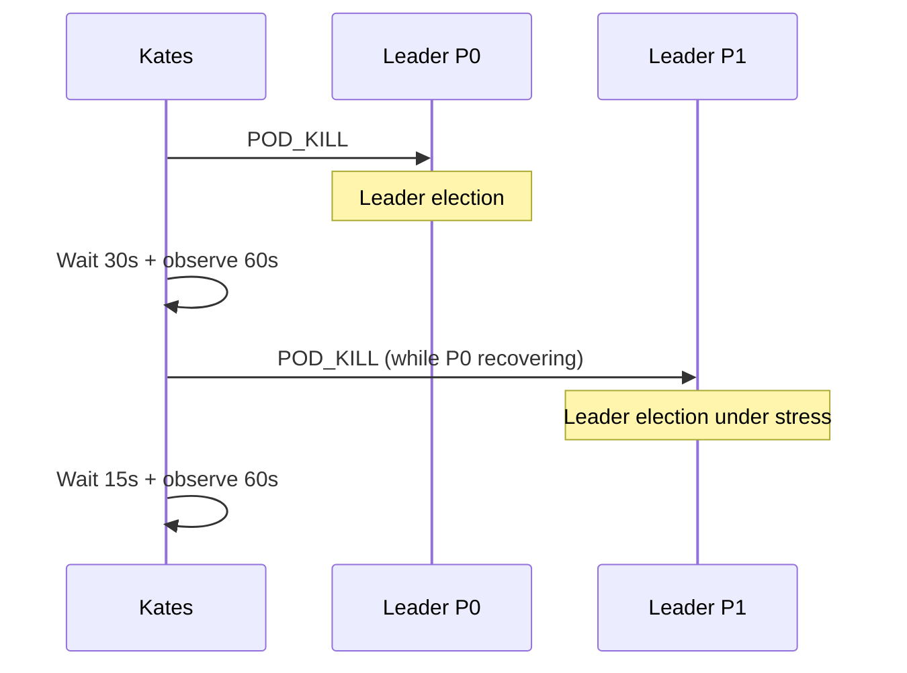
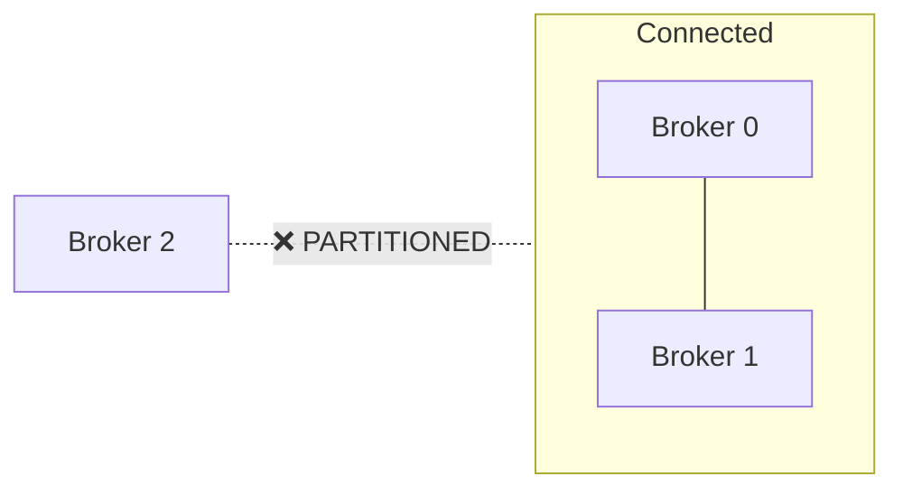
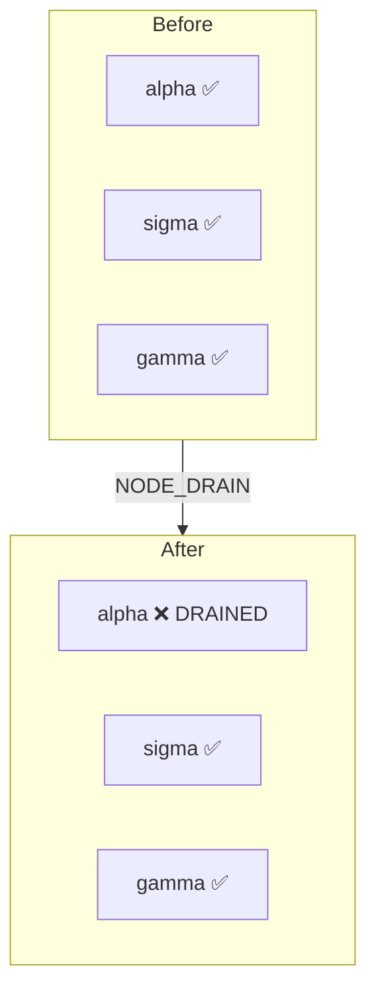

# Tutorial 3: Chaos Engineering with Kates

This tutorial teaches you to inject controlled failures into your Kafka cluster and measure the impact. You'll kill brokers, create network partitions, and run built-in playbooks.

## Prerequisites

- Kates stack deployed and CLI configured
- LitmusChaos deployed (`make litmus`)
- A baseline LOAD test completed (from Tutorial 1)

## Part 1: The Chaos Execution Plane

The `kates-chaos` chart deploys the LitmusChaos execution plane — the operator
and the ChaosExperiment definitions — but no web portal and no per-experiment
Make targets. There are two Make targets, one to install it and one to look at
it:

```bash
# Deploy the chaos execution plane (Kind overlay)
make litmus

# Show the release, its pods, and the chaos CRs in the namespace
make chaos-status
```

The experiments the chart installs are `pod-delete`, `pod-cpu-hog`,
`pod-memory-hog`, `pod-network-partition`, `pod-io-stress`, `pod-dns-error`
(all namespaced) and `node-drain` (cluster-scoped).

Running one means creating a `ChaosEngine`. Declaratively, that is an entry
under the chart's `engines:` map:

```yaml
# values-chaos.yaml
engines:
  kafka-pod-delete:
    enabled: true
    appLabel: "strimzi.io/kind=Kafka"
    experiment: pod-delete
    duration: 30
    interval: 10
    force: true
    podsAffectedPerc: "50"
```

Everything from Part 2 on drives the same machinery through the CLI instead,
which is what you want for anything repeatable.

Monitor the cluster during chaos:

```bash
# In another terminal — watch pod status
kubectl get pods -n kafka -w

# In another terminal — watch Grafana
# Open http://localhost:30080 → "Kafka Chaos Dashboard"
```

> **Not the "Kafka Cluster Health" board.** It is one of the nine legacy Kafka
> boards behind `legacyKafkaDashboards.enabled` in `charts/monitoring` — still
> installed in 1.2.0, but it reads series names that kafka-cluster 1.0's
> exporter rules (Strimzi's own) no longer produce, so its panels come up empty.
> The flag defaults to false in 1.3 and the boards go in 2.0. The maintained
> Kafka views now ship with `charts/strimzi-operator`, `charts/connect-cluster`
> and `charts/mirror-maker2`.

## Part 2: Kates Disruption Plans

For structured, repeatable chaos testing, use Kates disruption plans.

### Step 1: View Available Disruption Types

```bash
kates disruption types
```

Output:

```
  Available Disruption Types
  ┌────────────────────┬──────────────────────────────────────────────────────────────┐
  │ Type               │ Description                                                  │
  ├────────────────────┼──────────────────────────────────────────────────────────────┤
  │ POD_KILL           │ Force-delete a broker pod (SIGKILL, gracePeriod=0)            │
  │ POD_DELETE         │ Gracefully delete a broker pod (SIGTERM with grace period)    │
  │ NETWORK_PARTITION  │ Isolate a broker from peers via NetworkPolicy                 │
  │ NETWORK_LATENCY    │ Inject network latency on broker interfaces                   │
  │ CPU_STRESS         │ Exhaust CPU on broker container                               │
  │ MEMORY_STRESS      │ Consume memory on broker container to simulate OOM pressure   │
  │ IO_STRESS          │ Inject disk I/O pressure on broker storage                    │
  │ DNS_ERROR          │ Inject DNS resolution failures on broker pods                 │
  │ DISK_FILL          │ Fill broker log directory to simulate storage pressure        │
  │ ROLLING_RESTART    │ Trigger StatefulSet rolling restart                           │
  │ LEADER_ELECTION    │ Kill the controller broker to force leader election           │
  │ SCALE_DOWN         │ Reduce StatefulSet replica count                              │
  │ NODE_DRAIN         │ Drain the Kubernetes node hosting a broker                    │
  └────────────────────┴──────────────────────────────────────────────────────────────┘
```

### Step 2: Create a Disruption Plan

Create a file called `broker-kill-plan.json`:

```json
{
  "name": "single-broker-kill",
  "maxAffectedBrokers": 1,
  "autoRollback": true,
  "steps": [
    {
      "name": "kill-broker-0",
      "faultSpec": {
        "experimentName": "broker-kill",
        "disruptionType": "POD_KILL",
        "targetNamespace": "kafka",
        "targetLabel": "strimzi.io/cluster=krafter",
        "chaosDurationSec": 30,
        "gracePeriodSec": 0
      },
      "steadyStateSec": 15,
      "observationWindowSec": 60,
      "requireRecovery": true
    }
  ]
}
```

### Step 3: Dry Run

Always validate before executing:

```bash
kates disruption run --config broker-kill-plan.json --dry-run
```

The dry run checks:
- Safety guardrails pass
- Plan is syntactically valid
- Target namespace and labels are correct

### Step 4: Execute

```bash
kates disruption run --config broker-kill-plan.json
```

Expected output:

```
  ◉ Executing disruption plan: single-broker-kill

  Step 1/1: kill-broker-0
  ────────────────────────
  Type         POD_KILL
  Target       kafka/krafter-pool-alpha-0
  Duration     30s
  Recovery     Required

  Collecting steady state... (15s)
  Injecting fault...
  Observing... (60s)
  Checking recovery...

  ✅ Step passed — cluster recovered

  SLA Verdict
  ──────────
  Recovery Time     8.3s ✅ (threshold: 30s)
  Max Latency       245ms ✅ (threshold: 500ms)
  Data Loss         0 ✅
```

### Step 5: Review in Detail

```bash
# Full report
kates disruption status <id>

# Pod event timeline
kates disruption timeline <id>

# Kafka intelligence data
kates disruption kafka-metrics <id>
```

## Part 3: Built-In Playbooks

Kates ships with 6 battle-tested playbooks. These represent common production failure scenarios:

### leader-cascade

Tests cascading leader election recovery:


```mermaid
sequenceDiagram
    participant Kates
    participant P0 as Leader P0
    participant P1 as Leader P1
    
    Kates->>P0: POD_KILL
    Note over P0: Leader election
    Kates->>Kates: Wait 30s + observe 60s
    Kates->>P1: POD_KILL (while P0 recovering)
    Note over P1: Leader election under stress
    Kates->>Kates: Wait 15s + observe 60s
```

### split-brain

Isolates a broker via network partition:


```mermaid
graph LR
    subgraph Connected
        B0[Broker 0] --- B1[Broker 1]
    end
    B2[Broker 2] -.-|"❌ PARTITIONED"| Connected
```

### az-failure

Simulates a full availability zone failure — drains a Kubernetes node:


```mermaid
graph TB
    subgraph Before
        N1[alpha ✅] & N2[sigma ✅] & N3[gamma ✅]
    end
    subgraph After
        N1b[alpha ❌ DRAINED] & N2b[sigma ✅] & N3b[gamma ✅]
    end
    Before -->|"NODE_DRAIN"| After
```

### rolling-restart

Simulates a Strimzi rolling update — brokers restart one at a time.

### consumer-isolation

Network-isolates the consumer to test rebalancing behavior.

### storage-pressure

Fills broker disk to trigger log retention.

## Part 4: Resilience Testing (Performance + Chaos)

The most powerful mode — run a performance test while simultaneously injecting chaos:

### Step 1: Create a Resilience Config

```json
{
  "testRequest": {
    "testType": "LOAD",
    "spec": {
      "records": 200000,
      "producers": 4,
      "recordSizeBytes": 1024,
      "acks": "all"
    }
  },
  "chaosSpec": {
    "experimentName": "kafka-pod-kill",
    "targetNamespace": "kafka"
  },
  "steadyStateSec": 30
}
```

Save as `resilience-test.json`.

### Step 2: Execute

```bash
kates resilience run -f resilience-test.json
```

### Step 3: Interpret the Impact Analysis

```
  Resilience Test Results
  ───────────────────────
  Status     COMPLETED ✅

  Chaos Outcome
  ─────────────
  Experiment   kafka-pod-kill
  Verdict      PASS ✅
  Duration     30s

  Impact Analysis (% change)
  ┌─────────────────────────────┬──────────┬───┐
  │ Metric                      │ Change   │   │
  ├─────────────────────────────┼──────────┼───┤
  │ throughputRecordsPerSec     │ -15.6%   │ ▼ │
  │ p99LatencyMs                │ +596.7%  │ ▲ │
  │ errorRate                   │ +0.3%    │   │
  └─────────────────────────────┴──────────┴───┘

  Pre-Chaos Baseline
  ──────────────────
  Throughput    45,000 rec/s
  P99 Latency   12.3ms
  Error Rate    0.0000%

  Post-Chaos Impact
  ─────────────────
  Throughput    38,000 rec/s
  P99 Latency   85.7ms
  Error Rate    0.3000%
```

**Interpretation:**
- Throughput dropped 15.6% — the cluster absorbed the impact
- P99 latency spiked nearly 6x — during leader election
- Error rate was 0.3% — a few messages timed out and were retried
- Overall verdict: PASS — the cluster recovered and no data was lost

## Part 5: Multi-Step Disruption Plans

For comprehensive testing, create multi-step plans:

```json
{
  "name": "full-resilience-suite",
  "maxAffectedBrokers": 1,
  "autoRollback": true,
  "steps": [
    {
      "name": "graceful-shutdown",
      "faultSpec": {
        "experimentName": "graceful",
        "disruptionType": "POD_DELETE",
        "targetNamespace": "kafka",
        "targetLabel": "strimzi.io/cluster=krafter",
        "chaosDurationSec": 10
      },
      "steadyStateSec": 15,
      "observationWindowSec": 60,
      "requireRecovery": true
    },
    {
      "name": "hard-kill",
      "faultSpec": {
        "experimentName": "hard-kill",
        "disruptionType": "POD_KILL",
        "targetNamespace": "kafka",
        "targetLabel": "strimzi.io/cluster=krafter",
        "chaosDurationSec": 10,
        "gracePeriodSec": 0
      },
      "steadyStateSec": 15,
      "observationWindowSec": 60,
      "requireRecovery": true
    },
    {
      "name": "cpu-saturation",
      "faultSpec": {
        "experimentName": "cpu-stress",
        "disruptionType": "CPU_STRESS",
        "targetNamespace": "kafka",
        "targetLabel": "strimzi.io/cluster=krafter",
        "chaosDurationSec": 60
      },
      "steadyStateSec": 15,
      "observationWindowSec": 90,
      "requireRecovery": true
    }
  ]
}
```

```bash
# Dry run first
kates disruption run --config full-suite.json --dry-run

# Execute
kates disruption run --config full-suite.json

# Watch progress in real-time
kates disruption watch <id>
```

## What's Next?

- [Tutorial 4: Data Integrity Under Fire](04-integrity-under-fire.md) — the ultimate validation
- [Tutorial 6: CI/CD Integration](06-cicd-integration.md) — automate chaos in your pipeline
