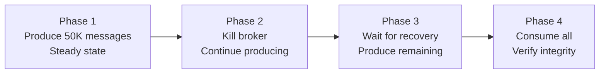
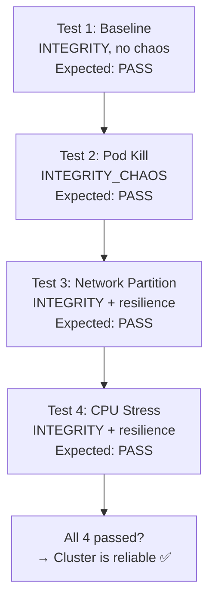
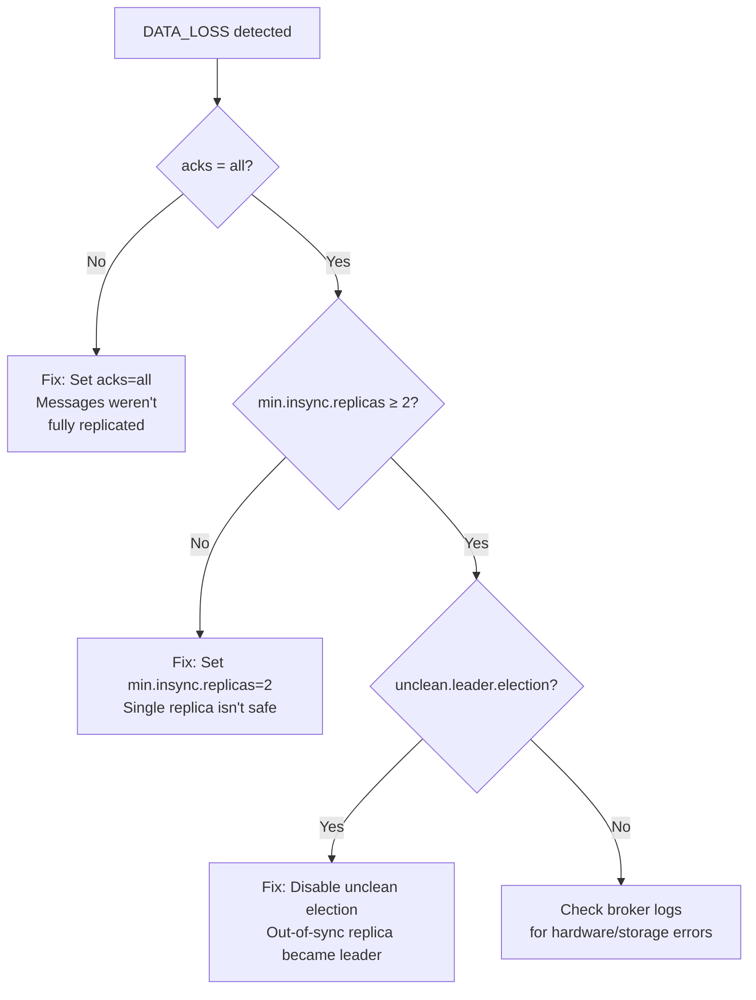

# Tutorial 4: Data Integrity Under Fire

This tutorial verifies that your Kafka cluster delivers on its "no data loss" guarantee, even when brokers are crashing. This is the highest-confidence test you can run.

## Prerequisites

- KATES stack deployed and CLI configured
- LitmusChaos deployed for chaos-aware tests

## Part 1: Baseline Integrity Test

First, verify integrity under normal conditions:

```bash
kates test create --type INTEGRITY \
  --records 100000 \
  --consumers 1 \
  --acks all \
  --wait
```

Expected result:

```
  Data Integrity
  ──────────────
  Sent       100,000
  Acked      100,000
  Received   100,000
  Lost            0
  Duplicates      0
  Mode       idempotent
  Verdict    PASS ✅
```

If this fails, stop here — you have a configuration problem that must be fixed before chaos testing.

## Part 2: Integrity Under Broker Kill

Now the real test — produce 100K messages while killing a broker in the middle:

### Step 1: Generate the Chaos Integrity Scaffold

```bash
kates test scaffold --type INTEGRITY_CHAOS -o integrity-chaos.yaml
```

### Step 2: Review the Scaffold

```bash
cat integrity-chaos.yaml
```

The scaffold defines a multi-phase test:



### Step 3: Run It

```bash
kates test apply -f integrity-chaos.yaml --wait
```

### Step 4: Analyze the Results

```bash
kates test get <id>
```

Expected output:

```
  Data Integrity
  ──────────────
  Sent       100,000
  Acked      100,000
  Received   100,000
  Lost            0
  Duplicates      0
  Mode       idempotent
  Verdict    PASS ✅

  Timeline Events
  ┌─────────────────┬────────────────┬──────────────────────────────┐
  │ Timestamp       │ Type           │ Detail                       │
  ├─────────────────┼────────────────┼──────────────────────────────┤
  │ 1708012345000   │ PRODUCE_START  │ Started producing 100K       │
  │ 1708012375000   │ FAULT_INJECTED │ Killed broker-0              │
  │ 1708012376000   │ ISR_SHRINK     │ P0 ISR: [0,1,2] → [1,2]     │
  │ 1708012378000   │ LEADER_CHANGE  │ P0 leader: 0 → 1            │
  │ 1708012380000   │ PRODUCE_ERROR  │ 3 send timeouts (retrying)   │
  │ 1708012395000   │ BROKER_RECOVER │ Broker 0 rejoined            │
  │ 1708012410000   │ ISR_EXPAND     │ P0 ISR: [1,2] → [0,1,2]     │
  │ 1708012420000   │ PRODUCE_END    │ All 100K produced            │
  │ 1708012425000   │ CONSUME_END    │ All 100K consumed            │
  │ 1708012425001   │ VERDICT        │ PASS — zero data loss        │
  └─────────────────┴────────────────┴──────────────────────────────┘
```

## Part 3: Testing Different Failure Modes

### Network Partition

Does the cluster lose messages when a broker is network-isolated?

Create `integrity-partition.json`:

```json
{
  "testRequest": {
    "testType": "INTEGRITY",
    "spec": {
      "records": 100000,
      "acks": "all",
      "consumers": 1
    }
  },
  "chaosSpec": {
    "experimentName": "network-partition",
    "disruptionType": "NETWORK_PARTITION",
    "targetNamespace": "kafka"
  },
  "steadyStateSec": 30
}
```

```bash
kates resilience run --config integrity-partition.json
```

### CPU Stress

Does CPU saturation cause replication failures?

```json
{
  "testRequest": {
    "testType": "INTEGRITY",
    "spec": { "records": 50000, "acks": "all", "consumers": 1 }
  },
  "chaosSpec": {
    "experimentName": "cpu-stress",
    "disruptionType": "CPU_STRESS",
    "targetNamespace": "kafka"
  },
  "steadyStateSec": 20
}
```

### Multiple Failures

Create a comprehensive integrity validation plan:



## Part 4: Understanding Failures

If an integrity test fails, here's how to diagnose:

### Scenario: DATA_LOSS Detected

```
  Data Integrity
  ──────────────
  Sent       100,000
  Acked       99,998
  Received    99,996
  Lost            2
  Lost Ranges [45231-45231], [78442-78442]
  Verdict    DATA_LOSS ❌
```

**Diagnosis checklist:**



## Part 5: Continuous Integrity Monitoring

Schedule nightly integrity tests to catch regressions:

```bash
# Run integrity test every night at 2 AM
kates schedule create --type INTEGRITY --records 100000 --cron "0 2 * * *"

# Monitor trends
kates trend --type INTEGRITY --metric lostRecords --days 30
```

A regression in the integrity trend is the most critical alert you can have — it means your cluster configuration may have changed in a way that risks data loss.

## What's Next?

- [Tutorial 5: Heatmaps, Trends, and Exports](05-observability.md) — deep analysis tools
- [Tutorial 6: CI/CD Integration](06-cicd-integration.md) — automate everything
