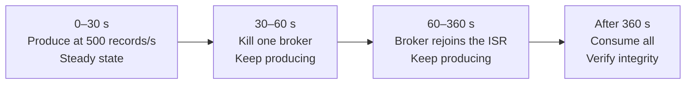
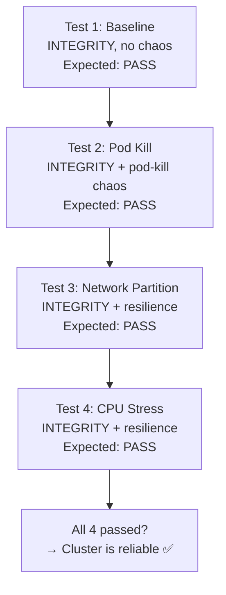
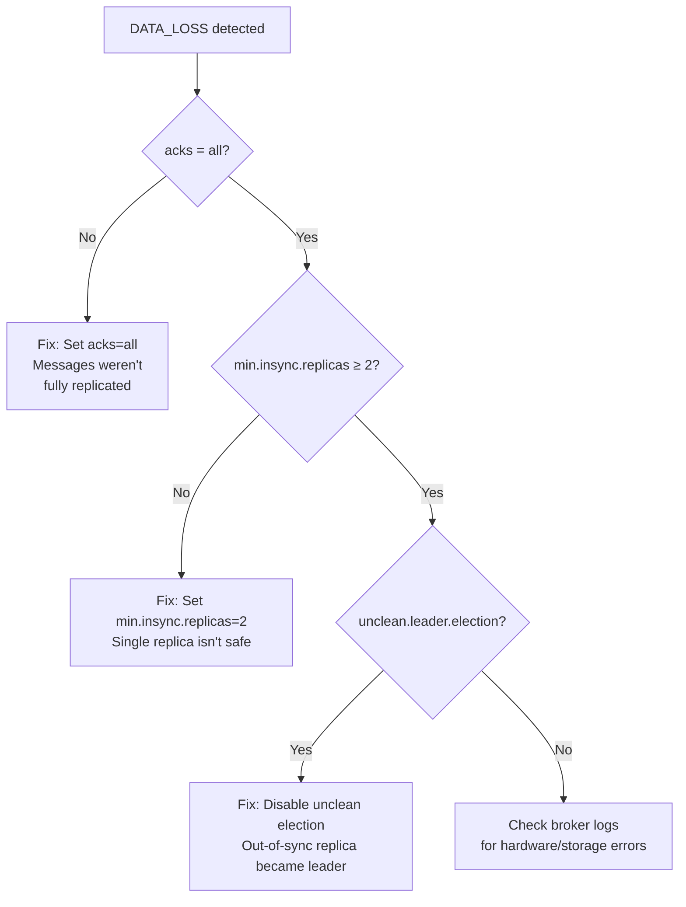

# Tutorial 4: Data Integrity Under Fire

This tutorial verifies that your Kafka cluster delivers on its "no data loss" guarantee, even when brokers are crashing. This is the highest-confidence test you can run.

## Prerequisites

- Kates stack deployed and CLI configured
- LitmusChaos deployed for chaos-aware tests

## Part 1: Baseline Integrity Test

First, verify integrity under normal conditions:

```bash
kates test create --type INTEGRITY \
  --records 100000 \
  --acks all \
  --wait
```

`--wait` follows the run until it finishes. The verdict is on the run itself, under the ID that `create` printed:

```bash
kates test get <id>
```

The report ends with a Data Integrity section and an Integrity Timeline:

```text
 ▸ Data Integrity
  Sent                     100.0K
  Acked                    100.0K
  Consumed                 100.0K
  Lost                     0
  Duplicates               0
  Data Loss                0.0000%
  RPO                      not measured
  CRC Failures             0
  Out of Order             0
  Verdict                  ● PASS

 ▸ Integrity Timeline
  Timestamp      Type     Detail
  ─────────────  ───────  ────────────────────────────────
  1790240112345  SUMMARY  verdict=PASS lost=0 duplicates=0
```

`RPO` reads `not measured` because no fault was marked on this run. It needs no idempotence switch: with `acks=all` the Kafka producer is idempotent by default. A scenario file or the API can still set `enableIdempotence`, `enableTransactions` and `enableCrc`, and the run uses them; `kates test create` has no flag for them.

If this fails, stop here — you have a configuration problem that must be fixed before chaos testing.

## Part 2: Integrity Under Broker Kill

Now the real test: produce sequenced records while a broker is killed, and keep producing until the cluster has recovered.

### Step 1: Write the Chaos Integrity Config

No scenario template carries chaos — a scaffold describes a test, and pairing
one with a fault is what `kates resilience run` is for. Its config puts the
`testRequest` and the `chaosSpec` side by side. The `testRequest` goes to the
API as written, so it takes the API's field names — `type`, `numRecords`,
`throughput`, `durationMs` — not a scenario file's `records`:

```bash
cat > integrity-chaos.yaml <<'EOF'
testRequest:
  type: INTEGRITY
  spec:
    numRecords: 180000     # 180,000 records at 500 records/s: 360 s of producing
    throughput: 500        # records per second
    durationMs: 600000     # hard stop for the produce phase: 600 s
    acks: all
    replicationFactor: 3
    minInsyncReplicas: 2

chaosSpec:
  experimentName: broker-pod-kill
  disruptionType: POD_KILL
  targetNamespace: kafka
  targetLabel: "strimzi.io/component-type=kafka,strimzi.io/broker-role=true"
  chaosDurationSec: 30

steadyStateSec: 30
EOF
```

### Step 2: Check It

```bash
kates resilience run -f integrity-chaos.yaml --dry-run
```

`--dry-run` parses the file and prints the request it would send, without sending it. A config that names the test type anything but `type` stops here with `testRequest.type is required`.

The run has a shape the results are read against, counted from its start:


```mermaid
graph LR
    P1["0–30 s<br/>Produce at 500 records/s<br/>Steady state"] --> P2["30–60 s<br/>Kill one broker<br/>Keep producing"] --> P3["60–360 s<br/>Broker rejoins the ISR<br/>Keep producing"] --> P4["After 360 s<br/>Consume all<br/>Verify integrity"]
```

The rate limit is what makes the result mean something: an unthrottled run can finish before the fault is triggered, and its verdict then says nothing about the failure. INTEGRITY runs one producer, so `throughput` is the whole rate. The selector adds `strimzi.io/broker-role=true` because the default, `strimzi.io/component-type=kafka`, also matches the KRaft controllers, and a random pick could then kill a controller instead of a broker. [Data Integrity Verification](../book/08-data-integrity.md) walks through the sizing.

### Step 3: Run It

```bash
kates resilience run -f integrity-chaos.yaml
```

The command prints the chaos outcome and a before/after impact analysis, not the integrity result, and it can return while the INTEGRITY run is still producing. Its `Status` is `COMPLETED` only when the chaos outcome's verdict is `Pass`. Anything else — `CHAOS_FAILED`, or a `Skipped` verdict when no chaos provider is available — means the fault may not have landed, and the integrity verdict then proves nothing about the failure.

### Step 4: Analyze the Results

Read the verdict from the INTEGRITY run itself:

```bash
kates test list --type INTEGRITY   # newest first: the top row is this run
kates test watch <id>              # wait for produce, consume and verification
kates test get <id>
```

Expected output, at the end of the report:

```text
 ▸ Data Integrity
  Sent                     180.0K
  Acked                    180.0K
  Consumed                 180.0K
  Lost                     0
  Duplicates               0
  Data Loss                0.0000%
  RPO                      0 ms
  CRC Failures             0
  Out of Order             0
  Verdict                  ● PASS

 ▸ Integrity Timeline
  Timestamp      Type     Detail
  ─────────────  ───────  ────────────────────────────────
  1790244361011  SUMMARY  verdict=PASS lost=0 duplicates=0
```

- `Lost 0` — every acknowledged record was consumed back.
- `Duplicates 0` — with `acks=all` the producer is idempotent, so its retries through the leader election write nothing twice.
- `RPO 0 ms` — a chaos start was marked on the run, and nothing written before it was lost. The mark is set just before the fault is triggered, so only `Status COMPLETED` from Step 3 shows that the fault landed. `RPO not measured` means no chaos start reached the run: either the run finished before the fault, and needs resizing, or the chaos provider is `noop` and injected nothing.
- The timeline records only violations — CRC failures, records out of order, lost ranges — and a final summary, so a clean run shows just the `SUMMARY` row.

## Part 3: Testing Different Failure Modes

Each variant keeps the `testRequest` from `integrity-chaos.yaml`, so the run still outlasts the fault, and replaces its `chaosSpec`.

### Network Partition

Does the cluster lose messages when a broker is network-isolated? Copy `integrity-chaos.yaml` to `integrity-partition.yaml` and replace its `chaosSpec`:

```yaml
chaosSpec:
  experimentName: network-partition
  disruptionType: NETWORK_PARTITION
  targetNamespace: kafka
  targetLabel: "strimzi.io/component-type=kafka,strimzi.io/broker-role=true"
  chaosDurationSec: 30
```

```bash
kates resilience run -f integrity-partition.yaml
```

### CPU Stress

Does CPU saturation cause replication failures? Copy `integrity-chaos.yaml` to `integrity-cpu.yaml` and replace its `chaosSpec`:

```yaml
chaosSpec:
  experimentName: cpu-stress
  disruptionType: CPU_STRESS
  targetNamespace: kafka
  targetLabel: "strimzi.io/component-type=kafka,strimzi.io/broker-role=true"
  chaosDurationSec: 30
```

```bash
kates resilience run -f integrity-cpu.yaml
```

Read each verdict with `kates test get <id>`, as in Part 2.

### Multiple Failures

Create a comprehensive integrity validation plan:


```mermaid
graph TB
    T1["Test 1: Baseline<br/>INTEGRITY, no chaos<br/>Expected: PASS"] --> T2["Test 2: Pod Kill<br/>INTEGRITY + pod-kill chaos<br/>Expected: PASS"]
    T2 --> T3["Test 3: Network Partition<br/>INTEGRITY + resilience<br/>Expected: PASS"]
    T3 --> T4["Test 4: CPU Stress<br/>INTEGRITY + resilience<br/>Expected: PASS"]
    T4 --> VERDICT["All 4 passed?<br/>→ Cluster is reliable ✅"]
```

## Part 4: Understanding Failures

If an integrity test fails, here's how to diagnose:

### Scenario: DATA_LOSS Detected

```text
 ▸ Data Integrity
  Sent                     180.0K
  Acked                    180.0K
  Consumed                 180.0K
  Lost                     2
  Duplicates               0
  Data Loss                0.0011%
  RPO                      0 ms
  CRC Failures             0
  Out of Order             0
  Verdict                  ○ DATA_LOSS

 ▸ Lost Ranges
  From Seq  To Seq  Count
  ────────  ──────  ─────
  21407     21408   2

 ▸ Integrity Timeline
  Timestamp      Type        Detail
  ─────────────  ──────────  ─────────────────────────────────────
  1790244361010  LOST_RANGE  from=21407 to=21408 count=2
  1790244361011  SUMMARY     verdict=DATA_LOSS lost=2 duplicates=0
```

The counts are abbreviated in the display: `Consumed` reads `180.0K` for 179,998, and `Lost`, `Data Loss` and the `Lost Ranges` table carry the exact numbers. `RPO` stays at `0 ms` because it counts only acknowledged records sent before the chaos start, and these two were sent after it, while the broker was going down. They still count in `Lost` and `Data Loss`.

**Diagnosis checklist:**


```mermaid
graph TD
    LOSS["DATA_LOSS detected"] --> Q1{acks = all?}
    Q1 -->|No| FIX1["Fix: Set acks=all<br/>Messages weren't<br/>fully replicated"]
    Q1 -->|Yes| Q2{min.insync.replicas ≥ 2?}
    Q2 -->|No| FIX2["Fix: Set min.insync.replicas=2<br/>Single replica isn't safe"]
    Q2 -->|Yes| Q3{unclean.leader.election?}
    Q3 -->|Yes| FIX3["Fix: Disable unclean election<br/>Out-of-sync replica became leader"]
    Q3 -->|No| Q4["Check broker logs<br/>for hardware/storage errors"]
```

## Part 5: Continuous Integrity Monitoring

Schedule nightly integrity tests to catch regressions:

A schedule is a cron expression plus a test request read from a JSON file —
`--name`, `--cron` and `--request` are all required. The request goes to the
API as written, so it takes the API's field names, `type` and `numRecords`:

```bash
cat > nightly-integrity.json <<'EOF'
{
  "type": "INTEGRITY",
  "spec": { "numRecords": 100000, "acks": "all" }
}
EOF

# Run the integrity test every night at 2 AM
kates schedule create \
  --name "Nightly Integrity" \
  --cron "0 2 * * *" \
  --request nightly-integrity.json

# Monitor trends
kates trend --type INTEGRITY --metric errorRate --days 30
```

`--metric` takes one of the report-summary metrics the trend service knows:
`avgThroughputRecPerSec`, `peakThroughputRecPerSec`, `avgThroughputMBPerSec`,
`avgLatencyMs`, `p50LatencyMs`, `p95LatencyMs`, `p99LatencyMs`, `p999LatencyMs`,
`maxLatencyMs` and `errorRate`. Per-run loss counts are not one of them — read
those from the integrity verdict on the run itself.

A regression in the integrity trend is the most critical alert you can have — it means your cluster configuration may have changed in a way that risks data loss.

## What's Next?

- [Tutorial 5: Heatmaps, Trends, and Exports](05-observability.md) — deep analysis tools
- [Tutorial 6: CI/CD Integration](06-cicd-integration.md) — automate everything
