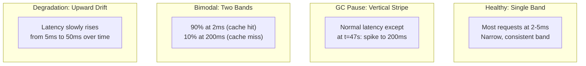
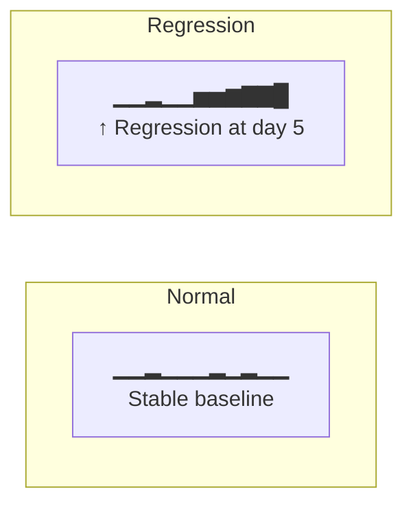

# Tutorial 5: Heatmaps, Trends, and Exports

This tutorial teaches you to extract deep insights from Kates test data using heatmaps, trend analysis, report comparison, and export formats.

## Prerequisites

- At least 3 completed test runs (from previous tutorials)
- Kates CLI configured

## Part 1: Latency Heatmaps

Heatmaps show the **full latency distribution over time** — something percentiles can't do.

### Export a Heatmap

```bash
# JSON format (Grafana-compatible)
kates report export <id> --format heatmap -o heatmap.json

# CSV format (spreadsheet-friendly)
kates report export <id> --format heatmap-csv -o heatmap.csv
```

### Understanding the Data

Each row in the heatmap represents one second of the test. Each column is a latency bucket:

```
timestamp, 0-0.1ms, 0.1-0.5ms, 0.5-1ms, 1-5ms, 5-10ms, 10-50ms, ...
1708012345, 0, 0, 12, 832, 456, 89, ...
1708012346, 0, 0, 15, 845, 432, 78, ...
1708012347, 0, 0, 8, 800, 510, 450, ...  ← latency spike!
```

### Patterns to Look For



### Load into a Spreadsheet

1. Export as CSV: `kates report export <id> --format heatmap-csv -o heatmap.csv`
2. Open in Excel/Sheets
3. Select all data → Insert → Chart → Heatmap/Surface
4. Time on X-axis, latency buckets on Y-axis, count as color intensity

## Part 2: Report Comparison

Compare multiple test runs to detect performance changes.

### Diff Two Runs

```bash
kates report diff <id1> <id2>
```

Output:

```
  Report Comparison
  ─────────────────
  ┌─────────────────────────────┬──────────┬──────────┬──────────┐
  │ Metric                      │ Run 1    │ Run 2    │ Change   │
  ├─────────────────────────────┼──────────┼──────────┼──────────┤
  │ Throughput (rec/s)          │ 45,230   │ 42,100   │ -6.9% ▼  │
  │ P99 Latency (ms)           │ 12.3     │ 18.7     │ +52.0% ▲ │
  │ Avg Latency (ms)           │ 4.1      │ 5.8      │ +41.5% ▲ │
  │ Error Rate                  │ 0.00%    │ 0.00%    │ —        │
  └─────────────────────────────┴──────────┴──────────┴──────────┘
```

### Compare Multiple Runs

```bash
kates report compare <id1>,<id2>,<id3>
```

## Part 3: Trend Analysis

View performance evolution over time with sparkline charts.

```bash
# P99 latency trend for LOAD tests
kates trend --type LOAD --metric p99LatencyMs --days 7

# Throughput trend
kates trend --type LOAD --metric throughputRecordsPerSec --days 7

# Average latency
kates trend --type LOAD --metric avgLatencyMs --days 30
```

Output:

```
  P99 Latency (ms) — LOAD tests, last 7 days
  ▁▁▂▁▁▁▂▁▃▁▁▁▁▂▁▁▁▅▂▁▁▁▁▂▁▁▁▃▁▁
  min: 8.2   avg: 12.5   max: 45.3   current: 11.8
```

### Detecting Regressions



If you see an upward trend in latency or a downward trend in throughput, investigate:
1. Was there a configuration change?
2. Is the cluster under increased production load?
3. Did a broker hardware issue occur?

## Part 4: Broker Metrics Correlation

See how load distributed across brokers during a test:

```bash
kates report brokers <id>
```

```
  Broker Metrics
  ──────────────
  ┌────────┬────────────┬─────────────┬──────────────┬─────────────┐
  │ Broker │ Bytes In/s │ Bytes Out/s │ Request Rate │ ISR Changes │
  ├────────┼────────────┼─────────────┼──────────────┼─────────────┤
  │ 0      │ 5.2 MB/s   │ 10.4 MB/s   │ 8,500/s      │ 0           │
  │ 1      │ 5.2 MB/s   │ 0.1 MB/s    │ 100/s        │ 0           │
  │ 2      │ 5.2 MB/s   │ 0.1 MB/s    │ 100/s        │ 0           │
  └────────┴────────────┴─────────────┴──────────────┴─────────────┘
```

This is particularly valuable after chaos tests — you can see how load redistributed.

## Part 5: Export Formats

All export formats and their use cases:

### JSON (Programmatic)

```bash
kates report export <id> --format json -o report.json
cat report.json | jq '.summary.p99LatencyMs'
```

### CSV (Spreadsheets)

```bash
kates report export <id> --format csv -o report.csv
# Open in Excel, Google Sheets, etc.
```

### JUnit XML (CI/CD)

```bash
kates report export <id> --format junit -o results.xml
# Upload to Jenkins, GitLab CI, etc.
```

### JSON Output Mode

Every CLI command supports JSON output for scripting:

```bash
# Machine-readable test list
kates test list -o json | jq '.[].id'

# Script: run test and extract P99
ID=$(kates test create --type LOAD --records 50000 -o json | jq -r '.id')
kates test watch $ID
P99=$(kates test get $ID -o json | jq '.results[0].p99LatencyMs')
echo "P99 Latency: ${P99}ms"
```

## What's Next?

- [Tutorial 6: CI/CD Integration](06-cicd-integration.md) — automate testing in your pipeline
