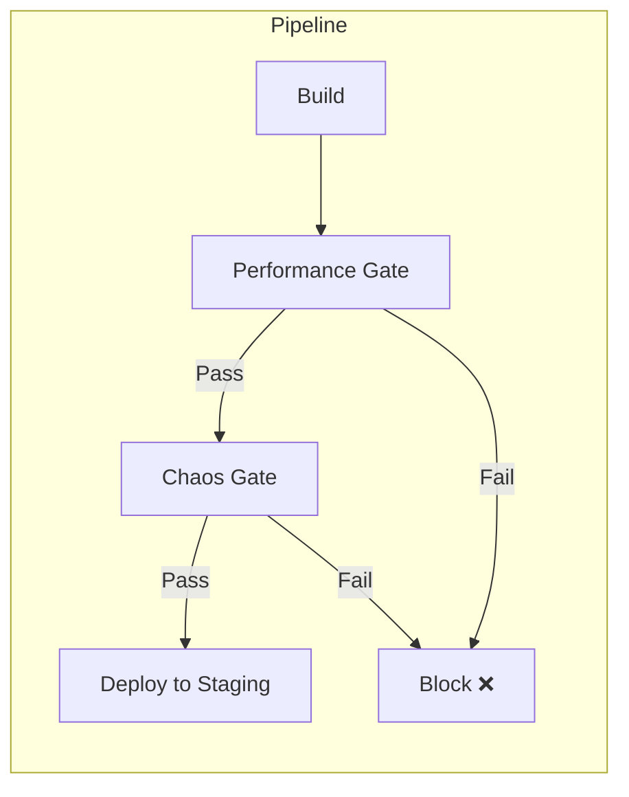
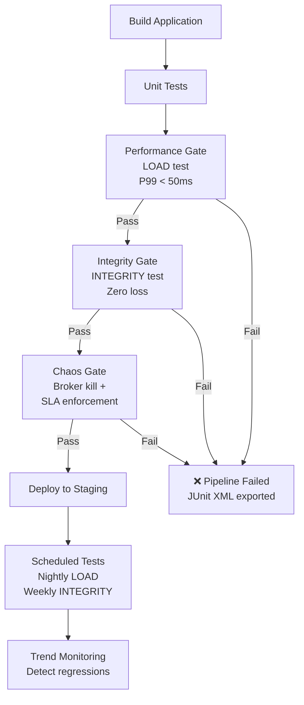

# Tutorial 6: CI/CD Integration

This tutorial shows how to integrate KATES into your CI/CD pipeline for automated performance gates, chaos validation, and regression detection.

## Overview



## Strategy 1: Performance Gate

Block deployments that cause performance regressions.

### Shell Script

```bash
#!/bin/bash
set -e

# Run a LOAD test
echo "Running performance gate..."
RESULT=$(kates test create --type LOAD \
  --records 100000 \
  --producers 4 \
  --acks all \
  --wait \
  -o json)

ID=$(echo "$RESULT" | jq -r '.id')

# Wait for completion
sleep 5

# Extract metrics
P99=$(kates test get "$ID" -o json | jq '.results[0].p99LatencyMs')
THROUGHPUT=$(kates test get "$ID" -o json | jq '.results[0].throughputRecordsPerSec')

echo "P99 Latency: ${P99}ms"
echo "Throughput: ${THROUGHPUT} rec/s"

# Check thresholds
P99_THRESHOLD=50
THROUGHPUT_THRESHOLD=30000

if (( $(echo "$P99 > $P99_THRESHOLD" | bc -l) )); then
  echo "❌ FAILED: P99 latency ${P99}ms exceeds threshold ${P99_THRESHOLD}ms"
  kates report export "$ID" --format junit -o performance-results.xml
  exit 1
fi

if (( $(echo "$THROUGHPUT < $THROUGHPUT_THRESHOLD" | bc -l) )); then
  echo "❌ FAILED: Throughput ${THROUGHPUT} rec/s below threshold ${THROUGHPUT_THRESHOLD} rec/s"
  kates report export "$ID" --format junit -o performance-results.xml
  exit 1
fi

echo "✅ Performance gate passed"
kates report export "$ID" --format junit -o performance-results.xml
```

### GitLab CI Example

```yaml
performance-gate:
  stage: test
  script:
    - kates ctx set ci --url $KATES_URL
    - kates ctx use ci
    - |
      ID=$(kates test create --type LOAD --records 100000 --wait -o json | jq -r '.id')
      kates report export "$ID" --format junit -o performance-results.xml
      P99=$(kates test get "$ID" -o json | jq '.results[0].p99LatencyMs')
      if (( $(echo "$P99 > 50" | bc -l) )); then
        echo "P99 latency regression: ${P99}ms"
        exit 1
      fi
  artifacts:
    reports:
      junit: performance-results.xml
```

## Strategy 2: Chaos Gate

Verify resilience before promoting to production.

### Using Disruption Plans

```bash
#!/bin/bash
set -e

echo "Running chaos gate..."

# Create the disruption plan
cat > /tmp/chaos-gate.json << 'EOF'
{
  "name": "ci-chaos-gate",
  "maxAffectedBrokers": 1,
  "autoRollback": true,
  "steps": [
    {
      "name": "broker-kill",
      "faultSpec": {
        "experimentName": "ci-broker-kill",
        "disruptionType": "POD_KILL",
        "targetNamespace": "kafka",
        "targetLabel": "strimzi.io/cluster=krafter",
        "chaosDurationSec": 15,
        "gracePeriodSec": 0
      },
      "steadyStateSec": 10,
      "observationWindowSec": 45,
      "requireRecovery": true
    }
  ]
}
EOF

# Run with SLA enforcement
kates disruption run \
  --config /tmp/chaos-gate.json \
  --fail-on-sla-breach \
  --output-junit chaos-results.xml

echo "✅ Chaos gate passed"
```

The `--fail-on-sla-breach` flag causes the CLI to exit with code 1 if any SLA threshold is breached, automatically failing the pipeline.

## Strategy 3: Integrity Verification

The strongest gate — verify zero data loss under failure:

```bash
#!/bin/bash
set -e

echo "Running integrity gate..."

# Generate and run integrity chaos test
kates test scaffold --type INTEGRITY_CHAOS -o /tmp/integrity.yaml
ID=$(kates test apply -f /tmp/integrity.yaml --wait -o json | jq -r '.id')

# Check verdict
VERDICT=$(kates test get "$ID" -o json | jq -r '.results[0].integrity.verdict')

if [ "$VERDICT" != "PASS" ]; then
  echo "❌ Data integrity check FAILED: $VERDICT"
  kates report export "$ID" --format junit -o integrity-results.xml
  exit 1
fi

echo "✅ Data integrity verified"
kates report export "$ID" --format junit -o integrity-results.xml
```

## Strategy 4: Scheduled Regression Detection

Set up nightly performance tests to catch slow regressions:

```bash
# Schedule nightly LOAD test
kates schedule create --type LOAD --records 100000 --cron "0 2 * * *"

# Schedule weekly integrity test
kates schedule create --type INTEGRITY --records 100000 --cron "0 3 * * 0"

# View scheduled tests
kates schedule list
```

Monitor trends for regressions:

```bash
# Weekly check
kates trend --type LOAD --metric p99LatencyMs --days 7
```

## Strategy 5: Complete Pipeline

Combine all strategies into a comprehensive validation pipeline:



### Full Script

```bash
#!/bin/bash
set -euo pipefail

KATES_URL="${KATES_URL:-http://localhost:30083}"
kates ctx set ci --url "$KATES_URL"
kates ctx use ci

echo "═══ Step 1: Performance Gate ═══"
PERF_ID=$(kates test create --type LOAD --records 100000 --producers 4 --wait -o json | jq -r '.id')
kates report export "$PERF_ID" --format junit -o performance.xml
P99=$(kates test get "$PERF_ID" -o json | jq '.results[0].p99LatencyMs')
echo "P99: ${P99}ms"
(( $(echo "$P99 > 100" | bc -l) )) && { echo "❌ P99 too high"; exit 1; }

echo "═══ Step 2: Integrity Gate ═══"
INTEG_ID=$(kates test create --type INTEGRITY --records 50000 --wait -o json | jq -r '.id')
kates report export "$INTEG_ID" --format junit -o integrity.xml
VERDICT=$(kates test get "$INTEG_ID" -o json | jq -r '.results[0].integrity.verdict // "PASS"')
[ "$VERDICT" != "PASS" ] && { echo "❌ Integrity failed: $VERDICT"; exit 1; }

echo "═══ Step 3: Chaos Gate ═══"
cat > /tmp/chaos.json << 'PLAN'
{
  "name": "ci-gate",
  "maxAffectedBrokers": 1,
  "autoRollback": true,
  "steps": [{
    "name": "broker-kill",
    "faultSpec": {
      "experimentName": "ci-kill",
      "disruptionType": "POD_KILL",
      "targetNamespace": "kafka",
      "targetLabel": "strimzi.io/cluster=krafter",
      "chaosDurationSec": 15
    },
    "steadyStateSec": 10,
    "observationWindowSec": 45,
    "requireRecovery": true
  }]
}
PLAN
kates disruption run --config /tmp/chaos.json --fail-on-sla-breach --output-junit chaos.xml

echo "✅ All gates passed — safe to deploy"
```

## Artifact Collection

After all gates pass, collect artifacts for the build record:

```bash
# Performance reports
kates report export "$PERF_ID" --format json -o perf-report.json
kates report export "$PERF_ID" --format heatmap -o perf-heatmap.json

# Integrity reports
kates report export "$INTEG_ID" --format json -o integrity-report.json

# All JUnit XML files are ready for CI upload
ls -la *.xml
```
