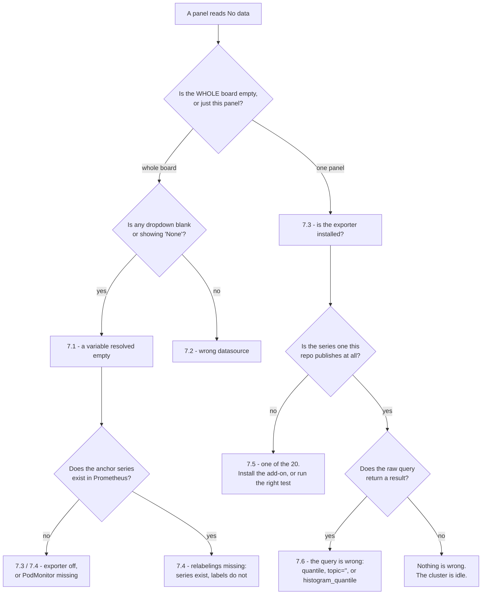

# Tutorial 13: Using the Grafana Dashboards

This tutorial takes you from a running Kates cluster to twelve Grafana boards
you can read under pressure — installed by whichever of four routes fits the
Grafana you actually have, verified from the command line rather than by
squinting at a browser, and diagnosable when a panel is empty.

It is deliberately not a Grafana tutorial. It assumes you can open a dashboard
and change a dropdown. What it teaches is what **these** boards ask, what they
need in order to answer, and the handful of ways they go quiet.

**Level:** Intermediate · **Duration:** 45 min · **Prerequisites:** Tutorial 1

> The reference material lives beside the boards, not here.
> [`dashboards/USING.md`](../../dashboards/USING.md) is the one-page version of
> this tutorial — which board for which question, what the tiles mean, and the
> first thing to check when a board is empty — and is the right place to send
> someone who needs to read a board this afternoon rather than learn the stack.
> [`dashboards/README.md`](../../dashboards/README.md) is the directory's own
> account of itself, [`dashboards/METRICS.md`](../../dashboards/METRICS.md) is
> one row per series, and every board has a `README.md` that goes panel by
> panel. This tutorial is the path through them.

## What You Will End Up With

```text
   dashboards/<board>/board.py                 the board, as rows of panels
            │
            │  scripts/gen-dashboards.py
            ▼
   dashboards/<board>/dashboard.json  ──┬──►  charts/*/…/<board>.json   (route A: Helm)
                                        ├──►  dashboards/install.py     (route B: the API)
                                        ├──►  bundle/provisioning/      (route C: files)
                                        └──►  bundle/configmaps.yaml    (route D: kubectl)
```

One source, four deliveries. The JSON is generated and `--check` fails CI when
any copy drifts, so every route installs the same twelve boards at the same
version.

---

## 1. What You Get, and What Each Board Answers

Twelve boards, **277 panels in 55 rows**. (`scripts/check-dashboards.py`
prints 332 objects across the twelve, because it counts the 55 row headers as
panels too — a board README's own count is usually the panels only.)

| # | Board | uid | Panels | The question it answers, and who opens it |
|--:|---|---|--:|---|
| 1 | Kafka — KRaft Operations | `kates-kafka-kraft` | 61 | Is the quorum healthy, is metadata committing, and has **every broker applied it**? Opened by whoever was paged by `KafkaRaftLeaderElections`, `KafkaRaftUnknownVoters`, `KafkaBrokerMetadataLag` or `KafkaFencedBrokers` — four alerts that had no panel anywhere before this branch. |
| 2 | Kafka — Performance & Load Testing | `kates-kafka-performance` | 40 | What is this cluster doing under **this** load, down to the partition — and is the throughput number real or is the cluster shedding followers to produce it? Opened while `scripts/test-perf-*.sh` or a `kates run` is in flight; refresh is 10 s for that reason. |
| 3 | Kafka Connect | `kates-connect` (per release) | 35 | The connector says RUNNING, so **why is the data not arriving**? Opened by whoever deployed a connector ten minutes ago, and by whoever was paged by a `connect-cluster` alert. |
| 4 | Kafka MirrorMaker 2 | `kates-mm2` (per release) | 37 | Is the mirror up, is it lagging, is it erroring — and if it is lagging, **which leg and which end**? Opened for a mirror that runs for months. |
| 5 | Kafka MirrorMaker 2 — migration | `kates-mm2-mig` (per release) | 19 | **Can I cut over yet**, and if not what is left? Opened for the hours a migration takes, and turned on before the first record crosses. |
| 6 | Kates — Benchmark (live) | `kates-benchmark-overview` | 13 | What is **this run** doing right now — throughput, the percentiles the backend measured, which SLA constraint is breaking? Empty between runs by design. |
| 7 | Kates — Trend & Regression | `kates-trend-analysis` | 11 | **Is this build slower than the last one?** One bounded line per run over a six-hour window; opened weekly, and before approving a release. |
| 8 | Kates — Application Health | `kates-application-health` | 15 | Is the **Quarkus process** behind the benchmark API healthy — HTTP, heap, GC, the Agroal pool, and what the kubelet sees of the container? Opened when `POST /api/runs` returns 500. |
| 9 | KATES — Overview | `kates-overview` | 12 | Is this Kates release up and doing anything? Reads **nothing but series the application publishes about itself**, so `charts/kates` plus a Grafana is enough. |
| 10 | Kates — Chaos | `kafka-chaos-dashboard` | 19 | We injected a fault — **what did the cluster and the workload actually do**? The Litmus experiment timeline with the brokers and the benchmark laid over it. |
| 11 | Kates — Chaos infrastructure | `kates-chaos-overview` | 6 | Is the LitmusChaos execution plane **installed, running, and has it run anything**? The board you open when board 10 is empty and you need to know whether that means "no fault" or "nothing installed". |
| 12 | Kyverno Security Policies | `kyverno-security-overview` | 9 | What did the admission webhook **let through**, what did it **refuse**, and what is it costing the API server? Opened before flipping a policy from Audit to Enforce. |

Confirm the uid list at any time without touching a cluster:

```bash
./dashboards/install.py --list
```

### What is deliberately missing, and where it lives

Four things an operator will look for are **not** here, because the Strimzi
operator's own dashboards already cover them and `charts/strimzi-operator`
enables all nine of them by default:

| You want | Upstream board | uid |
|---|---|---|
| Broker health as a machine — throughput stats, idle percentages, per-listener connections, disk I/O, the JVM and volume set | `strimzi-kafka.json` | `7ddce8bf9ea7ddb5` |
| Quorum **identity** — state, current leader, current vote, epoch, high watermark, log end offset, append and fetch rates | `strimzi-kraft.json` | `d1b98e4d984de29d` |
| Cruise Control — anomaly detection, goal optimization, the load monitor | `strimzi-cruise-control.json` | `fb7da220847d2e2c` |
| Consumer group lag (`kafka_consumergroup_lag`, from the Kafka Exporter) | `strimzi-kafka-exporter.json` | `52a9e2042fa225a2` |

They read exactly the series the exporter rules vendored in
`charts/kafka-cluster` produce, so they work here unmodified, and restating
them would have meant maintaining a second copy that drifts. Board 1's header
carries a `Strimzi`-tagged dropdown that lands straight on them. (The tag is
capitalised — upstream's spelling, and Grafana matches tags exactly.)

The asymmetry is worth knowing before you go looking upstream for the other
two: `strimzi-kafka-connect.json` reads 21 `kafka_*` names and exactly **one**
of them is producible by this repository's Connect exporter rules;
`strimzi-kafka-mirror-maker-2.json` reads 22, and again exactly one. For
Connect and MirrorMaker 2, boards 3–5 are the only ones that work here.

---

## 2. Prerequisites, Stated Exactly

The boards read **213 distinct series**. 136 of them are produced by JMX
exporter rules this repository ships and proves; the other 77 come from
somewhere else, **12 cannot fill in at all on a cluster built only from these
charts**, and a further 8 fill only for a run that verified integrity. Knowing
which is which is the difference between *nothing is wrong* and *nothing
publishes this*.

`scripts/check-dashboards.py` holds this count to the boards: every series any
board reads has to appear in `dashboards/METRICS.md` or the build fails. Derive
the 213 yourself — it is the same tokenizer that check and the metric contract
both use:

```bash
python3 - <<'PY'
import json, pathlib, sys
sys.path.insert(0, "scripts/metric-contract")
import contract as C
names = set()
for d in sorted(pathlib.Path("dashboards").iterdir()):
    if not d.is_dir() or d.name.startswith("_") or d.name == "bundle":
        continue
    dash = json.loads((d / "dashboard.json").read_text())
    for _, expr in C._dashboard_exprs(dash):
        names |= C.metric_names(expr)
print(len(names), "distinct series")
PY
```

### What must exist, and what goes blank without it

| Prerequisite | Turned on by | What goes blank without it |
|---|---|---|
| **Prometheus, with the Prometheus Operator CRDs** (`monitoring.coreos.com/v1`) | `charts/monitoring` (kube-prometheus-stack) | Everything. Every chart guards its PodMonitor and ServiceMonitor with `.Capabilities.APIVersions.Has "monitoring.coreos.com/v1"`, so without the CRDs the monitors are silently not rendered and nothing is scraped. |
| **Grafana with the dashboard sidecar** | `kube-prometheus-stack.grafana.sidecar.dashboards.enabled` (true in `charts/monitoring`) | Needed by routes A and D only. Routes B and C reach Grafana without it. |
| **JMX exporter rules on the Kafka pods** | `metrics.enabled` in `charts/kafka-cluster` | Boards 1 and 2, completely — including their `$namespace` and `$cluster` dropdowns. Strimzi only opens the scrape port when `metricsConfig` is set, so "metrics off" and "port closed" are the same state. |
| **The `charts/kafka-cluster` PodMonitors** (`<cluster>-kafka`, plus Cruise Control, Kafka Exporter and entity-operator) | `monitoring.podMonitor.enabled` (default `true`) **and** `metrics.enabled` | Same as above. These are also what apply `kafka-common.strimziRelabelings`, which is where `namespace`, `kubernetes_pod_name`, `zone` and the `strimzi_io_*` labelmap come from. Without the relabelings the series exist and **no board's selector matches them**. |
| **The `charts/connect-cluster` PodMonitor** | `monitoring.podMonitor.enabled` (default `true`) + `metrics.enabled` | Board 3, completely. |
| **The `charts/mirror-maker2` PodMonitor** | `podMonitors.enabled` (default `false`) + `metrics.enabled` | Boards 4 and 5, completely. |
| **A Prometheus whose `podMonitorSelector` matches those PodMonitors' labels** | `monitoring.podMonitor.labels` on the workload charts; the selector comes from the kube-prometheus-stack **release name** | The same boards, in a way that looks exactly like the PodMonitor not existing — except the object is there. See 7.4; this is the one that catches people. |
| **The `charts/kates` ServiceMonitor** (scrapes `/q/metrics`) | `metrics.serviceMonitor.enabled` (default **false**) | Boards 6, 7, 9; the header and HTTP/JVM/pool rows of board 8; the *Kates during chaos* row of board 10. |
| **kube-state-metrics** | subchart of kube-prometheus-stack, on by default | Board 8's header (*Pods ready*, *Container restarts (5m)*, *Database pods ready*); board 10's *Broker pod readiness*, *Broker restarts* and *Chaos engines running*; board 11's *Chaos operator* tile and *Chaos infra pods — status*; board 12's *Controller Pods — Status*. Five series in total. |
| **cAdvisor, via the kubelet** | `kube-prometheus-stack.kubelet.enabled` (true) | Board 8's *Container resources* row (2 panels) and board 10's *Broker CPU cores* / *Broker memory*. Four series. |
| **kube-state-metrics configured with custom-resource metrics for `ChaosEngine`** | `charts/monitoring` since 1.6.0 (`kube-prometheus-stack.kube-state-metrics.customResourceState`, plus the `list`/`watch` RBAC it needs). **Not** a kube-state-metrics default, so another stack has to copy that block | Board 10's *Chaos engines running* tile and its `$namespace` picker. The series is one per ChaosEngine and state, so both are also empty on a cluster that has never created an experiment. The tile's zero fallback is anchored to this series unfiltered, so with the series absent it reads **No data** rather than a reassuring zero, and the picker comes up empty with a tooltip saying why. The alerts cannot be anchored, and three of them are dead by construction: the `and on() count(…) == 0` guard on `KafkaBrokerRestartUnexpected`, `KafkaHighCPUPostChaos` and `KafkaClusterNotReadyPostChaos` never passes, because `count()` over nothing is empty rather than zero — with or without this series. Only `KafkaChaosExperimentActive` gains from the series existing. |
| **LitmusChaos, *and* its chaos-exporter** | `charts/kates-chaos` installs the execution plane; the exporter is left off (`litmus-core.exporter.enabled`) | All eight `litmuschaos_*` series: board 11's verdict tiles, cluster totals and experiment duration; board 10's *Experiments passed* / *failed* / *Probe success rate* and its *Experiment history* row. |
| **Kyverno, and a scrape of it** | not shipped here — install Kyverno separately | Board 12's first eight panels. The ninth, *Controller Pods — Status*, reads `kube_pod_status_phase` on purpose: **a webhook that is down cannot report that it is down.** |
| **The Kafka Exporter** | `kafkaExporter.enabled` in `charts/kafka-cluster` (default true) | Nothing in `dashboards/`. It is listed here because operators look for consumer lag on board 3 and it is not there: `kafka_consumergroup_lag` feeds `strimzi-kafka-exporter.json` and the `KafkaConsumerGroupLag` alert, and the Connect workers do not publish it. |
| **The `mm2:*` recording rules** | `alerts.enabled` **and** `alerts.slo.enabled` in `charts/mirror-maker2` | Board 4's *Replication SLO* row. The row stays on the board everywhere and shows its styled no-data state where the rules are not installed — the `no-slo` variant that used to cut it went with per-chart delivery in mirror-maker2 0.11.0. |

### The twenty that do not fill by default

Two very different groups, and the distinction decides whether there is
anything to do:

*Install something* — 11 series. The eight `litmuschaos_*` need LitmusChaos
and its chaos-exporter; the three `kyverno_*` need Kyverno. Each is a
supported add-on and the panels fill in once it is there. (On a stack other
than `charts/monitoring`, `kube_customresource_chaosengine_status_engine_status`
belongs in this group too: kube-state-metrics has to be configured for
`ChaosEngine`, which the chart does since 1.6.0.)

*Run the right kind of test* — 9 series. One is
`kube_customresource_chaosengine_status_engine_status`, published per
ChaosEngine and therefore present from the first chaos run on — Kates leaves
its engines in place afterwards. The other eight are `kafka:chaos:*`
records: the recording rules in
`charts/monitoring/templates/prometheus-chaos-rules.yaml` read the
`kates_integrity_result_*` series the Kates application publishes from
`IntegrityResult`, and it publishes them only for a run that actually verified
integrity — a chaos or resilience run, not a plain load test. They are the
collapsed *RTO / RPO / data integrity* row on board 10. Nothing to install:
run a verified test. Note also that these rules only exist at all when
`chaosAlerts.enabled` is set, which is **not** the default.

> **This is new.** Until this release every one of those series read a name
> nothing published — the verifier computed RTO, RPO and data loss in Java and
> returned them over the REST API but never registered them with Micrometer —
> so the row could not fill and the four SLA alerts on it installed cleanly
> and could never fire. The same file also contained invalid PromQL
> (`max without(instance) (a, b)`), which would have made Prometheus refuse
> the entire rule set, and no capability check for the Prometheus Operator
> CRDs. All three survived because the file sits behind a toggle that defaults
> to false and nothing had ever rendered it; the chart matrix now renders
> every toggle. See
> [`dashboards/kates-chaos/README.md`](../../dashboards/kates-chaos/README.md).

---

## 3. Installing — The Four Routes

They install the same twelve boards. What differs is what you already have.

| Route | Use it when | What it needs |
|---|---|---|
| **A** Helm charts | you run these charts | a cluster, the charts, the Grafana sidecar |
| **B** `dashboards/install.py` | you have a Grafana and a credential | Python 3.8+, network to Grafana |
| **C** `bundle/provisioning/` | Grafana reads provisioning files at boot | a volume mount, a restart |
| **D** `bundle/configmaps.yaml` | you run the Grafana sidecar but not these charts | `kubectl`, a watched namespace |

Everything under `dashboards/bundle/` is generated. Run
`scripts/gen-dashboards.py` after changing a board; `--check` fails CI when it
is stale.

### Route A — the Helm charts

**Use it when** you are already deploying these charts.

Since monitoring 1.5.0 one chart delivers every board: all twelve ship in
`charts/monitoring`'s dashboards ConfigMap, behind one value.

| Board | Chart | Value | Default |
|---|---|---|---|
| all twelve | `charts/monitoring` | `dashboards.enabled` | `true` |

Through kates 0.8.0, kates-chaos 2.1.0, connect-cluster 2.0.0 and
mirror-maker2 0.10.0 the chart that owned a workload also delivered its
board, with a per-release copy and — for Connect and MirrorMaker 2 — a
per-release uid and title. The boards' template variables (`$job` on KATES —
Overview, `$namespace`/`$cluster` on the rest) already did that separating,
so the copies bought nothing the one file does not; those charts now REFUSE
their old dashboard values with the replacement named, rather than accepting
and silently ignoring them.

On the Kates Kind cluster, the monitoring stack — Prometheus, Grafana, the
sidecar and all twelve boards — is one command:

```bash
helm dependency build charts/monitoring

helm upgrade --install monitoring charts/monitoring \
  --namespace kafka --create-namespace \
  -f charts/monitoring/values-kind.yaml \
  --timeout 10m --wait
```

That is exactly what `make monitoring` runs after provider detection. Note the
namespace: this repository puts Grafana in `kafka`, beside the cluster, not in
a `monitoring` namespace.

Installing a board and filling it are different things: the boards arrive
with `charts/monitoring`, and the workload charts decide whether they have
data. §2's table is the full map. The switches that most often need turning
on — written as upgrades of releases you already have, with `--reuse-values`
so nothing else about the release moves, which is also how Tutorial 10 turns
MirrorMaker 2's observability on:

```bash
helm upgrade mm2 charts/mirror-maker2 -n kafka --reuse-values \
  --set metrics.enabled=true \
  --set podMonitors.enabled=true

helm upgrade kates charts/kates -n kates --reuse-values \
  --set metrics.serviceMonitor.enabled=true
```

`connect-cluster`, `mirror-maker2` and `kafka-cluster` are built on the
`kafka-common` library chart, declared as a `file://` dependency. Nothing
renders until it is resolved — not `helm template`, not `helm lint`, not `helm
upgrade` — so run this once for any of them you are about to touch.
`kates-chaos` and `monitoring` have remote dependencies (litmus-core and
kube-prometheus-stack) and need the same treatment; `charts/kates` has none.

```bash
helm dependency build charts/connect-cluster
helm dependency build charts/mirror-maker2
helm dependency build charts/kates-chaos
```

Rehearse any of them before it reaches the cluster. `check-dashboards.py
--render` reads a `helm template` stream on stdin and holds every dashboard
ConfigMap in it to the same layout and documentation rules the directory gets:

```bash
helm template monitoring charts/monitoring -n kafka \
  -f charts/monitoring/values-kind.yaml \
  -s templates/grafana-dashboards.yaml \
  | python3 scripts/check-dashboards.py --render
```

```text
  kafka-connect.json                                    41 panels  uid=kates-connect
  kafka-kraft.json                                      68 panels  uid=kates-kafka-kraft
  kafka-performance.json                                46 panels  uid=kates-kafka-performance
  kates-application.json                                19 panels  uid=kates-application-health
  kates-benchmark.json                                  17 panels  uid=kates-benchmark-overview
  kates-chaos-infra.json                                 8 panels  uid=kates-chaos-overview
  kates-chaos.json                                      25 panels  uid=kafka-chaos-dashboard
  kates-overview.json                                   15 panels  uid=kates-overview
  kates-trend.json                                      16 panels  uid=kates-trend-analysis
  kyverno-security.json                                  9 panels  uid=kyverno-security-overview
  mirror-maker2-migration.json                          24 panels  uid=kates-mm2-mig
  mirror-maker2.json                                    46 panels  uid=kates-mm2
OK: 12 dashboard(s) pass the layout and documentation checks
```

**What this route injects: nothing.** Through connect-cluster 2.0.0 and
mirror-maker2 0.10.0 the workload charts delivered their own boards and
rewrote each copy's uid, title and variable presets per release — the uid
carried a digest of the release fullname so that two releases could not
overwrite each other's board. One file now serves every release: the
`$namespace`/`$cluster` query variables resolve the releases from the data,
so the render ships the boards byte-identical to `dashboards/` and a board
opens with its dropdowns unpreselected — the same board, one click from the
same answer, on every route.

This one-liner reads the rendered ConfigMap back and prints what is in it —
worth keeping, because it is the same inspector that answers "which board is
in this ConfigMap?" during an incident:

```bash
helm template monitoring charts/monitoring -n kafka \
  -s templates/grafana-dashboards.yaml \
  | python3 -c '
import sys, json, yaml
for d in yaml.safe_load_all(sys.stdin):
    if not d or d.get("kind") != "ConfigMap":
        continue
    for name, body in sorted((d.get("data") or {}).items()):
        if not name.endswith(".json"):
            continue
        b = json.loads(body)
        print(name, "->", b["uid"], "|", b["title"])
'
```

```text
kafka-connect.json -> kates-connect | Kafka Connect
kafka-kraft.json -> kates-kafka-kraft | Kafka — KRaft Operations
kafka-performance.json -> kates-kafka-performance | Kafka — Performance & Load Testing
kates-application.json -> kates-application-health | Kates — Application Health
kates-benchmark.json -> kates-benchmark-overview | Kates — Benchmark (live)
kates-chaos-infra.json -> kates-chaos-overview | Kates — Chaos infrastructure
kates-chaos.json -> kafka-chaos-dashboard | Kates — Chaos
kates-overview.json -> kates-overview | KATES — Overview
kates-trend.json -> kates-trend-analysis | Kates — Trend & Regression
kyverno-security.json -> kyverno-security-overview | Kyverno Security Policies
mirror-maker2-migration.json -> kates-mm2-mig | Kafka MirrorMaker 2 — migration
mirror-maker2.json -> kates-mm2 | Kafka MirrorMaker 2
```

#### The four knobs

One chart, one key: `charts/monitoring`'s `dashboards` block.

| Knob | What it decides |
|---|---|
| `enabled` | whether the boards are shipped at all |
| `label` / `labelValue` | the label the Grafana sidecar watches (`grafana_dashboard: "1"`) |
| `namespace` | which namespace the ConfigMap goes in |
| `folder` | the Grafana folder, via the `grafana_folder` annotation |

`label`/`labelValue` are scalars and are **always** applied. The `labels` map
is merged on top of them, never in place of them: a map in `values.yaml` that
drops `grafana_dashboard` would take every board with it, and the symptom is
boards that never appear — no error from Helm, none from the sidecar, nothing
in the ConfigMap that looks wrong.

**The namespace rarely bites any more.** The ConfigMap lands in the
monitoring release's own namespace — beside the Grafana the same chart
installs, whose sidecar the chart also pins to
`kube-prometheus-stack.grafana.sidecar.dashboards.searchNamespace: ALL`. A
Grafana installed some other way may be watching only its own namespace;
point `dashboards.namespace` at it when it is.

### Route B — `dashboards/install.py`, straight at the Grafana API

**Use it when** you have a Grafana and a credential and no wish to involve a
cluster: a managed Grafana, a Grafana Cloud stack, a port-forward, the
container on your laptop, or a CI step. It imports nothing outside the Python
standard library, so it runs on any Python 3.8+ with no install step.

> **Not for a Grafana that already provisions these boards.** Route A's
> sidecar provisions with `allowUiUpdates: false`, and Grafana refuses every
> API write to a board it provisioned:
>
> ```text
> FAILED      kafka-performance          uid=kates-kafka-performance
>             HTTP 400 from POST /api/dashboards/db: Cannot save provisioned dashboard
> ```
>
> Verified against Grafana 12.3.1 with a sidecar-shaped provider. It is
> Grafana protecting the provisioner, not a broken installer, and it applies
> to Route C's file provisioning too. To change a board that arrived by
> Route A or C, change it at the source and `helm upgrade`; `install.py`
> prints that as a hint under the failure.

Everything it accepts:

```text
usage: dashboards/install.py [-h] [--url URL] [--token TOKEN] [--user USER]
                             [--folder FOLDER] [--datasource DATASOURCE]
                             [--tag TAG] [--message MESSAGE] [--dry-run]
                             [--insecure] [--list]
                             [BOARD ...]
```

| Flag | Environment | What it does |
|---|---|---|
| `BOARD ...` | — | board **directory** names; default is every board |
| `--url` | `$GRAFANA_URL` | Grafana base URL |
| `--token` | `$GRAFANA_TOKEN` | service-account token or API key |
| `--user` | `$GRAFANA_USER` / `$GRAFANA_PASSWORD` | basic auth as `user:password`, or a bare user with the password in the environment |
| `--folder` | — | folder to file the boards into, **created when missing**; default is the General folder |
| `--datasource` | — | name **or uid** of the Prometheus datasource to select in each board |
| `--tag` | — | extra tag on every board; repeatable |
| `--message` | — | the version message Grafana records for this push |
| `--dry-run` | — | say what would be pushed and change nothing |
| `--insecure` | — | skip TLS verification, for a self-signed certificate |
| `--list` | — | print the boards and their uids, and exit — contacts nothing |

Start with the two that touch nothing:

```bash
./dashboards/install.py --list
./dashboards/install.py --url http://localhost:30080 --user admin:admin --dry-run
```

The dry run prints one line per board with its uid and its **top-level** panel
count, then `Dry run: 12 board(s) would be installed, nothing was changed.`

Then the real push. On the Kates Kind cluster, Grafana is on NodePort 30080
with `admin`/`admin`:

```bash
./dashboards/install.py \
  --url http://localhost:30080 --user admin:admin \
  --folder Kates --datasource Prometheus
```

Against a managed Grafana, with a token from the environment and a tag so the
boards are separable from hand-made ones:

```bash
export GRAFANA_URL=https://grafana.example.com
export GRAFANA_TOKEN='glsa_…'

./dashboards/install.py \
  --folder Kates --datasource Prometheus \
  --tag managed --message "kates dashboards $(git rev-parse --short HEAD)"
```

A subset, by directory name:

```bash
./dashboards/install.py --url "$GRAFANA_URL" --token "$GRAFANA_TOKEN" \
  kafka-kraft kafka-performance
```

An unknown name is refused before anything is posted, and the error lists the
twelve that exist.

Three things worth knowing about how it behaves:

- **It is idempotent.** Every board carries a stable uid and the push uses
  `overwrite: true`, so a second run updates the same twelve boards and
  creates no second folder. What it does record is a new version in Grafana's
  own history, with `--message` on it. That is what makes it safe in a
  pipeline.
- **It checks the credential once.** `/api/health` answers without one, so it
  proves reachability and nothing else; the installer follows it with
  `/api/org`, which turns twelve identical 401s into one clear line. The
  credential needs the Editor role, or Admin when `--folder` has to create the
  folder.
- **A rejected board is named, with Grafana's own reason, and the rest still
  install.** The exit code is 1 and the failures are listed.

It installs exactly what every other route installs: the twelve boards as
`dashboards/` builds them. (Until mirror-maker2 0.11.0 the chart route was
different — it picked a `no-slo` or `identity` variant from the release's
values and rewrote uids per release. Those shapes are gone everywhere: the
SLO row shows its styled no-data state where the recording rules are absent,
and the dropdowns resolve releases from the data.)

### Route C — `bundle/provisioning/`, file provisioning, no sidecar

**Use it when** Grafana reads provisioning files at boot and you would rather
mount a directory than run a sidecar. One directory, one mount:

```bash
docker run -d --name grafana -p 3000:3000 \
  -v "$PWD/dashboards/bundle/provisioning:/etc/grafana/provisioning/dashboards:ro" \
  grafana/grafana:12.3.1
```

In Kubernetes the same directory goes in as a ConfigMap or a volume mounted at
`/etc/grafana/provisioning/dashboards`; in the Grafana Helm chart it is
`extraConfigmapMounts`.

The provider is `allowUiUpdates: false` on purpose. These boards are generated,
so an edit in the UI is lost at the next restart either way — better for
Grafana to show the board as provisioned and refuse the save than to accept it
and drop it.

The one thing this route cannot do is name a datasource. The boards land in the
`Kates` folder and open on **the org's default datasource**, because that is
what every board's `${datasource}` variable asks for. Mark one Prometheus
`isDefault: true`, or use route B, which can name one.

### Route D — `bundle/configmaps.yaml`, the sidecar without these charts

**Use it when** you run the Grafana sidecar but not these Helm charts.

```bash
kubectl apply -n kafka -f dashboards/bundle/configmaps.yaml
```

Twelve ConfigMaps, one board each, carrying `grafana_dashboard: "1"` and a
`grafana_folder: Kates` annotation. **No `metadata.namespace` is written into
the file**, so `-n` chooses — and it has to name a namespace the sidecar
searches. One ConfigMap per board rather than one for all twelve because
together they are most of a megabyte and a ConfigMap's ceiling is 1 MiB: a
single object would be the next board away from breaking the apply.

Check the bundle before applying it — the same gate, fed from a file instead of
`helm template`:

```bash
python3 scripts/check-dashboards.py --render < dashboards/bundle/configmaps.yaml
```

```text
  kafka-connect.json                                    41 panels  uid=kates-connect
  …
  mirror-maker2-migration.json                          24 panels  uid=kates-mm2-mig
OK: 12 dashboard(s) pass the layout and documentation checks
```

---

## 4. Verifying the Install

Six checks, none of which is "open Grafana and look". Run them in order: each
one rules out the layer below it.

Set the two endpoints once. On Kind, `make port-forward` (or
`scripts/port-forward.sh`) puts Grafana on 30080 and Prometheus on 30090; on
the default NodePort deploy Grafana is already there:

```bash
export GRAFANA=http://localhost:30080
export PROM=http://localhost:30090
export AUTH=admin:admin
```

### 4.1 The ConfigMaps exist and carry the sidecar label

```bash
kubectl get cm -A -l grafana_dashboard=1 -o json | jq -r '
  .items[]
  | "\(.metadata.namespace)/\(.metadata.name)\t\(.metadata.annotations.grafana_folder // "(no folder annotation)")\t\(.data | keys | join(" "))"'
```

What you should see, by route:

| Route / chart | ConfigMap | Namespace | Folder annotation |
|---|---|---|---|
| `charts/monitoring` | `<release>-kates-dashboards` (all twelve boards in one object) | release namespace | none by default — `dashboards.folder` is `""` |
| Route D | twelve `kates-dashboard-<board>` objects | whatever `-n` said | `Kates` |

A board with **no** folder annotation is not broken; it lands in the sidecar's
default folder. A board missing from this list entirely has either `enabled:
false` or a `labels` map that dropped the label.

### 4.2 The sidecar is watching the namespaces those ConfigMaps are in

This is the check that catches the single most common silent failure — a
labelled, correct, generated ConfigMap that the sidecar never reads.

```bash
kubectl -n kafka get deploy monitoring-grafana -o json | jq -r '
  .spec.template.spec.containers[]
  | select(.name=="grafana-sc-dashboard")
  | .env[]
  | select(.name=="LABEL" or .name=="LABEL_VALUE" or .name=="NAMESPACE"
           or .name=="FOLDER" or .name=="FOLDER_ANNOTATION")
  | "\(.name)=\(.value)"'
```

```text
LABEL=grafana_dashboard
LABEL_VALUE=1
FOLDER=/tmp/dashboards
NAMESPACE=ALL
FOLDER_ANNOTATION=grafana_folder
```

`NAMESPACE=ALL` is what `charts/monitoring` pins. If it is a comma-separated
list instead, every namespace from the table in 4.1 must appear in it. If
`FOLDER_ANNOTATION` is absent, the `grafana_folder` annotations are inert and
every board lands in one flat list — the boards still load.

### 4.3 The sidecar actually wrote the files

```bash
kubectl -n kafka exec deploy/monitoring-grafana -c grafana-sc-dashboard \
  -- ls -1 /tmp/dashboards
```

`/tmp/dashboards` is the `FOLDER` value from 4.2. A ConfigMap present in 4.1
and absent here means the sidecar saw it and rejected it — check its logs.

### 4.4 Grafana is up and the boards loaded

```bash
curl -sf -u "$AUTH" "$GRAFANA/api/health" | jq -r '"\(.version)\t\(.database)"'

curl -sf -u "$AUTH" "$GRAFANA/api/search?type=dash-db&tag=kates" | jq -r '
  .[] | "\(.uid)\t\(.folderTitle // "General")\t\(.title)"'
```

All twelve boards carry the `kates` tag, so that one query is the whole set.

Then check each uid individually, which is the form that distinguishes *loaded*
from *loaded under a different uid*:

```bash
for uid in $(./dashboards/install.py --list | awk '{print $2}' | sed 's/^uid=//'); do
  code=$(curl -s -o /dev/null -w '%{http_code}' -u "$AUTH" \
              "$GRAFANA/api/dashboards/uid/$uid")
  printf '%-28s %s\n' "$uid" "$code"
done
```

The twelve base uids are:

```text
kates-kafka-kraft            kates-benchmark-overview     kates-connect
kates-kafka-performance      kates-trend-analysis         kates-mm2
kates-application-health     kafka-chaos-dashboard        kates-mm2-mig
kates-overview               kates-chaos-overview         kyverno-security-overview
```

**Every route installs every board under these uids** — since monitoring
1.5.0 there are no per-release uids to chase, so a 404 here means the board
genuinely did not arrive (the ConfigMap is missing, unlabelled, or in a
namespace the sidecar does not watch). Search by tag when you only remember
the workload:

```bash
curl -sf -u "$AUTH" "$GRAFANA/api/search?type=dash-db&tag=connect" | jq -r '.[].uid'
curl -sf -u "$AUTH" "$GRAFANA/api/search?type=dash-db&tag=mirrormaker2" | jq -r '.[].uid'
```

### 4.5 The board that loaded is the board you meant

```bash
curl -sf -u "$AUTH" "$GRAFANA/api/dashboards/uid/kates-kafka-kraft" \
  | jq '[.dashboard.panels[] | ., (.panels // [])[]] | length'
```

```text
68
```

That is the same number `scripts/check-dashboards.py` prints for
`kafka-kraft`, and it is the cheapest way to tell a current board from one an
earlier release installed under the same uid. The full set: 41, 68, 46, 19, 17,
23, 8, 15, 16, 9, 46, 24 — in the order `install.py --list` prints them.

### 4.6 The datasource resolved

Two halves. What Grafana has:

```bash
curl -sf -u "$AUTH" "$GRAFANA/api/datasources" | jq -r '
  .[] | select(.type=="prometheus") | "\(.name)\tuid=\(.uid)\tdefault=\(.isDefault)"'
```

And what the board asks for:

```bash
curl -sf -u "$AUTH" "$GRAFANA/api/dashboards/uid/kates-kafka-kraft" | jq -r '
  .dashboard.templating.list[] | select(.type=="datasource") | .current
  | "\(.text) / \(.value)"'
```

```text
default / default
```

`default / default` is the shipped state and is **correct**: it is what makes
Grafana 12 add the synthetic *default* option and select it, so the board opens
on the org default. After `install.py --datasource Prometheus` you will see the
datasource's name and its uid instead, which is the state to want when the
Prometheus these boards need is not the org default. What you should never see
is an empty `current` — section 7.2 explains why.

> **Which Grafana.** `charts/monitoring` installs **12.3.1**, and the boards
> are verified on **8.5, 9.5, 10.4, 11.6 and 12.3** — loaded into a real
> Grafana of each version and then driven with a headless browser, because the
> API being happy and the frontend drawing the panel are different questions.
> All twelve boards sit at `schemaVersion` 39 and use only panel types that
> have been core since Grafana 8, and no version tested migrates the schema,
> so the file is what you get. Re-run it yourself with
> `make check-grafana-compat GRAFANA_VERSIONS="..."`. 8.5 is a floor, not a
> recommendation; CI covers 9.5 upward.

---

## 5. Driving the Boards

### 5.1 The template variables

Twelve boards, twelve distinct variable names. Every one of them is resolved
from data or written by the chart; nothing is hard-coded into an expression.

| Variable | On how many boards | Resolved from | What an empty value means |
|---|--:|---|---|
| `$datasource` | 12 (all) | Grafana's own datasource list, filtered by the **plugin id** `prometheus` | See 7.2 — it is the failure that looks like all the others. |
| `$namespace` | 7 query + 1 constant | `label_values(<anchor>, namespace)`, where the anchor is a series the workload always publishes — except on `kates-chaos-infra`, where it is a hidden `constant` the chart fills in (6.3) | Nothing is being scraped in any namespace, or the relabelings are missing. |
| `$cluster` | 5 | `label_values(<anchor>{namespace="$namespace"}, strimzi_io_cluster)` | The PodMonitor's `strimzi_io_*` labelmap is not being applied. |
| `$job` | 4 | `label_values(process_uptime_seconds, job)` or `label_values(kates_tests_completed_total, job)` | The `charts/kates` ServiceMonitor is off, or no Kates release is scraped. |
| `$pod` | 2 (multi, All) | `process_uptime_seconds{namespace="$namespace", job="$job"}` on `kates-application`; `kube_pod_status_ready{namespace="$namespace"}` on `kates-chaos` | On `kates-application`, nothing is scraping the app; on `kates-chaos`, kube-state-metrics is not installed. |
| `$test_type` | 2 | `label_values(kates_tests_completed_total{job="$job"}, test_type)` | This installation has never completed a run. |
| `$topic` | 1 (multi, All) | `label_values(kafka_log_log_size{namespace="$namespace", strimzi_io_cluster="$cluster"}, topic)` | `$cluster` is empty, or the cluster has no topics. |
| `$run_id` | 1 | `label_values(kates_benchmark_records_total{job="$job"}, run_id)` | **No run is in flight.** Expected, and not a fault. |
| `$kates_job` | 1 | `label_values(kates_benchmark_active_runs, job)` | No Kates release is being scraped. |
| `$db_pod` | 1 (multi, All) | `label_values(kube_pod_status_ready{namespace="$namespace", pod=~".*postgres.*"}, pod)` | No PostgreSQL pod in that namespace, or no kube-state-metrics. |
| `$source` | 1 (`custom`) | the literal `source`; edit the variable's options to your source aliases | — it is a value list, not data, on purpose: a leg whose connectors never started publishes no series with its alias in, and that is precisely the leg you want a row for. (Until mirror-maker2 0.11.0 the chart wrote `.Values.mirrors[].source.alias` into its copy; the one central board carries the placeholder.) |
| `$operator_deployment` | 1 (`constant`, hidden) | `litmus`, litmus-core's own fullname; edit the board when yours is named differently | — |

The five boards with a real `$cluster` are **kafka-kraft**, **kafka-performance**,
**kafka-connect**, **mirror-maker2** and **mirror-maker2-migration**. Confirm it:

```bash
python3 - <<'PY'
import json, pathlib
for d in sorted(pathlib.Path("dashboards").iterdir()):
    if not d.is_dir() or d.name.startswith("_") or d.name == "bundle":
        continue
    j = json.loads((d / "dashboard.json").read_text())
    names = [v["name"] for v in j["templating"]["list"]]
    print("%-24s %s" % (d.name, " ".join(names)))
PY
```

Three properties of these variables that change how you read the board:

- **`$datasource` filters by plugin id, not by name.** A Prometheus-compatible
  datasource called `Thanos`, `Mimir` or `metrics-prod` is offered exactly like
  one called `Prometheus`. There is deliberately no name regex on it — the only
  thing a regex could usefully do is exclude datasources that would have
  worked.
- **Query variables refresh on time-range change** (`refresh: 2`), not only on
  load. Widen the window and a `$run_id` or `$topic` that had emptied out comes
  back.
- **A variable that resolves empty silently disables every panel scoped by
  it.** There is no error; the panels filter on `{cluster=""}` and draw *No
  data*, which is what an idle cluster draws. That is exactly how
  `kates-benchmark` came to be entirely non-functional before this branch: both
  of its variables read a series the application registered nowhere, so every
  panel filtered on `{run_id=~"", test_type=~""}` against a cluster running
  flat out.

### 5.2 A worked reading — `kafka-kraft` on a healthy cluster

Open it, pick `$namespace` and `$cluster`, and read the header left to right.
Every expression on the board carries the same three matchers:

```promql
namespace="$namespace", strimzi_io_cluster="$cluster", strimzi_io_name="$cluster-kafka"
```

Those are the same three matchers `$k` builds in
`charts/kafka-cluster/templates/prometheusrule.yaml` — the alerts render the
values, the board resolves them from dropdowns — so a page and a panel select
the same series and there is no translation step in the middle of an incident.
`strimzi_io_name` is the one that looks optional and is not: Cruise
Control, the Kafka Exporter and the entity operator run in the same namespace
under the same `strimzi_io_cluster` and publish their own `up` and `jvm_*`.

**The header, six stats.** On a healthy cluster:

| Stat | Healthy reading | What a bad reading is |
|---|---|---|
| Active controllers | exactly **1** | 0 means the quorum has no leader and nothing new can happen while every existing leader keeps serving. `KafkaActiveControllerCount` fires on anything but 1 after 3 minutes. |
| Quorum epoch | any number, **flat** | The value is meaningless; the rate of change is everything. Each increment is one election, and metadata writes are frozen for the duration of each. |
| Unreachable voters | **0** | On a three-voter quorum, 1 is a warning and 2 is an outage in progress. |
| Metadata lag (worst node) | tens of milliseconds | `KafkaBrokerMetadataLag` fires above 60 000 ms. |
| Fenced brokers | **0** | A fenced broker is running, passing every probe, and serving nothing. |
| Metadata errors | **0** | The sum of load, apply and controller errors. Nothing in the chart alerts on any of them. |

**Quorum and metadata, 11 panels.** Reads left to right as *is the quorum
electing, is it committing, is it propagating*.

- *Quorum roles* is a table of `max by (kubernetes_pod_name, current_state)`
  over an info series whose value is always 1. Healthy is one row per node with
  exactly one `leader`, the rest `follower`, and the brokers `observer`. The
  state is in the **label**, so `sum()` over it counts nodes, not states.
- *Leader elections in 15 minutes* flat at 0, and *Election latency* therefore
  drawing nothing new. Three fast elections cost the cluster less than one slow
  one.
- *Uncommitted metadata records* is `log_end_offset − high_watermark` per node.
  Healthy is a line that hovers near zero and keeps returning to it. A gap that
  grows and does not close is the signature of a lost majority — and the
  cluster does not stop, it **freezes**: existing leaders keep serving, nothing
  new happens.
- *Metadata commit latency* draws two series per node — `avg` and `max`,
  separated by a `label_replace` that writes a `kind` label — and the `max` one
  is `…_max_total`, **a max gauge in milliseconds wearing a counter's name**.
  Never `rate()` it. Read the panel against *Raft poll idle ratio* (one series
  per node, already a 0–1 ratio, so no `rate()` there either): slow commits
  with an idle raft thread is the disk under the metadata log; slow commits
  with the thread at zero is the thread itself, usually a controller
  co-located with a loaded broker. Two completely different fixes.
- *Broker metadata lag* and *Metadata records behind the leader* are the same
  gap in two units. The millisecond form is computed from a timestamp inside
  the record, so a clock problem makes it meaningless; the record form is
  `scalar(max(…)) - max by (kubernetes_pod_name) (…)` and is immune to it.
  **When they disagree, believe the records.**
- *Quorum channel requests and responses /s* draws two series per node,
  `requests` and `responses`, and is read as a pair. Matched rates are a
  quorum talking to itself; requests pulling ahead of responses on one node is
  a peer that has stopped answering it — a slow inter-AZ link, or a peer that
  is gone — and it shows here *first*, before commit latency moves, because a
  commit only needs a majority and the slow peer can be the one left out.
  (The panel it replaced read `request_latency_avg` and
  `request_latency_max_total` from the same bean; the raft channel never
  registers those sensors, so it was empty on every cluster.)

**Cluster health, Replication, Request path, Storage.** On a healthy cluster:
*Which node is the controller* is one line at 1 and the rest at 0; *Registered
and fenced brokers* is two flat lines with `fenced` at zero; *Broker state* is
every node at **3** (RUNNING); *Offline partitions* and *Partitions below
min.insync.replicas* are flat at zero; *ISR shrinks and expands /s* is either
quiet or shows a shrink with a matching expand a moment later. *Request handler
idle (windowed)* sits well above 0.3 — below that the broker is the
bottleneck, and the expression is
`avg by (kubernetes_pod_name) (rate(…_count_total[5m])) / 1e9` because the
meter's `Count` is **idle nanoseconds**, not a count of anything.

*Offline partitions* has the trap worth memorising: **only the active
controller publishes it**, so the series vanishes exactly when the cluster is
worst off. An empty panel there is not a zero.

The *Tiered storage* row is collapsed and stays empty unless
`tieredStorage.enabled` put `remote.log.storage.system.enable=true` on the
brokers. That is the honest alternative to four permanently empty panels.

### 5.3 A worked reading — `kafka-connect` with a failing connector

The board goes top to bottom in the order an incident asks. Here is the shape
of a single failed task inside an otherwise healthy connector — the case that
is invisible everywhere else.

**Header.** `Workers up` unchanged at the replica count. `Connectors`
unchanged. **`Failed connectors` still 0** — connector scope means `start()` or
configuration failed, and this one started fine. `Failed tasks` **1**.
`Tasks running` drops from 1.0 to 0.75 for a four-task connector. `Record
errors /s` may be flat: a task that died is no longer logging errors.

Two things about that row:

- `Tasks running` is `sum(running_task_count) / sum(total_task_count)` over
  **worker**-scope series. A worker that vanishes removes its tasks from the
  numerator and the denominator at the same instant, so the ratio can read 1.0
  for the length of a rebalance while tasks are in fact unassigned. Always read
  it beside `Workers up`.
- `Failed connectors` counts `max by (connector)` over
  `kafka_connect_connector_metrics{status="failed"}`. That series is a
  synthetic `1` published once per connector **per attribute** — class, type,
  version and status share one name and differ only in which extra label they
  carry — which is why the count is `count(max by (connector) (…))` and why the
  *Connector status* table filters `status!=""`. Without the filter the table
  shows four rows per connector, three of them blank, because an absent label
  matches `""` in PromQL.

**Connectors and tasks.** *Task status* is the only panel on the board where a
partially failed connector exists: one row per `(connector, task, status)`. The
failed task is there; the connector is still `running` in the table above it.
*Task running and paused ratio* shows that task's `running_ratio` at 0 — and if
the ratio is between 0 and 1 while the status says `running`, the task is being
restarted in a loop.

Because `status` is a **label**, a task that recovers stops publishing its
`failed` series instead of publishing a zero. The series goes stale and the
count falls on its own, and a `status="failed"` query over a range shows the
failure for as long as the series was fresh rather than as a step function.

**Throughput.** *Source records polled /s* and *Source records written /s*
drop by roughly the dead task's share — not to zero, which is exactly why the
header ratio matters. A persistent **gap** between polled and written is a
different problem: that is the transform chain discarding records, not a
backlog. A backlog shows up next door as *Source records in flight* climbing.

**Errors and dead letter queue.** *Errors logged /s* spikes at the moment of
failure and then goes quiet. *Record failures and skips /s* is the one to read
carefully: with `errors.tolerance: all` the task stays RUNNING, the throughput
looks normal, the connector is green, and the destination is quietly missing
rows. *Dead letter queue /s* draws written and failed together; any gap between
those two lines is unrecoverable loss.

**Offset commits.** The *will a restart reprocess?* section. A connector that
has not committed for an hour reprocesses an hour. *Offset commit failures*
reads `offset_commit_failure_percentage`, which is a **fraction between 0 and
1 despite the name** — the panel is in `percentunit` and
`KafkaConnectOffsetCommitFailures` fires at `> 0`.

**Workers.** If the group is rebalancing instead, this is where it shows:
*Rebalance in progress* pinned at 1 is a group that cannot converge, and *Time
since last rebalance* is a millisecond gauge Kafka **zeroes at every
rebalance** — the drops are the signal, so do not `rate()` it and do not let a
counter-reset reading smooth them away. No task processes data during a
rebalance, so a storm reads downstream as intermittent lag with nothing failed
and nothing logged.

**What is not on this board.** `Sink lag (max records behind)` is **not** the
backlog. It is the gap between the offsets a sink task's consumer has reached
and the offsets that task has committed — lag *inside* the task, bounded by its
in-flight window. The backlog an operator means lives in
`kafka_consumergroup_lag` on the Kafka cluster's Kafka Exporter (which is what
`KafkaConnectSinkLag` alerts on), and in *Consumer lag (max)* in the collapsed
*Client path* row, which the sink's own consumer measures against the end of
the log.

---

## 6. Another Cluster Running the Same Stack

Nothing about these boards is bound to the cluster that generated them. The
release name is in no query; the namespace is a dropdown; the datasource is a
picker. What follows is what actually has to change.

### 6.1 One Grafana, a second Prometheus

Add the second Prometheus as a datasource in the usual way, then decide how the
boards find it. There are three answers and they are not equivalent:

1. **Make it the org default.** Every board ships asking for `default`, so they
   all follow. Right when the second cluster is the one you mostly look at;
   wrong when both matter.
2. **Install a second copy with `install.py --datasource`.** The installer
   writes the datasource's **name and uid** into each board's `${datasource}`
   variable, so those copies open on that Prometheus without anyone touching
   the picker. Give them their own folder so the two sets are
   distinguishable:

   ```bash
   ./dashboards/install.py --url "$GRAFANA_URL" --token "$GRAFANA_TOKEN" \
     --folder "Kates — DR" --datasource prometheus-dr --tag dr
   ```

   `--datasource` accepts a **name or a uid**, and fails loudly with a list of
   what the Grafana has if it matches neither.
3. **Leave one copy and switch the picker.** The `$datasource` dropdown is
   visible on every board precisely so this works. It is a per-session choice,
   not a saved one.

### 6.2 `$cluster` is the Kafka cluster, not the Kubernetes cluster

This is the distinction that causes the most confusion, so it is worth being
blunt: **`$cluster` on these boards is a Strimzi CR name.** It selects
`strimzi_io_cluster`, and it says nothing about which Kubernetes cluster or
which Prometheus the data came from. That dimension is `$datasource`.

Five boards carry it:

| Board | `$cluster` resolves from | The label comes from |
|---|---|---|
| `kafka-kraft` | `label_values(kafka_controller_kafkacontroller_activecontrollercount{namespace="$namespace"}, strimzi_io_cluster)` | `charts/kafka-cluster`'s PodMonitors |
| `kafka-performance` | the same, anchored on `kafka_server_replicamanager_leadercount` | the same PodMonitors |
| `kafka-connect` | anchored on `kafka_connect_worker_rebalance_metrics_completed_rebalances_total` | `charts/connect-cluster`'s PodMonitor |
| `mirror-maker2` | the same anchor | `charts/mirror-maker2`'s PodMonitor |
| `mirror-maker2-migration` | the same anchor | the same PodMonitor |

All five get the label from one place — the labelmap at the top of
`kafka-common.strimziRelabelings`
(`charts/kafka-common/templates/_monitoring.tpl`), applied by each chart's
PodMonitor:

```bash
helm template krafter charts/kafka-cluster -n kafka \
  --api-versions monitoring.coreos.com/v1 \
  | grep -A4 'action: labelmap' | head -5
```

```yaml
        - action: labelmap
          regex: __meta_kubernetes_pod_label_(strimzi_io_.+)
          replacement: $1
          separator: ;
```

Strimzi sets `strimzi.io/cluster` on every operand pod, to the CR's name. The
labelmap turns that pod label into the series label `strimzi_io_cluster`. The
same relabelings add `namespace`, `kubernetes_pod_name`, `node_name`, `node_ip`
and `zone`. **If a cluster's Kafka pods are scraped by something that does not
apply these relabelings — a hand-written `scrape_config`, a different
operator's ServiceMonitor — the series exist and no board's selector matches
them**, and both dropdowns come up empty.

The rebalance-counter anchor on the three Connect-family boards is deliberate:
a worker publishes it from the moment it joins the group, whether or not any
connector is deployed. A release whose connectors have all failed still fills
the pickers.

The other seven boards have no Kafka-cluster dimension at all, and say so
rather than inventing one:

| Board | Scoped by | Because |
|---|---|---|
| `kates-application` | `$namespace` + `$job` + `$pod` (+ `$db_pod`) | `$job` is one *release* of the Kates application, not a Kafka cluster. |
| `kates-overview` | `$job` alone | the same application, read only through what it publishes about itself. |
| `kates-benchmark` | `$job` + `$run_id` + `$test_type` | one benchmark engine and its runs. |
| `kates-trend` | `$job` + `$test_type` | the same, across runs. |
| `kates-chaos` | `$namespace` + `$pod` (+ `$kates_job`) | every Kafka panel on it reads kube-state-metrics and cAdvisor, which carry **no Strimzi labels at all** — `$pod` *is* the cluster selector. |
| `kates-chaos-infra` | `$namespace` + `$operator_deployment` (hidden constants) | one LitmusChaos install per Kubernetes cluster. |
| `kyverno-security` | nothing but `$datasource` | one admission webhook per cluster; the board is cluster-wide by construction. |

The `$job` label on the four Kates boards is not something these charts
configure. Prometheus Operator's `generateServiceMonitorConfig` unconditionally
appends `__meta_kubernetes_service_name → job` (plus `namespace`, `pod`,
`service`, `container`) to every scrape config it writes, and `job` is
overridden only by a `jobLabel` the `charts/kates` ServiceMonitor does not set.
So `$job` is the Kates **Service** name, and therefore the release fullname.

### 6.3 When the other cluster uses different namespaces

For eleven of the twelve boards: **nothing changes.** Seven carry a
`$namespace` that is a `label_values()` dropdown, so it lists whatever is
there. Four carry no namespace variable at all — `kates-benchmark`,
`kates-overview` and `kates-trend` scope on `$job`, and `kyverno-security` is
cluster-wide by construction. The exception is the twelfth, `kates-chaos-infra`
(board 11), which scopes on two **hidden `constant` variables** (`hide: 2`)
because neither value is derivable from the data:

| Variable | Default | Where to change it |
|---|---|---|
| `$namespace` | `litmus` | edit the variable on the board (or in `dashboards/kates-chaos-infra/board.py`) |
| `$operator_deployment` | `litmus` | same — litmus-core's packaged `fullnameOverride` pins `litmus` |

`$operator_deployment` names a **Deployment**, and the board this replaced
looked for pods matching `.*chaos-operator.*` — which is the operator's
*container* name. Its Deployment is named by litmus-core's `fullnameOverride`,
`litmus`, so that matcher could never match and the tile was a permanent,
reassuring zero.

If the other cluster runs Litmus somewhere else or under another name, the
two constants no longer come from a chart — kates-chaos 2.2.0 removed its
copy of the board. Change them where the board is made
(`dashboards/kates-chaos-infra/board.py`, then `scripts/gen-dashboards.py`),
or edit the two variables on the installed board when the change is one
cluster's, not everyone's.

Note also that this board's `$namespace` is **not** the same namespace as any
other board's: `kates-chaos`'s `$namespace` is the Kafka one, this one is where
the execution plane runs, and the namespace the experiments *target* appears on
neither.

### 6.4 One Grafana watching several clusters at once

Two shapes, and they fail differently.

**Several Prometheis, one datasource each.** The `$datasource` picker is the
cluster selector, and this is the shape to prefer. Two consequences.

First, every board's `current` must not be empty — see 7.2. An empty `current`
binds every board to whichever Prometheus is alphabetically first, which on a
fleet is neither the org default nor the one you want, and it is silent.

Second, **you get one set of these twelve boards per Grafana org, not one per
cluster.** A uid is unique within an org and `install.py` pushes with
`overwrite: true`, so a second run with a different `--folder` or
`--datasource` does not create a second set: it moves and rewrites the boards
that are already there. Rehearse it and read the output before believing
otherwise:

```bash
./dashboards/install.py --url "$GRAFANA_URL" --token "$GRAFANA_TOKEN" \
  --folder "Kates — prod-eu" --datasource prom-prod-eu --tag prod-eu --dry-run
```

If you genuinely need a pinned copy per cluster in one Grafana — because a
playlist or a link has to land on a specific one — the boards need distinct
uids, which no route provides any more (the per-release uids went with
per-chart delivery in mirror-maker2 0.11.0 / connect-cluster 2.1.0). The
supported answers are the `$datasource` picker or a Grafana org per cluster.

**One Thanos or Mimir in front of several Prometheis.** The `$datasource`
variable offers it like any other Prometheus, because it filters by plugin id.
One thing to get right when you configure the global view: **do not name the
external label `cluster`.**

Five boards select `strimzi_io_cluster="$cluster"`, which no external label
will collide with. But three panels on `mirror-maker2` — *Time over the latency
objective*, *Tasks running (recorded)* and *Replication and translation
(recorded)* — select **`cluster="$cluster"`** on the recorded `mm2:*` series,
because the SLI rules aggregate with `max by (namespace)`, which drops every
label the scrape added, and the PrometheusRule then attaches `cluster` and
`source` itself. The string is the same (the KafkaMirrorMaker2's name); the
label name is not. A global external label spelled `cluster` lands on exactly
those three panels. `prometheus_cluster`, `site` or `region` costs nothing and
avoids it.

Verify which panels are affected before you trust that sentence:

```bash
python3 - <<'PY'
import json
j = json.loads(open("dashboards/mirror-maker2/dashboard.json").read())
for row in j["panels"]:
    for p in ([row] if row.get("type") != "row" else (row.get("panels") or [])):
        for t in p.get("targets") or []:
            e = t.get("expr", "")
            if 'cluster="$cluster"' in e and 'strimzi_io_cluster="$cluster"' not in e:
                print(p["title"]); break
PY
```

---

## 7. Troubleshooting — A Decision Tree for an Empty Panel

An empty Grafana panel says *No data*. So does an idle cluster, a typo, a
missing exporter, a variable that resolved to the empty string, and a board
pointed at the wrong Prometheus. They are six different problems and one
picture, which is why this section exists.



Throughout, `PROM` is Prometheus' own address — on Kind,
`kubectl -n kafka port-forward svc/monitoring-kube-prometheus-prometheus 30090:9090`,
or what `scripts/port-forward.sh` already did.

### 7.1 The variable resolved empty

**Symptom.** The whole board is empty, and at least one dropdown at the top is
blank or reads `None`. No error anywhere.

**Why it is the worst of the six.** Grafana interpolates an empty variable as
the empty string, so `strimzi_io_cluster="$cluster"` becomes
`strimzi_io_cluster=""`, which matches only series that have no such label —
usually nothing. Every panel scoped by that variable goes quiet at once and
nothing reports a problem.

**The command.** Ask Prometheus the variable's own question. Grafana's
`label_values(<selector>, <label>)` is the `/api/v1/label/<label>/values`
endpoint with a `match[]`:

```bash
# $namespace on kafka-kraft
curl -sfG "$PROM/api/v1/label/namespace/values" \
  --data-urlencode 'match[]=kafka_controller_kafkacontroller_activecontrollercount' \
  | jq -r '.data[]'

# $cluster on kafka-kraft, once $namespace has a value
curl -sfG "$PROM/api/v1/label/strimzi_io_cluster/values" \
  --data-urlencode 'match[]=kafka_controller_kafkacontroller_activecontrollercount{namespace="kafka"}' \
  | jq -r '.data[]'
```

Each board's anchor series is in the table in 5.1; the exact query is in the
board's JSON:

```bash
python3 -c "
import json,sys
j=json.load(open('dashboards/kafka-kraft/dashboard.json'))
for v in j['templating']['list']:
    q=v.get('query')
    print(v['name'], '=', q.get('query') if isinstance(q,dict) else q)
"
```

**Reading the result.** An empty `data` array with a **non-empty** one for the
bare metric name means the series exist and the label does not — go to 7.4. An
empty array both ways means the series do not exist — go to 7.3.

**The expected empties.** `$run_id` on `kates-benchmark` is empty between runs
by design: those meters are tagged with `run_id`, which is unbounded over time,
so `endRun` unregisters the whole set when a run finishes. `$test_type` on
`kates-trend` is built on `kates_tests_completed_total` — a platform counter
that outlives every run — precisely so that the trend board's dropdown does not
empty out in the quiet hours the board exists for.

### 7.2 The datasource is the wrong one

**Symptom.** The whole board is empty, every dropdown has a value, and the same
query pasted into Explore works.

**Why it happens.** A board with no `current` on its datasource variable does
not fall back to the org default. Grafana 12 builds the variable with

```text
defaultOptionEnabled: current.value === 'default' && current.text === 'default'
```

and only prepends the synthetic *default* option when that flag is set. With
`current: {}` — which is what the boards this branch replaced shipped — no
option matches, `MultiValueVariable.getDefaultSingleState` falls through to
`options[0]`, and `DatasourceSrv.getList` sorts **by name, case-insensitively,
with no preference for the org default**. One Prometheus and there is no
difference. Two, and every board binds to whichever is alphabetically first.

That is what this branch fixed, by shipping the literal `{"text": "default",
"value": "default"}`.

**The command.**

```bash
curl -sf -u "$AUTH" "$GRAFANA/api/dashboards/uid/kates-kafka-kraft" | jq -r '
  .dashboard.templating.list[] | select(.type=="datasource") | .current'

curl -sf -u "$AUTH" "$GRAFANA/api/datasources" | jq -r '
  .[] | select(.type=="prometheus") | "\(.name)\tuid=\(.uid)\tdefault=\(.isDefault)"'
```

**The fix.** `{}` means an old board is still installed — reinstall it. A
name/uid pair you did not intend means someone ran `install.py --datasource`
against the wrong one; run it again with the right name. `default / default`
with several Prometheis and the wrong one flagged `isDefault` means either
change the org default or pin the boards with
`install.py --datasource <name>`.

### 7.3 The exporter is not installed

**Symptom.** One panel, or one row, is empty while the rest of the board works.

**The command.** Ask whether the series exists at all, ignoring every label:

```bash
curl -sfG "$PROM/api/v1/query" \
  --data-urlencode 'query=count({__name__="kafka_server_raftmetrics_current_state"})' \
  | jq -r '.data.result[0].value[1] // "absent"'
```

And whether anything is being scraped for it:

```bash
curl -sf "$PROM/api/v1/targets?state=active" | jq -r '
  .data.activeTargets[]
  | "\(.scrapePool)\t\(.health)\t\(.labels.strimzi_io_cluster // "-")\t\(.lastError)"'
```

**Reading it.** `absent` with no matching scrape pool means the PodMonitor is
missing — 7.4. `absent` with a scrape pool that is `up` means the workload is
being scraped and is not publishing that name: either the feature is off
(`metrics.enabled`, `tieredStorage.enabled`, `remote.log.storage.system.enable`),
or the exporter rule set is a different one.

**The three that catch people.** Strimzi only opens the scrape port when
`metricsConfig` is set, so `metrics.enabled=false` and "port closed" are the
same state. `charts/kates`'s ServiceMonitor is **off by default**
(`metrics.serviceMonitor.enabled`), so the Kates boards are empty on a fresh
install until it is turned on. And under
`mirror-maker2`'s `metrics.type=strimziMetricsReporter` the reporter names the
same numbers differently and **every panel on boards 4 and 5 reads empty** —
the chart deliberately still renders the board there, because an empty panel is
visible to the person looking at it whereas an alert that cannot fire is
silent.

### 7.4 The PodMonitor is missing, or its relabelings are

**Symptom.** The bare metric name returns results and every board selector
misses.

**The command.** Look at what labels the series actually carries:

```bash
curl -sfG "$PROM/api/v1/query" \
  --data-urlencode 'query=kafka_controller_kafkacontroller_activecontrollercount' \
  | jq -r '.data.result[] | .metric | tostring'
```

A correctly relabelled series carries `namespace`, `kubernetes_pod_name`,
`node_name`, `node_ip`, optionally `zone`, and the three `strimzi_io_*`. If
`strimzi_io_cluster` is absent, the labelmap is not running.

Then check the monitors exist:

```bash
kubectl get podmonitors,servicemonitors -A
```

On a full Kates deploy you should find `krafter-kafka`,
`krafter-cruise-control`, `krafter-kafka-exporter` and
`krafter-entity-operator` (from `charts/kafka-cluster`), one PodMonitor per
Connect and MirrorMaker 2 release, and the `kates` ServiceMonitor. (On kind,
`values-kind.yaml` leaves Cruise Control and the Kafka Exporter off, so two
of those four are absent by design.)

If the list is **empty**, nothing is unselected: the releases were installed
with their scrape switched off. Every chart keeps it behind a value, and until
`kates deploy --with-monitoring` learned to set those values itself, its kind
overlays held all of them at `false` — twelve boards installed, nothing for
them to read. `helm get values <release> -n <ns>` shows which switch each
release got; the "When the whole board is empty" section of
[`dashboards/USING.md`](../../dashboards/USING.md) has the `helm upgrade`
line for each.

Confirm a chart would render the relabelings before blaming the cluster — the
labelmap from 6.2, plus the five `replace` rules that follow it:

```bash
helm template krafter charts/kafka-cluster -n kafka \
  --api-versions monitoring.coreos.com/v1 \
  | grep -A24 'relabelings:' | head -26
```

**The one that is easy to miss: a PodMonitor the Prometheus does not select.**
The Prometheus Operator only reads PodMonitors that its `Prometheus` resource's
`podMonitorSelector` and `podMonitorNamespaceSelector` allow. A PodMonitor that
exists, is labelled, is correct and is not selected produces *exactly* the
symptom above — the object is there, no target is, and nothing reports a
problem.

Compare the two sides. What the Prometheus wants:

```bash
kubectl get prometheus -A -o json | jq -r '
  .items[]
  | "\(.metadata.namespace)/\(.metadata.name)"
    + "\n  podMonitorSelector:     \(.spec.podMonitorSelector)"
    + "\n  serviceMonitorSelector: \(.spec.serviceMonitorSelector)"'
```

And what the monitors carry:

```bash
kubectl get podmonitors,servicemonitors -A -o json | jq -r '
  .items[] | "\(.metadata.namespace)/\(.metadata.name)\trelease=\(.metadata.labels.release // "-")"'
```

kube-prometheus-stack leaves `podMonitorSelectorNilUsesHelmValues` at its
default `true`, which makes every selector `release: <the kube-prometheus-stack
release name>`. `charts/monitoring` is installed as the release **`monitoring`**
by `make monitoring` and `scripts/deploy-monitoring.sh`, so its Prometheus asked
for `release: monitoring`. Meanwhile `charts/kafka-cluster` and
`charts/connect-cluster` labelled their PodMonitors **`release: kafka`** by
default (`monitoring.podMonitor.labels`), `charts/mirror-maker2` labelled its
with nothing, and `charts/kates`' ServiceMonitor carries no `release` label at
all.

Nothing matched anything. On a default install Prometheus selected **none** of
this repository's PodMonitors, ServiceMonitors or PrometheusRules: no broker,
Connect or MirrorMaker series was ever scraped, and not one of the charts'
alerts was ever loaded. It failed silently in both directions — an unselected
PodMonitor raises no event, and a dashboard with no data looks exactly like an
idle cluster.

`kates-monitoring` 1.5.0 fixes this by setting the five
`*SelectorNilUsesHelmValues` flags to `false`, which makes each selector `{}` —
every PodMonitor, ServiceMonitor, PrometheusRule, Probe and ScrapeConfig in the
watched namespaces, whatever it is labelled. If you are running 1.4.0 or older,
the `--set` below is the same fix applied by hand, and the check underneath
tells you which side of it you are on.

The workload charts' `release: kafka` defaults are gone with it. They selected
nothing under any Prometheus installed from this repository, and they went
stale as soon as a chart was installed under a different release name — which
`charts/connect-cluster` and `charts/strimzi-operator` always are, since they
are separate releases. `monitoring.podMonitor.labels` and `alerts.labels` are
now empty maps you fill in only if you have narrowed a selector. If you need to
select one release's objects, prefer `app.kubernetes.io/instance`, which every
chart here already sets to its real release name:

```bash
kubectl get podmonitors -A \
  -l app.kubernetes.io/instance=kafka -o name
```

Confirm what your own release renders rather than trusting either default:

```bash
helm template monitoring charts/monitoring -n kafka \
  -f charts/monitoring/values-kind.yaml \
  | python3 -c '
import sys, yaml
for d in yaml.safe_load_all(sys.stdin):
    if d and d.get("kind") == "Prometheus":
        print("podMonitorSelector:", d["spec"].get("podMonitorSelector"))
'

helm template krafter charts/kafka-cluster -n kafka \
  --api-versions monitoring.coreos.com/v1 \
  | python3 -c '
import sys, yaml
for d in yaml.safe_load_all(sys.stdin):
    if d and d.get("kind") == "PodMonitor":
        print(d["metadata"]["name"], "release =",
              (d["metadata"].get("labels") or {}).get("release"))
'
```

If the two do not agree, the fix is one `--set` on whichever side you would
rather move:

```bash
# make the workload charts' monitors match the Prometheus
helm upgrade krafter charts/kafka-cluster -n kafka --reuse-values \
  --set monitoring.podMonitor.labels.release=monitoring

# or widen the Prometheus to take any PodMonitor in any namespace
helm upgrade monitoring charts/monitoring -n kafka --reuse-values \
  --set kube-prometheus-stack.prometheus.prometheusSpec.podMonitorSelectorNilUsesHelmValues=false
```

`/api/v1/targets` from 7.3 is the proof either way: a selected PodMonitor
appears there as a `scrapePool` named `podMonitor/<namespace>/<name>/<index>`,
and an unselected one appears nowhere at all.

### 7.5 The series is one nothing in this repository publishes

**Symptom.** A panel is empty, the metric name looks plausible, and no amount
of checking the scrape finds anything.

**The command.** Ask `METRICS.md`, which was built for this question:

```bash
grep -n 'litmuschaos_experiment_verdict' dashboards/METRICS.md
```

Every row says whether this repository publishes that series. Twelve of the 213
cannot fill in on a cluster built only from these charts, and eight more fill
only for one kind of run; they split into the two groups from section 2. The
fast way to tell which group a name is in: if it starts with `kafka:chaos:`, it
needs **a run that verified integrity** rather than anything installed, and it
needs `chaosAlerts.enabled` on the monitoring chart.

The complementary check runs the exporter rules over a catalogue of JMX beans
and fails when any board, alert or recording rule reads a name no rule can
emit:

```bash
helm dependency build charts/strimzi-operator   # the contract reads its tarball
scripts/check-metric-contract.sh kafka-cluster
scripts/check-metric-contract.sh connect-cluster
scripts/check-metric-contract.sh mirror-maker2
```

```text
OK: every series the charts/kafka-cluster alerts, recording rules and dashboard read is one the rules produce (138 references)
OK: every series the charts/connect-cluster alerts, recording rules and dashboard read is one the rules produce (46 references)
OK: every series the charts/mirror-maker2 alerts, recording rules and dashboard read is one the rules produce (48 references)
```

Eleven names that never existed shipped on the boards this directory replaced,
before that gate covered dashboards.

### 7.6 The panel is a percentile gauge being queried as a histogram

**Symptom.** You copied an expression, or wrote a new panel, and it is empty
while the series plainly exists.

**Why.** Kafka's histograms and timers publish their percentiles **as MBean
attributes**, and the exporter emits them as gauges carrying `quantile="0.99"`.
There is no `_sum`, no `le` and no bucket series, so `histogram_quantile()` has
nothing to work with and returns nothing.

**The command.** Look at what the series actually carries:

```bash
curl -sfG "$PROM/api/v1/query" \
  --data-urlencode 'query=kafka_network_requestmetrics_totaltimems' \
  | jq -r '.data.result[] | .metric | tostring' | head
```

A `quantile` label and no `le` means **select the quantile**:

```promql
kafka_network_requestmetrics_totaltimems{…, quantile="0.99"}
```

The same applies to `kafka_controller_controllereventmanager_eventqueuetimems`,
`kafka_log_logflushstats_logflushrateandtimems`, and — for a different reason —
to the Kates engine's `kates_benchmark_latency_ms` and
`kates_tests_duration_seconds`. The only two real cumulative histograms in the
whole directory are `http_server_requests_seconds_bucket` and
`kyverno_admission_review_duration_seconds_bucket`, and they are the only two
places `histogram_quantile()` is correct. The first exists only because the
application gives its HTTP timer buckets through a `MeterFilter`
(`HttpLatencyHistogram`, eleven fixed boundaries from 5 ms to 10 s); Quarkus
publishes none by default, and an image from before the filter has none.

The other half of this class is `BrokerTopicMetrics`, registered once per topic
and once with **no** topic tag for the broker aggregate. An absent label matches
`""` in PromQL, so a query with no `topic` matcher counts every byte twice:

```promql
sum(rate(kafka_server_brokertopicmetrics_bytesin_total{…, topic=""}[5m]))          # cluster total
sum by (topic) (rate(kafka_server_brokertopicmetrics_bytesin_total{…, topic!=""}[5m]))  # per topic
```

---

## 8. Writing Your Own Panel

The JSON is generated. Edit the Python.

```bash
$EDITOR dashboards/kafka-kraft/board.py

scripts/gen-dashboards.py          # rewrite dashboard.json, the chart copies and the bundles
scripts/gen-dashboards.py --check  # what CI runs
python3 scripts/check-dashboards.py
scripts/check-metric-contract.sh kafka-cluster
```

```text
Wrote 4 file(s) for 12 board(s), including 14 bundle file(s)
OK: every dashboard, chart copy and bundle file is in sync (12 boards, 14 bundle files)
OK: 12 dashboard(s) pass the layout and documentation checks
OK: every series the charts/kafka-cluster alerts, recording rules and dashboard read is one the rules produce (138 references)
```

Four files for one board, every time: the board's own `dashboard.json`, the
copy in the chart named by its `manifest.yaml`, the copy under
`bundle/provisioning/kates/`, and `bundle/configmaps.yaml`. Charts cannot read
a file outside their own directory, which is the only reason the chart copies
exist, and a bundle nobody regenerates is a bundle one release behind — which
reads to the operator in front of it as a board that is broken.

Build rows from the constructors in `dashboards/_lib/panels.py`. Positions,
panel ids and the panel skeleton come from `_lib`, so a board cannot hand-number
a `y` coordinate into an overlap, pick up a datasource by accident, or ship a
panel with no description — **every panel constructor takes a description and
there is no way to make one without**. `check-dashboards.py` rejects an
incomplete `gridPos`, a panel past column 24, two overlapping rectangles, a row
that is not a full-width 1-high header, a panel with no query or an empty
expression, a datasource named by string, and two boards sharing a uid.

Keep every Grafana variable **inside a label value**. `namespace="$namespace"`
is a string literal to PromQL; a `$` in a duration, a range or an operand is not
PromQL at all. CI wraps every `targets[].expr` on every board as a recording
rule and runs `promtool check rules` over it with the pinned Prometheus' own
parser, substituting a placeholder for declared variables inside label values
only — and **failing on any `$` that survives**. A stray bracket renders as an
empty panel, which is exactly what an idle cluster renders as.

### The four naming traps

These are what make a hand-written panel silently empty. Each one produced a
dead or misleading panel somewhere in this repository; all four are in
[`METRICS.md`](../../dashboards/METRICS.md#four-naming-traps) in full.

1. **`_max_total` is not a counter.** The JMX exporter's 1.x line reserves
   `_total` for counters, and the vendored KRaft rules type `.+-total|.+-max`
   as `COUNTER` in one pattern to keep the genuinely monotonic `-total`
   attributes correctly typed. Two series are therefore **max gauges in
   milliseconds wearing a counter's name**:
   `kafka_server_raftmetrics_commit_latency_max_total` and
   `kafka_server_raftmetrics_election_latency_max_total`. `rate()` over
   either yields a number that means nothing. (A third,
   `kafka_server_raftchannelmetrics_request_latency_max_total`, used to be
   listed here and read by the KRaft board; the raft channel never registers
   that sensor, so the series has never existed.)
2. **`_count_total` is the meter's `Count`, and the unit is not always a
   count.** Sometimes it really is events —
   `kafka_controller_controllereventmanager_eventqueuetimems_count_total`
   counts controller events. And sometimes it is not:
   `kafka_server_kafkarequesthandlerpool_requesthandleravgidlepercent_count_total`
   is **cumulative nanoseconds of idle time**, which is why the idle ratio is
   `avg by (kubernetes_pod_name) (rate(…[5m])) / 1e9`.
3. **Percentiles are pre-computed gauges with a `quantile` label and no
   `_sum`.** Select the quantile; `histogram_quantile()` has no buckets to work
   with. The upstream rule file says it in a comment: *"Emulate Prometheus
   'Summary' metrics for the exported 'Histogram's. Note that these are missing
   the '_sum' metric!"*
4. **`BrokerTopicMetrics` is registered twice** — once per topic, once with no
   topic tag for the broker aggregate. An absent label matches `""`, so a query
   with no `topic` matcher counts every byte twice. Use `topic=""` for a
   cluster total and `topic!=""` when grouping by topic.

And one rule above all four: **name every series from
[`METRICS.md`](../../dashboards/METRICS.md) or from the rule file that produces
it, never from a JMX bean name.** The exporter renames as it publishes —
`BytesInPerSec` becomes `bytesin_total`, `AvgIdlePercent` becomes
`avgidle_percent` — and guessing that translation is what put eleven series
that never existed on the boards this directory replaced.

Finally, if the new panel is on a board a chart delivers, rehearse the chart
too:

```bash
helm template charts/connect-cluster -n connect \
  --api-versions monitoring.coreos.com/v1 \
  | python3 scripts/check-dashboards.py --render
```

---

## What You Learned

- Twelve boards, 277 panels, and four things they deliberately do not
  restate — broker health, quorum identity, Cruise Control and consumer lag are
  the Strimzi operator's own dashboards, which read the same series.
- Four install routes from one generated source, and which one is right: the
  `charts/monitoring` chart when you run these charts (one value, all twelve
  boards), `install.py` when you have a Grafana and a credential, the
  provisioning bundle for a Grafana that reads files at boot, the ConfigMap
  bundle for a sidecar without these charts.
- How to verify an install without opening a browser: the ConfigMaps and their
  label, the sidecar's search namespace, the files it wrote, `/api/search`,
  each uid, and the datasource each board resolved to.
- That `$cluster` is a Strimzi CR name carried by `strimzi_io_cluster`, put
  there by the labelmap in `kafka-common.strimziRelabelings`, and that five
  boards have one because the other seven have no Kafka cluster to be scoped
  to.
- Six distinct reasons a panel reads *No data*, and the command that tells each
  one from the others.

## Next

- [`dashboards/USING.md`](../../dashboards/USING.md) — the same ground in one
  page, to keep open beside a board or hand to someone on call.
- [`dashboards/METRICS.md`](../../dashboards/METRICS.md) — one row per series:
  type, labels, what it means when it moves, and whether this repository
  publishes it.
- [Observability & Monitoring](../book/09-observability.md) — the book chapter,
  including the Kates metric reference and the alerting stack.
- [Heatmaps, Trends, and Exports](05-observability.md) — the same runs seen
  through the CLI instead of Grafana.
- [Chaos Engineering with Kates](03-chaos-engineering.md) — how to make boards
  10 and 11 show something.
- [Kyverno & Security](07-kyverno-security.md) — how to make board 12 show
  something.
