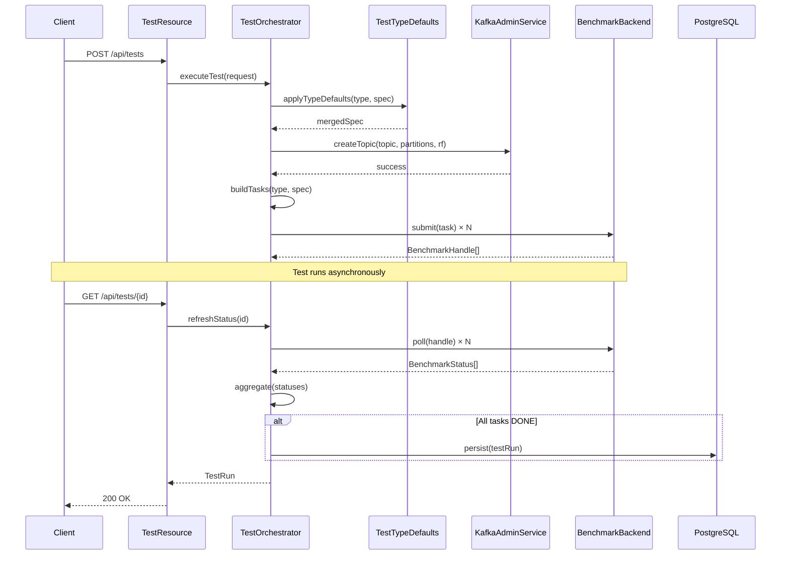
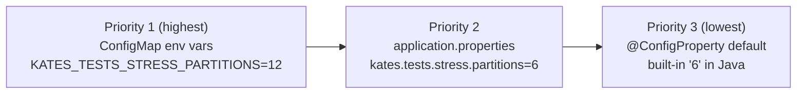
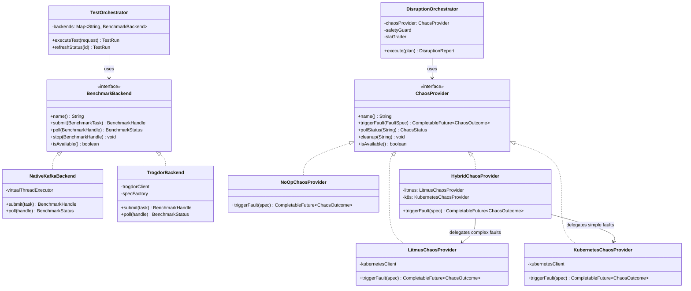
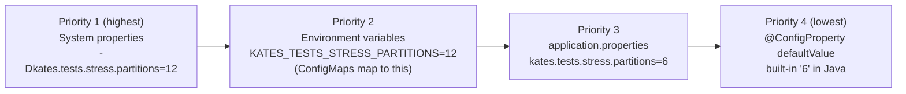

# Architecture

Software architecture is the set of decisions that are hardest to change later. The structure of the codebase, the boundaries between subsystems, the interfaces through which components communicate — these choices compound over time. A system with clear boundaries grows gracefully; a system with tangled dependencies becomes a nightmare. Kates was designed with this principle in mind.

This chapter describes the internal architecture of Kates: the package structure, the role and responsibility of every major class, the test execution lifecycle, the disruption orchestration pipeline, and — most importantly — the *why* behind each design decision. Understanding the architecture is essential for anyone who wants to extend Kates, debug test failures, or contribute new backends.

## Design Philosophy

Three core principles shaped the architecture:

**Pluggability through SPIs.** Kates uses the Service Provider Interface pattern to make every external integration swappable. The `BenchmarkBackend` SPI abstracts how benchmarks are executed (in-process or via Trogdor). The `ChaosProvider` SPI abstracts how faults are injected (Litmus CRDs, Kubernetes API, or no-op). This means you can add a new benchmark engine or a new chaos tool without touching the orchestration logic.

**Separation of concerns.** The codebase separates what happens (domain model) from how it happens (engine/chaos/disruption) from how you ask for it (API). A `TestRun` does not know whether it was submitted via REST or a scheduler. A `FaultSpec` does not know whether it will be executed by Litmus or Kubernetes. This separation makes the system testable — you can unit-test the grading algorithm without a running Kafka cluster.

**Fail-safe defaults.** Every configuration has a sensible default. Every disruption has a safety guard. Every timeout has a fallback. The system is designed so that forgetting to set a parameter results in conservative behavior, not accidental damage. This is especially critical for the chaos engineering subsystem, where a misconfiguration could take down a production-like cluster.

## Package Structure

The codebase is organized into packages that correspond directly to the major subsystems of the application. Each package has a clear boundary and a well-defined set of responsibilities. This is not an accident — the package structure is the architecture, made visible in the file system.

```
com.klster.kates
├── api/                  REST endpoints (JAX-RS resources)
│   ├── TestResource      POST/GET/DELETE /api/tests, GET /api/tests/backends
│   ├── ClusterResource   GET /api/cluster/* (brokers, topics, consumer groups)
│   ├── HealthResource    GET /api/health (backend-aware, per-type config)
│   ├── OpenApiConfig     OpenAPI metadata (title, version, description)
│   ├── ApiError          Standardized error response DTO
│   ├── PagedResponse     Paginated list wrapper for large result sets
│   ├── ConstraintViolationExceptionMapper   Bean Validation → 400 responses
│   └── GlobalExceptionMapper                Catch-all → 500 responses
│
├── config/               Configuration management
│   └── TestTypeDefaults  Per-test-type configurable defaults (CDI bean)
│
├── domain/               Core data model (shared across subsystems)
│   ├── TestType           Enum: LOAD, STRESS, SPIKE, ENDURANCE, VOLUME, CAPACITY, ROUND_TRIP
│   ├── TestSpec           Configurable test parameters (partitions, acks, throughput, etc.)
│   ├── TestResult         Task-level metrics and status
│   ├── TestRun            Lifecycle entity (spec → results, tracks backend used)
│   ├── TestScenario       Multi-phase scenario definition
│   ├── ScenarioPhase      Individual phase within a scenario
│   ├── CreateTestRequest  API request DTO (type, spec, backend)
│   ├── MetricsSample      Point-in-time metrics snapshot
│   ├── SlaDefinition      Declarative pass/fail criteria (9 thresholds)
│   ├── SlaVerdict         SLA evaluation result (grade, violations)
│   ├── SlaViolation       Individual SLA breach record
│   ├── IntegrityEvent     Data integrity verification event
│   ├── IntegrityResult    Result of message-level integrity check
│   └── LostRange          Range of lost messages in integrity verification
│
├── engine/               Pluggable execution backends for performance tests
│   ├── BenchmarkBackend   SPI interface (submit, poll, stop)
│   ├── BenchmarkTask      Backend-agnostic workload descriptor (builder pattern)
│   ├── BenchmarkHandle    Opaque task identifier returned by backends
│   ├── BenchmarkStatus    Unified task status + metrics snapshot
│   ├── BenchmarkException Common exception type for backend failures
│   ├── NativeKafkaBackend In-process execution using Kafka clients + virtual threads
│   ├── TrogdorBackend     Adapter wrapping TrogdorClient + SpecFactory
│   └── TestOrchestrator   Routes execution to backends, applies per-type defaults
│
├── trogdor/              Trogdor Coordinator integration
│   ├── TrogdorClient      REST client interface (@RegisterRestClient)
│   ├── SpecFactory        TestType → TrogdorSpec builder
│   └── spec/
│       ├── TrogdorSpec        Base class (class, startMs, durationMs)
│       ├── ProduceBenchSpec   Producer benchmark specification
│       ├── ConsumeBenchSpec   Consumer benchmark specification
│       └── RoundTripWorkloadSpec  End-to-end latency specification
│
├── chaos/                Pluggable chaos engineering backends
│   ├── ChaosProvider      SPI interface (triggerFault, pollStatus, cleanup, isAvailable)
│   ├── ChaosOutcome       Result of a chaos experiment (status, message, timing)
│   ├── ChaosStatus        Enum: NOT_FOUND, PENDING, RUNNING, COMPLETED, FAILED
│   ├── DisruptionType     Enum: 10 fault types (POD_KILL, NETWORK_PARTITION, etc.)
│   ├── FaultSpec          Fault injection configuration (target, duration, type)
│   ├── LitmusChaosProvider   ChaosEngine CRD-based fault injection via Litmus
│   ├── KubernetesChaosProvider  Direct Kubernetes API fault injection
│   ├── NoOpChaosProvider  Simulated fault injection for testing
│   ├── HybridChaosProvider    Routes to best available provider
│   ├── K8sPodWatcher      Real-time pod event monitoring during disruptions
│   └── StrimziStateTracker    Watches Strimzi Kafka CR status changes
│
├── disruption/           Disruption orchestration and intelligence
│   ├── DisruptionOrchestrator  Multi-step disruption executor
│   ├── DisruptionPlan     Multi-step disruption plan definition
│   ├── DisruptionSafetyGuard   Blast radius validation, dry-run, rollback
│   ├── DisruptionReport   Unified disruption test report
│   ├── DisruptionEventBus Event bus for disruption lifecycle events
│   ├── DisruptionPlaybookCatalog  Pre-built disruption scenarios from YAML
│   ├── DisruptionResource REST endpoints for disruption management
│   ├── DisruptionStreamResource SSE endpoint for real-time disruption events
│   ├── DisruptionScheduler    Cron-based disruption scheduling
│   ├── DisruptionScheduleEntity  JPA entity for scheduled disruptions
│   ├── DisruptionReportEntity    JPA entity for persisted reports
│   ├── DisruptionReportRepository  JPA repository for report persistence
│   ├── KafkaIntelligenceService   Leader resolution, ISR/lag tracking
│   ├── SlaGrader          A/B/C/D/F letter grading against SLA thresholds
│   ├── PrometheusMetricsCapture   Before/after Prometheus snapshot capture
│   ├── IsrSnapshot        ISR tracking data model
│   └── LagSnapshot        Consumer lag tracking data model
│
├── resilience/           End-to-end resilience testing
│   ├── ResilienceOrchestrator  Combines disruption + performance testing
│   ├── ResilienceResource REST endpoints for resilience tests
│   ├── ResilienceTestRequest  API request DTO for resilience tests
│   └── ResilienceReport   Combined performance + disruption report
│
├── export/               Result export in multiple formats
│   ├── CsvExporter        Export test results as CSV files
│   ├── JunitXmlExporter   Export test results as JUnit XML for CI integration
│   ├── HeatmapExporter    Export latency distribution as heatmap data
│   └── LatencyHeatmapData Structured heatmap payload
│
├── persistence/          Database access layer
│   ├── TestRunEntity      JPA entity for test runs
│   ├── TestRunRepository  JPA repository (Hibernate Panache)
│   └── EntityMapper       Domain ↔ entity mapping
│
├── report/               Report generation
│   └── ReportSummary      Aggregated metrics summary record
│
├── schedule/             Test scheduling
│   └── TestScheduler      Cron-based test scheduling
│
└── service/              Business logic
    ├── TestExecutionService   Legacy orchestration (Trogdor-only)
    ├── TestRunRepository      In-memory storage (being replaced by JPA)
    └── KafkaAdminService      Topic/cluster management (AdminClient)
```

## Performance Test Execution Lifecycle

The `TestOrchestrator` orchestrates the complete lifecycle of a performance test run using pluggable backends. Understanding this lifecycle is essential for debugging test failures and extending the system.



### Phase 1: Request Validation and Default Application

When a `POST /api/tests` request arrives, the `TestResource` deserializes the JSON body into a `CreateTestRequest` and passes it to the `TestOrchestrator`. The orchestrator's first action is to apply per-test-type defaults.

The `TestTypeDefaults` CDI bean provides per-test-type configuration through a three-tier resolution hierarchy:



The `applyTypeDefaults()` method merges these defaults with any user-supplied values from the API request. User-provided values always take priority over all three tiers. This means you can set sensible defaults in your ConfigMap and still override individual parameters per test run. For example, if your ConfigMap sets `KATES_TESTS_STRESS_PARTITIONS=12` but a specific API request includes `"partitions": 24`, the test will use 24 partitions.

### Phase 2: Topic Creation

Before any workload runs, the orchestrator ensures the test topic exists with the correct configuration. It calls `KafkaAdminService.createTopic()` with the partition count, replication factor, and min.insync.replicas from the merged spec. If the topic already exists, Kates checks that its configuration matches the requested parameters and logs a warning if there is a mismatch.

The topic name is either explicitly provided in the request spec or auto-generated based on the test type (e.g., `load-test`, `stress-test`).

### Phase 3: Task Building

The orchestrator builds backend-agnostic `BenchmarkTask` objects. Each `BenchmarkTask` encapsulates everything a backend needs to run a single workload: the task type (produce or consume), the topic name, throughput target, record size, batch size, and all producer/consumer configuration. The builder pattern makes it easy to construct tasks with only the required fields.

The number and configuration of tasks depends on the test type. For example:

- **LOAD** generates N producer tasks + M consumer tasks running concurrently
- **STRESS** generates 5 sequential producer tasks with escalating throughput
- **SPIKE** generates 5 tasks: 1 baseline, 3 burst, 1 recovery
- **ENDURANCE** generates 1 producer + 1 consumer for a long duration
- **VOLUME** generates 2 producer tasks (large messages and high count)
- **CAPACITY** generates 6 sequential probes with escalating throughput
- **ROUND_TRIP** generates a single round-trip workload task

### Phase 4: Backend Submission

The orchestrator resolves which backend to use. The decision follows this order:

1. If the API request explicitly specifies a `backend` field, use that backend
2. Otherwise, use the configured `kates.engine.default-backend` (default: `native`)

The orchestrator then submits each `BenchmarkTask` to the resolved backend via `backend.submit(task)`. Each submission returns a `BenchmarkHandle`—an opaque identifier that the orchestrator uses to poll for status updates. The test run transitions to `RUNNING` status.

### Phase 5: Status Polling and Aggregation

When a client issues a `GET /api/tests/{id}` request, the orchestrator calls `refreshStatus()`, which polls every `BenchmarkHandle` via `backend.poll(handle)`. Each poll returns a `BenchmarkStatus` containing:

- The current status (`PENDING`, `RUNNING`, `DONE`, `FAILED`)
- Metrics: throughput (records/sec), average latency, P50/P95/P99/max latency, records sent/consumed, and error counts

The orchestrator aggregates status across all tasks:

- If **all tasks** are `DONE` → the test run transitions to `DONE`
- If **any task** is `FAILED` → the test run transitions to `FAILED`
- Otherwise → the test run remains `RUNNING`

### Phase 6: Result Persistence

Once a test run reaches a terminal state (`DONE` or `FAILED`), the orchestrator persists the results. The `TestRun` entity—including the complete specification, all per-task results, timing information, and the backend used—is stored in the PostgreSQL database.

## Disruption Orchestration Pipeline

The disruption subsystem is a separate, parallel orchestration pipeline that handles chaos engineering. It is significantly more complex than the performance testing pipeline because it must coordinate fault injection, safety validation, real-time Kafka intelligence, Prometheus metrics capture, SLA grading, and automatic rollback.

### The DisruptionPlan Data Model

A `DisruptionPlan` is a multi-step blueprint for a disruption test. It contains:

- **name** and **description** — human-readable metadata
- **steps** — an ordered list of `DisruptionStep` records, each containing:
  - `faultSpec` — the fault to inject (type, target, duration)
  - `steadyStateSec` — seconds to wait before injecting the fault (establish baseline)
  - `observationWindowSec` — seconds to observe after the fault (measure impact)
  - `requireRecovery` — whether the step must recover within the observation window
- **sla** — an `SlaDefinition` with up to 9 threshold metrics
- **isrTrackingTopic** — which topic to monitor for ISR changes
- **lagTrackingGroupId** — which consumer group to monitor for lag
- **isrPollIntervalMs** — how often to sample ISR state (default: 2000ms)
- **lagPollIntervalMs** — how often to sample consumer lag (default: 2000ms)
- **maxAffectedBrokers** — blast radius limit (default: -1, meaning no limit)
- **autoRollback** — whether to automatically roll back faults on timeout (default: true)

### Step-by-Step Execution

For each `DisruptionStep` in the plan, the `DisruptionOrchestrator` executes the following sequence:

**1. Safety Validation** — The `DisruptionSafetyGuard` validates the step against safety constraints. It checks that the requested fault will not exceed the `maxAffectedBrokers` limit, verifies that the Kubernetes service account has the necessary RBAC permissions for the requested operations (e.g., `pods/delete` for `POD_KILL`), and ensures that the target pod actually exists. If validation fails, the step is skipped with a detailed error message.

**2. Leader Resolution** — If the `FaultSpec` targets a specific topic and partition, the `KafkaIntelligenceService` resolves the broker ID of the current partition leader via the Kafka AdminClient. This allows you to target faults precisely—for example, killing the broker that leads partition 0 of your critical topic—rather than choosing a random broker.

**3. ISR Tracking Start** — If `isrTrackingTopic` is configured, the `KafkaIntelligenceService` starts a background `IsrTracker` thread that periodically polls the AdminClient for the ISR (In-Sync Replica) set of every partition of the tracked topic. This thread runs throughout the disruption and captures ISR state transitions (shrinkage when a broker goes down, expansion when it recovers).

**4. Consumer Lag Tracking Start** — If `lagTrackingGroupId` is configured, the `KafkaIntelligenceService` starts a background `LagTracker` thread that periodically polls consumer group offsets and computes lag. This captures how consumer lag spikes during the disruption and how long it takes to recover.

**5. Steady-State Wait** — The orchestrator waits for `steadyStateSec` seconds to establish a baseline. During this period, the ISR and lag trackers are recording "normal" values that the SLA grader will compare against post-disruption values.

**6. Pre-Disruption Metrics Capture** — If Prometheus is reachable, the `PrometheusMetricsCapture` service queries Prometheus for current Kafka broker metrics (throughput, latency, error rate). This creates a "before" snapshot.

**7. Fault Injection** — The orchestrator calls `chaosProvider.triggerFault(faultSpec)` on the configured `ChaosProvider`. This is an asynchronous operation that returns a `CompletableFuture<ChaosOutcome>`. The orchestrator marks the ISR and lag trackers' disruption start time at this point.

**8. Observation Window** — The orchestrator waits for `observationWindowSec` seconds while the fault takes effect. During this period, the ISR and lag trackers continue recording state changes. If `requireRecovery` is true and the cluster does not recover within this window, the step is marked as failed.

**9. Post-Disruption Metrics Capture** — Another Prometheus query captures the "after" snapshot.

**10. Impact Delta Computation** — The orchestrator computes the difference between pre- and post-disruption metrics. For example, if pre-disruption throughput was 50,000 rec/sec and post-disruption throughput dropped to 30,000 rec/sec, the impact delta for throughput is -40%.

**11. ISR and Lag Metric Aggregation** — The ISR tracker computes time-to-full-ISR (how long it took for all partitions to return to their full replica count). The lag tracker computes time-to-lag-recovery (how long it took for consumer lag to return to baseline).

**12. Auto-Rollback** — If the step failed and `autoRollback` is enabled, the `DisruptionSafetyGuard` automatically reverses the fault. For `SCALE_DOWN` faults, it restores the deployment's replica count. For other faults, it relies on the chaos provider's cleanup mechanism.

**13. Step Report** — All of this data is packaged into a `StepReport` record: the chaos outcome, pod timeline, recovery durations, pre/post metrics, impact deltas, ISR metrics, lag metrics, and rollback status.

### Final Grading

After all steps complete, the `SlaGrader` evaluates the overall `DisruptionReport` against the plan's `SlaDefinition`. The grading algorithm works as follows:

1. For each step, check each defined SLA threshold against the step's post-disruption metrics
2. Score each check as `PASS`, `WARNING` (threshold exceeded), or `CRITICAL` (threshold exceeded by 2× or more)
3. Compute a letter grade:
   - **A** — all checks passed, no violations at all
   - **B** — fewer than 25% of checks failed, no critical violations
   - **C** — 25–50% of checks failed, no critical violations
   - **D** — more than 50% of checks failed, no critical violations
   - **F** — at least one check hit `CRITICAL` severity

The nine SLA metrics available for grading are:

| Metric | Constraint | Description |
|--------|-----------|-------------|
| P99 Latency | max | 99th percentile produce latency must not exceed threshold |
| P99.9 Latency | max | 99.9th percentile produce latency |
| Average Latency | max | Mean produce latency |
| Throughput | min | Records per second must not drop below threshold |
| Error Rate | max | Percentage of failed produce requests |
| Data Loss | max | Percentage of messages that were produced but not consumed |
| RTO (Recovery Time Objective) | max | Time for all pods to return to Ready state |
| RPO (Recovery Point Objective) | max | Maximum tolerable data loss window |
| Records Processed | min | Minimum total records that must be successfully processed |

## Key Design Decisions

### Pluggable Backends (BenchmarkBackend SPI)

The `BenchmarkBackend` interface defines a Service Provider Interface for performance test execution engines:

```java
public interface BenchmarkBackend {
    String name();
    BenchmarkHandle submit(BenchmarkTask task);
    BenchmarkStatus poll(BenchmarkHandle handle);
    void stop(BenchmarkHandle handle);
}
```

This design enables running tests without external dependencies (native backend) or with distributed load generation (Trogdor backend). Adding a new backend is straightforward: implement the interface, annotate with `@ApplicationScoped @Named("mybackend")`, and it becomes available for selection via the API or configuration.

The native backend uses virtual threads (Project Loom) so that hundreds of concurrent producer/consumer tasks can run in a single process without thread pool exhaustion. This is particularly useful for CI environments where deploying Trogdor agents is impractical.

### Pluggable Chaos Providers (ChaosProvider SPI)

The chaos engineering subsystem uses the same pluggable pattern:

```java
public interface ChaosProvider {
    String name();
    CompletableFuture<ChaosOutcome> triggerFault(FaultSpec spec);
    ChaosStatus pollStatus(String engineName);
    void cleanup(String engineName);
    boolean isAvailable();
}
```

To add a new chaos backend (e.g., Chaos Mesh, AWS FIS, Gremlin):

1. Implement `ChaosProvider`
2. Annotate with `@Named("your-backend")`
3. Set `kates.chaos.provider=your-backend` in configuration

The `HybridChaosProvider` is a meta-provider that routes faults to the best available backend. It checks each provider's `isAvailable()` method and prefers Litmus for supported experiment types, falling back to direct Kubernetes API calls for others.

### Backend-Agnostic Task Model

`BenchmarkTask` and `BenchmarkStatus` provide a unified contract that abstracts away backend-specific details. The orchestrator builds tasks once using a builder pattern, and the chosen backend translates them to its native format. The `TrogdorBackend`, for example, uses `SpecFactory` to convert `BenchmarkTask` objects into Trogdor-specific JSON specifications (`ProduceBenchSpec`, `ConsumeBenchSpec`, `RoundTripWorkloadSpec`).

### Trogdor Specs as POJOs

Rather than depending on the Trogdor library JAR (which would bring in the entire Kafka server dependency tree), Kates models Trogdor's JSON specification format using plain Java objects with Jackson annotations. This approach avoids dependency conflicts, tight coupling, and JAR size bloat. The `SpecFactory` class translates Kates' domain model into these POJOs, which are then serialized to JSON and submitted to the Trogdor Coordinator via its REST API.

### Safety-First Disruption Design

The disruption subsystem was designed with the principle that a chaos engineering tool should never cause more damage than intended. The `DisruptionSafetyGuard` is a mandatory validation layer that cannot be bypassed. Every disruption plan passes through validation before any fault is injected. The dry-run capability allows operators to preview exactly what will happen—which pods will be affected, which leaders will be targeted—before committing to the actual disruption.

Auto-rollback is enabled by default, meaning that if a fault causes the cluster to enter a state that does not recover within the observation window, Kates will automatically reverse the fault. This prevents accidental cascading failures during chaos experiments.

## SPI Class Diagram

Kates uses two main SPI (Service Provider Interface) interfaces to achieve pluggability. The class diagram below shows the relationship between these interfaces and their implementations:



### Three-Tier Configuration Resolution

All test parameters use MicroProfile Config's standard resolution order, which enables a clean separation between development defaults, deployment configuration, and per-request overrides:



ConfigMap values override `application.properties` defaults, system properties override everything. Individual API request values override all configuration tiers.

### Persistence Strategy

Test run persistence has evolved from a simple `ConcurrentHashMap` in the `TestRunRepository` (which is still used for in-flight test state) to a full JPA persistence layer backed by PostgreSQL, Hibernate ORM, and Flyway migrations. Disruption reports and scheduled disruptions are persisted using JPA entities (`DisruptionReportEntity`, `DisruptionScheduleEntity`). The `EntityMapper` handles bidirectional mapping between domain objects and JPA entities.

## Technology Stack

| Component | Version | Purpose |
|-----------|---------|---------|
| Quarkus | 3.31.3 | Cloud-native application framework |
| Java | 25 | Language runtime (virtual threads, records, sealed interfaces) |
| Kafka Clients | 4.2.0 | AdminClient for topic management, native backend workload execution |
| Hibernate ORM | (managed) | JPA persistence for test runs and disruption reports |
| Flyway | (managed) | Database schema migration management |
| PostgreSQL | (managed) | Persistent storage backend |
| Fabric8 Kubernetes Client | (managed) | Pod watching, deployment scaling, RBAC permission checks |
| Jackson | (managed) | JSON and YAML serialization/deserialization |
| MicroProfile REST Client | (managed) | Trogdor REST API integration |
| MicroProfile Config | (managed) | ConfigMap / env var / properties resolution |
| SmallRye Health | (managed) | Health check probes |
| SmallRye OpenAPI | (managed) | Swagger UI and OpenAPI spec |
| Micrometer | (managed) | Application metrics |
| OpenTelemetry | (managed) | Distributed tracing |
| JUnit 5 | (managed) | Testing framework |
| Mockito | (managed) | Mock injection for integration tests |
| REST Assured | (managed) | HTTP endpoint testing |
