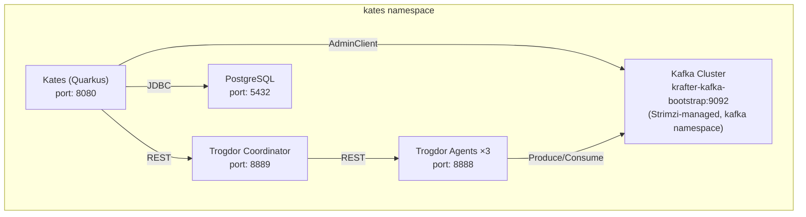

# Deployment Guide

This document explains how to deploy Kates in both local development and Kubernetes production environments. It covers every configuration option, the Kubernetes manifests, Trogdor agent setup, and the complete ConfigMap reference.

## Local Development

### Dev Mode

The fastest way to run Kates is Quarkus dev mode, which provides hot reload, Swagger UI, and automatic Dev Services (PostgreSQL provisioned automatically):

```bash
cd kates
./mvnw quarkus:dev
```

This starts Kates on `http://localhost:8080` with:

- **Hot reload** — edit any Java file and the changes take effect on the next HTTP request, without restarting the JVM
- **Swagger UI** — interactive API explorer at `/q/swagger-ui`
- **Dev Services** — Quarkus automatically starts a PostgreSQL container for test run persistence. No external database required.
- **Continuous testing** — press `r` in the terminal to run the test suite. Press `s` to toggle live test execution on every file change.

In dev mode, Kates connects to whatever Kafka bootstrap servers are configured. If no Kafka cluster is available, the native backend will fail at test execution time (not at startup), so you can still explore the API, health endpoints, and configuration without a running cluster.

### Build a JAR

```bash
./mvnw clean package -DskipTests
java -jar target/quarkus-app/quarkus-run.jar
```

This builds a Quarkus fast-jar (not an uber-jar). The application code is in `target/quarkus-app/quarkus-run.jar`, with dependencies in `target/quarkus-app/lib/`. To run the JAR, you must have a PostgreSQL instance available (configure via `QUARKUS_DATASOURCE_JDBC_URL` environment variable).

### Build a Native Executable

```bash
./mvnw clean package -Dnative -DskipTests
./target/kates-1.0.0-SNAPSHOT-runner
```

The native executable starts in milliseconds and uses a fraction of the memory compared to the JVM. This is recommended for production Kubernetes deployments where fast startup and low memory footprint matter.

## Kubernetes Deployment

### Namespace

All Kates components should be deployed in a dedicated namespace:

```bash
kubectl create namespace kates
```

### ConfigMap

The `kates-config` ConfigMap is the primary configuration mechanism for Kubernetes deployments. Every Kates configuration property can be set as an environment variable in this ConfigMap.

```yaml
apiVersion: v1
kind: ConfigMap
metadata:
  name: kates-config
  namespace: kates
data:
  KATES_KAFKA_BOOTSTRAP_SERVERS: "krafter-kafka-bootstrap.kafka.svc:9092"
  KATES_TROGDOR_COORDINATOR_URL: "http://trogdor-coordinator.kates.svc:8889"
  KATES_ENGINE_DEFAULT_BACKEND: "native"
  KATES_CHAOS_PROVIDER: "hybrid"

  KATES_TESTS_LOAD_PARTITIONS: "3"
  KATES_TESTS_LOAD_REPLICATION_FACTOR: "3"
  KATES_TESTS_LOAD_MIN_INSYNC_REPLICAS: "2"
  KATES_TESTS_LOAD_ACKS: "all"
  KATES_TESTS_LOAD_BATCH_SIZE: "65536"
  KATES_TESTS_LOAD_LINGER_MS: "5"
  KATES_TESTS_LOAD_COMPRESSION_TYPE: "lz4"
  KATES_TESTS_LOAD_RECORD_SIZE: "1024"
  KATES_TESTS_LOAD_NUM_RECORDS: "1000000"
  KATES_TESTS_LOAD_THROUGHPUT: "-1"
  KATES_TESTS_LOAD_DURATION_MS: "600000"
  KATES_TESTS_LOAD_NUM_PRODUCERS: "1"
  KATES_TESTS_LOAD_NUM_CONSUMERS: "1"

  KATES_TESTS_STRESS_PARTITIONS: "6"
  KATES_TESTS_STRESS_BATCH_SIZE: "131072"
  KATES_TESTS_STRESS_LINGER_MS: "10"
  KATES_TESTS_STRESS_NUM_PRODUCERS: "3"
  KATES_TESTS_STRESS_DURATION_MS: "900000"

  KATES_TESTS_SPIKE_ACKS: "1"
  KATES_TESTS_SPIKE_COMPRESSION_TYPE: "none"
  KATES_TESTS_SPIKE_LINGER_MS: "0"
  KATES_TESTS_SPIKE_DURATION_MS: "300000"

  KATES_TESTS_ENDURANCE_THROUGHPUT: "5000"
  KATES_TESTS_ENDURANCE_DURATION_MS: "3600000"

  KATES_TESTS_VOLUME_PARTITIONS: "6"
  KATES_TESTS_VOLUME_BATCH_SIZE: "262144"
  KATES_TESTS_VOLUME_LINGER_MS: "50"
  KATES_TESTS_VOLUME_RECORD_SIZE: "10240"

  KATES_TESTS_CAPACITY_PARTITIONS: "12"
  KATES_TESTS_CAPACITY_NUM_PRODUCERS: "5"
  KATES_TESTS_CAPACITY_DURATION_MS: "1200000"

  KATES_TESTS_ROUNDTRIP_BATCH_SIZE: "16384"
  KATES_TESTS_ROUNDTRIP_LINGER_MS: "0"
  KATES_TESTS_ROUNDTRIP_COMPRESSION_TYPE: "none"
  KATES_TESTS_ROUNDTRIP_THROUGHPUT: "10000"
```

**Configuration resolution order** — when Kates resolves a configuration value, it checks these sources in order and uses the first match:

1. **System properties** — `-Dkates.tests.stress.partitions=12` (highest priority)
2. **Environment variables** — `KATES_TESTS_STRESS_PARTITIONS=12` (ConfigMap maps to this)
3. **application.properties** — `kates.tests.stress.partitions=6`
4. **@ConfigProperty default** — built-in Java default (lowest priority)

API request values always override all four sources. This means you can set conservative defaults in the ConfigMap and allow users to request more aggressive parameters per test run.

### Kates Deployment

```yaml
apiVersion: apps/v1
kind: Deployment
metadata:
  name: kates
  namespace: kates
  labels:
    app: kates
spec:
  replicas: 1
  selector:
    matchLabels:
      app: kates
  template:
    metadata:
      labels:
        app: kates
    spec:
      serviceAccountName: kates-sa
      containers:
        - name: kates
          image: your-registry/kates:latest
          ports:
            - containerPort: 8080
              name: http
          envFrom:
            - configMapRef:
                name: kates-config
          env:
            - name: QUARKUS_DATASOURCE_JDBC_URL
              value: "jdbc:postgresql://postgres.kates.svc:5432/kates"
            - name: QUARKUS_DATASOURCE_USERNAME
              valueFrom:
                secretKeyRef:
                  name: kates-db-secret
                  key: username
            - name: QUARKUS_DATASOURCE_PASSWORD
              valueFrom:
                secretKeyRef:
                  name: kates-db-secret
                  key: password
          readinessProbe:
            httpGet:
              path: /q/health/ready
              port: 8080
            initialDelaySeconds: 5
            periodSeconds: 10
          livenessProbe:
            httpGet:
              path: /q/health/live
              port: 8080
            initialDelaySeconds: 10
            periodSeconds: 30
          resources:
            requests:
              memory: "256Mi"
              cpu: "250m"
            limits:
              memory: "512Mi"
              cpu: "1000m"
```

Key things to note:

- **serviceAccountName** — Kates needs a service account with permissions to interact with the Kafka cluster (for AdminClient operations) and the Kubernetes API (for pod watching, deployment scaling, and RBAC checks during disruption tests). See the RBAC section below.
- **envFrom** — loads all ConfigMap entries as environment variables
- **Database credentials** — stored in a Kubernetes Secret, not the ConfigMap
- **Health probes** — use the Quarkus built-in health endpoints. The readiness probe checks Kafka connectivity via `KafkaAdminService`.
- **Resource limits** — Kates is lightweight for API operations, but the native backend spawns virtual threads for test execution. Set CPU/memory limits based on the maximum expected concurrency.

### Kates Service

```yaml
apiVersion: v1
kind: Service
metadata:
  name: kates
  namespace: kates
spec:
  selector:
    app: kates
  ports:
    - port: 8080
      targetPort: 8080
      name: http
  type: ClusterIP
```

### RBAC for Disruption Testing

If you plan to use disruption testing, the Kates service account needs additional Kubernetes RBAC permissions. The `DisruptionSafetyGuard` checks these permissions before executing any disruption plan and rejects plans that require permissions not granted to the service account.

```yaml
apiVersion: v1
kind: ServiceAccount
metadata:
  name: kates-sa
  namespace: kates

---
apiVersion: rbac.authorization.k8s.io/v1
kind: ClusterRole
metadata:
  name: kates-disruption-role
rules:
  - apiGroups: [""]
    resources: ["pods"]
    verbs: ["get", "list", "watch", "delete"]
  - apiGroups: [""]
    resources: ["pods/log"]
    verbs: ["get"]
  - apiGroups: ["apps"]
    resources: ["deployments", "statefulsets"]
    verbs: ["get", "list", "patch"]
  - apiGroups: ["apps"]
    resources: ["deployments/scale", "statefulsets/scale"]
    verbs: ["get", "patch"]
  - apiGroups: ["litmuschaos.io"]
    resources: ["chaosengines", "chaosresults", "chaosexperiments"]
    verbs: ["get", "list", "create", "delete", "watch"]
  - apiGroups: [""]
    resources: ["events"]
    verbs: ["get", "list", "watch"]

---
apiVersion: rbac.authorization.k8s.io/v1
kind: ClusterRoleBinding
metadata:
  name: kates-disruption-binding
subjects:
  - kind: ServiceAccount
    name: kates-sa
    namespace: kates
roleRef:
  kind: ClusterRole
  name: kates-disruption-role
  apiGroup: rbac.authorization.k8s.io
```

The permissions break down as follows:

| Permission | Used By | Purpose |
|-----------|---------|---------|
| `pods/get,list,watch,delete` | `K8sPodWatcher`, `KubernetesChaosProvider` | Watch pod events during disruptions, kill pods for `POD_KILL`/`POD_DELETE` |
| `pods/log` | `DisruptionOrchestrator` | Capture pod logs for post-mortem analysis |
| `deployments,statefulsets/get,list,patch` | `KubernetesChaosProvider` | Scale deployments for `SCALE_DOWN`, restart for `ROLLING_RESTART` |
| `deployments/scale,statefulsets/scale` | `DisruptionSafetyGuard` | Read current replica count for auto-rollback |
| `chaosengines,chaosresults,chaosexperiments` | `LitmusChaosProvider` | Create and manage Litmus chaos experiments |
| `events/get,list,watch` | `DisruptionEventBus` | Watch Kubernetes events for disruption correlation |

If you are only using performance testing (not disruption testing), you do not need these RBAC permissions. A minimal service account with no cluster-level permissions is sufficient.

### Trogdor Coordinator Deployment

The Trogdor backend requires a running Trogdor Coordinator and at least one Trogdor Agent. These are components of the Apache Kafka project that run as separate JVM processes.

```yaml
apiVersion: apps/v1
kind: Deployment
metadata:
  name: trogdor-coordinator
  namespace: kates
spec:
  replicas: 1
  selector:
    matchLabels:
      app: trogdor-coordinator
  template:
    metadata:
      labels:
        app: trogdor-coordinator
    spec:
      containers:
        - name: coordinator
          image: apache/kafka:4.2.0
          command: ["/opt/kafka/bin/trogdor.sh", "coordinator"]
          args: ["--node.name", "coordinator", "--config", "/etc/trogdor/trogdor.conf"]
          ports:
            - containerPort: 8889
          volumeMounts:
            - name: trogdor-config
              mountPath: /etc/trogdor
      volumes:
        - name: trogdor-config
          configMap:
            name: trogdor-config

---
apiVersion: v1
kind: Service
metadata:
  name: trogdor-coordinator
  namespace: kates
spec:
  selector:
    app: trogdor-coordinator
  ports:
    - port: 8889
      targetPort: 8889
```

### Trogdor Agent Deployment

Trogdor Agents are the workers that execute the actual Kafka workloads. You need at least one agent, but for distributed load generation, deploy multiple agents:

```yaml
apiVersion: apps/v1
kind: Deployment
metadata:
  name: trogdor-agent
  namespace: kates
spec:
  replicas: 3
  selector:
    matchLabels:
      app: trogdor-agent
  template:
    metadata:
      labels:
        app: trogdor-agent
    spec:
      containers:
        - name: agent
          image: apache/kafka:4.2.0
          command: ["/opt/kafka/bin/trogdor.sh", "agent"]
          args: ["--node.name", "agent", "--config", "/etc/trogdor/trogdor.conf"]
          ports:
            - containerPort: 8888
          volumeMounts:
            - name: trogdor-config
              mountPath: /etc/trogdor
      volumes:
        - name: trogdor-config
          configMap:
            name: trogdor-config
```

### Trogdor Configuration

The `trogdor.conf` file configures the coordinator and agents:

```json
{
  "platform": "org.apache.kafka.trogdor.basic.BasicPlatform",
  "nodes": {
    "coordinator": {
      "hostname": "trogdor-coordinator.kates.svc",
      "tpiPort": 8889,
      "agentPort": 8888
    },
    "agent0": {
      "hostname": "trogdor-agent-0.kates.svc",
      "tpiPort": 8889,
      "agentPort": 8888
    },
    "agent1": {
      "hostname": "trogdor-agent-1.kates.svc",
      "tpiPort": 8889,
      "agentPort": 8888
    },
    "agent2": {
      "hostname": "trogdor-agent-2.kates.svc",
      "tpiPort": 8889,
      "agentPort": 8888
    }
  }
}
```

### PostgreSQL

Kates requires a PostgreSQL instance for persisting test runs and disruption reports. Flyway handles schema migrations automatically on startup.

For production, use a managed PostgreSQL service (Amazon RDS, Google Cloud SQL, Azure Database for PostgreSQL) or the Bitnami PostgreSQL Helm chart:

```bash
helm install postgres bitnami/postgresql \
  --namespace kates \
  --set auth.username=kates \
  --set auth.password=kates \
  --set auth.database=kates
```

For development, Quarkus Dev Services automatically starts a PostgreSQL container — no manual setup needed.

### Architecture Diagram for Kubernetes



## Updating Configuration at Runtime

To change test defaults or Kates configuration while the service is running:

```bash
kubectl edit configmap kates-config -n kates
kubectl rollout restart deployment/kates -n kates
```

The ConfigMap change takes effect after the pod restarts. Verify the new configuration via the health endpoint:

```bash
kubectl exec -it deployment/kates -n kates -- \
  curl -s localhost:8080/api/health | jq '.tests.stress'
```

This shows the effective per-type configuration for stress tests, reflecting any changes from the ConfigMap.

## Building the Container Image

### JVM Image

```dockerfile
FROM registry.access.redhat.com/ubi8/openjdk-25:latest
ENV LANGUAGE='en_US:en'
COPY --chown=185 target/quarkus-app/lib/ /deployments/lib/
COPY --chown=185 target/quarkus-app/*.jar /deployments/
COPY --chown=185 target/quarkus-app/app/ /deployments/app/
COPY --chown=185 target/quarkus-app/quarkus/ /deployments/quarkus/
EXPOSE 8080
ENV JAVA_OPTS_APPEND="-Dquarkus.http.host=0.0.0.0 -Djava.util.logging.manager=org.jboss.logmanager.LogManager"
ENV JAVA_APP_JAR="/deployments/quarkus-run.jar"
ENTRYPOINT [ "/opt/jboss/container/java/run/run-java.sh" ]
```

### Native Image

```dockerfile
FROM quay.io/quarkus/quarkus-micro-image:2.0
WORKDIR /work/
COPY target/*-runner /work/application
RUN chmod 775 /work/application
EXPOSE 8080
CMD ["./application", "-Dquarkus.http.host=0.0.0.0"]
```

Build and push:

```bash
./mvnw clean package -DskipTests
docker build -f src/main/docker/Dockerfile.jvm -t your-registry/kates:latest .
docker push your-registry/kates:latest
```
