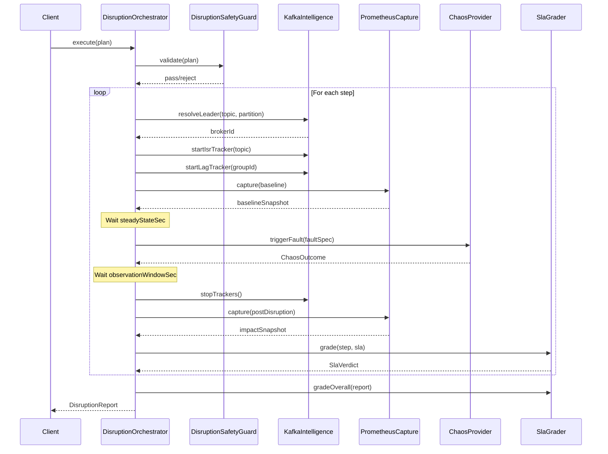
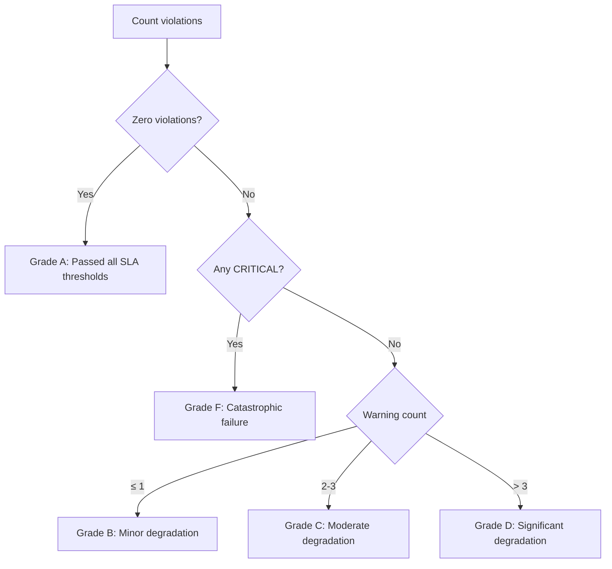
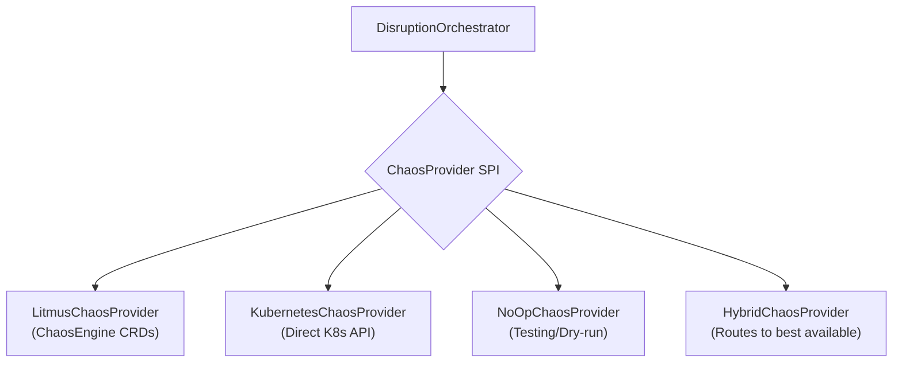

# Disruption & Chaos Engineering Guide

Distributed systems fail. They fail in ways that are surprising, cascading, and often invisible until the worst possible moment. A broker runs out of disk space at 3 AM. A network switch flaps during a deploy. A Kubernetes node gets OOM-killed and takes two Kafka brokers with it. These are not hypothetical scenarios — they are Tuesday afternoon in any organization running Kafka at scale.

The question is not whether your cluster will experience a failure. The question is whether you will discover that failure in production, during a customer-facing outage, or in a controlled experiment that you designed and ran on your own terms. That is the fundamental promise of chaos engineering: trading surprise for preparation.

This chapter is a deep-dive into Kates' disruption testing subsystem — the engine that lets you design, execute, and evaluate chaos experiments against your Kafka cluster. By the end of this chapter, you will understand not just *how* to run a disruption test, but *why* each capability exists, what it reveals about your system, and how to interpret the results.

## The Theory Behind Chaos Engineering

Chaos engineering did not emerge from nowhere. It was born at Netflix in 2010 when the engineering team realized that their migration to AWS had introduced a category of failure that traditional testing could not catch. Unit tests verify that code works. Integration tests verify that components work together. But no amount of deterministic testing can answer the question: "What happens when an entire availability zone goes dark?"

The discipline is formalized in the [Principles of Chaos Engineering](https://principlesofchaos.org/), which describe a four-step scientific method:

1. **Define steady state** — establish measurable indicators of normal system behavior (throughput, latency, error rate)
2. **Hypothesize** — form a prediction about what will happen under failure ("If we kill one broker, throughput should recover within 30 seconds")
3. **Inject a real-world fault** — simulate the failure in a controlled way
4. **Measure the difference** — compare steady-state behavior before and after the fault to validate or invalidate the hypothesis

This is science, not destruction. You are not "breaking things." You are running experiments to build confidence in your system's ability to withstand turbulent conditions. The distinction matters because it changes how you approach the practice: with rigor, safety controls, and a clear experimental design.

### Why Kafka Needs Chaos Engineering

Kafka presents a particularly rich target for chaos engineering because it is a distributed commit log with strong durability and ordering guarantees. Those guarantees depend on a complex interplay of mechanisms:

**Replication and ISR.** Kafka replicates each partition across multiple brokers. The set of replicas that are fully caught up with the leader is called the ISR (In-Sync Replica) set. When a broker fails, the ISR shrinks. When it recovers, the ISR must expand back. The time this takes — and whether it happens at all — determines whether your cluster is truly resilient or merely configured to look resilient.

**Leader Election.** Every partition has a single leader broker that handles all reads and writes. When the leader fails, Kafka must elect a new leader from the ISR. This election takes time — typically a few seconds — during which producers may see errors and consumers may stall. The critical question is: how does your application handle this gap? Does it retry? Does it buffer? Does it drop messages?

**Consumer Group Rebalancing.** When a broker hosting partition leaders fails, consumer groups must rebalance — reassigning partitions to surviving consumers. This process has evolved significantly across Kafka versions (eager vs. cooperative rebalancing), and its behavior under failure directly impacts your end-to-end latency and message ordering guarantees.

**Durability vs. Availability.** The `acks=all` and `min.insync.replicas` settings create a tradeoff between durability and availability. With `acks=all` and `min.insync.replicas=2` on a 3-broker cluster, losing one broker means you can still write (2 replicas in sync ≥ min.insync.replicas). But losing two brokers means writes are rejected — you have chosen durability over availability. Chaos engineering lets you validate that this tradeoff behaves as expected in practice, not just in theory.

These mechanisms interact in ways that are difficult to reason about statically. You can read the Kafka documentation and configure your cluster according to best practices, but the only way to truly know whether your configuration survives a broker failure is to kill a broker and watch what happens. That is what Kates' disruption subsystem is for.

## Disruption Types

Kates supports ten backend-agnostic disruption types, each modeling a specific class of infrastructure failure. Understanding what each type simulates — and what it reveals — is essential for designing meaningful experiments.

### POD_KILL — Unclean Broker Termination

This is the simplest and most dramatic disruption: Kates sends a `SIGKILL` to a broker pod, terminating it immediately without giving it a chance to flush logs, close sockets, or deregister from the controller. This simulates a hard crash — a power failure, a kernel panic, or an OOM kill.

When a broker is killed this way, several things happen in rapid succession. The controller detects that the broker's session has expired (after the configured `broker.session.timeout.ms`, typically 10 seconds). It then initiates leader election for all partitions that had their leader on the killed broker. The ISR shrinks as the dead broker is removed from the replica set. Producers that were mid-request to the killed broker will receive errors or timeouts. Consumers will lose their partition assignments and trigger a rebalance.

The recovery path depends on Kubernetes — the StatefulSet controller will restart the pod, the broker will rejoin the cluster, and the ISR will gradually expand as the broker catches up on missed data by fetching from the current leaders.

**What this tells you:**
- How long does leader election take?
- How does your producer handle transient errors during the election gap?
- How quickly does the ISR recover after the broker restarts?
- Is your `min.insync.replicas` setting correct for surviving a single-broker failure?

### POD_DELETE — Graceful Broker Shutdown

Unlike `POD_KILL`, a `POD_DELETE` sends a `SIGTERM` signal and respects the pod's `terminationGracePeriodSeconds`. This gives the broker time to flush its log segments, close client connections gracefully, and transfer leadership to other brokers before shutting down.

Kafka has a feature called "controlled shutdown" that is specifically designed for this scenario. When a broker receives a shutdown signal, it tells the controller to transfer leadership of all its partitions to other brokers *before* it actually shuts down. If controlled shutdown works correctly, there should be zero downtime — clients experience a brief metadata refresh but no errors.

**What this tells you:**
- Is controlled shutdown working correctly?
- Does leadership transfer happen before the broker goes down, or after?
- How does the experience differ from a hard crash (`POD_KILL`)?

The difference between `POD_KILL` and `POD_DELETE` is the difference between "your server room lost power" and "you are doing planned maintenance." Both are important to test, but they exercise different code paths and produce very different results.

### NETWORK_PARTITION — Split Brain Scenarios

A network partition is the most insidious failure mode in distributed systems. The broker is still running — it still has all its data, its processes are healthy, its disk is fine — but it cannot communicate with the rest of the cluster. From the partitioned broker's perspective, the rest of the cluster has disappeared. From the cluster's perspective, the partitioned broker has disappeared. Both sides continue operating independently, which is exactly the definition of a split brain.

Kates implements network partitions by creating firewall rules (via Litmus ChaosEngine CRDs) that drop all traffic to and from the target pod. This means the partitioned broker can still receive Kubernetes health probes (if configured separately), but cannot communicate with other brokers or clients.

The consequences of a network partition depend on which broker is partitioned:

- **Leader partition:** If the partitioned broker holds partition leaders, those leaders become unreachable. The controller will eventually elect new leaders from the remaining ISR members. But there is a window where the partitioned broker still thinks it is the leader and may accept writes that will be lost when the partition heals.
- **Controller partition:** If the KRaft controller is partitioned, the cluster loses its ability to perform metadata operations (topic creation, leader election, config changes) until a new controller is elected.
- **Follower partition:** If a follower broker is partitioned, the impact is minimal — it falls out of the ISR, but the leader continues serving reads and writes normally.

**What this tells you:**
- How long does the cluster take to detect the partition?
- Does the partitioned broker's leadership get revoked quickly enough?
- Do your producers and consumers reconnect to the new leaders?
- Is there any data loss when the partition heals?

### NETWORK_LATENCY — Degraded Network Conditions

Not all network failures are binary (connected vs. disconnected). In practice, the most common network issues are latency spikes — a switch is overloaded, a cloud region is experiencing congestion, a cross-AZ link is saturated. These cause a more subtle form of degradation where everything still "works" but is painfully slow.

Kates injects network latency by adding a configurable delay (default 100ms) to all packets on the target pod's network interface using Linux traffic control (`tc qdisc`). This means every packet — including Kafka replication traffic, client connections, and heartbeats — is delayed.

The effects are surprisingly far-reaching. A 100ms delay on replication traffic means followers fall further behind the leader, potentially falling out of the ISR if the delay persists longer than `replica.lag.time.max.ms`. A 100ms delay on producer connections means every produce request takes at least 100ms longer, which compounds with `linger.ms` settings and can dramatically reduce throughput. A 100ms delay on group coordinator heartbeats can cause consumer session timeouts if the delay pushes heartbeat latency beyond `session.timeout.ms`.

**What this tells you:**
- At what latency threshold does your cluster start degrading?
- Do your timeout settings (`request.timeout.ms`, `session.timeout.ms`) have enough margin for latency spikes?
- Does ISR shrinkage occur, and if so, how quickly does it recover when latency returns to normal?

### CPU_STRESS — Resource Exhaustion

CPU stress tests what happens when a broker's CPU is saturated — typically due to a noisy neighbor, a burst of compression/decompression work, or a garbage collection storm. Kates uses the Linux `stress-ng` tool to consume a configurable number of CPU cores on the target pod.

When a broker's CPU is saturated, several things degrade simultaneously. Log segment compaction slows down or stalls. Producer and fetch requests queue up behind the CPU bottleneck. JVM garbage collection pauses may increase as the GC threads compete for CPU time. Replication from the leader may slow enough to cause ISR shrinkage.

**What this tells you:**
- How does CPU contention affect request latency?
- Does ISR shrinkage occur under CPU pressure?
- How quickly does the broker recover when CPU pressure is relieved?

### DISK_FILL — Storage Exhaustion

Disk fill simulates the scenario where a broker's log directory runs out of space. This happens more often than you might expect — a topic with unexpected volume, a misconfigured retention policy, or a log compaction topic that grows without bound.

Kates fills the broker's log directory to a configurable percentage (default 80%) using large temporary files. When the disk is nearly full, the broker will start refusing writes (producers receive `DISK_FULL` errors). Depending on your configuration, log cleanup and compaction may free space, or the broker may need manual intervention.

**What this tells you:**
- At what fill level does the broker start refusing writes?
- Do your disk usage alerts fire before the broker becomes unavailable?
- Does log retention policy actually free space under pressure?

### ROLLING_RESTART, LEADER_ELECTION, SCALE_DOWN, NODE_DRAIN

The remaining four disruption types round out the toolkit:

**ROLLING_RESTART** triggers a graceful rolling restart of the Kafka StatefulSet by annotating the pod template. Kubernetes rolls each pod one at a time, waiting for readiness before proceeding. This tests your zero-downtime maintenance posture — does a routine restart cause any client-visible errors?

**LEADER_ELECTION** forces a preferred leader election for a specific partition, simulating what happens during partition reassignment or after a broker restart. This tests whether your consumers handle the briefly unavailable partition gracefully.

**SCALE_DOWN** reduces the replica count of the Kafka StatefulSet. This is a more extreme version of killing a broker — the pod is not just restarted, it is permanently removed (until you scale back up). This tests your cluster's behavior when it permanently loses capacity.

**NODE_DRAIN** drains an entire Kubernetes node, evicting all pods including potentially multiple brokers. This simulates an availability zone failure and tests whether your cluster survives losing multiple brokers simultaneously.

## FaultSpec: The Language of Disruption

Every disruption in Kates is described by a `FaultSpec` — a declarative record that captures *what* to disrupt, *where* to do it, and *how long* it should last. Think of it as the hypothesis statement of your chaos experiment, encoded in a machine-readable format.

The `FaultSpec` is deliberately backend-agnostic. Whether you are using Litmus ChaosEngine CRDs, direct Kubernetes API calls, or the NoOp provider for testing, the same `FaultSpec` describes the same experiment. The `ChaosProvider` implementation is responsible for translating it into the appropriate actions.

| Field | Type | Default | Purpose |
|-------|------|---------|---------|
| `experimentName` | `String` | (required) | Unique name for tracking and reporting |
| `disruptionType` | `DisruptionType` | — | Which of the 10 fault types to inject |
| `targetNamespace` | `String` | `"kafka"` | Kubernetes namespace containing the target pods |
| `targetLabel` | `String` | `"strimzi.io/component-type=kafka"` | Label selector to identify target pods |
| `targetPod` | `String` | `""` | Specific pod name (overrides label selector) |
| `targetBrokerId` | `int` | `-1` | Kafka broker ID to target |
| `targetTopic` | `String` | `""` | Topic for leader-aware targeting |
| `targetPartition` | `int` | `0` | Partition for leader-aware targeting |
| `chaosDurationSec` | `int` | `30` | How long the fault persists |
| `delayBeforeSec` | `int` | `0` | Delay before injecting the fault |
| `gracePeriodSec` | `int` | `30` | Grace period for pod termination |
| `networkLatencyMs` | `int` | `100` | Delay in milliseconds (NETWORK_LATENCY only) |
| `fillPercentage` | `int` | `80` | Disk fill target (DISK_FILL only) |
| `cpuCores` | `int` | `1` | CPU cores to stress (CPU_STRESS only) |
| `envOverrides` | `Map<String,String>` | `{}` | Additional env vars for the chaos engine |

### Leader-Aware Targeting: The Killer Feature

Most chaos engineering tools operate at the infrastructure level — they kill pods, partition networks, or stress CPUs. But they do not understand *what* is running inside those pods. You tell them "kill pod X" and they kill pod X. If you want to kill the leader of a specific Kafka partition, you first need to figure out which pod hosts that leader, which means querying the Kafka AdminClient, parsing the response, and building the right pod name. This is tedious, error-prone, and defeats the purpose of automation.

Kates solves this with leader-aware targeting. When you set `targetTopic` and `targetPartition` in your `FaultSpec`, the `KafkaIntelligenceService` automatically resolves the current leader broker ID by calling `AdminClient.describeTopics()`, then maps that broker ID to the corresponding Kubernetes pod name using the Strimzi naming convention (`{cluster-name}-kafka-{brokerId}`).

This means you can write experiments like "kill the leader of the `orders` topic, partition 0" without knowing — or caring — which broker that is:

```json
{
  "experimentName": "kill-orders-leader",
  "disruptionType": "POD_KILL",
  "targetTopic": "orders",
  "targetPartition": 0,
  "chaosDurationSec": 0,
  "gracePeriodSec": 0
}
```

This is critical for experiments that are meant to be repeatable. If you hardcode a broker ID, your experiment breaks the moment leadership moves. With leader-aware targeting, the experiment always hits the right broker, regardless of the current cluster state.

## Disruption Plans: Designing Multi-Step Experiments

A single fault injection is useful, but real-world failures are often compound events. A broker crashes, the ISR recovers, and then a second broker crashes before the first one finishes catching up. A network partition isolates the controller, and while the cluster is struggling to elect a new one, a disk fills up on a follower. These cascading failures are exactly what you need to test, and they require multi-step disruption plans.

A `DisruptionPlan` is a sequence of `DisruptionStep` objects, each describing a single fault injection along with its observation parameters. The orchestrator executes each step in order, collecting metrics and grading results as it goes.

### Anatomy of a Plan

```json
{
  "name": "cascading-broker-failure",
  "description": "Test cluster resilience to losing two brokers in sequence",
  "maxAffectedBrokers": 2,
  "autoRollback": true,
  "isrTrackingTopic": "orders",
  "lagTrackingGroupId": "order-processor",
  "sla": {
    "maxP99LatencyMs": 200.0,
    "minThroughputRecPerSec": 5000.0,
    "maxRtoMs": 60000,
    "maxDataLossPercent": 0.0
  },
  "steps": [
    {
      "name": "kill-first-broker",
      "steadyStateSec": 30,
      "observationWindowSec": 120,
      "requireRecovery": true,
      "faultSpec": {
        "experimentName": "kill-broker-1",
        "disruptionType": "POD_KILL",
        "targetTopic": "orders",
        "targetPartition": 0,
        "gracePeriodSec": 0
      }
    },
    {
      "name": "kill-second-broker",
      "steadyStateSec": 10,
      "observationWindowSec": 180,
      "requireRecovery": true,
      "faultSpec": {
        "experimentName": "kill-broker-2",
        "disruptionType": "POD_KILL",
        "targetTopic": "orders",
        "targetPartition": 1,
        "gracePeriodSec": 0
      }
    }
  ]
}
```

There are important design decisions embedded in this plan. The `steadyStateSec: 10` on the second step means we only wait 10 seconds after the first broker recovers before killing the second one — putting the cluster under maximum pressure. The `observationWindowSec: 180` on the second step is longer because recovering from two simultaneous broker failures takes more time. And the `maxAffectedBrokers: 2` tells the safety guard that we intentionally want to affect two brokers.

## The 13-Step Execution Pipeline

When you submit a disruption plan, the `DisruptionOrchestrator` orchestrates each step through a carefully designed 13-step pipeline. Understanding this pipeline helps you interpret the results and troubleshoot issues.



Let's walk through each step and understand not just *what* it does, but *why* it matters:

**Step 1: Safety Validation.** Before touching anything, the `DisruptionSafetyGuard` evaluates the entire plan. It checks the blast radius (are you affecting more brokers than intended?), verifies RBAC permissions (can Kates actually delete pods?), and validates that the target pods exist. If any check fails, the plan is rejected before any fault is injected. This is not optional — it is a hard gate that cannot be bypassed, because a chaos engineering tool that causes uncontrolled damage is worse than useless.

**Step 2: Leader Resolution.** The `KafkaIntelligenceService` queries the Kafka AdminClient to find out which broker currently holds leadership for the target partition. This is done per-step because leadership can change between steps — especially if a previous step killed the leader.

**Steps 3-4: Tracker Initialization.** Two background threads start polling the Kafka AdminClient every 2 seconds: one tracking the ISR set for the monitored topic, and one tracking consumer lag for the monitored consumer group. These trackers are the eyes of the experiment — they record exactly what happens at the Kafka level during the disruption.

**Step 5: Baseline Metrics Capture.** If Prometheus is available, the `PrometheusMetricsCapture` service queries 10 Kafka broker metrics (throughput, latency, under-replicated partitions, ISR shrink rate, etc.) to establish the pre-disruption baseline. This snapshot is essential for computing impact deltas later.

**Step 6: Steady-State Wait.** The orchestrator pauses for the configured `steadyStateSec` duration. This wait ensures that the trackers have collected enough baseline data to establish what "normal" looks like. Without this baseline, you cannot distinguish between a disruption-caused ISR shrink and one that was already in progress.

**Step 7: Fault Injection.** The `ChaosProvider.triggerFault()` method actually injects the fault — creating a Litmus ChaosEngine CRD, deleting a pod via the Kubernetes API, or whatever the provider implements. This call returns a `CompletableFuture<ChaosOutcome>` that resolves when the fault has been applied.

**Step 8: Fault Completion Wait.** The orchestrator waits for the fault to complete (for duration-based faults like `NETWORK_PARTITION`) or for Kubernetes to restart the pod (for instant faults like `POD_KILL`). There is a timeout (fault duration + 60 seconds) to prevent the orchestrator from hanging if the chaos provider misbehaves.

**Step 9: Observation Window.** This is where the science happens. The orchestrator waits for the configured `observationWindowSec`, during which the ISR and lag trackers continue recording. This window captures the recovery behavior — how long until the ISR recovers, how long until consumer lag drops back to normal, whether the cluster stabilizes or continues degrading.

**Steps 10-11: Data Collection.** The trackers are stopped and their collected timelines are attached to the step report. A second Prometheus snapshot is captured for post-disruption comparison.

**Step 12: SLA Grading.** The `SlaGrader` evaluates the step results against the SLA definition and produces a letter grade with detailed violation reports.

**Step 13: Auto-Rollback.** If the step failed and `autoRollback` is enabled, the orchestrator reverses the fault. For pod-level faults, this is typically a no-op (Kubernetes restarts the pod automatically). For infrastructure-level faults (network partition, CPU stress), the provider actively removes the injected fault.

## Kafka Intelligence: Understanding What You Are Testing

One of the things that distinguishes Kates from general-purpose chaos tools is its deep integration with Kafka's internal state. The `KafkaIntelligenceService` provides three forms of Kafka-specific intelligence that transform raw infrastructure disruptions into meaningful Kafka experiments.

### ISR Tracking: The Heartbeat of Replication

The ISR (In-Sync Replica) set is Kafka's mechanism for tracking which replicas are fully caught up with the leader. It is the single most important indicator of replication health. A healthy cluster has all replicas in the ISR at all times. When a broker fails, the ISR shrinks. When the broker recovers, the ISR expands.

Kates tracks the ISR set by polling `AdminClient.describeTopics()` every 2 seconds during a disruption. This produces a timeline of ISR membership changes:

```
t=0s    ISR: [0, 1, 2]  ← baseline, all replicas in sync
t=12s   ISR: [0, 2]     ← broker 1 fell out (killed at t=2s)
t=45s   ISR: [0, 1, 2]  ← broker 1 recovered and rejoined
```

From this timeline, Kates extracts three key metrics:

- **Time-to-ISR-Shrink:** How long after the fault injection until the ISR actually shrinks (12 seconds in this example). This reflects the `replica.lag.time.max.ms` setting — the controller only removes a lagging replica after this timeout.
- **Time-to-ISR-Expand:** How long from the ISR shrink event until the ISR is fully restored (33 seconds in this example). This depends on the broker restart time plus the time to replicate all missed messages.
- **ISR Stability:** Whether the ISR oscillated (shrank and expanded multiple times) or recovered cleanly in a single transition. Oscillation suggests the broker is struggling to stay caught up.

### Consumer Lag Monitoring: The User-Facing Impact

ISR tracking tells you about replication health, but it does not tell you what your end users experience. For that, you need consumer lag monitoring. Consumer lag is the number of messages that have been produced but not yet consumed — the gap between the latest produced offset and the latest committed consumer offset.

During a disruption, consumer lag typically spikes because consumers are unable to fetch from the disrupted partition, or because a rebalance pauses consumption while partitions are reassigned. Kates tracks this by polling `AdminClient.listConsumerGroupOffsets()` every 2 seconds:

```
t=0s    Lag: 50 records  ← baseline
t=15s   Lag: 8,500 records  ← consumption stalled during leader election
t=45s   Lag: 2,100 records  ← consumers catching up after recovery
t=90s   Lag: 50 records  ← fully recovered
```

**Peak lag** (8,500 records in this example) tells you the worst-case backlog your consumers experienced. **Time-to-lag-recovery** (90 seconds) tells you how long your downstream systems were processing stale data. These are the numbers that matter to your business — they translate directly to "how late were our order confirmations" or "how stale was the dashboard."

## Safety Guardrails: Chaos Without Catastrophe

The most important feature of any chaos engineering tool is not what it can break — it is what it *prevents* you from breaking. Kates implements multiple layers of safety controls that ensure your experiments stay within their intended scope.

### Blast Radius Validation

Every disruption plan declares a `maxAffectedBrokers` value. Before executing the plan, the `DisruptionSafetyGuard` counts how many pods match the label selector across all steps and rejects the plan if the total exceeds the limit.

This prevents a common mistake: using a broad label selector like `strimzi.io/component-type=kafka` (which matches all brokers) when you only intended to affect one. Without blast radius validation, a typo in a label selector could take down your entire cluster.

### RBAC Permission Verification

Before executing any plan, the safety guard calls the Kubernetes `SelfSubjectAccessReview` API to verify that Kates' service account has every permission needed for the planned disruption. This means you find out about missing permissions *before* the first fault is injected, not halfway through a multi-step plan.

### Dry-Run Mode

Every disruption endpoint supports a `?dryRun=true` query parameter. In dry-run mode, the full validation pipeline executes — blast radius check, RBAC verification, leader resolution, target pod identification — but no faults are injected. This lets you preview exactly what would happen:

```bash
curl -X POST http://localhost:8080/api/disruptions?dryRun=true \
  -H 'Content-Type: application/json' \
  -d @my-plan.json | jq
```

Always run a dry-run before executing a new disruption plan for the first time. It costs nothing and prevents surprises.

### Auto-Rollback

When `autoRollback` is enabled (the default), faults are automatically reversed if the step exceeds its observation window without recovery, if the chaos provider returns a `FAILED` status, or if an unexpected exception occurs. For infrastructure-level faults like `NETWORK_PARTITION` and `CPU_STRESS`, rollback actively removes the injected fault. For pod-level faults, Kubernetes handles the rollback automatically by restarting the pod.

## SLA Grading: Quantifying Resilience

After each disruption step, the `SlaGrader` evaluates the cluster's behavior against your declared SLA thresholds and produces a letter grade. This transforms a complex set of metrics into a single, actionable signal: did the cluster meet your resilience requirements?

### Defining Your SLA

An `SlaDefinition` contains up to 9 thresholds:

| Metric | Field | What It Measures |
|--------|-------|------------------|
| P99 latency | `maxP99LatencyMs` | Worst acceptable tail latency |
| P95 latency | `maxP95LatencyMs` | Worst acceptable 95th percentile latency |
| Average latency | `maxAvgLatencyMs` | Worst acceptable mean latency |
| Maximum latency | `maxMaxLatencyMs` | Absolute worst-case latency |
| Throughput | `minThroughputRecPerSec` | Minimum acceptable throughput |
| Error rate | `maxErrorPercent` | Maximum acceptable error percentage |
| RTO | `maxRtoMs` | Recovery Time Objective — maximum recovery time |
| RPO (data loss) | `maxDataLossPercent` | Recovery Point Objective — maximum data loss |
| Consumer lag | `maxConsumerLagRecords` | Maximum acceptable consumer lag |

You do not need to specify all 9. Only the metrics you set are evaluated — unset metrics are ignored. This lets you focus on the metrics that matter most to your use case.

### The Grading Algorithm

The grader classifies each violation by severity:

| Severity | Condition | Meaning |
|----------|-----------|---------|
| `CRITICAL` | Actual value > 5× the threshold | Catastrophic miss — system fundamentally failed |
| `MAJOR` | Actual value > 2× the threshold | Significant miss — system degraded badly |
| `WARNING` | Threshold exceeded within 2× | Minor miss — system struggled but coped |

Then it maps the violations to a letter grade:



### Worked Examples

Consider an SLA with `maxP99LatencyMs: 100`, `minThroughputRecPerSec: 10000`, `maxErrorPercent: 1.0`:

**Scenario 1 — Grade A.** P99 latency: 45ms, throughput: 15,000 rec/s, error rate: 0.2%. Every metric is within its threshold. The cluster handled the disruption without any measurable degradation. This is the ideal outcome — it means your cluster is genuinely resilient to this type of failure.

**Scenario 2 — Grade B.** P99 latency: 120ms (1.2× threshold, WARNING), throughput: 12,000 rec/s, error rate: 0.5%. One minor violation. The cluster briefly degraded but recovered quickly. This usually indicates that leader election or a consumer rebalance caused a temporary latency spike, which is expected behavior.

**Scenario 3 — Grade F.** P99 latency: 800ms (8× threshold, CRITICAL), throughput: 2,000 rec/s (5× below threshold, CRITICAL), error rate: 12% (12× threshold, CRITICAL). Three critical violations. The cluster fundamentally failed to handle the disruption. This usually means the configured `min.insync.replicas` is too low, the replication factor is insufficient, or the cluster does not have enough brokers to survive the failure.

## Chaos Providers: Pluggable Fault Injection

Kates uses a pluggable `ChaosProvider` SPI to support multiple chaos engineering backends. This design means you can run meaningful chaos experiments regardless of your infrastructure setup — whether you have Litmus installed or not.



**LitmusChaosProvider** is the most capable provider. It creates Litmus `ChaosEngine` CRDs that reference pre-installed chaos experiments. It supports all 10 disruption types, including complex infrastructure faults like network partitions and CPU stress that cannot be achieved with simple Kubernetes API calls.

**KubernetesChaosProvider** uses the Kubernetes API directly. It supports a subset of disruption types (`POD_KILL`, `POD_DELETE`, `SCALE_DOWN`, `ROLLING_RESTART`) that can be implemented with standard Kubernetes operations. Its advantage is simplicity — no CRDs, no Litmus operator, just the Kubernetes API that is already available in every cluster.

**NoOpChaosProvider** returns synthetic results without injecting any faults. It is used for testing the orchestration pipeline itself and for dry-run mode. If you are developing new disruption plans, the NoOp provider is invaluable for validating your plan structure without risking any actual disruption.

**HybridChaosProvider** is the default provider. It inspects each `FaultSpec` and routes it to the best available provider — Litmus for complex faults (if installed), Kubernetes API for simple faults. This gives you the widest possible coverage without manual provider selection.

## Tutorial: Your First Disruption Test

Let's walk through a complete end-to-end disruption test, starting from zero. By the end, you will have killed a Kafka broker, observed the ISR recovery, and received an SLA grade.

### Step 1: Verify Prerequisites

First, make sure Kates is deployed and can reach your Kafka cluster:

```bash
curl -s http://localhost:8080/api/health | jq '.kafka'
```

You should see `"status": "UP"`. If not, check the [Troubleshooting](troubleshooting.md) guide.

### Step 2: Create a Test Topic

Create a topic that we will use for the disruption test:

```bash
curl -X POST http://localhost:8080/api/tests \
  -H 'Content-Type: application/json' \
  -d '{
    "type": "LOAD",
    "spec": {
      "topic": "disruption-tutorial",
      "numRecords": 100000,
      "throughput": 5000,
      "partitions": 6,
      "replicationFactor": 3
    }
  }'
```

This LOAD test creates the topic and sends some messages, giving us a baseline workload.

### Step 3: Dry-Run Your Plan

Before injecting any faults, run a dry-run to verify everything is configured correctly:

```bash
curl -X POST 'http://localhost:8080/api/disruptions?dryRun=true' \
  -H 'Content-Type: application/json' \
  -d '{
    "name": "tutorial-broker-kill",
    "description": "Kill the leader of partition 0 and observe recovery",
    "maxAffectedBrokers": 1,
    "autoRollback": true,
    "isrTrackingTopic": "disruption-tutorial",
    "sla": {
      "maxP99LatencyMs": 500.0,
      "maxRtoMs": 60000
    },
    "steps": [{
      "name": "kill-leader",
      "steadyStateSec": 30,
      "observationWindowSec": 120,
      "requireRecovery": true,
      "faultSpec": {
        "experimentName": "tutorial-kill",
        "disruptionType": "POD_KILL",
        "targetTopic": "disruption-tutorial",
        "targetPartition": 0,
        "gracePeriodSec": 0
      }
    }]
  }'
```

Check the response — it should show which pod would be killed and confirm that RBAC permissions are sufficient.

### Step 4: Execute the Disruption

Remove `?dryRun=true` and run the same request for real. The response will take about 2.5 minutes (30s steady state + 120s observation window + processing time):

```bash
curl -X POST http://localhost:8080/api/disruptions \
  -H 'Content-Type: application/json' \
  -d @tutorial-plan.json | jq
```

### Step 5: Read the Report

The response is a `DisruptionReport` containing:

- **Overall grade** — how well the cluster handled the disruption
- **Per-step results** — ISR timeline, lag timeline, Prometheus deltas, SLA grade
- **Chaos outcome** — what the provider did and whether it succeeded
- **SLA violations** — which thresholds were exceeded and by how much

Look at the ISR timeline first. You should see the ISR shrink from 3 replicas to 2 shortly after the kill, then expand back to 3 once the broker restarts. The time between shrink and expand is your cluster's ISR recovery time.

Then look at the SLA grade. A Grade A means the cluster handled the broker kill without any measurable degradation. A Grade B or C means there was some impact but within acceptable bounds. A Grade F means the cluster fundamentally failed to recover — and you have just discovered a critical resilience gap before it could affect production.

That is the value of chaos engineering: knowledge you cannot get any other way.
